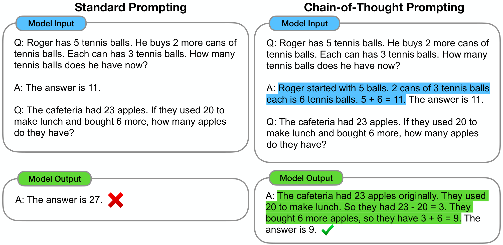
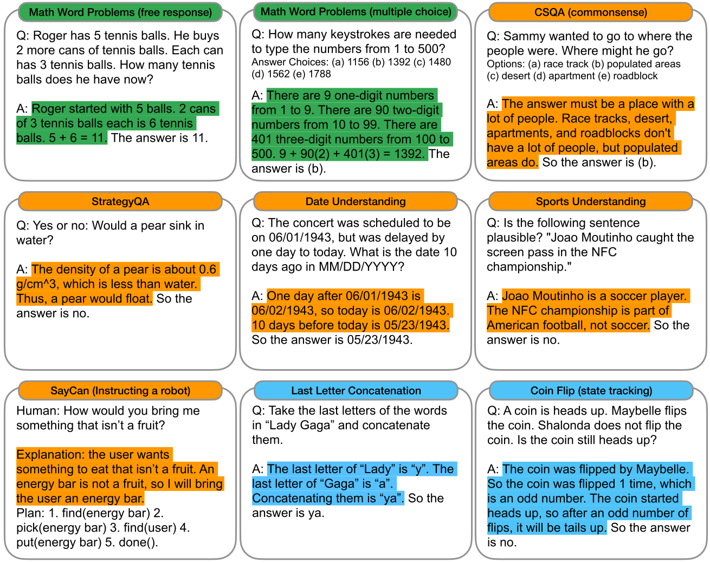

# 思维链提示：激发大语言模型的推理能力（中英对照）

> 论文标题：Chain-of-Thought Prompting Elicits Reasoning in Large Language Models
> 中文标题：思维链提示：激发大语言模型的推理能力
> 论文地址：https://arxiv.org/abs/2201.11903
> 发表：NeurIPS 2022
> 作者：Jason Wei, Xuezhi Wang, Dale Schuurmans, Maarten Bosma, Brian Ichter, Fei Xia, Ed Chi, Quoc Le, Denny Zhou 等（Google Research / Brain Team）
> 排版：每段英文原文在前，中文翻译紧随其后。本文收录正文（第 1–8 节与致谢）；附录 A–H 与提交清单（Checklist）未收录。

---

## 1 引言（Introduction）

The NLP landscape has recently been revolutionized by language models (Peters et al. 2018; Devlin et al. 2019; Brown et al. 2020, inter alia). Scaling up the size of language models has been shown to confer a range of benefits, such as improved performance and sample efficiency (Kaplan et al. 2020; Brown et al. 2020, inter alia). However, scaling up model size alone has not proved sufficient for achieving high performance on challenging tasks such as arithmetic, commonsense, and symbolic reasoning (Rae et al. 2021).

近年来，语言模型彻底改变了自然语言处理（NLP）的格局（Peters et al. 2018；Devlin et al. 2019；Brown et al. 2020 等）。研究表明，扩大语言模型的规模能带来一系列好处，例如性能提升和样本效率提高（Kaplan et al. 2020；Brown et al. 2020 等）。然而，仅仅扩大模型规模，还不足以在算术、常识和符号推理这类具有挑战性的任务上取得高性能（Rae et al. 2021）。

This work explores how the reasoning ability of large language models can be unlocked by a simple method motivated by two ideas. First, techniques for arithmetic reasoning can benefit from generating natural language rationales that lead to the final answer. Prior work has given models the ability to generate natural language intermediate steps by training from scratch (Ling et al. 2017) or finetuning a pretrained model (Cobbe et al. 2021), in addition to neuro-symbolic methods that use formal languages instead of natural language (Roy and Roth 2015; Chiang and Chen 2019; Amini et al. 2019; Chen et al. 2019). Second, large language models offer the exciting prospect of in-context few-shot learning via *prompting*. That is, instead of finetuning a separate language model checkpoint for each new task, one can simply "prompt" the model with a few input–output exemplars demonstrating the task. Remarkably, this has been successful for a range of simple question-answering tasks (Brown et al. 2020).

这项工作探索如何用一种受两个想法启发的简单方法，解锁大语言模型的推理能力。第一，算术推理技术可以受益于生成通向最终答案的自然语言理由（rationale）。先前的工作通过从头训练（Ling et al. 2017）或微调预训练模型（Cobbe et al. 2021）赋予了模型生成自然语言中间步骤的能力，此外还有使用形式语言而非自然语言的神经符号方法（neuro-symbolic methods）（Roy and Roth 2015；Chiang and Chen 2019；Amini et al. 2019；Chen et al. 2019）。第二，大语言模型提供了通过*提示*（prompting）进行上下文内少样本学习（in-context few-shot learning）的诱人前景。也就是说，不必为每个新任务微调一个独立的语言模型检查点，只需用少量演示该任务的输入–输出示例"提示"模型即可。值得注意的是，这在许多简单问答任务上已经取得了成功（Brown et al. 2020）。

Both of the above ideas, however, have key limitations. For rationale-augmented training and finetuning methods, it is costly to create a large set of high quality rationales, which is much more complicated than simple input–output pairs used in normal machine learning. For the traditional few-shot prompting method used in (Brown et al. 2020) , it works poorly on tasks that require reasoning abilities, and often does not improve substantially with increasing language model scale (Rae et al. 2021) . In this paper, we combine the strengths of these two ideas in a way that avoids their limitations. Specifically, we explore the ability of language models to perform few-shot prompting for reasoning tasks, given a prompt that consists of triples: $\langle$ input, *chain of thought* , output $\rangle$ . A *chain of thought* is a series of intermediate natural language reasoning steps that lead to the final output, and we refer to this approach as chain-of-thought prompting . An example prompt is shown in Figure 1 .

然而，上述两个想法都有关键的局限。对于带理由增强的训练与微调方法，创建大量高质量理由的成本很高，这比普通机器学习中使用的简单输入–输出对复杂得多。而对于（Brown et al. 2020）中使用的传统少样本提示方法，它在需要推理能力的任务上表现不佳，而且往往不会随着语言模型规模的增大而有明显改进（Rae et al. 2021）。在本文中，我们以避开这些局限的方式，把这两个想法的优点结合起来。具体来说，我们探索语言模型在给定由三元组组成的提示时，对推理任务进行少样本提示的能力：$\langle$ 输入（input）、*思维链*（chain of thought）、输出（output）$\rangle$。*思维链*是通向最终输出的一系列中间自然语言推理步骤；我们把这种方法称为思维链提示（chain-of-thought prompting）。图 1 展示了一个示例提示。

**Figure 1:** Chain-of-thought prompting enables large language models to tackle complex arithmetic, commonsense, and symbolic reasoning tasks. Chain-of-thought reasoning processes are highlighted.

**图 1：**思维链提示使大语言模型能够解决复杂的算术、常识和符号推理任务。图中高亮了思维链推理过程。

We present empirical evaluations on arithmetic, commonsense, and symbolic reasoning benchmarks, showing that chain-of-thought prompting outperforms standard prompting, sometimes to a striking degree. Figure 2 illustrates one such result—on the GSM8K benchmark of math word problems (Cobbe et al. 2021) , chain-of-thought prompting with PaLM 540B outperforms standard prompting by a large margin and achieves new state-of-the-art performance. A prompting only approach is important because it does not require a large training dataset and because a single model checkpoint can perform many tasks without loss of generality. This work underscores how large language models can learn via a few examples with natural language data about the task (c.f. automatically learning the patterns underlying inputs and outputs via a large training dataset).

我们在算术、常识和符号推理基准上进行了实证评估，表明思维链提示优于标准提示，有时提升幅度相当惊人。图 2 展示了其中一个结果——在数学应用题基准 GSM8K 上（Cobbe et al. 2021），PaLM 540B 使用思维链提示大幅超过标准提示，并达到了新的最先进水平。纯提示方法之所以重要，是因为它不需要大规模训练数据集，而且同一个模型检查点无需损失通用性就能完成许多任务。这项工作强调了：大语言模型可以仅凭少量示例、借助关于任务的自然语言数据来学习（对比：通过大规模训练数据集自动学习输入输出背后的模式）。

**Figure 2:** PaLM 540B uses chain-of-thought prompting to achieve new state-of-the-art performance on the GSM8K benchmark of math word problems. Finetuned GPT-3 and prior best are from (Cobbe et al. 2021) .

**图 2：**PaLM 540B 借助思维链提示，在数学应用题基准 GSM8K 上取得了新的最先进成绩。微调后的 GPT-3 与先前的最高纪录来自（Cobbe et al. 2021）。

---

## 2 思维链提示（Chain-of-Thought Prompting）

Consider one's own thought process when solving a complicated reasoning task such as a multi-step math word problem. It is typical to decompose the problem into intermediate steps and solve each before giving the final answer: "After Jane gives 2 flowers to her mom she has 10 $\ldots$ then after she gives 3 to her dad she will have 7 $\ldots$ so the answer is 7." The goal of this paper is to endow language models with the ability to generate a similar chain of thought —a coherent series of intermediate reasoning steps that lead to the final answer for a problem. We will show that sufficiently large language models can generate chains of thought if demonstrations of chain-of-thought reasoning are provided in the exemplars for few-shot prompting.

想想你自己在解决多步数学应用题这类复杂推理任务时的思考过程。通常的做法是先把问题分解成中间步骤，逐一解决后再给出最终答案："简把 2 朵花给了妈妈后还剩 10 朵 $\ldots$ 然后她给爸爸 3 朵后还剩 7 朵 $\ldots$ 所以答案是 7。"本文的目标是赋予语言模型生成类似思维链的能力——一系列连贯的中间推理步骤，通向问题的最终答案。我们将证明：只要在少样本提示的示例中提供思维链推理的示范，足够大的语言模型就能生成思维链。

Figure 1 shows an example of a model producing a chain of thought to solve a math word problem that it would have otherwise gotten incorrect. The chain of thought in this case resembles a solution and can interpreted as one, but we still opt to call it a chain of thought to better capture the idea that it mimics a step-by-step thought process for arriving at the answer (and also, solutions/explanations typically come after the final answer (Narang et al. 2020; Wiegreffe et al. 2022; Lampinen et al. 2022, inter alia) ).

图 1 展示了一个模型生成思维链、从而解决一道原本会答错的数学应用题的示例。这里的思维链看起来像一份解答，也可以当作解答来理解，但我们仍然选择称它为思维链，以更好地表达"它模仿的是逐步得出答案的思考过程"这一含义（另外，解答/解释通常是在最终答案之后才给出的（Narang et al. 2020；Wiegreffe et al. 2022；Lampinen et al. 2022 等））。

Chain-of-thought prompting has several attractive properties as an approach for facilitating reasoning in language models.

作为促进语言模型推理的方法，思维链提示具有几个吸引人的性质。

1. First, chain of thought, in principle, allows models to decompose multi-step problems into intermediate steps, which means that additional computation can be allocated to problems that require more reasoning steps.
2. Second, a chain of thought provides an interpretable window into the behavior of the model, suggesting how it might have arrived at a particular answer and providing opportunities to debug where the reasoning path went wrong (although fully characterizing a model's computations that support an answer remains an open question).
3. Third, chain-of-thought reasoning can be used for tasks such as math word problems, commonsense reasoning, and symbolic manipulation, and is potentially applicable (at least in principle) to any task that humans can solve via language.
4. Finally, chain-of-thought reasoning can be readily elicited in sufficiently large off-the-shelf language models simply by including examples of chain of thought sequences into the exemplars of few-shot prompting.

1. 第一，思维链原则上允许模型把多步问题分解为中间步骤，这意味着可以把额外的计算量分配给需要更多推理步骤的问题。
2. 第二，思维链为理解模型的行为提供了一个可解释的窗口：它可以提示模型是如何得出某个答案的，并为调试推理路径出错之处提供了机会（尽管要完整刻画支撑某个答案的模型内部计算，仍是一个开放问题）。
3. 第三，思维链推理可用于数学应用题、常识推理和符号操作等任务，并且（至少在原则上）可能适用于人类能用语言解决的任何任务。
4. 最后，只需在少样本提示的示例中纳入思维链序列的例子，就可以在足够大的现成（off-the-shelf）语言模型中轻易地引出思维链推理。

In empirical experiments, we will observe the utility of chain-of-thought prompting for arithmetic reasoning ( Section 3 ), commonsense reasoning ( Section 4 ), and symbolic reasoning ( Section 5 ).

在实证实验中，我们将观察到思维链提示对算术推理（第 3 节）、常识推理（第 4 节）和符号推理（第 5 节）的效用。

---

## 3 算术推理（Arithmetic Reasoning）

We begin by considering math word problems of the form in Figure 1 , which measure the arithmetic reasoning ability of language models. Though simple for humans, arithmetic reasoning is a task where language models often struggle (Hendrycks et al. 2021; Patel et al. 2021, inter alia) . Strikingly, chain-of-thought prompting when used with the 540B parameter language model performs comparably with task-specific finetuned models on several tasks, even achieving new state of the art on the challenging GSM8K benchmark (Cobbe et al. 2021) .

我们首先考虑图 1 中那种形式的数学应用题，它衡量语言模型的算术推理能力。尽管对人类来说很简单，算术推理却是语言模型常常力不从心的任务（Hendrycks et al. 2021；Patel et al. 2021 等）。引人注目的是，思维链提示与 540B 参数的语言模型搭配使用时，在多个任务上表现可与针对任务微调的模型相媲美，甚至在有挑战性的 GSM8K 基准上达到了新的最先进水平（Cobbe et al. 2021）。

**Figure 3:** Examples of $\langle$ input, chain of thought, output $\rangle$ triples for arithmetic, commonsense, and symbolic reasoning benchmarks. Chains of thought are highlighted. Full prompts in Appendix G .

**图 3：**算术、常识和符号推理基准上 $\langle$ 输入、思维链、输出 $\rangle$ 三元组的示例。图中高亮了思维链。完整提示见附录 G。

### 3.1 实验设置（Experimental Setup）

We explore chain-of-thought prompting for various language models on multiple benchmarks.

我们在多个基准上、针对多种语言模型探索思维链提示。

**Benchmarks.** We consider the following five math word problem benchmarks: **(1)** the **GSM8K** benchmark of math word problems (Cobbe et al. 2021) , **(2)** the **SVAMP** dataset of math word problems with varying structures (Patel et al. 2021) , **(3)** the **ASDiv** dataset of diverse math word problems (Miao et al. 2020) , **(4)** the **AQuA** dataset of algebraic word problems, and **(5)** the **MAWPS** benchmark (Koncel-Kedziorski et al. 2016) . Example problems are given in Appendix Table 12 .

**基准。**我们考虑以下五个数学应用题基准：**(1)** 数学应用题基准 **GSM8K**（Cobbe et al. 2021）；**(2)** 结构各异的数学应用题数据集 **SVAMP**（Patel et al. 2021）；**(3)** 多种多样数学应用题数据集 **ASDiv**（Miao et al. 2020）；**(4)** 代数应用题数据集 **AQuA**；**(5)** 基准 **MAWPS**（Koncel-Kedziorski et al. 2016）。示例问题见附录表 12。

**Standard prompting.** For the baseline, we consider standard few-shot prompting, popularized by (Brown et al. 2020) , in which a language model is given in-context exemplars of input–output pairs before outputting a prediction for a test-time example. Exemplars are formatted as questions and answers. The model gives the answer directly, as shown in Figure 1 (left).

**标准提示。**作为基线，我们采用（Brown et al. 2020）推广的标准少样本提示：在输出对测试时示例的预测之前，给语言模型提供输入–输出对的上下文示例。示例被格式化成问题和答案的形式，模型直接给出答案，如图 1（左）所示。

**Chain-of-thought prompting.** Our proposed approach is to augment each exemplar in few-shot prompting with a chain of thought for an associated answer, as illustrated in Figure 1 (right). As most of the datasets only have an evaluation split, we manually composed a set of eight few-shot exemplars with chains of thought for prompting— Figure 1 (right) shows one chain of thought exemplar, and the full set of exemplars is given in Appendix Table 20 . (These particular exemplars did not undergo prompt engineering; robustness is studied in Section 3.4 and Section A.2 .) To investigate whether chain-of-thought prompting in this form can successfully elicit successful reasoning across a range of math word problems, we used this single set of eight chain of thought exemplars for all benchmarks except AQuA, which is multiple choice instead of free response. For AQuA, we used four exemplars and solutions from the training set, as given in Appendix Table 21 .

**思维链提示。**我们提出的方法是给少样本提示中的每个示例都配上与答案相关联的思维链，如图 1（右）所示。由于大多数数据集只有评测划分（evaluation split），我们手工编写了一组八个带思维链的少样本示例用于提示——图 1（右）展示了一个思维链示例，完整示例集见附录表 20。（这些特定示例没有经过提示工程（prompt engineering）；稳健性在第 3.4 节和附录 A.2 中研究。）为了考察这种形式的思维链提示能否在一系列数学应用题上成功引出有效的推理，除 AQuA 外，我们在所有基准上都使用了这一组八个思维链示例；AQuA 是多项选择题而非自由作答。对于 AQuA，我们使用了训练集中的四个示例和解答，见附录表 21。

**Language models.** We evaluate five large language models. The first is **GPT-3** (Brown et al. 2020) , for which we use text-ada-001, text-babbage-001, text-curie-001, and text-davinci-002, which presumably correspond to InstructGPT models of 350M, 1.3B, 6.7B, and 175B parameters (Ouyang et al. 2022) .The second is **LaMDA** (Thoppilan et al. 2022) , which has models of 422M, 2B, 8B, 68B, and 137B parameters. The third is **PaLM** , which has models of 8B, 62B, and 540B parameters. The fourth is **UL2 20B** (Tay et al. 2022) , and the fifth is **Codex** (Chen et al. 2021 , code-davinci-002 in the OpenAI API) . We sample from the models via greedy decoding (though follow-up work shows chain-of-thought prompting can be improved by taking the majority final answer over many sampled generations (Wang et al. 2022a) ). For LaMDA, we report averaged results over five random seeds, where each seed had a different randomly shuffled order of exemplars. As LaMDA experiments did not show large variance among different seeds, to save compute we report results for a single exemplar order for all other models.

**语言模型。**我们评估五个大语言模型。第一个是 **GPT-3**（Brown et al. 2020），我们使用 text-ada-001、text-babbage-001、text-curie-001 和 text-davinci-002，它们大概对应 350M、1.3B、6.7B 和 175B 参数的 InstructGPT 模型（Ouyang et al. 2022）。第二个是 **LaMDA**（Thoppilan et al. 2022），有 422M、2B、8B、68B 和 137B 参数的模型。第三个是 **PaLM**，有 8B、62B 和 540B 参数的模型。第四个是 **UL2 20B**（Tay et al. 2022），第五个是 **Codex**（Chen et al. 2021，OpenAI API 中的 code-davinci-002）。我们通过贪心解码（greedy decoding）对模型采样（尽管后续工作表明，对多次采样生成取多数最终答案可以改进思维链提示（Wang et al. 2022a））。对于 LaMDA，我们报告五个随机种子的平均结果，每个种子的示例顺序随机打乱且各不相同。由于 LaMDA 实验在不同种子之间没有表现出大的方差，为节省计算量，其余所有模型我们都只报告单一示例顺序的结果。

### 3.2 结果（Results）

The strongest results of chain-of-thought prompting are summarized in Figure 4 , with all experimental outputs for each model collection, model size, and benchmark shown in Table 2 in the Appendix. There are three key takeaways. First, Figure 4 shows that chain-of-thought prompting is an emergent ability of model scale (Wei et al. 2022b) . That is, chain-of-thought prompting does not positively impact performance for small models, and only yields performance gains when used with models of $\sim$ 100B parameters. We qualitatively found that models of smaller scale produced fluent but illogical chains of thought, leading to lower performance than standard prompting.

思维链提示的最强结果汇总在图 4 中；各模型系列、模型规模和基准的全部实验输出见附录表 2。有三个关键要点。第一，图 4 显示思维链提示是模型规模的一种涌现能力（emergent ability）（Wei et al. 2022b）。也就是说，思维链提示对小型模型没有正面影响，只有在约 $\sim$ 100B 参数的模型上才会带来性能提升。我们定性地发现，规模较小的模型会生成流畅但不合逻辑的思维链，导致性能低于标准提示。

**Figure 4:** Chain-of-thought prompting enables large language models to solve challenging math problems. Notably, chain-of-thought reasoning is an emergent ability of increasing model scale. Prior best numbers are from (Cobbe et al. 2021) for GSM8K, (Jie et al. 2022) for SVAMP, and (Lan et al. 2021) for MAWPS.

**图 4：**思维链提示使大语言模型能够解决有挑战性的数学问题。值得注意的是，思维链推理是随模型规模增大而出现的一种涌现能力。先前的最高数字来自：GSM8K 为（Cobbe et al. 2021），SVAMP 为（Jie et al. 2022），MAWPS 为（Lan et al. 2021）。

Second, chain-of-thought prompting has larger performance gains for more-complicated problems. For instance, for GSM8K (the dataset with the lowest baseline performance), performance more than doubled for the largest GPT and PaLM models. On the other hand, for SingleOp, the easiest subset of MAWPS which only requires a single step to solve, performance improvements were either negative or very small (see Appendix Table 3 ).

第二，对于更复杂的问题，思维链提示带来的性能提升更大。例如在 GSM8K（基线性能最低的数据集）上，最大的 GPT 和 PaLM 模型的性能提高了一倍以上。另一方面，对于 SingleOp——MAWPS 中最容易、只需单步即可求解的子集——性能提升要么为负，要么非常小（见附录表 3）。

Third, chain-of-thought prompting via GPT-3 175B and PaLM 540B compares favorably to prior state of the art, which typically finetunes a task-specific model on a labeled training dataset. Figure 4 shows how PaLM 540B uses chain-of-thought prompting to achieve new state of the art on GSM8K, SVAMP, and MAWPS (though note that standard prompting already passed the prior best for SVAMP). On the other two datasets, AQuA and ASDiv, PaLM with chain-of-thought prompting reaches within 2% of the state of the art (Appendix Table 2 ).

第三，通过 GPT-3 175B 和 PaLM 540B 进行思维链提示，与先前的最先进方法相比也毫不逊色——先前的方法通常是在带标注的训练数据集上微调任务专属模型。图 4 展示了 PaLM 540B 如何借助思维链提示在 GSM8K、SVAMP 和 MAWPS 上达到新的最先进水平（不过请注意，标准提示在 SVAMP 上已经超过了先前的最高纪录）。在另外两个数据集 AQuA 和 ASDiv 上，PaLM 使用思维链提示的成绩距最先进水平不到 2%（附录表 2）。

To better understand why chain-of-thought prompting works, we manually examined model-generated chains of thought by LaMDA 137B for GSM8K. Of 50 random examples where the model returned the correct final answer, all of the generated chains of thought were also logically and mathematically correct except two that coincidentally arrived at the correct answer (see Section D.1 , and Table 8 for examples of correct model-generated chains of thought). We also randomly examined 50 random samples for which the model gave the wrong answer. The summary of this analysis is that 46% of the chains of thought were almost correct, barring minor mistakes (calculator error, symbol mapping error, or one reasoning step missing), and that the other 54% of the chains of thought had major errors in semantic understanding or coherence (see Section D.2 ). To provide a small insight into why scaling improves chain-of-thought reasoning ability, we performed a similar analysis of errors made by PaLM 62B and whether those errors were fixed by scaling to PaLM 540B. The summary is that scaling PaLM to 540B fixes a large portion of one-step missing and semantic understanding errors in the 62B model (see Section A.1 ).

为了更好地理解思维链提示为什么有效，我们人工检查了 LaMDA 137B 在 GSM8K 上生成的思维链。在模型给出正确最终答案的 50 个随机样本中，除两个碰巧得到正确答案的例子外，其余生成的思维链在逻辑和数学上也都是正确的（见附录 D.1；正确的模型生成思维链示例见表 8）。我们还随机检查了 50 个模型给出错误答案的样本。这项分析的总结是：46% 的思维链除了一些小错误（计算器错误、符号映射错误，或缺少一个推理步骤）外几乎正确，其余 54% 的思维链在语义理解或连贯性上有重大错误（见附录 D.2）。为了对"扩展规模为何能提升思维链推理能力"提供一点洞见，我们对 PaLM 62B 所犯的错误做了类似分析，考察这些错误是否在扩展到 PaLM 540B 后被修复。总结是：把 PaLM 扩展到 540B 修复了 62B 模型中很大一部分"缺少一步"和"语义理解"类错误（见附录 A.1）。

### 3.3 消融研究（Ablation Study）

The observed benefits of using chain-of-thought prompting raises the natural question of whether the same performance improvements can be conferred via other types of prompting. Figure 5 shows an ablation study with three variations of chain of thought described below.

使用思维链提示观察到的收益引出了一个自然的问题：其他类型的提示能否带来同样的性能提升？图 5 展示了一项包含下面三种思维链变体的消融研究。

**Equation only.** One reason for why chain-of-thought prompting might help is that it produces the mathematical equation to be evaluated, and so we test a variation where the model is prompted to output only a mathematical equation before giving the answer. Figure 5 shows that equation only prompting does not help much for GSM8K, which implies that the semantics of the questions in GSM8K are too challenging to directly translate into an equation without the natural language reasoning steps in chain of thought. For datasets of one-step or two-step problems, however, we find that equation only prompting does improve performance, since the equation can be easily derived from the question (see Appendix Table 6 ).

**仅方程（Equation only）。**思维链提示之所以可能有用，一个原因是它产生了待计算的数学方程，因此我们测试一种变体：提示模型在给出答案前只输出一个数学方程。图 5 显示，仅方程提示对 GSM8K 帮助不大，这说明 GSM8K 中问题的语义太过复杂，没有思维链中的自然语言推理步骤，难以直接转化为方程。然而，对于一步或两步问题的数据集，我们发现仅方程提示确实能提升性能，因为方程可以很容易地从问题中推导出来（见附录表 6）。

**Figure 5:** Ablation study for different variations of prompting using LaMDA 137B and PaLM 540B. Results for other datasets are given in Appendix Table 6 and Table 7 .

**图 5：**使用 LaMDA 137B 和 PaLM 540B 对不同提示变体进行的消融研究。其他数据集的结果见附录表 6 和表 7。

**Variable compute only.** Another intuition is that chain of thought allows the model to spend more computation (i.e., intermediate tokens) on harder problems. To isolate the effect of variable computation from chain-of-thought reasoning, we test a configuration where the model is prompted to output a only sequence of dots ( $\ldots$ ) equal to the number of characters in the equation needed to solve the problem. This variant performs about the same as the baseline, which suggests that variable computation by itself is not the reason for the success of chain-of-thought prompting, and that there appears to be utility from expressing intermediate steps via natural language.

**仅可变计算量（Variable compute only）。**另一种直觉是：思维链允许模型把更多计算量（即中间 token）花在更困难的问题上。为了把"可变计算量"的影响从思维链推理中分离出来，我们测试一种配置：提示模型只输出一串点（$\ldots$），点的数量等于求解该问题所需方程的字符数。这一变体的表现与基线大致相同，这表明仅凭可变计算量并不是思维链提示成功的原因，而且用自然语言表达中间步骤似乎确有价值。

**Chain of thought after answer.** Another potential benefit of chain-of-thought prompting could simply be that such prompts allow the model to better access relevant knowledge acquired during pretraining. Therefore, we test an alternative configuration where the chain of thought prompt is only given after the answer, isolating whether the model actually depends on the produced chain of thought to give the final answer. This variant performs about the same as the baseline, which suggests that the sequential reasoning embodied in the chain of thought is useful for reasons beyond just activating knowledge.

**答案后思维链（Chain of thought after answer）。**思维链提示的另一个潜在好处可能仅仅是：这类提示让模型能更好地访问预训练中获得的相关知识。因此，我们测试另一种配置：只在答案之后才给出思维链提示，从而分离出"模型是否真的依赖生成的思维链来给出最终答案"这一因素。这一变体的表现与基线大致相同，这表明思维链中蕴含的序列推理之所以有用，原因不止是激活知识。

**Figure 6:** Chain-of-thought prompting has variance for different prompt examples (as expected) but outperforms standard prompting for various annotators as well as for different exemplars.

**图 6：**思维链提示对不同提示示例存在方差（符合预期），但无论是对不同的标注者（annotator）还是不同的示例，它都优于标准提示。

### 3.4 思维链的稳健性（Robustness of Chain of Thought）

Sensitivity to exemplars is a key consideration of prompting approaches—for instance, varying the permutation of few-shot exemplars can cause the accuracy of GPT-3 on SST-2 to range from near chance (54.3%) to near state of the art (93.4%) (Zhao et al. 2021) . In this final subsection, we evaluate robustness to chains of thought written by different annotators. In addition to the results above, which used chains of thought written by an Annotator A, two other co-authors of this paper (Annotators B and C) independently wrote chains of thought for the same few-shot exemplars (shown in Appendix H ). Annotator A also wrote another chain of thought that was more concise than the original, following the style of solutions given in (Cobbe et al. 2021) .[^1]

对示例的敏感性是提示方法的一个关键考量——例如，改变少样本示例的排列顺序，可能使 GPT-3 在 SST-2 上的准确率从接近随机（54.3%）一路波动到接近最先进水平（93.4%）（Zhao et al. 2021）。在这最后一个小节里，我们评估模型对不同标注者所写思维链的稳健性。除了上述使用标注者 A（Annotator A）所写思维链的结果之外，本文的另外两位合著者（标注者 B 和 C）也为同样的少样本示例独立编写了思维链（见附录 H）。标注者 A 还按照（Cobbe et al. 2021）中解答的风格，写了另一条比原始版本更简洁的思维链。[^1]

[^1]: 例如，原始思维链使用几个短句（"原来有 9 台电脑。连续 4 天，每天又加了 5 台。所以 5 * 4 = 20 台电脑被加入。9 + 20 是 29。"），而简洁版思维链则写成"新增了 5 * 4 = 20 台电脑。所以服务器房里现在有 9 + 20 = 29 台电脑"。

Figure 6 shows these results for LaMDA 137B on GSM8K and MAWPS (ablation results for other datasets are given in Appendix Table 6 / Table 7 ). Although there is variance among different chain of thought annotations, as would be expected when using exemplar-based prompting (Le Scao and Rush 2021; Reynolds and McDonell 2021; Zhao et al. 2021) , all sets of chain of thought prompts outperform the standard baseline by a large margin. This result implies that successful use of chain of thought does not depend on a particular linguistic style.

图 6 展示了 LaMDA 137B 在 GSM8K 和 MAWPS 上的这些结果（其他数据集的消融结果见附录表 6 / 表 7）。尽管不同的思维链标注之间存在方差——这在基于示例的提示中是意料之中的（Le Scao and Rush 2021；Reynolds and McDonell 2021；Zhao et al. 2021）——所有组的思维链提示都以很大优势超过了标准基线。这个结果说明，成功使用思维链并不依赖于某种特定的语言风格。

To confirm that successful chain-of-thought prompting works for other sets of exemplars, we also run experiments with three sets of eight exemplars randomly sampled from the GSM8K training set, an independent source (examples in this dataset already included reasoning steps like a chain of thought).[^2] Figure 6 shows that these prompts performed comparably with our manually written exemplars, also substantially outperforming standard prompting.

为了确认成功的思维链提示对其他示例集也有效，我们还用三组从 GSM8K 训练集中随机采样的八个示例进行了实验——这是一个独立的来源（该数据集中的示例本身就包含类似思维链的推理步骤）。[^2] 图 6 显示，这些提示的表现与我们手工编写的示例相当，也大幅超过了标准提示。

[^2]: 我们采样不超过 $\leq$ 60 个 token 的示例以放入输入上下文窗口，并把示例限制为 $\leq$ 2 步可解，以便与我们编写的八个示例进行公平比较。

In addition to robustness to annotators, independently-written chains of thought, different exemplars, and various language models, we also find that chain-of-thought prompting for arithmetic reasoning is robust to different exemplar orders and varying numbers of exemplars (see Section A.2 ).

除了对标注者、独立编写的思维链、不同示例和多种语言模型具有稳健性之外，我们还发现：用于算术推理的思维链提示，对不同示例顺序和不同数量的示例也具有稳健性（见附录 A.2）。

---

## 4 常识推理（Commonsense Reasoning）

Although chain of thought is particularly suitable for math word problems, the language-based nature of chain of thought actually makes it applicable to a broad class of commonsense reasoning problems, which involve reasoning about physical and human interactions under the presumption of general background knowledge. Commonsense reasoning is key for interacting with the world and is still beyond the reach of current natural language understanding systems (Talmor et al. 2021) .

尽管思维链特别适合数学应用题，但思维链基于语言的本质使它实际上适用于一大类常识推理问题——这类问题需要在一般背景知识的假设下，对物理和人类互动进行推理。常识推理对于与世界交互至关重要，而且仍然超出当前自然语言理解系统的能力范围（Talmor et al. 2021）。

**Benchmarks.** We consider five datasets covering a diverse range of commonsense reasoning types. The popular **CSQA** (Talmor et al. 2019) asks commonsense questions about the world involving complex semantics that often require prior knowledge. **StrategyQA** (Geva et al. 2021) requires models to infer a multi-hop strategy to answer questions. We choose two specialized evaluation sets from the BIG-bench effort (BIG-bench collaboration 2021) : **Date** Understanding, which involves inferring a date from a given context, and **Sports** Understanding, which involves determining whether a sentence relating to sports is plausible or implausible. Finally, the **SayCan** dataset (Ahn et al. 2022) involves mapping a natural language instruction to a sequence of robot actions from a discrete set. Figure 3 shows examples with chain of thought annotations for all datasets.

**基准。**我们考虑五个涵盖多种常识推理类型的数据集。广受欢迎的 **CSQA**（Talmor et al. 2019）提出关于世界的常识问题，涉及通常需要先验知识的复杂语义。**StrategyQA**（Geva et al. 2021）要求模型推断多跳（multi-hop）策略来回答问题。我们从 BIG-bench 项目（BIG-bench collaboration 2021）中选择两个专门的评测集：**日期**理解（Date Understanding），涉及从给定上下文中推断日期；以及**体育**理解（Sports Understanding），涉及判断与体育相关的句子是否合理。最后，**SayCan** 数据集（Ahn et al. 2022）涉及把自然语言指令映射为来自离散集合的一组机器人动作。图 3 展示了所有这些数据集的带思维链标注示例。

**Prompts.** We follow the same experimental setup as the prior section. For CSQA and StrategyQA, we randomly selected examples from the training set and manually composed chains of thought for them to use as few-shot exemplars. The two BIG-bench tasks do not have training sets, so we selected the first ten examples as exemplars in the evaluation set as few-shot exemplars and report numbers on the rest of the evaluation set. For SayCan, we use six examples from the training set used in (Ahn et al. 2022) and also manually composed chains of thought.

**提示。**我们沿用前一节的实验设置。对于 CSQA 和 StrategyQA，我们从训练集中随机选取示例，并为其手工编写思维链作为少样本示例。两个 BIG-bench 任务没有训练集，因此我们选取评测集中的前十个示例作为少样本示例，并在评测集的其余部分上报告结果。对于 SayCan，我们使用（Ahn et al. 2022）所用训练集中的六个示例，也手工编写了思维链。

**Results.** Figure 7 highlights these results for PaLM (full results for LaMDA, GPT-3, and different model scales are shown in Table 4 ). For all tasks, scaling up model size improved the performance of standard prompting; chain-of-thought prompting led to further gains, with improvements appearing to be largest for PaLM 540B. With chain-of-thought prompting, PaLM 540B achieved strong performance relative to baselines, outperforming the prior state of the art on StrategyQA (75.6% vs 69.4%) and outperforming an unaided sports enthusiast on sports understanding (95.4% vs 84%). These results demonstrate that chain-of-thought prompting can also improve performance on tasks requiring a range of commonsense reasoning abilities (though note that gain was minimal on CSQA).

**结果。**图 7 重点展示了 PaLM 的这些结果（LaMDA、GPT-3 及不同模型规模的完整结果见表 4）。对所有任务而言，扩大模型规模都提升了标准提示的性能；思维链提示带来了进一步的提升，其中 PaLM 540B 的提升幅度似乎最大。使用思维链提示时，PaLM 540B 相对基线取得了强劲表现：在 StrategyQA 上超过了先前的最先进水平（75.6% 对 69.4%），在体育理解上超过了不借助工具的体育爱好者（95.4% 对 84%）。这些结果表明，思维链提示也能提升需要一系列常识推理能力任务的性能（不过请注意，在 CSQA 上的提升很小）。

**Figure 7:** Chain-of-thought prompting also improves the commonsense reasoning abilities of language models. The language model shown here is PaLM. Prior best numbers are from the leaderboards of CSQA (Talmor et al. 2019) and StrategyQA (Geva et al. 2021) (single-model only, as of May 5, 2022). Additional results using various sizes of LaMDA, GPT-3, and PaLM are shown in Table 4 .

**图 7：**思维链提示还提升了语言模型的常识推理能力。这里展示的语言模型是 PaLM。先前的最高数字来自 CSQA（Talmor et al. 2019）和 StrategyQA（Geva et al. 2021）的排行榜（仅单模型，截至 2022 年 5 月 5 日）。使用不同规模 LaMDA、GPT-3 和 PaLM 的更多结果见表 4。

**Figure 8:** Using chain-of-thought prompting facilitates generalization to longer sequences in two symbolic reasoning tasks.

**图 8：**在两项符号推理任务中，使用思维链提示有助于向更长的序列泛化。

---

## 5 符号推理（Symbolic Reasoning）

Our final experimental evaluation considers symbolic reasoning, which is simple for humans but potentially challenging for language models. We show that chain-of-thought prompting not only enables language models to perform symbolic reasoning tasks that are challenging in the standard prompting setting, but also facilitates length generalization to inference-time inputs longer than those seen in the few-shot exemplars.

我们最后的实验评估考虑符号推理——对人类来说很简单，但对语言模型可能很有挑战性。我们表明，思维链提示不仅让语言模型能够完成在标准提示设定下具有挑战性的符号推理任务，还促进了向比少样本示例更长的推理时输入的长度泛化（length generalization）。

#### Tasks.

**任务。**

We use the following two toy tasks.

我们使用以下两个玩具任务（toy task）。

- **Last letter concatenation.** This task asks the model to concatenate the last letters of words in a name (e.g., "Amy Brown" $\rightarrow$ "yn" ). It is a more challenging version of first letter concatenation, which language models can already perform without chain of thought.[^3] We generate full names by randomly concatenating names from the top one-thousand first and last names from name census data ( https://namecensus.com/ ).
- **Coin flip.** This task asks the model to answer whether a coin is still heads up after people either flip or don't flip the coin (e.g., "A coin is heads up. Phoebe flips the coin. Osvaldo does not flip the coin. Is the coin still heads up?" $\rightarrow$ "no" ).

- **末字母拼接（Last letter concatenation）。**这个任务要求模型拼接名字中各单词的末字母（例如，"Amy Brown" $\rightarrow$ "yn"）。它是首字母拼接（first letter concatenation）更具挑战性的版本——语言模型无需思维链就能完成首字母拼接。[^3] 我们通过从人口普查数据（https://namecensus.com/）中排名前一千的名字和姓氏中随机拼接，来生成全名。
- **掷硬币（Coin flip）。**这个任务要求模型回答：在人们翻转或不翻转硬币之后，硬币是否仍然正面朝上（例如，"一枚硬币正面朝上。Phoebe 翻转了硬币。Osvaldo 没有翻转硬币。硬币还是正面朝上吗？" $\rightarrow$ "否"）。

[^3]: 我们用 GPT-3 的 `davinci` 测试了 10 个常见名字，除一个外全部正确。

As the construction of these symbolic reasoning tasks is well-defined, for each task we consider an in-domain test set for which examples had the same number of steps as the training/few-shot exemplars, as well as an out-of-domain (OOD) test set, for which evaluation examples had more steps than those in the exemplars. For last letter concatenation, the model only sees exemplars of names with two words, and then performs last letter concatenation on names with 3 and 4 words.[^4] We do the same for the number of potential flips in the coin flip task. Our experimental setup uses the same methods and models as in the prior two sections. We again manually compose chains of thought for the few-shot exemplars for each task, which are given in Figure 3 .

由于这些符号推理任务的构造是明确定义的，对每个任务，我们既考虑一个域内（in-domain）测试集——其中的示例与训练/少样本示例步数相同；也考虑一个域外（OOD）测试集——其中的评测示例比示例中的步数更多。对于末字母拼接，模型只看到两个词的名字示例，然后在 3 词和 4 词的名字上执行末字母拼接。[^4] 对于掷硬币任务中可能的翻转次数，我们也做同样的处理。我们的实验设置与前两节使用相同的方法和模型。我们同样为每个任务的少样本示例手工编写思维链，见图 3。

[^4]: 对于长度超过 2 个词的名字，我们把多个名字和姓氏拼接在一起。

#### Results.

**结果。**

The results of these in-domain and OOD evaluations are shown in Figure 8 for PaLM, with results for LaMDA shown in Appendix Table 5 . With PaLM 540B, chain-of-thought prompting leads to almost 100% solve rates (note that standard prompting already solves coin flip with PaLM 540, though not for LaMDA 137B). Note that these in-domain evaluations are "toy tasks" in the sense that perfect solution structures are already provided by the chains of thought in the few-shot exemplars; all the model has to do is repeat the same steps with the new symbols in the test-time example. And yet, small models still fail—the ability to perform abstract manipulations on unseen symbols for these three tasks only arises at the scale of 100B model parameters.

这些域内和域外评估的结果，PaLM 见图 8，LaMDA 的结果见附录表 5。使用 PaLM 540B 时，思维链提示带来了接近 100% 的解题率（注意：标准提示在 PaLM 540B 上已经能解决掷硬币任务，但在 LaMDA 137B 上不行）。请注意，这些域内评估是"玩具任务"：完美的解题结构已经由少样本示例中的思维链提供了，模型要做的只是在测试时示例中把同样的步骤套用到新的符号上。然而，小模型仍然会失败——对这三个任务而言，对未见符号进行抽象操作的能力，只在 100B 模型参数规模时才出现。

As for the OOD evaluations, standard prompting fails for both tasks. With chain-of-thought prompting, language models achieve upward scaling curves (though performance is lower than in the in-domain setting). Hence, chain-of-thought prompting facilitates length generalization beyond seen chains of thought for language models of sufficient scale.

至于域外评估，标准提示在两个任务上都失败了。而借助思维链提示，语言模型获得了向上攀升的扩展曲线（尽管性能低于域内设定）。因此，思维链提示促进了足够规模的语言模型在所见思维链之外的长度泛化。

---

## 6 讨论（Discussion）

We have explored chain-of-thought prompting as a simple mechanism for eliciting multi-step reasoning behavior in large language models. We first saw that chain-of-thought prompting improves performance by a large margin on arithmetic reasoning, yielding improvements that are much stronger than ablations and robust to different annotators, exemplars, and language models ( Section 3 ). Next, experiments on commonsense reasoning underscored how the linguistic nature of chain-of-thought reasoning makes it generally applicable ( Section 4 ). Finally, we showed that for symbolic reasoning, chain-of-thought prompting facilitates OOD generalization to longer sequence lengths ( Section 5 ). In all experiments, chain-of-thought reasoning is elicited simply by prompting an off-the-shelf language model. No language models were finetuned in the process of writing this paper.

我们探索了思维链提示，把它作为一种在大语言模型中引出多步推理行为的简单机制。我们首先看到，思维链提示在算术推理上大幅提升了性能，其提升远强于消融变体，并且对不同的标注者、示例和语言模型都稳健（第 3 节）。接下来，常识推理的实验突显了思维链推理的语言学本质如何使它普遍适用（第 4 节）。最后，我们表明：对符号推理而言，思维链提示有助于向更长的序列长度进行 OOD 泛化（第 5 节）。在所有实验中，思维链推理都只是通过提示一个现成的语言模型而引出，在撰写本文的过程中没有任何语言模型被微调。

The emergence of chain-of-thought reasoning as a result of model scale has been a prevailing theme (Wei et al. 2022b) . For many reasoning tasks where standard prompting has a flat scaling curve, chain-of-thought prompting leads to dramatically increasing scaling curves. Chain-of-thought prompting appears to expand the set of tasks that large language models can perform successfully—in other words, our work underscores that standard prompting only provides a lower bound on the capabilities of large language models. This observation likely raises more questions than it answers—for instance, how much more can we expect reasoning ability to improve with a further increase in model scale? What other prompting methods might expand the range of tasks that language models can solve?

思维链推理作为模型规模的结果而涌现，一直是贯穿全文的主题（Wei et al. 2022b）。对许多标准提示扩展曲线平坦的推理任务，思维链提示带来了急剧上升的扩展曲线。思维链提示似乎扩大了大语言模型能成功完成的任务集合——换句话说，我们的工作强调：标准提示只能提供大语言模型能力的下界。这一观察引发的问题很可能比它回答的更多——例如，随着模型规模进一步增大，我们还能期待推理能力提升多少？还有哪些提示方法可能扩大语言模型能解决问题的范围？

As for limitations, we first qualify that although chain of thought emulates the thought processes of human reasoners, this does not answer whether the neural network is actually "reasoning," which we leave as an open question. Second, although the cost of manually augmenting exemplars with chains of thought is minimal in the few-shot setting, such annotation costs could be prohibitive for finetuning (though this could potentially be surmounted with synthetic data generation, or zero-shot generalization). Third, there is no guarantee of correct reasoning paths, which can lead to both correct and incorrect answers; improving factual generations of language models is an open direction for future work (Rashkin et al. 2021; Ye and Durrett 2022; Wiegreffe et al. 2022, inter alia) . Finally, the emergence of chain-of-thought reasoning only at large model scales makes it costly to serve in real-world applications; further research could explore how to induce reasoning in smaller models.

至于局限，我们首先说明：虽然思维链模仿了人类推理者的思考过程，但这并不能回答神经网络是否真的在"推理"，我们把这个留作开放问题。第二，虽然在少样本设定下手工为示例补充思维链的成本很小，但这种标注成本在微调场景下可能高得令人却步（尽管也许可以通过合成数据生成或零样本泛化来克服）。第三，推理路径的正确性没有保证，这既可能带来正确答案也可能带来错误答案；提升语言模型的事实性生成是未来工作的一个开放方向（Rashkin et al. 2021；Ye and Durrett 2022；Wiegreffe et al. 2022 等）。最后，思维链推理只在很大的模型规模下才出现，这使得它在真实应用中的部署成本很高；进一步研究可以探索如何在更小的模型中引出推理。

---

## 7 相关工作（Related Work）

This work is inspired by many research areas, which we detail in an extended related work section ( Appendix C ). Here we describe two directions and associated papers that are perhaps most relevant.

这项工作受到许多研究领域的启发，我们在扩展版相关工作一节（附录 C）中作了详细说明。这里我们介绍两个或许最相关的方向及其相关论文。

The first relevant direction is using intermediate steps to solve reasoning problems. (Ling et al. 2017) pioneer the idea of using natural language rationales to solve math word problems through a series of intermediate steps. Their work is a remarkable contrast to the literature using formal languages to reason (Roy et al. 2015; Chiang and Chen 2019; Amini et al. 2019; Chen et al. 2019) . (Cobbe et al. 2021) extend (Ling et al. 2017) by creating a larger dataset and using it to finetune a pretrained language model rather than training a model from scratch. In the domain of program synthesis, (Nye et al. 2021) leverage language models to predict the final outputs of Python programs via first line-to-line predicting the intermediate computational results, and show that their step-by-step prediction method performs better than directly predicting the final outputs.

第一个相关方向是用中间步骤解决推理问题。（Ling et al. 2017）开创了用自然语言理由通过一系列中间步骤解决数学应用题的想法。他们的工作与使用形式语言进行推理的文献形成了鲜明对比（Roy et al. 2015；Chiang and Chen 2019；Amini et al. 2019；Chen et al. 2019）。（Cobbe et al. 2021）扩展了（Ling et al. 2017）的工作：创建了一个更大的数据集，并用它微调预训练语言模型，而不是从头训练模型。在程序合成领域，（Nye et al. 2021）利用语言模型预测 Python 程序的最终输出，做法是先逐行预测中间计算结果，并表明这种逐步预测的方法优于直接预测最终输出。

Naturally, this paper also relates closely to the large body of recent work on prompting. Since the popularization of few-shot prompting as given by (Brown et al. 2020) , several general approaches have improved the prompting ability of models, such as automatically learning prompts (Lester et al. 2021) or giving models instructions describing a task (Wei et al. 2022a; Sanh et al. 2022; Ouyang et al. 2022) . Whereas these approaches improve or augment the input part of the prompt (e.g., instructions that are prepended to inputs), our work takes the orthogonal direction of augmenting the outputs of language models with a chain of thought.

自然，本文也与近期大量关于提示的工作密切相关。自从（Brown et al. 2020）普及少样本提示以来，已有几种通用方法提升了模型的提示能力，例如自动学习提示（Lester et al. 2021），或给模型提供描述任务的指令（Wei et al. 2022a；Sanh et al. 2022；Ouyang et al. 2022）。这些方法改进或增强的是提示的输入部分（例如前置到输入上的指令），而我们的工作走的是正交的方向——用思维链来增强语言模型的输出。

---

## 8 结论（Conclusions）

We have explored chain-of-thought prompting as a simple and broadly applicable method for enhancing reasoning in language models. Through experiments on arithmetic, symbolic, and commonsense reasoning, we find that chain-of-thought reasoning is an emergent property of model scale that allows sufficiently large language models to perform reasoning tasks that otherwise have flat scaling curves. Broadening the range of reasoning tasks that language models can perform will hopefully inspire further work on language-based approaches to reasoning.

我们探索了思维链提示，把它作为一种简单且广泛适用的、增强语言模型推理能力的方法。通过算术、符号和常识推理的实验，我们发现思维链推理是模型规模的一种涌现性质，它让足够大的语言模型能够完成那些否则扩展曲线平坦的推理任务。扩大语言模型能完成的推理任务范围，有望激励更多基于语言的方法去研究推理。

---

## 致谢（Acknowledgements）

We thank Jacob Devlin, Claire Cui, Andrew Dai, and Ellie Pavlick for providing feedback on the paper. We thank Jacob Austin, Yuhuai Wu, Henryk Michalewski, Aitor Lewkowycz, Charles Sutton, and Aakanksha Chowdhery for helpful discussions. We thank Sid Maxwell for notifying us about a mistake in the manual error analysis in the original manuscript.

我们感谢 Jacob Devlin、Claire Cui、Andrew Dai 和 Ellie Pavlick 对论文提出的反馈；感谢 Jacob Austin、Yuhuai Wu、Henryk Michalewski、Aitor Lewkowycz、Charles Sutton 和 Aakanksha Chowdhery 富有帮助的讨论；感谢 Sid Maxwell 提醒我们原始手稿中人工错误分析里的一处错误。

---

> 附录 A–H（常见问题、全部实验结果、扩展相关工作、补充分析、实现细节、输入输出示例、完整提示、MWP 备用标注者）及提交清单（Checklist）未收录，如需可补充。
