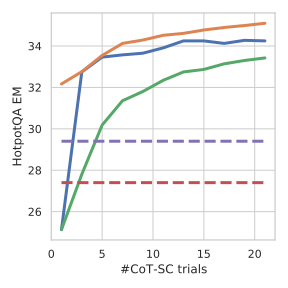
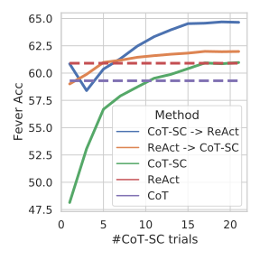
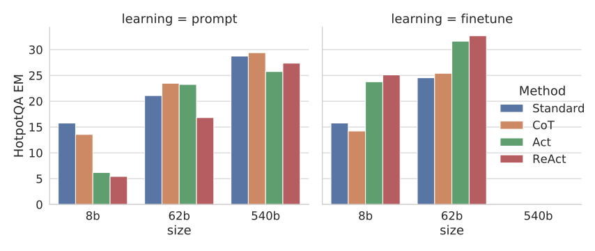
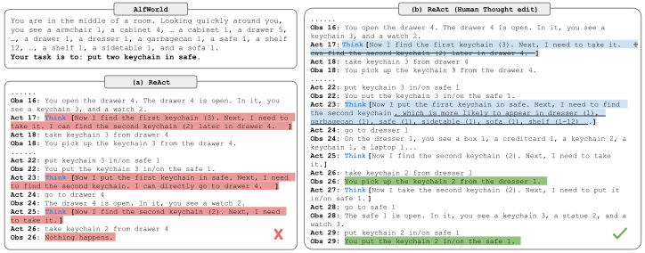

# ReAct：在语言模型中协同推理与行动（中英对照）

> 论文标题：ReAct: Synergizing Reasoning and Acting in Language Models
> 中文标题：ReAct：在语言模型中协同推理与行动
> 论文地址：https://arxiv.org/abs/2210.03629
> 项目主页：https://react-lm.github.io/
> 代码：https://github.com/ysymyth/ReAct
> 发表：ICLR 2023（Spotlight）
> 作者：Shunyu Yao, Jeffrey Zhao, Dian Yu, Nan Du 等（Princeton University + Google Research）
> 排版：每段英文原文在前，中文翻译紧随其后。本文收录正文（第 1–6 节与致谢）；附录 A–D（提示词与轨迹示例）未收录。

---

## 1 引言（Introduction）

A unique feature of human intelligence is the ability to seamlessly combine task-oriented actions with verbal reasoning (or inner speech, (Alderson-Day & Fernyhough 2015)), which has been theorized to play an important role in human cognition for enabling self-regulation or strategization ((Vygotsky 1987; Luria 1965; Fernyhough 2010)) and maintaining a working memory ((Baddeley 1992)). Consider the example of cooking up a dish in the kitchen. Between any two specific actions, we may reason in language in order to track progress ("now that everything is cut, I should heat up the pot of water"), to handle exceptions or adjust the plan according to the situation ("I don't have salt, so let me use soy sauce and pepper instead"), and to realize when external information is needed ("how do I prepare dough? Let me search on the Internet"). We may also act (open a cookbook to read the recipe, open the fridge, check ingredients) to support the reasoning and to answer questions ("What dish can I make right now?"). This tight synergy between "acting" and "reasoning" allows humans to learn new tasks quickly and perform robust decision making or reasoning, even under previously unseen circumstances or facing information uncertainties.

人类智能的一个独特之处，在于能够把面向任务的动作与言语推理（verbal reasoning，也称内心独白 inner speech）无缝地结合起来。（Alderson-Day & Fernyhough 2015）认为，这种能力在人类认知中扮演着重要角色，使我们能够进行自我调节或策略化（Vygotsky 1987；Luria 1965；Fernyhough 2010），并维持工作记忆（Baddeley 1992）。以在厨房做一道菜为例：在任意两个具体动作之间，我们都可能用语言进行推理，以跟踪进度（"既然都切好了，我应该把水烧上"），应对异常或根据情况调整计划（"没有盐了，那就改用酱油和胡椒吧"），以及意识到何时需要外部信息（"面团怎么和？让我上网搜一下"）。我们也会采取行动（翻开菜谱读做法、打开冰箱、检查食材）来支撑推理、回答问题（"我现在能做什么菜？"）。"行动"与"推理"之间这种紧密的协同，使人类能够快速学习新任务，并在前所未见的情境或面临信息不确定时，依然做出稳健的决策或推理。

Recent results have hinted at the possibility of combining verbal reasoning with interactive decision making in autonomous systems. On one hand, properly prompted large language models (LLMs) have demonstrated emergent capabilities to carry out several steps of reasoning traces to derive answers from questions in arithmetic, commonsense, and symbolic reasoning tasks (Wei et al. 2022). However, this "chain-of-thought" reasoning is a static black box, in that the model uses its own internal representations to generate thoughts and is not grounded in the external world, which limits its ability to reason reactively or update its knowledge. This can lead to issues like fact hallucination and error propagation over the reasoning process (Figure 1 (1b)). On the other hand, recent work has explored the use of pre-trained language models for planning and acting in interactive environments (Ahn et al. 2022; Nakano et al. 2021; Yao et al. 2020; Huang et al. 2022a), with a focus on predicting actions via language priors. These approaches usually convert multi-modal observations into text, use a language model to generate domain-specific actions or plans, and then use a controller to choose or execute them. However, they do not employ language models to reason abstractly about high-level goals or maintain a working memory to support acting, barring (Huang et al. 2022b) who perform a limited form of verbal reasoning to reiterate spatial facts about the current state. Beyond such simple embodied tasks to interact with a few blocks, there have not been studies on how reasoning and acting can be combined in a synergistic manner for general task solving, and if such a combination can bring systematic benefits compared to reasoning or acting alone.

近期的研究已经暗示，在自主系统中把言语推理与交互式决策结合起来是可能的。一方面，经过恰当提示的大型语言模型（LLM）展现了一种涌现能力：在算术、常识和符号推理任务中，通过多步推理轨迹（reasoning trace）从问题推导出答案（Wei et al. 2022）。然而，这种"思维链"（chain-of-thought）推理是一个静态的黑箱——模型利用自身的内部表征来生成想法，并不与外部世界相连，这限制了它进行反应式推理或更新知识的能力，还可能导致事实幻觉（hallucination）以及推理过程中错误的传播（图 1 (1b)）。另一方面，近期工作探索了在交互式环境中使用预训练语言模型进行规划与行动（Ahn et al. 2022; Nakano et al. 2021; Yao et al. 2020; Huang et al. 2022a），重点是用语言先验来预测动作。这些方法通常先把多模态观测转换为文本，再用语言模型生成特定领域的动作或计划，最后由一个控制器来挑选或执行它们。然而，除了（Huang et al. 2022b）会执行一种有限形式的言语推理、复述当前状态的时空事实之外，这些方法并不借助语言模型对高层目标进行抽象推理，也不维护用于支撑行动的工作记忆。除了与少量积木交互这类简单的具身任务之外，此前尚无研究探讨：推理与行动能否以协同的方式结合起来解决一般任务，以及相比单独推理或单独行动，这种结合能否带来系统性的收益。

**Figure 1:** (1) Comparison of four prompting methods, (a) `Standard`, (b) Chain-of-thought (`CoT`, Reason Only), (c) `Act`-only, and (d) `ReAct` (Reason+Act), solving a HotpotQA (Yang et al. 2018) question. (2) Comparison of (a) `Act`-only and (b) `ReAct` prompting methods to solve an interactive AlfWorld (Shridhar et al. 2020b) task. In both domains, we omit initial prompts of in-context examples, and only show task solving trajectories generated by the model (Act, Thought) and the environment (Obs).

**图 1：**（1）四种提示方法的比较：解决一个 HotpotQA（Yang et al. 2018）问题时，(a) 标准提示（`Standard`）、(b) 思维链（`CoT`，仅推理）、(c) 仅行动（`Act`-only）与 (d) ReAct（推理+行动）。(2) (a) 仅行动与 (b) ReAct 两种提示方法解决一个交互式 ALFWorld（Shridhar et al. 2020b）任务的比较。在两个领域中，我们都省略了上下文示例的初始提示，只展示模型（Act、Thought）与环境（Obs）生成的任务求解轨迹。

In this work, we present `ReAct`, a general paradigm to combine reasoning and acting with language models for solving diverse language reasoning and decision making tasks (Figure 1). `ReAct` prompts LLMs to generate both verbal reasoning traces and actions pertaining to a task in an interleaved manner, which allows the model to perform dynamic reasoning to create, maintain, and adjust high-level plans for acting (reason to act), while also interact with the external environments (e.g. Wikipedia) to incorporate additional information into reasoning (act to reason).

在这项工作中，我们提出了 `ReAct`——一种把推理与行动在语言模型中结合起来、以解决多样化语言推理与决策任务的通用范式（图 1）。`ReAct` 提示 LLM 以交错的方式同时生成与任务相关的言语推理轨迹和动作，这使得模型能够进行动态推理：为行动创建、维护并调整高层计划（先推理再行动，reason to act），同时也能与外部环境（例如维基百科）交互，把额外信息纳入推理（以行动促推理，act to reason）。

We conduct empirical evaluations of `ReAct` and state-of-the-art baselines on four diverse benchmarks: question answering (HotPotQA, (Yang et al. 2018)), fact verification (Fever, (Thorne et al. 2018)), text-based game (ALFWorld, (Shridhar et al. 2020b)), and webpage navigation (WebShop, (Yao et al. 2022)). For HotPotQA and Fever, with access to a Wikipedia API that the model can interact with, `ReAct` outperforms vanilla action generation models while being competitive with chain-of-thought reasoning (`CoT`) (Wei et al. 2022). The best approach overall is a combination of `ReAct` and `CoT` that allows for the use of both internal knowledge and externally obtained information during reasoning. On ALFWorld and WebShop, two or even one-shot `ReAct` prompting is able to outperform imitation or reinforcement learning methods trained with $10^{3}\sim 10^{5}$ task instances, with an absolute improvement of 34% and 10% in success rates respectively. We also demonstrate the importance of sparse, versatile reasoning in decision making by showing consistent advantages over controlled baselines with actions only. Besides general applicability and performance boost, the combination of reasoning and acting also contributes to model interpretability, trustworthiness, and diagnosability across all domains, as humans can readily distinguish information from model's internal knowledge versus external environments, as well as inspect reasoning traces to understand the decision basis of model actions.

我们在四个不同的基准上对 `ReAct` 与最先进的基线方法进行了实证评估：问答（HotPotQA，Yang et al. 2018）、事实核查（FEVER，Thorne et al. 2018）、文字游戏（ALFWorld，Shridhar et al. 2020b）和网页导航（WebShop，Yao et al. 2022）。对于 HotPotQA 和 FEVER，在模型可交互的维基百科 API 支持下，`ReAct` 优于朴素的行动生成模型，同时与思维链推理（`CoT`，Wei et al. 2022）表现相当。总体最佳的方法是把 `ReAct` 与 `CoT` 结合起来，在推理过程中同时利用内部知识和外部获取的信息。在 ALFWorld 和 WebShop 上，只需两样本甚至一样本（two- or even one-shot）的 `ReAct` 提示，就能超越用 $10^{3}\sim 10^{5}$ 个任务实例训练出来的模仿学习或强化学习方法，成功率分别获得了 34% 和 10% 的绝对提升。我们还通过相比"仅行动"受控基线的一致优势，证明了稀疏而多样的推理在决策中的重要性。除了通用性与性能提升之外，推理与行动的结合还有助于模型的可解释性、可信度（trustworthiness）与可诊断性：人类可以轻易区分来自模型内部知识与来自外部环境的信息，也可以检查推理轨迹以理解模型动作的决策依据。

To summarize, our key contributions are the following: (1) we introduce `ReAct`, a novel prompt-based paradigm to synergize reasoning and acting in language models for general task solving; (2) we perform extensive experiments across diverse benchmarks to showcase the advantage of `ReAct` in a few-shot learning setup over prior approaches that perform either reasoning or action generation in isolation; (3) we present systematic ablations and analysis to understand the importance of acting in reasoning tasks, and reasoning in interactive tasks; (4) we analyze the limitations of `ReAct` under the prompting setup (i.e. limited support of reasoning and acting behaviors), and perform initial finetuning experiments showing the potential of `ReAct` to improve with additional training data. Scaling up `ReAct` to train and operate on more tasks and combining it with complementary paradigms like reinforcement learning could further unlock the potential of large language models to reason and act in interactive settings.

总之，我们的主要贡献如下：（1）我们提出了 `ReAct`，一种新的基于提示（prompt）的范式，在语言模型中将推理与行动协同起来以解决一般任务；（2）我们在多个不同基准上进行了大量实验，展示了在少样本（few-shot）学习设定下，`ReAct` 相比先前单独进行推理或单独生成动作的方法的优势；（3）我们进行了系统的消融与分析，以理解行动在推理任务中的重要性，以及推理在交互式任务中的重要性；（4）我们分析了 `ReAct` 在提示设定下的局限性（即对推理与行动行为的支持有限），并进行了初步的微调实验，表明 `ReAct` 在获得更多训练数据后还有提升的潜力。把 `ReAct` 扩展到更多任务上进行训练与运行，并将其与强化学习等互补范式相结合，将能进一步释放大语言模型在交互式环境中推理与行动的潜力。

---

## 2 ReAct：协同推理与行动（ReAct: Synergizing Reasoning + Acting）

Consider a general setup of an agent interacting with an environment for task solving. At time step $t$, an agent receives an observation $o_{t}\in\mathcal{O}$ from the environment and takes an action $a_{t}\in\mathcal{A}$ following some policy $\pi(a_{t}|c_{t})$, where $c_{t}=(o_{1},a_{1},\cdots,o_{t-1},a_{t-1},o_{t})$ is the context to the agent. Learning a policy is challenging when the mapping $c_{t}\mapsto a_{t}$ is highly implicit and requires extensive computation. For example, the agent shown in Figure 1 (1c) is unable to generate the correct final action (Act 4) to finish the QA task as it requires complex reasoning over the trajectory context (Question, Act 1-3, Obs 1-3). Similarly, the agent shown in Figure 1 (2a) fails to comprehend from the context that sinkbasin 1 does not contain peppershaker 1, thus keep producing hallucinating actions.

考虑一个智能体与环境交互以解决问题的通用设定。在时间步 $t$，智能体从环境接收观测 $o_{t}\in\mathcal{O}$，并按某个策略 $\pi(a_{t}|c_{t})$ 采取动作 $a_{t}\in\mathcal{A}$，其中 $c_{t}=(o_{1},a_{1},\cdots,o_{t-1},a_{t-1},o_{t})$ 是提供给智能体的上下文。当映射 $c_{t}\mapsto a_{t}$ 高度隐含、需要大量计算时，学习策略就很有挑战性。例如，图 1 (1c) 中的智能体无法生成正确的最终动作（Act 4）来完成问答任务，因为它需要对轨迹上下文（问题、Act 1-3、Obs 1-3）进行复杂推理。类似地，图 1 (2a) 中的智能体未能从上下文中理解"水槽 1（sinkbasin 1）里没有胡椒罐 1（peppershaker 1）"，因此不断产生幻觉性的动作。

The idea of `ReAct` is simple: we augment the agent's action space to $\mathcal{\hat{A}}=\mathcal{A}\cup\mathcal{L}$, where $\mathcal{L}$ is the space of language. An action $\hat{a}_{t}\in\mathcal{L}$ in the language space, which we will refer to as a thought or a reasoning trace, does not affect the external environment, thus leading to no observation feedback. Instead, a thought $\hat{a}_{t}$ aims to compose useful information by reasoning over the current context $c_{t}$, and update the context $c_{t+1}=(c_{t},\hat{a}_{t})$ to support future reasoning or acting. As shown in Figure 1, there could be various types of useful thoughts, e.g. decomposing task goals and create action plans (2b, Act 1; 1d, Thought 1), injecting commonsense knowledge relevant to task solving (2b, Act 1), extracting important parts from observations (1d, Thought2, 4), track progress and transit action plans (2b, Act 8), handle exceptions and adjust action plans (1d, Thought 3), and so on.

`ReAct` 的想法很简单：我们把智能体的动作空间扩充为 $\mathcal{\hat{A}}=\mathcal{A}\cup\mathcal{L}$，其中 $\mathcal{L}$ 是语言空间。语言空间中的动作 $\hat{a}_{t}\in\mathcal{L}$（我们称之为"想法"thought 或"推理轨迹"reasoning trace）不会影响外部环境，因此不会带来观测反馈。相反，想法 $\hat{a}_{t}$ 的目的是通过对当前上下文 $c_{t}$ 进行推理来组织有用的信息，并更新上下文 $c_{t+1}=(c_{t},\hat{a}_{t})$，以支持后续的推理或行动。如图 1 所示，有价值的想法有多种类型：例如分解任务目标并制定行动计划（2b，Act 1；1d，Thought 1）、注入与任务解决相关的常识知识（2b，Act 1）、从观测中提取重要部分（1d，Thought 2、4）、跟踪进度并切换行动计划（2b，Act 8）、处理异常并调整行动计划（1d，Thought 3）等等。

However, as the language space $\mathcal{L}$ is unlimited, learning in this augmented action space is difficult and requires strong language priors. In this paper, we mainly focus on the setup where a frozen large language model, PaLM-540B (Chowdhery et al. 2022), is prompted with few-shot in-context examples to generate both domain-specific actions and free-form language thoughts for task solving (Figure 1 (1d), (2b)). Each in-context example is a human trajectory of actions, thoughts, and environment observations to solve a task instance (see Appendix A). For the tasks where reasoning is of primary importance (Figure 1 (1)), we alternate the generation of thoughts and actions so that the task-solving trajectory consists of multiple thought-action-observation steps. In contrast, for decision making tasks that potentially involve a large number of actions (Figure 1 (2)), thoughts only need to appear sparsely in the most relevant positions of a trajectory, so we let the language model decide the asynchronous occurrence of thoughts and actions for itself.

然而，由于语言空间 $\mathcal{L}$ 是无界的，在这种扩充后的动作空间中进行学习很困难，需要很强的语言先验。本文主要关注这样的设定：一个冻结的大语言模型 PaLM-540B（Chowdhery et al. 2022），用少样本的上下文示例（in-context examples）来提示，同时生成特定领域的动作和自由形式的语言想法以解决问题（图 1 (1d)、(2b)）。每个上下文示例都是一条人类解决某个任务实例的轨迹，包含动作、想法和环境观测（见附录 A）。对于推理占据首要地位的任务（图 1 (1)），我们交替生成想法和动作，使任务求解轨迹由多个"想法-动作-观测"步骤组成。相反，对于可能涉及大量动作的决策任务（图 1 (2)），想法只需稀疏地出现在轨迹中最相关的位置，因此我们让语言模型自行决定想法与动作的异步出现。

Since decision making and reasoning capabilities are integrated into a large language model, `ReAct` enjoys several unique features:

由于决策与推理能力被集成在同一个大语言模型中，`ReAct` 拥有几个独特的性质：

1. **Intuitive and easy to design.** Designing `ReAct` prompts is straightforward as human annotators just type down their thoughts in language on top of their actions taken. No ad-hoc format choice, thought design, or example selection is used in this paper. We detail prompt design for each task in Sections 3 and 4.

1. **直观且易于设计（Intuitive and easy to design）。**设计 `ReAct` 提示非常直接，人工标注者只需在采取的动作之上，用语言写下自己的想法即可。本文没有使用任何临时设定的格式、刻意设计的想法或挑选的示例。我们将在第 3 节和第 4 节详述每个任务的提示设计。

2. **General and flexible.** Due to the flexible thought space and thought-action occurrence format, `ReAct` works for diverse tasks with distinct action spaces and reasoning needs, including but not limited to QA, fact verification, text game, and web navigation.

2. **通用且灵活（General and flexible）。**得益于灵活的想法空间以及"想法-动作"的出现格式，`ReAct` 适用于动作空间与推理需求各不相同的多种任务，包括但不限于问答、事实核查、文字游戏和网页导航。

3. **Performant and robust.** `ReAct` shows strong generalization to new task instances while learning solely from one to six in-context examples, consistently outperforming baselines with only reasoning or acting across different domains. We also show in Section 3 additional benefits when finetuning is enabled, and in Section 4 how `ReAct` performance is robust to prompt selections.

3. **高性能且稳健（Performant and robust）。**`ReAct` 仅从一到六个上下文示例中学习，就能对新任务实例展现出很强的泛化能力，在多个领域中一致地优于只做推理或只做行动的基线。我们还会在第 3 节展示启用微调时的额外收益，并在第 4 节展示 `ReAct` 的性能对提示选择是稳健的。

4. **Human aligned and controllable.** `ReAct` promises an interpretable sequential decision making and reasoning process where humans can easily inspect reasoning and factual correctness. Moreover, humans can also control or correct the agent behavior on the go by thought editing, as shown in Figure 4 in Section 4.

4. **与人对齐且可控（Human aligned and controllable）。**`ReAct` 提供了可解释的序列决策与推理过程，人类可以很容易地检查推理与事实的正确性。此外，人类还可以通过编辑想法，在运行中控制或纠正智能体的行为，如第 4 节图 4 所示。

---

## 3 知识密集型推理任务（Knowledge-Intensive Reasoning Tasks）

We begin with knowledge-intensive reasoning tasks like multi-hop question answering and fact verification. As shown in Figure 1 (1d), by interacting with a Wikipedia API, `ReAct` is able to retrieve information to support reasoning, while also use reasoning to target what to retrieve next, demonstrating a synergy of reasoning and acting.

我们先从知识密集型推理任务说起，例如多跳问答和事实核查。如图 1 (1d) 所示，通过与维基百科 API 交互，`ReAct` 既能检索信息来支撑推理，又能用推理来决定下一步该检索什么，展示出推理与行动的协同。

### 3.1 设定（Setup）

We consider two datasets challenging knowledge retrieval and reasoning: (1) HotPotQA (Yang et al. 2018), a multi-hop question answering benchmark that requires reasoning over two or more Wikipedia passages, and (2) FEVER (Thorne et al. 2018), a fact verification benchmark where each claim is annotated SUPPORTS, REFUTES, or NOT ENOUGH INFO, based on if there exists a Wikipedia passage to verify the claim. In this work, we operate in a question-only setup for both tasks, where models only receive the question/claim as input without access to support paragraphs, and have to rely on their internal knowledge or retrieve knowledge via interacting with an external environment to support reasoning.

我们考虑两个对知识检索与推理有挑战的数据集：（1）HotPotQA（Yang et al. 2018），一个多跳问答基准，需要对两条或更多维基百科段落进行推理；（2）FEVER（Thorne et al. 2018），一个事实核查基准，其中每条声明根据是否存在可验证该声明的维基百科段落，被标注为 SUPPORTS（支持）、REFUTES（反驳）或 NOT ENOUGH INFO（信息不足）。在这项工作中，我们对两个任务都采用"仅问题"（question-only）设定：模型只接收问题/声明作为输入，无法访问支持段落，只能依靠内部知识，或通过交互外部环境检索知识来支撑推理。

We design a simple Wikipedia web API with three types of actions to support interactive information retrieval: (1) `search` [`entity`], which returns the first 5 sentences from the corresponding `entity` wiki page if it exists, or else suggests top-5 similar entities from the Wikipedia search engine, (2) `lookup` [`string`], which would return the next sentence in the page containing `string`, simulating Ctrl+F functionality on the browser. (3) `finish` [`answer`], which would finish the current task with `answer`. We note that this action space mostly can only retrieve a small part of a passage based on exact passage name, which is significantly weaker than state-of-the-art lexical or neural retrievers. The purpose is to simulate how humans would interact with Wikipedia, and force models to retrieve via explicit reasoning in language.

我们设计了一个简单的维基百科 Web API，包含三类动作以支持交互式信息检索：（1）`search` [`entity`]（搜索[实体]）：如果对应的实体维基页面存在，则返回其前 5 个句子；否则从维基百科搜索引擎给出前 5 个相似实体的建议。（2）`lookup` [`string`]（查找[字符串]）：返回页面中包含该字符串的下一个句子，模拟浏览器上的 Ctrl+F 功能。（3）`finish` [`answer`]（结束[答案]）：用给定的答案结束当前任务。我们注意到，这个动作空间大多只能根据确切的段落名称检索段落的一小部分，明显弱于最先进的词法或神经检索器。其目的是模拟人类与维基百科交互的方式，并迫使模型通过语言中的显式推理来进行检索。

### 3.2 方法（Methods）

For HotpotQA and Fever, we randomly select 6 and 3 cases[^1] from the training set and manually compose `ReAct`-format trajectories to use as few-shot exemplars in the prompts. Similar to Figure 1 (d), each trajectory consists of multiple thought-action-observation steps (i.e. dense thought), where free-form thoughts are used for various purposes. Specifically, we use a combination of thoughts that decompose questions ("I need to search x, find y, then find z"), extract information from Wikipedia observations ("x was started in 1844", "The paragraph does not tell x"), perform commonsense ("x is not y, so z must instead be…") or arithmetic reasoning ("1844 < 1989"), guide search reformulation ("maybe I can search/look up x instead"), and synthesize the final answer ("…so the answer is x"). See Appendix A for more details.

对于 HotpotQA 和 FEVER，我们分别从训练集中随机选取 6 个和 3 个案例[^1]，手动编写 `ReAct` 格式的轨迹，作为提示中的少样本示例（few-shot exemplars）。与图 1 (d) 类似，每条轨迹都由多个"想法-动作-观测"步骤组成（即密集想法，dense thought），自由形式的想法被用于各种目的。具体来说，我们使用多种想法的组合：分解问题（"我需要先搜索 x，再找到 y，然后找到 z"）、从维基百科观测中提取信息（"x 始建于 1844 年"、"这段没有提到 x"）、进行常识推理（"x 不是 y，所以 z 一定是……"）或算术推理（"1844 < 1989"）、引导重新组织搜索（"也许我可以改而搜索/查找 x"），以及综合最终答案（"……所以答案是 x"）。更多细节见附录 A。

[^1]: We find more examples do not improve performance. / 我们发现更多示例并不能提升性能。

We systematically ablate `ReAct` trajectories to build prompts for multiple baselines (with formats as Figure 1 (1a-1c)): (a) **Standard prompting** (`Standard`), which removes all thoughts, actions, observations in `ReAct` trajectories. (b) **Chain-of-thought prompting** (`CoT`) (Wei et al. 2022), which removes actions and observations and serve as a reasoning-only baseline. We also build a self-consistency baseline (`CoT-SC`) (Wang et al. 2022a; Wang et al. 2022b) by sampling 21 `CoT` trajectories with decoding temperature 0.7 during inference and adopting the majority answer, which is found to consistently boost performance over `CoT`. (c) **Acting-only prompt** (`Act`), which removes thoughts in `ReAct` trajectories, loosely resembling how WebGPT (Nakano et al. 2021) interacts with the Internet to answer questions, though it operates on a different task and action space, and uses imitation and reinforcement learning instead of prompting.

我们系统地消融 `ReAct` 轨迹，为多个基线构建提示（格式如图 1 (1a-1c) 所示）：（a）**标准提示**（`Standard`）：移除 `ReAct` 轨迹中所有的想法、动作和观测。（b）**思维链提示**（`CoT`，Wei et al. 2022）：移除动作和观测，作为仅推理的基线。我们还构建了自洽性（self-consistency）基线 `CoT-SC`（Wang et al. 2022a; Wang et al. 2022b）：在推理时以 0.7 的解码温度采样 21 条 `CoT` 轨迹，并采用多数答案；经验表明它总能稳定地提升 `CoT` 的性能。（c）**仅行动提示**（`Act`）：移除 `ReAct` 轨迹中的想法，大致类似于 WebGPT（Nakano et al. 2021）与互联网交互来回答问题的方式；不过 WebGPT 是在不同的任务与动作空间上，并且用模仿学习和强化学习而非提示。

As will be detail in Section 3.3, we observe that the problem solving process demonstrated by `ReAct` is more factual and grounded, whereas `CoT` is more accurate in formulating reasoning structure but can easily suffer from hallucinated facts or thoughts. We therefore propose to incorporate `ReAct` and `CoT-SC`, and let the model decide when to switch to the other method based on the following heuristics:

正如将在第 3.3 节详述的，我们观察到 `ReAct` 所展现的问题求解过程更重事实、更有依据（grounded），而 `CoT` 在构建推理结构上更准确，但容易受到幻觉事实或想法的困扰。因此我们提出把 `ReAct` 与 `CoT-SC` 结合起来，并让模型根据以下启发式规则自行决定何时切换到另一种方法：

- `ReAct` → `CoT-SC`: when `ReAct` fails to return an answer within given steps, back off to `CoT-SC`. We set 7 and 5 steps for HotpotQA and Fever respectively as we find more steps will not improve `ReAct` performance.
- `ReAct` → `CoT-SC`：当 `ReAct` 在给定步数内未能返回答案时，回退到 `CoT-SC`。我们对 HotpotQA 和 FEVER 分别设为 7 步和 5 步，因为我们发现更多步数并不会提升 `ReAct` 的性能。

- `CoT-SC` → `ReAct`: when the majority answer among $n$ `CoT-SC` samples occurs less than $n/2$ times (i.e. internal knowledge might not support the task, thus reasoning samples are divergent), back off to `ReAct`.
- `CoT-SC` → `ReAct`：当 $n$ 个 `CoT-SC` 样本中的多数答案出现次数少于 $n/2$ 次时（即内部知识可能不足以支撑该任务，推理样本出现分歧），回退到 `ReAct`。

Due to the challenge of manually annotating reasoning traces and actions at scale, we consider a bootstraping approach similar to (Zelikman et al. 2022), using 3,000 trajectories with correct answers generated by `ReAct` (also for other baselines) to finetune smaller language models (PaLM-8/62B) to decode trajectories (all thoughts, actions, observations) conditioned on input questions/claims. More details are in Appendix D.

由于大规模人工标注推理轨迹与动作颇具挑战，我们借鉴了（Zelikman et al. 2022）的思路，采用一种自助（bootstrapping）方法：用 `ReAct` 生成的 3,000 条带正确答案的轨迹（其他基线也是如此），微调较小的语言模型（PaLM-8B/62B），使其在给定输入问题/声明的条件下解码轨迹（全部的想法、动作和观测）。更多细节见附录 D。

### 3.3 结果与观察（Results and Observations）

Table 1 shows HotpotQA and Fever results using PaLM-540B as the base model with different prompting methods. We note that `ReAct` is better than `Act` on both tasks, demonstrating the value of reasoning to guide acting, especially for synthesizing the final answer, as shown in Figure 1 (1c-d). Fine-tuning results[^2] also confirm the benefit of reasoning traces for more informed acting.

表 1 展示了以 PaLM-540B 为基础模型、采用不同提示方法时在 HotpotQA 和 FEVER 上的结果。我们注意到，`ReAct` 在这两个任务上都优于 `Act`，这说明推理对指导行动（尤其是综合最终答案）的价值，如图 1 (1c-d) 所示。微调结果[^2]也证实了推理轨迹对更明智的行动是有益的。

[^2]: Supervised SoTA results. / 有监督最先进方法的结果。

**Table 1:** PaLM-540B prompting results on HotpotQA and Fever.

**表 1：** 使用 PaLM-540B 提示方法在 HotpotQA 与 FEVER 上的结果。

| Prompt Method | HotpotQA (EM) | Fever (Acc) |
|---|---|---|
| `Standard` | 28.7 | 57.1 |
| `CoT` (Wei et al. 2022) | 29.4 | 56.3 |
| `CoT-SC` (Wang et al. 2022a) | 33.4 | 60.4 |
| `Act` | 25.7 | 58.9 |
| `ReAct` | 27.4 | 60.9 |
| `CoT-SC` → `ReAct` | 34.2 | **64.6** |
| `ReAct` → `CoT-SC` | **35.1** | 62.0 |
| Supervised SoTA (Zhu et al. 2021; Lewis et al. 2020) | 67.5 | 89.5 |

| 提示方法 | HotpotQA（EM） | FEVER（准确率） |
|---|---|---|
| 标准提示（`Standard`） | 28.7 | 57.1 |
| 思维链（`CoT`，Wei et al. 2022） | 29.4 | 56.3 |
| 思维链+自洽（`CoT-SC`，Wang et al. 2022a） | 33.4 | 60.4 |
| 仅行动（`Act`） | 25.7 | 58.9 |
| `ReAct` | 27.4 | 60.9 |
| `CoT-SC` → `ReAct` | 34.2 | **64.6** |
| `ReAct` → `CoT-SC` | **35.1** | 62.0 |
| 有监督最先进方法（Zhu et al. 2021; Lewis et al. 2020） | 67.5 | 89.5 |

On the other hand, `ReAct` outperforms `CoT` on Fever (60.9 vs. 56.3) and slightly lags behind `CoT` on HotpotQA (27.4 vs. 29.4). Fever claims for SUPPORTS/REFUTES might only differ by a slight amount (see Appendix B.1), so acting to retrieve accurate and up-to-date knowledge is vital.

另一方面，`ReAct` 在 FEVER 上优于 `CoT`（60.9 对 56.3），在 HotpotQA 上则略逊于 `CoT`（27.4 对 29.4）。FEVER 中 SUPPORTS/REFUTES 的声明可能只有细微差别（见附录 B.1），因此通过行动检索准确、最新的知识至关重要。

To better understand the behavioral difference between `ReAct` and `CoT` on HotpotQA, we randomly sampled 50 trajectories with correct and incorrect answers (judged by EM) from `ReAct` and `CoT` respectively (thus 200 examples in total), and manually labeled their success and failure modes in Table 2. Some key observations are as follows:

为了更好地理解 `ReAct` 与 `CoT` 在 HotpotQA 上的行为差异，我们分别从 `ReAct` 和 `CoT` 中随机抽取了 50 条答案正确与错误的轨迹（以 EM 判定，共 200 个样例），并人工标注了它们的成功与失败模式，见表 2。一些关键观察如下：

**Table 2:** Types of success and failure modes of `ReAct` and `CoT` on HotpotQA, as well as their percentages in randomly selected examples studied by human.

**表 2：** `ReAct` 与 `CoT` 在 HotpotQA 上的成功与失败模式类型，以及它们在人研究的随机样本中的占比。

| Type | Definition | `ReAct` | `CoT` |
|---|---|---|---|
| Success | True positive | Correct reasoning trace and facts | 94% | 86% |
| | False positive | Hallucinated reasoning trace or facts | 6% | 14% |
| Failure | Reasoning error | Wrong reasoning trace (including failing to recover from repetitive steps) | 47% | 16% |
| | Search result error | Search return empty or does not contain useful information | 23% | - |
| | Hallucination | Hallucinated reasoning trace or facts | 0% | 56% |
| | Label ambiguity | Right prediction but did not match the label precisely | 29% | 28% |

| 类型 | 定义 | `ReAct` | `CoT` |
|---|---|---|---|
| 成功 | 真正例 | 推理轨迹与事实正确 | 94% | 86% |
| | 假正例 | 推理轨迹或事实为幻觉 | 6% | 14% |
| 失败 | 推理错误 | 推理轨迹错误（包括无法从重复步骤中恢复） | 47% | 16% |
| | 搜索结果错误 | 搜索结果为空或不含有用信息 | 23% | - |
| | 幻觉 | 推理轨迹或事实为幻觉 | 0% | 56% |
| | 标签歧义 | 预测正确但未与标签精确匹配 | 29% | 28% |

- Hallucination is a serious problem for `CoT`, resulting in much higher false positive rate than `ReAct` (14% vs. 6%) in success mode, and make up its major failure mode (56%). In contrast, the problem solving trajectory of `ReAct` is more grounded, fact-driven, and trustworthy, thanks to the access of an external knowledge base.
- 幻觉对 `CoT` 来说是个严重问题：在成功模式中，它的假阳性率远高于 `ReAct`（14% 对 6%），并且构成了其主要失败模式（56%）。相比之下，得益于外部知识库的访问，`ReAct` 的问题求解轨迹更有依据、更以事实为驱动、也更可信。

- While interleaving reasoning, action and observation steps improves `ReAct`'s groundedness and trustworthiness, such a structural constraint also reduces its flexibility in formulating reasoning steps, leading to more reasoning error rate than `CoT`. We note that there is one frequent error pattern specific to `ReAct`, in which the model repetitively generates the previous thoughts and actions, and we categorize it as part of "reasoning error" as the model fails to reason about what the proper next action to take and jump out of the loop[^3].
- 虽然交错地安排推理、动作和观测步骤提升了 `ReAct` 的依据性与可信度，但这种结构上的约束也降低了它在组织推理步骤时的灵活性，导致其推理错误率高于 `CoT`。我们注意到有一种 `ReAct` 特有的常见错误模式：模型会重复生成此前的想法和动作。我们把它归入"推理错误"，因为模型未能推理出正确的下一步动作、从而跳出循环[^3]。

[^3]: We suspect that this could be due to the sub-optimal greedy decoding procedure, and future work using better decoding (e.g. beam search) might help address this issue. / 我们怀疑这可能源于次优的贪心解码过程，未来使用更好的解码方式（如束搜索）或许能解决该问题。

- For `ReAct`, successfully retrieving informative knowledge via search is critical. Non-informative search results, which counts for 23% of the error cases, derail the model thinking trajectory and give model a hard time to recover and reformulate thoughts. This is perhaps an expected trade-off between factuality and flexibility, which motivates our proposed strategies of combining two methods.
- 对 `ReAct` 而言，通过搜索成功检索到有信息量的知识至关重要。无信息量的搜索结果占错误案例的 23%，它们会使模型的思想轨迹偏离正轨，让模型难以恢复并重新组织想法。这或许是在事实性（factuality）与灵活性之间必然的取舍，也正是我们提出把两种方法结合起来这一策略的动机。

Also shown in Table 1, the best prompting method on HotpotQA and Fever are `ReAct` → `CoT-SC` and `CoT-SC` → `ReAct` respectively. Furthermore, Figure 2 shows how different methods perform with respect to the number of `CoT-SC` samples used. While two `ReAct` + `CoT-SC` methods are advantageous at one task each, they both significantly and consistently outperform `CoT-SC` across different number of samples, reaching `CoT-SC` performance with 21 samples using merely 3-5 samples. These results indicate the value of properly combining model internal knowledge and external knowledge for reasoning tasks.

表 1 还显示，HotpotQA 和 FEVER 上最好的提示方法分别是 `ReAct` → `CoT-SC` 和 `CoT-SC` → `ReAct`。此外，图 2 展示了不同方法在使用不同数量的 `CoT-SC` 样本时的表现。两种 `ReAct` + `CoT-SC` 方法虽各自在一个任务上占优，但它们在各种样本数量下都显著且一致地优于 `CoT-SC`：仅用 3-5 个样本就达到了 `CoT-SC` 用 21 个样本的性能。这些结果表明，在推理任务中恰当地结合模型内部知识与外部知识很有价值。

**Figure 2:** PaLM-540B prompting results with respect to number of `CoT-SC` samples used.

**图 2：** 使用不同数量 `CoT-SC` 样本时的 PaLM-540B 提示结果。

Figure 3 shows the scaling effect of prompting/finetuning four methods (`Standard`, `CoT`, `Act`, `ReAct`) on HotpotQA. With PaLM-8/62B, prompting `ReAct` performs worst among four methods due to the difficulty to learn both reasoning and acting from in-context examples. However, when finetuned with just 3,000 examples, `ReAct` becomes the best method among the four, with PaLM-8B finetuned `ReAct` outperforming all PaLM-62B prompting methods, and PaLM-62B finetuned `ReAct` outperforming all 540B prompting methods. In contrast, finetuning `Standard` or `CoT` is significantly worse than finetuning `ReAct` or `Act` for both PaLM-8/62B, as the former essentially teaches models to memorize (potentially hallucinated) knowledge facts, and the latter teaches models how to (reason and) act to access information from Wikipedia, a more generalizable skill for knowledge reasoning. As all prompting methods are still significantly far from domain-specific state-of-the-art approaches (Table 1), we believe finetuning with more human-written data might be a better way to unleash the power of `ReAct`.

图 3 展示了四种方法（`Standard`、`CoT`、`Act`、`ReAct`）在 HotpotQA 上提示/微调的扩展（scaling）效果。使用 PaLM-8B/62B 时，由于从上下文示例中同时学习推理和行动很困难，提示式的 `ReAct` 是四种方法中表现最差的。然而，仅用 3,000 个示例微调后，`ReAct` 就成为四种方法中最好的：微调的 PaLM-8B `ReAct` 超过了所有 PaLM-62B 的提示式方法，微调的 PaLM-62B `ReAct` 则超过了所有 540B 的提示式方法。相比之下，对 PaLM-8B/62B 而言，微调 `Standard` 或 `CoT` 显著差于微调 `ReAct` 或 `Act`——前者本质上是在教模型记忆（可能是幻觉的）知识事实，而后者是在教模型如何（先推理再）行动、从维基百科获取信息，这是一种更具泛化性的知识推理技能。由于所有提示式方法仍与领域特定的最先进方法相去甚远（表 1），我们认为用更多人工编写的数据进行微调，或许是释放 `ReAct` 潜力的更好途径。

**Figure 3:** Scaling results for prompting and finetuning on HotPotQA with `ReAct` (ours) and different baselines.

**图 3：** `ReAct`（我们的方法）与不同基线在 HotpotQA 上的提示与微调扩展结果。

---

## 4 决策任务（Decision Making Tasks）

We also test `ReAct` on two language-based interactive decision-making tasks, ALFWorld and WebShop, both of which feature complex environments that require agents to act over long horizons with sparse rewards, warranting the need for reasoning to act and explore effectively.

我们还在两个基于语言的交互式决策任务上测试了 `ReAct`：ALFWorld 和 WebShop。两者都拥有复杂的环境，要求智能体在稀疏奖励下进行长时程（long-horizon）行动，因此需要推理才能有效地行动与探索。

ALFWorld (Shridhar et al. 2020b) (Figure 1 (2)) is a synthetic text-based game designed to align with the embodied ALFRED benchmark (Shridhar et al. 2020a). It includes 6 types of tasks in which an agent needs to achieve a high-level goal (e.g. examine paper under desklamp) by navigating and interacting with a simulated household via text actions (e.g. go to coffeetable 1, take paper 2, use desklamp 1). A task instance can have more than 50 locations and take an expert policy more than 50 steps to solve, thus challenging an agent to plan and track subgoals, as well as explore systematically (e.g. check all desks one by one for desklamp). In particular, one challenge built into ALFWorld is the need to determine likely locations for common household items (e.g. desklamps will likely be on desks, shelfs, or dressers), making this environment a good fit for LLMs to exploit their pretrained commonsense knowledge. To prompt `ReAct`, we randomly annotate three trajectories from the training set for each task type, where each trajectory includes sparse thoughts that (1) decompose the goal, (2) track subgoal completion, (3) determine the next subgoal, and (4) reason via commonsense where to find an object and what to do with it. We show prompts used for ALFWorld in Appendix A.4. Following (Shridhar et al. 2020b), we evaluate on 134 unseen evaluation games in a task-specific setup. For robustness, we construct 6 prompts for each task type through each permutation of 2 annotated trajectories from the 3 we annotate. `Act` prompts are constructed using the same trajectories, but without thoughts — since task instances are randomly chosen from the training set, it favors neither `ReAct` nor `Act` and provides a fair and controlled comparison to test the importance of sparse thoughts. For baselines, we use BUTLER (Shridhar et al. 2020b), an imitation learning agent trained on $10^{5}$ expert trajectories for each task type.

ALFWorld（Shridhar et al. 2020b）（图 1 (2)）是一个合成文字游戏，旨在与具身基准 ALFRED（Shridhar et al. 2020a）对齐。它包含 6 类任务，智能体需要通过文本动作（如 go to coffeetable 1、take paper 2、use desklamp 1）在模拟家庭环境中导航与交互，以实现一个高层目标（例如"在台灯下检查文件"）。一个任务实例可能包含 50 多个位置，专家策略需要 50 多步才能完成，因此对智能体的子目标规划与跟踪、以及系统性探索（例如逐个检查所有桌子以寻找台灯）提出了挑战。特别是，ALFWorld 内置的一个挑战是推断常见家居物品的可能位置（例如台灯很可能在桌子、架子或梳妆台上），这使得该环境非常适合 LLM 发挥其预训练的常识知识。为了构建 `ReAct` 提示，我们为每个任务类型从训练集中随机标注三条轨迹，每条轨迹包含稀疏的想法，用于（1）分解目标、（2）跟踪子目标完成情况、（3）确定下一个子目标，以及（4）通过常识推理判断在哪里找到某个物体以及如何处理它。我们使用的 ALFWorld 提示见附录 A.4。参照（Shridhar et al. 2020b），我们在任务特定的设定下，于 134 个未见过的评估游戏上进行评估。为了稳健性，我们通过将 3 条标注轨迹中每 2 条的所有排列，为每个任务类型构建了 6 组提示。`Act` 提示使用相同的轨迹构建，但不含想法——由于任务实例是从训练集中随机选取的，这不会偏向 `ReAct` 或 `Act` 任何一方，为检验稀疏想法的重要性提供了公平、受控的比较。基线我们使用 BUTLER（Shridhar et al. 2020b），一个为每个任务类型在 $10^{5}$ 条专家轨迹上训练的模仿学习智能体。

Can `ReAct` also interact with noisy real-world language environments for practical applications? We investigate WebShop (Yao et al. 2022), a recently proposed online shopping website environment with 1.18M real-world products and 12k human instructions. Unlike ALFWorld, Webshop contains a high variety of structured and unstructured texts (e.g. product titles, descriptions, and options crawled from Amazon), and requires an agent to purchase a product based on a user instruction (e.g. "I am looking for a nightstand with drawers. It should have a nickel finish, and priced lower than $140") through web interactions (e.g. search "nightstand drawers", choose buttons such as "color: modern-nickel-white" or "back to search"). This task is evaluated by average score (percentage of desired attributes covered by the chosen product averaged across all episodes) and success rate (percentage of episodes where the chosen product satisfies all requirements) on 500 test instructions. We formulate `Act` prompts with actions to search, choose product, choose options, and buy, with `ReAct` prompts additionally reasoning to determine what to explore, when to buy, and what products options are relevant to the instruction. See Table 5 for an example prompt, and Table 9 for model predictions in the Appendix. We compare to an imitation learning (IL) method trained with 1,012 human annotated trajectories, and a imitation + reinforcement learning (IL + RL) method additionally trained with 10,587 training instructions.

`ReAct` 能否在嘈杂的真实语言环境中进行交互、用于实际应用呢？我们研究了 WebShop（Yao et al. 2022）——一个最近提出的在线购物网站环境，包含 118 万个真实产品与 1.2 万条人工指令。与 ALFWorld 不同，WebShop 包含大量结构化与非结构化的文本（例如从亚马逊爬取的产品标题、描述和选项），要求智能体根据用户指令（例如"我在找一个带抽屉的床头柜，要有镍制饰面，价格低于 140 美元"）通过网络交互（例如搜索"nightstand drawers"，选择"color: modern-nickel-white"或"back to search"等按钮）购买产品。该任务在 500 条测试指令上，用平均得分（所选产品覆盖期望属性的百分比在所有回合上的平均）和成功率（所选产品满足所有要求的回合占比）来评估。我们构建的 `Act` 提示包含搜索、选择产品、选择选项和购买等动作；`ReAct` 提示则在此基础上增加推理，以决定该探索什么、何时购买、以及哪些产品选项与指令相关。示例提示见附录表 5，表 9 给出了模型预测。我们与用 1,012 条人工标注轨迹训练的模仿学习（IL）方法，以及额外用 10,587 条训练指令训练的"模仿学习 + 强化学习"（IL + RL）方法进行了比较。

**Table 3:** AlfWorld task-specific success rates (%). All methods use greedy decoding except BUTLER (Shridhar et al. 2020b), which uses beam search. BUTLER results are from Table 4 of (Shridhar et al. 2020b).

**表 3：** ALFWorld 各任务的成功率（%）。除 BUTLER（Shridhar et al. 2020b，使用束搜索）外，所有方法都使用贪心解码。BUTLER 结果来自（Shridhar et al. 2020b）的表 4。

| Method | Pick | Clean | Heat | Cool | Look | Pick 2 | All |
|---|---|---|---|---|---|---|---|
| `Act` (best of 6) | 88 | 42 | 74 | 67 | 72 | **41** | 45 |
| `ReAct` (avg) | 65 | 39 | 83 | 76 | 55 | 24 | 57 |
| `ReAct` (best of 6) | **92** | 58 | **96** | 86 | **78** | **41** | **71** |
| `ReAct-IM` (avg) | 55 | 59 | 60 | 55 | 23 | 24 | 48 |
| `ReAct-IM` (best of 6) | 62 | **68** | 87 | 57 | 39 | 33 | 53 |
| BUTLER g (best of 8) | 33 | 26 | 70 | 76 | 17 | 12 | 22 |
| BUTLER (best of 8) | 46 | 39 | 74 | **100** | 22 | 24 | 37 |

| 方法 | Pick（拾取） | Clean（清洁） | Heat（加热） | Cool（冷却） | Look（查看） | Pick 2（拾取2） | 总体 |
|---|---|---|---|---|---|---|---|
| `Act`（6 组最佳） | 88 | 42 | 74 | 67 | 72 | **41** | 45 |
| `ReAct`（平均） | 65 | 39 | 83 | 76 | 55 | 24 | 57 |
| `ReAct`（6 组最佳） | **92** | 58 | **96** | 86 | **78** | **41** | **71** |
| `ReAct-IM`（平均） | 55 | 59 | 60 | 55 | 23 | 24 | 48 |
| `ReAct-IM`（6 组最佳） | 62 | **68** | 87 | 57 | 39 | 33 | 53 |
| BUTLER g（8 组最佳） | 33 | 26 | 70 | 76 | 17 | 12 | 22 |
| BUTLER（8 组最佳） | 46 | 39 | 74 | **100** | 22 | 24 | 37 |

**Table 4:** Results on Webshop. IL and IL+RL are taken from (Yao et al. 2022).

**表 4：** WebShop 上的结果。IL 与 IL+RL 取自（Yao et al. 2022）。

| Method | Avg Score | Success |
|---|---|---|
| `Act` | 62.3 | 30.1 |
| `ReAct` | **66.6** | **40.0** |
| IL | 59.9 | 29.1 |
| IL+RL | 62.4 | 28.7 |
| Human Expert | 82.1 | 59.6 |

| 方法 | 平均得分 | 成功率 |
|---|---|---|
| `Act` | 62.3 | 30.1 |
| `ReAct` | **66.6** | **40.0** |
| IL（模仿学习） | 59.9 | 29.1 |
| IL+RL（模仿+强化学习） | 62.4 | 28.7 |
| 人类专家 | 82.1 | 59.6 |

`ReAct` outperforms `Act` on both ALFWorld (Table 3) and Webshop (Table 4). On ALFWorld, the best `ReAct` trial achieves an average success rate of 71%, significantly outperforming the best `Act` (45%) and BUTLER (37%) trials. In fact, even the worse `ReAct` trial (48%) beats the best trial of both methods. Moreover, the advantage of `ReAct` over `Act` is consistent across six controlled trials, with relative performance gain ranging from 33% to 90% and averaging 62%. Qualitatively, we saw that, without any thoughts at all, `Act` fails to correctly decompose goals into smaller subgoals, or loses track of the current state of the environment. Example trajectories comparing `ReAct` and `Act` can be found in Appendix B.2.1 and Appendix B.2.2.

在 ALFWorld（表 3）和 WebShop（表 4）上，`ReAct` 都优于 `Act`。在 ALFWorld 上，最佳的 `ReAct` 试验平均成功率达到 71%，显著优于最佳的 `Act` 试验（45%）和 BUTLER 试验（37%）。事实上，即便是最差的 `ReAct` 试验（48%）也超过了这两种方法的最佳试验。此外，`ReAct` 对 `Act` 的优势在六组受控试验中保持一致，相对性能提升从 33% 到 90% 不等，平均为 62%。从定性上看，我们发现完全没有任何想法时，`Act` 无法正确地把目标分解为更小的子目标，或会丢失对当前环境状态的跟踪。比较 `ReAct` 与 `Act` 的示例轨迹见附录 B.2.1 和 B.2.2。

On Webshop, one-shot `Act` prompting already performs on par with IL and IL+RL methods. With additional sparse reasoning, `ReAct` achieves significantly better performance, with an absolute 10% improvement over the previous best success rate. By checking examples, we find that `ReAct` is more likely to identify instruction-relevant products and options by reasoning to bridge the gap between noisy observations and actions (e.g. "For 'space-saving ottoman bench for living room', the item has options '39x18x18inch' and 'blue' and seems good to buy."). However, existing methods are still far from the performance of expert humans (Table 4), who perform significantly more product explorations and query re-formulations that are still challenging for prompting-based methods.

在 WebShop 上，一样本的 `Act` 提示已经与 IL 和 IL+RL 方法表现相当。加上稀疏推理后，`ReAct` 取得了显著更好的性能，成功率相比此前最佳方法有 10% 的绝对提升。通过查看示例，我们发现 `ReAct` 更可能通过推理弥合嘈杂观测与动作之间的鸿沟，从而识别出与指令相关的产品和选项（例如"'客厅省空间脚凳'这个商品有'39x18x18inch'和'blue'选项，看起来值得购买"）。然而，现有方法离专家人类的表现（表 4）仍有很大距离——人类会进行多得多的产品探索和查询重述，这些对基于提示的方法仍是挑战。

To our knowledge, `ReAct` is the first demonstration of combined reasoning and action using an LLM applied to an interactive environment within a closed-loop system. Perhaps the closest prior work is Inner Monologue (IM), from (Huang et al. 2022b). The motivation behind IM is very similar to that of `ReAct`, in which actions from an embodied agent are motivated by an eponymous "inner monologue", i.e. internal thoughts and reasoning. However, IM's "inner monologue" is implemented as dense external feedback from an environment. In particular, the thoughts experimented within an IM are limited to observations of the environment state and what needs to be completed by the agent for the goal to be satisfied. In contrast, the thoughts described in `ReAct` are (1) free-form and unlimited, through which human annotation can induce specific policies for the LLM to follow, (2) abstract and diverse, including memory traces, strategization and error recovery, and (3) sparse, in that `ReAct` can decide when to think and avoid cluttering the LLM input history.

据我们所知，`ReAct` 是首次演示在闭环系统中把 LLM 的推理与行动结合起来、应用于交互式环境的工作。最接近的先前工作也许是（Huang et al. 2022b）提出的"内心独白"（Inner Monologue, IM）。IM 的动机与 `ReAct` 非常相似：具身智能体的动作由同名的"内心独白"——即内部想法与推理——所驱动。然而，IM 的"内心独白"被实现为来自环境的密集外部反馈。具体来说，IM 中实验的想法仅限于对环境状态的观察，以及为实现目标智能体需要完成的事项。相比之下，`ReAct` 中的想法（1）是自由形式、不受限制的，人工标注可以通过它们引导 LLM 遵循特定的策略；（2）抽象且多样，涵盖记忆轨迹、策略化（strategization）和错误恢复；（3）是稀疏的，因为 `ReAct` 可以自行决定何时思考，避免让 LLM 的输入历史变得杂乱。

To demonstrate the differences between `ReAct` and IM, and to highlight the importance of internal reasoning vs. simple reactions to external feedback, we ran an ablation experiment using a thought pattern composed of IM-like dense external feedback. Table 3 includes `ReAct` experiments on ALFWorld with this IM-style prompting as an ablation experiment, labeled as `ReAct-IM`. The same three expert trajectories used are reannotated with dense external feedback thoughts within these trajectories, that limit `ReAct-IM` to only think about (1) decomposing the current goal and (2) the current subgoal that needs to be completed. In particular, `ReAct-IM` lacks thoughts that (1) determine when a subgoal is completed (2) determine what the next subgoal should be (3) inducing the LLM to refer to its internal pretraining knowledge to identify where items can be within the environment. As can be seen in Table 3, `ReAct` substantially outperforms IM-style prompting (71 vs. 53 overall success rate), with consistent advantages on five out of six tasks. Qualitatively, we observed that `ReAct-IM` often made mistakes in identifying when subgoals were finished, or what the next subgoal should be, due to a lack of high-level goal decomposition. Additionally, many `ReAct-IM` trajectories struggled to determine where an item would likely be within the ALFWorld environment, due to a lack of commonsense reasoning. Both shortcomings can be addressed in the `ReAct` paradigm. An example prompt for `ReAct-IM` can be found in Appendix A.4, and an example trajectory in Appendix B.2.3.

为了展示 `ReAct` 与 IM 的差异，并凸显"内部推理"与"对外部反馈的简单反应"之间的区别，我们用一个由 IM 式密集外部反馈构成的想法模式，进行了一次消融实验。表 3 包含了以这种 IM 风格提示进行的 ALFWorld `ReAct` 实验（消融实验），标注为 `ReAct-IM`。所采用的同三条专家轨迹被重新标注，在这些轨迹中加入密集的外部反馈想法，把 `ReAct-IM` 限制为只能思考（1）分解当前目标，以及（2）当前需要完成的子目标。具体来说，`ReAct-IM` 缺少这样的想法：（1）判断子目标何时完成，（2）确定下一个子目标应该是什么，（3）引导 LLM 参考其预训练内部知识，判断环境中物品可能在哪里。如表 3 所示，`ReAct` 显著优于 IM 风格提示（总体成功率 71 对 53），在六个任务中的五个上保持一致的优势。从定性上看，我们观察到 `ReAct-IM` 常常在判断子目标是否完成、或下一步子目标应该是什么时出错，这是因为缺乏高层目标分解。此外，许多 `ReAct-IM` 轨迹难以判断物品在 ALFWorld 环境中可能位于何处，这是因为缺乏常识推理。这两种不足都可以在 `ReAct` 范式下得到解决。`ReAct-IM` 的示例提示见附录 A.4，示例轨迹见附录 B.2.3。

**Figure 4:** A human-in-the-loop behavior correction example with `ReAct` in AlfWorld. (a) `ReAct` trajectory fails due to a hallucinating thought (Act 17). (b) By a human simply editing two thoughts (Act 17, 23), the `ReAct` trajectory produces desirable reasoning traces and actions and succeeds.

**图 4：** 在 ALFWorld 中使用 `ReAct` 的人机协同（human-in-the-loop）行为纠正示例。(a) `ReAct` 轨迹因一个幻觉想法（Act 17）而失败。(b) 人类只需编辑两个想法（Act 17、23），`ReAct` 轨迹就产生出理想的推理轨迹与动作并成功完成。

Finally, we also explore human-in-the-loop interaction with `ReAct`, to allow a human to inspect and edit `ReAct`'s reasoning traces. Figure 4 shows that by simply removing a hallucinating sentence in Act 17 and adding some hints in Act 23, `ReAct` can be made to change its behavior drastically to align with these human thought edits and succeed in the task. From a human perspective, solving such a task becomes significantly easier, from typing tens of actions to only editing a couple of thoughts, which enables new forms of human-machine collaboration. We note that such a policy edit on-the-go is difficult for `Act` and previous RL methods, as a human cannot change the model parameters, and changing a few actions might not edit the rest of the model behavior. This paradigm is also more than human dialogue to update the goal or subgoal as in (Huang et al. 2022b) — while editing `ReAct` thoughts can do these, it can also modify the model's internal belief, reasoning styles, or anything the flexible thought space supports, for better task solving. We believe this is an exciting direction for human alignment and leave more systematic study as future work.

最后，我们还探索了与 `ReAct` 的人机协同（human-in-the-loop）交互，让人类可以检查和编辑 `ReAct` 的推理轨迹。图 4 显示，只需删除 Act 17 中一句幻觉性的句子，并在 Act 23 中补充一些提示，就能让 `ReAct` 的行为发生大幅改变、与这些人类的想法编辑保持一致，并成功完成任务。从人类的角度看，解决这样一个任务变得容易得多——从敲入数十个动作，到只需编辑几个想法，这开启了人机协作的新形式。我们注意到，这种运行中的策略编辑对 `Act` 和此前的 RL 方法来说很困难：人类无法改变模型参数，而修改几个动作未必能改变模型其余的行为。这一范式也超越了（Huang et al. 2022b）中那种通过人类对话来更新目标或子目标的方式——编辑 `ReAct` 的想法不仅能做到这些，还能修改模型的内部信念、推理风格，或任何灵活想法空间所支持的内容，以更好地完成任务。我们认为这是人类对齐（human alignment）领域一个令人振奋的方向，更系统的研究留待未来工作。

---

## 5 相关工作（Related Work）

Perhaps the most well-known work of using LLMs for reasoning is Chain-of-Thought (CoT) (Wei et al. 2022), which reveals the ability of LLMs to formulate their own "thinking procedure" for problem solving. Several follow-up works have since been performed, including least-to-most prompting for solving complicated tasks (Zhou et al. 2022), zero-shot-CoT (Kojima et al. 2022), and reasoning with self-consistency (Wang et al. 2022a). Recently, (Madaan & Yazdanbakhsh 2022) systematically studied the formulation and structure of CoT, and observed that the presence of symbols, patterns and texts is crucial to the effectiveness of CoT. Other work has also been extended to more sophisticated reasoning architecture beyond simple prompting. For example Selection-Inference (Creswell et al. 2022) divides the reasoning process into two steps of "selection" and "inference". STaR (Zelikman et al. 2022) bootstraps the reasoning process by finetuning the model on correct rationales generated by the model itself. Faithful reasoning (Creswell & Shanahan 2022) decomposes multi-step reasoning into three steps, each performed by a dedicated LM respectively. Similar approaches like Scratchpad (Nye et al. 2021), which finetunes a LM on intermediate computation steps, also demonstrate improvement on multi-step computation problems. In contrast to these methods, `ReAct` performs more than just isolated, fixed reasoning, and integrates model actions and their corresponding observations into a coherent stream of inputs for the model to reason more accurately and tackle tasks beyond reasoning (e.g. interactive decision making).

使用 LLM 进行推理最著名的研究也许是思维链（CoT，Wei et al. 2022），它揭示了 LLM 能够为自己构建"思考过程"来解决问题。此后出现了若干后续工作，包括解决复杂任务的自少至多（least-to-most）提示（Zhou et al. 2022）、零样本 CoT（zero-shot-CoT，Kojima et al. 2022）以及带自洽性的推理（Wang et al. 2022a）。最近，（Madaan & Yazdanbakhsh 2022）系统地研究了 CoT 的表述与结构，观察到符号、模式和文本的存在对 CoT 的有效性至关重要。其他工作也扩展到了比简单提示更复杂的推理架构。例如，选择-推理（Selection-Inference，Creswell et al. 2022）把推理过程分为"选择"和"推理"两步；STaR（Zelikman et al. 2022）通过在模型自身生成的正确推理上微调来引导推理过程；忠实推理（Faithful reasoning，Creswell & Shanahan 2022）把多步推理分解为三步，每步由一个专门的 LM 完成。类似的方法还有 Scratchpad（Nye et al. 2021），它在中间计算步骤上微调 LM，也在多步计算问题上展示了改进。与这些方法不同，`ReAct` 不仅仅是孤立的、固定的推理，而是把模型的动作及其对应的观测整合成一个连贯的输入流，让模型推理更准确，并能处理超出纯推理之外的任务（例如交互式决策）。

The strong capability of LLMs has enabled them to perform tasks beyond language generation, and it is becoming more popular to take advantage of LLMs as a policy model for decision making, especially in interactive environments. WebGPT (Nakano et al. 2021) uses an LM to interact with web browsers, navigate through web pages, and infer answers to complicated questions from ELI5 (Fan et al. 2019). In comparison to `ReAct`, WebGPT does not explicitly model the thinking and reasoning procedure, instead rely on expensive human feedback for reinforcement learning. In the conversation modeling space, chatbots like BlenderBot (Shuster et al. 2022) and Sparrow (Glaese et al. 2022) also train LMs to make decision about search API calls. Unlike `ReAct`, they do not explicitly consider the reasoning procedure either, and also relies on expensive datasets and human feedback collections for policy learning. In contrast, `ReAct` learns a policy in a much cheaper way, since the decision making process only requires language description of the reasoning procedure.[^4]

LLM 的强大能力使它们能够执行超越语言生成的任务，把 LLM 当作决策的策略模型（尤其是在交互式环境中）正变得越来越流行。WebGPT（Nakano et al. 2021）用 LM 与浏览器交互、浏览网页，并从 ELI5（Fan et al. 2019）数据推断复杂问题的答案。与 `ReAct` 相比，WebGPT 并不显式地建模思考和推理过程，而是依赖昂贵的人类反馈进行强化学习。在对话建模领域，BlenderBot（Shuster et al. 2022）和 Sparrow（Glaese et al. 2022）等聊天机器人也训练 LM 来决定是否调用搜索 API。与 `ReAct` 不同，它们同样没有显式考虑推理过程，并且依赖昂贵的数据集和人类反馈收集来进行策略学习。相比之下，`ReAct` 学习策略的方式便宜得多，因为决策过程只需要用语言描述推理过程即可。[^4]

[^4]: Human feedback can also be incorporated in a complementary manner but we leave it for future work. / 人类反馈也可以作为补充方式引入，但我们把它留待未来工作。

LLMS have also been increasingly employed in interactive and embodied environments for planning and decision making. Perhaps most relevant to `ReAct` in this respect are SayCan (Ahn et al. 2022) and Inner Monologue (Huang et al. 2022b), which use LLMs for robotic action planning and decision making. In SayCan, LLMs were prompted to directly predict possible actions a robot can take, which is then reranked by an affordance model grounded on the visual environments for final prediction. Inner Monologue made further improvements by adding the eponymous "inner monologue", which is implemented as injected feedback from the environment. To our knowledge, Inner Monologue is the first work that demonstrates such a closed-loop system, which `ReAct` builds on. However, we argue that Inner Monologue does not truly comprise of inner thoughts — this is elaborated in Section 4.

LLM 也越来越多地被用于交互式和具身环境中的规划与决策。在这方面与 `ReAct` 最相关的或许是 SayCan（Ahn et al. 2022）和 Inner Monologue（Huang et al. 2022b），它们都用 LLM 进行机器人动作规划与决策。在 SayCan 中，LLM 被提示直接预测机器人可以采取的候选动作，然后再由基于视觉环境的可负担性（affordance）模型重新排序，得到最终预测。Inner Monologue 通过加入同名的"内心独白"——一种从环境注入的反馈——做出了进一步改进。据我们所知，Inner Monologue 是第一个展示这种闭环系统的工作，`ReAct` 正是在此基础上构建的。然而，我们认为 Inner Monologue 并非真正由内心想法构成——这一点将在第 4 节详细阐述。

We also note that leveraging language as semantically-rich inputs in the process of interactive decision making has been shown to be successful under other settings (Abramson et al. 2020; Karamcheti et al. 2021; Huang et al. 2022a; Li et al. 2022). It is becoming more evident that with the help of LLMs, language as a fundamental cognitive mechanism will play a critical role in interaction and decision making. What is more, progress in LLMs has also inspired the development of versatile and generalist agents like (Reed et al. 2022).

我们还注意到，在交互式决策过程中把语言作为语义丰富的输入，已在其他设定下被证明是成功的（Abramson et al. 2020; Karamcheti et al. 2021; Huang et al. 2022a; Li et al. 2022）。越来越明显的是，在 LLM 的帮助下，作为基本认知机制的语言将在交互与决策中发挥关键作用。此外，LLM 的进展也启发了多才多艺的通用智能体（如 Reed et al. 2022）的发展。

---

## 6 结论（Conclusion）

We have proposed `ReAct` – a simple yet effective method for synergizing reasoning and acting in large language models. Through a diverse set of experiments on multi-hop question-answering, fact checking, and interactive decision-making tasks, we show that `ReAct` leads to superior performance with interpretable decision traces. Despite the simplicity of our method, complex tasks with large action spaces require more demonstrations to learn well, which unfortunately can easily go beyond the input length limit of in-context learning. We explore the fine-tuning approach on HotpotQA with initial promising results, but learning from more high-quality human annotations will be the desiderata to further improve the performance. Scaling up `ReAct` with multi-task training and combining it with complementary paradigms like reinforcement learning could result in stronger agents that further unlock the potential of LLMs for more applications.

我们提出了 `ReAct`——一种在大型语言模型中协同推理与行动的简单而有效的方法。通过在多跳问答、事实核查和交互式决策任务上的一系列多样化实验，我们展示了 `ReAct` 能带来更优的性能，并伴有可解释的决策轨迹。尽管我们的方法很简单，但动作空间很大的复杂任务需要更多演示才能学好，而这很容易超出上下文学习的输入长度限制。我们在 HotpotQA 上探索了微调方法，并取得了初步可喜的结果，但要进一步提升性能，还需要更多高质量的人工标注数据。通过多任务训练扩展 `ReAct`，并将其与强化学习等互补范式相结合，有望产生更强大的智能体，进一步释放 LLM 在更多应用中的潜力。

---

## 致谢（Acknowledgments）

We thank the support and feedback of many people from Google Brain team and Princeton NLP Group. This work was supported in part by the National Science Foundation under Grant No. 2107048. Any opinions, findings, and conclusions or recommendations expressed in this material are those of the author(s) and do not necessarily reflect the views of the National Science Foundation.

我们感谢 Google Brain 团队和 Princeton NLP 小组许多人的支持与反馈。本工作部分由美国国家科学基金会（National Science Foundation）拨款 No. 2107048 资助。本文所表达的任何观点、发现、结论或建议均属作者本人，并不一定反映国家科学基金会的观点。

---

> 说明：本文翻译自 arXiv:2210.03629v2 的正文部分（第 1–6 节与致谢），附录 A–D（各任务的提示词与轨迹示例）未收录；如需可补充。图片为原论文矢量图（SVG），与原文排版对应。
