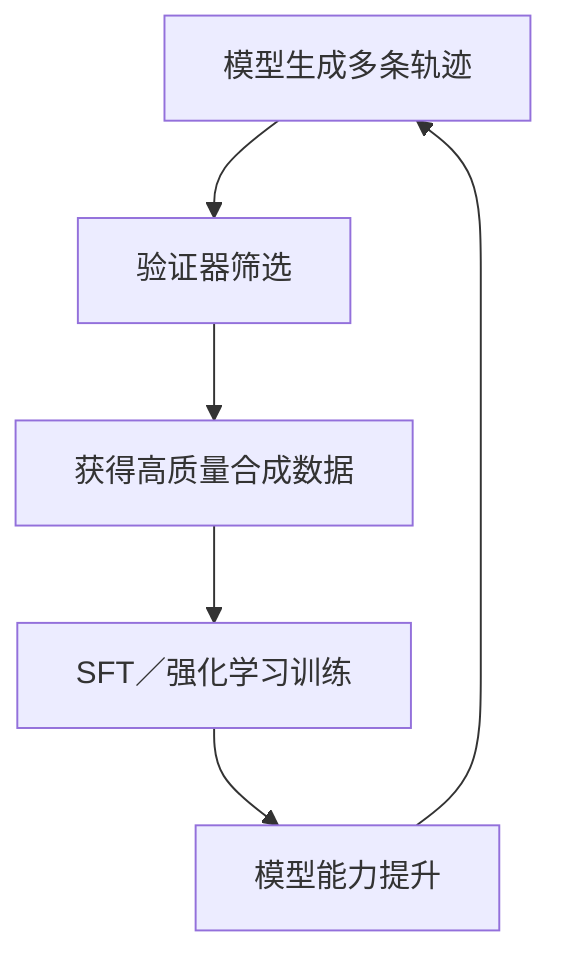

#CS329A《Self-Improving AI Agents》01：Course Overview

> 来源：[ChatGPT 对话](https://chatgpt.com/g/g-p-6a4a37a95080819186e0511030674336/c/6a7c8a3d-d730-83e8-b992-cf798b5d2723)

## 用户提问

可以提取视频中核心内容吗？

[Stanford CS329A 视频](https://www.youtube.com/watch?v=6YnLB0XbTnI&list=PLRpG4LgRkgfs)

## 回答

可以。该视频是 Stanford CS329A《Self-Improving AI Agents》第一讲：Course Overview，时长约 70 分钟。它不是深入讲某一种算法，而是建立一条从“大模型 Scaling”走向“自我改进 Agent”的技术演进主线。[视频](https://www.youtube.com/watch?v=6YnLB0XbTnI)｜[课程官网](https://cs329a.stanford.edu/)

## 一句话总结

AI 能力提升正在从单纯扩大模型参数，逐渐转向：

> 预训练扩展 → 后训练对齐 → 推理时计算扩展 → Agent 工作流 → 基于反馈与验证器的自我改进闭环

其中，决定自我改进能否成立的关键不是“生成更多结果”，而是能否可靠地验证结果。

## 核心内容

### 1. 第一阶段：扩展参数、数据和训练算力

传统 Scaling Law 表明，增加以下三项通常可以稳定降低模型损失：

- 参数规模
- 训练数据量
- 训练计算量

从 BERT、GPT-2、GPT-3 到 PaLM，大模型规模快速增长。Scaling 除了带来可预测的性能提升，还产生了一些难以提前预测的涌现能力：

- Zero-shot / Few-shot Learning
- In-context Learning
- Chain-of-Thought 推理
- 跨任务泛化

一个重要现象是：CoT 并不是随着参数增加而线性改善，而是在模型超过一定规模后才明显有效。

### 2. ChatGPT 的突破不仅来自模型规模

GPT-3 到 ChatGPT 的重要变化，主要来自后训练流程：

1. 高质量数据微调
2. Instruction Tuning：学习理解并遵循指令
3. RLHF：通过人类偏好训练奖励模型，再优化生成策略

因此，模型能力不仅取决于预训练获得了多少知识，还取决于后训练能否把这些能力“激发并对齐”出来。

### 3. 第二条扩展轴：推理时计算

当继续扩大参数越来越昂贵时，研究开始增加单个问题上的推理计算量：

- 对同一问题重复采样
- 生成多条候选推理轨迹
- 使用搜索探索不同解题路径
- 利用 verifier 选择正确结果
- 根据问题难度动态分配计算量

“Large Language Monkeys”类研究表明：一个较小模型通过大量采样，再配合可靠验证器，在某些数学或代码任务上可以超过大模型的单次生成结果。

这里需要区分：

- `pass@k`：生成 k 个答案，只要其中一个正确即可。
- `pass@1`：模型最终提交的第一个答案就是正确答案。

简单重复采样主要提高 `pass@k`；推理模型则试图通过搜索、反思和验证，把潜在的正确轨迹转化为更高的 `pass@1`。

视频对应内容大约在 19:47–40:50。[分段信息](https://summify.io/discover/stanford-cs329a-self-improving-ai-agents-part-1-course-overv-6YnLB0)

### 4. 推理时扩展与训练时扩展形成闭环

视频提出了一条重要的自我改进飞轮：

数学和代码特别适合这种模式，因为它们拥有相对可靠的反馈：

- 数学：标准答案、形式化证明
- 代码：编译器、单元测试、执行结果
- 游戏：明确的胜负与奖励
- 部分工具任务：环境状态或任务成功信号

也就是说，推理时计算不仅改善当前答案，还能生成下一轮训练所需的数据。

### 5. 从 Chatbot 走向 Agent

普通 Chatbot 的基本模式是：

> 用户输入 → 模型生成 → 返回答案

Agent 则需要具备：

- 明确目标
- 可交互环境
- 工具和行动空间
- 多步规划与执行
- 状态与记忆
- 环境反馈
- 自我修正
- 终止条件

Claude Code、Codex、Deep Research 等系统的关键价值，不只是生成文本，而是能够围绕目标持续执行：

> 规划 → 行动 → 观察 → 验证 → 修正 → 再行动

### 6. 当前多数 Agent 仍是人工编排的工作流

视频将常见 Agentic Workflow 概括为几种模式：

| 模式 | 作用 |
|---|---|
| Prompt Chaining | 将复杂任务拆成连续步骤 |
| Routing | 根据输入选择模型、工具或处理流程 |
| Parallelization | 并行生成或执行，再汇总结果 |
| Orchestrator–Worker | 主 Agent 拆解任务，Worker 分别完成 |
| Evaluator–Optimizer | 一个模块生成，另一个模块评估并要求修改 |

讲者特别指出：当前很多所谓 Agent，本质上仍是人预先定义好的静态图，而不是能够自主规划和改变执行路径的开放式 Agent。

真正的自我改进 Agent，需要在运行过程中根据反馈调整：

- 下一步做什么
- 使用哪个工具
- 是否重新规划
- 当前结果是否可信
- 是否达到停止条件

### 7. 自我改进的最大瓶颈：验证

视频最重要的观点是：

> 生成已经相对容易，可靠验证正在成为 Agent 自我改进的核心瓶颈。

这被称为 Generator–Verifier Gap：

- 模型可以快速生成大量候选结果；
- 但验证这些结果是否正确，可能更困难、更昂贵；
- 如果验证器不可靠，系统会把错误结果当成高质量数据继续学习；
- 最终形成错误累积，而不是能力提升。

不同领域的验证难度差异很大：

| 领域 | 验证方式 | 难度 |
|---|---|---|
| 数学 | 标准答案、形式化证明 | 较低 |
| 编程 | 编译、测试、执行反馈 | 较低 |
| 信息检索 | 来源、引用、事实一致性 | 中等 |
| 客服 | 规则、任务完成率、人工评价 | 中等 |
| 创意写作 | 人类偏好、LLM Judge | 较高 |
| 开放式研究 | 事实、引用、创新性、完整性 | 很高 |

因此，数学和代码领域更容易形成持续自我改进，而开放式创作、复杂研究等领域仍严重依赖人工反馈或不完全可靠的 LLM Judge。

## 对你当前 Agent 自进化和评测工作的启示

结合你在做的“讲解 Agent 自进化、Prompt/Skill/Agent 三层自进化”，这节课最值得借鉴的是：

1. 评测不是自进化之后的验收模块，而是自进化的驱动引擎  
   没有可靠 evaluator/verifier，就无法选择优质轨迹、生成训练数据或决定是否上线。

2. 先建设可验证任务，再追求开放式自进化  
   可以把商品讲解任务拆成事实正确性、卖点覆盖、禁用表达、风格一致性、结构完整性等较容易验证的维度，再逐步处理感染力、真人感等主观维度。

3. 自进化的核心单位应当是轨迹，而不仅是最终结果  
   除了保存最终讲解文案，还应记录输入、规划、工具调用、素材选择、中间生成、评测反馈和修改过程。

4. 线上反馈与离线训练需要形成飞轮  
   线上流量录制 → 失败样本发现 → 多候选生成 → 自动与人工评测 → 优质轨迹沉淀 → Prompt/Skill/Agent 更新 → 回放验证。

5. 必须独立评估 verifier  
   不仅要评测 Agent 的生成质量，还要测评测器本身的准确率、稳定性、偏置、漏判率，以及与人工专家的一致性。

## 视频结构与时间点

- `01:58`：Scaling Law 与模型规模演进
- `10:50`：涌现能力、Few-shot 与 Chain-of-Thought
- `19:26`：Instruction Tuning、RLHF 与对齐
- `19:47`：Inference-time Scaling
- `28:20`：DeepSeek、合成数据与自我改进
- `31:22`：推理模型与 Test-time Compute
- `40:50`：从 LLM 转向 Agent
- `49:10`：Agent 编排、验证器与反馈闭环
- `56:20`：编程、客服、AI Scientist 等应用
- `58:06`：课程安排与研究项目

课程后续会继续讲 Test-time Compute、Robust Verification、ReAct、工具执行反馈、规划与多步推理、Scaling RL、开放式自我改进、Deep Research Agent 和长周期 Agent 评测。[Stanford 官方课程大纲](https://cs329a.stanford.edu/)
