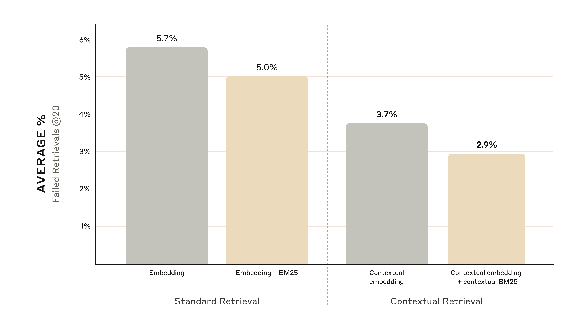
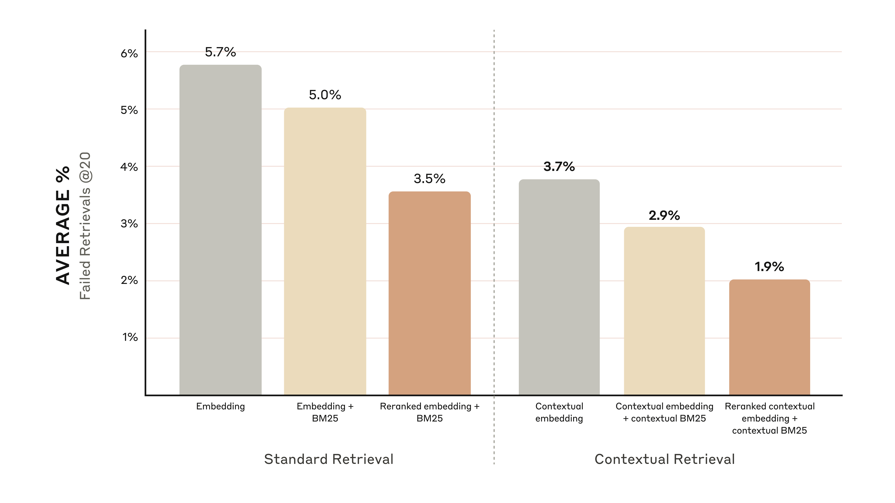

# 上下文检索（Contextual Retrieval）介绍（中英对照）

> **原文标题：** Introducing Contextual Retrieval
> **作者：** Daniel Ford（Anthropic 工程团队）
> **原文链接：** https://www.anthropic.com/engineering/contextual-retrieval
> **发布日期：** 2024-09-19
> 排版：每段英文原文在前，中文翻译紧随其后。术语保留英文原文并附中文释义。

---

For an AI model to be useful in specific contexts, it often needs access to background knowledge. For example, customer support chatbots need knowledge about the specific business they're being used for, and legal analyst bots need to know about a vast array of past cases.

为了让 AI 模型在特定场景中有用，它往往需要访问背景知识。例如，客户支持聊天机器人需要了解它所服务的那家具体企业的知识，而法律分析机器人则需要了解大量的过往案例。

Developers typically enhance an AI model's knowledge using Retrieval-Augmented Generation (RAG). RAG is a method that retrieves relevant information from a knowledge base and appends it to the user's prompt, significantly enhancing the model's response. The problem is that traditional RAG solutions remove context when encoding information, which often results in the system failing to retrieve the relevant information from the knowledge base.

开发者通常使用检索增强生成（Retrieval-Augmented Generation，RAG）来增强 AI 模型的知识。RAG 是一种从知识库中检索相关信息并将其附加到用户提示词中的方法，能显著提升模型的响应。问题在于，传统的 RAG 解决方案在编码信息时会去掉上下文，这常常导致系统无法从知识库中检索到相关信息。

In this post, we outline a method that dramatically improves the retrieval step in RAG. The method is called "Contextual Retrieval" and uses two sub-techniques: Contextual Embeddings and Contextual BM25. This method can reduce the number of failed retrievals by 49% and, when combined with reranking, by 67%. These represent significant improvements in retrieval accuracy, which directly translates to better performance in downstream tasks.

在本文中，我们介绍一种能显著改进 RAG 中检索步骤的方法。该方法称为"上下文检索"（Contextual Retrieval），使用两个子技术：上下文嵌入（Contextual Embeddings）和上下文 BM25（Contextual BM25）。这种方法可以将检索失败次数减少 49%，与重排序（reranking）结合时可以减少 67%。这些是检索准确率方面的重大改进，会直接转化为下游任务更好的性能。

You can easily deploy your own Contextual Retrieval solution with Claude with [our cookbook](https://platform.claude.com/cookbook/capabilities-contextual-embeddings-guide).

你可以使用[我们的 cookbook（教程/菜谱）](https://platform.claude.com/cookbook/capabilities-contextual-embeddings-guide)，轻松地用 Claude 部署你自己的上下文检索解决方案。

## 关于直接使用更长提示词的说明（A note on simply using a longer prompt）

Sometimes the simplest solution is the best. If your knowledge base is smaller than 200,000 tokens (about 500 pages of material), you can just include the entire knowledge base in the prompt that you give the model, with no need for RAG or similar methods.

有时候最简单的解决方案就是最好的。如果你的知识库小于 200,000 个 token（大约 500 页材料），你可以直接把整个知识库放进给模型的提示词中，无需 RAG 或类似方法。

A few weeks ago, we released [prompt caching](https://docs.anthropic.com/en/docs/build-with-claude/prompt-caching) for Claude, which makes this approach significantly faster and more cost-effective. Developers can now cache frequently used prompts between API calls, reducing latency by > 2x and costs by up to 90% (you can see how it works by reading our [prompt caching cookbook](https://platform.claude.com/cookbook/misc-prompt-caching)).

几周前，我们为 Claude 发布了[提示词缓存（prompt caching）](https://docs.anthropic.com/en/docs/build-with-claude/prompt-caching)，这让上述方法变得明显更快、更具成本效益。开发者现在可以在 API 调用之间缓存经常使用的提示词，将延迟降低 2 倍以上，成本降低高达 90%（你可以阅读我们的[提示词缓存 cookbook](https://platform.claude.com/cookbook/misc-prompt-caching)来了解其工作原理）。

However, as your knowledge base grows, you'll need a more scalable solution. That's where Contextual Retrieval comes in.

然而，随着知识库的增长，你会需要一个更具扩展性的解决方案。这正是上下文检索（Contextual Retrieval）派上用场的地方。

# RAG 入门：扩展到更大的知识库（A primer on RAG: scaling to larger knowledge bases）

For larger knowledge bases that don't fit within the context window, RAG is the typical solution. RAG works by preprocessing a knowledge base using the following steps:

对于无法放入上下文窗口的更大知识库，RAG 是典型的解决方案。RAG 通过以下步骤对知识库进行预处理：

1. Break down the knowledge base (the "corpus" of documents) into smaller chunks of text, usually no more than a few hundred tokens;
2. 把知识库（即文档"语料"corpus）拆分成更小的文本块（chunk），通常不超过几百个 token；
3. Use an embedding model to convert these chunks into vector embeddings that encode meaning;
4. 使用嵌入（embedding）模型把这些文本块转换为编码语义的向量嵌入；
5. Store these embeddings in a vector database that allows for searching by semantic similarity.
6. 将这些嵌入存储在一个允许按语义相似度搜索的向量数据库（vector database）中。

At runtime, when a user inputs a query to the model, the vector database is used to find the most relevant chunks based on semantic similarity to the query. Then, the most relevant chunks are added to the prompt sent to the generative model.

在运行时，当用户向模型输入查询时，会使用向量数据库根据与查询的语义相似度找到最相关的文本块。然后，把最相关的文本块添加到发送给生成模型的提示词中。

While embedding models excel at capturing semantic relationships, they can miss crucial exact matches. Fortunately, there's an older technique that can assist in these situations. BM25 (Best Matching 25) is a ranking function that uses lexical matching to find precise word or phrase matches. It's particularly effective for queries that include unique identifiers or technical terms.

虽然嵌入模型擅长捕捉语义关系，但它们可能会错过关键的精确匹配。幸运的是，有一种更古老的技术可以在这些情况下提供帮助。BM25（最佳匹配 25，Best Matching 25）是一种使用词法匹配（lexical matching）来找到精确单词或短语匹配的排序函数。它对于包含唯一标识符或技术术语的查询尤其有效。

BM25 works by building upon the TF-IDF (Term Frequency-Inverse Document Frequency) concept. TF-IDF measures how important a word is to a document in a collection. BM25 refines this by considering document length and applying a saturation function to term frequency, which helps prevent common words from dominating the results.

BM25 建立在 TF-IDF（词频-逆文档频率，Term Frequency-Inverse Document Frequency）概念之上。TF-IDF 衡量一个词在一组文档中对某个文档的重要性。BM25 通过考虑文档长度、并对词频应用饱和函数（saturation function）来改进这一点，这有助于防止常见词主导结果。

Here's how BM25 can succeed where semantic embeddings fail: Suppose a user queries "Error code TS-999" in a technical support database. An embedding model might find content about error codes in general, but could miss the exact "TS-999" match. BM25 looks for this specific text string to identify the relevant documentation.

下面说明 BM25 如何在语义嵌入失败的地方取得成功：假设一个用户在技术支持数据库中查询"错误代码 TS-999"。嵌入模型可能会找到关于错误码的泛泛内容，但可能错过精确的"TS-999"匹配。BM25 会查找这个具体的文本字符串，以识别相关的文档。

RAG solutions can more accurately retrieve the most applicable chunks by combining the embeddings and BM25 techniques using the following steps:

RAG 解决方案可以通过以下步骤，把嵌入和 BM25 技术结合起来，更准确地检索到最适用的文本块：

1. Break down the knowledge base (the "corpus" of documents) into smaller chunks of text, usually no more than a few hundred tokens;
2. 把知识库（即文档"语料"corpus）拆分成更小的文本块，通常不超过几百个 token；
3. Create TF-IDF encodings and semantic embeddings for these chunks;
4. 为这些文本块创建 TF-IDF 编码和语义嵌入；
5. Use BM25 to find top chunks based on exact matches;
6. 使用 BM25 基于精确匹配找到 top 文本块；
7. Use embeddings to find top chunks based on semantic similarity;
8. 使用嵌入基于语义相似度找到 top 文本块；
9. Combine and deduplicate results from (3) and (4) using rank fusion techniques;
10. 使用排名融合（rank fusion）技术合并并去重第 (3) 步和第 (4) 步的结果；
11. Add the top-K chunks to the prompt to generate the response.
12. 把 top-K 个文本块添加到提示词中，以生成响应。

By leveraging both BM25 and embedding models, traditional RAG systems can provide more comprehensive and accurate results, balancing precise term matching with broader semantic understanding.

通过同时利用 BM25 和嵌入模型，传统 RAG 系统可以提供更全面、更准确的结果，在精确的术语匹配与更广泛的语义理解之间取得平衡。


> A Standard Retrieval-Augmented Generation (RAG) system that uses both embeddings and Best Match 25 (BM25) to retrieve information. TF-IDF (term frequency-inverse document frequency) measures word importance and forms the basis for BM25.
> 一个同时使用嵌入和最佳匹配 25（BM25）来检索信息的标准检索增强生成（RAG）系统。TF-IDF（词频-逆文档频率）衡量词语重要性，是 BM25 的基础。

This approach allows you to cost-effectively scale to enormous knowledge bases, far beyond what could fit in a single prompt. But these traditional RAG systems have a significant limitation: they often destroy context.

这种方法让你能够以经济高效的方式扩展到庞大的知识库，远远超出单个提示词所能容纳的范围。但这些传统 RAG 系统有一个显著的局限：它们常常会破坏上下文。

## 传统 RAG 中的上下文难题（The context conundrum in traditional RAG）

In traditional RAG, documents are typically split into smaller chunks for efficient retrieval. While this approach works well for many applications, it can lead to problems when individual chunks lack sufficient context.

在传统 RAG 中，文档通常被拆分成更小的文本块，以便高效检索。虽然这种方法对许多应用都行之有效，但当单个文本块缺乏足够的上下文时，就会引发问题。

For example, imagine you had a collection of financial information (say, U.S. SEC filings) embedded in your knowledge base, and you received the following question: *"What was the revenue growth for ACME Corp in Q2 2023?"*

例如，设想你的知识库中嵌入了一批金融信息（比如美国 SEC 申报文件），你收到了这样一个问题：*"ACME Corp 在 2023 年第二季度的营收增长是多少？"*

A relevant chunk might contain the text: *"The company's revenue grew by 3% over the previous quarter."* However, this chunk on its own doesn't specify which company it's referring to or the relevant time period, making it difficult to retrieve the right information or use the information effectively.

一个相关的文本块可能包含这样的文本：*"该公司营收较上一季度增长了 3%。"* 然而，这个文本块本身并没有指明它指的是哪家公司或相关的时间段，这使得检索到正确信息或有效使用该信息变得困难。

# 引入上下文检索（Introducing Contextual Retrieval）

Contextual Retrieval solves this problem by prepending chunk-specific explanatory context to each chunk before embedding ("Contextual Embeddings") and creating the BM25 index ("Contextual BM25").

上下文检索（Contextual Retrieval）通过在每个文本块被嵌入（即"上下文嵌入"Contextual Embeddings）以及创建 BM25 索引（即"上下文 BM25"Contextual BM25）之前，给文本块前面加上该文本块特有的解释性上下文，从而解决这个问题。

Let's return to our SEC filings collection example. Here's an example of how a chunk might be transformed:

让我们回到 SEC 申报文件集合的例子。下面是一个文本块可能被如何转换的示例：

```python
original_chunk = "The company's revenue grew by 3% over the previous quarter."

contextualized_chunk = "This chunk is from an SEC filing on ACME corp's performance in Q2 2023; the previous quarter's revenue was $314 million. The company's revenue grew by 3% over the previous quarter."
```

It is worth noting that other approaches to using context to improve retrieval have been proposed in the past. Other proposals include: [adding generic document summaries to chunks](https://aclanthology.org/W02-0405.pdf) (we experimented and saw very limited gains), [hypothetical document embedding](https://arxiv.org/abs/2212.10496), and [summary-based indexing](https://www.llamaindex.ai/blog/a-new-document-summary-index-for-llm-powered-qa-systems-9a32ece2f9ec) (we evaluated and saw low performance). These methods differ from what is proposed in this post.

值得一提的是，过去也有人提出过用上下文改进检索的其他方法。其他方案包括：[给文本块添加通用的文档摘要](https://aclanthology.org/W02-0405.pdf)（我们实验过，收益非常有限）、[假设性文档嵌入](https://arxiv.org/abs/2212.10496)（hypothetical document embedding）、以及[基于摘要的索引](https://www.llamaindex.ai/blog/a-new-document-summary-index-for-llm-powered-qa-systems-9a32ece2f9ec)（summary-based indexing，我们评估过，性能较低）。这些方法都与本文提出的方法不同。

## 实现上下文检索（Implementing Contextual Retrieval）

Of course, it would be far too much work to manually annotate the thousands or even millions of chunks in a knowledge base. To implement Contextual Retrieval, we turn to Claude. We've written a prompt that instructs the model to provide concise, chunk-specific context that explains the chunk using the context of the overall document. We used the following Claude 3 Haiku prompt to generate context for each chunk:

当然，要手动标注知识库中成千上万甚至数百万个文本块，工作量实在太大了。为了实现上下文检索，我们求助于 Claude。我们编写了一个提示词，指示模型利用整个文档的上下文，为每个文本块提供简洁、针对该文本块的具体上下文。我们使用下面这个 Claude 3 Haiku 提示词来为每个文本块生成上下文：

```text
<document> 
{{WHOLE_DOCUMENT}} 
</document> 
Here is the chunk we want to situate within the whole document 
<chunk> 
{{CHUNK_CONTENT}} 
</chunk> 
Please give a short succinct context to situate this chunk within the overall document for the purposes of improving search retrieval of the chunk. Answer only with the succinct context and nothing else.
```

The resulting contextual text, usually 50-100 tokens, is prepended to the chunk before embedding it and before creating the BM25 index.

由此产生的上下文文本（通常为 50-100 个 token）会在嵌入文本块之前、以及在创建 BM25 索引之前，被前置到文本块前面。

Here's what the preprocessing flow looks like in practice:

下面就是预处理流程在实际中的样子：


> Contextual Retrieval is a preprocessing technique that improves retrieval accuracy.
> 上下文检索（Contextual Retrieval）是一种提高检索准确率的预处理技术。

If you're interested in using Contextual Retrieval, you can get started with [our cookbook](https://platform.claude.com/cookbook/capabilities-contextual-embeddings-guide).

如果你有兴趣使用上下文检索，可以从[我们的 cookbook](https://platform.claude.com/cookbook/capabilities-contextual-embeddings-guide)开始上手。

## 使用提示词缓存降低上下文检索的成本（Using Prompt Caching to reduce the costs of Contextual Retrieval）

Contextual Retrieval is uniquely possible at low cost with Claude, thanks to the special prompt caching feature we mentioned above. With prompt caching, you don't need to pass in the reference document for every chunk. You simply load the document into the cache once and then reference the previously cached content. Assuming 800 token chunks, 8k token documents, 50 token context instructions, and 100 tokens of context per chunk, **the one-time cost to generate contextualized chunks is $1.02 per million document tokens**.

得益于我们上文提到的特殊提示词缓存功能，上下文检索在 Claude 上可以以低成本实现，这是独一无二的。有了提示词缓存，你不需要为每个文本块传入参考文档。你只需把文档加载到缓存中一次，然后引用之前缓存的内容。假设每个文本块 800 个 token、文档 8k 个 token、上下文指令 50 个 token、每个文本块的上下文 100 个 token，那么**生成上下文化文本块的一次性成本为每百万文档 token 1.02 美元**。

### 方法论（Methodology）

We experimented across various knowledge domains (codebases, fiction, ArXiv papers, Science Papers), embedding models, retrieval strategies, and evaluation metrics. We've included a few examples of the questions and answers we used for each domain in [Appendix II](https://assets.anthropic.com/m/1632cded0a125333/original/Contextual-Retrieval-Appendix-2.pdf).

我们在各种知识领域（代码库、小说、ArXiv 论文、科学论文）、嵌入模型、检索策略和评估指标上进行了实验。我们在[附录二（Appendix II）](https://assets.anthropic.com/m/1632cded0a125333/original/Contextual-Retrieval-Appendix-2.pdf)中收录了每个领域所用问题和答案的几个示例。

The graphs below show the average performance across all knowledge domains with the top-performing embedding configuration (Gemini Text 004) and retrieving the top-20-chunks. We use 1 minus recall@20 as our evaluation metric, which measures the percentage of relevant documents that fail to be retrieved within the top 20 chunks. You can see the full results in the appendix - contextualizing improves performance in every embedding-source combination we evaluated.

下图显示了在所有知识领域中、使用表现最佳的嵌入配置（Gemini Text 004）并检索 top-20 文本块的平均性能。我们使用 1 减去 recall@20（前 20 个文本块内的召回率）作为评估指标，它衡量的是在 top 20 个文本块内未被检索到的相关文档所占的百分比。你可以在附录中看到完整结果——在我们评估的每一种嵌入来源组合中，上下文化（contextualizing）都提高了性能。

### 性能提升（Performance improvements）

Our experiments showed that:

我们的实验表明：

- **Contextual Embeddings reduced the top-20-chunk retrieval failure rate by 35%** (5.7% → 3.7%).
- **上下文嵌入（Contextual Embeddings）将 top-20 文本块的检索失败率降低了 35%**（5.7% → 3.7%）。
- **Combining Contextual Embeddings and Contextual BM25 reduced the top-20-chunk retrieval failure rate by 49%** (5.7% → 2.9%).
- **将上下文嵌入与上下文 BM25（Contextual BM25）结合，将 top-20 文本块的检索失败率降低了 49%**（5.7% → 2.9%）。



> Combining Contextual Embedding and Contextual BM25 reduce the top-20-chunk retrieval failure rate by 49%.
> 结合上下文嵌入与上下文 BM25 将 top-20 文本块的检索失败率降低了 49%。

### 实现注意事项（Implementation considerations）

When implementing Contextual Retrieval, there are a few considerations to keep in mind:

在实现上下文检索时，有几件事需要牢记：

1. **Chunk boundaries:** Consider how you split your documents into chunks. The choice of chunk size, chunk boundary, and chunk overlap can affect retrieval performance1.
2. **文本块边界（Chunk boundaries）：**考虑如何把文档拆分成文本块。文本块大小、文本块边界和文本块重叠（chunk overlap）的选择都会影响检索性能。1
3. **Embedding model:** Whereas Contextual Retrieval improves performance across all embedding models we tested, some models may benefit more than others. We found [Gemini](https://ai.google.dev/gemini-api/docs/embeddings) and [Voyage](https://www.voyageai.com/) embeddings to be particularly effective.
4. **嵌入模型（Embedding model）：**虽然上下文检索在我们测试的所有嵌入模型上都提升了性能，但有些模型的受益可能更大。我们发现 [Gemini](https://ai.google.dev/gemini-api/docs/embeddings) 和 [Voyage](https://www.voyageai.com/) 的嵌入特别有效。
5. **Custom contextualizer prompts:** While the generic prompt we provided works well, you may be able to achieve even better results with prompts tailored to your specific domain or use case (for example, including a glossary of key terms that might only be defined in other documents in the knowledge base).
6. **自定义上下文化提示词（Custom contextualizer prompts）：**虽然我们提供的通用提示词效果不错，但你可能可以通过针对特定领域或用例定制的提示词获得更好的结果（例如，包含一份关键术语表，这些术语可能只在知识库的其他文档中有定义）。
7. **Number of chunks:** Adding more chunks into the context window increases the chances that you include the relevant information. However, more information can be distracting for models so there's a limit to this. We tried delivering 5, 10, and 20 chunks, and found using 20 to be the most performant of these options (see appendix for comparisons) but it's worth experimenting on your use case.
8. **文本块数量（Number of chunks）：**向上下文窗口添加更多文本块会增加包含相关信息的机会。然而，更多信息可能会分散模型的注意力，所以这是有限度的。我们尝试过提供 5、10 和 20 个文本块，发现在这些选项中 20 个表现最好（对比见附录），但在你的用例上进行实验是值得的。

**Always run evals:** Response generation may be improved by passing it the contextualized chunk and distinguishing between what is context and what is the chunk.

**始终运行评测（Always run evals）：**通过向模型传递上下文化后的文本块，并区分哪些是上下文、哪些是文本块本身，可能会改善响应生成。

# 用重排序进一步提升性能（Further boosting performance with Reranking）

In a final step, we can combine Contextual Retrieval with another technique to give even more performance improvements. In traditional RAG, the AI system searches its knowledge base to find the potentially relevant information chunks. With large knowledge bases, this initial retrieval often returns a lot of chunks—sometimes hundreds—of varying relevance and importance.

在最后一步，我们可以把上下文检索与另一种技术结合起来，以获得更大的性能提升。在传统 RAG 中，AI 系统会搜索知识库，找到可能相关的信息文本块。对于大型知识库，这种初始检索往往会返回大量文本块——有时数百个——相关性和重要性各不相同。

Reranking is a commonly used filtering technique to ensure that only the most relevant chunks are passed to the model. Reranking provides better responses and reduces cost and latency because the model is processing less information. The key steps are:

重排序（reranking）是一种常用的过滤技术，用于确保只有最相关的文本块被传递给模型。重排序能提供更好的响应，并降低成本和延迟，因为模型处理的信息更少。关键步骤如下：

1. Perform initial retrieval to get the top potentially relevant chunks (we used the top 150);
2. 执行初始检索，得到最相关的 top 候选文本块（我们使用了 top 150）；
3. Pass the top-N chunks, along with the user's query, through the reranking model;
4. 把 top-N 个文本块连同用户的查询一起，传递给重排序模型；
5. Using a reranking model, give each chunk a score based on its relevance and importance to the prompt, then select the top-K chunks (we used the top 20);
6. 使用重排序模型，根据每个文本块与提示词的相关性和重要性打分，然后选出 top-K 个文本块（我们使用了 top 20）；
7. Pass the top-K chunks into the model as context to generate the final result.
8. 把 top-K 个文本块作为上下文传入模型，以生成最终结果。


> Combine Contextual Retrieva and Reranking to maximize retrieval accuracy.
> 结合上下文检索（Contextual Retrieval）与重排序（Reranking），以最大化检索准确率。

## 性能提升（Performance improvements）

There are several reranking models on the market. We ran our tests with the [Cohere reranker](https://cohere.com/rerank). Voyage[ also offers a reranker](https://docs.voyageai.com/docs/reranker), though we did not have time to test it. Our experiments showed that, across various domains, adding a reranking step further optimizes retrieval.

市场上有多种重排序模型。我们使用 [Cohere 重排序器](https://cohere.com/rerank)进行了测试。Voyage [也提供了重排序器](https://docs.voyageai.com/docs/reranker)，不过我们没有时间测试它。我们的实验表明，在各个领域中，加入重排序步骤都能进一步优化检索。

Specifically, we found that Reranked Contextual Embedding and Contextual BM25 reduced the top-20-chunk retrieval failure rate by 67% (5.7% → 1.9%).

具体来说，我们发现经过重排序的上下文嵌入与上下文 BM25（Reranked Contextual Embedding and Contextual BM25）将 top-20 文本块的检索失败率降低了 67%（5.7% → 1.9%）。



> Reranked Contextual Embedding and Contextual BM25 reduces the top-20-chunk retrieval failure rate by 67%.
> 经过重排序的上下文嵌入与上下文 BM25 将 top-20 文本块的检索失败率降低了 67%。

### 成本与延迟考量（Cost and latency considerations）

One important consideration with reranking is the impact on latency and cost, especially when reranking a large number of chunks. Because reranking adds an extra step at runtime, it inevitably adds a small amount of latency, even though the reranker scores all the chunks in parallel. There is an inherent trade-off between reranking more chunks for better performance vs. reranking fewer for lower latency and cost. We recommend experimenting with different settings on your specific use case to find the right balance.

重排序的一个重要考量是对延迟和成本的影响，尤其是在重排序大量文本块时。由于重排序在运行时增加了一个额外的步骤，即使重排序器会并行对所有文本块打分，它也不可避免地会增加少量延迟。重排序更多文本块以获得更好性能，与重排序更少文本块以获得更低延迟和成本之间，存在固有的权衡。我们建议在具体用例上尝试不同设置，以找到正确的平衡。

# 结论（Conclusion）

We ran a large number of tests, comparing different combinations of all the techniques described above (embedding model, use of BM25, use of contextual retrieval, use of a reranker, and total # of top-K results retrieved), all across a variety of different dataset types. Here's a summary of what we found:

我们进行了大量测试，比较了上述所有技术的不同组合（嵌入模型、是否使用 BM25、是否使用上下文检索、是否使用重排序器、以及检索的 top-K 结果总数），覆盖各种不同的数据集类型。以下是我们发现的总结：

1. Embeddings+BM25 is better than embeddings on their own;
2. 嵌入 + BM25 优于单独使用嵌入；
3. Voyage and Gemini have the best embeddings of the ones we tested;
4. 在我们测试的模型中，Voyage 和 Gemini 的嵌入效果最好；
5. Passing the top-20 chunks to the model is more effective than just the top-10 or top-5;
6. 向模型传递 top-20 文本块比只传 top-10 或 top-5 更有效；
7. Adding context to chunks improves retrieval accuracy a lot;
8. 给文本块添加上下文能大幅提高检索准确率；
9. Reranking is better than no reranking;
10. 有重排序优于没有重排序；
11. **All these benefits stack**: to maximize performance improvements, we can combine contextual embeddings (from Voyage or Gemini) with contextual BM25, plus a reranking step, and adding the 20 chunks to the prompt.
12. **所有这些好处可以叠加：**为了最大化性能提升，我们可以把上下文嵌入（来自 Voyage 或 Gemini）与上下文 BM25 结合，再加上一个重排序步骤，并把 20 个文本块加入提示词。

We encourage all developers working with knowledge bases to use [our cookbook](https://platform.claude.com/cookbook/capabilities-contextual-embeddings-guide) to experiment with these approaches to unlock new levels of performance.

我们鼓励所有处理知识库的开发者使用[我们的 cookbook](https://platform.claude.com/cookbook/capabilities-contextual-embeddings-guide)来实验这些方法，解锁新的性能水平。

# 附录一（Appendix I）

Below is a breakdown of results across datasets, embedding providers, use of BM25 in addition to embeddings, use of contextual retrieval, and use of reranking for Retrievals @ 20.

下面是按数据集、嵌入提供商、是否在嵌入之外使用 BM25、是否使用上下文检索、以及是否使用重排序划分的 Retrievals @ 20 结果明细。

See [Appendix II](https://assets.anthropic.com/m/1632cded0a125333/original/Contextual-Retrieval-Appendix-2.pdf) for the breakdowns for Retrievals @ 10 and @ 5 as well as example questions and answers for each dataset.

Retrievals @ 10 和 @ 5 的明细，以及每个数据集的示例问题和答案，请参见[附录二（Appendix II）](https://assets.anthropic.com/m/1632cded0a125333/original/Contextual-Retrieval-Appendix-2.pdf)。


> 1 minus recall @ 20 results across data sets and embedding providers.
> 各数据集和嵌入提供商的 1 减去 recall@20 结果。

# 致谢（Acknowledgements）

Research and writing by Daniel Ford. Thanks to Orowa Sikder, Gautam Mittal, and Kenneth Lien for critical feedback, Samuel Flamini for implementing the cookbooks, Lauren Polansky for project coordination and Alex Albert, Susan Payne, Stuart Ritchie, and Brad Abrams for shaping this blog post.

研究与撰写由 Daniel Ford 完成。感谢 Orowa Sikder、Gautam Mittal 和 Kenneth Lien 的关键反馈，Samuel Flamini 实现了 cookbook，Lauren Polansky 负责项目协调，以及 Alex Albert、Susan Payne、Stuart Ritchie 和 Brad Abrams 对本文的打磨。
