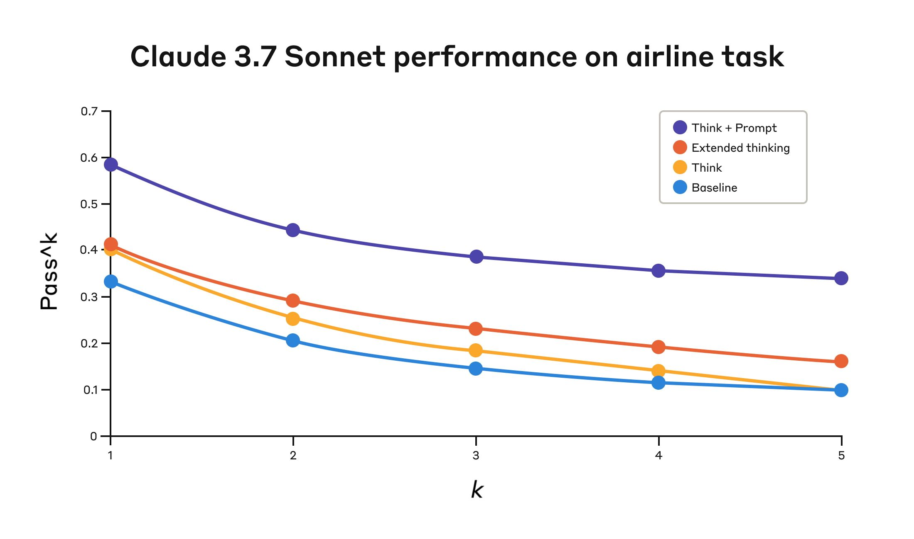
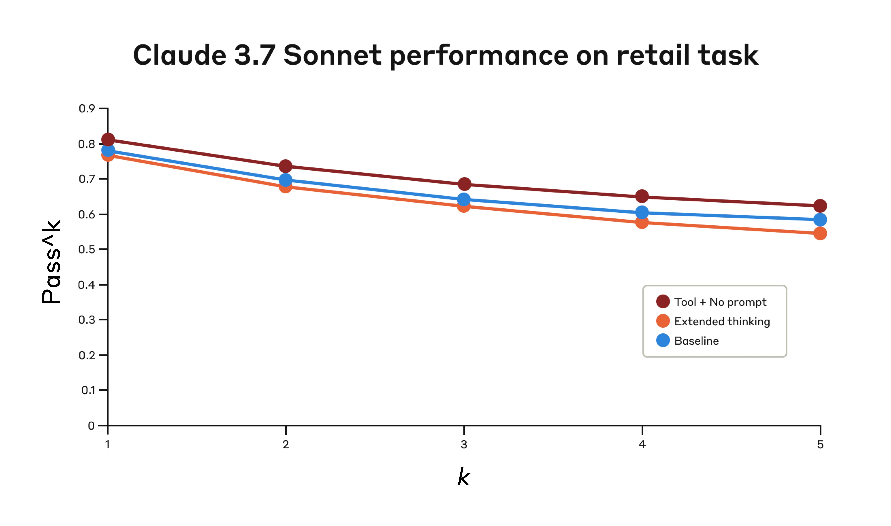

# "思考"（Think）工具：让 Claude 在复杂的工具使用场景中停下来思考（中英对照）

> **原文标题：** The 'think' tool: Enabling Claude to stop and think in complex tool use situations
> **作者：** Anthropic 工程团队
> **原文链接：** https://www.anthropic.com/engineering/claude-think-tool
> **发布日期：** 2025-03-20
> 排版：每段英文原文在前，中文翻译紧随其后。术语保留英文原文并附中文释义。

---

> **Extended thinking update** — Dec 15, 2025: Extended thinking capabilities have improved since its initial release, such that we recommend using that feature instead of a dedicated think tool in most cases. Extended thinking provides similar benefits—giving Claude space to reason through complex problems—with better integration and performance. See our extended thinking documentation for implementation details.
> **扩展思考（Extended thinking）更新** — 2025 年 12 月 15 日：自首次发布以来，扩展思考能力已经得到改进，因此我们建议在大多数情况下使用该功能，而非专用的 think 工具。扩展思考提供了类似的益处——给 Claude 空间去推理复杂问题——同时具有更好的集成度和性能。实现细节请参阅我们的扩展思考文档。

As we continue to enhance Claude's complex problem-solving abilities, we've discovered a particularly effective approach: a "think" tool that creates dedicated space for structured thinking during complex tasks.

随着我们持续增强 Claude 的复杂问题解决能力，我们发现了一种特别有效的方法：一个"think"（思考）工具，它在复杂任务期间为结构化思考创造专属空间。

This simple yet powerful technique—which, as we'll explain below, is different from Claude's new "[extended thinking](https://www.anthropic.com/research/visible-extended-thinking)" capability (see here for [extended thinking implementation details](https://platform.claude.com/docs/en/build-with-claude/extended-thinking))—has resulted in remarkable improvements in Claude's agentic tool use ability. This includes following policies, making consistent decisions, and handling multi-step problems, all with minimal implementation overhead.

这个简单而强大的技术——正如我们在下面会解释的，它与 Claude 新的"[扩展思考](https://www.anthropic.com/research/visible-extended-thinking)"能力不同（[扩展思考的实现细节](https://platform.claude.com/docs/en/build-with-claude/extended-thinking)请参见此处）——为 Claude 的 Agent 工具使用能力带来了显著的提升。这包括遵守策略、做出一致的决策，以及处理多步骤问题，而且实现开销极小。

In this post, we'll explore how to implement the "think" tool on different applications, sharing practical guidance for developers based on verified benchmark results.

在这篇文章中，我们将探讨如何在不同应用中实现"think"工具，并根据经过验证的基准测试结果，为开发者分享实用指南。

## 什么是"think"工具？（What is the "think" tool?）

With the "think" tool, we're giving Claude the ability to include an additional thinking step—complete with its own designated space—as part of getting to its final answer.

通过"think"工具，我们赋予 Claude 这样一个能力：在通往最终答案的过程中，加入一个额外的思考步骤——并拥有它自己专属的空间。

While it sounds similar to extended thinking, it's a different concept. Extended thinking is all about what Claude does before it starts generating a response. With extended thinking, Claude deeply considers and iterates on its plan before taking action. The "think" tool is for Claude, once it starts generating a response, to add a step to stop and think about whether it has all the information it needs to move forward. This is particularly helpful when performing long chains of tool calls or in long multi-step conversations with the user.

虽然它听起来与扩展思考类似，但它是一个不同的概念。扩展思考完全关乎 Claude 在开始生成响应之前做什么。借助扩展思考，Claude 会在采取行动之前深入考虑并反复推敲它的计划。而"think"工具是给 Claude 在开始生成响应之后使用的：增加一个步骤，停下来思考它是否拥有继续前进所需的全部信息。这在执行长长的工具调用链，或在用户进行长时间多步骤对话时尤其有帮助。

This makes the "think" tool more suitable for cases where Claude does not have all the information needed to formulate its response from the user query alone, and where it needs to process external information (e.g. information in tool call results). The reasoning Claude performs with the "think" tool is less comprehensive than what can be obtained with extended thinking, and is more focused on *new* information that the model discovers.

这使得"think"工具更适合以下情况：Claude 仅凭用户查询并不拥有制定响应所需的全部信息，而它需要处理外部信息（例如工具调用结果中的信息）。Claude 用"think"工具进行的推理，不如扩展思考所能获得的那么全面，而是更聚焦于模型*新*发现的信息。

We recommend using extended thinking for simpler tool use scenarios like non-sequential tool calls or straightforward instruction following. Extended thinking is also useful for use cases, like coding, math, and physics, when you don't need Claude to call tools. The "think" tool is better suited for when Claude needs to call complex tools, analyze tool outputs carefully in long chains of tool calls, navigate policy-heavy environments with detailed guidelines, or make sequential decisions where each step builds on previous ones and mistakes are costly.

我们建议在更简单的工具使用场景中使用扩展思考，例如非顺序的工具调用或直接的指令遵循。当你不需要 Claude 调用工具时（如编码、数学和物理），扩展思考也很有用。"think"工具则更适合以下情况：Claude 需要调用复杂工具、在长长的工具调用链中仔细分析工具输出、在拥有详细指南的策略密集型环境中导航，或者做出每一步都建立在先前步骤之上、且错误代价高昂的顺序决策。

Here's a sample implementation using the standard tool specification format that comes from [τ-Bench](https://arxiv.org/abs/2406.12045):

下面是一个示例实现，使用的是源自 [τ-Bench](https://arxiv.org/abs/2406.12045) 的标准工具规格格式：

```json
{
  "name": "think",
  "description": "Use the tool to think about something. It will not obtain new information or change the database, but just append the thought to the log. Use it when complex reasoning or some cache memory is needed.",
  "input_schema": {
    "type": "object",
    "properties": {
      "thought": {
        "type": "string",
        "description": "A thought to think about."
      }
    },
    "required": ["thought"]
  }
}
```

## 在 τ-Bench 上的表现（Performance on τ-Bench）

We evaluated the "think" tool using τ-bench (tau-bench), a comprehensive benchmark designed to test a model's ability to use tools in realistic customer service scenarios, where the "think" tool is part of the evaluation's standard environment.

我们用 τ-bench（tau-bench）评估了"think"工具。τ-bench 是一个全面的基准测试，旨在测试模型在真实客户服务场景中使用工具的能力，而"think"工具正是该评测标准环境的一部分。

τ-bench evaluates Claude's ability to:

τ-bench 评估 Claude 的以下能力：

- Navigate realistic conversations with simulated users
- 在模拟用户的真实对话中游刃有余
- Follow complex customer service agent policy guidelines consistently
- 始终如一地遵循复杂的客服 Agent 策略指南
- Use a variety of tools to access and manipulate the environment database
- 使用各种工具访问和操作环境数据库

The primary evaluation metric used in τ-bench is pass^*k*, which measures the probability that all *k* independent task trials are successful for a given task, averaged across all tasks. Unlike the pass@*k* metric that is common for other LLM evaluations (which measures if at least one of *k* trials succeeds), pass^*k* evaluates consistency and reliability—critical qualities for customer service applications where consistent adherence to policies is essential.

τ-bench 使用的主要评估指标是 pass^*k*，它衡量的是：对某个任务而言，*k* 次独立任务试验全部成功的概率，再对所有任务取平均。与其它 LLM 评测常用的 pass@*k* 指标（衡量 *k* 次试验中是否至少有一次成功）不同，pass^*k* 评估的是一致性与可靠性——这对客户服务应用至关重要，因为在那里始终如一地遵守策略是必不可少的。

### 性能分析（Performance Analysis）

Our evaluation compared several different configurations:

我们的评估比较了几种不同的配置：

1. Baseline (no "think" tool, no extended thinking mode)
2. 基线（没有"think"工具，没有扩展思考模式）
3. Extended thinking mode alone
4. 仅扩展思考模式
5. "Think" tool alone
6. 仅"think"工具
7. "Think" tool with optimized prompt (for airline domain)
8. 带优化提示词的"think"工具（用于航空领域）

The results showed dramatic improvements when Claude 3.7 effectively used the "think" tool in both the "airline" and "retail" customer service domains of the benchmark:

结果显示，当 Claude 3.7 在该基准的"航空"（airline）和"零售"（retail）两个客服领域有效使用"think"工具时，取得了显著的提升：

- **Airline domain**: The "think" tool with an optimized prompt achieved 0.570 on the pass^1 metric, compared to just 0.370 for the baseline—a 54% relative improvement;
- **航空领域**：带优化提示词的"think"工具在 pass^1 指标上达到 0.570，而基线只有 0.370——相对提升了 54%；
- **Retail domain**: The "think" tool alone achieves 0.812, compared to 0.783 for the baseline.
- **零售领域**：仅"think"工具就达到了 0.812，而基线为 0.783。



> Claude 3.7 Sonnet's performance on the "Airline" domain of the Tau-Bench eval
> Claude 3.7 Sonnet 在 Tau-Bench 评测"航空"领域的表现

| 配置（Configuration） | *k*=1 | *k*=2 | *k*=3 | *k*=4 | *k*=5 |
| --- | --- | --- | --- | --- | --- |
| "Think" + 提示词（Prompt） | 0.584 | 0.444 | 0.384 | 0.356 | 0.340 |
| "Think"（仅 think 工具） | 0.404 | 0.254 | 0.186 | 0.140 | 0.100 |
| 扩展思考（Extended thinking） | 0.412 | 0.290 | 0.232 | 0.192 | 0.160 |
| 基线（Baseline） | 0.332 | 0.206 | 0.148 | 0.116 | 0.100 |

The best performance in the airline domain was achieved by pairing the "think" tool with an optimized prompt that gives examples of the type of reasoning approaches to use when analyzing customer requests. Below is an example of the optimized prompt:

航空领域的最佳表现，来自把"think"工具与一个优化后的提示词搭配使用——该提示词给出了在分析客户请求时应使用的推理方法示例。下面是该优化提示词的示例：

```text
## Using the think tool

Before taking any action or responding to the user after receiving tool results, use the think tool as a scratchpad to:
- List the specific rules that apply to the current request
- Check if all required information is collected
- Verify that the planned action complies with all policies
- Iterate over tool results for correctness 

Here are some examples of what to iterate over inside the think tool:
<think_tool_example_1>
User wants to cancel flight ABC123
- Need to verify: user ID, reservation ID, reason
- Check cancellation rules:
  * Is it within 24h of booking?
  * If not, check ticket class and insurance
- Verify no segments flown or are in the past
- Plan: collect missing info, verify rules, get confirmation
</think_tool_example_1>

<think_tool_example_2>
User wants to book 3 tickets to NYC with 2 checked bags each
- Need user ID to check:
  * Membership tier for baggage allowance
  * Which payments methods exist in profile
- Baggage calculation:
  * Economy class × 3 passengers
  * If regular member: 1 free bag each → 3 extra bags = $150
  * If silver member: 2 free bags each → 0 extra bags = $0
  * If gold member: 3 free bags each → 0 extra bags = $0
- Payment rules to verify:
  * Max 1 travel certificate, 1 credit card, 3 gift cards
  * All payment methods must be in profile
  * Travel certificate remainder goes to waste
- Plan:
1. Get user ID
2. Verify membership level for bag fees
3. Check which payment methods in profile and if their combination is allowed
4. Calculate total: ticket price + any bag fees
5. Get explicit confirmation for booking
</think_tool_example_2>
```

What's particularly interesting is how the different approaches compared. Using the "think" tool with the optimized prompt achieved significantly better results over extended thinking mode (which showed similar performance to the unprompted "think" tool). Using the "think" tool alone (without prompting) improved performance over baseline, but still fell short of the optimized approach.

特别有意思的是不同方法之间的对比。使用带优化提示词的"think"工具，结果显著优于扩展思考模式（后者与不带提示词的"think"工具表现相近）。单独使用"think"工具（不带提示词）相比基线有所提升，但仍不及优化后的方法。

The combination of the "think" tool with optimized prompting delivered the strongest performance by a significant margin, likely due to the high complexity of the [airline policy](https://github.com/sierra-research/tau-bench/blob/main/tau_bench/envs/airline/wiki.md) part of the benchmark, where the model benefitted the most from being given examples of how to "think."

"think"工具与优化提示词的组合以显著优势取得了最强表现，这可能是因为基准测试中[航空政策](https://github.com/sierra-research/tau-bench/blob/main/tau_bench/envs/airline/wiki.md)部分的高度复杂性——在那里，模型从"如何思考"的示例中获益最多。

In the retail domain, we also tested various configurations to understand the specific impact of each approach

在零售领域，我们也测试了各种配置，以理解每种方法的具体影响。



> Claude 3.7 Sonnet's performance on the "Retail" domain of the Tau-Bench eval
> Claude 3.7 Sonnet 在 Tau-Bench 评测"零售"领域的表现

| 配置（Configuration） | *k*=1 | *k*=2 | *k*=3 | *k*=4 | *k*=5 |
| --- | --- | --- | --- | --- | --- |
| "Think"（不带提示词） | 0.812 | 0.735 | 0.685 | 0.650 | 0.626 |
| 扩展思考（Extended thinking） | 0.770 | 0.681 | 0.623 | 0.581 | 0.548 |
| 基线（Baseline） | 0.783 | 0.695 | 0.643 | 0.607 | 0.583 |

The "think" tool achieved the highest pass^1 score of 0.812 even without additional prompting. The [retail policy](https://github.com/sierra-research/tau-bench/blob/main/tau_bench/envs/retail/wiki.md) is noticeably easier to navigate compared to the airline domain, and Claude was able to improve just by having a space to think without further guidance.

即使在没有任何额外提示词的情况下，"think"工具也取得了最高的 pass^1 分数 0.812。与航空领域相比，[零售政策](https://github.com/sierra-research/tau-bench/blob/main/tau_bench/envs/retail/wiki.md)显然更容易驾驭，而 Claude 只需有一个思考的空间、无需进一步指导就能取得提升。

### 来自 τ-Bench 分析的关键洞见（Key Insights from τ-Bench Analysis）

Our detailed analysis revealed several patterns that can help you implement the "think" tool effectively:

我们的详细分析揭示了几个可以帮助你有效实现"think"工具的模式：

1. **Prompting matters significantly on difficult domains**. Simply making the "think" tool available might improve performance somewhat, but pairing it with optimized prompting yielded dramatically better results for difficult domains. However, easier domains may benefit from simply having access to "think."
2. **提示词在困难领域至关重要。**仅仅提供"think"工具可能在一定程度上提升性能，但在困难领域，把它与优化提示词搭配使用会产生显著更好的结果。然而，较容易的领域可能只需拥有"think"就能受益。
3. **Improved consistency across trials**. The improvements from using "think" were maintained for pass^k up to k=5, indicating that the tool helped Claude handle edge cases and unusual scenarios more effectively.
4. **跨试验的一致性提升。**使用"think"带来的提升在 pass^k（直至 k=5）上都得以保持，这表明该工具帮助 Claude 更有效地处理了边界情况和异常场景。

## 在 SWE-Bench 上的表现（Performance on SWE-Bench）

A similar "think" tool was added to our SWE-bench setup when evaluating Claude 3.7 Sonnet, contributing to the achieved state-of-the-art score of 0.623. The adapted "think" tool definition is given below:

在评估 Claude 3.7 Sonnet 时，我们在 SWE-bench 配置中添加了一个类似的"think"工具，它为实现 0.623 的最先进分数做出了贡献。改编后的"think"工具定义如下：

```json
{
  "name": "think",
  "description": "Use the tool to think about something. It will not obtain new information or make any changes to the repository, but just log the thought. Use it when complex reasoning or brainstorming is needed. For example, if you explore the repo and discover the source of a bug, call this tool to brainstorm several unique ways of fixing the bug, and assess which change(s) are likely to be simplest and most effective. Alternatively, if you receive some test results, call this tool to brainstorm ways to fix the failing tests.",
  "input_schema": {
    "type": "object",
    "properties": {
      "thought": {
        "type": "string",
        "description": "Your thoughts."
      }
    },
    "required": ["thought"]
  }
}
```

Our experiments (*n*=30 samples with "think" tool, *n*=144 samples without) showed the isolated effects of including this tool improved performance by 1.6% on average (Welch's *t*-test: *t*(38.89) = 6.71, *p* < .001, *d* = 1.47).

我们的实验（使用"think"工具的 *n*=30 个样本，不使用它的 *n*=144 个样本）表明，加入这一工具的独立效果是平均提升 1.6% 的性能（Welch *t* 检验：*t*(38.89) = 6.71, *p* < .001, *d* = 1.47）。

## 何时使用"think"工具（When to use the "think" tool）

Based on these evaluation results, we've identified specific scenarios where Claude benefits most from the "think" tool:

基于这些评估结果，我们识别出了 Claude 从"think"工具中获益最多的具体场景：

1. **Tool output analysis.** When Claude needs to carefully process the output of previous tool calls before acting and might need to backtrack in its approach;
2. **工具输出分析。**当 Claude 需要在行动之前仔细处理先前工具调用的输出，并且可能需要在方法上回溯时；
3. **Policy-heavy environments**. When Claude needs to follow detailed guidelines and verify compliance; and
4. **策略密集型环境。**当 Claude 需要遵循详细的指南并验证合规性时；
5. **Sequential decision making**. When each action builds on previous ones and mistakes are costly (often found in multi-step domains).
6. **顺序决策。**当每个动作都建立在先前动作之上、且错误代价高昂时（常见于多步骤领域）。

# 实现最佳实践（Implementation best practices）

To get the most out of the "think" tool with Claude, we recommend the following implementation practices based on our τ-bench experiments.

为了从"think"工具中充分获益，我们基于 τ-bench 实验推荐以下实现实践。

### 1. 结合领域特定示例的策略性提示（Strategic prompting with domain-specific examples）

The most effective approach is to provide clear instructions on when and how to use the "think" tool, such as the one used for the τ-bench airline domain. Providing examples tailored to your specific use case significantly improves how effectively the model uses the "think" tool:

最有效的方法是为"think"工具的使用时机和方式提供清晰指示，例如用于 τ-bench 航空领域的那种。提供针对你具体用例定制的示例，能显著提升模型使用"think"工具的有效性：

- The level of detail expected in the reasoning process;
- 推理过程中期望的细节程度；
- How to break down complex instructions into actionable steps;
- 如何把复杂的指令分解为可执行的步骤；
- Decision trees for handling common scenarios; and
- 处理常见场景的决策树；
- How to check if all necessary information has been collected.
- 如何检查是否已收集所有必要信息。

### 2. 把复杂的指导放在系统提示中（Place complex guidance in the system prompt）

We found that, when they were long and/or complex, including instructions about the "think" tool in the system prompt was more effective than placing them in the tool description itself. This approach provides broader context and helps the model better integrate the thinking process into its overall behavior.

我们发现，当关于"think"工具的指示较长和/或较复杂时，把它们放在系统提示中比放在工具描述本身更有效。这种方法提供了更广阔的上下文，并帮助模型更好地把思考过程整合进它的整体行为。

## 何时不要使用"think"工具（When not to use the "think" tool）

Whereas the "think" tool can offer substantial improvements, it is not applicable to all tool use use cases, and does come at the cost of increased prompt length and output tokens. Specifically, we have found the "think" tool does not offer any improvements in the following use cases:

虽然"think"工具能带来实质性提升，但它并不适用于所有工具使用场景，而且确实要付出提示长度和输出令牌增加的代价。具体来说，我们发现"think"工具在以下场景中没有任何提升：

1. **Non-sequential tool calls**. If Claude only needs to make a single tool call or multiple parallel calls to complete a task, there is unlikely to be any improvements from adding in "think."
2. **非顺序的工具调用。**如果 Claude 只需做一次工具调用或多次并行调用就能完成任务，那么加入"think"不太可能带来任何提升。
3. **Simple instruction following**. When there are not many constraints to which Claude needs to adhere, and its default behaviour is good enough, there are unlikely to be gains from additional "think"-ing.
4. **简单的指令遵循。**当 Claude 需要遵守的约束不多、且其默认行为已经足够好时，额外的"思考"不太可能带来收益。

## 上手（Getting started）

The "think" tool is a straightforward addition to your Claude implementation that can yield meaningful improvements in just a few steps:

"think"工具是对你 Claude 实现的一个简单补充，只需几个步骤就能带来有意义的改进：

1. **Test with agentic tool use scenarios.** Start with challenging use cases—ones where Claude currently struggles with policy compliance or complex reasoning in long tool call chains.
2. **用 Agent 工具使用场景测试。**从有挑战性的用例开始——那些 Claude 目前在长工具调用链中难以遵守策略或进行复杂推理的场景。
3. **Add the tool definition**. Implement a "think" tool customized to your domain. It requires minimal code but enables more structured reasoning. Also consider including instructions on when and how to use the tool, with examples relevant to your domain to the system prompt.
4. **添加工具定义。**实现一个针对你领域定制的"think"工具。它只需要极少的代码，却能实现更结构化的推理。还可以考虑在系统提示中包含关于何时以及如何使用该工具的指示，并附上与你领域相关的示例。
5. **Monitor and refine**. Watch how Claude uses the tool in practice, and adjust your prompts to encourage more effective thinking patterns.
6. **监控并优化。**观察 Claude 在实践中如何使用该工具，并调整你的提示词，以鼓励更有效的思考模式。

The best part is that adding this tool has minimal downside in terms of performance outcomes. It doesn't change external behavior unless Claude decides to use it, and doesn't interfere with your existing tools or workflows.

最好的地方在于，添加这个工具在性能结果方面的负面影响极小。除非 Claude 决定使用它，否则它不会改变外部行为，也不会干扰你现有的工具或工作流。

## 结论（Conclusion）

Our research has demonstrated that the "think" tool can significantly enhance Claude 3.7 Sonnet's performance¹ on complex tasks requiring policy adherence and reasoning in long chains of tool calls. "Think" is not a one-size-fits-all solution, but it offers substantial benefits for the correct use cases, all with minimal implementation complexity.

我们的研究表明，"think"工具能够显著提升 Claude 3.7 Sonnet 在需要遵守策略、以及在长工具调用链中推理的复杂任务上的表现¹。"Think"并非放之四海而皆准的解决方案，但对于正确的用例，它提供了实质性的好处，而且实现复杂度极低。

We look forward to seeing how you'll use the "think" tool to build more capable, reliable, and transparent AI systems with Claude.

我们期待看到你如何利用"think"工具，与 Claude 一起构建更有能力、更可靠、更透明的 AI 系统。

> ¹ While our τ-Bench results focused on the improvement of Claude 3.7 Sonnet with the "think" tool, our experiments show Claude 3.5 Sonnet (New) is also able to achieve performance gains with the same configuration as 3.7 Sonnet, indicating that this improvement generalizes to other Claude models as well.
> ¹ 虽然我们的 τ-Bench 结果聚焦于"think"工具对 Claude 3.7 Sonnet 的提升，但我们的实验表明，Claude 3.5 Sonnet（新版）使用与 3.7 Sonnet 相同的配置也能获得性能提升，这说明这一改进也推广到了其他 Claude 模型。
