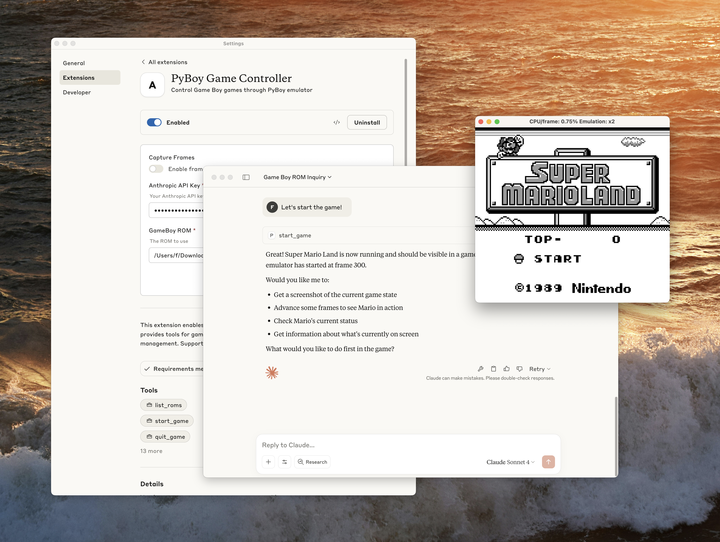

# 桌面扩展：为 Claude Desktop 一键安装 MCP 服务器（Desktop Extensions: One-click MCP server installation for Claude Desktop）

> **原文标题：** Desktop Extensions: One-click MCP server installation for Claude Desktop
> **作者：** Anthropic 工程团队
> **原文链接：** https://www.anthropic.com/engineering/desktop-extensions
> **发布日期：** 2025-06-26
> 排版：每段英文原文在前，中文翻译紧随其后。术语保留英文原文并附中文释义。

---

- File extension updateSep 11, 2025Claude Desktop Extensions now use the .mcpb (MCP Bundle) file extension instead of .dxt. Existing .dxt extensions will continue to work, but we recommend developers use .mcpb for new extensions going forward. All functionality remains the same - this is purely a naming convention update.
- 文件扩展名更新（File extension update）｜2025 年 9 月 11 日：Claude Desktop 扩展现在使用 .mcpb（MCP Bundle）文件扩展名，而不是 .dxt。现有的 .dxt 扩展仍可继续使用，但我们建议开发者今后为新扩展使用 .mcpb。所有功能保持不变——这纯粹是一次命名约定更新。

---

When we released the Model Context Protocol (MCP) last year, we saw developers build amazing local servers that gave Claude access to everything from file systems to databases. But we kept hearing the same feedback: installation was too complex. Users needed developer tools, had to manually edit configuration files, and often got stuck on dependency issues.

去年我们发布模型上下文协议（Model Context Protocol，MCP）时，看到开发者构建了令人惊叹的本地服务器，让 Claude 能访问从文件系统到数据库的一切。但我们不断听到同样的反馈：安装过程太复杂了。用户需要开发者工具、必须手动编辑配置文件，而且常常卡在依赖问题上。

Today, we're introducing Desktop Extensions—a new packaging format that makes installing MCP servers as simple as clicking a button.

今天，我们推出桌面扩展（Desktop Extensions）——一种新的打包格式，让安装 MCP 服务器简单到只需点击一个按钮。

## 解决 MCP 安装难题（Addressing the MCP installation problem）

Local MCP servers unlock powerful capabilities for Claude Desktop users. They can interact with local applications, access private data, and integrate with development tools—all while keeping data on the user's machine. However, the current installation process creates significant barriers:

本地 MCP 服务器为 Claude Desktop 用户解锁了强大的能力。它们可以与本地应用交互、访问私有数据、与开发工具集成——同时所有数据都保留在用户自己的机器上。然而，目前的安装过程造成了显著的障碍：

- **Developer tools required**: Users need Node.js, Python, or other runtimes installed
- **需要开发者工具（Developer tools required）：** 用户需要安装 Node.js、Python 或其他运行时（runtimes）

- **Manual configuration**: Each server requires editing JSON configuration files
- **手动配置（Manual configuration）：** 每个服务器都需要编辑 JSON 配置文件

- **Dependency management**: Users must resolve package conflicts and version mismatches
- **依赖管理（Dependency management）：** 用户必须解决包冲突和版本不匹配问题

- **No discovery mechanism**: Finding useful MCP servers requires searching GitHub
- **没有发现机制（No discovery mechanism）：** 寻找有用的 MCP 服务器需要在 GitHub 上搜索

- **Update complexity**: Keeping servers current means manual reinstallation
- **更新复杂（Update complexity）：** 保持服务器更新意味着要手动重新安装

These friction points meant that MCP servers, despite their power, remained largely inaccessible to non-technical users.

这些摩擦点意味着，MCP 服务器尽管功能强大，对非技术用户来说仍然基本无法使用。

## 介绍桌面扩展（Introducing Desktop Extensions）

Desktop Extensions (`.mcpb` files) solve these problems by bundling an entire MCP server—including all dependencies—into a single installable package. Here's what changes for users:

桌面扩展（`.mcpb` 文件）通过把整个 MCP 服务器——包括所有依赖——打包成一个可安装的包，解决了这些问题。以下是用户看到的变化：

**Before:**

**之前（Before）：**

```bash
# Install Node.js first 
npm install -g @example/mcp-server 
# Edit ~/.claude/claude_desktop_config.json manually 
# Restart Claude Desktop 
# Hope it works
```

**After:**

**之后（After）：**

1. Download a `.mcpb` file
1. 下载一个 `.mcpb` 文件

2. Double-click to open with Claude Desktop
2. 双击用 Claude Desktop 打开

3. Click "Install"
3. 点击"安装"（Install）

That's it. No terminal, no configuration files, no dependency conflicts.

就这样。不需要终端、不需要配置文件、没有依赖冲突。

# 架构概览（Architecture overview）

A Desktop Extension is a zip archive containing the local MCP server as well as a `manifest.json`, which describes everything Claude Desktop and other apps supporting desktop extensions need to know.

桌面扩展是一个 zip 压缩包，其中包含本地 MCP 服务器以及一个 `manifest.json`，后者描述了 Claude Desktop 和其他支持桌面扩展的应用需要知道的一切。

下面是一个 `.mcpb` 扩展的结构示例（其中列出了 Node.js 和 Python 两种扩展的目录布局）：

```text
extension.mcpb (ZIP archive)
├── manifest.json         # Extension metadata and configuration
├── server/               # MCP server implementation
│   └── [server files]    
├── dependencies/         # All required packages/libraries
└── icon.png             # Optional: Extension icon

# Example: Node.js Extension
extension.mcpb
├── manifest.json         # Required: Extension metadata and configuration
├── server/               # Server files
│   └── index.js          # Main entry point
├── node_modules/         # Bundled dependencies
├── package.json          # Optional: NPM package definition
└── icon.png              # Optional: Extension icon

# Example: Python Extension
extension.mcpb (ZIP file)
├── manifest.json         # Required: Extension metadata and configuration
├── server/               # Server files
│   ├── main.py           # Main entry point
│   └── utils.py          # Additional modules
├── lib/                  # Bundled Python packages
├── requirements.txt      # Optional: Python dependencies list
└── icon.png              # Optional: Extension icon
```

The only required file in a Desktop Extension is a manifest.json. Claude Desktop handles all the complexity:

桌面扩展中唯一必需的文件是 manifest.json。Claude Desktop 处理所有复杂性：

- **Built-in runtime**: We ship Node.js with Claude Desktop, eliminating external dependencies
- **内置运行时（Built-in runtime）：** 我们把 Node.js 随 Claude Desktop 一起提供，消除了外部依赖

- **Automatic updates**: Extensions update automatically when new versions are available
- **自动更新（Automatic updates）：** 有新版可用时扩展会自动更新

- **Secure secrets**: Sensitive configuration like API keys are stored in the OS keychain
- **安全的密钥存储（Secure secrets）：** API 密钥等敏感配置存储在操作系统钥匙串（keychain）中

The manifest contains human-readable information (like the name, description, or author), a declaration of features (tools, prompts), user configuration, and runtime requirements. Most fields are optional, so the minimal version is quite short, although in practice, we expect all three supported extension types (Node.js, Python, and classic binaries/executables) to include files:

manifest 包含人类可读的信息（如名称、描述或作者）、功能声明（工具、提示词）、用户配置和运行时要求。大多数字段是可选的，因此最小版本相当简短，不过在实践中，我们预期所有三种受支持的扩展类型（Node.js、Python 和经典二进制/可执行文件）都会包含文件：

下面是最小化的 `manifest.json` 示例：

```json
{
  "mcpb_version": "0.1",                    // MCPB spec version this manifest conforms to
  "name": "my-extension",                   // Machine-readable name (used for CLI, APIs)
  "version": "1.0.0",                       // Semantic version of your extension
  "description": "A simple MCP extension",  // Brief description of what the extension does
  "author": {                               // Author information (required)
    "name": "Extension Author"              // Author's name (required field)
  },
  "server": {                               // Server configuration (required)
    "type": "node",                         // Server type: "node", "python", or "binary"
    "entry_point": "server/index.js",       // Path to the main server file
    "mcp_config": {                         // MCP server configuration
      "command": "node",                    // Command to run the server
      "args": [                             // Arguments passed to the command
        "${__dirname}/server/index.js"      // ${__dirname} is replaced with the extension's directory
      ]                              
    }
  }
}
```

There are a number of convenience options [available in the manifest spec](https://github.com/anthropics/dxt/blob/main/MANIFEST.md) that aim to make the installation and configuration of local MCP servers easier. The server configuration object can be defined in a way that makes room both for user-defined configuration in the form of template literals as well as platform-specific overrides. Extension developers can define, in detail, what kind of configuration they want to collect from users.

[manifest 规范（manifest spec）](https://github.com/anthropics/dxt/blob/main/MANIFEST.md) 中有许多便利选项，旨在让本地 MCP 服务器的安装和配置更容易。服务器配置对象可以这样定义：既为以模板字面量（template literals）形式呈现的用户自定义配置留出空间，也为特定平台的覆盖（overrides）留出空间。扩展开发者可以详细定义他们想从用户那里收集哪种配置。

Let's take a look at a concrete example of how the manifest aids with configuration. In the manifest below, the developer declares that the user needs to supply an `api_key`. Claude will not enable the extension until the user has supplied that value, keep it automatically in the operating system's secret vault, and transparently replace the `${user_config.api_key}` with the user-supplied value when launching the server. Similarly, `${__dirname}` will be replaced with the full path to the extension's unpacked directory.

让我们看一个具体例子，了解 manifest 如何辅助配置。在下面的 manifest 中，开发者声明用户需要提供 `api_key`。在用户提供该值之前，Claude 不会启用扩展；Claude 会把它自动保存在操作系统的密钥库（secret vault）中，并在启动服务器时把 `${user_config.api_key}` 透明地替换为用户提供的值。类似地，`${__dirname}` 会被替换为扩展解压目录的完整路径。

下面是一个包含 `user_config` 配置的 `manifest.json` 示例：

```json
{
  "mcpb_version": "0.1",
  "name": "my-extension",
  "version": "1.0.0",
  "description": "A simple MCP extension",
  "author": {
    "name": "Extension Author"
  },
  "server": {
    "type": "node",
    "entry_point": "server/index.js",
    "mcp_config": {
      "command": "node",
      "args": ["${__dirname}/server/index.js"],
      "env": {
        "API_KEY": "${user_config.api_key}"
      }
    }
  },
  "user_config": {
    "api_key": {
      "type": "string",
      "title": "API Key",
      "description": "Your API key for authentication",
      "sensitive": true,
      "required": true
    }
  }
}
```

A full `manifest.json` with most of the optional fields might look like this:

一个包含大部分可选字段的完整 `manifest.json` 可能长这样：

```json
{
  "mcpb_version": "0.1",
  "name": "My MCP Extension",
  "display_name": "My Awesome MCP Extension",
  "version": "1.0.0",
  "description": "A brief description of what this extension does",
  "long_description": "A detailed description that can include multiple paragraphs explaining the extension's functionality, use cases, and features. It supports basic markdown.",
  "author": {
    "name": "Your Name",
    "email": "yourname@example.com",
    "url": "https://your-website.com"
  },
  "repository": {
    "type": "git",
    "url": "https://github.com/your-username/my-mcp-extension"
  },
  "homepage": "https://example.com/my-extension",
  "documentation": "https://docs.example.com/my-extension",
  "support": "https://github.com/your-username/my-extension/issues",
  "icon": "icon.png",
  "screenshots": [
    "assets/screenshots/screenshot1.png",
    "assets/screenshots/screenshot2.png"
  ],
  "server": {
    "type": "node",
    "entry_point": "server/index.js",
    "mcp_config": {
      "command": "node",
      "args": ["${__dirname}/server/index.js"],
      "env": {
        "ALLOWED_DIRECTORIES": "${user_config.allowed_directories}"
      }
    }
  },
  "tools": [
    {
      "name": "search_files",
      "description": "Search for files in a directory"
    }
  ],
  "prompts": [
    {
      "name": "poetry",
      "description": "Have the LLM write poetry",
      "arguments": ["topic"],
      "text": "Write a creative poem about the following topic: ${arguments.topic}"
    }
  ],
  "tools_generated": true,
  "keywords": ["api", "automation", "productivity"],
  "license": "MIT",
  "compatibility": {
    "claude_desktop": ">=1.0.0",
    "platforms": ["darwin", "win32", "linux"],
    "runtimes": {
      "node": ">=16.0.0"
    }
  },
  "user_config": {
    "allowed_directories": {
      "type": "directory",
      "title": "Allowed Directories",
      "description": "Directories the server can access",
      "multiple": true,
      "required": true,
      "default": ["${HOME}/Desktop"]
    },
    "api_key": {
      "type": "string",
      "title": "API Key",
      "description": "Your API key for authentication",
      "sensitive": true,
      "required": false
    },
    "max_file_size": {
      "type": "number",
      "title": "Maximum File Size (MB)",
      "description": "Maximum file size to process",
      "default": 10,
      "min": 1,
      "max": 100
    }
  }
}
```

To see an extension and manifest, please refer [to the examples in the MCPB repository](https://github.com/anthropics/dxt/tree/main/examples).

要查看扩展和 manifest 的示例，请参阅 [MCPB 仓库中的示例](https://github.com/anthropics/dxt/tree/main/examples)。

The full specification for all required and optional fields in the `manifest.json` can be found as part of our [open-source toolchain](https://github.com/anthropics/dxt/blob/main/MANIFEST.md).

`manifest.json` 中所有必需和可选字段的完整规范，可以在我们的[开源工具链（open-source toolchain）](https://github.com/anthropics/dxt/blob/main/MANIFEST.md)中找到。

## 构建你的第一个扩展（Building your first extension）

Let's walk through packaging an existing MCP server as a Desktop Extension. We'll use a simple file system server as an example.

让我们一步步演示如何把现有的 MCP 服务器打包为桌面扩展。我们将用一个简单的文件系统服务器作为示例。

### 第 1 步：创建 manifest（Step 1: Create the manifest）

First, initialize a manifest for your server:

首先，为你的服务器初始化一个 manifest：

```bash
npx @anthropic-ai/mcpb init
```

This interactive tool asks about your server and generates a complete manifest.json. If you want to speed-run your way to the most basic manifest.json, you can run the command with a --yes parameter.

这个交互式工具会询问关于你的服务器的情况，并生成一个完整的 manifest.json。如果你想快速生成最基础的 manifest.json，可以带 --yes 参数运行该命令。

### 第 2 步：处理用户配置（Step 2: Handle user configuration）

If your server needs user input (like API keys or allowed directories), declare it in the manifest:

如果你的服务器需要用户输入（如 API 密钥或允许访问的目录），请在 manifest 中声明：

下面是在 `user_config` 中声明允许目录（allowed directories）的示例：

```json
"user_config": {
  "allowed_directories": {
    "type": "directory",
    "title": "Allowed Directories",
    "description": "Directories the server can access",
    "multiple": true,
    "required": true,
    "default": ["${HOME}/Documents"]
  }
}
```

Claude Desktop will:

Claude Desktop 将会：

- Display a user-friendly configuration UI
- 显示用户友好的配置界面（UI）

- Validate inputs before enabling the extension
- 在启用扩展之前验证输入

- Securely store sensitive values
- 安全地存储敏感值

- Pass configuration to your server either as arguments or environment variables, depending on developer configuration
- 根据开发者的配置，以参数或环境变量的形式把配置传递给服务器

In the example below, we're passing the user configuration as an environment variable, but it could also be an argument.

在下面的示例中，我们以环境变量的形式传递用户配置，但它也可以是一个参数。

下面是在 `mcp_config` 中通过环境变量传递用户配置的示例：

```json
"server": {
   "type": "node",
   "entry_point": "server/index.js",
   "mcp_config": {
   "command": "node",
   "args": ["${__dirname}/server/index.js"],
   "env": {
      "ALLOWED_DIRECTORIES": "${user_config.allowed_directories}"
   }
   }
}
```

### 第 3 步：打包扩展（Step 3: Package the extension）

Bundle everything into a `.mcpb` file:

把所有内容打包进一个 `.mcpb` 文件：

```bash
npx @anthropic-ai/mcpb pack
```

This command:

该命令会：

1. Validates your manifest
1. 验证你的 manifest

2. Generates the `.mcpb` archive
2. 生成 `.mcpb` 压缩包

### 第 4 步：本地测试（Step 4: Test locally）

Drag your `.mcpb` file into Claude Desktop's Settings window. You'll see:

把 `.mcpb` 文件拖入 Claude Desktop 的设置（Settings）窗口。你会看到：

- Human-readable information about your extension
- 关于你扩展的人类可读信息

- Required permissions and configuration
- 所需的权限和配置

- A simple "Install" button
- 一个简单的"安装"（Install）按钮

## 高级功能（Advanced features）

### 跨平台支持（Cross-platform support）

Extensions can adapt to different operating systems:

扩展可以适配不同的操作系统：

下面是一个按平台覆盖服务器配置的示例：

```json
"server": {
  "type": "node",
  "entry_point": "server/index.js",
  "mcp_config": {
    "command": "node",
    "args": ["${__dirname}/server/index.js"],
    "platforms": {
      "win32": {
        "command": "node.exe",
        "env": {
          "TEMP_DIR": "${TEMP}"
        }
      },
      "darwin": {
        "env": {
          "TEMP_DIR": "${TMPDIR}"
        }
      }
    }
  }
}
```

### 动态配置（Dynamic configuration）

Use template literals for runtime values:

使用模板字面量（template literals）表示运行时值：

- `${__dirname}`: Extension's installation directory
- `${__dirname}`：扩展的安装目录

- `${user_config.key}`: User-provided configuration
- `${user_config.key}`：用户提供的配置

- `${HOME}, ${TEMP}`: System environment variables
- `${HOME}, ${TEMP}`：系统环境变量

### 功能声明（Feature declaration）

Help users understand capabilities upfront:

提前帮助用户了解能力：

下面是在 manifest 中声明工具和提示词的示例：

```json
"tools": [
  {
    "name": "read_file",
    "description": "Read contents of a file"
  }
],
"prompts": [
  {
    "name": "code_review",
    "description": "Review code for best practices",
    "arguments": ["file_path"]
  }
]
```

## 扩展目录（The extension directory）

We're launching with a curated directory of extensions built into Claude Desktop. Users can browse, search, and install with one click—no searching GitHub or vetting code.

我们推出时，Claude Desktop 内置了一个经过策划的扩展目录。用户可以浏览、搜索并一键安装——无需在 GitHub 上搜索或审查代码。

While we expect both the Desktop Extension specification and the implementation in Claude for macOS and Windows to evolve over time, we look forward to seeing the many ways in which extensions can be used to expand the capabilities of Claude in creative ways.

虽然我们预期桌面扩展规范以及 Claude 在 macOS 和 Windows 上的实现都会随时间演进，但我们期待看到扩展以各种创造性的方式扩展 Claude 的能力。

To submit your extension:

要提交你的扩展：

1. Ensure it follows the guidelines found in the submission form
1. 确保它遵循提交表单中的指南

2. Test across Windows and macOS
2. 在 Windows 和 macOS 上进行测试

3. [Submit your extension](https://docs.google.com/forms/d/14_Dmcig4z8NeRMB_e7TOyrKzuZ88-BLYdLvS6LPhiZU/edit)
3. [提交你的扩展](https://docs.google.com/forms/d/14_Dmcig4z8NeRMB_e7TOyrKzuZ88-BLYdLvS6LPhiZU/edit)

4. Our team reviews for quality and security
4. 我们的团队会进行质量和安全审查

## 构建开放生态系统（Building an open ecosystem）

We are committed to the open ecosystem around MCP servers and believe that its ability to be universally adopted by multiple applications and services has benefitted the community. In line with this commitment, we're open-sourcing the Desktop Extension specification, toolchain, and the schemas and key functions used by Claude for macOS and Windows to implement its own support of Desktop Extensions. It is our hope that the MCPB format doesn't just make local MCP servers more portable for Claude, but other AI desktop applications, too.

我们致力于围绕 MCP 服务器构建开放生态系统，并相信它被多种应用和服务普遍采用的能力已经让社区受益。本着这一承诺，我们正在开源桌面扩展规范、工具链，以及 Claude 在 macOS 和 Windows 上实现自身桌面扩展支持所用的 schema 和关键函数。我们希望 MCPB 格式不仅让本地 MCP 服务器对 Claude 更具可移植性，也能惠及其他 AI 桌面应用。

We're open-sourcing:

我们开源的内容包括：

- The complete MCPB specification
- 完整的 MCPB 规范

- Packaging and validation tools
- 打包和验证工具

- Reference implementation code
- 参考实现代码

- TypeScript types and schemas
- TypeScript 类型和 schema

This means:

这意味着：

- **For MCP server developers**: Package once, run anywhere that supports MCPB
- **对 MCP 服务器开发者而言（For MCP server developers）：** 打包一次，即可在任何支持 MCPB 的地方运行

- **For app developers**: Add extension support without building from scratch
- **对应用开发者而言（For app developers）：** 无需从零构建即可添加扩展支持

- **For users**: Consistent experience across all MCP-enabled applications
- **对用户而言（For users）：** 在所有支持 MCP 的应用中获得一致的体验

The specification and toolchain is on purpose versioned as 0.1, as we are looking forward to working with the greater community on evolving and changing the format. We look forward to hearing from you.

规范和工具链刻意以 0.1 版本号发布，因为我们期待与更广泛的社区合作，共同演进和改变这一格式。我们期待听到你的声音。

## 安全与企业考量（Security and enterprise considerations）

We understand that extensions introduce new security considerations, particularly for enterprises. We've built in several safeguards with the preview release of Desktop Extensions:

我们理解扩展会带来新的安全考量，尤其是对企业而言。在桌面扩展的预览版中，我们内置了多项安全保障：

### 对用户而言（For users）

- Sensitive data stays in the OS keychain
- 敏感数据保留在操作系统钥匙串中

- Automatic updates
- 自动更新

- Ability to audit what extensions are installed
- 能够审计安装了哪些扩展

### 对企业而言（For enterprises）

- Group Policy (Windows) and MDM (macOS) support
- 支持组策略（Group Policy，Windows）和 MDM（macOS）

- Ability to pre-install approved extensions
- 能够预装已批准的扩展

- Blocklist specific extensions or publishers
- 将特定扩展或发布者列入黑名单（blocklist）

- Disable the extension directory entirely
- 完全禁用扩展目录

- Deploy private extension directories
- 部署私有的扩展目录

For more information about how to manage extensions within your organization, see our [documentation](https://support.anthropic.com/en/articles/10949351-getting-started-with-model-context-protocol-mcp-on-claude-for-desktop).

关于如何在你的组织内管理扩展的更多信息，请参阅我们的[文档](https://support.anthropic.com/en/articles/10949351-getting-started-with-model-context-protocol-mcp-on-claude-for-desktop)。

## 快速上手（Getting started）

Ready to build your own extension? Here's how to start:

准备好构建你自己的扩展了吗？以下是如何开始：

**For MCP server developers**: Review our [developer documentation](https://github.com/anthropics/dxt) – or dive right in by running the following commands in your local MCP servers' directory:

**对 MCP 服务器开发者而言（For MCP server developers）：** 请查阅我们的[开发者文档](https://github.com/anthropics/dxt)，或者在本地 MCP 服务器的目录中直接运行以下命令，立即上手：

```bash
npm install -g @anthropic-ai/mcpb
mcpb init
mcpb pack
```

**For Claude Desktop users**: Update to the latest version and look for the Extensions section in Settings

**对 Claude Desktop 用户而言（For Claude Desktop users）：** 更新到最新版本，然后在设置中查找"扩展"（Extensions）部分

**For enterprises**: Review our enterprise documentation for deployment options

**对企业而言（For enterprises）：** 请查阅我们的企业文档，了解部署选项

## 使用 Claude Code 构建（Building with Claude Code）

Internally at Anthropic, we have found that Claude is great at building extensions with minimal intervention. If you too want to use Claude Code, we recommend that you briefly explain what you want your extension to do and then add the following context to the prompt:

在 Anthropic 内部，我们发现 Claude 非常擅长以极少的干预构建扩展。如果你也想使用 Claude Code，我们建议你简要说明希望扩展做什么，然后在提示词中加入以下上下文：

```text
I want to build this as a Desktop Extension, abbreviated as "MCPB". Please follow these steps:

1. **Read the specifications thoroughly:**
   - https://github.com/anthropics/mcpb/blob/main/README.md - MCPB architecture overview, capabilities, and integration patterns
   - https://github.com/anthropics/mcpb/blob/main/MANIFEST.md - Complete extension manifest structure and field definitions
   - https://github.com/anthropics/mcpb/tree/main/examples - Reference implementations including a "Hello World" example

2. **Create a proper extension structure:**
   - Generate a valid manifest.json following the MANIFEST.md spec
   - Implement an MCP server using @modelcontextprotocol/sdk with proper tool definitions
   - Include proper error handling and timeout management

3. **Follow best development practices:**
   - Implement proper MCP protocol communication via stdio transport
   - Structure tools with clear schemas, validation, and consistent JSON responses
   - Make use of the fact that this extension will be running locally
   - Add appropriate logging and debugging capabilities
   - Include proper documentation and setup instructions

4. **Test considerations:**
   - Validate that all tool calls return properly structured responses
   - Verify manifest loads correctly and host integration works

Generate complete, production-ready code that can be immediately tested. Focus on defensive programming, clear error messages, and following the exact
MCPB specifications to ensure compatibility with the ecosystem.
```

## 结语（Conclusion）

Desktop Extensions represent a fundamental shift in how users interact with local AI tools. By removing installation friction, we're making powerful MCP servers accessible to everyone—not just developers.

桌面扩展代表了用户与本地 AI 工具交互方式的根本性转变。通过消除安装摩擦，我们让功能强大的 MCP 服务器对每个人都触手可及——不仅仅是开发者。

Internally, we're using desktop extensions to share highly experimental MCP servers - some fun, some useful.. One team experimented to see how far our models could make it when directly connected to a GameBoy, similar to our ["Claude plays Pokémon" research](https://www.anthropic.com/news/visible-extended-thinking). We used Desktop Extensions to package a single extension that opens up the popular [PyBoy](https://github.com/Baekalfen/PyBoy) GameBoy emulator and lets Claude take control. We believe that countless opportunities exist to connect the model's capabilities to the tools, data, and applications users already have on their local machines.

在内部，我们用桌面扩展来分享高度实验性的 MCP 服务器——有的好玩，有的实用。一个团队做了个实验，想看看我们的模型在直接连接 GameBoy 时能走多远，这与我们[「Claude 玩宝可梦」的研究](https://www.anthropic.com/news/visible-extended-thinking)类似。我们用桌面扩展打包了一个扩展，打开流行的 [PyBoy](https://github.com/Baekalfen/PyBoy) GameBoy 模拟器，让 Claude 接管控制。我们相信，把模型的能力与用户本地机器上已有的工具、数据和应用连接起来，存在无数机会。



We can't wait to see what you build. The same creativity that brought us thousands of MCP servers can now reach millions of users with just one click. Ready to share your MCP server? [Submit your extension for review](https://forms.gle/tyiAZvch1kDADKoP9).

我们迫不及待想看到你的作品。当初带来数千个 MCP 服务器的创造力，如今只需一键就能触达数百万用户。准备好分享你的 MCP 服务器了吗？[提交你的扩展以供审查](https://forms.gle/tyiAZvch1kDADKoP9)。


### 想了解更多？（Looking to learn more?）

阅读[原始文章](https://www.anthropic.com/engineering/desktop-extensions)以获取更多信息。
