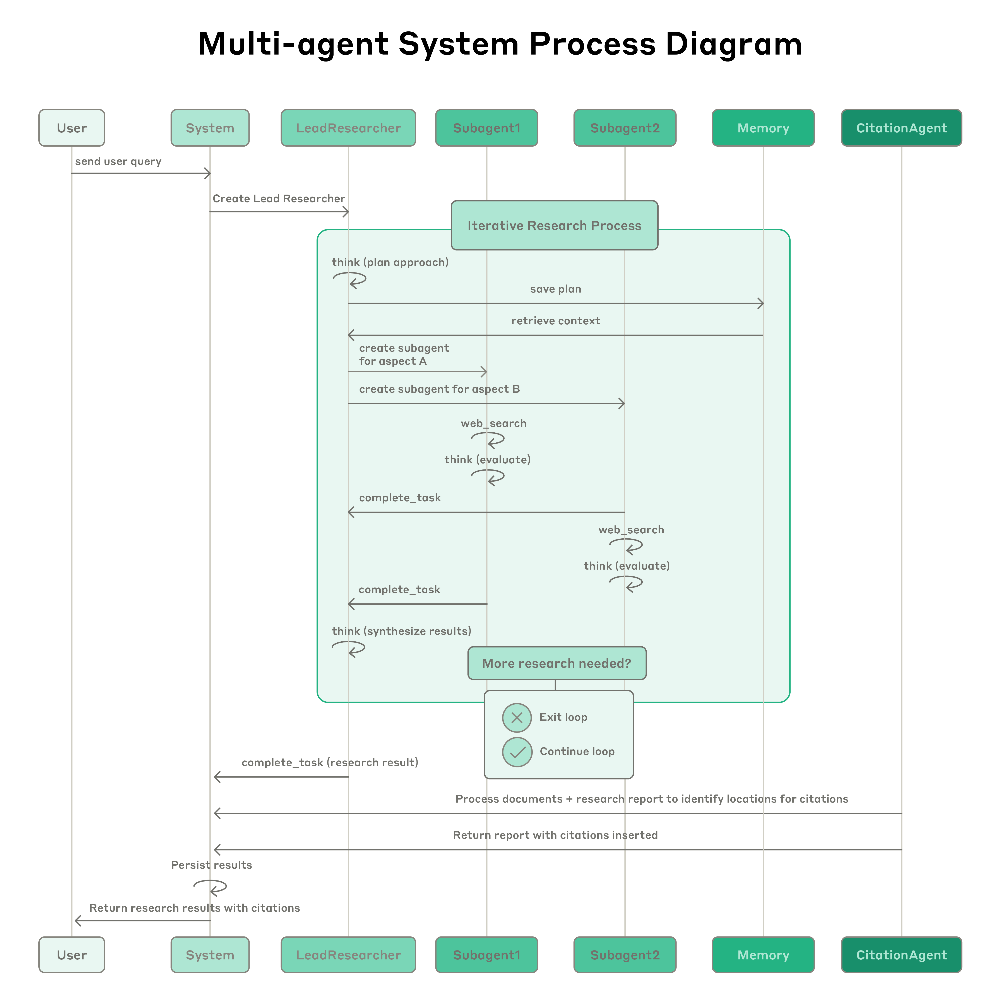

# 我们如何构建多 Agent 研究系统（中英对照）

> **原文标题：** How we built our multi-agent research system
> **作者：** Jeremy Hadfield, Barry Zhang, Kenneth Lien, Florian Scholz, Jeremy Fox, Daniel Ford（Anthropic 工程团队）
> **原文链接：** https://www.anthropic.com/engineering/multi-agent-research-system
> **发布日期：** 2025-06-13
> 排版：每段英文原文在前，中文翻译紧随其后。术语保留英文原文并附中文释义。

---

Claude now has [Research capabilities](https://www.anthropic.com/news/research) that allow it to search across the web, Google Workspace, and any integrations to accomplish complex tasks.

Claude 现在具备[研究（Research）能力](https://www.anthropic.com/news/research)，让它能够跨网络、Google Workspace 以及任何集成进行搜索，以完成复杂任务。

The journey of this multi-agent system from prototype to production taught us critical lessons about system architecture, tool design, and prompt engineering. A multi-agent system consists of multiple agents (LLMs autonomously using tools in a loop) working together. Our Research feature involves an agent that plans a research process based on user queries, and then uses tools to create parallel agents that search for information simultaneously. Systems with multiple agents introduce new challenges in agent coordination, evaluation, and reliability.

这个多 Agent 系统从原型走向生产的旅程，让我们在系统架构、工具设计和提示词工程方面学到了关键的经验。多 Agent 系统由多个 Agent（在循环中自主使用工具的 LLM）协同工作组成。我们的 Research 功能涉及一个 Agent，它根据用户查询规划研究流程，然后使用工具创建并行的 Agent，同时搜索信息。多 Agent 系统在 Agent 协调、评估和可靠性方面引入了新的挑战。

This post breaks down the principles that worked for us—we hope you'll find them useful to apply when building your own multi-agent systems.

这篇文章拆解了对我们有效的原则——我们希望你在构建自己的多 Agent 系统时会觉得它们有用。

## 多 Agent 系统的益处（Benefits of a multi-agent system）

Research work involves open-ended problems where it's very difficult to predict the required steps in advance. You can't hardcode a fixed path for exploring complex topics, as the process is inherently dynamic and path-dependent. When people conduct research, they tend to continuously update their approach based on discoveries, following leads that emerge during investigation.

研究工作涉及开放式问题，很难预先预测所需的步骤。你无法为探索复杂主题硬编码一条固定路径，因为这个过程本质上是动态的、依赖路径的。当人们进行研究时，他们往往会根据新发现不断更新自己的方法，顺着调查过程中浮现的线索走下去。

This unpredictability makes AI agents particularly well-suited for research tasks. Research demands the flexibility to pivot or explore tangential connections as the investigation unfolds. The model must operate autonomously for many turns, making decisions about which directions to pursue based on intermediate findings. A linear, one-shot pipeline cannot handle these tasks.

这种不可预测性使 AI Agent 特别适合研究任务。研究要求在调查展开时具备转向或探索旁支联系的灵活性。模型必须自主运行很多轮，根据中间发现来决定朝哪个方向推进。线性的、一次性（one-shot）的流水线无法处理这些任务。

The essence of search is compression: distilling insights from a vast corpus. Subagents facilitate compression by operating in parallel with their own context windows, exploring different aspects of the question simultaneously before condensing the most important tokens for the lead research agent. Each subagent also provides separation of concerns—distinct tools, prompts, and exploration trajectories—which reduces path dependency and enables thorough, independent investigations.

搜索的本质是压缩：从海量语料中提炼洞见。子 Agent（subagent）通过使用自己的上下文窗口并行运行来促进压缩——同时探索问题的不同方面，然后为主要研究 Agent 浓缩出最重要的令牌。每个子 Agent 还提供了关注点分离（separation of concerns）——不同的工具、提示词和探索轨迹——这降低了路径依赖，并支持彻底、独立的调查。

Once intelligence reaches a threshold, multi-agent systems become a vital way to scale performance. For instance, although individual humans have become more intelligent in the last 100,000 years, human societies have become *exponentially* more capable in the information age because of our *collective* intelligence and ability to coordinate. Even generally-intelligent agents face limits when operating as individuals; groups of agents can accomplish far more.

一旦智能达到某个阈值，多 Agent 系统就成为一种扩展性能的关键方式。例如，尽管个体人类在过去 10 万年里变得更聪明了，但人类社会在信息时代之所以获得*指数级*更强的能力，是因为我们的*集体*智慧和协调能力。即便是通用的智能 Agent，作为个体运行时也会面临极限；一组 Agent 则能完成多得多的事情。

Our internal evaluations show that multi-agent research systems excel especially for breadth-first queries that involve pursuing multiple independent directions simultaneously. We found that a multi-agent system with Claude Opus 4 as the lead agent and Claude Sonnet 4 subagents outperformed single-agent Claude Opus 4 by 90.2% on our internal research eval. For example, when asked to identify all the board members of the companies in the Information Technology S&P 500, the multi-agent system found the correct answers by decomposing this into tasks for subagents, while the single agent system failed to find the answer with slow, sequential searches.

我们的内部评估表明，多 Agent 研究系统尤其擅长广度优先（breadth-first）的查询——即那些需要同时推进多个独立方向的查询。我们发现，以 Claude Opus 4 为主 Agent、以 Claude Sonnet 4 为子 Agent 的多 Agent 系统，在我们的内部研究评测上比单 Agent 的 Claude Opus 4 高出 90.2%。例如，当被要求识别信息技术板块标普 500（S&P 500）所有公司的董事会成员时，多 Agent 系统通过把这个问题分解为交给子 Agent 的任务而找到了正确答案，而单 Agent 系统则因缓慢的顺序搜索而未能找到答案。

Multi-agent systems work mainly because they help spend enough tokens to solve the problem. In our analysis, three factors explained 95% of the performance variance in the [BrowseComp](https://openai.com/index/browsecomp/) evaluation (which tests the ability of browsing agents to locate hard-to-find information). We found that token usage by itself explains 80% of the variance, with the number of tool calls and the model choice as the two other explanatory factors. This finding validates our architecture that distributes work across agents with separate context windows to add more capacity for parallel reasoning. The latest Claude models act as large efficiency multipliers on token use, as upgrading to Claude Sonnet 4 is a larger performance gain than doubling the token budget on Claude Sonnet 3.7. Multi-agent architectures effectively scale token usage for tasks that exceed the limits of single agents.

多 Agent 系统之所以有效，主要是因为它们有助于投入足够的令牌来解决问题。在我们的分析中，三个因素解释了 [BrowseComp](https://openai.com/index/browsecomp/) 评测（它测试浏览 Agent 定位难以找到的信息的能力）中 95% 的性能方差。我们发现，单是令牌用量就解释了 80% 的方差，工具调用次数和模型选择是另外两个解释因素。这一发现验证了我们的架构——把工作分布到拥有独立上下文窗口的多个 Agent 上，以增加并行推理的容量。最新的 Claude 模型是令牌使用上的巨大效率倍增器，因为升级到 Claude Sonnet 4 带来的性能提升，比把 Claude Sonnet 3.7 的令牌预算翻倍还要大。多 Agent 架构有效地为超出单 Agent 极限的任务扩展令牌用量。

There is a downside: in practice, these architectures burn through tokens fast. In our data, agents typically use about 4× more tokens than chat interactions, and multi-agent systems use about 15× more tokens than chats. For economic viability, multi-agent systems require tasks where the value of the task is high enough to pay for the increased performance. Further, some domains that require all agents to share the same context or involve many dependencies between agents are not a good fit for multi-agent systems today. For instance, most coding tasks involve fewer truly parallelizable tasks than research, and LLM agents are not yet great at coordinating and delegating to other agents in real time. We've found that multi-agent systems excel at valuable tasks that involve heavy parallelization, information that exceeds single context windows, and interfacing with numerous complex tools.

但也有缺点：在实践中，这些架构会快速烧掉令牌。在我们的数据中，Agent 通常消耗的令牌大约是聊天交互的 4 倍，而多 Agent 系统的令牌消耗大约是聊天的 15 倍。为了保证经济上的可行性，多 Agent 系统需要"任务价值足够高、足以支付性能提升"的任务。此外，一些要求所有 Agent 共享相同上下文、或涉及 Agent 之间大量依赖关系的领域，目前并不适合多 Agent 系统。例如，大多数编码任务真正可并行化的部分比研究少，而 LLM Agent 在实时协调和委派给其他 Agent 方面还不太擅长。我们发现，多 Agent 系统擅长那些涉及重度并行化、信息量超过单一上下文窗口、以及需要与众多复杂工具交互的高价值任务。

## Research 的架构概览（Architecture overview for Research）

Our Research system uses a multi-agent architecture with an orchestrator-worker pattern, where a lead agent coordinates the process while delegating to specialized subagents that operate in parallel.

我们的 Research 系统采用"编排者-工作者"（orchestrator-worker）模式的多 Agent 架构，其中主 Agent 协调整个过程，同时把工作委派给并行运行的专业子 Agent。

> The multi-agent architecture in action: user queries flow through a lead agent that creates specialized subagents to search for different aspects in parallel.
> 多 Agent 架构的实际运行：用户查询流经主 Agent，它创建专业子 Agent 并行搜索不同方面。

When a user submits a query, the lead agent analyzes it, develops a strategy, and spawns subagents to explore different aspects simultaneously. As shown in the diagram above, the subagents act as intelligent filters by iteratively using search tools to gather information, in this case on AI agent companies in 2025, and then returning a list of companies to the lead agent so it can compile a final answer.

当用户提交查询时，主 Agent 分析它、制定策略，并生成子 Agent 同时探索不同方面。如上图所示，子 Agent 通过迭代使用搜索工具来收集信息，充当智能过滤器——在这个例子中是收集 2025 年 AI Agent 公司的信息——然后把公司列表返回给主 Agent，让它汇总出最终答案。

Traditional approaches using Retrieval Augmented Generation (RAG) use static retrieval. That is, they fetch some set of chunks that are most similar to an input query and use these chunks to generate a response. In contrast, our architecture uses a multi-step search that dynamically finds relevant information, adapts to new findings, and analyzes results to formulate high-quality answers.

使用检索增强生成（Retrieval Augmented Generation，RAG）的传统方法采用静态检索。也就是说，它们抓取一组与输入查询最相似的文本块，并用这些文本块生成响应。相比之下，我们的架构使用多步搜索：动态地找到相关信息、适应新发现、并分析结果以形成高质量答案。

> Process diagram showing the complete workflow of our multi-agent Research system. When a user submits a query, the system creates a LeadResearcher agent that enters an iterative research process. The LeadResearcher begins by thinking through the approach and saving its plan to Memory to persist the context, since if the context window exceeds 200,000 tokens it will be truncated and it is important to retain the plan. It then creates specialized Subagents (two are shown here, but it can be any number) with specific research tasks. Each Subagent independently performs web searches, evaluates tool results using interleaved thinking, and returns findings to the LeadResearcher. The LeadResearcher synthesizes these results and decides whether more research is needed—if so, it can create additional subagents or refine its strategy. Once sufficient information is gathered, the system exits the research loop and passes all findings to a CitationAgent, which processes the documents and research report to identify specific locations for citations. This ensures all claims are properly attributed to their sources. The final research results, complete with citations, are then returned to the user.
> 我们多 Agent Research 系统完整工作流的流程图。当用户提交查询时，系统创建一个 LeadResearcher（主研究员）Agent，进入迭代式研究过程。LeadResearcher 首先理清思路，把计划保存到 Memory（记忆）中以持久化上下文——因为如果上下文窗口超过 200,000 令牌就会被截断，保留计划至关重要。然后它创建具有特定研究任务的专业子 Agent（这里显示两个，但可以是任意数量）。每个子 Agent 独立执行网络搜索，用交错式思考（interleaved thinking）评估工具结果，并把发现返回给 LeadResearcher。LeadResearcher 综合这些结果，决定是否还需要更多研究——如果需要，它可以创建更多子 Agent 或优化策略。一旦收集到足够的信息，系统就退出研究循环，把所有发现交给 CitationAgent（引文 Agent），后者处理文档和研究报告，以确定引用的具体位置。这确保所有论断都能正确归因到它们的来源。最终带有引文的研究结果再返回给用户。

## 面向研究 Agent 的提示词工程与评测（Prompt engineering and evaluations for research agents）

Multi-agent systems have key differences from single-agent systems, including a rapid growth in coordination complexity. Early agents made errors like spawning 50 subagents for simple queries, scouring the web endlessly for nonexistent sources, and distracting each other with excessive updates. Since each agent is steered by a prompt, prompt engineering was our primary lever for improving these behaviors. Below are some principles we learned for prompting agents:

多 Agent 系统与单 Agent 系统有关键差异，包括协调复杂度的快速增长。早期的 Agent 会犯这样的错误：为简单查询生成 50 个子 Agent、为不存在的来源无休止地扫网、以及用过多的更新互相干扰。由于每个 Agent 都由提示词驱动，提示词工程是我们改进这些行为的主要杠杆。以下是我们学到的提示词设计原则：

1. **Think like your agents.** To iterate on prompts, you must understand their effects. To help us do this, we built simulations using our [Console](https://console.anthropic.com/) with the exact prompts and tools from our system, then watched agents work step-by-step. This immediately revealed failure modes: agents continuing when they already had sufficient results, using overly verbose search queries, or selecting incorrect tools. Effective prompting relies on developing an accurate mental model of the agent, which can make the most impactful changes obvious.
2. **像你的 Agent 一样思考。**要迭代提示词，你必须理解它们的效果。为了帮助我们做到这一点，我们用 [Console](https://console.anthropic.com/) 结合系统中完全相同的提示词和工具构建了模拟，然后一步步观察 Agent 工作。这立即暴露了失败模式：Agent 在已经获得足够结果时仍继续、使用过于冗长的搜索查询、或选择了错误的工具。有效的提示词设计依赖于对 Agent 建立一个准确的思维模型，这能让最有影响力的改动变得显而易见。
3. **Teach the orchestrator how to delegate.** In our system, the lead agent decomposes queries into subtasks and describes them to subagents. Each subagent needs an objective, an output format, guidance on the tools and sources to use, and clear task boundaries. Without detailed task descriptions, agents duplicate work, leave gaps, or fail to find necessary information. We started by allowing the lead agent to give simple, short instructions like 'research the semiconductor shortage,' but found these instructions often were vague enough that subagents misinterpreted the task or performed the exact same searches as other agents. For instance, one subagent explored the 2021 automotive chip crisis while 2 others duplicated work investigating current 2025 supply chains, without an effective division of labor.
4. **教会编排者如何委派。**在我们的系统中，主 Agent 把查询分解为子任务，并把它们描述给子 Agent。每个子 Agent 需要一个目标、一种输出格式、关于要使用的工具和来源的指导，以及清晰的任务边界。没有详细的任务描述，Agent 就会重复工作、留下缺口，或找不到必要的信息。我们最初让主 Agent 给出简单、简短的指示，比如"研究半导体短缺"，但发现这些指示常常含糊到让子 Agent 误解任务，或执行与其他 Agent 完全相同的搜索。例如，一个子 Agent 在探索 2021 年的汽车芯片危机，而另外两个在重复调查当前的 2025 年供应链，没有有效的分工。
5. **Scale effort to query complexity.** Agents struggle to judge appropriate effort for different tasks, so we embedded scaling rules in the prompts. Simple fact-finding requires just 1 agent with 3-10 tool calls, direct comparisons might need 2-4 subagents with 10-15 calls each, and complex research might use more than 10 subagents with clearly divided responsibilities. These explicit guidelines help the lead agent allocate resources efficiently and prevent overinvestment in simple queries, which was a common failure mode in our early versions.
6. **让投入的精力随查询复杂度伸缩。**Agent 很难判断不同任务应该投入多少精力，所以我们在提示词中嵌入了伸缩规则。简单的事实查找只需要 1 个 Agent、3-10 次工具调用；直接对比可能需要 2-4 个子 Agent、每个调用 10-15 次；复杂研究则可能使用 10 个以上的子 Agent，并明确划分职责。这些明确的指导原则帮助主 Agent 高效地分配资源，防止在简单查询上过度投入——这是我们早期版本中常见的失败模式。
7. **Tool design and selection are critical.** Agent-tool interfaces are as critical as human-computer interfaces. Using the right tool is efficient—often, it's strictly necessary. For instance, an agent searching the web for context that only exists in Slack is doomed from the start. With [MCP servers](https://modelcontextprotocol.io/introduction) that give the model access to external tools, this problem compounds, as agents encounter unseen tools with descriptions of wildly varying quality. We gave our agents explicit heuristics: for example, examine all available tools first, match tool usage to user intent, search the web for broad external exploration, or prefer specialized tools over generic ones. Bad tool descriptions can send agents down completely wrong paths, so each tool needs a distinct purpose and a clear description.
8. **工具设计与选择至关重要。**Agent 与工具的接口，与人与计算机的接口一样关键。使用正确的工具很高效——通常也是严格必要的。例如，一个在网络上搜索只存在于 Slack 里的上下文的 Agent，从一开始就注定失败。随着 [MCP 服务器](https://modelcontextprotocol.io/introduction)让模型能够访问外部工具，这个问题更加严重，因为 Agent 会遇到描述质量参差不齐的未见过的工具。我们给了 Agent 明确的启发式规则：例如，先检查所有可用工具、让工具使用与用户意图匹配、为广泛的外部探索使用网络搜索、或者优先选择专用工具而非通用工具。糟糕的工具描述会把 Agent 引向完全错误的方向，所以每个工具都需要一个明确的目的和清晰的描述。
9. **Let agents improve themselves.** We found that the Claude 4 models can be excellent prompt engineers. When given a prompt and a failure mode, they are able to diagnose why the agent is failing and suggest improvements. We even created a tool-testing agent—when given a flawed MCP tool, it attempts to use the tool and then rewrites the tool description to avoid failures. By testing the tool dozens of times, this agent found key nuances and bugs. This process for improving tool ergonomics resulted in a 40% decrease in task completion time for future agents using the new description, because they were able to avoid most mistakes.
10. **让 Agent 自我改进。**我们发现 Claude 4 系列模型可以成为出色的提示词工程师。当给它们一个提示词和一个失败模式时，它们能够诊断 Agent 失败的原因并提出改进建议。我们甚至创建了一个工具测试 Agent——当给它一个有缺陷的 MCP 工具时，它会尝试使用该工具，然后重写工具描述以避免失败。通过几十次测试该工具，这个 Agent 发现了关键的细微之处和 bug。这种改进工具人机工效（tool ergonomics）的过程，使将来使用新描述的任务完成时间减少了 40%，因为它们能够避开大多数错误。
11. **Start wide, then narrow down.** Search strategy should mirror expert human research: explore the landscape before drilling into specifics. Agents often default to overly long, specific queries that return few results. We counteracted this tendency by prompting agents to start with short, broad queries, evaluate what's available, then progressively narrow focus.
12. **先宽后窄。**搜索策略应当模仿人类专家式的研究：在深入细节之前先探索全貌。Agent 常常默认使用过长、过于具体的查询，结果却很少。我们通过提示 Agent 以简短、宽泛的查询开始，评估可用的内容，然后逐步收窄焦点，来对抗这种倾向。
13. **Guide the thinking process.** [Extended thinking mode](https://docs.anthropic.com/en/docs/build-with-claude/extended-thinking), which leads Claude to output additional tokens in a visible thinking process, can serve as a controllable scratchpad. The lead agent uses thinking to plan its approach, assessing which tools fit the task, determining query complexity and subagent count, and defining each subagent's role. Our testing showed that extended thinking improved instruction-following, reasoning, and efficiency. Subagents also plan, then use [interleaved thinking](https://docs.anthropic.com/en/docs/build-with-claude/extended-thinking#interleaved-thinking) after tool results to evaluate quality, identify gaps, and refine their next query. This makes subagents more effective in adapting to any task.
14. **引导思考过程。**[扩展思考模式](https://docs.anthropic.com/en/docs/build-with-claude/extended-thinking)会让 Claude 在一个可见的思考过程中输出额外的令牌，它可以充当一个可控的草稿本。主 Agent 用思考来规划方法、评估哪些工具适合任务、确定查询复杂度和子 Agent 数量，并定义每个子 Agent 的角色。我们的测试表明，扩展思考改进了指令遵循、推理和效率。子 Agent 也会先规划，然后在工具结果之后使用[交错式思考](https://docs.anthropic.com/en/docs/build-with-claude/extended-thinking#interleaved-thinking)来评估质量、识别缺口、优化下一个查询。这让子 Agent 在适应任何任务时更加有效。
15. **Parallel tool calling transforms speed and performance.** Complex research tasks naturally involve exploring many sources. Our early agents executed sequential searches, which was painfully slow. For speed, we introduced two kinds of parallelization: (1) the lead agent spins up 3-5 subagents in parallel rather than serially; (2) the subagents use 3+ tools in parallel. These changes cut research time by up to 90% for complex queries, allowing Research to do more work in minutes instead of hours while covering more information than other systems.
16. **并行工具调用彻底改变速度与性能。**复杂的研究任务天然涉及探索许多来源。我们早期的 Agent 执行顺序搜索，慢得令人痛苦。为了提速，我们引入了两种并行化：（1）主 Agent 并行而不是串行地启动 3-5 个子 Agent；（2）子 Agent 并行使用 3 个以上工具。这些改动把复杂查询的研究时间缩短了最多 90%，让 Research 能在几分钟而不是几小时内完成更多工作，同时比其他系统覆盖更多信息。

Our prompting strategy focuses on instilling good heuristics rather than rigid rules. We studied how skilled humans approach research tasks and encoded these strategies in our prompts—strategies like decomposing difficult questions into smaller tasks, carefully evaluating the quality of sources, adjusting search approaches based on new information, and recognizing when to focus on depth (investigating one topic in detail) vs. breadth (exploring many topics in parallel). We also proactively mitigated unintended side effects by setting explicit guardrails to prevent the agents from spiraling out of control. Finally, we focused on a fast iteration loop with observability and test cases.

我们的提示词策略专注于灌输良好的启发式规则，而非僵硬的规则。我们研究了熟练的人类如何开展研究任务，并把这些策略编码进提示词中——比如把难题分解成更小的任务、仔细评估来源质量、根据新信息调整搜索方法，以及识别何时该专注深度（深入研究一个主题）而非广度（并行探索多个主题）。我们还通过设置明确的护栏来主动缓解非预期副作用，防止 Agent 失控。最后，我们专注于一个带有可观测性和测试用例的快速迭代循环。

## 有效的 Agent 评测（Effective evaluation of agents）

Good evaluations are essential for building reliable AI applications, and agents are no different. However, evaluating multi-agent systems presents unique challenges. Traditional evaluations often assume that the AI follows the same steps each time: given input X, the system should follow path Y to produce output Z. But multi-agent systems don't work this way. Even with identical starting points, agents might take completely different valid paths to reach their goal. One agent might search three sources while another searches ten, or they might use different tools to find the same answer. Because we don't always know what the right steps are, we usually can't just check if agents followed the "correct" steps we prescribed in advance. Instead, we need flexible evaluation methods that judge whether agents achieved the right outcomes while also following a reasonable process.

好的评测对于构建可靠的 AI 应用至关重要，Agent 也不例外。然而，评估多 Agent 系统带来了独特的挑战。传统评测通常假设 AI 每次都遵循相同的步骤：给定输入 X，系统应该沿着路径 Y 产生输出 Z。但多 Agent 系统不是这样工作的。即便起点完全相同，Agent 也可能走完全不同的有效路径来达到目标。一个 Agent 可能搜索三个来源，而另一个搜索十个；或者它们可能用不同的工具找到同样的答案。因为我们并不总是知道正确的步骤是什么，所以我们通常不能只检查 Agent 是否遵循了我们预先规定的"正确"步骤。相反，我们需要灵活的评估方法——判断 Agent 是否在遵循合理流程的同时实现了正确的结果。

**Start evaluating immediately with small samples.** In early agent development, changes tend to have dramatic impacts because there is abundant low-hanging fruit. A prompt tweak might boost success rates from 30% to 80%. With effect sizes this large, you can spot changes with just a few test cases. We started with a set of about 20 queries representing real usage patterns. Testing these queries often allowed us to clearly see the impact of changes. We often hear that AI developer teams delay creating evals because they believe that only large evals with hundreds of test cases are useful. However, it's best to start with small-scale testing right away with a few examples, rather than delaying until you can build more thorough evals.

**立即用小样本开始评估。**在 Agent 开发的早期，改动往往影响巨大，因为有大量"低垂的果实"。一个提示词的微调就可能把成功率从 30% 提升到 80%。在效果量如此大的情况下，你只需几个测试用例就能发现变化。我们从一组约 20 个代表真实使用模式的查询开始。测试这些查询常常能让我们清楚地看到改动的影响。我们经常听说 AI 开发团队推迟创建评测，因为他们相信只有包含数百个测试用例的大型评测才有用。然而，最好的做法是立即用少量示例开始小规模测试，而不是拖延到你能构建更全面的评测为止。

**LLM-as-judge evaluation scales when done well.** Research outputs are difficult to evaluate programmatically, since they are free-form text and rarely have a single correct answer. LLMs are a natural fit for grading outputs. We used an LLM judge that evaluated each output against criteria in a rubric: factual accuracy (do claims match sources?), citation accuracy (do the cited sources match the claims?), completeness (are all requested aspects covered?), source quality (did it use primary sources over lower-quality secondary sources?), and tool efficiency (did it use the right tools a reasonable number of times?). We experimented with multiple judges to evaluate each component, but found that a single LLM call with a single prompt outputting scores from 0.0-1.0 and a pass-fail grade was the most consistent and aligned with human judgements. This method was especially effective when the eval test cases *did* have a clear answer, and we could use the LLM judge to simply check if the answer was correct (i.e. did it accurately list the pharma companies with the top 3 largest R&D budgets?). Using an LLM as a judge allowed us to scalably evaluate hundreds of outputs.

**LLM 作为评委的评估做得好时可以规模化。**研究输出很难用程序化方式评估，因为它们是自由格式的文本，很少只有一个正确答案。LLM 天然适合给输出打分。我们使用一个 LLM 评委，它根据评分标准（rubric）中的各项标准评估每个输出：事实准确性（论断是否与来源匹配？）、引文准确性（引用的来源是否与论断匹配？）、完整性（所有要求的方面是否都覆盖了？）、来源质量（是否使用了主要来源而非质量较低的次要来源？）、以及工具效率（是否以合理的次数使用了正确的工具？）。我们尝试过用多个评委来评估每个组成部分，但发现用单个提示词的单次 LLM 调用、输出 0.0-1.0 的分数和一项通过/失败评级，是最一致、也最符合人类判断的。当评测测试用例*确实*有明确答案时，这种方法尤其有效——我们可以让 LLM 评委只需检查答案是否正确（例如，它是否准确列出了研发预算最大的前 3 家制药公司？）。用 LLM 作为评委，让我们能够规模化地评估数百个输出。

**Human evaluation catches what automation misses.** People testing agents find edge cases that evals miss. These include hallucinated answers on unusual queries, system failures, or subtle source selection biases. In our case, human testers noticed that our early agents consistently chose SEO-optimized content farms over authoritative but less highly-ranked sources like academic PDFs or personal blogs. Adding source quality heuristics to our prompts helped resolve this issue. Even in a world of automated evaluations, manual testing remains essential.

**人类评估能捕捉自动化遗漏的东西。**人类测试 Agent 时能发现评测遗漏的边界情况。这些包括异常查询上的幻觉答案、系统故障，或微妙的来源选择偏差。在我们的案例中，人类测试者注意到我们早期的 Agent 总是选择经过 SEO 优化的内容农场，而不是权威但排名较低的资源，如学术 PDF 或个人博客。在提示词中加入来源质量启发式规则帮助解决了这个问题。即使在一个自动化评测的世界里，人工测试仍然至关重要。

Multi-agent systems have emergent behaviors, which arise without specific programming. For instance, small changes to the lead agent can unpredictably change how subagents behave. Success requires understanding interaction patterns, not just individual agent behavior. Therefore, the best prompts for these agents are not just strict instructions, but frameworks for collaboration that define the division of labor, problem-solving approaches, and effort budgets. Getting this right relies on careful prompting and tool design, solid heuristics, observability, and tight feedback loops. See the [open-source prompts in our Cookbook](https://platform.claude.com/cookbook/patterns-agents-basic-workflows) for example prompts from our system.

多 Agent 系统具有涌现行为（emergent behaviors），它们无需特定编程就会产生。例如，对主 Agent 的微小改动可能会不可预测地改变子 Agent 的行为方式。成功需要理解交互模式，而不仅仅是单个 Agent 的行为。因此，这些 Agent 的最佳提示词不只是严格的指令，而是定义分工、解题方法和精力预算的协作框架。要做好这一点，依赖于仔细的提示词和工具设计、扎实的启发式规则、可观测性，以及紧密的反馈循环。关于我们系统中的示例提示词，请参见我们 [Cookbook 中的开源提示词](https://platform.claude.com/cookbook/patterns-agents-basic-workflows)。

## 生产可靠性与工程挑战（Production reliability and engineering challenges）

In traditional software, a bug might break a feature, degrade performance, or cause outages. In agentic systems, minor changes cascade into large behavioral changes, which makes it remarkably difficult to write code for complex agents that must maintain state in a long-running process.

在传统软件中，一个 bug 可能破坏某个功能、降低性能或导致宕机。在 Agent 系统中，微小的改动会级联成巨大的行为变化，这使得为必须在长时间运行过程中维持状态的复杂 Agent 编写代码变得异常困难。

**Agents are stateful and errors compound.** Agents can run for long periods of time, maintaining state across many tool calls. This means we need to durably execute code and handle errors along the way. Without effective mitigations, minor system failures can be catastrophic for agents. When errors occur, we can't just restart from the beginning: restarts are expensive and frustrating for users. Instead, we built systems that can resume from where the agent was when the errors occurred. We also use the model's intelligence to handle issues gracefully: for instance, letting the agent know when a tool is failing and letting it adapt works surprisingly well. We combine the adaptability of AI agents built on Claude with deterministic safeguards like retry logic and regular checkpoints.

**Agent 是有状态的，错误会累积。**Agent 可以长时间运行，在多次工具调用间维持状态。这意味着我们需要持久地执行代码，并沿途处理错误。没有有效的缓解措施，微小的系统故障对 Agent 来说可能是灾难性的。当错误发生时，我们不能只是从头重启：重启对用户来说是昂贵且令人沮丧的。相反，我们构建了能够从错误发生时的 Agent 位置恢复的系统。我们还利用模型的智能来优雅地处理问题：例如，让 Agent 知道某个工具正在失败、并让它去适应，效果出奇地好。我们把构建在 Claude 之上的 AI Agent 的适应性，与重试逻辑、定期检查点这类确定性保障结合起来。

**Debugging benefits from new approaches.** Agents make dynamic decisions and are non-deterministic between runs, even with identical prompts. This makes debugging harder. For instance, users would report agents "not finding obvious information," but we couldn't see why. Were the agents using bad search queries? Choosing poor sources? Hitting tool failures? Adding full production tracing let us diagnose why agents failed and fix issues systematically. Beyond standard observability, we monitor agent decision patterns and interaction structures—all without monitoring the contents of individual conversations, to maintain user privacy. This high-level observability helped us diagnose root causes, discover unexpected behaviors, and fix common failures.

**调试需要新方法。**Agent 会做出动态决策，即使提示词完全相同，各次运行之间也是非确定性的。这让调试变得更难。例如，用户会报告 Agent"找不到显而易见的信息"，但我们看不出原因。是 Agent 使用了糟糕的搜索查询？选择了低质量的来源？还是遇到了工具故障？添加完整的生产追踪（tracing）让我们能够诊断 Agent 失败的原因并系统地修复问题。除了标准的可观测性之外，我们还监控 Agent 的决策模式和交互结构——而且完全不去监控单个对话的内容，以维护用户隐私。这种高层级的可观测性帮助我们诊断根本原因、发现意外行为、修复常见故障。

**Deployment needs careful coordination.** Agent systems are highly stateful webs of prompts, tools, and execution logic that run almost continuously. This means that whenever we deploy updates, agents might be anywhere in their process. We therefore need to prevent our well-meaning code changes from breaking existing agents. We can't update every agent to the new version at the same time. Instead, we use [rainbow deployments](https://brandon.dimcheff.com/2018/02/rainbow-deploys-with-kubernetes/) to avoid disrupting running agents, by gradually shifting traffic from old to new versions while keeping both running simultaneously.

**部署需要仔细协调。**Agent 系统是高度有状态的提示词、工具和执行逻辑之网，几乎持续运行。这意味着每当我们部署更新时，Agent 可能正处于它们流程中的任何位置。因此，我们需要防止善意的代码改动破坏现有的 Agent。我们无法让每个 Agent 同时更新到新版本。相反，我们使用[彩虹部署](https://brandon.dimcheff.com/2018/02/rainbow-deploys-with-kubernetes/)（rainbow deployments）来避免打断正在运行的 Agent——同时保持新旧两个版本运行，逐渐把流量从旧版本迁移到新版本。

**Synchronous execution creates bottlenecks.** Currently, our lead agents execute subagents synchronously, waiting for each set of subagents to complete before proceeding. This simplifies coordination, but creates bottlenecks in the information flow between agents. For instance, the lead agent can't steer subagents, subagents can't coordinate, and the entire system can be blocked while waiting for a single subagent to finish searching. Asynchronous execution would enable additional parallelism: agents working concurrently and creating new subagents when needed. But this asynchronicity adds challenges in result coordination, state consistency, and error propagation across the subagents. As models can handle longer and more complex research tasks, we expect the performance gains will justify the complexity.

**同步执行会造成瓶颈。**目前，我们的主 Agent 同步执行子 Agent，等待每一组子 Agent 完成后再继续。这简化了协调，但也造成了 Agent 之间信息流的瓶颈。例如，主 Agent 无法引导子 Agent，子 Agent 之间无法协调，而且整个系统可能在等待单个子 Agent 完成搜索时被阻塞。异步执行将实现额外的并行性：Agent 并发工作，并在需要时创建新的子 Agent。但这种异步性在结果协调、状态一致性和子 Agent 间的错误传播方面带来了挑战。随着模型能够处理更长、更复杂的研究任务，我们预计性能收益将证明这种复杂性的合理性。

## 结论（Conclusion）

When building AI agents, the last mile often becomes most of the journey. Codebases that work on developer machines require significant engineering to become reliable production systems. The compound nature of errors in agentic systems means that minor issues for traditional software can derail agents entirely. One step failing can cause agents to explore entirely different trajectories, leading to unpredictable outcomes. For all the reasons described in this post, the gap between prototype and production is often wider than anticipated.

在构建 AI Agent 时，最后一公里往往占据了大部分旅程。在开发者机器上能工作的代码库，需要大量的工程才能成为可靠的生产系统。Agent 系统中错误的累积性意味着，对传统软件来说微不足道的问题，可能会让 Agent 彻底脱轨。一步失败就可能导致 Agent 探索完全不同的轨迹，产生不可预测的结果。基于本文描述的所有原因，原型与生产之间的鸿沟往往比预想的更大。

Despite these challenges, multi-agent systems have proven valuable for open-ended research tasks. Users have said that Claude helped them find business opportunities they hadn't considered, navigate complex healthcare options, resolve thorny technical bugs, and save up to days of work by uncovering research connections they wouldn't have found alone. Multi-agent research systems can operate reliably at scale with careful engineering, comprehensive testing, detail-oriented prompt and tool design, robust operational practices, and tight collaboration between research, product, and engineering teams who have a strong understanding of current agent capabilities. We're already seeing these systems transform how people solve complex problems.

尽管面临这些挑战，多 Agent 系统在开放式研究任务中已被证明是有价值的。用户表示，Claude 帮助他们发现了自己未曾考虑过的商业机会、驾驭复杂的医疗选择、解决棘手的技术 bug，并通过揭示他们独自无法发现的研究联系而节省了多达数天的工作。凭借细致的工程、全面的测试、注重细节的提示词和工具设计、稳健的运营实践，以及研究、产品和工程团队之间对当前 Agent 能力有深入理解的紧密协作，多 Agent 研究系统能够在规模上可靠运行。我们已经看到这些系统正在改变人们解决复杂问题的方式。

> A Clio embedding plot showing the most common ways people are using the Research feature today. The top use case categories are developing software systems across specialized domains (10%), develop and optimize professional and technical content (8%), develop business growth and revenue generation strategies (8%), assist with academic research and educational material development (7%), and research and verify information about people, places, or organizations (5%).
> 一张 Clio 嵌入图，展示人们目前使用 Research 功能最常见的方式。排在最前面的用例类别是：在专业领域开发软件系统（10%）、开发和优化专业与技术内容（8%）、制定业务增长与创收策略（8%）、辅助学术研究与教材开发（7%）、以及研究和核实关于人物、地点或组织的信息（5%）。

## 致谢（Acknowlegements）

Written by Jeremy Hadfield, Barry Zhang, Kenneth Lien, Florian Scholz, Jeremy Fox, and Daniel Ford. This work reflects the collective efforts of several teams across Anthropic who made the Research feature possible. Special thanks go to the Anthropic apps engineering team, whose dedication brought this complex multi-agent system to production. We're also grateful to our early users for their excellent feedback.

本文作者为 Jeremy Hadfield、Barry Zhang、Kenneth Lien、Florian Scholz、Jeremy Fox 和 Daniel Ford。这项工作反映了 Anthropic 内部多个团队的集体努力，是他们让 Research 功能成为可能。特别感谢 Anthropic 应用工程团队，正是他们的付出把这个复杂的多 Agent 系统带到了生产环境。我们也感谢早期用户提供的出色反馈。

# 附录（Appendix）

Below are some additional miscellaneous tips for multi-agent systems.

下面是一些针对多 Agent 系统的杂项补充建议。

**End-state evaluation of agents that mutate state over many turns.** Evaluating agents that modify persistent state across multi-turn conversations presents unique challenges. Unlike read-only research tasks, each action can change the environment for subsequent steps, creating dependencies that traditional evaluation methods struggle to handle. We found success focusing on end-state evaluation rather than turn-by-turn analysis. Instead of judging whether the agent followed a specific process, evaluate whether it achieved the correct final state. This approach acknowledges that agents may find alternative paths to the same goal while still ensuring they deliver the intended outcome. For complex workflows, break evaluation into discrete checkpoints where specific state changes should have occurred, rather than attempting to validate every intermediate step.

**对跨多轮修改状态的 Agent 做终态评估。**评估在多轮对话中修改持久化状态的 Agent，会带来独特的挑战。与只读的研究任务不同，每个动作都可能改变后续步骤的环境，产生传统评估方法难以处理的依赖关系。我们发现，聚焦终态（end-state）评估而非逐轮分析是成功的做法。与其判断 Agent 是否遵循了特定流程，不如评估它是否达到了正确的最终状态。这种方法承认 Agent 可能找到通往同一目标的其他路径，同时仍确保它们交付了预期的结果。对于复杂工作流，把评估分解为"应该已发生特定状态变化"的离散检查点，而不是试图验证每一个中间步骤。

**Long-horizon conversation management.** Production agents often engage in conversations spanning hundreds of turns, requiring careful context management strategies. As conversations extend, standard context windows become insufficient, necessitating intelligent compression and memory mechanisms. We implemented patterns where agents summarize completed work phases and store essential information in external memory before proceeding to new tasks. When context limits approach, agents can spawn fresh subagents with clean contexts while maintaining continuity through careful handoffs. Further, they can retrieve stored context like the research plan from their memory rather than losing previous work when reaching the context limit. This distributed approach prevents context overflow while preserving conversation coherence across extended interactions.

**长时程对话管理。**生产环境的 Agent 经常进行跨越数百轮的对话，需要细致的上下文管理策略。随着对话的延长，标准上下文窗口会变得不够用，从而需要智能的压缩和记忆机制。我们实现了这样的模式：Agent 总结已完成的工作阶段，把必要信息存储到外部记忆中，然后再继续新任务。当上下文上限临近时，Agent 可以生成带有干净上下文的全新子 Agent，同时通过细致的交接维持连续性。此外，它们可以从记忆中取回存储的上下文（如研究计划），而不是在达到上下文上限时丢失之前的工作。这种分布式方法在跨扩展交互保持对话连贯性的同时，防止了上下文溢出。

**Subagent output to a filesystem to minimize the 'game of telephone.'** Direct subagent outputs can bypass the main coordinator for certain types of results, improving both fidelity and performance. Rather than requiring subagents to communicate everything through the lead agent, implement artifact systems where specialized agents can create outputs that persist independently. Subagents call tools to store their work in external systems, then pass lightweight references back to the coordinator. This prevents information loss during multi-stage processing and reduces token overhead from copying large outputs through conversation history. The pattern works particularly well for structured outputs like code, reports, or data visualizations where the subagent's specialized prompt produces better results than filtering through a general coordinator.

**让子 Agent 把输出写到文件系统，以尽量减少"传话游戏"（game of telephone）。**对于某些类型的结果，让子 Agent 直接输出可以绕过主协调者，既提高保真度又提升性能。与其要求子 Agent 把所有信息都通过主 Agent 传递，不如实现产物（artifact）系统，让专业 Agent 能够创建独立持久化的输出。子 Agent 调用工具把自己的工作存储在外部系统中，然后把轻量级引用传回给协调者。这防止了多阶段处理中的信息丢失，也减少了通过对话历史复制大型输出所产生的令牌开销。这种模式对代码、报告或数据可视化等结构化输出尤其有效——因为子 Agent 的专业提示词产生的结果，优于经过通用协调者过滤的结果。

## 想了解更多？（Want to learn more?）

See the [open-source prompts in our Cookbook](https://platform.claude.com/cookbook/patterns-agents-basic-workflows) for example prompts from our multi-agent research system.

关于我们多 Agent 研究系统中的示例提示词，请参见我们 [Cookbook 中的开源提示词](https://platform.claude.com/cookbook/patterns-agents-basic-workflows)。
