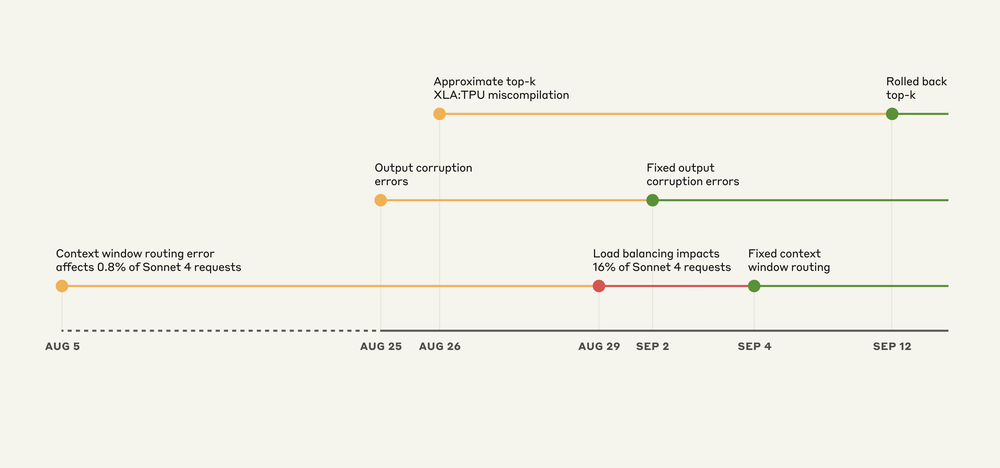
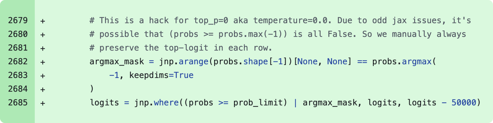
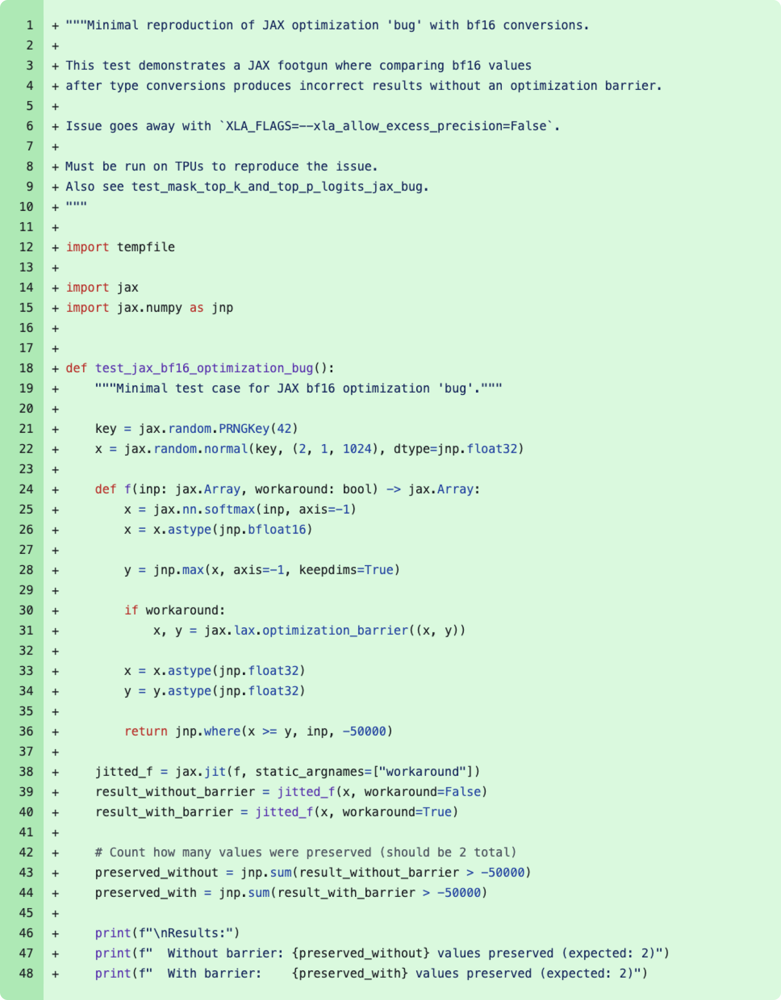
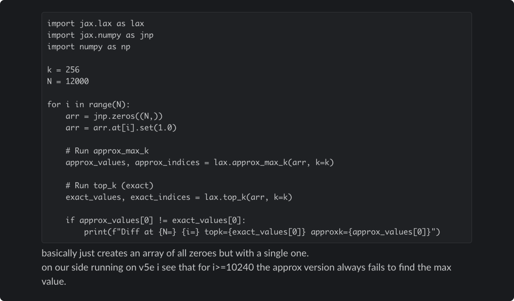

# 三起近期问题的复盘（A postmortem of three recent issues）

> **原文标题：** A postmortem of three recent issues
> **作者：** Sam McAllister
> **原文链接：** https://www.anthropic.com/engineering/a-postmortem-of-three-recent-issues
> **发布日期：** 2025-09-17
> 排版：每段英文原文在前，中文翻译紧随其后。术语保留英文原文并附中文释义。

---

Between August and early September, three infrastructure bugs intermittently degraded Claude's response quality. We've now resolved these issues and want to explain what happened.

8 月到 9 月初之间，三个基础设施 bug 间歇性地降低了 Claude 的回复质量。我们现在已经解决了这些问题，并想解释一下发生了什么。

In early August, a number of users began reporting degraded responses from Claude. These initial reports were difficult to distinguish from normal variation in user feedback. By late August, the increasing frequency and persistence of these reports prompted us to open an investigation that led us to uncover three separate infrastructure bugs.

8 月初，一些用户开始报告 Claude 的回复质量下降。这些最初的报告很难与用户反馈中的正常波动区分开来。到 8 月下旬，这些报告出现的频率和持续性不断增加，促使我们展开调查，最终发现了三个相互独立的基础设施 bug。

To state it plainly: We never reduce model quality due to demand, time of day, or server load. The problems our users reported were due to infrastructure bugs alone.

说得直白一点：我们绝不会因为需求、时段或服务器负载而降低模型质量。用户报告的问题完全是由基础设施 bug 造成的。

We recognize users expect consistent quality from Claude, and we maintain an extremely high bar for ensuring infrastructure changes don't affect model outputs. In these recent incidents, we didn't meet that bar. The following postmortem explains what went wrong, why detection and resolution took longer than we would have wanted, and what we're changing to prevent similar future incidents.

我们深知用户期望 Claude 提供稳定一致的质量，而我们也为"确保基础设施变更不影响模型输出"设立了极高的标准。在最近这几起事件中，我们没有达到这个标准。以下复盘将解释哪里出了问题、为什么检测和解决所花的时间超出了我们的预期，以及我们正在做出哪些改变，以防止类似事件再次发生。

We don't typically share this level of technical detail about our infrastructure, but the scope and complexity of these issues justified a more comprehensive explanation.

我们通常不会分享这种级别的基础设施技术细节，但这些问题的影响范围和复杂性，让我们有必要给出一个更全面的解释。

# 我们如何规模化地服务 Claude（How we serve Claude at scale）

We serve Claude to millions of users via our first-party API, Amazon Bedrock, and Google Cloud's Vertex AI. We deploy Claude across multiple hardware platforms, namely AWS Trainium, NVIDIA GPUs, and Google TPUs. This approach provides the capacity and geographic distribution necessary to serve users worldwide.

我们通过自有的一手 API（first-party API）、Amazon Bedrock 和 Google Cloud 的 Vertex AI，向数百万用户提供 Claude 服务。我们把 Claude 部署在多个硬件平台上，即 AWS Trainium、NVIDIA GPU 和 Google TPU。这种方法提供了服务全球用户所需的容量和地理分布。

Each hardware platform has different characteristics and requires specific optimizations. Despite these variations, we have strict equivalence standards for model implementations. Our aim is that users should get the same quality responses regardless of which platform serves their request. This complexity means that any infrastructure change requires careful validation across all platforms and configurations.

每个硬件平台都有不同的特性，需要针对性的优化。尽管存在这些差异，我们对模型实现有着严格的等价性标准。我们的目标是：无论哪个平台处理用户的请求，用户都应获得同等质量的回复。这种复杂性意味着，任何基础设施变更都需要在所有平台和配置上进行仔细的验证。

# 事件时间线（Timeline of events）

> Illustrative timeline of events on the Claude API. Yellow: issue detected, Red: degradation worsened, Green: fix deployed.
> Claude API 上的事件示意时间线。黄色：发现问题；红色：退化加剧；绿色：修复已部署。

The overlapping nature of these bugs made diagnosis particularly challenging. The first bug was introduced on August 5, affecting approximately 0.8% of requests made to Sonnet 4. Two more bugs arose from deployments on August 25 and 26.

这些 bug 相互重叠的特性让诊断变得尤为困难。第一个 bug 于 8 月 5 日引入，影响了约 0.8% 发送给 Sonnet 4 的请求。另外两个 bug 则源自 8 月 25 日和 26 日的部署。

Although initial impacts were limited, a load balancing change on August 29 started to increase affected traffic. This caused many more users to experience issues while others continued to see normal performance, creating confusing and contradictory reports.

虽然最初的影响有限，但 8 月 29 日的一项负载均衡（load balancing）变更开始增加受影响流量。这导致更多用户遇到问题，而另一些用户却仍能看到正常表现，从而产生了令人困惑且相互矛盾的报告。

# 三个相互重叠的问题（Three overlapping issues）

Below we describe the three bugs that caused the degradation, when they occurred, and how we resolved them:

下面我们介绍导致退化的三个 bug：它们何时发生，以及我们如何解决它们：

## 1. 上下文窗口路由错误（1. Context window routing error）

On August 5, some Sonnet 4 requests were misrouted to servers configured for the upcoming [1M token](https://docs.claude.com/en/docs/build-with-claude/context-windows#1m-token-context-window) [context window](https://docs.claude.com/en/docs/build-with-claude/context-windows). This bug initially affected 0.8% of requests. On August 29, a routine load balancing change unintentionally increased the number of short-context requests routed to the 1M context servers. At the worst impacted hour on August 31, 16% of Sonnet 4 requests were affected.

8 月 5 日，一些 Sonnet 4 请求被错误地路由到了为即将推出的 [1M token](https://docs.claude.com/en/docs/build-with-claude/context-windows#1m-token-context-window) [上下文窗口（context window）](https://docs.claude.com/en/docs/build-with-claude/context-windows) 而配置的服务器上。这个 bug 最初影响了 0.8% 的请求。8 月 29 日，一项常规的负载均衡变更无意中增加了被路由到 1M 上下文服务器的短上下文请求数量。在受影响最严重的 8 月 31 日时段，16% 的 Sonnet 4 请求受到了影响。

Approximately 30% of Claude Code users who made requests during this period had at least one message routed to the wrong server type, resulting in degraded responses. On Amazon Bedrock, misrouted traffic peaked at 0.18% of all Sonnet 4 requests from August 12. Incorrect routing affected less than 0.0004% of requests on Google Cloud's Vertex AI between August 27 and September 16.

在此期间发起请求的 Claude Code 用户中，约有 30% 至少有一条消息被路由到了错误的服务器类型，导致回复质量下降。在 Amazon Bedrock 上，自 8 月 12 日起，被错误路由的流量最高占所有 Sonnet 4 请求的 0.18%。8 月 27 日至 9 月 16 日期间，Google Cloud 的 Vertex AI 上受到错误路由影响的请求不到 0.0004%。

However, some users were affected more severely, as our routing is "sticky". This meant that once a request was served by the incorrect server, subsequent follow-ups were likely to be served by the same incorrect server.

不过，有些用户受到的影响更为严重，因为我们的路由是"粘性"（sticky）的。这意味着一旦某个请求由错误的服务器处理，后续的跟进请求也很可能由同一个错误的服务器处理。

**Resolution:** We fixed the routing logic to ensure short- and long-context requests were directed to the correct server pools. We deployed the fix on September 4. Rollout to our first-party platform and Google Cloud's Vertex AI was completed by September 16, and to AWS Bedrock by September 18.

**解决方案（Resolution）：** 我们修复了路由逻辑，确保短上下文和长上下文请求都被定向到正确的服务器池。我们于 9 月 4 日部署了修复。到 9 月 16 日，自有平台和 Google Cloud 的 Vertex AI 已完成推送，AWS Bedrock 则在 9 月 18 日完成。

## 2. 输出损坏（2. Output corruption）

On August 25, we deployed a misconfiguration to the Claude API TPU servers that caused an error during token generation. An issue caused by a runtime performance optimization occasionally assigned a high probability to tokens that should rarely be produced given the context, for example producing Thai or Chinese characters in response to English prompts, or producing obvious syntax errors in code. A small subset of users that asked a question in English might have seen "สวัสดี" in the middle of the response, for example.

8 月 25 日，我们向 Claude API 的 TPU 服务器部署了一个错误配置（misconfiguration），导致令牌（token）生成过程中出现错误。这个问题源于一项运行时性能优化（runtime performance optimization），它会偶尔给一些在给定上下文下本不应出现的令牌分配很高的概率，例如在回应英文提示时产生泰文或中文字符，或者在代码中产生明显的语法错误。例如，一小部分用英文提问的用户，可能会在回复中间看到"สวัสดี"。

This corruption affected requests made to Opus 4.1 and Opus 4 on August 25-28, and requests to Sonnet 4 August 25–September 2. Third-party platforms were not affected by this issue.

这一损坏问题影响了 8 月 25 日至 28 日发送给 Opus 4.1 和 Opus 4 的请求，以及 8 月 25 日至 9 月 2 日发送给 Sonnet 4 的请求。第三方平台未受此问题影响。

**Resolution:** We identified the issue and rolled back the change on September 2. We've added detection tests for unexpected character outputs to our deployment process.

**解决方案（Resolution）：** 我们定位到了问题，并于 9 月 2 日回滚了该项变更。我们已在部署流程中加入了针对异常字符输出的检测测试。

## 3. 近似 top-k 的 XLA:TPU 误编译（3. Approximate top-k XLA:TPU miscompilation）

On August 25, we deployed code to improve how Claude selects tokens during text generation. This change inadvertently triggered a latent bug in the XLA:TPU[1] compiler, which has been confirmed to affect requests to Claude Haiku 3.5.

8 月 25 日，我们部署了一段代码，用于改进 Claude 在文本生成过程中选择令牌的方式。这项变更无意中触发了 XLA:TPU[1] 编译器中的一个潜在（latent）bug，已确认该 bug 会影响发送给 Claude Haiku 3.5 的请求。

We also believe this could have impacted a subset of Sonnet 4 and Opus 3 on the Claude API. Third-party platforms were not affected by this issue.

我们还认为，这可能影响了 Claude API 上的一部分 Sonnet 4 和 Opus 3 请求。第三方平台未受此问题影响。

**Resolution:** We first observed the bug affecting Haiku 3.5 and rolled it back on September 4. We later noticed user reports of problems with Opus 3 that were compatible with this bug, and rolled it back on September 12. After extensive investigation we were unable to reproduce this bug on Sonnet 4 but decided to also roll it back out of an abundance of caution.

**解决方案（Resolution）：** 我们首先观察到该 bug 影响 Haiku 3.5，并于 9 月 4 日回滚。后来我们注意到用户关于 Opus 3 问题的报告与该 bug 相符，于是于 9 月 12 日回滚。经过大量调查，我们无法在 Sonnet 4 上复现该 bug，但出于充分的谨慎（out of an abundance of caution），我们还是决定一并回滚。

Simultaneously, we have (a) been working with the XLA:TPU team on a fix for the compiler bug and (b) rolled out a fix to use exact top-k with enhanced precision. For details, see the deep dive below.

与此同时，我们（a）正与 XLA:TPU 团队合作修复编译器 bug，（b）已推出一个使用高精度精确 top-k（exact top-k）的修复。详情请见下面的深入剖析。

# 深入剖析 XLA 编译器 bug（A closer look at the XLA compiler bug）

To illustrate the complexity of these issues, here's how the XLA compiler bug manifested and why it proved particularly challenging to diagnose.

为了说明这些问题的复杂性，下面介绍 XLA 编译器 bug 是如何显现的，以及为什么诊断它特别困难。

When Claude generates text, it calculates probabilities for each possible next word, then randomly chooses a sample from this probability distribution. We use "top-p sampling" to avoid nonsensical outputs—only considering words whose cumulative probability reaches a threshold (typically 0.99 or 0.999). On TPUs, our models run across multiple chips, with probability calculations happening in different locations. To sort these probabilities, we need to coordinate data between chips, which is complex.[2]

当 Claude 生成文本时，它会计算每个可能的下一个词的概率，然后从该概率分布中随机抽取一个样本。我们使用"top-p 采样"（top-p sampling）来避免无意义的输出——只考虑累积概率达到某个阈值（通常为 0.99 或 0.999）的词。在 TPU 上，我们的模型跨多块芯片运行，概率计算发生在不同的位置。要对这些概率进行排序，我们需要在芯片之间协调数据，这很复杂。[2]

In December 2024, we discovered our TPU implementation would occasionally drop the most probable token when [temperature](https://docs.claude.com/en/docs/about-claude/glossary#temperature) was zero. We deployed a workaround to fix this case.

2024 年 12 月，我们发现 TPU 实现在 [temperature（温度）](https://docs.claude.com/en/docs/about-claude/glossary#temperature) 为零时会偶尔丢弃概率最高的令牌。我们部署了一个变通方案（workaround）来修复这种情况。

> Code snippet of a December 2024 patch to work around the unexpected dropped token bug when temperature = 0.
> 2024 年 12 月补丁的代码片段，用于绕开 temperature = 0 时意外丢弃令牌的 bug。

The root cause involved mixed precision arithmetic. Our models compute next-token probabilities in [bf16](https://github.com/tensorflow/tensorflow/blob/f41959ccb2d9d4c722fe8fc3351401d53bcf4900/tensorflow/core/framework/bfloat16.h) (16-bit floating point). However, the vector processor is [fp32-native](https://dl.acm.org/doi/pdf/10.1145/3360307), so the TPU compiler (XLA) can optimize runtime by converting some operations to fp32 (32-bit). This optimization pass is guarded by the `xla_allow_excess_precision` flag which defaults to true.

根本原因涉及混合精度运算（mixed precision arithmetic）。我们的模型以 [bf16](https://github.com/tensorflow/tensorflow/blob/f41959ccb2d9d4c722fe8fc3351401d53bcf4900/tensorflow/core/framework/bfloat16.h)（16 位浮点数）计算下一个令牌的概率。然而，向量处理器是 [fp32-native](https://dl.acm.org/doi/pdf/10.1145/3360307) 的，因此 TPU 编译器（XLA）可以通过把部分运算转换为 fp32（32 位）来优化运行时性能。这个优化 pass 由 `xla_allow_excess_precision` 标志控制，该标志默认为 true。

This caused a mismatch: operations that should have agreed on the highest probability token were running at different precision levels. The precision mismatch meant they didn't agree on which token had the highest probability. This caused the highest probability token to sometimes disappear from consideration entirely.

这导致了不匹配：本应在"哪个令牌概率最高"上达成一致的操作，却以不同的精度级别运行。精度不匹配意味着它们对哪个令牌概率最高意见不一。这导致概率最高的令牌有时会完全从考虑范围中消失。

On August 26, we deployed a rewrite of our sampling code to fix the precision issues and improve how we handled probabilities at the limit that reach the top-p threshold. But in fixing these problems, we exposed a trickier one.

8 月 26 日，我们部署了对采样（sampling）代码的重写，以修复精度问题，并改进我们处理达到 top-p 阈值边界概率的方式。但在修复这些问题的过程中，我们暴露了一个更棘手的问题。

> Code snippet showing a minimized reproducer merged as part of the August 11 change that root-caused the "bug" being worked around in December 2024. In reality, it's expected behavior of the xla_allow_excess_precision flag.
> 代码片段：作为 8 月 11 日变更的一部分合并的最小化复现（reproducer）示例，它根因定位了 2024 年 12 月被绕开的那个"bug"。实际上，这是 `xla_allow_excess_precision` 标志的预期行为。

Our fix removed the December workaround because we believed we'd solved the root cause. This led to a deeper bug in the [approximate top-k](https://docs.jax.dev/en/latest/_autosummary/jax.lax.approx_max_k.html) operation—a performance optimization that quickly finds the highest probability tokens.[3] This approximation sometimes returned completely wrong results, but only for certain batch sizes and model configurations. The December workaround had been inadvertently masking this problem.

我们的修复移除了 12 月的变通方案，因为我们以为已经解决了根本原因。这暴露出了 [近似 top-k（approximate top-k）](https://docs.jax.dev/en/latest/_autosummary/jax.lax.approx_max_k.html) 操作中的一个更深层的 bug——这是一种能快速找出最高概率令牌的性能优化。[3] 这种近似操作有时会返回完全错误的结果，但只发生在某些批量大小（batch size）和模型配置下。12 月的变通方案一直在无意中掩盖着这个问题。

> Reproducer of the underlying approximate top-k bug shared with the XLA:TPU engineers who developed the algorithm. The code returns correct results when run on CPUs.
> 底层近似 top-k bug 的复现示例，已分享给开发该算法的 XLA:TPU 工程师。该代码在 CPU 上运行时返回正确结果。

The bug's behavior was frustratingly inconsistent. It changed depending on unrelated factors such as what operations ran before or after it, and whether debugging tools were enabled. The same prompt might work perfectly on one request and fail on the next.

这个 bug 的行为不一致得令人沮丧。它会随一些不相关的因素而变化，例如在它之前或之后运行了哪些操作，以及是否启用了调试工具。同一个提示词可能在一个请求上完美工作，而在下一个请求上失败。

While investigating, we also discovered that the exact top-k operation no longer had the prohibitive performance penalty it once did. We switched from approximate to exact top-k and standardized some additional operations on fp32 precision.[4] Model quality is non-negotiable, so we accepted the minor efficiency impact.

在调查过程中，我们还发现精确 top-k 操作不再像过去那样有令人望而却步的性能代价。我们转而用精确 top-k 替代近似 top-k，并把一些额外的操作统一为 fp32 精度。[4] 模型质量不可妥协，因此我们接受了这一轻微的效率影响。

# 为什么检测如此困难（Why detection was difficult）

Our validation process ordinarily relies on benchmarks alongside safety evaluations and performance metrics. Engineering teams perform spot checks and deploy to small "canary" groups first.

我们的验证流程通常依赖基准测试（benchmarks），并辅以安全评估和性能指标。工程团队会进行抽查，并先部署到小型的"金丝雀"（canary）测试组。

These issues exposed critical gaps that we should have identified earlier. The evaluations we ran simply didn't capture the degradation users were reporting, in part because Claude often recovers well from isolated mistakes. Our own privacy practices also created challenges in investigating reports. Our internal privacy and security controls limit how and when engineers can access user interactions with Claude, in particular when those interactions are not reported to us as feedback. This protects user privacy but prevents engineers from examining the problematic interactions needed to identify or reproduce bugs.

这些问题暴露了我们本应更早发现的严重缺口。我们运行的评测根本没有捕捉到用户所报告的退化，部分原因是 Claude 往往能很好地从孤立的小错误中恢复过来。我们自身的隐私实践也给调查报告带来了挑战。我们内部的隐私和安全控制限制了工程师何时以及如何访问用户与 Claude 的交互，尤其是当这些交互没有作为反馈报告给我们时。这保护了用户隐私，但也让工程师无法查看那些识别或复现 bug 所需的问题交互。

Each bug produced different symptoms on different platforms at different rates. This created a confusing mix of reports that didn't point to any single cause. It looked like random, inconsistent degradation.

每个 bug 都在不同平台上以不同的频率产生不同的症状。这制造了一堆令人困惑、无法指向任何单一原因的报告。看起来就像是随机的、不一致的退化。

More fundamentally, we relied too heavily on noisy evaluations. Although we were aware of an increase in reports online, we lacked a clear way to connect these to each of our recent changes. When negative reports spiked on August 29, we didn't immediately make the connection to an otherwise standard load balancing change.

更根本的是，我们过度依赖了有噪声的评测。虽然我们注意到网上的负面报告在增加，但我们缺乏一种清晰的方式，把这些报告与我们近期的各项变更联系起来。当 8 月 29 日负面报告激增时，我们没有立刻把它与一项原本很常规的负载均衡变更联系起来。

# 我们正在做出的改变（What we're changing）

As we continue to improve our infrastructure, we're also improving the way we evaluate and prevent bugs like those discussed above across all platforms where we serve Claude. Here's what we're changing:

在持续改进基础设施的同时，我们也在改进评估和预防上述这类 bug 的方式，覆盖我们服务 Claude 的所有平台。以下是我们正在做出的改变：

- **More sensitive evaluations:** To help discover the root cause of any given issue, we've developed evaluations that can more reliably differentiate between working and broken implementations. We'll keep improving these evaluations to keep a closer eye on model quality.
- **更敏感的评测（More sensitive evaluations）：** 为了帮助发现任何问题的根本原因，我们开发了能够更可靠地区分正常与损坏实现的评测。我们将持续改进这些评测，以更密切地关注模型质量。

- **Quality evaluations in more places:** Although we run regular evaluations on our systems, we will run them continuously on true production systems to catch issues such as the context window load balancing error.
- **在更多地方运行质量评测（Quality evaluations in more places）：** 虽然我们会定期在系统上运行评测，但我们还将在真实的生产系统上持续运行评测，以捕捉诸如上下文窗口负载均衡错误之类的问题。

- **Faster debugging tooling:** We'll develop infrastructure and tooling to better debug community-sourced feedback without sacrificing user privacy. Additionally, some bespoke tools developed here will be used to reduce the remediation time in future similar incidents, if those should occur.
- **更快的调试工具（Faster debugging tooling）：** 我们将开发基础设施和工具，以便在不牺牲用户隐私的情况下更好地调试来自社区的反馈。此外，这里开发的一些定制（bespoke）工具，将用于在未来发生类似事件时缩短修复时间。

Evals and monitoring are important. But these incidents have shown that we also need continuous signal from users when responses from Claude aren't up to the usual standard. Reports of specific changes observed, examples of unexpected behavior encountered, and patterns across different use cases all helped us isolate the issues.

评测（evals）和监控很重要。但这些事件表明，当 Claude 的回复达不到通常的标准时，我们还需要来自用户的持续信号。关于观察到的具体变化的报告、遇到的意外行为的示例，以及不同用例之间的模式，都帮助我们隔离了这些问题。

It remains particularly helpful for users to continue to send us their feedback directly. You can use the `/bug` command in Claude Code or you can use the "thumbs down" button in the Claude apps to do so. Developers and researchers often create new and interesting ways to evaluate model quality that complement our internal testing. If you'd like to share yours, reach out to [feedback@anthropic.com](mailto:feedback@anthropic.com).

用户继续直接向我们发送反馈仍然特别有帮助。你可以使用 Claude Code 中的 `/bug` 命令，或使用 Claude 应用中的"大拇指朝下"（thumbs down）按钮来提交反馈。开发者和研究者常常会创造出新颖有趣的模型质量评测方法，与我们的内部测试互为补充。如果你愿意分享你的方法，请联系 [feedback@anthropic.com](mailto:feedback@anthropic.com)。

We remain grateful to our community for these contributions.

我们始终感谢社区做出的这些贡献。

### 致谢（Acknowledgments）

Written by Sam McAllister, with thanks to Stuart Ritchie, Jonathan Gray, Kashyap Murali, Brennan Saeta, Oliver Rausch, Alex Palcuie, and many others.

本文由 Sam McAllister 撰写，感谢 Stuart Ritchie、Jonathan Gray、Kashyap Murali、Brennan Saeta、Oliver Rausch、Alex Palcuie 以及许多其他人的帮助。

[1] XLA:TPU is the optimizing compiler that translates [XLA](https://openxla.org/xla/architecture) High Level Optimizing language—often written using [JAX](https://docs.jax.dev/en/latest)—to TPU machine instructions.

[1] XLA:TPU 是优化编译器，它把 [XLA](https://openxla.org/xla/architecture) 高级优化语言——通常用 [JAX](https://docs.jax.dev/en/latest) 编写——转换为 TPU 机器指令。

[2] Our models are too large for single chips and are partitioned across tens of chips or more, making our sorting operation a distributed sort. TPUs (just like GPUs and Trainium) also have different performance characteristics than CPUs, requiring different implementation techniques using vectorized operations instead of serial algorithms.

[2] 我们的模型太大，无法放在单块芯片上，被分区到几十块甚至更多芯片上，因此我们的排序操作是一种分布式排序。TPU（和 GPU、Trainium 一样）与 CPU 相比也有不同的性能特征，需要使用不同的实现技术，例如使用向量化操作（vectorized operations）而非串行算法。

[3] We had been using this approximate operation because it yielded substantial performance improvements. The approximation works by accepting potential inaccuracies in the lowest probability tokens, which shouldn't affect quality—except when the bug caused it to drop the highest probability token instead.

[3] 我们一直在使用这种近似操作，因为它带来了显著的性能提升。这种近似的工作原理是接受最低概率令牌中可能存在的误差，这本不应影响质量——除非 bug 导致它反而丢弃了概率最高的令牌。

[4] Note that the now-correct top-k implementation may result in slight differences in the inclusion of tokens near the top-p threshold, and in rare cases users may benefit from re-tuning their choice of top-p.

[4] 请注意，现已修正的 top-k 实现可能会导致靠近 top-p 阈值的令牌在纳入时出现细微差异，在极少数情况下，用户可能受益于重新调整他们对 top-p 的选择。
