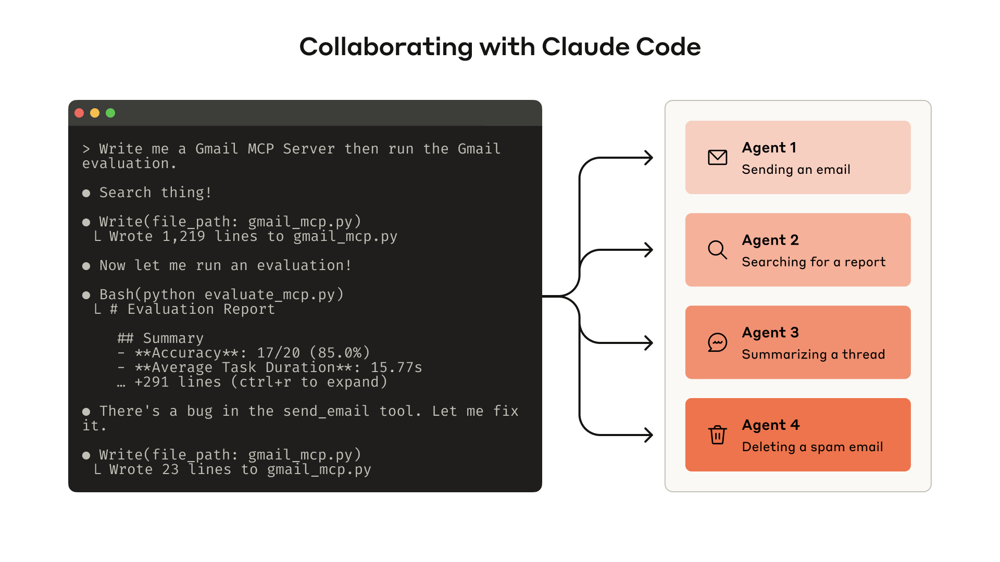
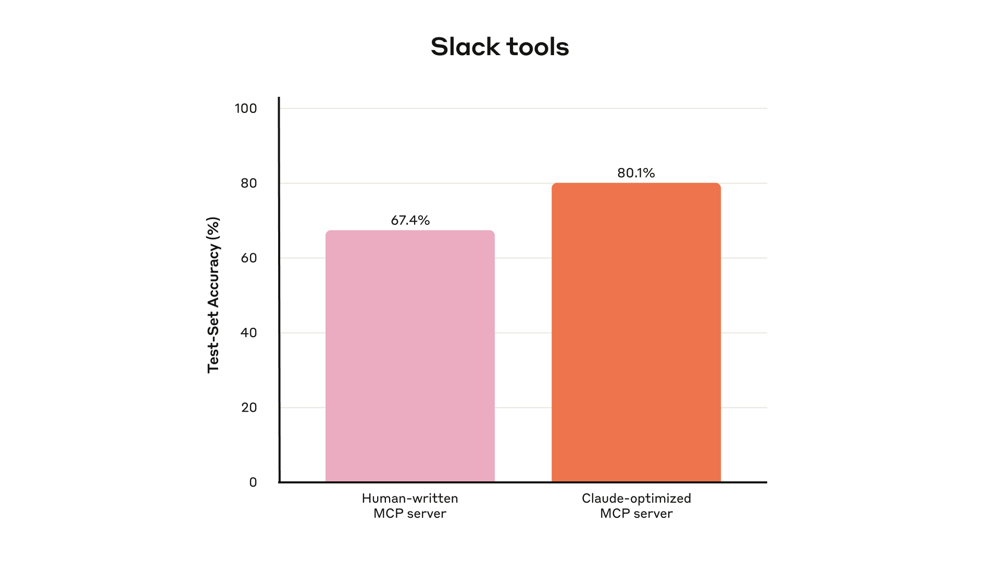
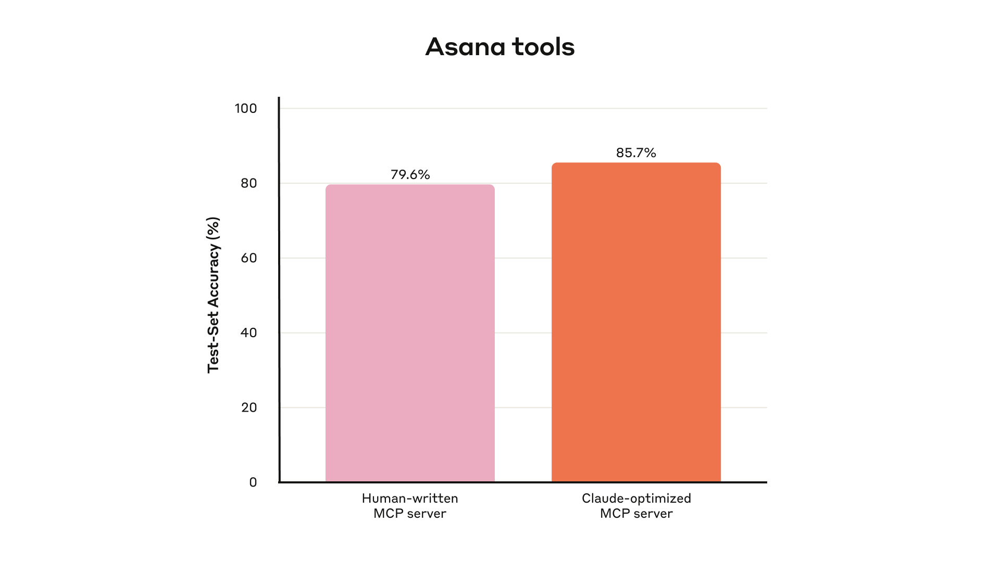
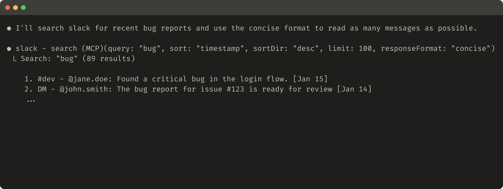
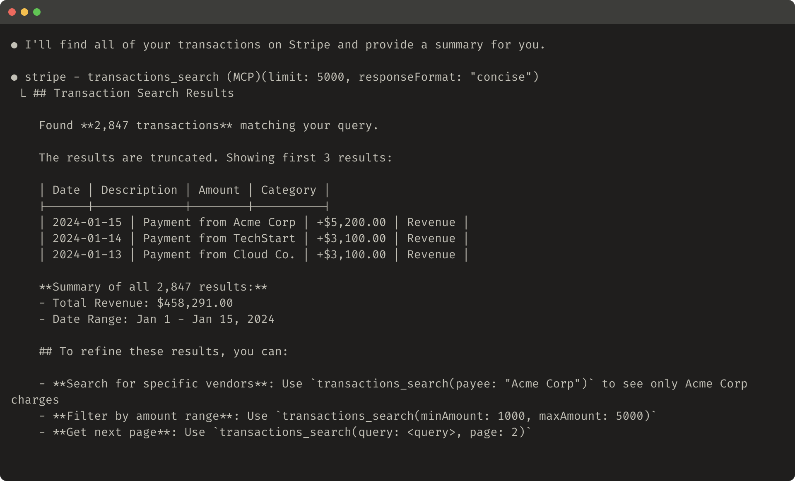
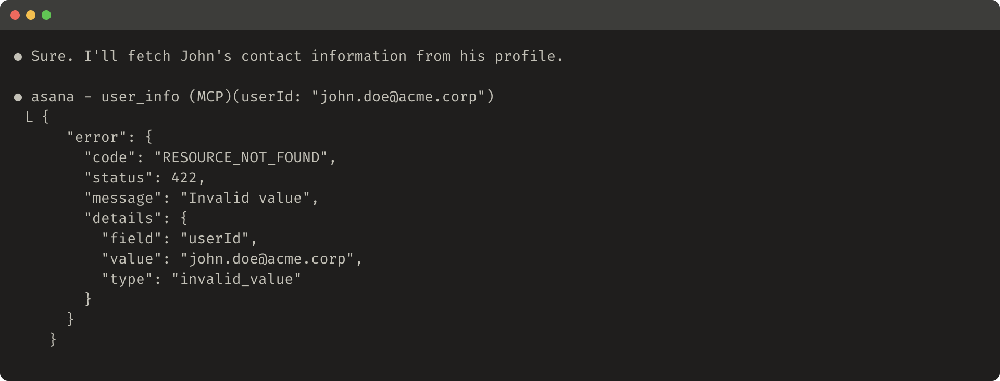
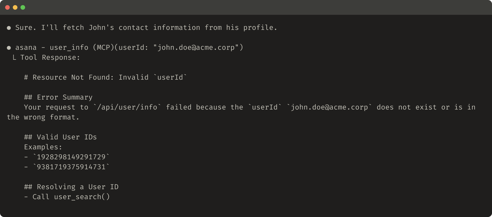

# 为 Agent 编写高效工具——与 Agent 协作（Writing effective tools for agents — with agents）

> **原文标题：** Writing effective tools for agents — with agents
> **作者：** Ken Aizawa
> **原文链接：** https://www.anthropic.com/engineering/writing-tools-for-agents
> **发布日期：** 2025-09-11
> 排版：每段英文原文在前，中文翻译紧随其后。术语保留英文原文并附中文释义。

---

The [Model Context Protocol (MCP)](https://modelcontextprotocol.io/docs/getting-started/intro) can empower LLM agents with potentially hundreds of tools to solve real-world tasks. But how do we make those tools maximally effective?

[模型上下文协议（Model Context Protocol，MCP）](https://modelcontextprotocol.io/docs/getting-started/intro) 可以为 LLM Agent 提供成百上千个工具，用于解决真实世界的任务。但我们如何让这些工具发挥最大效用呢？

In this post, we describe our most effective techniques for improving performance in a variety of agentic AI systems[1].

在这篇文章中，我们介绍在各种 Agentic AI（智能体式 AI）系统[1] 中提升性能的最有效技术。

We begin by covering how you can:

我们首先介绍如何：

- Build and test prototypes of your tools
- 构建并测试你工具的原型（prototypes）

- Create and run comprehensive evaluations of your tools with agents
- 用 Agent 创建并运行针对你工具的全面评测（evaluations）

- Collaborate with agents like Claude Code to automatically increase the performance of your tools
- 与 Claude Code 这样的 Agent 协作，自动提升你工具的性能

We conclude with key principles for writing high-quality tools we've identified along the way:

最后，我们总结一路走来发现的、编写高质量工具的关键原则：

- Choosing the right tools to implement (and not to implement)
- 选择合适的工具去实现（以及不去实现哪些）

- Namespacing tools to define clear boundaries in functionality
- 对工具进行命名空间（namespacing）分组，以在功能上划定清晰的边界

- Returning meaningful context from tools back to agents
- 从工具向 Agent 返回有意义的上下文

- Optimizing tool responses for token efficiency
- 针对令牌效率（token efficiency）优化工具响应

- Prompt-engineering tool descriptions and specs
- 对工具描述和规范（specs）进行提示词工程（prompt-engineering）



> Building an evaluation allows you to systematically measure the performance of your tools. You can use Claude Code to automatically optimize your tools against this evaluation.
> 构建评测让你能够系统地衡量工具的性能。你可以使用 Claude Code 依据该评测自动优化你的工具。

# 什么是工具？（What is a tool?）

In computing, deterministic systems produce the same output every time given identical inputs, while *non-deterministic* systems—like agents—can generate varied responses even with the same starting conditions.

在计算领域，确定性（deterministic）系统在输入相同的情况下每次都会产生相同的输出；而*非确定性*（non-deterministic）系统——比如 Agent——即使在相同的起始条件下也可能生成不同的响应。

When we traditionally write software, we're establishing a contract between deterministic systems. For instance, a function call like `getWeather("NYC")` will always fetch the weather in New York City in the exact same manner every time it is called.

传统上我们编写软件，是在确定性系统之间建立一种契约。例如，`getWeather("NYC")` 这样的函数调用，每次被调用时都会以完全相同的方式获取纽约市的天气。

Tools are a new kind of software which reflects a contract between deterministic systems and non-deterministic agents. When a user asks "Should I bring an umbrella today?," an agent might call the weather tool, answer from general knowledge, or even ask a clarifying question about location first. Occasionally, an agent might hallucinate or even fail to grasp how to use a tool.

工具（tools）是一种新型软件，它体现的是确定性系统与非确定性 Agent 之间的契约。当用户问"我今天该带伞吗？"时，Agent 可能会调用天气工具，可能会凭常识回答，甚至可能先问一个关于位置的澄清问题。偶尔，Agent 也可能会产生幻觉（hallucinate），甚至无法理解如何使用某个工具。

This means fundamentally rethinking our approach when writing software for agents: instead of writing tools and [MCP servers](https://modelcontextprotocol.io/) the way we'd write functions and APIs for other developers or systems, we need to design them for agents.

这意味着在为 Agent 编写软件时需要从根本上重新思考我们的方法：与其像为其他开发者或系统编写函数和 API 那样去编写工具和 [MCP 服务器](https://modelcontextprotocol.io/)，我们需要为 Agent 来设计它们。

Our goal is to increase the surface area over which agents can be effective in solving a wide range of tasks by using tools to pursue a variety of successful strategies. Fortunately, in our experience, the tools that are most "ergonomic" for agents also end up being surprisingly intuitive to grasp as humans.

我们的目标是扩大 Agent 能够发挥效力的覆盖面（surface area），让它们借助工具、通过多种成功策略来解决各种各样的任务。幸运的是，根据我们的经验，对 Agent 来说最"符合人体工学"（ergonomic）的工具，对人来说也往往会出奇地直观易懂。

# 如何编写工具（How to write tools）

In this section, we describe how you can collaborate with agents both to write and to improve the tools you give them. Start by standing up a quick prototype of your tools and testing them locally. Next, run a comprehensive evaluation to measure subsequent changes. Working alongside agents, you can repeat the process of evaluating and improving your tools until your agents achieve strong performance on real-world tasks.

在这一节中，我们介绍如何与 Agent 协作——既编写工具，也改进你提供给它们的工具。首先，快速搭起工具的原型并在本地测试。接着，运行一个全面的评测来衡量后续的变更。与 Agent 并肩工作，你可以不断重复"评测—改进"工具的过程，直到你的 Agent 在真实世界任务上取得出色表现。

## 构建原型（Building a prototype）

It can be difficult to anticipate which tools agents will find ergonomic and which tools they won't without getting hands-on yourself. Start by standing up a quick prototype of your tools. If you're using [Claude Code](https://www.anthropic.com/claude-code) to write your tools (potentially in one-shot), it helps to give Claude documentation for any software libraries, APIs, or SDKs (including potentially the [MCP SDK](https://modelcontextprotocol.io/docs/sdk)) your tools will rely on. LLM-friendly documentation can commonly be found in flat `llms.txt` files on official documentation sites (here's our [API's](https://docs.anthropic.com/llms.txt)).

如果你不亲自动手，就很难预判哪些工具 Agent 会觉得顺手、哪些不会。先快速搭起工具的原型吧。如果你正在使用 [Claude Code](https://www.anthropic.com/claude-code) 编写工具（可能一次性生成），最好把你工具所依赖的任何软件库、API 或 SDK（可能包括 [MCP SDK](https://modelcontextprotocol.io/docs/sdk)）的文档提供给 Claude。对 LLM 友好的文档通常可以在官方文档网站的扁平 `llms.txt` 文件中找到（这是我们的 [API](https://docs.anthropic.com/llms.txt) 的）。

Wrapping your tools in a [local MCP server](https://modelcontextprotocol.io/docs/develop/connect-local-servers) or [Desktop extension](https://www.anthropic.com/engineering/desktop-extensions) (DXT) will allow you to connect and test your tools in Claude Code or the Claude Desktop app.

把你的工具包装进[本地 MCP 服务器](https://modelcontextprotocol.io/docs/develop/connect-local-servers)或[桌面扩展（Desktop extension）](https://www.anthropic.com/engineering/desktop-extensions)（DXT），就能在 Claude Code 或 Claude 桌面应用中连接并测试你的工具。

To connect your local MCP server to Claude Code, run `claude mcp add <name> <command> [args...]`.

要把本地 MCP 服务器连接到 Claude Code，运行 `claude mcp add <name> <command> [args...]` 即可。

To connect your local MCP server or DXT to the Claude Desktop app, navigate to `Settings > Developer` or `Settings > Extensions`, respectively.

要把本地 MCP 服务器或 DXT 连接到 Claude 桌面应用，分别导航到 `Settings > Developer`（设置 > 开发者）或 `Settings > Extensions`（设置 > 扩展）。

Tools can also be passed directly into [Anthropic API](https://docs.anthropic.com/en/docs/agents-and-tools/tool-use/overview) calls for programmatic testing.

工具也可以直接传入 [Anthropic API](https://docs.anthropic.com/en/docs/agents-and-tools/tool-use/overview) 调用中进行程序化测试。

Test the tools yourself to identify any rough edges. Collect feedback from your users to build an intuition around the use-cases and prompts you expect your tools to enable.

亲自测试这些工具，找出任何粗糙之处。收集用户的反馈，围绕你期望工具支持的用例和提示词建立直觉。

## 运行评测（Running an evaluation）

Next, you need to measure how well Claude uses your tools by running an evaluation. Start by generating lots of evaluation tasks, grounded in real world uses. We recommend collaborating with an agent to help analyze your results and determine how to improve your tools. See this process end-to-end in our [tool evaluation cookbook](https://platform.claude.com/cookbook/tool-evaluation-tool-evaluation).

接下来，你需要通过运行评测来衡量 Claude 使用你工具的效果。首先，生成大量基于真实世界用途的评测任务。我们建议与 Agent 协作，帮助分析你的结果并决定如何改进你的工具。在我们的[工具评测 cookbook](https://platform.claude.com/cookbook/tool-evaluation-tool-evaluation) 中可以端到端地看到这一流程。



> Held-out test set performance of our internal Slack tools
> 我们内部 Slack 工具的留出测试集（held-out test set）表现

**Generating evaluation tasks**

**生成评测任务（Generating evaluation tasks）**

With your early prototype, Claude Code can quickly explore your tools and create dozens of prompt and response pairs. Prompts should be inspired by real-world uses and be based on realistic data sources and services (for example, internal knowledge bases and microservices). We recommend you avoid overly simplistic or superficial "sandbox" environments that don't stress-test your tools with sufficient complexity. Strong evaluation tasks might require multiple tool calls—potentially dozens.

借助早期原型，Claude Code 可以快速探索你的工具，并创建几十对提示词和响应。提示词应源于真实世界的用途，并基于真实的数据源和服务（例如内部知识库和微服务）。我们建议你避免过于简单或表面的"沙箱"（sandbox）环境——它们无法用足够的复杂度来压力测试你的工具。高质量的评测任务可能需要多次工具调用——甚至几十次。

Here are some examples of strong tasks:

以下是一些高质量任务的示例：

- Schedule a meeting with Jane next week to discuss our latest Acme Corp project. Attach the notes from our last project planning meeting and reserve a conference room.
- 下周与 Jane 安排一次会议，讨论我们最新的 Acme Corp 项目。附上我们上次项目规划会议的笔记，并预订一间会议室。

- Customer ID 9182 reported that they were charged three times for a single purchase attempt. Find all relevant log entries and determine if any other customers were affected by the same issue.
- 客户 ID 9182 报告说，一次购买尝试被收取了三次费用。找出所有相关日志条目，并判断是否有其他客户受到同一问题的影响。

- Customer Sarah Chen just submitted a cancellation request. Prepare a retention offer. Determine: (1) why they're leaving, (2) what retention offer would be most compelling, and (3) any risk factors we should be aware of before making an offer.
- 客户 Sarah Chen 刚刚提交了取消订阅请求。准备一份挽留（retention）方案。请确定：（1）他们离开的原因；（2）什么样的挽留方案最有吸引力；（3）在提出方案之前我们应注意哪些风险因素。

And here are some weaker tasks:

而以下是一些较弱的任务：

- Schedule a meeting with jane@acme.corp next week.
- 下周与 jane@acme.corp 安排一次会议。

- Search the payment logs for `purchase_complete` and `customer_id=9182`.
- 在支付日志中搜索 `purchase_complete` 和 `customer_id=9182`。

- Find the cancellation request by Customer ID 45892.
- 按客户 ID 45892 查找取消请求。

Each evaluation prompt should be paired with a verifiable response or outcome. Your verifier can be as simple as an exact string comparison between ground truth and sampled responses, or as advanced as enlisting Claude to judge the response. Avoid overly strict verifiers that reject correct responses due to spurious differences like formatting, punctuation, or valid alternative phrasings.

每个评测提示词都应配对一个可验证的响应或结果。你的验证器（verifier）可以简单到在基准答案（ground truth）和采样响应之间做精确的字符串比较，也可以高级到让 Claude 来评判响应。要避免过于严格的验证器，因为这类验证器会因格式、标点或合理替代表述等无关差异而拒绝正确响应。

For each prompt-response pair, you can optionally also specify the tools you expect an agent to call in solving the task, to measure whether or not agents are successful in grasping each tool's purpose during evaluation. However, because there might be multiple valid paths to solving tasks correctly, try to avoid overspecifying or overfitting to strategies.

对于每一对提示词-响应，你也可以选择指定你期望 Agent 在解决任务时调用的工具，以衡量 Agent 在评测期间是否成功领会了每个工具的用途。不过，由于正确解决问题可能有多条有效路径，尽量避免过度指定或过度拟合某种策略。

**Running the evaluation**

**运行评测（Running the evaluation）**

We recommend running your evaluation programmatically with direct LLM API calls. Use simple agentic loops (`while`-loops wrapping alternating LLM API and tool calls): one loop for each evaluation task. Each evaluation agent should be given a single task prompt and your tools.

我们建议通过直接调用 LLM API，以程序化方式运行评测。使用简单的 agentic 循环（agentic loops，`while` 循环，交替包裹 LLM API 调用和工具调用）：每个评测任务对应一个循环。每个评测 Agent 应被给予一个任务提示词和你的工具。

In your evaluation agents' system prompts, we recommend instructing agents to output not just structured response blocks (for verification), but also reasoning and feedback blocks. Instructing agents to output these *before* tool call and response blocks may increase LLMs' effective intelligence by triggering chain-of-thought (CoT) behaviors.

在评测 Agent 的系统提示（system prompt）中，我们建议指示 Agent 不仅要输出结构化的响应块（用于验证），还要输出推理（reasoning）和反馈（feedback）块。指示 Agent 在工具调用块和响应块*之前*输出这些内容，可以通过触发思维链（chain-of-thought，CoT）行为来提高 LLM 的有效智能。

If you're running your evaluation with Claude, you can turn on [interleaved thinking](https://docs.anthropic.com/en/docs/build-with-claude/extended-thinking#interleaved-thinking) for similar functionality "off-the-shelf". This will help you probe why agents do or don't call certain tools and highlight specific areas of improvement in tool descriptions and specs.

如果你用 Claude 运行评测，可以开启[交错思考（interleaved thinking）](https://docs.anthropic.com/en/docs/build-with-claude/extended-thinking#interleaved-thinking)，即可"开箱即用"（off-the-shelf）地获得类似功能。这能帮助你探查 Agent 为什么调用或不调用某些工具，并凸显工具描述和规范中需要改进的具体方面。

As well as top-level accuracy, we recommend collecting other metrics like the total runtime of individual tool calls and tasks, the total number of tool calls, the total token consumption, and tool errors. Tracking tool calls can help reveal common workflows that agents pursue and offer some opportunities for tools to consolidate.

除了顶层准确率之外，我们还建议收集其他指标，例如单个工具调用和任务的总体运行时间、工具调用的总次数、总令牌消耗量，以及工具错误。跟踪工具调用有助于揭示 Agent 常用的工作流，并带来一些合并工具的机会。



> Held-out test set performance of our internal Asana tools
> 我们内部 Asana 工具的留出测试集表现

**Analyzing results**

**分析结果（Analyzing results）**

Agents are your helpful partners in spotting issues and providing feedback on everything from contradictory tool descriptions to inefficient tool implementations and confusing tool schemas. However, keep in mind that what agents omit in their feedback and responses can often be more important than what they include. LLMs don't always [say what they mean](https://www.anthropic.com/research/tracing-thoughts-language-model).

Agent 是你发现问题的得力伙伴，能就一切提供反馈——从自相矛盾的工具描述，到低效的工具实现，再到令人困惑的工具 schema。不过要记住，Agent 在反馈和响应中*省略*的内容往往比它们*包含*的内容更重要。LLM 并不总是[言为心声](https://www.anthropic.com/research/tracing-thoughts-language-model)。

Observe where your agents get stumped or confused. Read through your evaluation agents' reasoning and feedback (or CoT) to identify rough edges. Review the raw transcripts (including tool calls and tool responses) to catch any behavior not explicitly described in the agent's CoT. Read between the lines; remember that your evaluation agents don't necessarily know the correct answers and strategies.

观察你的 Agent 在哪里卡壳或感到困惑。通读评测 Agent 的推理和反馈（或 CoT），找出粗糙之处。审查原始转录（transcripts，包括工具调用和工具响应），捕捉 Agent 的 CoT 中没有明确描述的任何行为。要读出言外之意；记住，你的评测 Agent 不一定知道正确的答案和策略。

Analyze your tool calling metrics. Lots of redundant tool calls might suggest some rightsizing of pagination or token limit parameters is warranted; lots of tool errors for invalid parameters might suggest tools could use clearer descriptions or better examples. When we launched Claude's [web search tool](https://www.anthropic.com/news/web-search), we identified that Claude was needlessly appending `2025` to the tool's `query` parameter, biasing search results and degrading performance (we steered Claude in the right direction by improving the tool description).

分析你的工具调用指标。大量冗余的工具调用可能表明需要对分页（pagination）或令牌上限参数进行合理的调优；大量因无效参数导致的工具错误，可能表明工具需要更清晰的描述或更好的示例。当我们推出 Claude 的[网页搜索工具](https://www.anthropic.com/news/web-search)时，我们发现 Claude 会向该工具的 `query` 参数无谓地追加 `2025`，这会偏向搜索结果并降低性能（我们通过改进工具描述，把 Claude 引向了正确的方向）。

## 与 Agent 协作（Collaborating with agents）

You can even let agents analyze your results and improve your tools for you. Simply concatenate the transcripts from your evaluation agents and paste them into Claude Code. Claude is an expert at analyzing transcripts and refactoring lots of tools all at once—for example, to ensure tool implementations and descriptions remain self-consistent when new changes are made.

你甚至可以委托 Agent 为你分析结果并改进工具。只需把评测 Agent 的转录拼接起来，粘贴到 Claude Code 中即可。Claude 是分析转录和一次性重构大量工具的专家——例如，确保工具实现和描述在新变更落地时仍保持自洽。

In fact, most of the advice in this post came from repeatedly optimizing our internal tool implementations with Claude Code. Our evaluations were created on top of our internal workspace, mirroring the complexity of our internal workflows, including real projects, documents, and messages.

事实上，这篇文章中的大部分建议都来自我们用 Claude Code 反复优化内部工具实现的经验。我们的评测是在内部工作区之上构建的，镜像了我们内部工作流的复杂度，包括真实的项目、文档和消息。

We relied on held-out test sets to ensure we did not overfit to our "training" evaluations. These test sets revealed that we could extract additional performance improvements even beyond what we achieved with "expert" tool implementations—whether those tools were manually written by our researchers or generated by Claude itself.

我们依赖留出测试集（held-out test sets）来确保不会过度拟合我们的"训练"评测。这些测试集揭示，我们还能挖掘出额外的性能提升——甚至超出我们用"专家级"工具实现所取得的成果，无论这些工具是由我们的研究者手工编写，还是由 Claude 自己生成。

In the next section, we'll share some of what we learned from this process.

在下一节中，我们将分享从这个过程中学到的一些经验。

# 编写高效工具的原则（Principles for writing effective tools）

In this section, we distill our learnings into a few guiding principles for writing effective tools.

在这一节中，我们把学到的经验提炼为几条编写高效工具的指导原则。

## 为 Agent 选择合适的工具（Choosing the right tools for agents）

More tools don't always lead to better outcomes. A common error we've observed is tools that merely wrap existing software functionality or API endpoints—whether or not the tools are appropriate for agents. This is because agents have distinct "affordances" to traditional software—that is, they have different ways of perceiving the potential actions they can take with those tools

更多的工具并不总是带来更好的结果。我们观察到的一个常见错误，是那些仅仅包装现有软件功能或 API 端点的工具——不管这些工具是否适合 Agent。这是因为 Agent 与传统软件相比有着不同的"可供性"（affordances）——也就是说，它们感知自己能用这些工具采取哪些潜在行动的方式不同。

LLM agents have limited "context" (that is, there are limits to how much information they can process at once), whereas computer memory is cheap and abundant. Consider the task of searching for a contact in an address book. Traditional software programs can efficiently store and process a list of contacts one at a time, checking each one before moving on.

LLM Agent 的"上下文"（context）是有限的（也就是说，它们一次能处理的信息量是有上限的），而计算机内存既便宜又充足。以在通讯录中搜索联系人这一任务为例。传统软件程序可以高效地存储并逐个处理联系人列表，检查完一个再继续下一个。

However, if an LLM agent uses a tool that returns ALL contacts and then has to read through each one token-by-token, it's wasting its limited context space on irrelevant information (imagine searching for a contact in your address book by reading each page from top-to-bottom—that is, via brute-force search). The better and more natural approach (for agents and humans alike) is to skip to the relevant page first (perhaps finding it alphabetically).

然而，如果 LLM Agent 使用一个返回*所有*联系人的工具，然后不得不逐个、逐令牌地读完，它就是把有限的上下文空间浪费在了无关信息上（想象一下，为了在通讯录中找一个联系人，你从第一页到最后一页逐页通读——也就是暴力（brute-force）搜索）。更好、也更自然的方法（无论对 Agent 还是人类）是先直接跳到相关的那一页（也许按字母顺序找到它）。

We recommend building a few thoughtful tools targeting specific high-impact workflows, which match your evaluation tasks and scaling up from there. In the address book case, you might choose to implement a `search_contacts` or `message_contact` tool instead of a `list_contacts` tool.

我们建议构建少量精心设计的工具，瞄准特定的高影响力工作流，让它们与你的评测任务相匹配，并在此基础上扩展。在通讯录这个例子中，你可能会选择实现 `search_contacts` 或 `message_contact` 工具，而不是 `list_contacts` 工具。

Tools can consolidate functionality, handling potentially *multiple* discrete operations (or API calls) under the hood. For example, tools can enrich tool responses with related metadata or handle frequently chained, multi-step tasks in a single tool call.

工具可以整合功能，在内部处理可能*多个*独立的操作（或 API 调用）。例如，工具可以用相关元数据丰富工具响应，或者在一次工具调用中处理经常串联的多步骤任务。

Here are some examples:

以下是一些示例：

- Instead of implementing a `list_users`, `list_events`, and `create_event` tools, consider implementing a `schedule_event` tool which finds availability and schedules an event.
- 与其实现 `list_users`、`list_events` 和 `create_event` 三个工具，不如考虑实现一个 `schedule_event` 工具，它可以查找可用时间并安排活动。

- Instead of implementing a `read_logs` tool, consider implementing a `search_logs` tool which only returns relevant log lines and some surrounding context.
- 与其实现 `read_logs` 工具，不如考虑实现一个 `search_logs` 工具，它只返回相关的日志行以及一些周边上下文。

- Instead of implementing `get_customer_by_id`, `list_transactions`, and `list_notes` tools, implement a `get_customer_context` tool which compiles all of a customer's recent & relevant information all at once.
- 与其实现 `get_customer_by_id`、`list_transactions` 和 `list_notes` 三个工具，不如实现一个 `get_customer_context` 工具，一次性汇总某个客户所有近期且相关的信息。

Make sure each tool you build has a clear, distinct purpose. Tools should enable agents to subdivide and solve tasks in much the same way that a human would, given access to the same underlying resources, and simultaneously reduce the context that would have otherwise been consumed by intermediate outputs.

确保你构建的每个工具都有清晰、独特的用途。工具应当让 Agent 能够像人类那样去拆解和解决问题——在拥有相同底层资源的前提下——同时减少那些原本会被中间输出消耗掉的上下文。

Too many tools or overlapping tools can also distract agents from pursuing efficient strategies. Careful, selective planning of the tools you build (or don't build) can really pay off.

过多的工具或相互重叠的工具，也会分散 Agent 的注意力，使其无法采取高效的策略。审慎、有选择地规划你要构建（或不构建）的工具，确实能带来回报。

## 为你的工具设置命名空间（Namespacing your tools）

Your AI agents will potentially gain access to dozens of MCP servers and hundreds of different tools–including those by other developers. When tools overlap in function or have a vague purpose, agents can get confused about which ones to use.

你的 AI Agent 可能会访问几十个 MCP 服务器和成百上千个不同的工具——其中包括其他开发者提供的工具。当工具在功能上重叠或用途模糊时，Agent 可能会搞不清该用哪个。

Namespacing (grouping related tools under common prefixes) can help delineate boundaries between lots of tools; MCP clients sometimes do this by default. For example, namespacing tools by service (e.g., `asana_search`, `jira_search`) and by resource (e.g., `asana_projects_search`, `asana_users_search`), can help agents select the right tools at the right time.

命名空间（namespacing，把相关工具归入共同前缀之下）有助于在大量工具之间划清边界；MCP 客户端有时会默认这样做。例如，按服务对工具进行命名空间分组（如 `asana_search`、`jira_search`），或按资源分组（如 `asana_projects_search`、`asana_users_search`），可以帮助 Agent 在正确的时机选择正确的工具。

We have found selecting between prefix- and suffix-based namespacing to have non-trivial effects on our tool-use evaluations. Effects vary by LLM and we encourage you to choose a naming scheme according to your own evaluations.

我们发现，选择基于前缀还是基于后缀的命名空间分组，会对我们的工具使用评测产生显著影响。其效果因 LLM 而异，我们鼓励你根据自己的评测来选择命名方案。

Agents might call the wrong tools, call the right tools with the wrong parameters, call too few tools, or process tool responses incorrectly. By selectively implementing tools whose names reflect natural subdivisions of tasks, you simultaneously reduce the number of tools and tool descriptions loaded into the agent's context and offload agentic computation from the agent's context back into the tool calls themselves. This reduces an agent's overall risk of making mistakes.

Agent 可能会调用错误的工具、用错误的参数调用正确的工具、调用过少的工具，或错误地处理工具响应。通过有选择地实现那些名称能反映任务自然切分的工具，你同时减少了加载进 Agent 上下文的工具数量和工具描述数量，并把 agentic 计算从 Agent 的上下文卸载回工具调用本身。这降低了 Agent 整体犯错的风险。

## 从你的工具返回有意义的上下文（Returning meaningful context from your tools）

In the same vein, tool implementations should take care to return only high signal information back to agents. They should prioritize contextual relevance over flexibility, and eschew low-level technical identifiers (for example: `uuid`, `256px_image_url`, `mime_type`). Fields like `name`, `image_url`, and `file_type` are much more likely to directly inform agents' downstream actions and responses.

同理，工具实现应注意只向 Agent 返回高信号（high signal）的信息。它们应优先考虑上下文相关性而非灵活性，并避开底层的技术标识符（例如：`uuid`、`256px_image_url`、`mime_type`）。像 `name`、`image_url`、`file_type` 这样的字段，更有可能直接为 Agent 的下游行动和响应提供依据。

Agents also tend to grapple with natural language names, terms, or identifiers significantly more successfully than they do with cryptic identifiers. We've found that merely resolving arbitrary alphanumeric UUIDs to more semantically meaningful and interpretable language (or even a 0-indexed ID scheme) significantly improves Claude's precision in retrieval tasks by reducing hallucinations.

Agent 处理自然语言的名称、术语或标识符，通常比处理晦涩难懂的标识符要成功得多。我们发现，仅仅把随机的字母数字 UUID 解析为更具语义、更可解释的语言（甚至是一个从 0 开始的 ID 方案），就能通过减少幻觉，显著提升 Claude 在检索任务中的精确度。

In some instances, agents may require the flexibility to interact with both natural language and technical identifiers outputs, if only to trigger downstream tool calls (for example, `search_user(name='jane')` → `send_message(id=12345)`). You can enable both by exposing a simple `response_format` enum parameter in your tool, allowing your agent to control whether tools return "concise" or "detailed" responses (images below).

在某些情况下，Agent 可能需要灵活性，同时处理自然语言和技术标识符的输出——哪怕只是为了触发下游工具调用（例如 `search_user(name='jane')` → `send_message(id=12345)`）。你可以通过在工具中暴露一个简单的 `response_format` 枚举参数来同时支持两者，让 Agent 控制工具返回"简洁"（concise）还是"详细"（detailed）的响应（见下图）。

You can add more formats for even greater flexibility, similar to GraphQL where you can choose exactly which pieces of information you want to receive. Here is an example ResponseFormat enum to control tool response verbosity:

你还可以添加更多格式以获得更大的灵活性，类似于 GraphQL——你可以精确选择想要接收哪些信息。下面是一个用于控制工具响应详略程度的 ResponseFormat 枚举示例：

```text
enum ResponseFormat {
   DETAILED = "detailed",
   CONCISE = "concise"
}
```

Here's an example of a detailed tool response (206 tokens):

以下是一个详细（detailed）工具响应的示例（206 个令牌）：


Here's an example of a concise tool response (72 tokens):

以下是一个简洁（concise）工具响应的示例（72 个令牌）：



> Slack threads and thread replies are identified by unique thread_ts which are required to fetch thread replies. thread_ts and other IDs (channel_id, user_id) can be retrieved from a "detailed" tool response to enable further tool calls that require these. "concise" tool responses return only thread content and exclude IDs. In this example, we use ~⅓ of the tokens with "concise" tool responses.
> Slack 线程和线程回复通过唯一的 thread_ts 标识，获取线程回复时需要用到它。thread_ts 和其他 ID（channel_id、user_id）可以从"detailed"工具响应中获取，以支持需要这些信息的后续工具调用。"concise"工具响应只返回线程内容，不包含 ID。在这个示例中，使用"concise"工具响应我们只用了约 1/3 的令牌。

Even your tool response structure—for example XML, JSON, or Markdown—can have an impact on evaluation performance: there is no one-size-fits-all solution. This is because LLMs are trained on next-token prediction and tend to perform better with formats that match their training data. The optimal response structure will vary widely by task and agent. We encourage you to select the best response structure based on your own evaluation.

甚至你的工具响应结构——例如 XML、JSON 或 Markdown——也会对评测性能产生影响：没有放之四海而皆准的解决方案。这是因为 LLM 是在下一个令牌预测（next-token prediction）上训练的，往往在与训练数据匹配的格式上表现更好。最优的响应结构会因任务和 Agent 的不同而千差万别。我们鼓励你根据自己的评测来选择最佳的响应结构。

## 针对令牌效率优化工具响应（Optimizing tool responses for token efficiency）

Optimizing the quality of context is important. But so is optimizing the *quantity* of context returned back to agents in tool responses.

优化上下文的质量很重要。但优化工具响应返回给 Agent 的上下文*数量*同样重要。

We suggest implementing some combination of pagination, range selection, filtering, and/or truncation with sensible default parameter values for any tool responses that could use up lots of context. For Claude Code, we restrict tool responses to 25,000 tokens by default. We expect the effective context length of agents to grow over time, but the need for context-efficient tools to remain.

对于任何可能消耗大量上下文的工具响应，我们建议实现分页、范围选择、过滤和/或截断（truncation）的某种组合，并设置合理的默认参数值。在 Claude Code 中，我们默认把工具响应限制为 25,000 个令牌。我们预计 Agent 的有效上下文长度会随时间增长，但对上下文高效工具的需求将一直存在。

If you choose to truncate responses, be sure to steer agents with helpful instructions. You can directly encourage agents to pursue more token-efficient strategies, like making many small and targeted searches instead of a single, broad search for a knowledge retrieval task. Similarly, if a tool call raises an error (for example, during input validation), you can prompt-engineer your error responses to clearly communicate specific and actionable improvements, rather than opaque error codes or tracebacks.

如果你选择截断响应，一定要用有用的指令来引导 Agent。你可以直接鼓励 Agent 采取更省令牌的策略，例如在知识检索任务中做许多小范围、有针对性的搜索，而不是一次宽泛的大搜索。同样，如果一次工具调用引发错误（例如在输入验证期间），你可以对错误响应进行提示词工程，清楚传达具体、可操作的改进建议，而不是晦涩的错误码或回溯信息（tracebacks）。

Here's an example of a truncated tool response:

以下是一个截断（truncated）工具响应的示例：



Here's an example of an unhelpful error response:

以下是一个无帮助的错误响应示例：



Here's an example of a helpful error response:

以下是一个有帮助的错误响应示例：



> Tool truncation and error responses can steer agents towards more token-efficient tool-use behaviors (using filters or pagination) or give examples of correctly formatted tool inputs.
> 工具截断和错误响应可以引导 Agent 采取更省令牌的工具使用行为（使用过滤或分页），或者给出格式正确的工具输入示例。

## 对工具描述进行提示词工程（Prompt-engineering your tool descriptions）

We now come to one of the most effective methods for improving tools: prompt-engineering your tool descriptions and specs. Because these are loaded into your agents' context, they can collectively steer agents toward effective tool-calling behaviors.

现在我们谈到改进工具最有效的方法之一：对工具描述和规范进行提示词工程。由于这些内容会被加载进 Agent 的上下文，它们可以共同引导 Agent 走向高效的工具调用行为。

When writing tool descriptions and specs, think of how you would describe your tool to a new hire on your team. Consider the context that you might implicitly bring—specialized query formats, definitions of niche terminology, relationships between underlying resources—and make it explicit. Avoid ambiguity by clearly describing (and enforcing with strict data models) expected inputs and outputs. In particular, input parameters should be unambiguously named: instead of a parameter named `user`, try a parameter named `user_id`.

在编写工具描述和规范时，想想你会如何向团队里的新同事介绍这个工具。考虑那些你可能会隐式带入的上下文——专门的查询格式、小众术语的定义、底层资源之间的关系——并把它们显式化。通过清楚地描述（并用严格的数据模型强制约束）预期的输入和输出来避免歧义。特别是，输入参数应该用无歧义的名称：与其用 `user` 作为参数名，不如用 `user_id`。

With your evaluation you can measure the impact of your prompt engineering with greater confidence. Even small refinements to tool descriptions can yield dramatic improvements. Claude Sonnet 3.5 achieved state-of-the-art performance on the [SWE-bench Verified](https://www.anthropic.com/engineering/swe-bench-sonnet) evaluation after we made precise refinements to tool descriptions, dramatically reducing error rates and improving task completion.

借助你的评测，你可以更有信心地衡量提示词工程的影响。即使对工具描述做很小的打磨，也能带来巨大的改进。在对工具描述做出精确打磨之后，Claude Sonnet 3.5 在 [SWE-bench Verified](https://www.anthropic.com/engineering/swe-bench-sonnet) 评测上取得了最先进的性能，大幅降低了错误率并提升了任务完成度。

You can find other best practices for tool definitions in our [Developer Guide](https://docs.anthropic.com/en/docs/agents-and-tools/tool-use/implement-tool-use#best-practices-for-tool-definitions). If you're building tools for Claude, we also recommend reading about how tools are dynamically loaded into Claude's [system prompt](https://docs.anthropic.com/en/docs/agents-and-tools/tool-use/implement-tool-use#tool-use-system-prompt). Lastly, if you're writing tools for an MCP server, [tool annotations](https://modelcontextprotocol.io/specification/2025-06-18/server/tools) help disclose which tools require open-world access or make destructive changes.

你可以在我们的[开发者指南（Developer Guide）](https://docs.anthropic.com/en/docs/agents-and-tools/tool-use/implement-tool-use#best-practices-for-tool-definitions)中找到其他关于工具定义的最佳实践。如果你在为 Claude 构建工具，我们还建议阅读工具是如何被动态加载进 Claude 的[系统提示（system prompt）](https://docs.anthropic.com/en/docs/agents-and-tools/tool-use/implement-tool-use#tool-use-system-prompt)的。最后，如果你在为 MCP 服务器编写工具，[工具注解（tool annotations）](https://modelcontextprotocol.io/specification/2025-06-18/server/tools)有助于披露哪些工具需要开放世界（open-world）访问权限，或会带来破坏性更改。

# 展望未来（Looking ahead）

To build effective tools for agents, we need to re-orient our software development practices from predictable, deterministic patterns to non-deterministic ones.

要为 Agent 构建高效工具，我们需要把软件开发实践从可预测的、确定性的模式，重新导向非确定性的模式。

Through the iterative, evaluation-driven process we've described in this post, we've identified consistent patterns in what makes tools successful: Effective tools are intentionally and clearly defined, use agent context judiciously, can be combined together in diverse workflows, and enable agents to intuitively solve real-world tasks.

通过这篇文章中描述的、以评测驱动的迭代过程，我们识别出了工具成功的共同模式：高效的工具是有意且清晰定义的，审慎地使用 Agent 的上下文，能够被组合进多样化的流程，并让 Agent 能凭直觉解决真实世界的任务。

In the future, we expect the specific mechanisms through which agents interact with the world to evolve—from updates to the MCP protocol to upgrades to the underlying LLMs themselves. With a systematic, evaluation-driven approach to improving tools for agents, we can ensure that as agents become more capable, the tools they use will evolve alongside them.

未来，我们预计 Agent 与外部世界交互的具体机制将不断演进——从 MCP 协议的更新，到底层 LLM 本身的升级。通过系统化、以评测驱动的方法来改进 Agent 的工具，我们可以确保：随着 Agent 能力越来越强，它们使用的工具也将与之同步演进。

# 致谢（Acknowledgements）

Written by Ken Aizawa with valuable contributions from colleagues across Research (Barry Zhang, Zachary Witten, Daniel Jiang, Sami Al-Sheikh, Matt Bell, Maggie Vo), MCP (Theodora Chu, John Welsh, David Soria Parra, Adam Jones), Product Engineering (Santiago Seira), Marketing (Molly Vorwerck), Design (Drew Roper), and Applied AI (Christian Ryan, Alexander Bricken).

本文由 Ken Aizawa 撰写，并得到众多同事的宝贵贡献：研究（Research）团队（Barry Zhang、Zachary Witten、Daniel Jiang、Sami Al-Sheikh、Matt Bell、Maggie Vo）、MCP 团队（Theodora Chu、John Welsh、David Soria Parra、Adam Jones）、产品工程（Product Engineering）团队（Santiago Seira）、市场（Marketing）团队（Molly Vorwerck）、设计（Design）团队（Drew Roper）和应用 AI（Applied AI）团队（Christian Ryan、Alexander Bricken）。

[1] Beyond training the underlying LLMs themselves.

[1] 除了训练底层 LLM 本身之外。


### 想了解更多？（Looking to learn more?）

阅读[原始文章](https://www.anthropic.com/engineering/writing-tools-for-agents)以获取更多信息。
