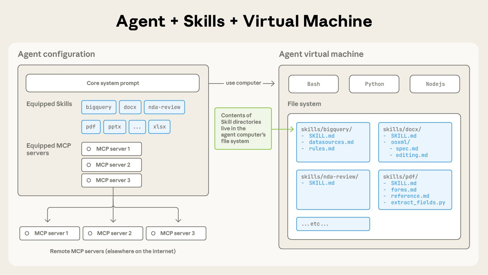
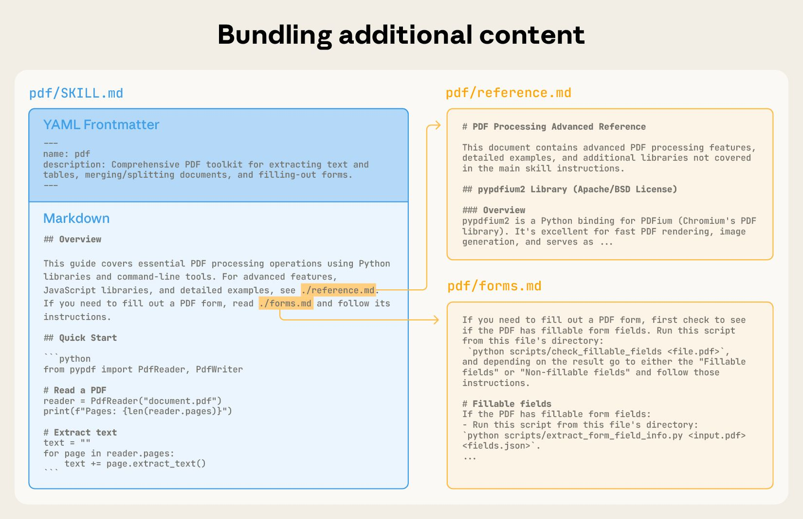
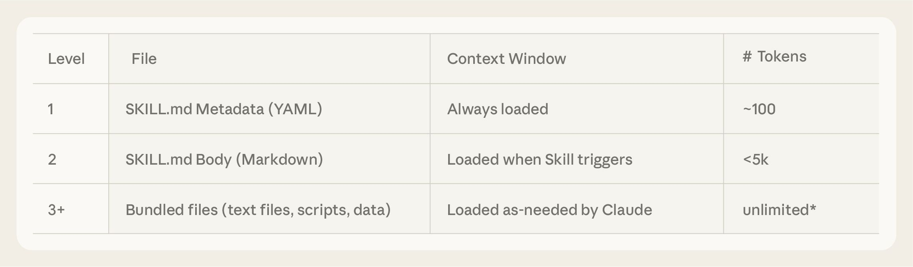
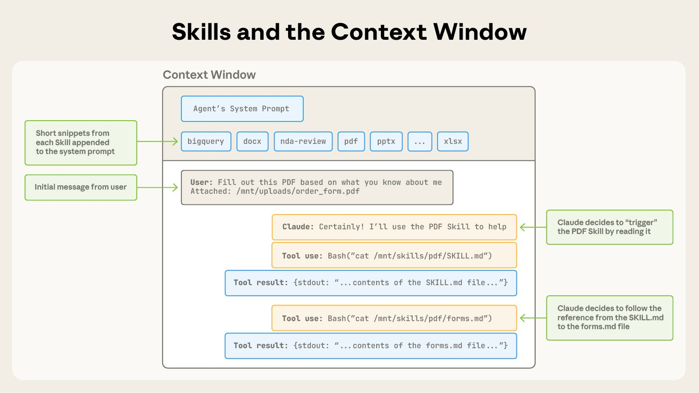
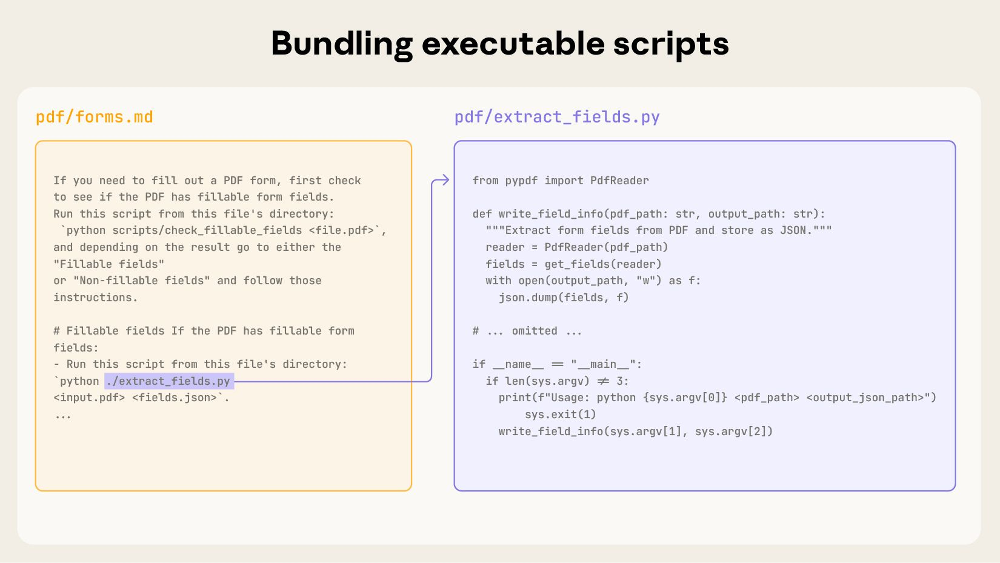

# 用 Agent Skills 为真实世界装备 Agent（中英对照）

> **原文标题：** Equipping agents for the real world with Agent Skills
> **作者：** Barry Zhang, Keith Lazuka, Mahesh Murag（Anthropic 工程团队）
> **原文链接：** https://www.anthropic.com/engineering/equipping-agents-for-the-real-world-with-agent-skills
> **发布日期：** 2025-10-16
> 排版：每段英文原文在前，中文翻译紧随其后。术语保留英文原文并附中文释义。

---

*Update: We've published* [*Agent Skills*](https://agentskills.io/) *as an open standard for cross-platform portability. (December 18, 2025)*

*更新：我们已将* [*Agent Skills*](https://agentskills.io/) *作为跨平台可移植性的开放标准发布。（2025 年 12 月 18 日）*

As model capabilities improve, we can now build general-purpose agents that interact with full-fledged computing environments. [Claude Code](https://claude.com/product/claude-code), for example, can accomplish complex tasks across domains using local code execution and filesystems. But as these agents become more powerful, we need more composable, scalable, and portable ways to equip them with domain-specific expertise.

随着模型能力的提升，我们现在可以构建与完整计算环境交互的通用 Agent。例如，[Claude Code](https://claude.com/product/claude-code) 可以利用本地代码执行和文件系统完成跨领域的复杂任务。但随着这些 Agent 越来越强大，我们需要更可组合（composable）、可扩展（scalable）、可移植（portable）的方式来为它们装备领域特定的专长。

This led us to create [**Agent Skills**](https://www.anthropic.com/news/skills): organized folders of instructions, scripts, and resources that agents can discover and load dynamically to perform better at specific tasks. Skills extend Claude's capabilities by packaging your expertise into composable resources for Claude, transforming general-purpose agents into specialized agents that fit your needs.

这促使我们创造了 [**Agent Skills**](https://www.anthropic.com/news/skills)：一系列组织有序的指令、脚本和资源文件夹，Agent 可以动态地发现并加载它们，以在特定任务上表现得更好。Skill 通过把你的专长打包成可组合的资源提供给 Claude，扩展 Claude 的能力，把通用 Agent 转变为满足你需求的专用 Agent。

Building a skill for an agent is like putting together an onboarding guide for a new hire. Instead of building fragmented, custom-designed agents for each use case, anyone can now specialize their agents with composable capabilities by capturing and sharing their procedural knowledge. In this article, we explain what Skills are, show how they work, and share best practices for building your own.

为 Agent 构建一个 skill，就像为新员工编写一份入职指南。不再需要为每个用例构建零散、定制设计的 Agent，现在任何人都可以通过捕捉和分享自己的程序性知识（procedural knowledge），用可组合的能力让 Agent 专业化。在本文中，我们将解释什么是 Skill、展示它们如何工作，并分享构建你自己的 Skill 的最佳实践。

> A skill is a directory containing a SKILL.md file that contains organized folders of instructions, scripts, and resources that give agents additional capabilities.
> 一个 Skill 是一个包含 SKILL.md 文件的目录，其中含有组织有序的指令、脚本和资源文件夹，为 Agent 提供额外的能力。

# Skill 的内部构造（The anatomy of a skill）

To see Skills in action, let's walk through a real example: one of the skills that powers [Claude's recently launched document editing abilities](https://www.anthropic.com/news/create-files). Claude already knows a lot about understanding PDFs, but is limited in its ability to manipulate them directly (e.g. to fill out a form). This [PDF skill](https://github.com/anthropics/skills/tree/main/document-skills/pdf) lets us give Claude these new abilities.

为了看到 Skill 的实际运作，让我们看一个真实例子：为 [Claude 最近发布的文档编辑能力](https://www.anthropic.com/news/create-files)提供支撑的其中一个 skill。Claude 已经对理解 PDF 很在行，但直接操作它们（例如填写表单）的能力有限。这个 [PDF skill](https://github.com/anthropics/skills/tree/main/document-skills/pdf) 让我们能赋予 Claude 这些新能力。

At its simplest, a skill is a directory that contains a `SKILL.md` file. This file must start with YAML frontmatter that contains some required metadata: `name` and `description`. At startup, the agent pre-loads the `name` and `description` of every installed skill into its system prompt.

最简单的形式下，一个 skill 就是包含一个 `SKILL.md` 文件的目录。这个文件必须以 YAML 前置元数据（frontmatter）开头，其中包含一些必需的元数据：`name` 和 `description`。在启动时，Agent 会把每个已安装 skill 的 `name` 和 `description` 预加载到它的系统提示词中。

This metadata is the **first level** of *progressive disclosure*: it provides just enough information for Claude to know when each skill should be used without loading all of it into context. The actual body of this file is the **second level** of detail. If Claude thinks the skill is relevant to the current task, it will load the skill by reading its full `SKILL.md` into context.

这份元数据是*渐进式披露（progressive disclosure）*的**第一层**：它提供的信息刚好够 Claude 知道什么时候该使用某个 skill，而无需把全部内容加载进上下文。这个文件的实际正文是细节的**第二层**。如果 Claude 认为这个 skill 与当前任务相关，它就会把完整的 `SKILL.md` 读进上下文来加载该 skill。

> A SKILL.md file must begin with YAML Frontmatter that contains a file name and description, which is loaded into its system prompt at startup.
> 一个 SKILL.md 文件必须以 YAML 前置元数据开头，其中包含文件名和描述，启动时会被加载进系统提示词。

As skills grow in complexity, they may contain too much context to fit into a single `SKILL.md`, or context that's relevant only in specific scenarios. In these cases, skills can bundle additional files within the skill directory and reference them by name from `SKILL.md`. These additional linked files are the **third level** (and beyond) of detail, which Claude can choose to navigate and discover only as needed.

随着 skill 变得越发复杂，它们可能包含太多上下文，无法全部塞进单个 `SKILL.md`，或者包含只在特定场景下才相关的上下文。在这些情况下，skill 可以在 skill 目录中捆绑额外的文件，并从 `SKILL.md` 中按名称引用它们。这些额外的链接文件是细节的**第三层**（以及更深层），Claude 可以选择只在需要时去浏览和发现它们。

In the PDF skill shown below, the `SKILL.md` refers to two additional files (`reference.md` and `forms.md`) that the skill author chooses to bundle alongside the core `SKILL.md`. By moving the form-filling instructions to a separate file (`forms.md`), the skill author is able to keep the core of the skill lean, trusting that Claude will read `forms.md` only when filling out a form.

在下面展示的 PDF skill 中，`SKILL.md` 引用了两个额外的文件（`reference.md` 和 `forms.md`），skill 作者选择把它们与核心的 `SKILL.md` 捆绑在一起。通过把填表指令移到单独的文件（`forms.md`）中，skill 作者得以让 skill 的核心保持精简，并相信 Claude 只会在填写表单时才去阅读 `forms.md`。

> You can incorporate more context (via additional files) into your skill that can then be triggered by Claude based on the system prompt.
> 你可以通过额外文件把更多上下文并入你的 skill，然后由 Claude 根据系统提示词触发这些上下文。

Progressive disclosure is the core design principle that makes Agent Skills flexible and scalable. Like a well-organized manual that starts with a table of contents, then specific chapters, and finally a detailed appendix, skills let Claude load information only as needed:

渐进式披露是让 Agent Skills 灵活且可扩展的核心设计原则。就像一本组织良好的手册——先有目录，然后是具体章节，最后是详细的附录——skill 让 Claude 只按需加载信息：

Agents with a filesystem and code execution tools don't need to read the entirety of a skill into their context window when working on a particular task. This means that the amount of context that can be bundled into a skill is effectively unbounded.

拥有文件系统和代码执行工具的 Agent，在处理特定任务时无需把整个 skill 读进上下文窗口。这意味着可以捆绑进一个 skill 的上下文量实际上是无限的。

## Skill 与上下文窗口（Skills and the context window）

The following diagram shows how the context window changes when a skill is triggered by a user's message.

下图展示了当用户的消息触发一个 skill 时，上下文窗口会发生怎样的变化。

> Skills are triggered in the context window via your system prompt.
> Skill 通过你的系统提示词在上下文窗口中被触发。

The sequence of operations shown:

所示的操作序列如下：

1. To start, the context window has the core system prompt and the metadata for each of the installed skills, along with the user's initial message;
   - 开始时，上下文窗口包含核心系统提示词、每个已安装 skill 的元数据，以及用户的初始消息；
2. Claude triggers the PDF skill by invoking a Bash tool to read the contents of `pdf/SKILL.md`;
   - Claude 通过调用 Bash 工具读取 `pdf/SKILL.md` 的内容来触发 PDF skill；
3. Claude chooses to read the `forms.md` file bundled with the skill;
   - Claude 选择阅读捆绑在 skill 中的 `forms.md` 文件；
4. Finally, Claude proceeds with the user's task now that it has loaded relevant instructions from the PDF skill.
   - 最后，既然 Claude 已经从 PDF skill 加载了相关指令，它便开始执行用户的任务。

## Skill 与代码执行（Skills and code execution）

Skills can also include code for Claude to execute as tools at its discretion.

Skill 还可以包含代码，供 Claude 在需要时作为工具执行。

Large language models excel at many tasks, but certain operations are better suited for traditional code execution. For example, sorting a list via token generation is far more expensive than simply running a sorting algorithm. Beyond efficiency concerns, many applications require the deterministic reliability that only code can provide.

大语言模型擅长许多任务，但某些操作更适合传统的代码执行。例如，通过令牌生成对列表排序，远比直接运行一个排序算法昂贵得多。除了效率方面的考量，许多应用还需要只有代码才能提供的确定性（deterministic）可靠性。

In our example, the PDF skill includes a pre-written Python script that reads a PDF and extracts all form fields. Claude can run this script without loading either the script or the PDF into context. And because code is deterministic, this workflow is consistent and repeatable.

在我们的例子中，PDF skill 包含一个预先写好的 Python 脚本，用于读取 PDF 并提取所有表单字段。Claude 可以直接运行这个脚本，而无需把脚本或 PDF 加载进上下文。而且由于代码是确定性的，这个工作流一致且可复现。

> Skills can also include code for Claude to execute as tools at its discretion based on the nature of the task.
> Skill 还可以包含代码，让 Claude 根据任务的性质酌情作为工具执行。

# 开发与评估 Skill（Developing and evaluating skills）

Here are some helpful guidelines for getting started with authoring and testing skills:

以下是一些有助于开始编写和测试 skill 的指导原则：

- **Start with evaluation:** Identify specific gaps in your agents' capabilities by running them on representative tasks and observing where they struggle or require additional context. Then build skills incrementally to address these shortcomings.
  - **从评估开始：** 通过在代表性任务上运行你的 Agent，观察它们在哪里遇到困难或需要额外上下文，从而识别出 Agent 能力上的具体缺口。然后增量地构建 skill 来解决这些不足。
- **Structure for scale:** When the `SKILL.md` file becomes unwieldy, split its content into separate files and reference them. If certain contexts are mutually exclusive or rarely used together, keeping the paths separate will reduce the token usage. Finally, code can serve as both executable tools and as documentation. It should be clear whether Claude should run scripts directly or read them into context as reference.
  - **为规模化而组织结构：** 当 `SKILL.md` 文件变得臃肿时，把内容拆分成独立的文件并引用它们。如果某些上下文互斥或很少一起使用，保持路径分离将减少令牌用量。最后，代码既可以充当可执行工具，也可以充当文档。应当明确说明 Claude 是应该直接运行脚本，还是把它们读进上下文作为参考。
- **Think from Claude's perspective:** Monitor how Claude uses your skill in real scenarios and iterate based on observations: watch for unexpected trajectories or overreliance on certain contexts. Pay special attention to the `name` and `description` of your skill. Claude will use these when deciding whether to trigger the skill in response to its current task.
  - **从 Claude 的角度思考：** 监控 Claude 在真实场景中如何使用你的 skill，并根据观察迭代：留意意外的轨迹或对某些上下文的过度依赖。特别注意你 skill 的 `name` 和 `description`。Claude 在决定是否针对当前任务触发该 skill 时会用到它们。
- **Iterate with Claude:** As you work on a task with Claude, ask Claude to capture its successful approaches and common mistakes into reusable context and code within a skill. If it goes off track when using a skill to complete a task, ask it to self-reflect on what went wrong. This process will help you discover what context Claude actually needs, instead of trying to anticipate it upfront.
  - **与 Claude 一起迭代：** 当你在 Claude 的协助下处理任务时，请 Claude 把它成功的方法和常见错误捕捉到 skill 中可复用的上下文和代码里。如果它在使用 skill 完成任务时偏离了轨道，让它自我反思哪里出了问题。这个过程会帮你发现 Claude 真正需要哪些上下文，而不是试图提前预判。

## 使用 Skill 时的安全考量（Security considerations when using Skills）

Skills provide Claude with new capabilities through instructions and code. While this makes them powerful, it also means that malicious skills may introduce vulnerabilities in the environment where they're used or direct Claude to exfiltrate data and take unintended actions.

Skill 通过指令和代码为 Claude 提供新能力。这虽然让它们很强大，但也意味着恶意的 skill 可能在它们被使用的环境中引入漏洞，或引导 Claude 窃取数据、做出非预期行为。

We recommend installing skills only from trusted sources. When installing a skill from a less-trusted source, thoroughly audit it before use. Start by reading the contents of the files bundled in the skill to understand what it does, paying particular attention to code dependencies and bundled resources like images or scripts. Similarly, pay attention to instructions or code within the skill that instruct Claude to connect to potentially untrusted external network sources.

我们建议只从可信来源安装 skill。当从不太可信的来源安装 skill 时，请在使用前彻底审查它。先阅读 skill 中捆绑的文件内容，了解它做什么，特别留意代码依赖以及图片或脚本等捆绑资源。同样，也要留意 skill 中指示 Claude 连接到潜在不可信外部网络源的指令或代码。

# Skill 的未来（The future of Skills）

Agent Skills are [supported today](https://www.anthropic.com/news/skills) across [Claude.ai](http://claude.ai/redirect/website.v1.d7825df1-f933-46b7-ad28-2d134bbad322), Claude Code, the Claude Agent SDK, and the Claude Developer Platform.

Agent Skills 今天已在 [Claude.ai](http://claude.ai/redirect/website.v1.d7825df1-f933-46b7-ad28-2d134bbad322)、Claude Code、Claude Agent SDK 和 Claude 开发者平台上[得到支持](https://www.anthropic.com/news/skills)。

In the coming weeks, we'll continue to add features that support the full lifecycle of creating, editing, discovering, sharing, and using Skills. We're especially excited about the opportunity for Skills to help organizations and individuals share their context and workflows with Claude. We'll also explore how Skills can complement [Model Context Protocol](https://modelcontextprotocol.io/) (MCP) servers by teaching agents more complex workflows that involve external tools and software.

在未来几周，我们将继续添加支持 Skill 创建、编辑、发现、分享和使用完整生命周期的功能。我们尤其对 Skill 帮助组织和个人与 Claude 分享上下文与工作流的机会感到兴奋。我们还将探索 Skill 如何通过教会 Agent 涉及外部工具和软件的更复杂工作流，来补充[模型上下文协议（Model Context Protocol，MCP）](https://modelcontextprotocol.io/)服务器。

Looking further ahead, we hope to enable agents to create, edit, and evaluate Skills on their own, letting them codify their own patterns of behavior into reusable capabilities.

展望更远的未来，我们希望让 Agent 能够自行创建、编辑和评估 Skill，让它们把自己的一套行为模式固化成可复用的能力。

Skills are a simple concept with a correspondingly simple format. This simplicity makes it easier for organizations, developers, and end users to build customized agents and give them new capabilities.

Skill 是一个简单的概念，其格式也同样简单。这种简洁性让组织、开发者和终端用户更容易构建定制化的 Agent，并赋予它们新能力。

We're excited to see what people build with Skills. Get started today by checking out our Skills [docs](https://docs.claude.com/en/docs/agents-and-tools/agent-skills/overview) and [cookbook](https://github.com/anthropics/claude-cookbooks/tree/main/skills).

我们很期待看到人们用 Skill 构建出的成果。今天就通过查看我们的 Skills [文档](https://docs.claude.com/en/docs/agents-and-tools/agent-skills/overview)和[手册](https://github.com/anthropics/claude-cookbooks/tree/main/skills)开始吧。

# 致谢（Acknowledgements）

Written by Barry Zhang, Keith Lazuka, and Mahesh Murag, who all really like folders. Special thanks to the many others across Anthropic who championed, supported, and built Skills.

由 Barry Zhang、Keith Lazuka 和 Mahesh Murag 撰写，他们都很喜欢文件夹。特别感谢 Anthropic 内部众多倡导、支持并构建了 Skill 的人。
