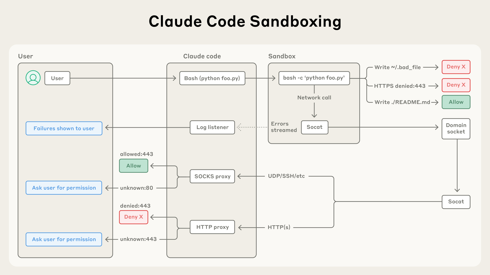
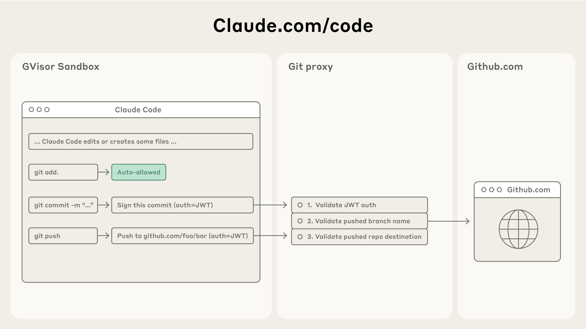

# 超越权限提示：让 Claude Code 更安全、更自主（中英对照）

> **原文标题：** Beyond permission prompts: making Claude Code more secure and autonomous
> **作者：** David Dworken, Oliver Weller-Davies（Anthropic 工程团队）
> **原文链接：** https://www.anthropic.com/engineering/claude-code-sandboxing
> **发布日期：** 2025-10-20
> 排版：每段英文原文在前，中文翻译紧随其后。术语保留英文原文并附中文释义。

---

In [Claude Code](https://www.claude.com/product/claude-code), Claude writes, tests, and debugs code alongside you, navigating your codebase, editing multiple files, and running commands to verify its work. Giving Claude this much access to your codebase and files can introduce risks, especially in the case of prompt injection.

在 [Claude Code](https://www.claude.com/product/claude-code) 中，Claude 与你并肩编写、测试和调试代码，导航你的代码库、编辑多个文件、运行命令来验证它的工作。给 Claude 如此大的代码库和文件访问权限可能带来风险，尤其是在提示词注入（prompt injection）的情况下。

To help address this, we've introduced two new features in Claude Code built on top of sandboxing, both of which are designed to provide a more secure place for developers to work, while also allowing Claude to run more autonomously and with fewer permission prompts. In our internal usage, we've found that sandboxing safely reduces permission prompts by 84%. By defining set boundaries within which Claude can work freely, they increase security and agency.

为了帮助解决这一问题，我们在 Claude Code 中基于沙箱（sandboxing）引入了两项新功能，它们都旨在为开发者提供更安全的工作环境，同时让 Claude 能更自主地运行、减少权限提示。在我们的内部使用中，我们发现沙箱能安全地把权限提示减少 84%。通过定义 Claude 可以自由工作的既定边界，它们既提高了安全性，也增强了自主性（agency）。

## 保障 Claude Code 用户的安全（Keeping users secure on Claude Code）

Claude Code runs on a permission-based model: by default, it's read-only, which means it asks for permission before making modifications or running any commands. There are some exceptions to this: we auto-allow safe commands like echo or cat, but most operations still need explicit approval.

Claude Code 运行在基于权限的模型上：默认情况下它是只读的，也就是说，在进行修改或运行任何命令之前，它会先请求许可。这里有一些例外：我们会自动允许 echo 或 cat 这类安全命令，但大多数操作仍然需要明确批准。

Constantly clicking "approve" slows down development cycles and can lead to 'approval fatigue', where users might not pay close attention to what they're approving, and in turn making development less safe.

不停点击"批准"（approve）会拖慢开发周期，并可能导致"批准疲劳"（approval fatigue）——用户可能不再密切关注自己批准的内容，从而使开发变得更不安全。

To address this, we launched sandboxing for Claude Code.

为了解决这个问题，我们为 Claude Code 推出了沙箱功能。

# 沙箱：一种更安全、更自主的方法（Sandboxing: a safer and more autonomous approach）

Sandboxing creates pre-defined boundaries within which Claude can work more freely, instead of asking for permission for each action. With sandboxing enabled, you get drastically fewer permission prompts and increased safety.

沙箱创建了预先定义的边界，让 Claude 在其中更自由地工作，而不是为每个动作请求许可。启用沙箱后，你会看到权限提示大幅减少，安全性也随之提升。

Our approach to sandboxing is built on top of operating system-level features to enable two boundaries:

我们的沙箱方法构建在操作系统级特性之上，以实现两种边界：

1. **Filesystem isolation**, which ensures that Claude can only access or modify specific directories. This is particularly important in preventing a prompt-injected Claude from modifying sensitive system files.
   - **文件系统隔离（filesystem isolation）**，确保 Claude 只能访问或修改特定的目录。这在防止被提示词注入的 Claude 修改敏感系统文件方面尤为重要。
2. **Network isolation**, which ensures that Claude can only connect to approved servers. This prevents a prompt-injected Claude from leaking sensitive information or downloading malware.
   - **网络隔离（network isolation）**，确保 Claude 只能连接到获准的服务器。这能防止被提示词注入的 Claude 泄露敏感信息或下载恶意软件。

It is worth noting that effective sandboxing requires *both* filesystem and network isolation. Without network isolation, a compromised agent could exfiltrate sensitive files like SSH keys; without filesystem isolation, a compromised agent could easily escape the sandbox and gain network access. It's by using both techniques that we can provide a safer and faster agentic experience for Claude Code users.

值得一提的是，有效的沙箱需要*同时*具备文件系统隔离和网络隔离。没有网络隔离，被攻破的 Agent 就可能窃取 SSH 密钥等敏感文件；没有文件系统隔离，被攻破的 Agent 就可能轻易逃出沙箱并获取网络访问。正是通过同时使用这两种技术，我们才能为 Claude Code 用户提供更安全、更快速的 Agent 化体验。

# Claude Code 的两项新沙箱功能（Two new sandboxing features in Claude Code）

### 沙箱化 Bash 工具：无需权限提示的安全 Bash 执行（Sandboxed bash tool: safe bash execution without permission prompts）

We're introducing [a new sandbox runtime](https://docs.claude.com/en/docs/claude-code/sandboxing), available in beta as a research preview, that lets you define exactly which directories and network hosts your agent can access, without the overhead of spinning up and managing a container. This can be used to sandbox arbitrary processes, agents and MCP servers. It is also available as [an open source research preview](https://github.com/anthropic-experimental/sandbox-runtime).

我们推出了[一个新的沙箱运行时（sandbox runtime）](https://docs.claude.com/en/docs/claude-code/sandboxing)，以研究预览（research preview）的 Beta 形式提供，让你能够精确定义你的 Agent 可以访问哪些目录和网络主机，而无需承担启动和管理容器的开销。它可以用来沙箱化任意进程、Agent 和 MCP 服务器。它还以[开源研究预览](https://github.com/anthropic-experimental/sandbox-runtime)的形式提供。

In Claude Code, we use this runtime to sandbox the bash tool, which allows Claude to run commands within the defined limits you set. Inside the safe sandbox, Claude can run more autonomously and safely execute commands without permission prompts. If Claude tries to access something *outside* of the sandbox, you'll be notified immediately, and can choose whether or not to allow it.

在 Claude Code 中，我们用这个运行时来沙箱化 bash 工具，让 Claude 能在你设定的既定限制内运行命令。在安全的沙箱内部，Claude 可以更自主地运行，在无需权限提示的情况下安全地执行命令。如果 Claude 试图访问沙箱*之外*的内容，你会立即收到通知，并可以选择是否允许。

We've built this on top of OS level primitives such as [Linux bubblewrap](https://github.com/containers/bubblewrap) and MacOS seatbelt to enforce these restrictions at the OS level. They cover not just Claude Code's direct interactions, but also any scripts, programs, or subprocesses that are spawned by the command. As described above, this sandbox enforces both:

我们把它构建在 [Linux bubblewrap](https://github.com/containers/bubblewrap) 和 macOS seatbelt 等操作系统级原语之上，在 OS 层面强制执行这些限制。它们不仅覆盖 Claude Code 的直接交互，也覆盖命令产生的任何脚本、程序或子进程。如上所述，这个沙箱强制执行两种限制：

1. **Filesystem isolation**, by allowing read and write access to the current working directory, but blocking the modification of any files outside of it.
   - **文件系统隔离**，允许对当前工作目录进行读写访问，但阻止修改其外部的任何文件。
2. **Network isolation**, by only allowing internet access through a unix domain socket connected to a proxy server running outside the sandbox. This proxy server enforces restrictions on the domains that a process can connect to, and handles user confirmation for newly requested domains. And if you'd like further-increased security, we also support customizing this proxy to enforce arbitrary rules on outgoing traffic.
   - **网络隔离**，只允许通过连接到沙箱外运行的代理服务器（proxy server）的 Unix 域套接字访问互联网。这个代理服务器对进程可以连接的域实施限制，并为新请求的域处理用户确认。如果你想要进一步增强安全性，我们还支持自定义这个代理，对出站流量实施任意规则。

Both components are configurable: you can easily choose to allow or disallow specific file paths or domains.

这两个组件都是可配置的：你可以轻松选择允许或禁止特定的文件路径或域。

> Claude Code's sandboxing architecture isolates code execution with filesystem and network controls, automatically allowing safe operations, blocking malicious ones, and asking permission only when needed.
> Claude Code 的沙箱架构用文件系统和网络控制隔离代码执行，自动允许安全操作、阻止恶意操作，并仅在必要时请求许可。

Sandboxing ensures that even a successful prompt injection is fully isolated, and cannot impact overall user security. This way, a compromised Claude Code can't steal your SSH keys, or phone home to an attacker's server.

沙箱确保即便是成功的提示词注入也会被完全隔离，无法影响用户的整体安全。这样一来，被攻破的 Claude Code 也无法窃取你的 SSH 密钥，或向攻击者的服务器"打电话回家"（phone home，即回连）。

To get started with this feature, run /sandbox in Claude Code and check out [more technical details](https://docs.claude.com/en/docs/claude-code/sandboxing) about our security model.

要开始使用这一功能，请在 Claude Code 中运行 /sandbox，并查看我们关于安全模型的[更多技术细节](https://docs.claude.com/en/docs/claude-code/sandboxing)。

To make it easier for other teams to build safer agents, we have [open sourced](https://github.com/anthropic-experimental/sandbox-runtime) this feature. We believe that others should consider adopting this technology for their own agents in order to enhance the security posture of their agents.

为了让其他团队更容易构建更安全的 Agent，我们已经[开源](https://github.com/anthropic-experimental/sandbox-runtime)了这一功能。我们相信，其他团队应当考虑为自己的 Agent 采用这项技术，以增强其 Agent 的安全态势（security posture）。

### Claude Code on the web：在云端安全运行 Claude Code（Claude Code on the web: running Claude Code securely in the cloud）

Today, we're also releasing [Claude Code on the web](https://docs.claude.com/en/docs/claude-code/claude-code-on-the-web) enabling users to run Claude Code in an isolated sandbox in the cloud. Claude Code on the web executes each Claude Code session in an isolated sandbox where it has full access to its server in a safe and secure way. We've designed this sandbox to ensure that sensitive credentials (such as git credentials or signing keys) are never inside the sandbox with Claude Code. This way, even if the code running in the sandbox is compromised, the user is kept safe from further harm.

今天，我们还发布了 [Claude Code on the web](https://docs.claude.com/en/docs/claude-code/claude-code-on-the-web)，让用户能够在云端的隔离沙箱中运行 Claude Code。Claude Code on the web 在隔离沙箱中执行每个 Claude Code 会话，让它以安全可靠的方式完全访问自己的服务器。我们设计了这种沙箱，以确保敏感凭据（如 git 凭据或签名密钥）绝不会与 Claude Code 一起进入沙箱内部。这样一来，即便沙箱中运行的代码被攻破，用户也能免受进一步的伤害。

Claude Code on the web uses a custom proxy service that transparently handles all git interactions. Inside the sandbox, the git client authenticates to this service with a custom-built scoped credential. The proxy verifies this credential and the contents of the git interaction (e.g. ensuring it is only pushing to the configured branch), then attaches the right authentication token before sending the request to GitHub.

Claude Code on the web 使用一个自定义的代理服务，透明地处理所有 git 交互。在沙箱内部，git 客户端用一个自定义构建的受限凭据（scoped credential）向该服务进行身份验证。代理会验证这个凭据以及 git 交互的内容（例如确保它只推送到配置好的分支），然后在把请求发送到 GitHub 之前附上正确的身份验证令牌。

> Claude Code's Git integration routes commands through a secure proxy that validates authentication tokens, branch names, and repository destinations—allowing safe version control workflows while preventing unauthorized pushes.
> Claude Code 的 Git 集成通过一个安全代理路由命令，该代理验证身份验证令牌、分支名和仓库目标——在允许安全的版本控制工作流的同时，阻止未经授权的推送。

# 开始使用（Getting started）

Our new sandboxed bash tool and Claude Code on the web offer substantial improvements in both security and productivity for developers using Claude for their engineering work.

我们新的沙箱化 bash 工具和 Claude Code on the web，为使用 Claude 进行工程开发的开发者带来了安全性和生产力上的显著提升。

To get started with these tools:

要开始使用这些工具：

1. Run `/sandbox` in Claude and check out [our docs](https://docs.claude.com/en/docs/claude-code/sandboxing) on how to configure this sandbox.
   - 在 Claude 中运行 `/sandbox`，并查看[我们的文档](https://docs.claude.com/en/docs/claude-code/sandboxing)，了解如何配置这个沙箱。
2. Go to [claude.com/code](http://claude.ai/redirect/website.v1.c4bd1222-453a-4fb2-9979-37bccf1fcfee/code) to try out Claude Code on the web.
   - 前往 [claude.com/code](http://claude.ai/redirect/website.v1.c4bd1222-453a-4fb2-9979-37bccf1fcfee/code) 试用 Claude Code on the web。

Or, if you're building your own agents, check out our [open-sourced sandboxing code](https://github.com/anthropic-experimental/sandbox-runtime), and consider integrating it into your work. We look forward to seeing what you build.

或者，如果你在构建自己的 Agent，可以查看我们的[开源沙箱代码](https://github.com/anthropic-experimental/sandbox-runtime)，并考虑把它集成到你的工作中。我们期待看到你构建的成果。

To learn more about Claude Code on the web, check out our [launch blog post](https://www.anthropic.com/news/claude-code-on-the-web).

要了解更多关于 Claude Code on the web 的信息，请查看我们的[发布博客文章](https://www.anthropic.com/news/claude-code-on-the-web)。

# 致谢（Acknowledgements）

Article written by David Dworken and Oliver Weller-Davies, with contributions from Meaghan Choi, Catherine Wu, Molly Vorwerck, Alex Isken, Kier Bradwell, and Kevin Garcia

本文由 David Dworken 和 Oliver Weller-Davies 撰写，Meaghan Choi、Catherine Wu、Molly Vorwerck、Alex Isken、Kier Bradwell 和 Kevin Garcia 亦有贡献。
