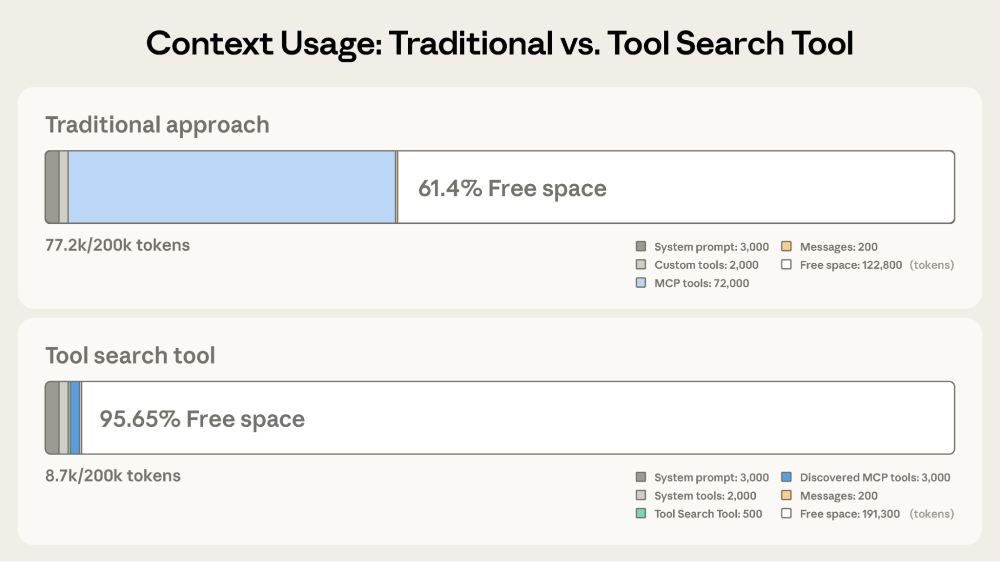
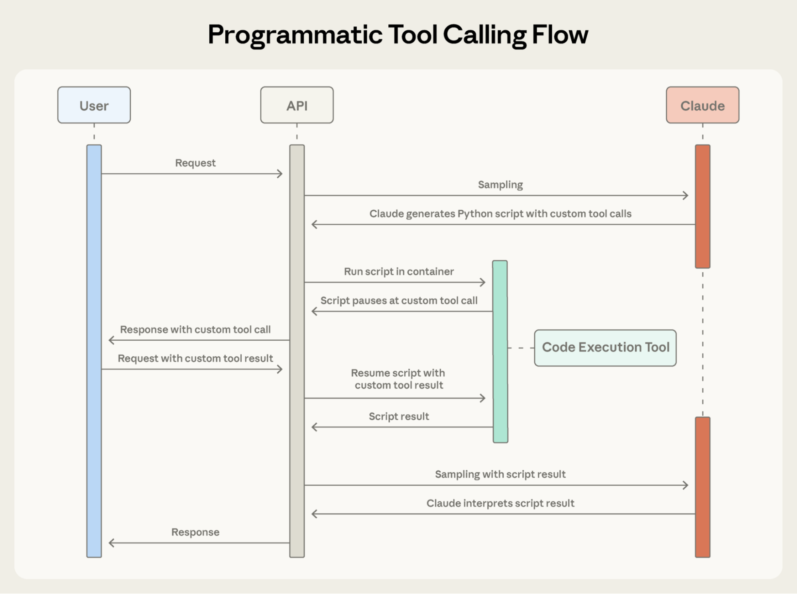

# 在 Claude 开发者平台上推出高级工具使用（中英对照）

> **原文标题：** Introducing advanced tool use on the Claude Developer Platform
> **作者：** Bin Wu（Anthropic 工程团队）
> **原文链接：** https://www.anthropic.com/engineering/advanced-tool-use
> **发布日期：** 2025-11-24
> 排版：每段英文原文在前，中文翻译紧随其后。术语保留英文原文并附中文释义。

---

The future of AI agents is one where models work seamlessly across hundreds or thousands of tools. An IDE assistant that integrates git operations, file manipulation, package managers, testing frameworks, and deployment pipelines. An operations coordinator that connects Slack, GitHub, Google Drive, Jira, company databases, and dozens of MCP servers simultaneously.

AI Agent 的未来，是模型能在成百上千个工具之间无缝协作。一个集成了 git 操作、文件处理、包管理器、测试框架和部署流水线（deployment pipelines）的 IDE 助手；一个同时连接 Slack、GitHub、Google Drive、Jira、公司数据库以及数十个 MCP 服务器的运维协调器。

To [build effective agents](https://www.anthropic.com/research/building-effective-agents), they need to work with unlimited tool libraries without stuffing every definition into context upfront. Our blog article on using [code execution with MCP](https://www.anthropic.com/engineering/code-execution-with-mcp) discussed how tool results and definitions can sometimes consume 50,000+ tokens before an agent reads a request. Agents should discover and load tools on-demand, keeping only what's relevant for the current task.

要[构建有效的 Agent](https://www.anthropic.com/research/building-effective-agents)，它们需要与无限的工具库协作，而无需提前把所有定义都塞进上下文。我们关于[使用 MCP 执行代码](https://www.anthropic.com/engineering/code-execution-with-mcp)的博客文章讨论了工具结果和定义有时会在 Agent 读取请求之前就消耗 50,000 多个令牌（token）。Agent 应该按需发现和加载工具，只保留与当前任务相关的内容。

Agents also need the ability to call tools from code. When using natural language tool calling, each invocation requires a full inference pass, and intermediate results pile up in context whether they're useful or not. Code is a natural fit for orchestration logic, such as loops, conditionals, and data transformations. Agents need the flexibility to choose between code execution and inference based on the task at hand.

Agent 还需要具备从代码中调用工具的能力。使用自然语言进行工具调用时，每次调用都需要一次完整的推理过程（inference pass），而中间结果无论是否有用都会在上下文中堆积。代码天然适合表达编排逻辑（orchestration logic），例如循环、条件判断和数据转换。Agent 需要能够根据手头的任务，灵活地在代码执行与推理之间做出选择。

Agents also need to learn correct tool usage from examples, not just schema definitions. JSON schemas define what's structurally valid, but can't express usage patterns: when to include optional parameters, which combinations make sense, or what conventions your API expects.

Agent 还需要从示例中学习正确的工具用法，而不仅仅是 schema（模式）定义。JSON schema 定义了什么是结构上有效的，但无法表达使用模式：何时该包含可选参数、哪些组合是合理的、或者你的 API 期望遵循什么约定。

Today, we're releasing three features that make this possible:

今天，我们发布三项让这一切成为可能的功能：

- **Tool Search Tool, **which allows Claude to use search tools to access thousands of tools without consuming its context window
- **工具搜索工具（Tool Search Tool）**，它让 Claude 能够使用搜索工具访问成千上万的工具，而不会消耗它的上下文窗口（context window）
- **Programmatic Tool Calling**, which allows Claude to invoke tools in a code execution environment reducing the impact on the model's context window
- **编程式工具调用（Programmatic Tool Calling）**，它让 Claude 能够在代码执行环境中调用工具，从而减少对模型上下文窗口的影响
- **Tool Use Examples**, which provides a universal standard for demonstrating how to effectively use a given tool
- **工具使用示例（Tool Use Examples）**，它提供了一种通用标准，用于演示如何有效使用某个给定的工具

In internal testing, we've found these features have helped us build things that wouldn't have been possible with conventional tool use patterns. For example,** [Claude for Excel](https://www.claude.com/claude-for-excel) **uses Programmatic Tool Calling to read and modify spreadsheets with thousands of rows without overloading the model's context window.

在内部测试中，我们发现这些功能帮助我们构建了一些用传统工具使用模式不可能实现的东西。例如，**[Claude for Excel](https://www.claude.com/claude-for-excel)** 就使用编程式工具调用来读取和修改包含数千行的电子表格，而不会让模型的上下文窗口过载。

Based on our experience, we believe these features open up new possibilities for what you can build with Claude.

基于我们的经验，我们相信这些功能为用 Claude 构建的内容开辟了新的可能性。

# 工具搜索工具（Tool Search Tool）

## 挑战（The challenge）

MCP tool definitions provide important context, but as more servers connect, those tokens can add up. Consider a five-server setup:

MCP 工具定义提供了重要的上下文，但随着接入的服务器越来越多，这些令牌会不断累积。考虑一个五服务器的配置：

- GitHub: 35 tools (~26K tokens)
- GitHub：35 个工具（约 26K 令牌）
- Slack: 11 tools (~21K tokens)
- Slack：11 个工具（约 21K 令牌）
- Sentry: 5 tools (~3K tokens)
- Sentry：5 个工具（约 3K 令牌）
- Grafana: 5 tools (~3K tokens)
- Grafana：5 个工具（约 3K 令牌）
- Splunk: 2 tools (~2K tokens)
- Splunk：2 个工具（约 2K 令牌）

That's 58 tools consuming approximately 55K tokens before the conversation even starts. Add more servers like Jira (which alone uses ~17K tokens) and you're quickly approaching 100K+ token overhead. At Anthropic, we've seen tool definitions consume 134K tokens before optimization.

那就是 58 个工具，在对话开始之前就消耗了大约 55K 令牌。再加上像 Jira 这样的服务器（仅它自己就使用约 17K 令牌），你很快就会逼近 100K 以上的令牌开销。在 Anthropic，我们曾见过工具定义在优化前就消耗了 134K 令牌。

But token cost isn't the only issue. The most common failures are wrong tool selection and incorrect parameters, especially when tools have similar names like `notification-send-user` vs. `notification-send-channel`.

但令牌成本并不是唯一的问题。最常见的失败是选错工具和参数错误，尤其是当工具名称相似时，比如 `notification-send-user` 和 `notification-send-channel`。

## 我们的解决方案（Our solution）

Instead of loading all tool definitions upfront, the Tool Search Tool discovers tools on-demand. Claude only sees the tools it actually needs for the current task.

工具搜索工具（Tool Search Tool）不是预先加载所有工具定义，而是按需发现工具。Claude 只会看到它完成当前任务实际需要的工具。



> Tool Search Tool preserves 191,300 tokens of context compared to 122,800 with Claude's traditional approach.
> 工具搜索工具保留了 191,300 个令牌的上下文，而 Claude 的传统方式只能保留 122,800 个。

Traditional approach:

传统方式：

- All tool definitions loaded upfront (~72K tokens for 50+ MCP tools)
- 所有工具定义都预先加载（50 多个 MCP 工具约 72K 令牌）
- Conversation history and system prompt compete for remaining space
- 对话历史和系统提示词争夺剩余的空间
- Total context consumption: ~77K tokens before any work begins
- 在开始任何工作之前，总上下文消耗约 77K 令牌

With the Tool Search Tool:

使用工具搜索工具：

- Only the Tool Search Tool loaded upfront (~500 tokens)
- 只预先加载工具搜索工具本身（约 500 令牌）
- Tools discovered on-demand as needed (3-5 relevant tools, ~3K tokens)
- 按需发现所需的工具（3-5 个相关工具，约 3K 令牌）
- Total context consumption: ~8.7K tokens, preserving 95% of context window
- 总上下文消耗约 8.7K 令牌，保留了 95% 的上下文窗口

This represents an 85% reduction in token usage while maintaining access to your full tool library. Internal testing showed significant accuracy improvements on MCP evaluations when working with large tool libraries. Opus 4 improved from 49% to 74%, and Opus 4.5 improved from 79.5% to 88.1% with Tool Search Tool enabled.

这代表着令牌用量减少了 85%，同时仍然可以访问你的完整工具库。内部测试表明，在处理大型工具库时，MCP 评估的准确率有显著提升。启用工具搜索工具后，Opus 4 从 49% 提升到 74%，Opus 4.5 从 79.5% 提升到 88.1%。

## 工具搜索工具的工作原理（How the Tool Search Tool works）

The Tool Search Tool lets Claude dynamically discover tools instead of loading all definitions upfront. You provide all your tool definitions to the API, but mark tools with `defer_loading: true` to make them discoverable on-demand. Deferred tools aren't loaded into Claude's context initially. Claude only sees the Tool Search Tool itself plus any tools with `defer_loading: false` (your most critical, frequently-used tools).

工具搜索工具让 Claude 能够动态发现工具，而不是预先加载所有定义。你把所有工具定义都提供给 API，但用 `defer_loading: true`（延迟加载）标记工具，让它们可以按需被发现。延迟加载的工具最初不会加载进 Claude 的上下文。Claude 只会看到工具搜索工具本身，以及所有 `defer_loading: false` 的工具（也就是你最关键、最常用的工具）。

When Claude needs specific capabilities, it searches for relevant tools. The Tool Search Tool returns references to matching tools, which get expanded into full definitions in Claude's context.

当 Claude 需要特定能力时，它会搜索相关的工具。工具搜索工具会返回匹配工具的引用，这些引用会在 Claude 的上下文中展开成完整定义。

For example, if Claude needs to interact with GitHub, it searches for "github," and only `github.createPullRequest` and `github.listIssues` get loaded—not your other 50+ tools from Slack, Jira, and Google Drive.

例如，如果 Claude 需要与 GitHub 交互，它会搜索"github"，于是只有 `github.createPullRequest` 和 `github.listIssues` 会被加载——而不是你来自 Slack、Jira 和 Google Drive 的其他 50 多个工具。

This way, Claude has access to your full tool library while only paying the token cost for tools it actually needs.

这样一来，Claude 就能访问你的完整工具库，同时只为它实际需要的工具支付令牌成本。

**Prompt caching note: **Tool Search Tool doesn't break prompt caching because deferred tools are excluded from the initial prompt entirely. They're only added to context after Claude searches for them, so your system prompt and core tool definitions remain cacheable.

**提示词缓存（prompt caching）说明：**工具搜索工具不会破坏提示词缓存，因为延迟加载的工具被完全排除在初始提示词之外。它们只会在 Claude 搜索到之后才被加入上下文，因此你的系统提示词和核心工具定义仍然可以被缓存。

**Implementation:**

**实现方式：**

```json
{
  "tools": [
    // Include a tool search tool (regex, BM25, or custom)
    {"type": "tool_search_tool_regex_20251119", "name": "tool_search_tool_regex"},

    // Mark tools for on-demand discovery
    {
      "name": "github.createPullRequest",
      "description": "Create a pull request",
      "input_schema": {...},
      "defer_loading": true
    }
    // ... hundreds more deferred tools with defer_loading: true
  ]
}
```

For MCP servers, you can defer loading entire servers while keeping specific high-use tools loaded:

对于 MCP 服务器，你可以延迟加载整个服务器，同时让特定的高使用率工具保持加载：

```json
{
  "type": "mcp_toolset",
  "mcp_server_name": "google-drive",
  "default_config": {"defer_loading": true}, # defer loading the entire server
  "configs": {
    "search_files": {
"defer_loading": false
    }  // Keep most used tool loaded
  }
}
```

The Claude Developer Platform provides regex-based and BM25-based search tools out of the box, but you can also implement custom search tools using embeddings or other strategies.

Claude 开发者平台开箱即用地提供了基于正则表达式（regex）和基于 BM25 的搜索工具，但你也可以使用嵌入（embeddings）或其他策略来实现自定义搜索工具。

## 何时使用工具搜索工具（When to use the Tool Search Tool）

Like any architectural decision, enabling the Tool Search Tool involves trade-offs. The feature adds a search step before tool invocation, so it delivers the best ROI when the context savings and accuracy improvements outweigh additional latency.

与任何架构决策一样，启用工具搜索工具也涉及权衡取舍。该功能在调用工具之前增加了一个搜索步骤，因此当上下文节省和准确率提升超过额外的延迟时，它能带来最佳的投资回报率（ROI）。

**Use it when:**

**适用场景：**

- Tool definitions consuming >10K tokens
- 工具定义消耗超过 10K 令牌
- Experiencing tool selection accuracy issues
- 遇到工具选择准确率问题
- Building MCP-powered systems with multiple servers
- 构建由 MCP 驱动、连接多个服务器的系统
- 10+ tools available
- 有 10 个以上可用工具

**Less beneficial when:**

**不太适用的情况：**

- Small tool library (<10 tools)
- 工具库很小（少于 10 个工具）
- All tools used frequently in every session
- 每次会话都会频繁使用所有工具
- Tool definitions are compact
- 工具定义很紧凑

# 编程式工具调用（Programmatic Tool Calling）

## 挑战（The challenge）

Traditional tool calling creates two fundamental problems as workflows become more complex:

随着工作流变得越来越复杂，传统的工具调用会产生两个根本性问题：

- **Context pollution from intermediate results**: When Claude analyzes a 10MB log file for error patterns, the entire file enters its context window, even though Claude only needs a summary of error frequencies. When fetching customer data across multiple tables, every record accumulates in context regardless of relevance. These intermediate results consume massive token budgets and can push important information out of the context window entirely.
- **中间结果造成的上下文污染**：当 Claude 分析一个 10MB 的日志文件以查找错误模式时，整个文件都会进入它的上下文窗口，即使 Claude 只需要错误频率的摘要。当跨多个表获取客户数据时，每条记录无论是否相关都会在上下文中累积。这些中间结果消耗大量的令牌预算，甚至可能把重要信息完全挤出上下文窗口。
- **Inference overhead and manual synthesis**: Each tool call requires a full model inference pass. After receiving results, Claude must "eyeball" the data to extract relevant information, reason about how pieces fit together, and decide what to do next—all through natural language processing. A five tool workflow means five inference passes plus Claude parsing each result, comparing values, and synthesizing conclusions. This is both slow and error-prone.
- **推理开销与人工综合**：每次工具调用都需要一次完整的模型推理过程。收到结果后，Claude 必须"目测"数据以提取相关信息、推理各部分如何拼合、并决定下一步做什么——全部都要通过自然语言处理。一个包含五个工具的工作流意味着五次推理过程，加上 Claude 解析每个结果、比较数值、综合结论。这既慢又容易出错。

## 我们的解决方案（Our solution）

Programmatic Tool Calling enables Claude to orchestrate tools through code rather than through individual API round-trips. Instead of Claude requesting tools one at a time with each result being returned to its context, Claude writes code that calls multiple tools, processes their outputs, and controls what information actually enters its context window.

编程式工具调用（Programmatic Tool Calling）让 Claude 能够通过代码而非逐个 API 往返来编排工具。Claude 不再一次一个地请求工具、让每个结果都返回其上下文，而是编写代码来调用多个工具、处理它们的输出，并控制哪些信息真正进入它的上下文窗口。

Claude excels at writing code and by letting it express orchestration logic in Python rather than through natural language tool invocations, you get more reliable, precise control flow. Loops, conditionals, data transformations, and error handling are all explicit in code rather than implicit in Claude's reasoning.

Claude 非常擅长编写代码，通过让它用 Python 而非自然语言工具调用来表达编排逻辑，你能获得更可靠、更精确的控制流。循环、条件判断、数据转换和错误处理在代码中都是显式的，而不是隐含在 Claude 的推理中。

### 示例：预算合规检查（Example: Budget compliance check）

Consider a common business task: "Which team members exceeded their Q3 travel budget?"

考虑一个常见的业务任务："哪些团队成员超出了他们第三季度的差旅预算？"

You have three tools available:

你有三个可用工具：

- `get_team_members(department)` - Returns team member list with IDs and levels
- `get_team_members(department)` - 返回包含成员 ID 和级别的团队成员列表
- `get_expenses(user_id, quarter)` - Returns expense line items for a user
- `get_expenses(user_id, quarter)` - 返回某个用户的费用明细条目
- `get_budget_by_level(level)` - Returns budget limits for an employee level
- `get_budget_by_level(level)` - 返回某个员工级别的预算上限

**Traditional approach**:

**传统方式**：

- Fetch team members → 20 people
- 获取团队成员 → 20 人
- For each person, fetch their Q3 expenses → 20 tool calls, each returning 50-100 line items (flights, hotels, meals, receipts)
- 对每个人获取其第三季度费用 → 20 次工具调用，每次返回 50-100 个明细条目（机票、酒店、餐饮、收据）
- Fetch budget limits by employee level
- 按员工级别获取预算上限
- All of this enters Claude's context: 2,000+ expense line items (50 KB+)
- 所有这些都会进入 Claude 的上下文：2,000 多条费用明细（50 KB 以上）
- Claude manually sums each person's expenses, looks up their budget, compares expenses against budget limits
- Claude 手动汇总每个人的费用、查找他们的预算、把费用与预算上限进行比较
- More round-trips to the model, significant context consumption
- 对模型有更多往返，上下文消耗巨大

**With Programmatic Tool Calling**:

**使用编程式工具调用**：

Instead of each tool result returning to Claude, Claude writes a Python script that orchestrates the entire workflow. The script runs in the Code Execution tool (a sandboxed environment), pausing when it needs results from your tools. When you return tool results via the API, they're processed by the script rather than consumed by the model. The script continues executing, and Claude only sees the final output.

Claude 不再让每个工具结果都返回给它，而是编写一个 Python 脚本来编排整个工作流。该脚本在代码执行（Code Execution）工具（一个沙箱环境）中运行，在需要你的工具返回结果时会暂停。当你通过 API 返回工具结果时，它们会被脚本处理，而不是被模型消费。脚本会继续执行，Claude 只会看到最终的输出。



> Programmatic Tool Calling enables Claude to orchestrate tools through code rather than through individual API round-trips, allowing for parallel tool execution.
> 编程式工具调用让 Claude 能够通过代码而非逐个 API 往返来编排工具，从而支持并行执行工具。

Here's what Claude's orchestration code looks like for the budget compliance task:

以下是 Claude 为预算合规任务编写的编排代码：

```python
team = await get_team_members("engineering")

# Fetch budgets for each unique level
levels = list(set(m["level"] for m in team))
budget_results = await asyncio.gather(*[
    get_budget_by_level(level) for level in levels
])

# Create a lookup dictionary: {"junior": budget1, "senior": budget2, ...}
budgets = {level: budget for level, budget in zip(levels, budget_results)}

# Fetch all expenses in parallel
expenses = await asyncio.gather(*[
    get_expenses(m["id"], "Q3") for m in team
])

# Find employees who exceeded their travel budget
exceeded = []
for member, exp in zip(team, expenses):
    budget = budgets[member["level"]]
    total = sum(e["amount"] for e in exp)
    if total > budget["travel_limit"]:
        exceeded.append({
            "name": member["name"],
            "spent": total,
            "limit": budget["travel_limit"]
        })

print(json.dumps(exceeded))
```

Claude's context receives only the final result: the two to three people who exceeded their budget. The 2,000+ line items, the intermediate sums, and the budget lookups do not affect Claude's context, reducing consumption from 200KB of raw expense data to just 1KB of results.

Claude 的上下文只会收到最终结果：超支的那两三个人。那 2,000 多条明细、中间汇总和预算查询都不会影响 Claude 的上下文，从而把消耗从 200KB 的原始费用数据降到只有 1KB 的结果。

The efficiency gains are substantial:

效率提升是显著的：

- **Token savings**: By keeping intermediate results out of Claude's context, PTC dramatically reduces token consumption. Average usage dropped from 43,588 to 27,297 tokens, a 37% reduction on complex research tasks.
- **令牌节省**：通过把中间结果挡在 Claude 的上下文之外，PTC 大幅降低了令牌消耗。在复杂的研究任务上，平均用量从 43,588 降到 27,297 个令牌，减少了 37%。
- **Reduced latency**: Each API round-trip requires model inference (hundreds of milliseconds to seconds). When Claude orchestrates 20+ tool calls in a single code block, you eliminate 19+ inference passes. The API handles tool execution without returning to the model each time.
- **延迟降低**：每次 API 往返都需要模型推理（几百毫秒到几秒）。当 Claude 在单个代码块中编排 20 多次工具调用时，你就消除了 19 次以上的推理过程。API 处理工具执行，而不必每次都返回模型。
- **Improved accuracy**: By writing explicit orchestration logic, Claude makes fewer errors than when juggling multiple tool results in natural language. Internal knowledge retrieval improved from 25.6% to 28.5%; [GIA benchmarks](https://arxiv.org/abs/2311.12983) from 46.5% to 51.2%.
- **准确率提升**：通过编写显式的编排逻辑，Claude 比在自然语言中同时处理多个工具结果时犯的错误更少。内部知识检索从 25.6% 提升到 28.5%；[GIA 基准](https://arxiv.org/abs/2311.12983)从 46.5% 提升到 51.2%。

Production workflows involve messy data, conditional logic, and operations that need to scale. Programmatic Tool Calling lets Claude handle that complexity programmatically while keeping its focus on actionable results rather than raw data processing.

生产环境中的工作流涉及杂乱的数据、条件逻辑和需要扩展的操作。编程式工具调用让 Claude 能够以编程方式处理这种复杂性，同时把注意力放在可操作的结果上，而不是原始数据处理上。

## 编程式工具调用的工作原理（How Programmatic Tool Calling works）

### 1. 将工具标记为可从代码调用（Mark tools as callable from code）

Add code_execution to tools, and set allowed_callers to opt-in tools for programmatic execution:

把 code_execution 添加到 tools 中，并设置 allowed_callers，让工具选择加入（opt-in）编程式执行：

```json
{
  "tools": [
    {
      "type": "code_execution_20250825",
      "name": "code_execution"
    },
    {
      "name": "get_team_members",
      "description": "Get all members of a department...",
      "input_schema": {...},
      "allowed_callers": ["code_execution_20250825"] # opt-in to programmatic tool calling
    },
    {
      "name": "get_expenses",
 	...
    },
    {
      "name": "get_budget_by_level",
	...
    }
  ]
}
```

The API converts these tool definitions into Python functions that Claude can call.

API 会把这些工具定义转换成 Claude 可以调用的 Python 函数。

### 2. Claude 编写编排代码（Claude writes orchestration code）

Instead of requesting tools one at a time, Claude generates Python code:

Claude 不再一次一个地请求工具，而是生成 Python 代码：

```json
{
  "type": "server_tool_use",
  "id": "srvtoolu_abc",
  "name": "code_execution",
  "input": {
    "code": "team = get_team_members('engineering')\n..." # the code example above
  }
}
```

### 3. 工具在不触及 Claude 上下文的情况下执行（Tools execute without hitting Claude's context）

When the code calls get_expenses(), you receive a tool request with a caller field:

当代码调用 get_expenses() 时，你会收到一个带有 caller（调用方）字段的工具请求：

```json
{
  "type": "tool_use",
  "id": "toolu_xyz",
  "name": "get_expenses",
  "input": {"user_id": "emp_123", "quarter": "Q3"},
  "caller": {
    "type": "code_execution_20250825",
    "tool_id": "srvtoolu_abc"
  }
}
```

You provide the result, which is processed in the Code Execution environment rather than Claude's context. This request-response cycle repeats for each tool call in the code.

你提供结果，结果会在代码执行环境中处理，而不是进入 Claude 的上下文。这个请求-响应循环会针对代码中的每次工具调用重复进行。

### 4. 只有最终输出进入上下文（Only final output enters context）

When the code finishes running, only the results of the code are returned to Claude:

当代码运行结束时，只有代码的结果会被返回给 Claude：

```json
{
  "type": "code_execution_tool_result",
  "tool_use_id": "srvtoolu_abc",
  "content": {
    "stdout": "[{\"name\": \"Alice\", \"spent\": 12500, \"limit\": 10000}...]"
  }
}
```

This is all Claude sees, not the 2000+ expense line items processed along the way.

这就是 Claude 能看到的一切，而不是过程中处理的那 2000 多条费用明细。

## 何时使用编程式工具调用（When to use Programmatic Tool Calling）

Programmatic Tool Calling adds a code execution step to your workflow. This extra overhead pays off when the token savings, latency improvements, and accuracy gains are substantial.

编程式工具调用会给你的工作流增加一个代码执行步骤。当令牌节省、延迟改善和准确率提升都很显著时，这笔额外的开销是值得的。

**Most beneficial when:**

**最有益的情况：**

- Processing large datasets where you only need aggregates or summaries
- 处理大型数据集，而你只需要聚合或摘要结果
- Running multi-step workflows with three or more dependent tool calls
- 运行包含三个或更多相互依赖的工具调用的多步骤工作流
- Filtering, sorting, or transforming tool results before Claude sees them
- 在 Claude 看到工具结果之前对其进行过滤、排序或转换
- Handling tasks where intermediate data shouldn't influence Claude's reasoning
- 处理那些中间数据不应影响 Claude 推理的任务
- Running parallel operations across many items (checking 50 endpoints, for example)
- 跨许多项目运行并行操作（例如检查 50 个端点）

**Less beneficial when:**

**不太适用的情况：**

- Making simple single-tool invocations
- 进行简单的单工具调用
- Working on tasks where Claude should see and reason about all intermediate results
- 处理那些 Claude 应该看到并推理所有中间结果的任务
- Running quick lookups with small responses
- 运行返回结果较小的快速查询

# 工具使用示例（Tool Use Examples）

## 挑战（The challenge）

JSON Schema excels at defining structure–types, required fields, allowed enums–but it can't express usage patterns: when to include optional parameters, which combinations make sense, or what conventions your API expects.

JSON Schema 擅长定义结构——类型、必填字段、允许的枚举值——但它无法表达使用模式：何时包含可选参数、哪些组合是合理的、或者你的 API 期望遵循什么约定。

Consider a support ticket API:

考虑一个支持工单（support ticket）API：

```json
{
  "name": "create_ticket",
  "input_schema": {
    "properties": {
      "title": {"type": "string"},
      "priority": {"enum": ["low", "medium", "high", "critical"]},
      "labels": {"type": "array", "items": {"type": "string"}},
      "reporter": {
        "type": "object",
        "properties": {
          "id": {"type": "string"},
          "name": {"type": "string"},
          "contact": {
            "type": "object",
            "properties": {
              "email": {"type": "string"},
              "phone": {"type": "string"}
            }
          }
        }
      },
      "due_date": {"type": "string"},
      "escalation": {
        "type": "object",
        "properties": {
          "level": {"type": "integer"},
          "notify_manager": {"type": "boolean"},
          "sla_hours": {"type": "integer"}
        }
      }
    },
    "required": ["title"]
  }
}
```

The schema defines what's valid, but leaves critical questions unanswered:

schema 定义了什么是有效的，但留下了一些关键问题没有回答：

- **Format ambiguity: **Should `due_date` use "2024-11-06", "Nov 6, 2024", or "2024-11-06T00:00:00Z"?
- **格式歧义：**`due_date` 应该用 "2024-11-06"、"Nov 6, 2024" 还是 "2024-11-06T00:00:00Z"？
- **ID conventions: **Is `reporter.id` a UUID, "USR-12345", or just "12345"?
- **ID 约定：**`reporter.id` 是 UUID、"USR-12345" 还是就只是 "12345"？
- **Nested structure usage: **When should Claude populate `reporter.contact`?
- **嵌套结构的使用：**Claude 应该在什么时候填充 `reporter.contact`？
- **Parameter correlations: **How do `escalation.level` and `escalation.sla_hours` relate to priority?
- **参数相关性：**`escalation.level` 和 `escalation.sla_hours` 与优先级有什么关系？

These ambiguities can lead to malformed tool calls and inconsistent parameter usage.

这些歧义可能导致格式错误的工具调用和不一致的参数使用。

## 我们的解决方案（Our solution）

Tool Use Examples let you provide sample tool calls directly in your tool definitions. Instead of relying on schema alone, you show Claude concrete usage patterns:

工具使用示例（Tool Use Examples）让你可以直接在工具定义中提供示例工具调用。你不是只依赖 schema，而是向 Claude 展示具体的用法模式：

```json
{
    "name": "create_ticket",
    "input_schema": { /* same schema as above */ },
    "input_examples": [
      {
        "title": "Login page returns 500 error",
        "priority": "critical",
        "labels": ["bug", "authentication", "production"],
        "reporter": {
          "id": "USR-12345",
          "name": "Jane Smith",
          "contact": {
            "email": "jane@acme.com",
            "phone": "+1-555-0123"
          }
        },
        "due_date": "2024-11-06",
        "escalation": {
          "level": 2,
          "notify_manager": true,
          "sla_hours": 4
        }
      },
      {
        "title": "Add dark mode support",
        "labels": ["feature-request", "ui"],
        "reporter": {
          "id": "USR-67890",
          "name": "Alex Chen"
        }
      },
      {
        "title": "Update API documentation"
      }
    ]
  }
```

From these three examples, Claude learns:

从这三个示例中，Claude 学会了：

- **Format conventions**: Dates use YYYY-MM-DD, user IDs follow USR-XXXXX, labels use kebab-case
- **格式约定**：日期使用 YYYY-MM-DD，用户 ID 遵循 USR-XXXXX 格式，标签使用 kebab-case（短横线命名法）
- **Nested structure patterns**: How to construct the reporter object with its nested contact object
- **嵌套结构模式**：如何构造带嵌套 contact 对象的 reporter 对象
- **Optional parameter correlations**: Critical bugs have full contact info + escalation with tight SLAs; feature requests have reporter but no contact/escalation; internal tasks have title only
- **可选参数的相关性**：严重 bug 带有完整的联系信息加上严格的 SLA 升级配置；功能请求有 reporter 但没有 contact/escalation；内部任务只有 title

In our own internal testing, tool use examples improved accuracy from 72% to 90% on complex parameter handling.

在我们自己的内部测试中，工具使用示例在复杂参数处理上把准确率从 72% 提升到了 90%。

## 何时使用工具使用示例（When to use Tool Use Examples）

Tool Use Examples add tokens to your tool definitions, so they're most valuable when accuracy improvements outweigh the additional cost.

工具使用示例会给你的工具定义增加令牌，因此当准确率提升超过额外成本时，它们最有价值。

**Most beneficial when:**

**最有益的情况：**

- Complex nested structures where valid JSON doesn't imply correct usage
- 复杂的嵌套结构，其中有效的 JSON 并不意味着正确的用法
- Tools with many optional parameters and inclusion patterns matter
- 具有许多可选参数、且包含模式很重要的工具
- APIs with domain-specific conventions not captured in schemas
- 具有 schema 未捕捉到的领域特定约定的 API
- Similar tools where examples clarify which one to use (e.g., `create_ticket` vs `create_incident`)
- 相似的工具有很多，示例能说明该用哪一个（例如 `create_ticket` 与 `create_incident`）

**Less beneficial when:**

**不太适用的情况：**

- Simple single-parameter tools with obvious usage
- 用法显而易见的简单单参数工具
- Standard formats like URLs or emails that Claude already understands
- 像 URL 或电子邮件这样 Claude 已经理解的标准格式
- Validation concerns better handled by JSON Schema constraints
- 更适合由 JSON Schema 约束来处理的校验问题

# 最佳实践（Best practices）

Building agents that take real-world actions means handling scale, complexity, and precision simultaneously. These three features work together to solve different bottlenecks in tool use workflows. Here's how to combine them effectively.

构建能采取真实世界行动的 Agent，意味着要同时处理规模、复杂性和精确性。这三项功能协同工作，解决工具使用工作流中不同的瓶颈。以下是如何有效地组合它们。

## 有策略地分层使用功能（Layer features strategically）

Not every agent needs to use all three features for a given task. Start with your biggest bottleneck:

并非每个 Agent 都需要为某项任务使用全部三项功能。从你最大的瓶颈开始：

- Context bloat from tool definitions → Tool Search Tool
- 工具定义导致的上下文膨胀 → 工具搜索工具（Tool Search Tool）
- Large intermediate results polluting context → Programmatic Tool Calling
- 大型中间结果污染上下文 → 编程式工具调用（Programmatic Tool Calling）
- Parameter errors and malformed calls → Tool Use Examples
- 参数错误和格式错误的调用 → 工具使用示例（Tool Use Examples）

This focused approach lets you address the specific constraint limiting your agent's performance, rather than adding complexity upfront.

这种聚焦的方法让你能够解决限制 Agent 性能的具体约束，而不是一开始就增加复杂性。

Then layer additional features as needed. They're complementary: Tool Search Tool ensures the right tools are found, Programmatic Tool Calling ensures efficient execution, and Tool Use Examples ensure correct invocation.

然后根据需要叠加其他功能。它们是互补的：工具搜索工具确保找到正确的工具，编程式工具调用确保高效执行，工具使用示例确保正确的调用。

## 设置工具搜索工具以获得更好的发现能力（Set up Tool Search Tool for better discovery）

Tool search matches against names and descriptions, so clear, descriptive definitions improve discovery accuracy.

工具搜索会匹配名称和描述，因此清晰、具有描述性的定义能提高发现准确率。

```json
// Good
{
    "name": "search_customer_orders",
    "description": "Search for customer orders by date range, status, or total amount. Returns order details including items, shipping, and payment info."
}

// Bad
{
    "name": "query_db_orders",
    "description": "Execute order query"
}
```

Add system prompt guidance so Claude knows what's available:

添加系统提示词指导，让 Claude 知道有哪些可用工具：

```text
You have access to tools for Slack messaging, Google Drive file management, 
Jira ticket tracking, and GitHub repository operations. Use the tool search 
to find specific capabilities.
```

Keep your three to five most-used tools always loaded, defer the rest. This balances immediate access for common operations with on-demand discovery for everything else.

让你最常用的三到五个工具始终保持加载，其余工具延迟加载。这样既能为常见操作提供即时访问，又能为其他一切提供按需发现，达到平衡。

## 设置编程式工具调用以获得正确执行（Set up Programmatic Tool Calling for correct execution）

Since Claude writes code to parse tool outputs, document return formats clearly. This helps Claude write correct parsing logic:

由于 Claude 会编写代码来解析工具输出，所以要清晰地记录返回格式。这能帮助 Claude 编写正确的解析逻辑：

```json
{
    "name": "get_orders",
    "description": "Retrieve orders for a customer.
Returns:
    List of order objects, each containing:
    - id (str): Order identifier
    - total (float): Order total in USD
    - status (str): One of 'pending', 'shipped', 'delivered'
    - items (list): Array of {sku, quantity, price}
    - created_at (str): ISO 8601 timestamp"
}
```

See below for opt-in tools that benefit from programmatic orchestration:

以下是适合选择加入编程式编排的工具：

- Tools that can run in parallel (independent operations)
- 可以并行运行的工具（独立操作）
- Operations safe to retry (idempotent)
- 可以安全重试的操作（幂等，idempotent）

## 设置工具使用示例以获得参数准确性（Set up Tool Use Examples for parameter accuracy）

Craft examples for behavioral clarity:

精心设计示例，以明确行为：

- Use realistic data (real city names, plausible prices, not "string" or "value")
- 使用真实的数据（真实城市名、合理的价格，而不是"string"或"value"）
- Show variety with minimal, partial, and full specification patterns
- 用最小、部分和完整规格的模式展示多样性
- Keep it concise: 1-5 examples per tool
- 保持简洁：每个工具 1-5 个示例
- Focus on ambiguity (only add examples where correct usage isn't obvious from schema)
- 聚焦于歧义（只在正确用法无法从 schema 中看出时才添加示例）

# 开始使用（Getting started）

These features are available in beta. To enable them, add the beta header and include the tools you need:

这些功能已进入 beta 测试阶段。要启用它们，请添加 beta 请求头（header）并包含你需要的工具：

```python
client.beta.messages.create(
    betas=["advanced-tool-use-2025-11-20"],
    model="claude-sonnet-4-5-20250929",
    max_tokens=4096,
    tools=[
        {"type": "tool_search_tool_regex_20251119", "name": "tool_search_tool_regex"},
        {"type": "code_execution_20250825", "name": "code_execution"},
        # Your tools with defer_loading, allowed_callers, and input_examples
    ]
)
```

For detailed API documentation and SDK examples, see our:

关于详细的 API 文档和 SDK 示例，请参阅我们的：

- [Documentation](https://platform.claude.com/docs/en/agents-and-tools/tool-use/tool-search-tool) and [cookbook](https://github.com/anthropics/claude-cookbooks/blob/main/tool_use/tool_search_with_embeddings.ipynb) for Tool Search Tool
- 工具搜索工具（Tool Search Tool）的[文档](https://platform.claude.com/docs/en/agents-and-tools/tool-use/tool-search-tool)和[cookbook（示例手册）](https://github.com/anthropics/claude-cookbooks/blob/main/tool_use/tool_search_with_embeddings.ipynb)
- [Documentation](https://platform.claude.com/docs/en/agents-and-tools/tool-use/programmatic-tool-calling) and [cookbook](https://github.com/anthropics/claude-cookbooks/blob/main/tool_use/programmatic_tool_calling_ptc.ipynb) for Programmatic Tool Calling
- 编程式工具调用（Programmatic Tool Calling）的[文档](https://platform.claude.com/docs/en/agents-and-tools/tool-use/programmatic-tool-calling)和[cookbook](https://github.com/anthropics/claude-cookbooks/blob/main/tool_use/programmatic_tool_calling_ptc.ipynb)
- [Documentation](https://platform.claude.com/docs/en/agents-and-tools/tool-use/implement-tool-use#providing-tool-use-examples) for Tool Use Examples
- 工具使用示例（Tool Use Examples）的[文档](https://platform.claude.com/docs/en/agents-and-tools/tool-use/implement-tool-use#providing-tool-use-examples)

These features move tool use from simple function calling toward intelligent orchestration. As agents tackle more complex workflows spanning dozens of tools and large datasets, dynamic discovery, efficient execution, and reliable invocation become foundational.

这些功能把工具使用从简单的函数调用推向智能编排。随着 Agent 处理跨越数十个工具和大型数据集的更复杂工作流，动态发现、高效执行和可靠调用正在成为基础能力。

We're excited to see what you build.

我们很期待看到你构建的成果。

# 致谢（Acknowledgements）

Written by Bin Wu, with contributions from Adam Jones, Artur Renault, Henry Tay, Jake Noble, Noah Picard, Sam Jiang, and the Claude Developer Platform team. This work builds on foundational research by Chris Gorgolewski, Daniel Jiang, Jeremy Fox and Mike Lambert. We also drew inspiration from across the AI ecosystem, including [Joel Pobar's LLMVM](https://github.com/9600dev/llmvm), [Cloudflare's Code Mode](https://blog.cloudflare.com/code-mode/) and [Code Execution as MCP](https://www.anthropic.com/engineering/code-execution-with-mcp). Special thanks to Andy Schumeister, Hamish Kerr, Keir Bradwell, Matt Bleifer and Molly Vorwerck for their support.

作者为 Bin Wu，贡献者包括 Adam Jones、Artur Renault、Henry Tay、Jake Noble、Noah Picard、Sam Jiang 以及 Claude 开发者平台团队。这项工作建立在 Chris Gorgolewski、Daniel Jiang、Jeremy Fox 和 Mike Lambert 的基础研究之上。我们还从整个 AI 生态中汲取了灵感，包括 [Joel Pobar 的 LLMVM](https://github.com/9600dev/llmvm)、[Cloudflare 的 Code Mode](https://blog.cloudflare.com/code-mode/) 和[作为 MCP 的代码执行](https://www.anthropic.com/engineering/code-execution-with-mcp)。特别感谢 Andy Schumeister、Hamish Kerr、Keir Bradwell、Matt Bleifer 和 Molly Vorwerck 的支持。
