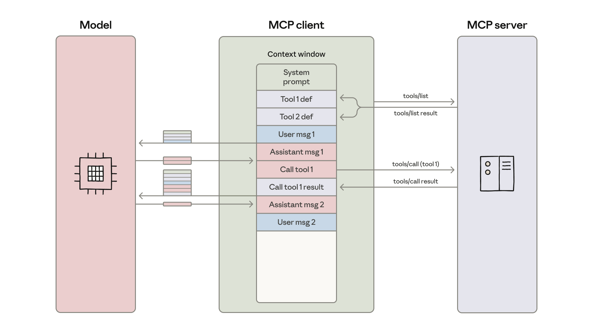

# MCP 代码执行：构建更高效的 Agent（中英对照）

> **原文标题：** Code execution with MCP: Building more efficient agents
> **作者：** Adam Jones, Conor Kelly（Anthropic 工程团队）
> **原文链接：** https://www.anthropic.com/engineering/code-execution-with-mcp
> **发布日期：** 2025-11-04
> 排版：每段英文原文在前，中文翻译紧随其后。术语保留英文原文并附中文释义。

---

[The Model Context Protocol (MCP)](https://modelcontextprotocol.io/) is an open standard for connecting AI agents to external systems. Connecting agents to tools and data traditionally requires a custom integration for each pairing, creating fragmentation and duplicated effort that makes it difficult to scale truly connected systems. MCP provides a universal protocol—developers implement MCP once in their agent and it unlocks an entire ecosystem of integrations.

[模型上下文协议（Model Context Protocol，MCP）](https://modelcontextprotocol.io/)是一个用于将 AI Agent 连接到外部系统的开放标准。传统上，把 Agent 连接到工具和数据，需要为每一对组合进行定制集成，造成碎片化和重复劳动，使真正互联的系统难以规模化。MCP 提供了一种通用协议——开发者只需在 Agent 中实现一次 MCP，就能解锁一整套集成生态。

Since launching MCP in November 2024, adoption has been rapid: the community has built thousands of [MCP servers](https://github.com/modelcontextprotocol/servers), [SDKs](https://modelcontextprotocol.io/docs/sdk) are available for all major programming languages, and the industry has adopted MCP as the de-facto standard for connecting agents to tools and data.

自 2024 年 11 月发布 MCP 以来，采用速度十分迅猛：社区已构建了数千个 [MCP 服务器](https://github.com/modelcontextprotocol/servers)，所有主流编程语言都有可用的 [SDK](https://modelcontextprotocol.io/docs/sdk)，业界也已将 MCP 作为将 Agent 连接到工具和数据的事实标准。

Today developers routinely build agents with access to hundreds or thousands of tools across dozens of MCP servers. However, as the number of connected tools grows, loading all tool definitions upfront and passing intermediate results through the context window slows down agents and increases costs.

如今，开发者经常构建能够跨数十个 MCP 服务器访问成百上千个工具的 Agent。然而，随着连接的工具数量不断增长，预先加载所有工具定义、并通过上下文窗口（context window）传递中间结果，会拖慢 Agent 并推高成本。

In this blog we'll explore how code execution can enable agents to interact with MCP servers more efficiently, handling more tools while using fewer tokens.

在本文中，我们将探讨代码执行（code execution）如何让 Agent 更高效地与 MCP 服务器交互——处理更多工具的同时消耗更少的 token（令牌）。

# 工具导致的过度 token 消耗使 Agent 效率低下（Excessive token consumption from tools makes agents less efficient）

As MCP usage scales, there are two common patterns that can increase agent cost and latency:

随着 MCP 使用规模的扩大，有两种常见模式会增加 Agent 的成本和延迟：

1. Tool definitions overload the context window;
2. 工具定义使上下文窗口（context window）过载；
3. Intermediate tool results consume additional tokens.
4. 中间工具结果会消耗额外的 token。

## 1. 工具定义使上下文窗口过载（Tool definitions overload the context window）

Most MCP clients load all tool definitions upfront directly into context, exposing them to the model using a direct tool-calling syntax. These tool definitions might look like:

大多数 MCP 客户端会预先将所有工具定义直接加载到上下文中，用直接的"工具调用"（tool-calling）语法把它们暴露给模型。这些工具定义看起来可能是这样的：

```text
gdrive.getDocument
     Description: Retrieves a document from Google Drive
     Parameters:
                documentId (required, string): The ID of the document to retrieve
                fields (optional, string): Specific fields to return
     Returns: Document object with title, body content, metadata, permissions, etc.

salesforce.updateRecord
    Description: Updates a record in Salesforce
    Parameters:
               objectType (required, string): Type of Salesforce object (Lead, Contact,      Account, etc.)
               recordId (required, string): The ID of the record to update
               data (required, object): Fields to update with their new values
     Returns: Updated record object with confirmation
```

Tool descriptions occupy more context window space, increasing response time and costs. In cases where agents are connected to thousands of tools, they'll need to process hundreds of thousands of tokens before reading a request.

工具描述会占据更多上下文窗口空间，增加响应时间和成本。在 Agent 连接到数千个工具的情况下，它们在读取一条请求之前就需要处理数十万 token。

## 2. 中间工具结果会消耗额外的 token（Intermediate tool results consume additional tokens）

Most MCP clients allow models to directly call MCP tools. For example, you might ask your agent: "Download my meeting transcript from Google Drive and attach it to the Salesforce lead."

大多数 MCP 客户端允许模型直接调用 MCP 工具。例如，你可能会让 Agent："从 Google Drive 下载我的会议记录，并把它附加到 Salesforce 的线索（lead）上。"

The model will make calls like:

模型会发起类似这样的调用：

```text
TOOL CALL: gdrive.getDocument(documentId: "abc123")
        → returns "Discussed Q4 goals...\n[full transcript text]"
           (loaded into model context)

TOOL CALL: salesforce.updateRecord(
            objectType: "SalesMeeting",
            recordId: "00Q5f000001abcXYZ",
            data: { "Notes": "Discussed Q4 goals...\n[full transcript text written out]" }
        )
        (model needs to write entire transcript into context again)
```

Every intermediate result must pass through the model. In this example, the full call transcript flows through twice. For a 2-hour sales meeting, that could mean processing an additional 50,000 tokens. Even larger documents may exceed context window limits, breaking the workflow.

每一个中间结果都必须经过模型。在这个例子中，完整的调用记录要流经两次。对于一个 2 小时的销售会议来说，这可能意味着额外处理 50,000 个 token。更大的文档甚至可能超出上下文窗口的限制，导致工作流中断。

With large documents or complex data structures, models may be more likely to make mistakes when copying data between tool calls.

面对大型文档或复杂的数据结构，模型在工具调用之间复制数据时更有可能出错。



> The MCP client loads tool definitions into the model's context window and orchestrates a message loop where each tool call and result passes through the model between operations.
> MCP 客户端将工具定义加载到模型的上下文窗口中，并编排一个消息循环（message loop），每次工具调用及其结果都会在操作之间流经模型。

# MCP 代码执行提升上下文效率（Code execution with MCP improves context efficiency）

With code execution environments becoming more common for agents, a solution is to present MCP servers as code APIs rather than direct tool calls. The agent can then write code to interact with MCP servers. This approach addresses both challenges: agents can load only the tools they need and process data in the execution environment before passing results back to the model.

随着代码执行环境在 Agent 中变得越来越常见，一个解决方案是把 MCP 服务器呈现为代码 API（code APIs），而不是直接的工具调用。Agent 随后可以编写代码来与 MCP 服务器交互。这种方法同时解决了上述两个挑战：Agent 只需加载它需要的工具，并可以在执行环境中处理数据，再把结果传回给模型。

There are a number of ways to do this. One approach is to generate a file tree of all available tools from connected MCP servers. Here's an implementation using TypeScript:

实现这一点的方法有很多。一种做法是从已连接的 MCP 服务器生成所有可用工具的文件树。下面是一个使用 TypeScript 的实现：

```text
servers
├── google-drive
│   ├── getDocument.ts
│   ├── ... (other tools)
│   └── index.ts
├── salesforce
│   ├── updateRecord.ts
│   ├── ... (other tools)
│   └── index.ts
└── ... (other servers)
```

Then each tool corresponds to a file, something like:

然后每个工具对应一个文件，大致如下：

```typescript
// ./servers/google-drive/getDocument.ts
import { callMCPTool } from "../../../client.js";

interface GetDocumentInput {
  documentId: string;
}

interface GetDocumentResponse {
  content: string;
}

/* Read a document from Google Drive */
export async function getDocument(input: GetDocumentInput): Promise<GetDocumentResponse> {
  return callMCPTool<GetDocumentResponse>('google_drive__get_document', input);
}
```

Our Google Drive to Salesforce example above becomes the code:

我们上面那个"从 Google Drive 到 Salesforce"的例子就变成了如下代码：

```typescript
// Read transcript from Google Docs and add to Salesforce prospect
import * as gdrive from './servers/google-drive';
import * as salesforce from './servers/salesforce';

const transcript = (await gdrive.getDocument({ documentId: 'abc123' })).content;
await salesforce.updateRecord({
  objectType: 'SalesMeeting',
  recordId: '00Q5f000001abcXYZ',
  data: { Notes: transcript }
});
```

The agent discovers tools by exploring the filesystem: listing the `./servers/` directory to find available servers (like `google-drive` and `salesforce`), then reading the specific tool files it needs (like `getDocument.ts` and `updateRecord.ts`) to understand each tool's interface. This lets the agent load only the definitions it needs for the current task. This reduces the token usage from 150,000 tokens to 2,000 tokens—a time and cost saving of 98.7%.

Agent 通过探索文件系统来发现工具：先列出 `./servers/` 目录以找到可用的服务器（如 `google-drive` 和 `salesforce`），再读取它需要的具体工具文件（如 `getDocument.ts` 和 `updateRecord.ts`）以理解每个工具的接口。这让 Agent 只为当前任务加载它需要的定义，把 token 用量从 150,000 个降至 2,000 个——节省了 98.7% 的时间和成本。

Cloudflare [published similar findings](https://blog.cloudflare.com/code-mode/), referring to code execution with MCP as "Code Mode." The core insight is the same: LLMs are adept at writing code and developers should take advantage of this strength to build agents that interact with MCP servers more efficiently.

Cloudflare 也[发布了类似的发现](https://blog.cloudflare.com/code-mode/)，把 MCP 代码执行称为"Code Mode"（代码模式）。核心洞察是相同的：LLM 擅长编写代码，开发者应当利用这一优势，构建更高效地与 MCP 服务器交互的 Agent。

# MCP 代码执行的好处（Benefits of code execution with MCP）

Code execution with MCP enables agents to use context more efficiently by loading tools on demand, filtering data before it reaches the model, and executing complex logic in a single step. There are also security and state management benefits to using this approach.

MCP 代码执行让 Agent 能够更高效地使用上下文：按需加载工具、在数据到达模型之前进行过滤、并以单一步骤执行复杂逻辑。使用这种方法还有安全性和状态管理方面的好处。

## 渐进式披露（Progressive disclosure）

Models are great at navigating filesystems. Presenting tools as code on a filesystem allows models to read tool definitions on-demand, rather than reading them all up-front.

模型非常擅长浏览文件系统。把工具以代码形式呈现在文件系统上，可以让模型按需读取工具定义，而不是预先全部读完。

Alternatively, a `search_tools` tool can be added to the server to find relevant definitions. For example, when working with the hypothetical Salesforce server used above, the agent searches for "salesforce" and loads only those tools that it needs for the current task. Including a detail level parameter in the `search_tools` tool that allows the agent to select the level of detail required (such as name only, name and description, or the full definition with schemas) also helps the agent conserve context and find tools efficiently.

另外，也可以给服务器添加一个 `search_tools` 工具来查找相关定义。例如，在配合上文那个假设的 Salesforce 服务器使用时，Agent 会搜索 "salesforce"，只加载当前任务所需的那些工具。在 `search_tools` 工具中加入一个"详细程度"参数，让 Agent 可以选择所需的细节级别（例如仅名称、名称与描述、或带 schema（模式）的完整定义），也有助于 Agent 节省上下文并高效地找到工具。

## 节省上下文的工具结果（Context efficient tool results）

When working with large datasets, agents can filter and transform results in code before returning them. Consider fetching a 10,000-row spreadsheet:

在处理大型数据集时，Agent 可以先在代码中过滤和转换结果，再返回它们。设想拉取一个 10,000 行的电子表格：

```text
// Without code execution - all rows flow through context
TOOL CALL: gdrive.getSheet(sheetId: 'abc123')
        → returns 10,000 rows in context to filter manually

// With code execution - filter in the execution environment
const allRows = await gdrive.getSheet({ sheetId: 'abc123' });
const pendingOrders = allRows.filter(row => 
  row["Status"] === 'pending'
);
console.log(`Found ${pendingOrders.length} pending orders`);
console.log(pendingOrders.slice(0, 5)); // Only log first 5 for review
```

The agent sees five rows instead of 10,000. Similar patterns work for aggregations, joins across multiple data sources, or extracting specific fields—all without bloating the context window.

Agent 看到的是 5 行而不是 10,000 行。类似的模式也适用于聚合、跨多个数据源的连接（join），或提取特定字段——所有这些都不会撑大上下文窗口。

### 更强大且更省上下文的控制流（More powerful and context-efficient control flow）

Loops, conditionals, and error handling can be done with familiar code patterns rather than chaining individual tool calls. For example, if you need a deployment notification in Slack, the agent can write:

循环、条件判断和错误处理可以用熟悉的代码模式来完成，而不是串联单独的工具调用。例如，如果你需要在 Slack 中收到部署通知，Agent 可以这样写：

```javascript
let found = false;
while (!found) {
  const messages = await slack.getChannelHistory({ channel: 'C123456' });
  found = messages.some(m => m.text.includes('deployment complete'));
  if (!found) await new Promise(r => setTimeout(r, 5000));
}
console.log('Deployment notification received');
```

This approach is more efficient than alternating between MCP tool calls and sleep commands through the agent loop.

这种方法比在 Agent 循环中交替进行 MCP 工具调用和 sleep（休眠）命令更高效。

Additionally, being able to write out a conditional tree that gets executed also saves on "time to first token" latency: rather than having to wait for a model to evaluate an if-statement, the agent can let the code execution environment do this.

此外，能够写出一个会被实际执行的判断树，还能节省"首 token 时间"（time to first token）延迟：Agent 不必等待模型去评估一条 if 语句，而是可以让代码执行环境来完成这件事。

## 保护隐私的操作（Privacy-preserving operations）

When agents use code execution with MCP, intermediate results stay in the execution environment by default. This way, the agent only sees what you explicitly log or return, meaning data you don't wish to share with the model can flow through your workflow without ever entering the model's context.

当 Agent 使用 MCP 代码执行时，中间结果默认会留在执行环境中。这样一来，Agent 只能看到你明确记录（log）或返回的内容，也就是说，你不想与模型共享的数据可以在工作流中流转，而永远不会进入模型的上下文。

For even more sensitive workloads, the agent harness can tokenize sensitive data automatically. For example, imagine you need to import customer contact details from a spreadsheet into Salesforce. The agent writes:

对于更敏感的工作负载，Agent 运行框架（harness）可以自动对敏感数据进行令牌化（tokenize）。例如，设想你需要把电子表格中的客户联系信息导入 Salesforce。Agent 会这样写：

```javascript
const sheet = await gdrive.getSheet({ sheetId: 'abc123' });
for (const row of sheet.rows) {
  await salesforce.updateRecord({
    objectType: 'Lead',
    recordId: row.salesforceId,
    data: { 
      Email: row.email,
      Phone: row.phone,
      Name: row.name
    }
  });
}
console.log(`Updated ${sheet.rows.length} leads`);
```

The MCP client intercepts the data and tokenizes PII before it reaches the model:

MCP 客户端会拦截这些数据，在它们到达模型之前对 PII（个人身份信息，Personally Identifiable Information）进行令牌化：

```text
// What the agent would see, if it logged the sheet.rows:
[
  { salesforceId: '00Q...', email: '[EMAIL_1]', phone: '[PHONE_1]', name: '[NAME_1]' },
  { salesforceId: '00Q...', email: '[EMAIL_2]', phone: '[PHONE_2]', name: '[NAME_2]' },
  ...
]
```

Then, when the data is shared in another MCP tool call, it is untokenized via a lookup in the MCP client. The real email addresses, phone numbers, and names flow from Google Sheets to Salesforce, but never through the model. This prevents the agent from accidentally logging or processing sensitive data. You can also use this to define deterministic security rules, choosing where data can flow to and from.

然后，当这些数据在另一次 MCP 工具调用中被共享时，会通过 MCP 客户端中的查找（lookup）恢复（untokenize）。真实的电子邮件地址、电话号码和姓名会从 Google Sheets 流向 Salesforce，但从不经过模型。这可以防止 Agent 意外记录或处理敏感数据。你也可以用它来定义确定性的安全规则，选择数据可以在哪些地方之间流转。

## 状态持久化与技能（State persistence and skills）

Code execution with filesystem access allows agents to maintain state across operations. Agents can write intermediate results to files, enabling them to resume work and track progress:

带文件系统访问权限的代码执行，让 Agent 能够在多次操作之间保持状态。Agent 可以把中间结果写入文件，从而能够恢复工作并跟踪进度：

```javascript
const leads = await salesforce.query({ 
  query: 'SELECT Id, Email FROM Lead LIMIT 1000' 
});
const csvData = leads.map(l => `${l.Id},${l.Email}`).join('\n');
await fs.writeFile('./workspace/leads.csv', csvData);

// Later execution picks up where it left off
const saved = await fs.readFile('./workspace/leads.csv', 'utf-8');
```

Agents can also persist their own code as reusable functions. Once an agent develops working code for a task, it can save that implementation for future use:

Agent 还可以把自己写好的代码持久化为可复用的函数。一旦 Agent 为某个任务写出了可运行的代码，它就可以保存该实现以备将来使用：

```typescript
// In ./skills/save-sheet-as-csv.ts
import * as gdrive from './servers/google-drive';
export async function saveSheetAsCsv(sheetId: string) {
  const data = await gdrive.getSheet({ sheetId });
  const csv = data.map(row => row.join(',')).join('\n');
  await fs.writeFile(`./workspace/sheet-${sheetId}.csv`, csv);
  return `./workspace/sheet-${sheetId}.csv`;
}

// Later, in any agent execution:
import { saveSheetAsCsv } from './skills/save-sheet-as-csv';
const csvPath = await saveSheetAsCsv('abc123');
```

This ties in closely to the concept of [Skills](https://docs.claude.com/en/docs/agents-and-tools/agent-skills/overview), folders of reusable instructions, scripts, and resources for models to improve performance on specialized tasks. Adding a SKILL.md file to these saved functions creates a structured skill that models can reference and use. Over time, this allows your agent to build a toolbox of higher-level capabilities, evolving the scaffolding that it needs to work most effectively.

这与[技能（Skill）](https://docs.claude.com/en/docs/agents-and-tools/agent-skills/overview)的概念密切相关——技能是供模型在专门任务上提升性能的可复用指令、脚本和资源文件夹。给这些保存下来的函数添加一个 SKILL.md 文件，就能创建一个结构化的技能，供模型参考和使用。随着时间的推移，这让你的 Agent 能够建立起一个更高级能力的工具箱，不断演进它最有效工作所需的脚手架（scaffolding）。

Note that code execution introduces its own complexity. Running agent-generated code requires a secure execution environment with appropriate [sandboxing](https://www.anthropic.com/engineering/claude-code-sandboxing), resource limits, and monitoring. These infrastructure requirements add operational overhead and security considerations that direct tool calls avoid. The benefits of code execution—reduced token costs, lower latency, and improved tool composition—should be weighed against these implementation costs.

请注意，代码执行也引入了它自身的复杂性。运行 Agent 生成的代码需要一个安全的执行环境，具备适当的[沙箱（sandboxing）](https://www.anthropic.com/engineering/claude-code-sandboxing)、资源限制和监控。这些基础设施要求会增加直接工具调用所没有的运维开销和安全考量。代码执行的好处——降低 token 成本、降低延迟、改善工具组合——应当与这些实现成本进行权衡。

# 总结（Summary）

MCP provides a foundational protocol for agents to connect to many tools and systems. However, once too many servers are connected, tool definitions and results can consume excessive tokens, reducing agent efficiency.

MCP 为 Agent 连接众多工具和系统提供了基础性协议。然而，一旦连接了太多服务器，工具定义和结果就会消耗过多的 token，降低 Agent 的效率。

Although many of the problems here feel novel—context management, tool composition, state persistence—they have known solutions from software engineering. Code execution applies these established patterns to agents, letting them use familiar programming constructs to interact with MCP servers more efficiently. If you implement this approach, we encourage you to share your findings with the [MCP community](https://modelcontextprotocol.io/community/communication).

尽管这里讨论的许多问题看起来颇具新意——上下文管理、工具组合、状态持久化——但它们都有来自软件工程领域的成熟解决方案。代码执行将这些既有模式应用到 Agent 上，让它们用熟悉的编程结构更高效地与 MCP 服务器交互。如果你实现了这种方法，我们鼓励你与 [MCP 社区](https://modelcontextprotocol.io/community/communication)分享你的发现。

## 致谢（Acknowledgments）

*This article was written by Adam Jones and Conor Kelly. Thanks to Jeremy Fox, Jerome Swannack, Stuart Ritchie, Molly Vorwerck, Matt Samuels, and Maggie Vo for feedback on drafts of this post.*

*本文由 Adam Jones 和 Conor Kelly 撰写。感谢 Jeremy Fox、Jerome Swannack、Stuart Ritchie、Molly Vorwerck、Matt Samuels 和 Maggie Vo 对本文草稿提出的反馈。*
