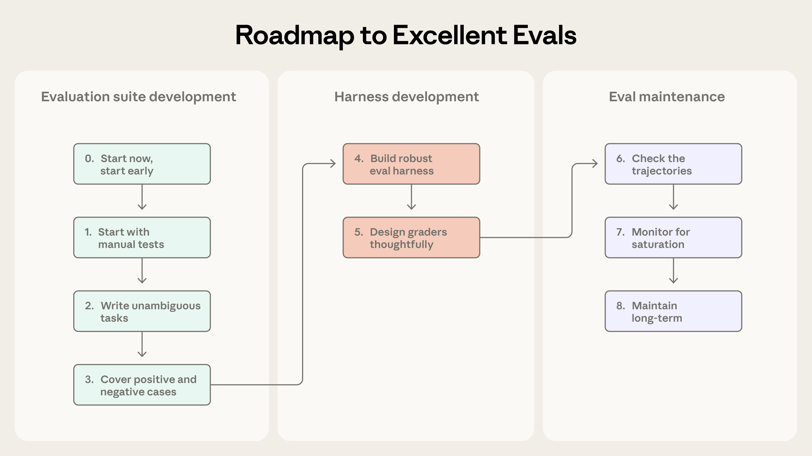
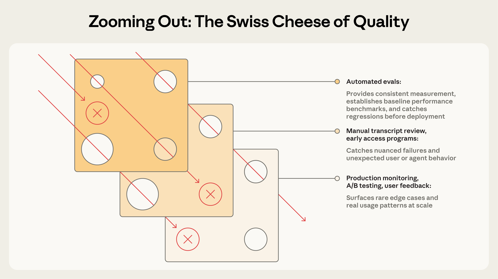

# 揭开 AI Agent 评测（Evals）的神秘面纱（中英对照）

> **原文标题：** Demystifying evals for AI agents
> **作者：** Mikaela Grace, Jeremy Hadfield, Rodrigo Olivares, Jiri De Jonghe（Anthropic 工程团队）
> **原文链接：** https://www.anthropic.com/engineering/demystifying-evals-for-ai-agents
> **发布日期：** 2026-01-09
> 排版：每段英文原文在前，中文翻译紧随其后。术语保留英文原文并附中文释义。

---

# 引言（Introduction）

Good evaluations help teams ship AI agents more confidently. Without them, it's easy to get stuck in reactive loops—catching issues only in production, where fixing one failure creates others. Evals make problems and behavioral changes visible before they affect users, and their value compounds over the lifecycle of an agent.

好的评测（eval）能帮助团队更有信心地发布 AI Agent。没有评测，团队很容易陷入被动循环（reactive loops）——只能等到上线后才发现问题，而修复一个问题往往又制造出新的问题。评测能让问题与行为变化在影响用户之前就变得可见，而且它们的价值会随着 Agent 的生命周期不断累积（compound）。

As we described in Building effective agents, agents operate over many turns: calling tools, modifying state, and adapting based on intermediate results. These same capabilities that make AI agents useful—autonomy, intelligence, and flexibility—also make them harder to evaluate.

正如我们在《Building effective agents》一文中所描述的，Agent 会经历很多轮（turns）操作：调用工具、修改状态，并根据中间结果不断调整。正是这些让 AI Agent 变得有用的能力——自主性、智能与灵活性——也让它们更难被评测。

Through our internal work and with customers at the frontier of agent development, we've learned how to design more rigorous and useful evals for agents. Here's what's worked across a range of agent architectures and use cases in real-world deployment.

通过我们内部的实践，以及与处于 Agent 开发前沿的客户合作，我们学会了如何为 Agent 设计更严谨、更有用的评测。下面是在各种 Agent 架构和真实部署用例中被证明有效的经验。

---

# 评测的结构（The structure of an evaluation）

An evaluation ("eval") is a test for an AI system: give an AI an input, then apply grading logic to its output to measure success. In this post, we focus on automated evals that can be run during development without real users.

评测（evaluation，"eval"）是对 AI 系统的一种测试：向 AI 提供一个输入，然后对其输出应用评分逻辑（grading logic）来衡量成功与否。本文聚焦于可以在开发阶段、无需真实用户即可运行的自动化评测。

Single-turn evaluations are straightforward: a prompt, a response, and grading logic. For earlier LLMs, single-turn, non-agentic evals were the main evaluation method. As AI capabilities have advanced, multi-turn evaluations have become increasingly common.

单轮评测（single-turn）简单直接：一条提示词（prompt）、一个响应、以及评分逻辑。对于早期的 LLM 而言，单轮、非 Agent 的评测是主要的评测方法。随着 AI 能力的进步，多轮评测（multi-turn）正变得越来越常见。


> In a simple eval, an agent processes a prompt, and a grader checks if the output matches expectations. For a more complex multi-turn eval, a coding agent receives tools, a task (building an MCP server in this case), and an environment, executes an "agent loop" (tool calls and reasoning), and updates the environment with the implementation. Grading then uses unit tests to verify the working MCP server.
> 在简单评测中，Agent 处理一条提示词，然后由评分器检查输出是否符合预期。在更复杂的多轮评测中，编码 Agent 会获得工具、一个任务（此例为构建一个 MCP 服务器）和一个环境，执行"Agent 循环"（工具调用与推理），并用实现代码更新环境。随后，评分使用单元测试来验证可正常工作的 MCP 服务器。

Agent evaluations are even more complex. Agents use tools across many turns, modifying state in the environment and adapting as they go—which means mistakes can propagate and compound. Frontier models can also find creative solutions that surpass the limits of static evals. For instance, Opus 4.5 solved a 𝜏2-bench problem about booking a flight by discovering a loophole in the policy. It "failed" the evaluation as written, but actually came up with a better solution for the user.

Agent 评测则更为复杂。Agent 会在很多轮中调用工具，修改环境中的状态，并边走边调整——这意味着错误可能会传播并累积。前沿模型还常常能想出超越静态评测局限的创造性解决方案。例如，Opus 4.5 在解决一个关于预订航班的 𝜏2-bench 问题时，发现了政策中的一个漏洞：按照既有写法它"没有通过"评测，但实际上它为用户提出了一个更好的解决方案。

When building agent evaluations, we use the following definitions:

在构建 Agent 评测时，我们使用以下定义：

- **A task** (a.k.a problem or test case) is a single test with defined inputs and success criteria.
- **Task（任务，又称问题或测试用例）**是带有明确输入与成功标准的单个测试。

- **Each attempt at a task is a trial.** Because model outputs vary between runs, we run multiple trials to produce more consistent results.
- **对任务的一次尝试称为 trial（试验）。**由于模型输出在每次运行之间会变化，我们会运行多次 trial 以获得更一致的结果。

- **A grader** is logic that scores some aspect of the agent's performance. A task can have multiple graders, each containing multiple assertions (sometimes called checks).
- **Grader（评分器）**是对 Agent 表现的某一方面进行打分的逻辑。一个任务可以有多个评分器，每个评分器包含多条断言（assertion，有时也称为检查 check）。

- **A transcript** (also called a trace or trajectory) is the complete record of a trial, including outputs, tool calls, reasoning, intermediate results, and any other interactions. For the Anthropic API, this is the full messages array at the end of an eval run - containing all the calls to the API and all of the returned responses during the evaluation.
- **Transcript（轨迹，也叫 trace 或 trajectory）**是某次 trial 的完整记录，包括输出、工具调用、推理、中间结果以及任何其他交互。对于 Anthropic API 而言，它就是一次评测运行结束时完整的 messages 数组——包含评测期间对 API 的全部调用及返回的全部响应。

- **The outcome** is the final state in the environment at the end of the trial. A flight-booking agent might say "Your flight has been booked" at the end of the transcript, but the outcome is whether a reservation exists in the environment's SQL database.
- **Outcome（结果）**是 trial 结束时环境中呈现的最终状态。一个订票 Agent 可能在 transcript 末尾说"您的航班已预订"，但 outcome 要看的是环境中的 SQL 数据库里是否真的存在一条预订记录。

- **An evaluation harness** is the infrastructure that runs evals end-to-end. It provides instructions and tools, runs tasks concurrently, records all the steps, grades outputs, and aggregates results.
- **Evaluation harness（评测框架/基础设施）**是端到端运行评测的基础设施。它提供指令和工具、并发运行任务、记录所有步骤、给输出评分并汇总结果。

- **An agent harness** (or scaffold) is the system that enables a model to act as an agent: it processes inputs, orchestrates tool calls, and returns results. When we evaluate "an agent," we're evaluating the harness and the model working together. For example, Claude Code is a flexible agent harness, and we used its core primitives through the Agent SDK to build our long-running agent harness.
- **Agent harness（Agent 框架，或脚手架 scaffold）**是让模型能够以 Agent 身份行动的系统：它处理输入、编排工具调用、返回结果。当我们评测"一个 Agent"时，我们实际是在评测 harness 与模型协同工作的整体。例如，Claude Code 就是一个灵活的 Agent harness，我们通过 Agent SDK 使用它的核心原语（primitives）构建了我们的长时运行 Agent harness。

- **An evaluation suite** is a collection of tasks designed to measure specific capabilities or behaviors. Tasks in a suite typically share a broad goal. For instance, a customer support eval suite might test refunds, cancellations, and escalations.
- **Evaluation suite（评测集）**是为衡量特定能力或行为而设计的一组任务。一个评测集中的任务通常共享一个宽泛的目标。例如，客户支持评测集可能测试退款、取消和升级（escalation）等场景。


> Components of evaluations for agents.
> Agent 评测的组成部分。

---

# 为什么要构建评测？（Why build evaluations?）

When teams first start building agents, they can get surprisingly far through a combination of manual testing, dogfooding, and intuition. More rigorous evaluation may even seem like overhead that slows down shipping. But after the early prototyping stages, once an agent is in production and has started scaling, building without evals starts to break down.

团队刚开始构建 Agent 时，通过组合使用手动测试、自用（dogfooding）和直觉，往往能取得令人惊讶的进展。更严谨的评测甚至看起来像是拖慢发布进度的额外开销。但过了早期原型阶段之后，一旦 Agent 进入生产环境并开始规模化，没有评测的开发方式就会开始崩坏。

The breaking point often comes when users report the agent feels worse after changes, and the team is "flying blind" with no way to verify except to guess and check. Absent evals, debugging is reactive: wait for complaints, reproduce manually, fix the bug, and hope nothing else regressed. Teams can't distinguish real regressions from noise, automatically test changes against hundreds of scenarios before shipping, or measure improvements.

转折点通常出现在：用户反馈改动之后 Agent 感觉变差了，而团队"闭眼飞行"（flying blind），除了猜测再验证之外别无他法。没有评测，调试就是被动的：等待投诉、手动复现、修复 bug，然后祈祷没有其他东西回归。团队无法区分真正的回归（regression）与噪声，无法在发布前自动用数百个场景测试改动，也无法衡量改进。

We've seen this progression play out many times. For instance, Claude Code started with fast iteration based on feedback from Anthropic employees and external users. Later, we added evals—first for narrow areas like concision and file edits, and then for more complex behaviors like over-engineering. These evals helped identify issues, guide improvements, and focus research-product collaborations. Combined with production monitoring, A/B tests, user research, and more, evals provide signals to continue improving Claude Code as it scales.

我们多次目睹这种演进过程。例如，Claude Code 起初依靠来自 Anthropic 员工和外部用户的反馈进行快速迭代。后来我们加入了评测——先用于简洁性（concision）和文件编辑等较窄的领域，再用于过度工程化（over-engineering）等更复杂的行为。这些评测帮助我们识别问题、引导改进，并聚焦研究与产品的协作。结合生产环境监控、A/B 测试、用户研究等手段，评测为 Claude Code 在规模化过程中持续改进提供了信号。

Writing evals is useful at any stage in the agent lifecycle. Early on, evals force product teams to specify what success means for the agent, while later they help uphold a consistent quality bar.

编写评测在 Agent 生命周期的任何阶段都有用。早期，评测迫使产品团队明确"对 Agent 来说成功意味着什么"；后期，评测则帮助维持一致的质量标准。

Descript's agent helps users edit videos, so they built evals around three dimensions of a successful editing workflow: don't break things, do what I asked, and do it well. They evolved from manual grading to LLM graders with criteria defined by the product team and periodic human calibration, and now regularly run two separate suites for quality benchmarking and regression testing. The Bolt AI team started building evals later, after they already had a widely used agent. In 3 months, they built an eval system that runs their agent and grades outputs with static analysis, uses browser agents to test apps, and employs LLM judges for behaviors like instruction following.

Descript 的 Agent 帮助用户编辑视频，所以他们围绕成功编辑工作流的三个维度构建评测：不要搞坏东西（don't break things）、做我要求的事（do what I asked）、并且把它做好（do it well）。他们从人工评分演进到 LLM 评分器，评分标准由产品团队定义并定期进行人工校准；现在他们定期运行两套独立的评测集，分别用于质量基准测试（quality benchmarking）和回归测试（regression testing）。Bolt AI 团队起步较晚，是在他们已经拥有被广泛使用的 Agent 之后才开始构建评测。他们在 3 个月内构建了一套评测系统：运行他们的 Agent，用静态分析来给输出评分，用浏览器 Agent 测试应用，并用 LLM 评判器（judges）评估指令遵循等行为。

Some teams create evals at the start of development; others add them once at scale when evals become a bottleneck for improving the agent. Evals are especially useful at the start of agent development to explicitly encode expected behavior. Two engineers reading the same initial spec could come away with different interpretations on how the AI should handle edge cases. An eval suite resolves this ambiguity. Regardless of when they're created, evals help accelerate development.

有些团队在开发之初就创建评测；另一些团队则在规模化之后、评测成为改进 Agent 的瓶颈时才加入。在 Agent 开发初期，评测尤其有用，因为它能显式地固化（encode）预期行为。两位工程师阅读同一份初始规格说明，对于 AI 应如何处理边界情况可能会得出不同的解读。一套评测集就能解决这种歧义。无论何时创建，评测都能加速开发。

Evals also shape how quickly you can adopt new models. When more powerful models come out, teams without evals face weeks of testing while competitors with evals can quickly determine the model's strengths, tune their prompts, and upgrade in days.

评测还决定了你能以多快的速度采用新模型。当更强大的模型问世时，没有评测的团队要面对数周的测试，而拥有评测的竞争对手可以快速判断模型的优势、调优提示词，并在几天内完成升级。

Once evals exist, you get baselines and regression tests for free: latency, token usage, cost per task, and error rates can be tracked on a static bank of tasks. Evals can also become the highest-bandwidth communication channel between product and research teams, defining metrics researchers can optimize against. Clearly, evals have wide-ranging benefits beyond tracking regressions and improvements. Their compounding value is easy to miss given that costs are visible upfront while benefits accumulate later.

一旦评测存在，你就免费获得了基线与回归测试：在固定的任务池（static bank of tasks）上可以跟踪延迟、token 用量、单任务成本与错误率。评测还可以成为产品团队与研究团队之间带宽最高的沟通渠道，为研究者定义可供优化的指标。显然，评测的好处远不止跟踪回归与改进。由于成本在前期显而易见、而收益在后期才不断累积，人们很容易忽视它们不断增值（compounding）的价值。

---

# 如何评测 AI Agent（How to evaluate AI agents）

We see several common types of agents deployed at scale today, including coding agents, research agents, computer use agents, and conversational agents. Each type may be deployed across a wide variety of industries, but they can be evaluated using similar techniques. You don't need to invent an evaluation from scratch. The sections below describe proven techniques for several agent types. Use these methods as a foundation, then extend them to your domain.

今天我们看到几类常见的、已大规模部署的 Agent，包括编码 Agent（coding agents）、研究 Agent（research agents）、计算机使用 Agent（computer use agents）和对话式 Agent（conversational agents）。每种类型可能部署在各种各样的行业里，但它们都可以用类似的技术进行评测。你不需要从零发明一套评测。下面的章节描述了针对几种 Agent 类型的成熟技术。以这些方法为基础，再扩展到你的领域即可。

## 评分器的类型（Types of graders for agents）

Agent evaluations typically combine three types of graders: code-based, model-based, and human. Each grader evaluates some portion of either the transcript or the outcome. An essential component of effective evaluation design is to choose the right graders for the job.

Agent 评测通常组合使用三种类型的评分器：基于代码的（code-based）、基于模型的（model-based）和人工的（human）。每种评分器都负责评估 transcript 或 outcome 的某一部分。有效的评测设计的一个关键部分，就是为任务选择正确的评分器。

**英文原表：**

**Code-based graders / 基于代码的评分器**

| Methods（方法） | Strengths（优势） | Weaknesses（劣势） |
|---|---|---|
| - String match checks (exact, regex, fuzzy, etc.)<br>- Binary tests (fail-to-pass, pass-to-pass)<br>- Static analysis (lint, type, security)<br>- Outcome verification<br>- Tool calls verification (tools used, parameters)<br>- Transcript analysis (turns taken, token usage) | - Fast<br>- Cheap<br>- Objective<br>- Reproducible<br>- Easy to debug<br>- Verify specific conditions | - Brittle to valid variations that don't match expected patterns exactly<br>- Lacking in nuance<br>- Limited for evaluating some more subjective tasks |

**中文对照：**

| 方法 | 优势 | 劣势 |
|---|---|---|
| - 字符串匹配检查（精确、正则、模糊等）<br>- 二值测试（失败转通过 fail-to-pass、通过转通过 pass-to-pass）<br>- 静态分析（lint、类型检查、安全检查）<br>- 结果验证（outcome verification）<br>- 工具调用验证（用到的工具、参数）<br>- Transcript 分析（轮数、token 用量） | - 快<br>- 便宜<br>- 客观<br>- 可复现<br>- 易于调试<br>- 能验证具体条件 | - 对不完全符合预期模式的有效变体很脆弱<br>- 缺乏细微洞察<br>- 在评估某些更主观的任务时能力有限 |

**Model-based graders / 基于模型的评分器**

| Methods（方法） | Strengths（优势） | Weaknesses（劣势） |
|---|---|---|
| - Rubric-based scoring<br>- Natural language assertions<br>- Pairwise comparison<br>- Reference-based evaluation<br>- Multi-judge consensus | - Flexible<br>- Scalable<br>- Captures nuance<br>- Handles open-ended tasks<br>- Handles freeform output | - Non-deterministic<br>- More expensive than code<br>- Requires calibration with human graders for accuracy |

| 方法 | 优势 | 劣势 |
|---|---|---|
| - 基于评分细则（rubric）的评分<br>- 自然语言断言<br>- 两两比较（pairwise comparison）<br>- 基于参考答案的评测<br>- 多评判者共识（multi-judge consensus） | - 灵活<br>- 可扩展<br>- 能捕捉细微差别<br>- 能处理开放式任务<br>- 能处理自由格式输出 | - 非确定性<br>- 比代码评分更贵<br>- 为保证准确度需要与人工评分器校准 |

**Human graders / 人工评分器**

| Methods（方法） | Strengths（优势） | Weaknesses（劣势） |
|---|---|---|
| - SME review<br>- Crowdsourced judgment<br>- Spot-check sampling<br>- A/B testing<br>- Inter-annotator agreement | - Gold standard quality<br>- Matches expert user judgment<br>- Used to calibrate model-based graders | - Expensive<br>- Slow<br>- Often requires access to human experts at scale |

| 方法 | 优势 | 劣势 |
|---|---|---|
| - 领域专家（SME）审查<br>- 众包判断<br>- 抽查采样（spot-check sampling）<br>- A/B 测试<br>- 标注者间一致性（inter-annotator agreement） | - 金标准（gold standard）质量<br>- 与专家用户判断一致<br>- 用于校准基于模型的评分器 | - 昂贵<br>- 慢<br>- 规模化时往往需要接触人类专家 |

For each task, scoring can be weighted (combined grader scores must hit a threshold), binary (all graders must pass), or a hybrid.

对于每个任务，评分方式可以是加权（weighted，组合评分必须达到某个阈值）、二值（binary，所有评分器都必须通过），或混合式（hybrid）。

## 能力评测 vs 回归评测（Capability vs. regression evals）

Capability or "quality" evals ask, "What can this agent do well?" They should start at a low pass rate, targeting tasks the agent struggles with and giving teams a hill to climb.

能力评测（capability）或"质量"评测问的是："这个 Agent 能把什么做好？"它们应该从一个较低的通过率开始，瞄准 Agent 尚不擅长的任务，给团队一座可以攀登的山丘（hill to climb）。

Regression evals ask, "Does the agent still handle all the tasks it used to?" and should have a nearly 100% pass rate. They protect against backsliding, as a decline in score signals that something is broken and needs to be improved. As teams hill-climb on capability evals, it's important to also run regression evals to make sure changes don't cause issues elsewhere.

回归评测（regression evals）问的是："这个 Agent 还能不能处理它以前能处理的所有任务？"它们应该接近 100% 的通过率。它们用于防止倒退（backsliding），因为分数下降就意味着有东西坏了、需要改进。在团队沿着能力评测这座山丘攀登的同时，也要运行回归评测，以确保改动不会在其他地方引发问题。

After an agent is launched and optimized, capability evals with high pass rates can "graduate" to become a regression suite that is run continuously to catch any drift. Tasks that once measured "Can we do this at all?" then measure "Can we still do this reliably?"

当一个 Agent 已经发布并优化完成后，通过率高的能力评测可以"毕业"（graduate），转化为持续运行的回归评测集，用来捕捉任何漂移（drift）。曾经衡量"我们到底能不能做到？"的任务，此后转而衡量"我们还能可靠地做到吗？"。

## 评测编码 Agent（Evaluating coding agents）

Coding agents write, test, and debug code, navigating codebases and running commands much like a human developer. Effective evals for modern coding agents usually rely on well-specified tasks, stable test environments, and thorough tests for the generated code.

编码 Agent 编写、测试和调试代码，像人类开发者一样浏览代码库、运行命令。针对现代编码 Agent 的有效评测，通常依赖描述清晰的任务、稳定的测试环境，以及对生成代码的全面测试。

Deterministic graders are natural for coding agents because software is generally straightforward to evaluate: does the code run and do the tests pass? Two widely used coding agent benchmarks, SWE-bench Verified and Terminal-Bench, follow this approach. SWE-bench Verified gives agents GitHub issues from popular Python repositories and grades solutions by running the test suite; a solution passes only if it fixes the failing tests without breaking existing ones. LLMs have progressed from 40% to >80% on this eval in just one year. Terminal-Bench takes a different track: it tests end-to-end technical tasks, such as building a Linux kernel from source or training an ML model.

确定性评分器（deterministic graders）对编码 Agent 来说很自然，因为软件通常很容易评测：代码能否运行？测试能否通过？两个广泛使用的编码 Agent 基准 SWE-bench Verified 和 Terminal-Bench 就采用了这种方法。SWE-bench Verified 给 Agent 提供流行 Python 仓库的 GitHub issue，并通过运行测试套件来给解决方案评分；一个解决方案只有修复了失败的测试、且没有破坏既有测试才算通过。LLM 在这一评测上的成绩在短短一年内从 40% 提升到了 80% 以上。Terminal-Bench 则走了另一条路线：它测试端到端的技术任务，例如从源码构建 Linux 内核或训练一个 ML 模型。

Once you have a set of pass-or-fail tests for validating the key outcomes of a coding task, it's often useful to also grade the transcript. For instance, heuristics-based code quality rules can evaluate the generated code based on more than passing tests, and model-based graders with clear rubrics can assess behaviors like how the agent calls tools or interacts with the user.

当你拥有一组用于验证编码任务关键结果的通过/失败测试之后，对 transcript（轨迹）进行评分通常也很有用。例如，基于启发式的代码质量规则，可以在"通过测试"之外评估生成代码的质量；带有清晰评分细则（rubrics）的模型评分器，则可以评估 Agent 如何调用工具、如何与用户互动等行为。

### 示例：编码 Agent 的理论评测（Example: Theoretical evaluation for a coding agent）

Consider a coding task where the agent must fix an authentication bypass vulnerability. As shown in the illustrative YAML file below, one could evaluate this agent using both graders and metrics.

考虑一个要求 Agent 修复认证绕过（authentication bypass）漏洞的编码任务。如下面的示例 YAML 文件所示，我们可以同时使用评分器和指标来评测这个 Agent。

```yaml
task:
  id: "fix-auth-bypass_1"
  desc: "Fix authentication bypass when password field is empty and ..."
  graders:
    - type: deterministic_tests
      required: [test_empty_pw_rejected.py, test_null_pw_rejected.py]
    - type: llm_rubric
      rubric: prompts/code_quality.md
    - type: static_analysis
      commands: [ruff, mypy, bandit]
    - type: state_check
      expect:
        security_logs: {event_type: "auth_blocked"}
    - type: tool_calls
      required:
        - {tool: read_file, params: {path: "src/auth/*"}}
        - {tool: edit_file}
        - {tool: run_tests}
  tracked_metrics:
    - type: transcript
      metrics:
        - n_turns
        - n_toolcalls
        - n_total_tokens
    - type: latency
      metrics:
        - time_to_first_token
        - output_tokens_per_sec
        - time_to_last_token
```

Note that this example showcases the full range of available graders for illustration. In practice, coding evaluations typically rely on unit tests for correctness verification and an LLM rubric for assessing overall code quality, with additional graders and metrics added only as needed.

请注意，这个例子为了说明而展示了全部可用的评分器类型。在实践中，编码评测通常依靠单元测试验证正确性，用 LLM 评分细则评估整体代码质量，只有在需要时才添加额外的评分器和指标。

## 评测对话式 Agent（Evaluating conversational agents）

Conversational agents interact with users in domains like support, sales, or coaching. Unlike traditional chatbots, they maintain state, use tools, and take actions mid-conversation. While coding and research agents can also involve many turns of interaction with the user, conversational agents present a distinct challenge: the quality of the interaction itself is part of what you're evaluating. Effective evals for conversational agents usually rely on verifiable end-state outcomes and rubrics that capture both task completion and interaction quality. Unlike most other evals, they often require a second LLM to simulate the user. We use this approach in our alignment auditing agents to stress-test models through extended, adversarial conversations.

对话式 Agent 在支持、销售或教练等场景中与用户互动。与传统聊天机器人不同，它们会维护状态、使用工具，并在对话过程中采取行动。虽然编码和研究 Agent 也可能与用户进行多轮交互，但对话式 Agent 面临一个独特的挑战：交互本身的质量就是你评测内容的一部分。针对对话式 Agent 的有效评测，通常依赖可验证的最终状态（end-state）结果，以及同时捕捉任务完成度与交互质量的评分细则。与大多数其他评测不同，这类评测常常需要第二个 LLM 来模拟用户。我们在对齐审计 Agent（alignment auditing agents）中就使用了这种方法，通过长时间、对抗性的对话来对模型进行压力测试。

Success for conversational agents can be multidimensional: is the ticket resolved (state check), did it finish in <10 turns (transcript constraint), and was the tone appropriate (LLM rubric)? Two benchmarks that incorporate multidimensionality are 𝜏-Bench and its successor, τ2-Bench. These simulate multi-turn interactions across domains like retail support and airline booking, where one model plays a user persona while the agent navigates realistic scenarios.

对话式 Agent 的成功可以是多维度的：工单是否解决（状态检查 state check）？是否在 10 轮以内完成（transcript 约束）？语气是否得当（LLM 评分细则）？两个体现这种多维度的基准是 𝜏-Bench 和它的后继者 τ2-Bench。它们模拟零售支持、航班预订等领域的多轮交互，其中一个模型扮演用户角色（user persona），而 Agent 在逼真的场景中周旋。

### 示例：对话式 Agent 的理论评测（Example: Theoretical evaluation for a conversational agent）

Consider a support task where the agent must handle a refund for a frustrated customer.

考虑一个支持类任务，要求 Agent 为一位沮丧的客户处理退款。

```yaml
graders:
  - type: llm_rubric
    rubric: prompts/support_quality.md
    assertions:
      - "Agent showed empathy for customer's frustration"
      - "Resolution was clearly explained"
      - "Agent's response grounded in fetch_policy tool results"
  - type: state_check
    expect:
      tickets: {status: resolved}
      refunds: {status: processed}
  - type: tool_calls
    required:
      - {tool: verify_identity}
      - {tool: process_refund, params: {amount: "<=100"}}
      - {tool: send_confirmation}
  - type: transcript
    max_turns: 10
tracked_metrics:
  - type: transcript
    metrics:
      - n_turns
      - n_toolcalls
      - n_total_tokens
  - type: latency
    metrics:
      - time_to_first_token
      - output_tokens_per_sec
      - time_to_last_token
```

As in our coding agent example, this task showcases multiple grader types for illustration. In practice, conversational agent evaluations typically use model-based graders to assess both communication quality and goal completion, because many tasks—like answering a question—may have multiple "correct" solutions.

和我们的编码 Agent 示例一样，这个任务为了说明而展示了多种评分器类型。在实践中，对话式 Agent 评测通常使用基于模型的评分器来同时评估沟通质量与目标完成度，因为许多任务——比如回答问题——可能有多个"正确"的解决方案。

## 评测研究 Agent（Evaluating research agents）

Research agents gather, synthesize, and analyze information, then produce outputs like an answer or report. Unlike coding agents where unit tests provide binary pass/fail signals, research quality can only be judged relative to the task. What counts as "comprehensive," "well-sourced," or even "correct" depends on context: a market scan, due diligence for an acquisition, and a scientific report each require different standards.

研究 Agent 收集、综合和分析信息，然后产出答案或报告等输出。与依靠单元测试给出二值通过/失败信号的编码 Agent 不同，研究质量只能相对于任务本身来判断。什么算"全面"、"来源可靠"，甚至"正确"，都取决于语境：市场扫描、并购尽职调查和科学报告各自需要不同的标准。

Research evals face unique challenges: experts may disagree on whether a synthesis is comprehensive, ground truth shifts as reference content changes constantly, and longer, more open-ended outputs create more room for mistakes. A benchmark like BrowseComp, for example, tests whether AI agents can find needles in haystacks across the open web—questions designed to be easy to verify but hard to solve.

研究评测面临独特的挑战：专家可能对一份综合是否全面意见不一；随着参考内容不断变化，ground truth（基准真相）也在漂移；更长、更开放的输出也为错误留下了更多空间。例如 BrowseComp 这样的基准，测试的是 AI Agent 能否在开放互联网的"干草堆"里找到"针"——这些问题设计成易于验证、但难以求解。

One strategy to build research agent evals is to combine grader types. Groundedness checks verify that claims are supported by retrieved sources, coverage checks define key facts a good answer must include, and source quality checks confirm the consulted sources are authoritative, rather than simply the first retrieved. For tasks with objectively correct answers ("What was Company X's Q3 revenue?"), exact match works. An LLM can flag unsupported claims and gaps in coverage but also verify the open-ended synthesis for coherence and completeness.

构建研究 Agent 评测的一个策略是组合多种评分器类型。接地性检查（groundedness checks）验证主张（claims）是否有检索到的来源支持；覆盖度检查（coverage checks）定义一个好答案必须包含的关键事实；来源质量检查（source quality checks）确认所参考的来源具有权威性，而不是仅仅是最先检索到的那个。对于有客观正确答案的任务（"X 公司第三季度营收是多少？"），精确匹配（exact match）就够用。LLM 既能标记出缺乏支撑的主张和覆盖缺口，也能验证开放式综合在连贯性与完整性上是否合格。

Given the subjective nature of research quality, LLM-based rubrics should be frequently calibrated against expert human judgment to grade these agents effectively.

考虑到研究质量的主观性，基于 LLM 的评分细则应当经常对照专家的人工判断进行校准，才能有效地给这些 Agent 评分。

## 计算机使用 Agent（Computer use agents）

Computer use agents interact with software through the same interface as humans—screenshots, mouse clicks, keyboard inputs, and scrolling—rather than through APIs or code execution. They can use any application with a graphical user interface (GUI), from design tools to legacy enterprise software. Evaluation requires running the agent in a real or sandboxed environment where it can use software applications and checking whether it achieved the intended outcome. For instance, WebArena tests browser-based tasks, using URL and page state checks to verify the agent navigated correctly, along with backend state verification for tasks that modify data (confirming an order was actually placed, not just that the confirmation page appeared). OSWorld extends this to full operating system control, with evaluation scripts that inspect diverse artifacts after task completion: file system state, application configs, database contents, and UI element properties.

计算机使用 Agent 通过与人类相同的界面与软件交互——截图、鼠标点击、键盘输入和滚动——而不是通过 API 或代码执行。它们可以使用任何带图形用户界面（GUI）的应用，从设计工具到老旧的企业软件。评测要求在一个真实或沙箱化的环境中运行 Agent，让它能够使用软件应用，然后检查它是否达成了预期结果。例如，WebArena 测试基于浏览器的任务，用 URL 和页面状态检查来验证 Agent 是否正确导航，同时对修改数据的任务进行后端状态验证（确认订单确实已下单，而不仅仅是出现了确认页面）。OSWorld 将其扩展到完整的操作系统控制，评测脚本在任务完成后检查各种产物：文件系统状态、应用配置、数据库内容和 UI 元素属性。

Browser use agents require a balance between token efficiency and latency. DOM-based interactions execute quickly but consume many tokens, while screenshot-based interactions are slower but more token-efficient. For example, when asking Claude to summarize Wikipedia, it is more efficient to extract the text from the DOM. When finding a new laptop case on Amazon, it is more efficient to take screenshots (as extracting the entire DOM is token-intensive). In our Claude for Chrome product, we developed evals to check that the agent was selecting the right tool for each context. This enabled us to complete browser-based tasks faster and more accurately.

浏览器使用 Agent 需要在 token 效率与延迟之间取得平衡。基于 DOM 的交互执行快，但消耗大量 token；基于截图的交互较慢，但更省 token。例如，让 Claude 总结维基百科时，从 DOM 中提取文本更高效；在亚马逊上找一个新的笔记本电脑保护套时，截图更高效（因为提取整个 DOM 太耗 token）。在我们的 Claude for Chrome 产品中，我们开发了评测来检查 Agent 是否为每种情境选择了正确的工具，这使我们能够更快、更准确地完成基于浏览器的任务。

## 如何思考 Agent 评测中的非确定性（How to think about non-determinism in evaluations for agents）

Regardless of agent type, agent behavior varies between runs, which makes evaluation results harder to interpret than they first appear. Each task has its own success rate—maybe 90% on one task, 50% on another—and a task that passed on one eval run might fail on the next. Sometimes, what we want to measure is how often (what proportion of the trials) an agent succeeds for a task.

无论哪种 Agent 类型，Agent 的行为在不同运行之间都会变化，这使得评测结果比乍看起来更难解读。每个任务都有自己的成功率——某个任务可能是 90%，另一个可能是 50%——而且在一个评测运行中通过的任务，可能在下次运行中就失败了。有时候，我们想衡量的正是 Agent 在某个任务上的成功率（即多少比例的 trial 成功）。

Two metrics help capture this nuance:

两个指标有助于捕捉这种细微差别：

- **pass@k** measures the likelihood that an agent gets at least one correct solution in k attempts. As k increases, pass@k score rises: more "shots on goal" means higher odds of at least 1 success. A score of 50% pass@1 means that a model succeeds at half the tasks in the eval on its first try. In coding, we're often most interested in the agent finding the solution on the first try—pass@1. In other cases, proposing many solutions is valid as long as one works.
- **pass@k** 衡量的是 Agent 在 k 次尝试中至少得到一个正确解的概率。随着 k 增大，pass@k 会上升：更多"射门机会"意味着至少成功一次的几率更高。50% 的 pass@1 意味着模型在评测中有一半任务首次尝试就成功了。在编码中，我们通常最关心 Agent 是否第一次就找到解决方案——也就是 pass@1。在其他情况下，只要有一个方案能用，提出很多方案也是有效的。

- **pass^k** measures the probability that all k trials succeed. As k increases, pass^k falls since demanding consistency across more trials is a harder bar to clear. If your agent has a 75% per-trial success rate and you run 3 trials, the probability of passing all three is (0.75)³ ≈ 42%. This metric especially matters for customer-facing agents where users expect reliable behavior every time.
- **pass^k** 衡量的是全部 k 次 trial 都成功的概率。随着 k 增大，pass^k 会下降，因为要求在更多次 trial 中保持一致是更难跨越的门槛。如果你的 Agent 单次 trial 成功率为 75%，且运行 3 次 trial，那么全部 3 次都通过的概率是 (0.75)³ ≈ 42%。这个指标对面向客户的 Agent 尤为重要，因为用户期望每次都得到可靠的行为。


> pass@k and pass^k diverge as trials increase. At k=1, they're identical (both equal the per-trial success rate). By k=10, they tell opposite stories: pass@k approaches 100% while pass^k falls to 0%.
> 随着 trial 数量增加，pass@k 与 pass^k 出现分化。在 k=1 时两者相同（都等于单次 trial 的成功率）。到 k=10 时，它们讲述了截然相反的故事：pass@k 趋近 100%，而 pass^k 降到 0%。

Both metrics are useful, and which to use depends on product requirements: pass@k for tools where one success matters, pass^k for agents where consistency is essential.

两个指标都有用，具体用哪个取决于产品需求：对于"一次成功就够"的工具用 pass@k；对于"一致性至关重要"的 Agent 用 pass^k。

---

# 从零到一：通往出色 Agent 评测的路线图（Going from zero to one: a roadmap to great evals for agents）

This section lays out our practical, field-tested advice for going from no evals to evals you can trust. Think of this as a roadmap for eval-driven agent development: define success early, measure it clearly, and iterate continuously.

本节给出我们从零到一、从没有评测到拥有可信评测的实用、经过实战检验的建议。把它看作一份面向评测驱动型 Agent 开发（eval-driven agent development）的路线图：尽早定义成功，清晰度量，持续迭代。

## 收集初始评测数据集的任务（Collect tasks for the initial eval dataset）

### 第 0 步：尽早开始（Step 0. Start early）

We see teams delay building evals because they think they need hundreds of tasks. In reality, 20-50 simple tasks drawn from real failures is a great start. After all, in early agent development, each change to the system often has a clear, noticeable impact, and this large effect size means small sample sizes suffice. More mature agents may need larger, more difficult evals to detect smaller effects, but it's best to take the 80/20 approach in the beginning. Evals get harder to build the longer you wait. Early on, product requirements naturally translate into test cases. Wait too long and you're reverse-engineering success criteria from a live system.

我们常见到团队拖延构建评测，因为他们以为需要成百上千个任务。实际上，从真实失败中提炼的 20-50 个简单任务就是一个很好的起点。毕竟在早期 Agent 开发中，系统的每一次改动通常都有清晰、显著的 impact，这种大效应量（effect size）意味着小样本量就足够了。更成熟的 Agent 可能需要更大、更难的评测来检测较小的效应，但最好在开始时采用 80/20 的做法。评测等得越久就越难构建。早期，产品需求会自然转化为测试用例；等得太久，你就只能从在线系统反向工程成功标准了。

### 第 1 步：从你已经在手动测试的东西开始（Step 1. Start with what you already test manually）

Begin with the manual checks you run during development—the behaviors you verify before each release and common tasks end users try. If you're already in production, look at your bug tracker and support queue. Converting user-reported failures into test cases ensures your suite reflects actual usage; prioritizing by user impact helps you invest effort where it counts.

从你在开发过程中运行的手动检查开始——每次发布前你验证的那些行为，以及最终用户常试用的常见任务。如果你已经上线，就去翻看你的 bug 跟踪器和支持队列。把用户报告的失败转化为测试用例，能确保你的评测集反映真实使用情况；按用户影响度排序，能帮你把精力花在刀刃上。

### 第 2 步：编写无歧义的任务，并配上参考解决方案（Step 2: Write unambiguous tasks with reference solutions）

Getting task quality right is harder than it seems. A good task is one where two domain experts would independently reach the same pass/fail verdict. Could they pass the task themselves? If not, the task needs refinement. Ambiguity in task specifications becomes noise in metrics. The same applies to criteria for model-based graders: vague rubrics produce inconsistent judgments.

把任务质量做对比看起来更难。一个好任务的标准是：两位领域专家会独立得出相同的通过/失败结论。他们自己能通过这个任务吗？如果不能，这个任务就需要打磨。任务说明中的歧义会变成指标里的噪声。这同样适用于模型评分器的标准：含糊的评分细则会产生不一致的判断。

Each task should be passable by an agent that follows instructions correctly. This can be subtle. For instance, auditing Terminal-Bench revealed that if a task asks the agent to write a script but doesn't specify a filepath, and the tests assume a particular filepath for the script, the agent might fail through no fault of its own. Everything the grader checks should be clear from the task description; agents shouldn't fail due to ambiguous specs. With frontier models, a 0% pass rate across many trials (i.e. 0% pass@100) is most often a signal of a broken task, not an incapable agent, and a sign to double-check your task specification and graders. For each task, it's useful to create a reference solution: a known working output that passes all graders. This proves that the task is solvable and verifies graders are correctly configured.

每个任务都应该能被正确遵循指令的 Agent 通过。这一点可能很微妙。例如，对 Terminal-Bench 的审计发现：如果任务只要求 Agent 写一个脚本、却没有指定文件路径，而测试又假设脚本位于某个特定路径，那么 Agent 可能会在毫无过错的情况下失败。评分器检查的每件事都应该能从任务描述中看明白；Agent 不应该因为含糊的规格而失败。对于前沿模型，在大量 trial 中 0% 的通过率（即 0% pass@100）通常是任务本身有问题的信号，而不是 Agent 能力不足，也是让你复查任务说明和评分器的提示。为每个任务创建一个参考解决方案（reference solution）也很有用：一个已知可行的、能通过所有评分器的输出。这证明了任务是可解的，也验证了评分器配置正确。

### 第 3 步：构建均衡的问题集（Step 3: Build balanced problem sets）

Test both the cases where a behavior should occur and where it shouldn't. One-sided evals create one-sided optimization. For instance, if you only test whether the agent searches when it should, you might end up with an agent that searches for almost everything. Try to avoid class-imbalanced evals. We learned this firsthand when building evals for web search in Claude.ai. The challenge was preventing the model from searching when it shouldn't, while preserving its ability to do extensive research when appropriate. The team built evals covering both directions: queries where the model should search (like finding the weather) and queries where it should answer from existing knowledge (like "who founded Apple?"). Striking the right balance between undertriggering (not searching when it should) or overtriggering (searching when it shouldn't) was difficult, and took many rounds of refinements to both the prompts and the eval. As more example problems come up, we continue to add to evals to improve our coverage.

既要测试行为应该发生的场景，也要测试行为不应该发生的场景。单边的评测会造成单边的优化。例如，如果你只测试 Agent"该搜索时是否搜索"，你最终可能会得到一个几乎什么都搜索的 Agent。尽量避免类别不平衡（class-imbalanced）的评测。我们是在为 Claude.ai 构建网页搜索评测时亲身体会到这一点的。挑战在于：既要防止模型在不该搜索时搜索，又要保留它在合适时进行深度研究的能力。团队构建了覆盖两个方向的评测：模型应该搜索的查询（比如查天气）和应该基于已有知识回答的查询（比如"苹果公司是谁创立的？"）。在欠触发（undertriggering，该搜时没搜）与过触发（overtriggering，不该搜时却搜）之间找到恰当平衡点非常困难，对提示词和评测本身都做了很多轮打磨。随着更多示例问题出现，我们会继续补充评测以提高覆盖度。

## 设计评测 harness 与评分器（Design the eval harness and graders）

### 第 4 步：构建稳健的评测 harness 与稳定的环境（Step 4: Build a robust eval harness with a stable environment）

It's essential that the agent in the eval functions roughly the same as the agent used in production, and that the environment itself doesn't introduce further noise. Each trial should be "isolated" by starting from a clean environment. Unnecessary shared state between runs (leftover files, cached data, resource exhaustion) can cause correlated failures due to infrastructure flakiness rather than agent performance. Shared state can also artificially inflate performance. For example, in some internal evals we observed Claude gaining an unfair advantage on some tasks by examining the git history from previous trials. If multiple distinct trials fail because of the same limitation in the environment (like limited CPU memory), these trials are not independent because they're affected by the same factor, and the eval results become unreliable for measuring agent performance.

评测中的 Agent 必须与生产环境中的 Agent 功能基本一致，环境本身也不应引入额外噪声，这两点至关重要。每个 trial 都应该是"隔离"的，从一个干净的环境开始。运行之间不必要共享状态（残留文件、缓存数据、资源耗尽）会因为基础设施的不稳定（flakiness）而非 Agent 性能，导致关联性的失败。共享状态还可能人为地虚增性能。例如，在某些内部评测中，我们观察到 Claude 通过查看之前 trial 的 git 历史，在某些任务上获得了不公平的优势。如果多个不同的 trial 都因为环境的同一限制（比如 CPU 内存不足）而失败，那么这些 trial 就并非相互独立，因为它们受同一个因素影响，评测结果在衡量 Agent 性能时就不再可靠。

### 第 5 步：审慎地设计评分器（Step 5: Design graders thoughtfully）

As discussed above, great eval design involves choosing the best graders for the agent and the tasks. We recommend choosing deterministic graders where possible, LLM graders where necessary or for additional flexibility, and using human graders judiciously for additional validation.

如上所述，出色的评测设计在于为 Agent 和任务选择最合适的评分器。我们建议：能选确定性评分器就选确定性评分器；在必要时或需要额外灵活性时选用 LLM 评分器；并审慎地使用人工评分器做额外验证。

There is a common instinct to check that agents followed very specific steps like a sequence of tool calls in the right order. We've found this approach too rigid and results in overly brittle tests, as agents regularly find valid approaches that eval designers didn't anticipate. So as not to unnecessarily punish creativity, it's often better to grade what the agent produced, not the path it took.

人们普遍有一种本能，想检查 Agent 是否遵循了非常具体的步骤，比如按正确顺序执行一串工具调用。我们发现这种做法过于僵化，会得到过度脆弱的测试，因为 Agent 经常会找到评测设计者没有预料到的有效方法。为了避免不必要地惩罚创造力，通常更好的做法是：评价 Agent 产出的结果，而不是它走过的路径。

For tasks with multiple components, build in partial credit. A support agent that correctly identifies the problem and verifies the customer but fails to process a refund is meaningfully better than one that fails immediately. It's important to represent this continuum of success in results.

对于包含多个组成部分的任务，要内置部分得分（partial credit）。一个能正确识别问题、核实客户身份、却没处理退款的支持 Agent，比一个立刻失败的 Agent 明显要好得多。在结果中体现这种成功的连续性（continuum of success）很重要。

Model grading often takes careful iteration to validate accuracy. LLM-as-judge graders should be closely calibrated with human experts to gain confidence that there is little divergence between the human grading and model grading. To avoid hallucinations, give the LLM a way out, like providing an instruction to return "Unknown" when it doesn't have enough information. It can also help to create clear, structured rubrics to grade each dimension of a task, and then grade each dimension with an isolated LLM-as-judge rather than using one to grade all dimensions. Once the system is robust, it's sufficient to use human review only occasionally.

模型评分往往需要仔细迭代来验证其准确性。LLM 作为评判者（LLM-as-judge）的评分器应当与人类专家紧密校准，以确保人工评分与模型评分之间差异很小。为避免幻觉，要给 LLM 留一条退路，比如指示它在信息不足时返回"Unknown"。还有帮助的做法是：为任务的每个维度建立清晰、结构化的评分细则，然后用独立的 LLM 评判者分别给每个维度评分，而不是用一个评判者给所有维度评分。一旦系统足够稳健，只需偶尔进行人工复查即可。

Some evaluations have subtle failure modes that result in low scores even with good agent performance, as the agent fails to solve tasks due to grading bugs, agent harness constraints, or ambiguity. Even sophisticated teams can miss these issues. For example, Opus 4.5 initially scored 42% on CORE-Bench, until an Anthropic researcher found multiple issues: rigid grading that penalized "96.12" when expecting "96.124991…", ambiguous task specs, and stochastic tasks that were impossible to reproduce exactly. After fixing bugs and using a less constrained scaffold, Opus 4.5's score jumped to 95%. Similarly, METR discovered several misconfigured tasks in their time horizon benchmark that asked agents to optimize to a stated score threshold, but the grading required exceeding that threshold. This penalized models like Claude for following the instructions, while models that ignored the stated goal received better scores. Carefully double-checking tasks and graders can help avoid these problems.

有些评测存在微妙的失败模式，即使 Agent 表现良好，也会得到低分，因为 Agent 会因评分 bug、Agent harness 的约束或歧义而无法完成任务。即使是老练的团队也可能漏掉这些问题。例如，Opus 4.5 最初在 CORE-Bench 上只得了 42%，直到一位 Anthropic 研究员发现了多个问题：过于僵化的评分在期望"96.124991…"时惩罚了"96.12"、含糊的任务说明，以及无法精确复现的随机任务。在修复 bug 并使用约束更少的脚手架（scaffold）之后，Opus 4.5 的分数跃升到了 95%。类似地，METR 在他们的时间跨度（time horizon）基准中发现了几个配置错误的任务：这些任务要求 Agent 优化到某个声明的分数阈值，但评分却要求超过该阈值。这惩罚了像 Claude 这样遵循指令的模型，却给忽略既定目标的模型更高的分。仔细复查任务和评分器有助于避免这类问题。

Make your graders resistant to bypasses or hacks. The agent shouldn't be able to easily "cheat" the eval. Tasks and graders should be designed so that passing genuinely requires solving the problem rather than exploiting unintended loopholes.

要让你的评分器能抵御绕过（bypass）或黑客手段。Agent 不应该能轻易"作弊"通过评测。任务和评分器的设计应该保证：通过必须真正解决问题，而不是利用无意中留下的漏洞。

## 长期维护和使用评测（Maintain and use the eval long-term）

### 第 6 步：检查 transcript（Step 6: Check the transcripts）

You won't know if your graders are working well unless you read the transcripts and grades from many trials. At Anthropic, we invested in tooling for viewing eval transcripts and we regularly take the time to read them. When a task fails, the transcript tells you whether the agent made a genuine mistake or whether your graders rejected a valid solution. It also often surfaces key details about agent and eval behavior.

除非你阅读大量 trial 的 transcript 和评分，否则你不会知道自己的评分器是否正常工作。在 Anthropic，我们投入建设了查看评测 transcript 的工具，并且会定期花时间阅读它们。当任务失败时，transcript 会告诉你：是 Agent 真的犯了错，还是你的评分器拒绝了一个有效的解决方案。它还常常暴露出关于 Agent 和评测行为的关键细节。

Failures should seem fair: it's clear what the agent got wrong and why. When scores don't climb, we need confidence that it's due to agent performance and not the eval. Reading transcripts is how you verify that your eval is measuring what actually matters, and is a critical skill for agent development.

失败应该显得公平：要清楚 Agent 错在哪里、为什么错。当分数上不去时，我们需要确信那是因为 Agent 的性能，而不是评测本身的问题。阅读 transcript 正是你验证评测是否在衡量真正重要的东西的方法，也是 Agent 开发的一项关键技能。

### 第 7 步：监控能力评测的饱和（Step 7: Monitor for capability eval saturation）

An eval at 100% tracks regressions but provides no signal for improvement. Eval saturation occurs when an agent passes all of the solvable tasks, leaving no room for improvement. For instance, SWE-Bench Verified scores started at 30% this year, and frontier models are now nearing saturation at >80%. As evals approach saturation, progress will also slow, as only the most difficult tasks remain. This can make results deceptive, as large capability improvements appear as small increases in scores. For example, the code review startup Qodo was initially unimpressed by Opus 4.5 because their one-shot coding evals didn't capture the gains on longer, more complex tasks. In response, they developed a new agentic eval framework, providing a much clearer picture of progress.

一个 100% 通过的评测只能跟踪回归，无法为改进提供信号。评测饱和（eval saturation）发生在 Agent 通过了所有可解任务、没有留下改进空间的时候。例如，SWE-Bench Verified 今年年初得分约 30%，前沿模型现在正逼近 80% 以上的饱和点。随着评测逼近饱和，进展也会放缓，因为只剩最难的任务。这可能让结果具有欺骗性：巨大的能力提升看起来只是分数的小幅上涨。例如，代码审查初创公司 Qodo 最初对 Opus 4.5 并不惊艳，因为他们的单次（one-shot）编码评测没有捕捉到在更长、更复杂任务上的进步。作为回应，他们开发了一套新的 agentic 评测框架，从而更清晰地看到了进展。

As a rule, we do not take eval scores at face value until someone digs into the details of the eval and reads some transcripts. If grading is unfair, tasks are ambiguous, valid solutions are penalized, or the harness constrains the model, the eval should be revised.

作为一条规则，在有人深入评测细节并阅读一些 transcript 之前，我们不会把评测分数当回事。如果评分不公平、任务含糊、有效解被惩罚，或者 harness 束缚了模型，那么这个评测就应该被修订。

### 第 8 步：通过开放贡献与维护，让评测集长期保持健康（Step 8: Keep evaluation suites healthy long-term through open contribution and maintenance）

An eval suite is a living artifact that needs ongoing attention and clear ownership to remain useful.

评测集是一个活的产物（living artifact），需要持续的关注和明确的所有权（ownership）才能保持有用。

At Anthropic, we experimented with various approaches to eval maintenance. What proved most effective was establishing dedicated evals teams to own the core infrastructure, while domain experts and product teams contribute most eval tasks and run the evaluations themselves.

在 Anthropic，我们试验过各种评测维护方法。事实证明最有效的是：设立专门的评测团队来负责核心基础设施，同时由领域专家和产品团队贡献大部分评测任务并亲自运行评测。

For AI product teams, owning and iterating on evaluations should be as routine as maintaining unit tests. Teams can waste weeks on AI features that "work" in early testing but fail to meet unstated expectations that a well-designed eval would have surfaced early. Defining eval tasks is one of the best ways to stress-test whether the product requirements are concrete enough to start building.

对于 AI 产品团队来说，拥有并迭代评测应该像维护单元测试一样成为日常工作。团队可能把数周时间浪费在一些 AI 功能上——它们在早期测试中"能用"，却无法满足那些未曾言明的期望，而一个设计良好的评测本会及早暴露这些期望。定义评测任务，是压力测试"产品需求是否已经具体到可以开始构建"的最佳方式之一。

We recommend practicing eval-driven development: build evals to define planned capabilities before agents can fulfill them, then iterate until the agent performs well. Internally, we often build features that work "well enough" today but are bets on what models can do in a few months. Capability evals that start at a low pass rate make this visible. When a new model drops, running the suite quickly reveals which bets paid off.

我们建议实践评测驱动开发（eval-driven development）：在 Agent 尚不能达成规划能力之前，就构建评测来定义这些能力，然后迭代直到 Agent 表现良好。在公司内部，我们经常构建一些今天"够用就行"的功能，但它们是对几个月后模型能力的押注。从低通过率起步的能力评测能让这种押注变得可见。当新模型发布时，运行评测集能快速揭示哪些押注兑现了。

The people closest to product requirements and users are best positioned to define success. With current model capabilities, product managers, customer success managers, or salespeople can use Claude Code to contribute an eval task as a PR—let them! Or, even better, actively enable them.

最接近产品需求和用户的人，最适合定义成功。凭借当前的模型能力，产品经理、客户成功经理或销售人员都可以用 Claude Code 以 PR 的形式贡献一个评测任务——放手让他们做吧！或者，更好的做法是主动为他们赋能。



> The process of creating an effective evaluation.
> 创建有效评测的过程。

---

# 评测如何与其他方法结合，以获得对 Agent 的整体理解（How evals fit with other methods for a holistic understanding of agents）

Automated evaluations can be run against an agent in thousands of tasks without deploying to production or affecting real users. But this is just one of many ways to understand agent performance. A complete picture includes production monitoring, user feedback, A/B testing, manual transcript review, and systematic human evaluation.

自动化评测可以在数千个任务上对 Agent 运行，而无需部署到生产环境、也不会影响真实用户。但这只是理解 Agent 性能的众多方法之一。一个完整的图景还包括：生产环境监控、用户反馈、A/B 测试、手动 transcript 审查和系统化的人工评测。

**英文原表：**

| Method（方法） | Pros（优点） | Cons（缺点） |
|---|---|---|
| **Automated evals** — Running tests programmatically without real users | - Faster iteration<br>- Fully reproducible<br>- No user impact<br>- Can run on every commit<br>- Tests scenarios at scale without requiring a prod deployment | - Requires more up-front investment to build<br>- Requires ongoing maintenance as product and model evolves to avoid drift<br>- Can create false confidence if it doesn't match real usage patterns |
| **Production monitoring** — Tracking metrics and errors in live systems | - Reveals real user behavior at scale<br>- Catches issues that synthetic evals miss<br>- Provides ground truth on how agents actually perform | - Reactive; problems reach users before you know about them<br>- Signals can be noisy<br>- Requires investment in instrumentation<br>- Lacks ground truth for grading |
| **A/B testing** — Comparing variants with real user traffic | - Measures actual user outcomes (retention, task completion)<br>- Controls for confounds<br>- Scalable and systematic | - Slow; days or weeks to reach significance and requires sufficient traffic<br>- Only tests changes you deploy<br>- Less signal on the underlying "why" for changes in metrics without being able to thoroughly review the transcripts |
| **User feedback** — Explicit signals like thumbs-down or bug reports | - Surfaces problems you didn't anticipate<br>- Comes with real examples from actual human users<br>- The feedback often correlates with product goals | - Sparse and self-selected<br>- Skews toward severe issues<br>- Users rarely explain why something failed<br>- Not automated<br>- Relying primarily on users to catch issues can have negative user impact |
| **Manual transcript review** — Humans reading through agent conversations | - Builds intuition for failure modes<br>- Catches subtle quality issues automated checks miss<br>- Helps calibrate what "good" looks like and grasp details | - Time-intensive<br>- Doesn't scale<br>- Coverage is inconsistent<br>- Reviewer fatigue or different reviewers can affect the signal quality<br>- Typically only gives qualitative signal rather than clear quantitative grading |
| **Systematic human studies** — Structured grading of agent outputs by trained raters | - Gold-standard quality judgements from multiple human raters<br>- Handles subjective or ambiguous tasks<br>- Provides signal for improving model-based graders | - Relatively expensive and slow turnaround<br>- Hard to run frequently<br>- Inter-rater disagreement requires reconciliation<br>- Complex domains (legal, finance, healthcare) require human experts to conduct studies |

**中文对照：**

| 方法 | 优点 | 缺点 |
|---|---|---|
| **自动化评测** — 无需真实用户、以程序化方式运行测试 | - 迭代更快<br>- 完全可复现<br>- 不影响用户<br>- 可在每次提交时运行<br>- 无需生产环境部署即可大规模测试场景 | - 构建时需要更多前期投入<br>- 需要随产品和模型演进持续维护，以避免漂移<br>- 若与真实使用模式不匹配，可能制造虚假信心 |
| **生产环境监控** — 跟踪线上系统的指标与错误 | - 在大规模上揭示真实用户行为<br>- 能捕捉合成评测遗漏的问题<br>- 提供 Agent 实际表现的 ground truth | - 被动；问题先到用户手中，你后知后觉<br>- 信号可能有噪声<br>- 需要投入做埋点（instrumentation）<br>- 缺乏用于评分的 ground truth |
| **A/B 测试** — 用真实用户流量比较变体 | - 衡量真实用户结果（留存、任务完成）<br>- 能控制混杂变量（confounds）<br>- 可扩展、成体系 | - 慢；需要数天或数周才能达到显著性，且需要足够流量<br>- 只能测试你已部署的改动<br>- 若无法彻底审查 transcript，对指标变化背后的"为什么"信号较弱 |
| **用户反馈** — 点踩、bug 报告等显式信号 | - 能暴露你没想到的问题<br>- 附带真实用户的实际案例<br>- 反馈常与产品目标相关 | - 稀疏且自我选择（self-selected）<br>- 偏向严重问题<br>- 用户很少解释失败原因<br>- 未自动化<br>- 主要依赖用户发现问题可能对用户体验有负面影响 |
| **手动 transcript 审查** — 人工阅读 Agent 对话 | - 建立对失败模式的直觉<br>- 捕捉自动化检查遗漏的细微质量问题<br>- 有助于校准"好"的标准并把握细节 | - 耗费时间<br>- 不可扩展<br>- 覆盖不一致<br>- 审查者疲劳或审查者不同会影响信号质量<br>- 通常只给出定性信号，而非清晰的定量评分 |
| **系统化人工研究** — 由训练过的评分员对 Agent 输出进行结构化评分 | - 来自多位人工评分员的金标准质量判断<br>- 能处理主观或含糊的任务<br>- 为改进基于模型的评分器提供信号 | - 相对昂贵且周转慢<br>- 难以频繁运行<br>- 评分员间分歧需要调和<br>- 法律、金融、医疗等复杂领域需要人类专家来开展研究 |

These methods map to different stages of agent development. Automated evals are especially useful pre-launch and in CI/CD, running on each agent change and model upgrade as the first line of defense against quality problems. Production monitoring kicks in post-launch to detect distribution drift and unanticipated real-world failures. A/B testing validates significant changes once you have sufficient traffic. User feedback and transcript review are ongoing practices to fill the gaps: triage feedback constantly, sample transcripts to read weekly, and dig deeper as needed. Reserve systematic human studies for calibrating LLM graders or evaluating subjective outputs where human consensus serves as the reference standard.

这些方法对应 Agent 开发的不同阶段。自动化评测在发布前和 CI/CD 中尤其有用，在每次 Agent 改动和模型升级时运行，作为抵御质量问题的第一道防线。生产环境监控在发布后介入，用于检测分布漂移和未曾预料的真实世界失败。A/B 测试在有足够流量后验证重要改动。用户反馈和 transcript 审查是持续的实践，用来填补缺口：不断对反馈进行分诊、每周抽样阅读 transcript，需要时再深入挖掘。把系统化人工研究保留给 LLM 评分器的校准，或评估那些以人类共识作为参照标准的主观输出。



> Like the Swiss Cheese Model from safety engineering, no single evaluation layer catches every issue. With multiple methods combined, failures that slip through one layer are caught by another.
> 正如安全工程中的瑞士奶酪模型（Swiss Cheese Model），没有任何单一评测层能拦截所有问题。将多种方法组合起来，从某一层漏掉的失败会被另一层捕获。

The most effective teams combine these methods: automated evals for fast iteration, production monitoring for ground truth, and periodic human review for calibration.

最有效的团队会组合使用这些方法：自动化评测用于快速迭代，生产环境监控用于获得 ground truth，定期人工审查用于校准。

---

# 结论（Conclusion）

Teams without evals get bogged down in reactive loops—fixing one failure, creating another, unable to distinguish real regressions from noise. Teams that invest early find the opposite: development accelerates as failures become test cases, test cases prevent regressions, and metrics replace guesswork. Evals give the whole team a clear hill to climb, turning "the agent feels worse" into something actionable. The value compounds, but only if you treat evals as a core component, not an afterthought.

没有评测的团队会陷在被动循环里——修好一个失败，又制造出另一个，无法区分真正的回归与噪声。而尽早投入的团队看到的恰恰相反：当失败变成测试用例，测试用例防止回归，指标取代瞎猜时，开发反而加速了。评测给了整个团队一座清晰可攀的山丘，把"Agent 感觉变差了"变成可以行动的事情。价值会不断累积，但前提是你把评测当作核心组成部分，而不是事后补想的东西。

The patterns vary by agent type, but the fundamentals described here are constant. Start early and don't wait for the perfect suite. Source realistic tasks from the failures you see. Define unambiguous, robust success criteria. Design graders thoughtfully and combine multiple types. Make sure the problems are hard enough for the model. Iterate on the evaluations to improve their signal-to-noise ratio. Read the transcripts!

具体模式因 Agent 类型而异，但这里描述的基本原理是恒定不变的。尽早开始，不要等一套完美的评测集。从你看到的失败中取材现实的任务。定义无歧义、稳健的成功标准。审慎设计评分器并组合多种类型。确保问题对模型来说足够难。持续迭代评测以提升它们的信噪比。记得阅读 transcript！

AI agent evaluation is still a nascent, fast-evolving field. As agents take on longer tasks, collaborate in multi-agent systems, and handle increasingly subjective work, we will need to adapt our techniques. We'll keep sharing best practices as we learn more.

AI Agent 评测仍是一个新兴且快速演进的领域。随着 Agent 承担更长的任务、在多 Agent 系统中协作，并处理越来越主观的工作，我们将需要调整我们的技术。随着我们学到的越来越多，我们会继续分享最佳实践。

---

# 致谢（Acknowledgements）

Written by Mikaela Grace, Jeremy Hadfield, Rodrigo Olivares, and Jiri De Jonghe. We're also grateful to David Hershey, Gian Segato, Mike Merrill, Alex Shaw, Nicholas Carlini, Ethan Dixon, Pedram Navid, Jake Eaton, Alyssa Baum, Lina Tawfik, Karen Zhou, Alexander Bricken, Sam Kennedy, Robert Ying, and others for their contributions. Special thanks to the customers and partners we have learned from through collaborating on evals, including iGent, Cognition, Bolt, Sierra, Vals.ai, Macroscope, PromptLayer, Stripe, Shopify, the Terminal Bench team, and more. This work reflects the collective efforts of several teams who helped develop the practice of evaluations at Anthropic.

本文作者为 Mikaela Grace、Jeremy Hadfield、Rodrigo Olivares 和 Jiri De Jonghe。我们也感谢 David Hershey、Gian Segato、Mike Merrill、Alex Shaw、Nicholas Carlini、Ethan Dixon、Pedram Navid、Jake Eaton、Alyssa Baum、Lina Tawfik、Karen Zhou、Alexander Bricken、Sam Kennedy、Robert Ying 等人的贡献。特别感谢我们通过评测合作学习到的客户与合作伙伴，包括 iGent、Cognition、Bolt、Sierra、Vals.ai、Macroscope、PromptLayer、Stripe、Shopify、Terminal Bench 团队等。这项工作反映了在 Anthropic 帮助发展评测实践的多个团队的集体努力。

---

# 附录：评测框架（Appendix: Eval frameworks）

Several open-source and commercial frameworks can help teams implement agent evaluations without building infrastructure from scratch. The right choice depends on your agent type, existing stack, and whether you need offline evaluation, production observability, or both. Harbor is designed for running agents in containerized environments, with infrastructure for running trials at scale across cloud providers and a standardized format for defining tasks and graders. Popular benchmarks like Terminal-Bench 2.0 ship through the Harbor registry, making it easy to run established benchmarks along with custom eval suites. Braintrust is a platform that combines offline evaluation with production observability and experiment tracking—useful for teams that need to both iterate during development and monitor quality in production. Its autoevals library includes pre-built scorers for factuality, relevance, and other common dimensions. LangSmith offers tracing, offline and online evaluations, and dataset management with tight integration into the LangChain ecosystem. Langfuse provides similar capabilities as a self-hosted open-source alternative for teams with data residency requirements.

有若干开源和商业框架可以帮助团队实现 Agent 评测，而不必从零构建基础设施。正确的选择取决于你的 Agent 类型、现有技术栈，以及你是需要离线评测、生产环境可观测性，还是两者都要。Harbor 专为在容器化环境中运行 Agent 而设计，提供跨云提供商规模化运行 trial 的基础设施，以及用于定义任务和评分器的标准化格式。Terminal-Bench 2.0 等流行基准通过 Harbor registry 分发，使得运行既有基准和自定义评测集都很容易。Braintrust 是一个将离线评测与生产环境可观测性和实验跟踪结合在一起的平台——对于既需要在开发中迭代、又需要在生产中监控质量的团队很有用。它的 autoevals 库内置了事实性（factuality）、相关性（relevance）等常见维度的预构建评分器。LangSmith 提供追踪、离线与在线评测以及数据集管理，并深度集成 LangChain 生态。Langfuse 提供类似能力，是面向有数据驻留（data residency）要求团队的自托管开源替代方案。

Arize offers Phoenix, an open-source platform for LLM tracing, debugging, and offline or online evaluations, and AX, a SaaS offering that extends Phoenix for scale, optimization and monitoring. Many teams combine multiple tools, roll their own eval framework, or just use simple evaluation scripts as a starting point. We find that while frameworks can be a valuable way to accelerate progress and standardize, they're only as good as the eval tasks you run through them. It's often best to quickly pick a framework that fits your workflow, then invest your energy in the evals themselves by iterating on high-quality test cases and graders.

Arize 提供 Phoenix——一个用于 LLM 追踪、调试和离线/在线评测的开源平台，以及 AX——一个为规模化、优化和监控而扩展 Phoenix 的 SaaS 产品。许多团队会组合多种工具、自研评测框架，或者干脆用简单的评测脚本作为起点。我们发现，虽然框架是加速进展和标准化的重要途径，但它们的价值取决于你通过它们运行的评测任务本身。通常最好的做法是：快速挑选一个契合你工作流的框架，然后把精力投入到评测本身，即不断迭代高质量的测试用例和评分器。
