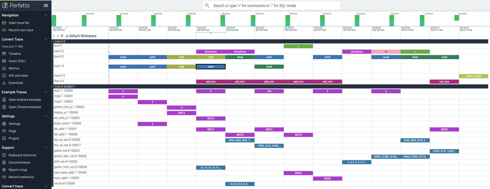
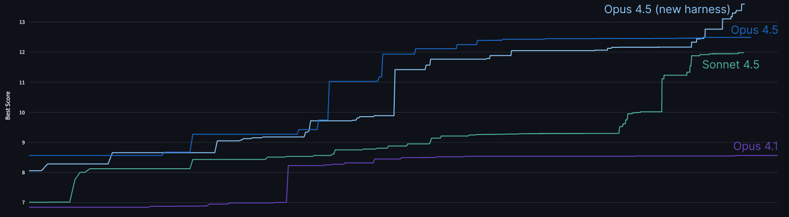

# 设计抗 AI 的技术评测（中英对照）

> **原文标题：** Designing AI-resistant technical evaluations
> **作者：** Tristan Hume（Anthropic 性能优化团队负责人）
> **原文链接：** https://www.anthropic.com/engineering/AI-resistant-technical-evaluations
> **发布日期：** 2026-01-21
> 排版：每段英文原文在前，中文翻译紧随其后。术语保留英文原文并附中文释义。

---

*Written by Tristan Hume, a lead on Anthropic's performance optimization team. Tristan designed—and redesigned—the take-home test that's helped Anthropic hire dozens of performance engineers.*

本文作者为 Tristan Hume，Anthropic 性能优化团队的负责人。Tristan 设计并反复重新设计了这份"居家作业"（take-home）测试，它帮助 Anthropic 招到了数十位性能工程师。

Evaluating technical candidates becomes harder as AI capabilities improve. A take-home that distinguishes well between human skill levels today may be trivially solved by models tomorrow—rendering it useless for evaluation.

随着 AI 能力的提升，评估技术候选人变得越来越难。今天能在人类技能水平之间做出良好区分的一道居家作业，明天可能就会被模型轻松解决——从而使其失去评估价值。

Since early 2024, our performance engineering team has used a take-home test where candidates optimize code for a simulated accelerator. Over 1,000 candidates have completed it, and dozens now work here, including engineers who brought up our Trainium cluster and shipped every model since Claude 3 Opus.

自 2024 年初以来，我们的性能工程团队一直使用一份居家作业测试，让候选人为一个模拟的加速器优化代码。已有超过 1,000 名候选人完成了它，其中数十人现在在这里工作，包括把我们的 Trainium 集群搭建起来、并发布了自 Claude 3 Opus 以来每一个模型的工程师们。

But each new Claude model has forced us to redesign the test. When given the same time limit, Claude Opus 4 outperformed most human applicants. That still allowed us to distinguish the strongest candidates—but then Claude Opus 4.5 matched even those. Humans can still outperform models when given unlimited time, but under the constraints of the take-home test, we no longer had a way to distinguish between the output of our top candidates and our most capable model.

但每一个新的 Claude 模型都迫使我们重新设计这份测试。在相同的时间限制下，Claude Opus 4 的表现超过了大多数人类申请者。这仍然让我们能够区分出最强的候选人——但随后 Claude Opus 4.5 连这些人也赶上了。在无时间限制的情况下，人类仍然可以胜过模型，但在居家作业测试的约束下，我们再也无法区分"顶尖候选人的产出"与"我们最强模型的产出"。

I've now iterated through three versions of our take-home in an attempt to ensure it still carries signal. Each time, I've learned something new about what makes evaluations robust to AI assistance and what doesn't.

我已经对我们的居家作业迭代了三个版本，试图确保它仍然携带信号（signal）。每一次，我都在"什么能让评测对 AI 辅助保持稳健、什么不能"上学到了新东西。

This post describes the original take-home design, how each Claude model defeated it, and the increasingly unusual approaches I've had to take to ensure our test stays ahead of our top model's capabilities. While the work we do has evolved alongside our models, we still need more strong engineers—just increasingly creative ways to find them.

这篇文章描述了原始居家作业的设计、每个 Claude 模型是如何击败它的，以及为了确保我们的测试始终领先于最强模型的能力，我不得不采取的越来越不寻常的方法。虽然我们所做的工作随着模型的演进而不断变化，但我们仍然需要更多优秀的工程师——只是需要越来越有创造力的方式来找到他们。

To that end, we're releasing the original take-home as an open challenge, since with unlimited time the best human performance still exceeds what Claude can achieve. If you can best Opus 4.5, we'd love to hear from you—details are at the bottom of this post.

为此，我们正在把原始的居家作业作为一项开放挑战（open challenge）发布，因为在无时间限制的情况下，最好的人类表现仍然超过 Claude 所能达到的水平。如果你能胜过 Opus 4.5，我们很乐意收到你的消息——详情见本文末尾。

# 居家作业的起源（The origin of the take-home）

In November 2023, we were preparing to train and launch Claude Opus 3. We'd secured new TPU and GPU clusters, our large Trainium cluster was coming, and we were spending considerably more than we had in the past on accelerators, but we didn't have enough performance engineers for our new scale. I [posted on Twitter](https://x.com/trishume/status/1730386529997238605?s=20) asking people to email us, which brought in more promising candidates than we could evaluate through our standard interview pipeline, a process that consumes significant time for staff and candidates

2023 年 11 月，我们正准备训练和发布 Claude Opus 3。我们已经拿下了新的 TPU 和 GPU 集群，我们的大型 Trainium 集群即将到位，我们在加速器上的投入比以往多得多，但以我们的新规模，我们没有足够的性能工程师。我[在 Twitter 上发了帖子](https://x.com/trishume/status/1730386529997238605?s=20)，请人们给我们发邮件，这带来了比我们通过标准面试流程所能评估的更多有潜力的候选人——那个流程对员工和候选人来说都消耗大量时间。

We needed a way to evaluate candidates more efficiently. So, I took two weeks to design a take-home test that could adequately capture the demands of the role and identify the most capable applicants.

我们需要一种更高效地评估候选人的方式。于是，我花了两周时间设计了一份居家作业测试，它能够充分捕捉这个岗位的要求，并识别出最有能力的申请者。

## 设计目标（Design goals）

Take-homes have a bad reputation. Usually they're filled with generic problems which engineers find boring, and which make for poor filters. My goal was different: create something genuinely engaging that would make candidates excited to participate and allow us to capture their technical skills at a high-level of resolution.

居家作业名声不好。通常它们充斥着工程师觉得无聊、也无法当好筛选器的通用问题。我的目标不同：创造一些真正引人入胜的东西，让候选人乐于参与，并让我们能够以高分辨率捕捉他们的技术技能。

The format also offers advantages over live interviews for evaluating performance engineering skills:

在评估性能工程技能方面，这种形式相比现场面试（live interview）还有一些优势：

**Longer time horizon:** Engineers rarely face deadlines of less than an hour when coding. A 4-hour window (later reduced to 2 hours) better reflects the actual nature of the job. It's still shorter than most real tasks, but we need to balance that with how onerous it is.

**更长的时间跨度（Longer time horizon）：**工程师在编码时很少面对不到一小时的截止期限。4 小时的窗口（后来缩短为 2 小时）更好地反映了这项工作的实际性质。它仍然比大多数真实任务短，但我们需要在这一点与它的繁重程度之间取得平衡。

**Realistic environment:** No one watching or expecting narration. Candidates work in their own editor without distraction.

**真实的环境（Realistic environment）：**没有人在一旁观看或期待讲解。候选人在自己的编辑器里工作，不受打扰。

**Time for comprehension and tooling:** Performance optimization requires understanding existing systems and sometimes building debugging tools. Both are hard to realistically evaluate in a normal 50 minute interview.

**有时间去理解和造工具（Time for comprehension and tooling）：**性能优化需要理解现有系统，有时还要构建调试工具。这两者在一次普通的 50 分钟面试中都很难被真实地评估。

**Compatibility with AI assistance:** Anthropic's [general candidate guidance](https://www.anthropic.com/candidate-ai-guidance) asks candidates to complete take-homes without AI unless indicated otherwise. For this take-home, we explicitly indicate otherwise.

**与 AI 辅助的兼容性（Compatibility with AI assistance）：**Anthropic 的[通用候选人指南](https://www.anthropic.com/candidate-ai-guidance)要求候选人除非另有说明，否则不用 AI 完成居家作业。对这份居家作业，我们明确说明"另有情况"。

Longer-horizon problems are harder for AI to solve completely, so candidates can use AI tools (as they would on the job) while still needing to demonstrate their own skills.

时间跨度更长的问题更难被 AI 完整解决，所以候选人可以使用 AI 工具（就像他们在工作中那样），同时仍然需要展示自己的技能。

Beyond these format-specific goals, I applied the same principles I use when designing any interview to make the take-home:

在这些形式特有的目标之外，我还运用了设计任何面试时都会用的原则来打造这份居家作业：

**Representative of real work:** The problem should give candidates a taste of what the job actually involves.

**代表真实工作（Representative of real work）：**问题应该让候选人尝到这份工作实际涉及什么的滋味。

**High signal:** The take-home should avoid problems that hinge on a single insight and ensure candidates have many chances to show their full abilities — leaving as little as possible to chance. It should also have a wide scoring distribution,and ensure enough depth that even strong candidates don't finish everything.

**高信号（High signal）：**居家作业应该避免那种依赖单个洞见的问题，确保候选人有很多机会展示全部能力——把偶然性降到最低。它还应该有宽广的分数分布，并确保足够的深度，让即使是很强的候选人也不可能全部完成。

**No specific domain knowledge:** People with good fundamentals can learn specifics on the job. Requiring narrow expertise unnecessarily limits the candidate pool.

**不需要特定领域知识（No specific domain knowledge）：**基础好的人可以在岗位上学习具体的知识。要求狭窄的专业知识会不必要地限制候选人池。

**Fun:** Fast development loops, interesting problems with depth, and room for creativity.

**有趣（Fun）：**快速的开发循环、有深度且有意思的问题，以及发挥创造力的空间。

## 模拟机器（The simulated machine）

I built a Python simulator for a fake accelerator with characteristics that resemble TPUs. Candidates optimize code running on this machine, using a hot-reloading [Perfetto](https://perfetto.dev/) trace that shows every instruction, similar to [the tooling we have on Trainium](https://awsdocs-neuron.readthedocs-hosted.com/en/latest/tools/neuron-explorer/overview-device-profiles.html).

我构建了一个 Python 模拟器，模拟一台特性类似 TPU 的假加速器。候选人优化在这台机器上运行的代码，使用一个热重载（hot-reloading）的 [Perfetto](https://perfetto.dev/) 追踪来显示每一条指令，这与[我们在 Trainium 上拥有的工具](https://awsdocs-neuron.readthedocs-hosted.com/en/latest/tools/neuron-explorer/overview-device-profiles.html)类似。

The machine includes features that make accelerator optimization interesting: manually managed scratchpad memory (unlike CPUs, accelerators often require explicit memory management), VLIW (multiple execution units running in parallel each cycle, requiring efficient instruction packing), SIMD (vector operations on many elements per instruction), and multicore (distributing work across cores).

这台机器包含一些让加速器优化变得有趣的特性：手动管理的暂存器内存（scratchpad memory，与 CPU 不同，加速器通常需要显式的内存管理）、VLIW（每个周期多个执行单元并行运行，要求高效的指令打包）、SIMD（每条指令对多个元素进行向量运算），以及多核（把工作分布到多个核心）。

The task is a parallel tree traversal, deliberately not deep learning flavored, since most performance engineers hadn't worked on deep learning yet and could learn domain specifics on the job. The problem was inspired by branchless SIMD decision tree inference, a classical ML optimization challenge as a nod to the past, which only a few candidates had encountered before.

任务是并行树遍历（parallel tree traversal），刻意不带深度学习的味道，因为大多数性能工程师当时还没做过深度学习，他们可以在岗位上学习领域细节。这个问题受到无分支 SIMD 决策树推理（branchless SIMD decision tree inference）的启发——一个经典的机器学习优化挑战，算是对过去的一种致意——只有少数候选人以前遇到过。

Candidates start with a fully serial implementation and progressively exploit the machine's parallelism. The warmup is multicore parallelism, then candidates choose whether to tackle SIMD vectorization or VLIW instruction packing. The original version also included a bug that candidates needed to debug first, exercising their ability to build tooling.

候选人从完全串行的实现开始，逐步利用机器的并行性。热身是多核并行，然后候选人选择是攻克 SIMD 向量化，还是 VLIW 指令打包。原始版本还包含一个候选人需要先调试的 bug，以锻炼他们构建工具的能力。

# 早期结果（Early results）

The initial take-home worked well. One person from the Twitter batch scored substantially higher than everyone else. He started in early February, two weeks after our first hires through the standard pipeline. The test proved predictive: He immediately began optimizing kernels and found a workaround for a launch-blocking compiler bug involving tensor indexing math overflowing 32 bits.

最初的居家作业效果很好。Twitter 那批人中，有一个人得分大幅高于其他所有人。他在 2 月初入职，比我们通过标准流程招到的第一批人晚了两周。事实证明这个测试具有预测力：他立刻开始优化内核，并为一个阻碍发布（launch-blocking）的编译器 bug 找到了绕行方案——那个 bug 涉及张量索引运算溢出 32 位。

Over the next year and a half, about 1,000 candidates completed the take-home, and it helped us hire most of our current performance engineering team. It proved especially valuable for candidates with limited experience on paper: several of our highest-performing engineers came directly from undergrad but showed enough skill on the take-home for us to hire confidently.

在接下来的一年半里，大约 1,000 名候选人完成了这份居家作业，它帮助我们招到了目前性能工程团队的大部分成员。它对"纸面经验有限"的候选人尤其有价值：我们几位表现最好的工程师直接来自本科，但他们在这份居家作业中展现了足够的技能，让我们有信心录用。

Feedback was positive. Many candidates worked past the 4-hour limit because they were enjoying themselves. The strongest unlimited-time submissions included full optimizing mini-compilers and several clever optimizations I hadn't anticipated.

反馈是积极的。许多候选人因为乐在其中，工作超过了 4 小时的上限。最强的无时间限制提交中，包含了完整的优化型迷你编译器，以及几个我没想到的巧妙优化。

## 然后 Claude Opus 4 击败了它（Then Claude Opus 4 defeated it）

By May 2025, Claude 3.7 Sonnet had already crept up to the point where over 50% of candidates would have been better off delegating to Claude Code entirely. I then tested a pre-release version of Claude Opus 4 on the take-home. It came up with a more optimized solution than almost all humans did within the 4-hour limit.

到 2025 年 5 月，Claude 3.7 Sonnet 已经悄悄爬升到这样一个程度：超过 50% 的候选人还不如完全把工作委托给 Claude Code。随后，我在居家作业上测试了一个预发布版本的 Claude Opus 4。在 4 小时的时间限制内，它得出了比几乎所有人类都更优化的解决方案。

This wasn't my first interview defeated by a Claude model. I'd designed a live interview question in 2023 specifically because our questions at the time were based around common tasks that early Claude models had lots of knowledge of and so could solve easily. I tried to design a question that required more problem solving skill than knowledge, still based on a real (but niche) problem I'd solved at work. Claude 3 Opus beat part 1 of that question; Claude 3.5 Sonnet beat part 2. We still use it because our other live questions aren't AI-resistant either.

这不是我第一次设计的面试被 Claude 模型击败。我在 2023 年专门设计了一道现场面试题，因为我们当时的问题都是围绕常见任务展开的，早期 Claude 模型对它们有大量知识储备，因而可以轻松解决。我试图设计一道更考验解题技巧而非知识的问题，仍然基于我在工作中解决过的一个真实（但小众）的问题。Claude 3 Opus 击败了那道题的第 1 部分；Claude 3.5 Sonnet 击败了第 2 部分。我们仍然在使用它，因为我们其他的现场面试题同样不抗 AI。

For the take-home, there was a straightforward fix. The problem had far more depth than anyone could explore in 4 hours, so I used Claude Opus 4 to identify where it started struggling. That became the new starting point for version 2. I wrote cleaner starter code, added new machine features for more depth, and removed multicore (which Claude had already solved, and which only slowed down development loops without adding signal).

对于居家作业，有一个直截了当的修复办法。这个问题有远超任何人能在 4 小时内探索完的深度，所以我用 Claude Opus 4 来找出它开始吃力的地方。那成了第 2 版的新起点。我写了更干净的起始代码，添加了新的机器特性以增加深度，并移除了多核（Claude 已经解决了它，而它只会拖慢开发循环，却不会增加信号）。

I also shortened the time limit from 4 hours to 2 hours. I'd originally chosen 4 hours based on candidate feedback preferring less risk of getting sunk if they got stuck for a bit on a bug or confusion, but the scheduling overhead was causing multi-week delays in our pipeline. Two hours is much easier to fit into a weekend.

我还把时间限制从 4 小时缩短到 2 小时。我最初选择 4 小时，是出于候选人反馈——他们更希望降低"在 bug 或困惑上卡一小会儿就沉没"的风险——但排期开销给我们的流程造成了长达数周的延迟。2 小时更容易塞进一个周末。

Version 2 emphasized clever optimization insights over debugging and code volume. It served us well—for several months.

第 2 版强调的是巧妙的优化洞见，而非调试和代码量。它为我们服务得很好——持续了几个月。

## 然后 Claude Opus 4.5 击败了它（Then Claude Opus 4.5 defeated that）

When I tested a pre-release Claude Opus 4.5 checkpoint, I watched Claude Code work on the problem for 2 hours, gradually improving its solution. It solved the initial bottlenecks, implemented all the common micro-optimizations, and met our passing threshold in under an hour.

当我测试一个预发布的 Claude Opus 4.5 检查点（checkpoint）时，我眼看着 Claude Code 在这个问题上工作了 2 小时，逐步改进它的解决方案。它解决了最初的瓶颈，实现了所有常见的微优化，并在不到一小时内达到了我们的通过阈值。

Then it stopped, convinced it had hit an insurmountable memory bandwidth bottleneck. Most humans reach the same conclusion. But there are clever tricks that exploit the problem structure to work around that bottleneck. When I told Claude the cycle count it was possible to achieve, it thought for a while and found the trick. It then debugged, tuned, and implemented further optimizations. By the 2-hour mark, its score matched the best human performance within that time limit—and that human had made heavy use of Claude 4 with steering.

然后它停了下来，确信自己遇到了一个无法逾越的内存带宽瓶颈。大多数人类也会得出同样的结论。但有一些巧妙的技巧可以利用问题结构来绕过那个瓶颈。当我告诉 Claude 可以达成的周期数时，它想了一会儿，找到了那个技巧。随后，它调试、调优，并实现了进一步的优化。到 2 小时节点时，它的分数追平了该时间限制内最好的人类表现——而那个人类还大量借助了带引导（steering）的 Claude 4。

We tried it out in our internal test-time compute harness for more rigor and confirmed it could both beat humans in 2 hours and continue climbing with time. Post-launch we even improved our harness in a generic way and got a higher score.

为了更严谨，我们在内部的测试时计算（test-time compute）harness 中尝试了它，确认它既能用 2 小时击败人类，又能随时间继续攀升。发布后，我们甚至以一种通用的方式改进了 harness，得到了更高的分数。

I had a problem. We were about to release a model where the best strategy on our take-home would be delegating to Claude Code.

我遇到了一个问题。我们即将发布一个模型，而在我们的居家作业上，最好的策略将是把工作委托给 Claude Code。

# 权衡各种选项（Considering the options）

Some colleagues suggested banning AI assistance. I didn't want to do this. Beyond the enforcement challenges, I had a sense that given people continue to play a vital role in our work, I should be able to figure out *some* way for them to distinguish themselves in a setting *with AI—*like they'd have on the job. I didn't want to give in yet to the [idea](https://metr.org/blog/2025-03-19-measuring-ai-ability-to-complete-long-tasks/) that humans only have an advantage on tasks longer than a few hours.

一些同事建议禁止 AI 辅助。我不想这么做。除了执行层面的挑战，我有一种感觉：既然人在我们的工作中仍然扮演着至关重要的角色，我应该能想出*某种*办法，让他们在*有 AI* 的环境里脱颖而出——就像他们在工作中那样。我还不想向这个[观点](https://metr.org/blog/2025-03-19-measuring-ai-ability-to-complete-long-tasks/)低头——即人类只在超过几小时的任务上才拥有优势。

Others suggested raising the bar to "substantially outperform what Claude Code achieves alone." The concern here was that Claude works fast. Humans typically spend half the 2 hours reading and understanding the problem before they start optimizing. A human trying to steer Claude would likely be constantly behind, understanding what Claude did only after the fact. The dominant strategy might become sitting back and watching.

另一些人建议把门槛提高到"大幅超越 Claude Code 单独取得的结果"。这里的担忧是 Claude 干活很快。人类通常会花掉 2 小时的一半来阅读和理解问题，然后才开始优化。一个试图引导 Claude 的人类很可能会一直落后，只能在事后理解 Claude 做了什么。占优策略可能变成"坐下来看"。

Nowadays performance engineers at Anthropic still have lots of work to do, but it looks more like tough debugging, systems design, performance analysis, figuring out how to verify the correctness of our systems, and figuring out how to make Claude's code simpler and more elegant. Unfortunately these things are tough to test in an objective way without a lot of time or common context. It's always been hard to design interviews that represent the job, but now it's harder than ever.

如今，Anthropic 的性能工程师仍有很多工作要做，但它看起来更像是艰难的调试、系统设计、性能分析、弄明白如何验证我们系统的正确性，以及弄明白如何让 Claude 的代码更简单、更优雅。遗憾的是，在没有大量时间或共同上下文的情况下，这些东西很难被客观地测试。设计能代表这份工作的面试一直很难，但现在比以往任何时候都难。

But I also worried if I invested in designing a new take-home, either Claude Opus 4.5 would solve that too, or it would become so challenging that it would be impossible for humans to complete in two hours.

但我也担心：如果我投入精力设计一份新的居家作业，要么 Claude Opus 4.5 会把那份也解决掉，要么它会变得太难，让人类不可能在 2 小时内完成。

## 尝试一：一个不同的优化问题（Attempt 1: A different optimization problem）

I realized Claude could help me implement whatever I designed quickly, which motivated me to try developing a harder take-home. I chose a problem based on one of the trickier kernel optimizations I'd done at Anthropic: an efficient data [transposition](https://en.wikipedia.org/wiki/Transpose) on 2D TPU registers while avoiding [bank conflicts](https://feldmann.nyc/blog/smem-microbenchmarks). I distilled it into a simpler problem on a simulated machine and had Claude implement the changes in under a day.

我意识到 Claude 能帮我快速实现我设计的任何东西，这激励我尝试开发一份更难的居家作业。我选择了一个基于我在 Anthropic 做过的最棘手的内核优化之一的问题：在 2D TPU 寄存器上进行高效的数据[转置](https://en.wikipedia.org/wiki/Transpose)，同时避免[存储体冲突](https://feldmann.nyc/blog/smem-microbenchmarks)（bank conflicts）。我把它提炼成模拟机器上的一个更简单的问题，并让 Claude 在不到一天的时间里实现了这些改动。

Claude Opus 4.5 found a great optimization I hadn't even thought of. Through careful analysis, it realized it could transpose the entire computation rather than figuring out how to transpose the data, and it rewrote the whole program accordingly.

Claude Opus 4.5 找到了一个我甚至没想到的绝妙优化。通过仔细分析，它意识到可以转置整个计算，而不是设法转置数据，于是它相应地重写了整个程序。

In my real case, this wouldn't have worked, so I patched the problem to remove that approach. Claude then made progress but couldn't find the most efficient solution. It seemed like I had my new problem, now I just had to hope human candidates could get it fast enough. But I had some nagging doubt, so I double-checked using Claude Code's "ultrathink" feature with longer thinking budgets ... and it solved it. It even knew the tricks for fixing bank conflicts.

在我真实的案例中，这个方法行不通，所以我修补了问题，移除了那条路径。Claude 随后取得了进展，但没能找到最高效的解决方案。看起来我有了新问题，现在只需要祈祷人类候选人能足够快地攻克它。但我总有些挥之不去的疑虑，于是我用 Claude Code 的 "ultrathink" 功能、配合更长的思考预算做了复核……结果它解决了。它甚至知道修复存储体冲突的技巧。

In hindsight, this wasn't the right problem to try. Engineers across many platforms have struggled with data transposition and bank conflicts, so Claude has substantial training data to draw on. While I'd found my solution from first principles, Claude could draw on a larger toolbox of experience.

事后看来，这不是一个值得尝试的正确问题。许多平台的工程师都在数据转置和存储体冲突上挣扎过，所以 Claude 有大量的训练数据可以借鉴。虽然我是从第一性原理找到我的解决方案的，但 Claude 可以借助一个更大的经验工具箱。

## 尝试二：走向更怪（Attempt 2: Going weirder）

I needed a problem where human reasoning could win over Claude's larger experience base: something sufficiently out of distribution. Unfortunately, this conflicted with my goal of being recognizably like the job.

我需要一个人类推理能胜过 Claude 更大经验库的问题：某种足够偏离分布（out of distribution）的东西。不幸的是，这与我的"一眼看上去就像本职工作"的目标相冲突。

I thought about the most unusual optimization problems I'd enjoyed and landed on [Zachtronics games](https://www.zachtronics.com/). These programming puzzle games use unusual, highly constrained instruction sets that force you to program in unconventional ways. For example, in [Shenzhen I/O](https://www.zachtronics.com/shenzhen-io/), programs are split across multiple communicating chips that each hold only about 10 instructions with one or two state registers. Clever optimization often involves encoding state into the instruction pointer or branch flags.

我想了想自己享受过的最不寻常的优化问题，落在了 [Zachtronics 游戏](https://www.zachtronics.com/)上。这些编程解谜游戏使用不寻常的、高度受限的指令集，迫使你以非常规的方式编程。例如，在 [Shenzhen I/O](https://www.zachtronics.com/shenzhen-io/) 中，程序被拆散到多个相互通信的芯片上，每个芯片只能容纳大约 10 条指令，配有一两个状态寄存器。巧妙的优化往往涉及把状态编码进指令指针或分支标志。

I designed a new take-home consisting of puzzles using a tiny, heavily constrained instruction set, optimizing solutions for minimal instruction count. I implemented one medium-hard puzzle and tested it on Claude Opus 4.5. It failed. I filled out more puzzles and had colleagues verify that people less steeped in the problem than me could still outperform Claude.

我设计了一份新的居家作业，由使用一个极小、高度受限指令集的谜题组成，目标是最小化解法的指令数量。我实现了一个中等难度的谜题，并在 Claude Opus 4.5 上测试。它失败了。我补充了更多谜题，并让同事验证：那些不像我这样浸淫在这个问题里的人，也能胜过 Claude。

Unlike Zachtronics games, I intentionally provided no visualization or debugging tools. The starter code only checks whether solutions are valid. Building debugging tools is part of what's being tested: you can either insert well-crafted print statements or ask a coding model to generate an interactive debugger in a few minutes. Judgment about how to invest in tooling is part of the signal.

与 Zachtronics 游戏不同，我刻意不提供任何可视化或调试工具。起始代码只检查解法是否有效。构建调试工具正是被测试的一部分：你可以插入精心设计的 print 语句，或者让编码模型在几分钟内生成一个交互式调试器。关于"如何在工具上投入"的判断本身就是信号的一部分。

I'm reasonably happy with the new take-home. It might have lower variance than the original because it comprises more independent sub-problems. Early results are promising: scores correlate well with the caliber of candidates' past work, and one of my most capable colleagues scored higher than any candidate so far.

我对新的居家作业还算满意。它的方差可能比原版更低，因为它由更多相互独立的子问题组成。早期结果很有希望：分数与候选人过往工作的水准有很好的相关性，而且我一位最有能力的同事的得分比迄今为止任何候选人都高。

I'm still sad to have given up the realism and varied depth of the original. But realism may be a luxury we no longer have. The original worked because it resembled real work. The replacement works because it simulates novel work.

我仍然为放弃原版的现实感和多样的深度而感到遗憾。但现实感可能是一种我们不再拥有的奢侈品。原版之所以有效，是因为它像真实的工作。替代版之所以有效，是因为它模拟的是新颖的工作。

# 一项开放挑战（An open challenge）

We're releasing the original take-home for anyone to try with unlimited time. Human experts [retain an advantage](https://metr.org/blog/2025-03-19-measuring-ai-ability-to-complete-long-tasks/) over current models at sufficiently long time horizons. The fastest human solution ever submitted substantially exceeds what Claude has achieved even with extensive test-time compute.

我们正在发布原始的居家作业，让任何人都可以在无时间限制的情况下尝试。人类专家在足够长的时间跨度上[仍然对当前模型保有优势](https://metr.org/blog/2025-03-19-measuring-ai-ability-to-complete-long-tasks/)。历史上提交过的最快人类解决方案，大幅超过了 Claude 即便借助大量测试时计算所取得的成果。

The released version starts from scratch (like version 1) but uses version 2's instruction set and single-core design, so cycle counts are comparable to version 2.

发布的版本从零开始（像第 1 版一样），但使用第 2 版的指令集和单核设计，因此周期数可与第 2 版比较。

Performance benchmarks (measured in clock cycles from the simulated machine):

性能基准（以模拟机器上的时钟周期为单位）：

- **2164 cycles**: Claude Opus 4 after many hours in the test-time compute harness
- **2164 周期**：Claude Opus 4 在测试时计算 harness 中运行多小时后
- **1790 cycles**: Claude Opus 4.5 in a casual Claude Code session, approximately matching the best human performance in 2 hours
- **1790 周期**：Claude Opus 4.5 在一次随意的 Claude Code 会话中，大约追平 2 小时内最好的人类表现
- **1579 cycles**: Claude Opus 4.5 after 2 hours in our test-time compute harness
- **1579 周期**：Claude Opus 4.5 在我们的测试时计算 harness 中运行 2 小时后
- **1548 cycles**: Claude Sonnet 4.5 after many more than 2 hours of test-time compute
- **1548 周期**：Claude Sonnet 4.5 进行远超 2 小时的测试时计算后
- **1487 cycles**: Claude Opus 4.5 after 11.5 hours in the harness
- **1487 周期**：Claude Opus 4.5 在 harness 中运行 11.5 小时后
- **1363 cycles**: Claude Opus 4.5 in an improved test time compute harness after many hours
- **1363 周期**：Claude Opus 4.5 在改进后的测试时计算 harness 中运行多小时后

[Download it on GitHub](https://github.com/anthropics/original_performance_takehome). If you optimize below 1487 cycles, beating Claude's best performance at launch, email us at [performance-recruiting@anthropic.com](mailto:performance-recruiting@anthropic.com) with your code and a resume.

[在 GitHub 上下载它](https://github.com/anthropics/original_performance_takehome)。如果你优化到 1487 周期以下，击败 Claude 在发布时的最佳表现，请把你的代码和一份简历发邮件到 [performance-recruiting@anthropic.com](mailto:performance-recruiting@anthropic.com)。

Or you can [apply through our typical process](https://www.anthropic.com/careers/jobs), which uses our (now) Claude-resistant take-home. We're curious how long it lasts.

或者你也可以[通过我们的常规流程申请](https://www.anthropic.com/careers/jobs)，它使用我们（现在）抗 Claude 的居家作业。我们很好奇它能撑多久。
