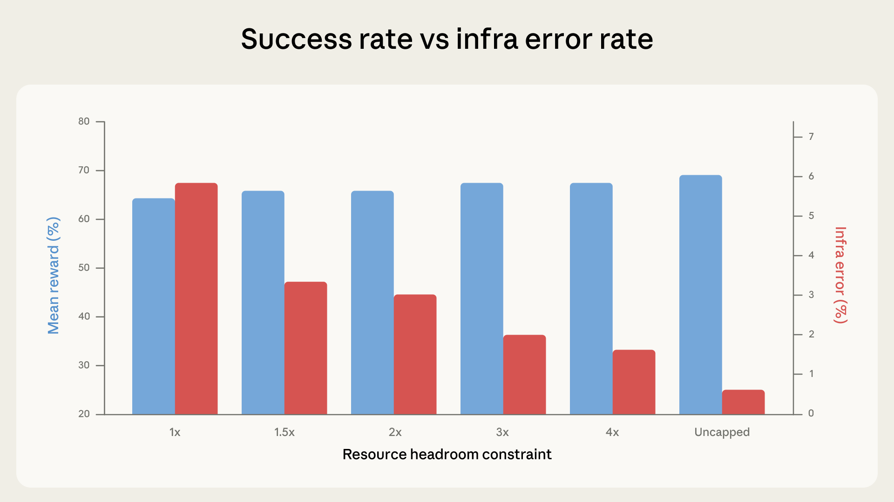

# 量化 Agent 编码评测中的基础设施噪声（中英对照）

> **原文标题：** Quantifying infrastructure noise in agentic coding evals
> **作者：** Gian Segato（Anthropic 工程团队）
> **原文链接：** https://www.anthropic.com/engineering/infrastructure-noise
> **发布日期：** 2026-02-05
> 排版：每段英文原文在前，中文翻译紧随其后。术语保留英文原文并附中文释义。

---

Agentic coding benchmarks like SWE-bench and Terminal-Bench are commonly used to compare the software engineering capabilities of frontier models—with top spots on leaderboards often separated by just a few percentage points. These scores are often treated as precise measurements of relative model capability and increasingly inform decisions about which models to deploy. However, we've found that infrastructure configuration alone can produce differences that exceed those margins. In internal experiments, the gap between the most- and least-resourced setups on Terminal-Bench 2.0 was 6 percentage points (p < 0.01).

像 SWE-bench 和 Terminal-Bench 这样的 Agent 编码基准测试，常被用来比较前沿模型的软件工程能力——排行榜上的头部名次往往只差几个百分点。这些分数常被当作模型相对能力的精确测量，并越来越多地影响"部署哪些模型"的决策。然而，我们发现，单是基础设施配置就能产生超出这些差距的差异。在内部实验中，Terminal-Bench 2.0 上资源最充足与最匮乏的配置之间，差距达到了 6 个百分点（p < 0.01）。

Static benchmarks score a model's output directly—the runtime environment doesn't factor into the result. Agentic coding evals are different: models are given a full environment where they write programs, run tests, install dependencies, and iterate over multiple turns. The runtime is no longer a passive container, but an integral component of the problem-solving process. Two agents with different resource budgets and time limits aren't taking the same test.

静态基准测试直接给模型的输出打分——运行时环境不会影响结果。Agent 编码评测则不同：模型被给予一个完整的环境，在那里编写程序、运行测试、安装依赖，并在多轮中迭代。运行时不再是一个被动的容器，而是解题过程的一个组成部分。资源预算和时间限制不同的两个 Agent，考的并不是同一场试。

Eval developers have begun accounting for this. Terminal-Bench 2.0, for instance, specifies recommended CPU and RAM on a per-task basis in their latest 2.0 release. However, specifying resources isn't the same as enforcing them consistently. Moreover, we discovered that enforcement methodology can change what the benchmark ends up actually measuring.

评测开发者已经开始考虑这一点。例如，Terminal-Bench 2.0 在其最新的 2.0 版本中，按任务指定了推荐的 CPU 和内存。然而，指定资源并不等同于一致地强制实施它们。此外，我们还发现，强制实施的方法论可以改变基准测试最终实际测量的东西。

# 我们是如何走到这一步的（How we got here）

We run Terminal-Bench 2.0 on a Google Kubernetes Engine cluster. While calibrating the setup, we noticed our scores didn't match the benchmark's official leaderboard, and infra error rates were surprisingly high: as many as 6% of tasks were failing because of pod errors, most of which were unrelated to the model's ability to solve the tasks.

我们在一个 Google Kubernetes Engine（GKE）集群上运行 Terminal-Bench 2.0。在校准配置时，我们注意到自己的分数与该基准测试的官方排行榜不一致，而且基础设施错误率高得惊人：多达 6% 的任务因为 pod 错误而失败，其中大部分与模型解题能力无关。

The discrepancy in scores came down to enforcement. Our Kubernetes implementation treated the per-task resource specs as both a floor and a hard ceiling: each container was guaranteed the specified resources but killed the moment it exceeded them. Container runtimes enforce resources via two separate parameters: a guaranteed allocation—the resources reserved up front—and a hard limit at which the container is killed. When these are set to the same value, there's zero headroom for transient spikes: a momentary memory fluctuation can OOM-kill a container that would otherwise have succeeded. To account for this, Terminal-Bench's leaderboard uses a different sandboxing provider, whose implementation is more lenient, allowing temporary overallocation without terminating the container in order to favor infrastructural stability.

分数的差异归结于强制实施（enforcement）方式。我们的 Kubernetes 实现把按任务的资源规格既当作下限（floor）、又当作硬性上限（hard ceiling）：每个容器都能保证获得指定资源，但一旦超出就会被杀死。容器运行时通过两个独立的参数来强制实施资源：一是保证分配（guaranteed allocation）——预先预留的资源；二是硬性限制（hard limit）——容器被杀死时的阈值。当这两者被设为相同值时，瞬态尖峰就毫无余量可言：一次短暂的内存波动就可能 OOM 杀死一个本来会成功的容器。为了解决这一点，Terminal-Bench 的排行榜使用了另一个沙箱提供商，其实现更宽松，允许暂时超量分配而不终止容器，以照顾基础设施的稳定性。

This finding raised a larger question: how much does resource configuration impact evaluation scores?

这一发现引出了一个更大的问题：资源配置对评测分数的影响有多大？

To quantify the effect of the scaffold, we ran Terminal-Bench 2.0 across six resource configurations, from strict enforcement of the per-task specs (1x), having them act as both floor and ceiling, to completely uncapped. Everything else stayed constant: same Claude model, same harness, same task set.

为了量化脚手架（scaffold）的影响，我们在六种资源配置下运行了 Terminal-Bench 2.0，从严格强制按任务规格（1x，既当下限又当上限），到完全不设上限。其他一切都保持不变：相同的 Claude 模型、相同的 harness、相同的任务集。

In our experiments, success rates increased with resource headroom. This was primarily driven by infra error rates dropping monotonically at each step, going from 5.8% at strict enforcement to 0.5% when uncapped. The drop between strict enforcement to 3x headroom (5.8% to 2.1%) was significant at p < 0.001. With more headroom, fewer containers get killed for exceeding their allocation.

在我们的实验中，成功率随资源余量（headroom）的增加而上升。这主要源于基础设施错误率在每一步都单调下降，从严格强制下的 5.8% 降到不设上限时的 0.5%。从严格强制到 3 倍余量之间的降幅（5.8% 到 2.1%）在 p < 0.001 水平上显著。余量越多，因超出分配而被杀死的容器就越少。

From 1x through 3x, success scores fluctuate within the margins of noise (p=0.40). Most of the tasks that were crashing at 1x would have failed regardless—which is something that we observed in the data. The agent explores, hits a resource wall, and gets preempted, but it was never on a path to a correct solution.

从 1x 到 3x，成功分数在噪声范围内波动（p=0.40）。在 1x 下崩溃的大部分任务，无论怎样都会失败——这是我们在数据中观察到的事实。Agent 进行探索，撞上资源之墙，然后被抢占（preempted），但它从来就没有走在通往正确答案的路上。

Starting around 3x, however, this trend changes: success rates climb faster than infra errors decline.

然而，大约从 3x 开始，这一趋势发生了变化：成功率的攀升快于基础设施错误的下降。

Between 3x to uncapped, infra errors drop an additional 1.6 percentage points, while success jumps almost 4 percentage points. The extra resources enable the agent to try approaches that only work with generous allocations, such as pulling in large dependencies, spawning expensive subprocesses, and running memory-intensive test suites. At uncapped resources, the total lift over 1x is +6 percentage points (p < 0.01). At the margins, tasks like `rstan-to-pystan` and `compile-compcert` significantly improve their success rates when getting memory headroom.

从 3x 到不设上限，基础设施错误又下降了 1.6 个百分点，而成功率跃升了近 4 个百分点。额外的资源让 Agent 能够尝试那些只有在大方分配下才奏效的方法，例如拉取大型依赖、启动昂贵的子进程，以及运行内存密集型的测试套件。在不设上限时，相对 1x 的总提升为 +6 个百分点（p < 0.01）。在边缘地带，像 `rstan-to-pystan` 和 `compile-compcert` 这样的任务，在获得内存余量时成功率显著提升。

# 这对测量有什么影响（How this affects measurement）

Up to roughly 3x Terminal-Bench specs, the additional resources fix infrastructure reliability problems, namely transient resource spikes. The sandboxing provider used by the Terminal-Bench maintainers is implicitly doing this behind the scenes; the eval gets more stable without getting easier.

在大约 3 倍 Terminal-Bench 规格以内，额外的资源修复的是基础设施可靠性问题，即瞬态资源尖峰。Terminal-Bench 维护者使用的沙箱提供商正在幕后隐式地做这件事：评测变得更稳定，却没有变得更简单。

Above the 3x mark, however, additional resources start actively helping the agent solve problems it couldn't solve before, which shows that limits can actually change what the eval measures. Tight limits inadvertently reward very efficient strategies, while generous limits are more forgiving and reward agents that can better exploit all available resources.

然而，在 3 倍这条线以上，额外的资源开始积极地帮助 Agent 解决它此前无法解决的问题，这表明限制实际上可以改变评测所衡量的东西。严格的限制无意中奖励了非常高效的策略，而宽松的限制则更宽容，奖励那些能更好地利用所有可用资源的 Agent。

An agent that writes lean, efficient code very fast will do well under tight constraints. An agent that brute-forces solutions with heavyweight tools will do well under generous ones. Both are legitimate things to test, but collapsing them into a single score without specifying the resource configuration makes the differences—and real-world generalizability—hard to interpret.

一个能以极快速度写出精简、高效代码的 Agent，在严格的约束下会表现出色。一个用重量级工具暴力求解的 Agent，在宽松的限制下会表现出色。两者都是值得测试的合法内容，但如果不指定资源配置、把它们折叠进单一分数，就会让这些差异——以及现实世界的可推广性——难以解读。

On `bn-fit-modify`, a Terminal-Bench task requiring Bayesian network fitting, some models' first move is to install the standard Python data science stack: `pandas`, `networkx`, `scikit-learn,` and all their toolchain. Under generous limits, this works. Under tight ones, the pod runs out of memory during installation, before the agent writes a single line of solution code. A leaner strategy exists (implementing the math from scratch using only the standard library), and some models do default to it. Others don't. Different models have different default approaches, and the resource configuration determines which of those approaches happen to succeed. We replicated the core finding across different Anthropic models. The direction of the effect was consistent, while the magnitude varied. The same trends seem to hold on models other than Claude, but we haven't rigorously tested them.

在 `bn-fit-modify` 这个需要贝叶斯网络拟合的 Terminal-Bench 任务上，一些模型的第一步是安装标准的 Python 数据科学技术栈：`pandas`、`networkx`、`scikit-learn` 以及它们的整套工具链。在宽松的限制下，这行得通。在严格的限制下，pod 会在安装过程中就耗尽内存——在 Agent 写出哪怕一行解题代码之前。存在一种更精简的策略（只用标准库从头实现这些数学计算），有些模型确实默认采用它，另一些则不会。不同的模型有不同的默认方法，而资源配置决定了其中哪些方法碰巧能够成功。我们在不同的 Anthropic 模型上复现了这一核心发现。效应的方向是一致的，而幅度各不相同。同样的趋势似乎也适用于 Claude 之外的模型，但我们没有对其进行严格测试。

We also tested whether this pattern holds on evals outside Terminal-Bench by running a crossover experiment on SWE-bench. We varied the total available RAM up to 5x the baseline across 227 problems with 10 samples each. The same effect held, though the magnitude was smaller: Scores again increased monotonically with RAM, but were only 1.54 percentage points higher at 5x than 1x. SWE-bench tasks are less resource-intensive, so a smaller effect is expected, but it shows resource allocation isn't neutral there either.

我们还在 Terminal-Bench 之外的评测上测试了这种模式是否成立，做法是在 SWE-bench 上运行了一个交叉实验。我们在 227 道题（每道 10 个样本）上把总可用内存最高提升到基线的 5 倍。同样的效应成立，只是幅度更小：分数再次随内存单调上升，但 5 倍时只比 1 倍时高 1.54 个百分点。SWE-bench 的任务资源密集度较低，所以更小的效应是意料之中的，但它表明资源分配在那里也不是中性的。

# 其他方差来源（Other sources of variance）

Resource allocation isn't the only hidden variable. In certain configurations, time limits too start playing a role.

资源分配并不是唯一的隐藏变量。在某些配置下，时间限制也开始发挥作用。

In principle, every element of the evaluation setup can influence the final score, from the cluster health to the hardware specs, from the concurrency level to even egress bandwidth. Agentic evals are end-to-end system tests by construction, and any component of that system can act as a confounder. We have observed anecdotally, for instance, that pass rates fluctuate with time of day, likely because API latency varies with traffic patterns and incidents. We have not formally quantified this effect, but it illustrates a larger point: the boundary between "model capability" and "infrastructure behavior" is blurrier than a single benchmark score suggests. A model provider can shield its eval infrastructure from this by dedicating hardware, but external evaluators can't easily do the same.

原则上，评测配置的每个元素都能影响最终分数，从集群健康状况到硬件规格，从并发级别甚至到出口带宽（egress bandwidth）。Agent 评测本质上就是端到端的系统测试，而该系统任何组件都可能成为混淆变量（confounder）。例如，我们曾轶事性地观察到，通过率会随一天中的时段波动，这很可能是因为 API 延迟会随流量模式和故障事件而变化。我们还没有正式量化这一效应，但它说明了一个更大的观点："模型能力"与"基础设施行为"之间的边界，比单一基准分数所暗示的要模糊得多。模型提供商可以通过专用硬件来让评测基础设施免受这种影响，但外部评估者很难做到同样的事。

Public benchmarks are typically meant to measure pure model capabilities, but in practice they risk conflating them with infrastructure quirks. Sometimes this may be desirable, as it enables end-to-end testing of the entire stack, but more often it's not. For coding evals meant to be shared publicly, running at multiple times and on multiple days would help average out the noise.

公共基准测试通常旨在测量纯粹的模型能力，但在实践中，它们有把模型能力与基础设施怪癖混为一谈的风险。有时这可能是可取的，因为它能够对整个技术栈进行端到端测试，但更多时候并非如此。对于旨在公开发布的编码评测，在多个时段、多天运行会有所帮助，能够把噪声平均掉。

# 我们的建议（What we recommend）

The ideal scenario is to run each eval under the exact same hardware conditions—both the scaffold running the eval and the inference stack—as it would ensure perfect reproducibility across the board. However, this may not always be practical.

理想的场景是在完全相同的硬件条件下运行每个评测——包括运行评测的脚手架和推理栈——因为这将确保全面的完美可复现性。然而，这并不总是切实可行。

Given how container runtimes actually enforce resources—via a guaranteed allocation and a separate hard kill threshold—we recommend that evals specify both parameters per task, not a single pinned value. A single exact spec sets the guaranteed allocation equal to the kill threshold, leaving zero margin: the transient memory spikes we documented at 1x are enough to destabilize the eval. Separating the two parameters lets you give containers enough breathing room to avoid spurious OOM kills, while still enforcing a hard ceiling that prevents score inflation.

鉴于容器运行时实际强制执行资源的方式——通过保证分配和一个独立的硬性杀死阈值——我们建议评测为每个任务指定这两个参数，而不是一个单一固定的值。单一的精确规格会把保证分配设为等于杀死阈值，从而留下零余量：我们在 1x 下记录到的瞬态内存尖峰足以让评测不稳定。把两个参数分开，可以给容器足够的喘息空间来避免虚假的 OOM 杀死，同时仍然强制执行一个硬性上限，防止分数虚高（score inflation）。

The band between them should be calibrated so that scores at the floor and ceiling fall within noise of each other. For instance, in Terminal-Bench 2.0, a 3x ceiling over the per-task specs cut infra error rates by roughly two-thirds (5.8% to 2.1%, p < 0.001) while keeping the score lift modest and well within noise (p = 0.40). That's a reasonable tradeoff: the infrastructure confounder is largely neutralized without removing meaningful resource pressure. The exact multiplier will vary by benchmark and task distribution, and should thus be reported, but the empirical calibration principle is general.

两者之间的带宽（band）应该被校准，使得在上下限处的分数彼此落在噪声范围内。例如，在 Terminal-Bench 2.0 中，把上限设为按任务规格的 3 倍，把基础设施错误率降低了大约三分之二（5.8% 到 2.1%，p < 0.001），同时让分数提升保持在适度的水平、且完全落在噪声之内（p = 0.40）。这是一个合理的取舍：基础设施混淆变量在很大程度上被中和，同时没有消除有意义的资源压力。具体的倍数会因基准测试和任务分布而异，因此应该被报告出来，但经验校准的原则是通用的。

# 我们为什么在意（Why we care）

These findings have practical consequences beyond eval infrastructure. Benchmark scores are increasingly used as decision-making inputs, but this increased attention (and reliance) hasn't always come with corresponding rigor in how they're run or reported. As things stand today, a 2-point lead on a leaderboard might reflect a genuine capability difference, or it might reflect that one eval ran on beefier hardware, or even at a luckier time of day, or both. Without published (or standardized) setup configurations, it's hard to tell from the outside unless interested parties go the extra mile to reproduce objective results under identical conditions.

这些发现的影响超出了评测基础设施本身。基准分数越来越多地被用作决策输入，但这种日益增长的关注（和依赖）并不总是伴随着运行或报告方式上的相应严谨性。就现状而言，排行榜上领先 2 分可能反映了真实的能力差异，也可能反映了某个评测运行在更强大的硬件上、甚至赶上了更幸运的时段，或者两者兼有。如果没有公开（或标准化）的配置说明，外部人员很难分辨——除非相关方额外付出努力，在相同条件下复现客观结果。

For labs like Anthropic, the implication is that resource configuration for agentic evals should be treated as a first-class experimental variable, documented and controlled with the same rigor as prompt format or sampling temperature. For benchmark maintainers, publishing recommended resource specs (as Terminal-Bench 2.0 does) can go a long way, while specifying enforcement methodology would close the gap we identified. And for anyone consuming benchmark results, the core takeaway is that small score differences on agentic evals carry more uncertainty than the precision of the reported numbers suggests—especially as some confounders are simply too hard to control for.

对于像 Anthropic 这样的实验室，其含义是：Agent 评测的资源配置应该被当作一等实验变量（first-class experimental variable）来对待，以与提示格式或采样温度相同的严谨性进行记录和控制。对于基准测试维护者，发布推荐的资源规格（像 Terminal-Bench 2.0 那样）能起到很大作用，而指定强制实施方法论则会弥合我们发现的缺口。对于任何消费基准结果的人，核心要点是：Agent 评测上的微小分数差异所携带的不确定性，比所报告数字的精度所暗示的更大——尤其因为有些混淆变量根本难以控制。

Until resource methodology is standardized, our data suggests that leaderboard differences below 3 percentage points deserve skepticism until the eval configuration is documented and matched. The observed spread across the moderate range of resource configurations in Terminal-Bench is just below 2 percentage points. Naive binomial confidence intervals already span 1-2 percentage points; the infrastructure confounders we document here stack on top of that, not within it. At the extremes of the allocation range, the spread reaches 6.

在资源方法论标准化之前，我们的数据表明：在评测配置被记录并匹配之前，低于 3 个百分点的排行榜差异都值得怀疑。在 Terminal-Bench 中观察到的、跨越中等资源配置范围的离散度刚好低于 2 个百分点。朴素的二项式置信区间已经横跨 1-2 个百分点；我们在这里记录的基础设施混淆变量是叠加在其之上的，而不是包含在其之内。在分配范围的两个极端，离散度达到了 6。

A few-point lead might signal a real capability gap—or it might just be a bigger VM.

领先几分可能意味着真实的能力差距——也可能只是因为那个评测跑在更大的虚拟机上。

## 致谢（Acknowledgements）

Written by Gian Segato. Special thanks to Nicholas Carlini, Jeremy Hadfield, Mike Merrill, and Alex Shaw for their contributions. This work reflects the collective efforts of several teams working on evaluations for coding agents. Interested candidates who would like to contribute are welcome to apply at [anthropic.com/careers](http://anthropic.com/careers).

本文作者为 Gian Segato。特别感谢 Nicholas Carlini、Jeremy Hadfield、Mike Merrill 和 Alex Shaw 的贡献。这项工作反映了多个从事编码 Agent 评测的团队的集体努力。有意参与的研究者欢迎前往 [anthropic.com/careers](http://anthropic.com/careers) 申请。
