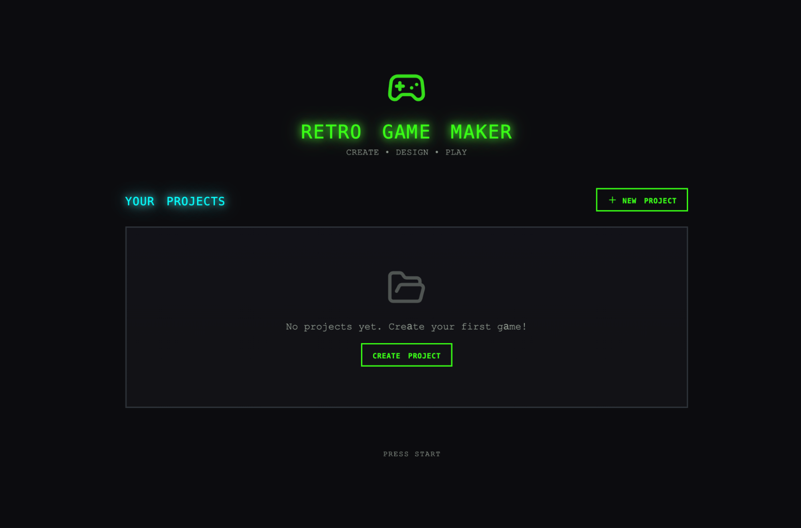
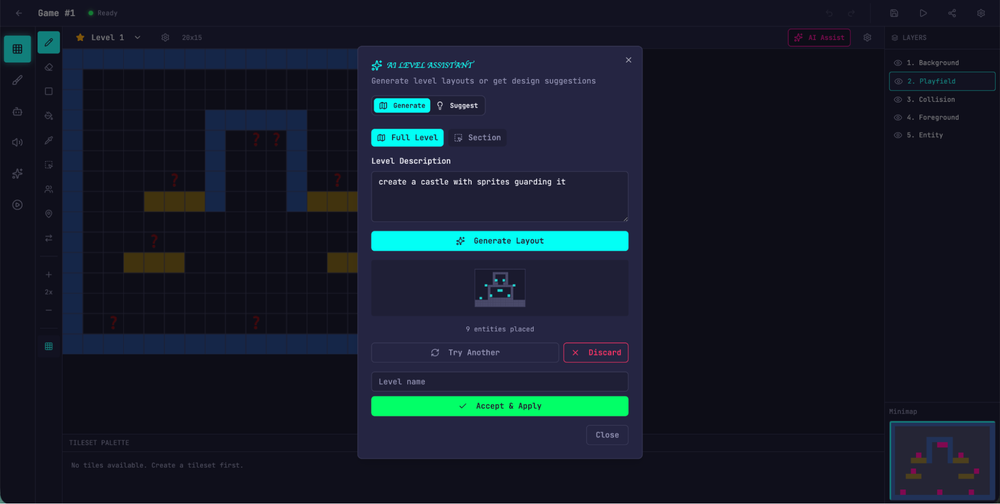

# 面向长时运行应用开发的 Harness 设计（中英对照）

> **原文标题：** Harness design for long-running application development
> **作者：** Prithvi Rajasekaran（Anthropic Labs 团队成员）
> **原文链接：** https://www.anthropic.com/engineering/harness-design-long-running-apps
> **发布日期：** 2026-03-24
> 排版：每段英文原文在前，中文翻译紧随其后。术语保留英文原文并附中文释义。

---

*Written by Prithvi Rajasekaran, a member of our [Labs](https://www.anthropic.com/news/introducing-anthropic-labs) team.*

本文作者为 Prithvi Rajasekaran，我们 [Labs](https://www.anthropic.com/news/introducing-anthropic-labs) 团队的一员。

Over the past several months I've been working on two interconnected problems: getting Claude to produce high-quality frontend designs, and getting it to build complete applications without human intervention. This work originated with earlier efforts on our [frontend design skill](https://github.com/anthropics/claude-code/blob/main/plugins/frontend-design/skills/frontend-design/SKILL.md) and [long-running coding agent harness](https://www.anthropic.com/engineering/effective-harnesses-for-long-running-agents), where my colleagues and I were able to improve Claude's performance well above baseline through prompt engineering and harness design—but both eventually hit ceilings.

在过去的几个月里，我一直在研究两个相互关联的问题：让 Claude 产出高质量的前端设计，以及让它在无需人工干预的情况下构建完整的应用。这项工作源于我们此前的两个成果——我们的[前端设计技能](https://github.com/anthropics/claude-code/blob/main/plugins/frontend-design/skills/frontend-design/SKILL.md)和[长时运行编码 Agent harness](https://www.anthropic.com/engineering/effective-harnesses-for-long-running-agents)。在这些工作中，我和同事们通过提示词工程与 harness 设计，把 Claude 的表现提升到了远高于基线的水平——但两者最终都碰到了天花板。

To break through, I sought out novel AI engineering approaches that held across two quite different domains, one defined by subjective taste, the other by verifiable correctness and usability. Taking inspiration from [Generative Adversarial Networks](https://en.wikipedia.org/wiki/Generative_adversarial_network) (GANs), I designed a multi-agent structure with a **generator** and **evaluator** agent. Building an evaluator that graded outputs reliably—and with taste—meant first developing a set of criteria that could turn subjective judgments like "is this design good?" into concrete, gradable terms.

为了突破天花板，我寻找能够横跨两个截然不同领域的全新 AI 工程方法——一个领域由主观品味定义，另一个由可验证的正确性与可用性定义。我借鉴[生成对抗网络](https://en.wikipedia.org/wiki/Generative_adversarial_network)（GAN）的灵感，设计了一个多 Agent 结构，包含**生成器**（generator）和**评估器**（evaluator）两个 Agent。要构建一个既能可靠打分、又有品味的评估器，首先需要开发一套标准，把"这个设计好不好？"之类的主观判断，转化成具体、可打分的术语。

I then applied these techniques to long-running autonomous coding, carrying over two lessons from our earlier harness work: decomposing the build into tractable chunks, and using structured artifacts to hand off context between sessions. The final result was a three-agent architecture—planner, generator, and evaluator—that produced rich full-stack applications over multi-hour autonomous coding sessions.

随后，我把这些技术应用到长时运行的自主编码上，并带上了我们早期 harness 工作中的两条经验：把构建任务分解成易于处理的小块，以及使用结构化产物（structured artifacts）在会话之间交接上下文。最终成果是一个三 Agent 架构——规划器（planner）、生成器与评估器——能够在长达数小时的自主编码会话中产出丰富的全栈应用。

# 为什么朴素的实现会落空（Why naive implementations fall short）

We've previously shown that harness design has a substantial impact on the effectiveness of long running agentic coding. In an earlier [experiment](https://www.anthropic.com/engineering/effective-harnesses-for-long-running-agents), we used an initializer agent to decompose a product spec into a task list, and a coding agent that implemented the tasks one feature at a time before handing off artifacts to carry context across sessions. The broader developer community has converged on similar insights, with approaches like the "[Ralph Wiggum](https://ghuntley.com/ralph/)" method using hooks or scripts to keep agents in continuous iteration cycles.

我们之前已经证明，harness 设计对长时运行 Agent 编码的有效性有重大影响。在更早的[实验中](https://www.anthropic.com/engineering/effective-harnesses-for-long-running-agents)，我们使用一个初始化器（initializer）Agent 把产品规格（product spec）分解成任务清单，再由一个编码 Agent 一次实现一个功能，然后交接产物以跨会话携带上下文。更广泛的开发者社区也得出了类似的见解，例如"[Ralph Wiggum](https://ghuntley.com/ralph/)"方法就利用钩子（hooks）或脚本来让 Agent 保持在持续的迭代循环中。

But some problems remained persistent. For more complex tasks, the agent still tends to go off the rails over time. While decomposing this issue, we observed two common failure modes with agents executing these sorts of tasks.

但有些问题始终存在。对于更复杂的任务，Agent 仍会随着时间推移而偏离轨道。在拆解这个问题时，我们观察到执行这类任务的 Agent 有两个常见的失败模式。

First is that models tend to lose coherence on lengthy tasks as the context window fills (see our post on [context engineering](https://www.anthropic.com/engineering/effective-context-engineering-for-ai-agents)). Some models also exhibit "context anxiety," in which they begin wrapping up work prematurely as they approach what they believe is their context limit. Context resets—clearing the context window entirely and starting a fresh agent, combined with a structured handoff that carries the previous agent's state and the next steps—addresses both these issues.

首先是：随着上下文窗口逐渐填满，模型在冗长任务上往往失去连贯性（见我们关于[上下文工程](https://www.anthropic.com/engineering/effective-context-engineering-for-ai-agents)的文章）。一些模型还会表现出"上下文焦虑"（context anxiety），即当它们接近自认为的上下文上限时，会过早地收尾工作。上下文重置（context reset）——完全清空上下文窗口、启动一个全新的 Agent，并配合一个携带前一个 Agent 状态与后续步骤的结构化交接——可以同时解决这两个问题。

This differs from compaction, where earlier parts of the conversation are summarized in place so the same agent can keep going on a shortened history. While compaction preserves continuity, it doesn't give the agent a clean slate, which means context anxiety can still persist. A reset provides a clean slate, at the cost of the handoff artifact having enough state for the next agent to pick up the work cleanly. In our earlier testing, we found Claude Sonnet 4.5 exhibited context anxiety strongly enough that compaction alone wasn't sufficient to enable strong long task performance, so context resets became essential to the harness design. This solves the core issue, but adds orchestration complexity, token overhead, and latency to each harness run.

这与压缩（compaction）不同：压缩是在原地总结对话早期部分，让同一个 Agent 能够在缩短的历史上继续运行。压缩保留了连续性，但没有给 Agent 一个干净的起点，这意味着上下文焦虑仍然可能持续。重置提供了干净的起点，代价是交接产物必须携带足够的状态，让下一个 Agent 能干净地接续工作。在我们早期的测试中，我们发现 Claude Sonnet 4.5 的上下文焦虑表现得足够强烈，仅靠压缩不足以支撑强劲的长任务表现，因此上下文重置成了 harness 设计的关键。这解决了核心问题，但也给每次 harness 运行增加了编排复杂度、令牌开销和延迟。

A second issue, which we haven't previously addressed, is self-evaluation. When asked to evaluate work they've produced, agents tend to respond by confidently praising the work—even when, to a human observer, the quality is obviously mediocre. This problem is particularly pronounced for subjective tasks like design, where there is no binary check equivalent to a verifiable software test. Whether a layout feels polished or generic is a judgment call, and agents reliably skew positive when grading their own work.

第二个问题——我们之前没有讨论过——是自我评估（self-evaluation）。当被要求评估自己产出的工作时，Agent 往往会自信地夸赞这些工作——即使在人类观察者看来，质量明显平庸。这个问题在像设计这样的主观任务中尤为突出，因为这里没有与可验证软件测试等价的是非判断。一个布局是显得精致还是普通，这属于主观判断，而 Agent 在给自己的作品打分时总会偏向正面。

However, even on tasks that do have verifiable outcomes, agents still sometimes exhibit poor judgment that impedes their performance while completing the task. Separating the agent doing the work from the agent judging it proves to be a strong lever to address this issue. The separation doesn't immediately eliminate that leniency on its own; the evaluator is still an LLM that is inclined to be generous towards LLM-generated outputs. But tuning a standalone evaluator to be skeptical turns out to be far more tractable than making a generator critical of its own work, and once that external feedback exists, the generator has something concrete to iterate against.

然而，即使在那些确实具有可验证结果的任务上，Agent 有时也会表现出糟糕的判断力，从而在完成任务的过程中阻碍其表现。把"做工作的 Agent"与"评判工作的 Agent"分离开来，被证明是解决这个问题的一个有力杠杆。这种分离本身并不会立即消除那种宽容；评估器仍然是一个倾向于对 LLM 生成的输出慷慨的 LLM。但事实证明，把一个独立的评估器调校得怀疑苛刻，远比让一个生成器对自己的工作吹毛求疵要容易处理得多；而且一旦这种外部反馈存在，生成器就有了可以具体迭代的对象。

# 前端设计：让主观质量可打分（Frontend design: making subjective quality gradable）

I started by experimenting on frontend design, where the self-evaluation issue was most visible. Absent any intervention, Claude normally gravitates toward safe, predictable layouts that are technically functional but visually unremarkable.

我先从前端设计入手做实验，因为那里自我评估的问题最为明显。在没有任何干预的情况下，Claude 通常会倾向于安全、可预测的布局——技术上可用，但视觉上平淡无奇。

Two insights shaped the harness I built for frontend design. First, while aesthetics can't be fully reduced to a score—and individual tastes will always vary—they can be improved with grading criteria that encode design principles and preferences. "Is this design beautiful?" is hard to answer consistently, but "does this follow our principles for good design?" gives Claude something concrete to grade against. Second, by separating frontend generation from frontend grading, we can create a feedback loop that drives the generator toward stronger outputs.

两个洞见塑造了我为前端设计构建的 harness。第一，虽然美学无法被完全化约为一个分数——而且个人品味永远会有所不同——但可以通过编码了设计原则与偏好的评分标准来改进它们。"这个设计美吗？"很难一致地回答，但"这个设计遵循了我们关于好设计的原则吗？"则给了 Claude 一个具体的评分对象。第二，通过把前端生成与前端评分分离开来，我们可以创造一个反馈循环，驱动生成器产出更强大的输出。

With this in mind, I wrote four grading criteria that I gave to both the generator and evaluator agents in their prompts:

带着这个想法，我写了四条评分标准，并把它们同时提供给生成器和评估器 Agent 的提示词：

- **Design quality:** Does the design feel like a coherent whole rather than a collection of parts? Strong work here means the colors, typography, layout, imagery, and other details combine to create a distinct mood and identity.
- **设计质量（Design quality）：**这个设计是感觉像一个连贯的整体，还是一堆零部件的集合？在这方面做得好，意味着颜色、排版、布局、图像和其他细节共同营造出一种独特的气质与身份认同。

- **Originality:** Is there evidence of custom decisions, or is this template layouts, library defaults, and AI-generated patterns? A human designer should recognize deliberate creative choices. Unmodified stock components—or telltale signs of AI generation like purple gradients over white cards—fail here.
- **原创性（Originality）：**是否有定制决策的痕迹，还是只是模板布局、库的默认值和 AI 生成的套路？人类设计师应当能认出有意的创造性选择。未经修改的现成组件——或者像"白色卡片上的紫色渐变"这类 AI 生成的明显标志——在这里都会不及格。

- **Craft:** Technical execution: typography hierarchy, spacing consistency, color harmony, contrast ratios. This is a competence check rather than a creativity check. Most reasonable implementations do fine here by default; failing means broken fundamentals.
- **工艺（Craft）：**技术执行层面：排版层级、间距一致性、色彩和谐、对比度。这是一次能力检查，而非创造力检查。大多数合理的实现默认在这里表现不错；失败意味着基本功不扎实。

- **Functionality:** Usability independent of aesthetics. Can users understand what the interface does, find primary actions, and complete tasks without guessing?
- **功能性（Functionality）：**独立于美学的可用性。用户能否理解这个界面的用途、找到主要操作，并在不需要猜测的情况下完成任务？

I emphasized design quality and originality over craft and functionality. Claude already scored well on craft and functionality by default, as the required technical competence tended to come naturally to the model. But on design and originality, Claude often produced outputs that were bland at best. The criteria explicitly penalized highly generic "AI slop" patterns, and by weighting design and originality more heavily it pushed the model toward more aesthetic risk-taking.

我把设计质量和原创性的权重放在工艺和功能性之上。Claude 在工艺和功能性上默认就得分不错，因为所需的技术能力往往自然而然地来自模型。但在设计与原创性上，Claude 产出的东西往往顶多算是平淡。这些标准明确惩罚高度通用的"AI 垃圾"（AI slop）套路，而且通过加大设计与原创性的权重，推动模型在美学上更多地冒险。

I calibrated the evaluator using few-shot examples with detailed score breakdowns. This ensured the evaluator's judgment aligned with my preferences, and reduced score drift across iterations.

我用带有详细分数分解的少样本（few-shot）示例来校准评估器。这确保了评估器的判断与我的偏好一致，并减少了各轮迭代之间的分数漂移。

I built the loop on the [Claude Agent SDK](https://platform.claude.com/docs/en/agent-sdk/overview), which kept the orchestration straightforward. A generator agent first created an HTML/CSS/JS frontend based on a user prompt. I gave the evaluator the Playwright MCP, which let it interact with the live page directly before scoring each criterion and writing a detailed critique. In practice, the evaluator would navigate the page on its own, screenshotting and carefully studying the implementation before producing its assessment. That feedback flowed back to the generator as input for the next iteration. I ran 5 to 15 iterations per generation, with each iteration typically pushing the generator in a more distinctive direction as it responded to the evaluator's critique. Because the evaluator was actively navigating the page rather than scoring a static screenshot, each cycle took real wall-clock time. Full runs stretched up to four hours. I also instructed the generator to make a strategic decision after each evaluation: refine the current direction if scores were trending well, or pivot to an entirely different aesthetic if the approach wasn't working.

我在 [Claude Agent SDK](https://platform.claude.com/docs/en/agent-sdk/overview) 之上构建了这个循环，它让编排保持简单直接。生成器 Agent 首先根据用户提示创建一份 HTML/CSS/JS 前端。我给了评估器 Playwright MCP，让它能够在给每条标准打分、写详细评论之前，直接与实时页面交互。在实践中，评估器会自行浏览页面、截图、仔细研究实现，然后才给出评估。这些反馈作为下一轮迭代的输入流回给生成器。我每次生成运行 5 到 15 轮迭代，每轮迭代通常会推动生成器朝着更有辨识度的方向前进，因为它要回应评估器的批评。由于评估器是主动浏览页面，而不是给静态截图打分，每一轮都消耗真实的时间。完整运行最长可达四个小时。我还指示生成器在每次评估后做出战略性决定：如果分数趋势良好就细化当前方向，如果方法不奏效就转向一种完全不同的美学。

Across runs, the evaluator's assessments improved over iterations before plateauing, with headroom still remaining. Some generations refined incrementally. Others took sharp aesthetic turns between iterations.

跨多次运行时，评估器的评分会随着迭代而改善，然后趋于平稳，仍有提升空间。有些生成是渐进式细化的。另一些则在迭代之间发生了剧烈的美学转向。

The wording of the criteria steered the generator in ways I didn't fully anticipate. Including phrases like "the best designs are museum quality" pushed designs toward a particular visual convergence, suggesting that the prompting associated with the criteria directly shaped the character of the output.

这些标准的措辞以我没有完全预料到的方式引导了生成器。加入诸如"最好的设计要有博物馆品质"这样的措辞，会把设计推向某种特定的视觉趋同，这说明与标准相关的提示措辞直接塑造了输出的气质。

While scores generally improved over iterations, the pattern was not always cleanly linear. Later implementations tended to be better as a whole, but I regularly saw cases where I preferred a middle iteration over the last one. Implementation complexity also tended to increase across rounds, with the generator reaching for more ambitious solutions in response to the evaluator's feedback. Even on the first iteration, outputs were noticeably better than a baseline with no prompting at all, suggesting the criteria and associated language themselves steered the model away from generic defaults before any evaluator feedback led to further refinement.

虽然分数总体上会随迭代改善，但这种模式并不总是干净的线性。后面的实现整体上往往更好，但我经常遇到"我更喜欢中间某轮迭代而不是最后一轮"的情况。实现复杂度也倾向于随着轮次增加而上升，因为生成器会为了回应评估器的反馈而追求更雄心勃勃的解决方案。即便在第一轮迭代，输出也明显好于完全没有提示的基线，这说明这些标准及其相关措辞本身就已经把模型从通用默认值上引开了，其后评估器的反馈才带来了进一步的细化。

In one notable example, I prompted the model to create a website for a Dutch art museum. By the ninth iteration, it had produced a clean, dark-themed landing page for a fictional museum. The page was visually polished but largely in line with my expectations. Then, on the tenth cycle, it scrapped the approach entirely and reimagined the site as a spatial experience: a 3D room with a checkered floor rendered in CSS perspective, artwork hung on the walls in free-form positions, and doorway-based navigation between gallery rooms instead of scroll or click. It was the kind of creative leap that I hadn't seen before from a single-pass generation.

有一个值得注意的例子：我让模型为一个荷兰艺术博物馆创建网站。到第九轮迭代时，它已经为一家虚构的博物馆产出了一个干净、深色主题的落地页。这个页面在视觉上很精致，但大体符合我的预期。然后，在第十轮时，它彻底抛弃了原来的方法，把网站重新想象成一种空间体验：一个用 CSS 透视渲染的、带棋盘格地板的三维房间，画作以自由形式挂在墙上，画廊房间之间用"门洞"而非滚动或点击来导航。这是我在单次生成中从未见过的创造性飞跃。

📹 视频演示（Video demo）：[前端设计迭代演示（荷兰博物馆示例）](https://cdn.sanity.io/files/4zrzovbb/website/9877febd34432f7f582aecd0023b951223605c6a.mp4)

# 扩展到全栈编码（Scaling to full-stack coding）

With these findings in hand, I applied this GAN-inspired pattern to full-stack development. The generator-evaluator loop maps naturally onto the software development lifecycle, where code review and QA serve the same structural role as the design evaluator.

带着这些发现，我把这种受 GAN 启发的模式应用到了全栈开发中。生成器-评估器循环自然而然地映射到软件开发生命周期上——在那里，代码审查和 QA 扮演着与设计评估器相同的结构性角色。

## 架构（The architecture）

In our earlier [long-running harness](https://www.anthropic.com/engineering/effective-harnesses-for-long-running-agents), we had solved for coherent multi-session coding with an initializer agent, a coding agent that worked one feature at a time, and context resets between sessions. Context resets were a key unlock: the harness used Sonnet 4.5, which exhibited the "context anxiety" tendency mentioned earlier. Creating a harness that worked well across context resets was key to keeping the model on task. Opus 4.5 largely removed that behavior on its own, so I was able to drop context resets from this harness entirely. The agents were run as one continuous session across the whole build, with the [Claude Agent SDK](https://platform.claude.com/docs/en/agent-sdk/overview)'s automatic compaction handling context growth along the way.

在我们更早的[长时运行 harness](https://www.anthropic.com/engineering/effective-harnesses-for-long-running-agents)中，我们用初始化器 Agent、一次处理一个功能的编码 Agent，以及会话之间的上下文重置，解决了多会话编码的连贯性问题。上下文重置是一个关键解锁点：那个 harness 使用的是 Sonnet 4.5，它表现出前面提到的"上下文焦虑"倾向。创建一个能在上下文重置之间良好工作的 harness，是让模型保持在任务上的关键。Opus 4.5 在很大程度上自己消除了这种行为，所以我可以完全从当前这个 harness 中拿掉上下文重置。整个构建过程中，各 Agent 作为一个连续的会话运行，由 [Claude Agent SDK](https://platform.claude.com/docs/en/agent-sdk/overview) 的自动压缩来沿途处理上下文的增长。

For this work I built on the foundation from the original harness with a three-agent system, with each agent addressing a specific gap I'd observed in prior runs. The system contained the following agent personas:

这项工作我在原 harness 的基础上，构建了一个三 Agent 系统，每个 Agent 都针对我在先前运行中观察到的某个具体缺口。该系统包含以下 Agent 角色：

**Planner:** Our previous long-running harness required the user to provide a detailed spec upfront. I wanted to automate that step, so I created a planner agent that took a simple 1-4 sentence prompt and expanded it into a full product spec. I prompted it to be ambitious about scope and to stay focused on product context and high level technical design rather than detailed technical implementation. This emphasis was due to the concern that if the planner tried to specify granular technical details upfront and got something wrong, the errors in the spec would cascade into the downstream implementation. It seemed smarter to constrain the agents on the deliverables to be produced and let them figure out the path as they worked. I also asked the planner to find opportunities to weave AI features into the product specs. (See example in the Appendix at the bottom.)

**规划器（Planner）：**我们之前的长时运行 harness 要求用户事先提供详细的规格。我想自动化这一步，所以我创建了一个规划器 Agent，它接受一段 1-4 句话的提示，把它扩展成完整的产品规格。我提示它在范围上要雄心勃勃，并把注意力集中在产品上下文和高层技术设计上，而不是详细的技术实现。这种强调是因为我担心：如果规划器试图事先指定细粒度的技术细节、却搞错了什么，规格中的错误就会级联到下游的实现中。更明智的做法似乎是：在要产出的交付物上约束 Agent，让它们边做边自己摸索路径。我还要求规划器寻找把 AI 功能编织进产品规格的机会。（见文末附录中的示例。）

**Generator:** The one-feature-at-a-time approach from the earlier harness worked well for scope management. I applied a similar model here, instructing the generator to work in sprints, picking up one feature at a time from the spec. Each sprint implemented the app with a React, Vite, FastAPI, and SQLite (later PostgreSQL) stack, and the generator was instructed to self-evaluate its work at the end of each sprint before handing off to QA. It also had git for version control.

**生成器（Generator）：**早期 harness 中"一次一个功能"的方法在范围管理上效果很好。我在这里也采用了类似的模式，指示生成器以冲刺（sprint）为单位工作，一次从规格中挑一个功能。每个冲刺用 React、Vite、FastAPI 和 SQLite（后来换成 PostgreSQL）技术栈来实现应用，并且生成器被要求在每次冲刺结束时自我评估其工作，然后再移交给 QA。它还使用 git 进行版本控制。

**Evaluator:** Applications from earlier harnesses often looked impressive but still had real bugs when you actually tried to use them. To catch these, the evaluator used the Playwright MCP to click through the running application the way a user would, testing UI features, API endpoints, and database states. It then graded each sprint against both the bugs it had found and a set of criteria modeled on the frontend experiment, adapted here to cover product depth, functionality, visual design, and code quality. Each criterion had a hard threshold, and if any one fell below it, the sprint failed and the generator got detailed feedback on what went wrong. Before each sprint, the generator and evaluator negotiated a sprint contract: agreeing on what "done" looked like for that chunk of work before any code was written. This existed because the product spec was intentionally high-level, and I wanted a step to bridge the gap between user stories and testable implementation. The generator proposed what it would build and how success would be verified, and the evaluator reviewed that proposal to make sure the generator was building the right thing. The two iterated until they agreed.

**评估器（Evaluator）：**早期 harness 构建的应用看起来往往令人印象深刻，但当你真正去使用它们时，还是会有真实的 bug。为了抓住这些 bug，评估器使用 Playwright MCP，像用户那样点击运行中的应用，测试 UI 功能、API 端点和数据库状态。然后，它根据发现的 bug 和一组以前端实验为蓝本的标准，对每个冲刺打分，这些标准在这里被改编为涵盖产品深度、功能性、视觉设计和代码质量。每条标准都有一个硬性阈值，只要有一条低于它，该冲刺就失败，生成器会得到关于哪里出了问题的详细反馈。在每个冲刺开始前，生成器和评估器会协商一份冲刺契约（sprint contract）：在写任何代码之前，就"这段工作做到什么样子才算完成"达成一致。这个环节之所以存在，是因为产品规格有意保持在高层次，而我希望有一个步骤来弥合用户故事（user stories）与可测试实现之间的鸿沟。生成器提出它将要构建什么、成功将如何被验证，评估器审查该提议，确保生成器在构建正确的东西。两者反复迭代，直到达成一致。

Communication was handled via files: one agent would write a file, another agent would read it and respond either within that file or with a new file that the previous agent would read in turn. The generator then built against the agreed-upon contract before handing the work off to QA. This kept the work faithful to the spec without over-specifying implementation too early.

沟通通过文件来完成：一个 Agent 写一个文件，另一个 Agent 读取它，并在这个文件里回复，或者用前一个 Agent 会再读取的新文件来回复。随后，生成器按照双方同意的契约进行构建，再把工作移交给 QA。这让工作既忠实于规格，又不会过早地过度指定实现细节。

## 运行 harness（Running the harness）

For the first version of this harness, I used Claude Opus 4.5, running user prompts against both the full harness and a single-agent system for comparison. I used Opus 4.5 since this was our best coding model when I began these experiments.

对于这个 harness 的第一个版本，我使用了 Claude Opus 4.5，让用户提示同时跑在完整 harness 和单 Agent 系统上以作对比。我选择 Opus 4.5，因为在我开始这些实验时它是我方最好的编码模型。

I wrote the following prompt to generate a retro video game maker:

我写了下面这段提示词来生成一个复古视频游戏制作工具：

> *Create a 2D retro game maker with features including a level editor, sprite editor, entity behaviors, and a playable test mode.*
> *创建一个 2D 复古游戏制作工具，功能包括关卡编辑器、精灵（sprite）编辑器、实体行为，以及可玩的测试模式。*

The table below shows the harness type, length it ran for, and the total cost.

下表显示了 harness 类型、运行时长和总成本。

| Harness（harness 类型） | Duration（时长） | Cost（成本） |
| --- | --- | --- |
| Solo（单 Agent） | 20 min（20 分钟） | $9 |
| Full harness（完整 harness） | 6 hr（6 小时） | $200 |

The harness was over 20x more expensive, but the difference in output quality was immediately apparent.

完整 harness 的成本高出 20 多倍，但输出质量的差异立竿见影。

I was expecting an interface where I could construct a level and its component parts (sprites, entities, tile layout) then hit play to actually play the level. I started by opening the solo run's output, and the initial application seemed in line with those expectations.

我期望的是一个这样的界面：我能构建一个关卡及其组成部分（精灵、实体、瓦片布局），然后点击"播放"来真正游玩这个关卡。我先打开了单 Agent 运行的输出，最初的应用似乎符合这些预期。

As I clicked through, however, issues started to emerge. The layout wasted space, with fixed-height panels leaving most of the viewport empty. The workflow was rigid. Trying to populate a level prompted me to create sprites and entities first, but nothing in the UI guided me toward that sequence. More to the point, the actual game was broken. My entities appeared on screen but nothing responded to input. Digging into the code revealed that the wiring between entity definitions and the game runtime was broken, with no surface indication of where.

然而，随着我逐项点击，问题开始浮现。布局浪费了空间，固定高度的面板让视口大部分区域空着。工作流很僵化。试图填充一个关卡时，它会提示我先创建精灵和实体，但界面上没有任何东西引导我走向这个顺序。更要命的是，实际游戏是坏的。我的实体出现在屏幕上，但没有任何东西响应输入。深入代码后发现，实体定义与游戏运行时之间的连接是断开的，而且表面上没有任何迹象显示断点在哪里。



> Initial screen when opening the app created by the solo harness.
> 打开单 Agent（solo）harness 构建的应用时的初始画面。


> Creating a sprite in the sprite editor made by the solo harness.
> 在单 Agent harness 构建的精灵编辑器中创建精灵。


> Trying unsuccessfully to play the level I created.
> 尝试游玩我创建的关卡，但失败了。

After evaluating the solo run, I turned my attention to the harness run. This run started from the same one-sentence prompt, but the planner step expanded that prompt into a 16-feature spec spread across ten sprints. It went well beyond what the solo run attempted. In addition to the core editors and play mode, the spec called for a sprite animation system, behavior templates, sound effects and music, an AI-assisted sprite generator and level designer, and game export with shareable links. I gave the planner access to our [frontend design skill](https://github.com/anthropics/claude-code/blob/main/plugins/frontend-design/skills/frontend-design/SKILL.md), which it read and used to create a visual design language for the app as part of the spec. For each sprint, the generator and evaluator negotiated a contract defining the specific implementation details for the sprint, and the testable behaviors that would be tested to verify completion.

评估完单 Agent 运行后，我把注意力转向了 harness 运行。这次运行始于同一句提示词，但规划器步骤把这句话扩展成了一份横跨十个冲刺、包含 16 个功能的规格。它远远超出了单 Agent 运行的尝试范围。除了核心编辑器和播放模式外，规格还要求精灵动画系统、行为模板、音效与音乐、AI 辅助的精灵生成器和关卡设计器，以及带可分享链接的游戏导出。我给了规划器访问我们[前端设计技能](https://github.com/anthropics/claude-code/blob/main/plugins/frontend-design/skills/frontend-design/SKILL.md)的权限，它读取并利用该技能，为应用创建了一套视觉设计语言，作为规格的一部分。对于每个冲刺，生成器和评估器协商一份契约，定义该冲刺的具体实现细节，以及将被测试以验证完成度的可测试行为。

The app immediately showed more polish and smoothness than the solo run. The canvas used the full viewport, the panels were sized sensibly, and the interface had a consistent visual identity that tracked the design direction from the spec. Some of the clunkiness I'd seen in the solo run did remain—the workflow still didn't make it clear that you should build sprites and entities before trying to populate a level, and I had to figure that out by poking around. This read as a gap in the base model's product intuition rather than something the harness was designed to address, though it did suggest a place where targeted iteration inside the harness could help to further improve output quality.

这个应用立即显示出比单 Agent 运行更多的精致与流畅。画布使用了完整的视口，面板尺寸合理，界面有着一致的视觉身份，跟随规格中的设计方向。我在单 Agent 运行中看到的一些笨拙仍然存在——工作流仍然没有说明你应该先构建精灵和实体、再尝试填充关卡，我不得不通过四处摸索才弄明白。这更像是基础模型产品直觉上的一个缺口，而非 harness 设计要去解决的问题，尽管它确实提示了一个可以借助 harness 内部针对性迭代来进一步改善输出质量的地方。

Working through the editors, the new run's advantages over solo became more apparent. The sprite editor was richer and more fully featured, with cleaner tool palettes, a better color picker, and more usable zoom controls.

逐一试用编辑器时，新运行相比单 Agent 的优势变得更加明显。精灵编辑器更丰富、功能更全，拥有更整洁的工具面板、更好的取色器，以及更好用的缩放控制。

Because I'd asked the planner to weave AI features into its specs, the app also came with a built-in Claude integration that let me generate different parts of the game through prompting. This significantly sped up the workflow.

因为我要求规划器把 AI 功能编织进规格，这个应用还自带一个内置的 Claude 集成，让我可以通过提示来生成游戏的不同部分。这大大加快了工作流。


> Initial screen: Creating a new game, in the app built with the full harness.
> 初始画面：在使用完整 harness 构建的应用中创建新游戏。


> The sprite editor felt cleaner and easier to use.
> 完整 harness 的精灵编辑器感觉更干净、更好用。



> Using the built-in AI feature to generate the level.
> 使用内置 AI 功能生成关卡。


> Using the built-in AI feature to generate the level.
> 使用内置 AI 功能生成关卡（续）。


> Playing the game I generated.
> 游玩我生成的游戏。

The biggest difference was in play mode. I was actually able to move my entity and play the game. The physics had some rough edges—my character jumped onto a platform but ended up overlapping with it, which felt intuitively wrong—but the core thing worked, which the solo run did not manage. After moving around a bit, I did hit some limitations with the AI's game level construction. There was a large wall that I wasn't able to jump past, so I was stuck. This suggested there were some common sense improvements and edge cases that the harness could handle to further refine the app.

最大的差异体现在播放模式上。我确实能够让我的实体移动并游玩游戏。物理有些粗糙的地方——我的角色跳上平台后最终与平台重叠，这在直觉上感觉不对——但核心功能是工作的，而单 Agent 运行没能做到。在移动了一小会儿之后，我确实遇到了 AI 游戏关卡构建的一些限制。有一堵大墙我跳不过去，于是被卡住了。这表明存在一些常识性改进和边界情况，harness 可以处理它们来进一步优化这个应用。

Reading through the logs, it was clear that the evaluator kept the implementation in line with the spec. Each sprint, it walked through the sprint contract's test criteria and exercised the running application through Playwright, filing bugs against anything that diverged from expected behavior. The contracts were granular—Sprint 3 alone had 27 criteria covering the level editor—and the evaluator's findings were specific enough to act on without extra investigation. The table below shows several examples of issues our evaluator identified:

通读日志后，可以清楚地看到评估器让实现始终与规格保持一致。每个冲刺，它都会逐项核对冲刺契约的测试标准，通过 Playwright 实际运行应用，对任何偏离预期行为的现象提交 bug。这些契约非常细——仅冲刺 3 就有覆盖关卡编辑器的 27 条标准——而且评估器的发现足够具体，无需额外调查即可采取行动。下表展示了我们的评估器发现的几个问题示例：

| 契约标准（Contract criterion） | 评估器发现（Evaluator finding） |
| --- | --- |
| Rectangle fill tool allows click-drag to fill a rectangular area with selected tile（矩形填充工具允许点击-拖动以用所选瓦片填充矩形区域） | **FAIL（失败）** — Tool only places tiles at drag start/end points instead of filling the region. `fillRectangle` function exists but isn't triggered properly on mouseUp.（工具只在拖动起点/终点放置瓦片，而没有填充整个区域。`fillRectangle` 函数存在，但在 mouseUp 时没有被正确触发。） |
| User can select and delete placed entity spawn points（用户可以选择并删除已放置的实体出生点） | **FAIL（失败）** — Delete key handler at `LevelEditor.tsx:892` requires both `selection` and `selectedEntityId` to be set, but clicking an entity only sets `selectedEntityId`. Condition should be `selection || (selectedEntityId && activeLayer === 'entity')`.（`LevelEditor.tsx:892` 的删除键处理程序要求同时设置 `selection` 和 `selectedEntityId`，但点击实体只设置了 `selectedEntityId`。条件应为 `selection || (selectedEntityId && activeLayer === 'entity')`。） |
| User can reorder animation frames via API（用户可以通过 API 对动画帧重新排序） | **FAIL（失败）** — `PUT /frames/reorder` route defined after `/{frame_id}` routes. FastAPI matches 'reorder' as a frame_id integer and returns 422: "unable to parse string as an integer."（`PUT /frames/reorder` 路由定义在 `/{frame_id}` 路由之后。FastAPI 把 'reorder' 当作 frame_id 整数匹配，返回 422："unable to parse string as an integer."） |

Getting the evaluator to perform at this level took work. Out of the box, Claude is a poor QA agent. In early runs, I watched it identify legitimate issues, then talk itself into deciding they weren't a big deal and approve the work anyway. It also tended to test superficially, rather than probing edge cases, so more subtle bugs often slipped through. The tuning loop was to read the evaluator's logs, find examples where its judgment diverged from mine, and update the QA's prompt to solve for those issues. It took several rounds of this development loop before the evaluator was grading in a way that I found reasonable. Even then, the harness output showed the limits of the model's QAing capabilities: small layout issues, interactions that felt unintuitive in places, and undiscovered bugs in more deeply nested features that the evaluator hadn't exercised thoroughly. There was clearly more verification headroom to capture with further tuning. But compared to the solo run, where the central feature of the application simply didn't work, the lift was obvious.

让评估器达到这种水准需要付出努力。开箱即用的 Claude 是一个糟糕的 QA Agent。在早期运行中，我眼看着它识别出合理的问题，然后说服自己这些问题不是什么大事，最终还是批准了工作。它还倾向于只做表面测试，而不是深挖边界情况，所以更隐蔽的 bug 常常溜过去。调优循环是：阅读评估器的日志，找出它的判断与我分歧的例子，更新 QA 的提示词来解决这些问题。经过好几轮这样的开发循环，评估器才以我觉得合理的方式进行打分。即便如此，harness 的输出仍然显示了模型 QA 能力的极限：小的布局问题、某些地方感觉不直观的交互，以及更深层嵌套功能中评估器没有彻底测试到的未发现 bug。显然还有更多的验证空间可以通过进一步调优来挖掘。但与单 Agent 运行——其中应用的核心功能根本不工作——相比，提升是显而易见的。

## 迭代 harness（Iterating on the harness）

The first set of harness results was encouraging, but it was also bulky, slow, and expensive. The logical next step was to find ways to simplify the harness without degrading its performance. This was partly common sense and partly a function of a more general principle: every component in a harness encodes an assumption about what the model can't do on its own, and those assumptions are worth stress testing, both because they may be incorrect, and because they can quickly go stale as models improve. Our blog post [Building Effective Agents](https://www.anthropic.com/research/building-effective-agents) frames the underlying idea as "find the simplest solution possible, and only increase complexity when needed," and it's a pattern that shows up consistently for anyone maintaining an agent harness.

第一批 harness 结果是令人鼓舞的，但它也笨重、缓慢且昂贵。合乎逻辑的下一步是找到在不损害其性能的前提下简化 harness 的方法。这既部分出于常识，部分也源于一个更普遍的原则：harness 中的每个组件都编码了一个关于"模型无法独立完成什么"的假设，而这些假设值得进行压力测试——既因为它们可能是错误的，也因为它们会随着模型改进而迅速过时。我们的博客文章 [Building Effective Agents](https://www.anthropic.com/research/building-effective-agents) 把这一底层思想概括为"找到最简单的可行方案，只在需要时增加复杂度"，这是一个对任何维护 Agent harness 的人来说都始终出现的模式。

In my first attempt to simplify, I cut the harness back radically and tried a few creative new ideas, but I wasn't able to replicate the performance of the original. It also became difficult to tell which pieces of the harness design were actually load-bearing, and in what ways. Based on that experience, I moved to a more methodical approach, removing one component at a time and reviewing what impact it had on the final result.

在我第一次简化尝试中，我大幅砍掉了 harness，并尝试了一些有创意的新想法，但我无法复现原版的性能。而且也很难说清 harness 设计中哪些部分真正是承重的（load-bearing）、以何种方式承重。基于那次经验，我转向了一种更有条理的方法：一次移除一个组件，并审视它对最终结果的影响。

As I was going through these iteration cycles, we also released Opus 4.6, which provided further motivation to reduce harness complexity. There was good reason to expect 4.6 would need less scaffolding than 4.5 did. From our [launch blog:](https://www.anthropic.com/news/claude-opus-4-6) "[Opus 4.6] plans more carefully, sustains agentic tasks for longer, can operate more reliably in larger codebases, and has better code review and debugging skills to catch its own mistakes." It also improved substantially on long-context retrieval. These were all capabilities the harness had been built to supplement.

在经历这些迭代循环的同时，我们还发布了 Opus 4.6，这为降低 harness 复杂度提供了进一步的动力。我们有充分理由预期 4.6 需要的脚手架比 4.5 更少。根据我们的[发布博客](https://www.anthropic.com/news/claude-opus-4-6)："[Opus 4.6] 计划得更仔细，能更长久地维持 Agent 任务，能在更大的代码库中更可靠地运行，并有更好的代码审查和调试技能来发现自己的错误。"它在长上下文检索方面也有大幅改进。这些都是 harness 当初被构建出来去补充的能力。

## 移除冲刺机制（Removing the sprint construct）

I started by removing the sprint construct entirely. The sprint structure had helped to decompose work into chunks for the model to work coherently. Given the improvements in Opus 4.6, there was good reason to believe that the model could natively handle the job without this sort of decomposition.

我首先完全移除了冲刺机制。冲刺结构曾帮助把工作分解成小块，让模型能够连贯地工作。鉴于 Opus 4.6 的改进，我们有充分理由相信模型可以不借助这种分解，原生地处理这项工作。

I kept both the planner and evaluator, as each continued to add obvious value. Without the planner, the generator under-scoped: given the raw prompt, it would start building without first speccing its work, and end up creating a less feature-rich application than the planner did.

我保留了规划器和评估器，因为两者都继续带来明显的价值。没有规划器，生成器就会范围不足：面对原始提示，它会不先规格化自己的工作就直接开始构建，最终产出的应用功能丰富度不如有规划器时。

With the sprint construct removed, I moved the evaluator to a single pass at the end of the run rather than grading per sprint. Since the model was much more capable, it changed how load-bearing the evaluator was for certain runs, with its usefulness depending on where the task sat relative to what the model could do reliably on its own. On 4.5, that boundary was close: our builds were at the edge of what the generator could do well solo, and the evaluator caught meaningful issues across the build. On 4.6, the model's raw capability increased, so the boundary moved outward. Tasks that used to need the evaluator's check to be implemented coherently were now often within what the generator handled well on its own, and for tasks within that boundary, the evaluator became unnecessary overhead. But for the parts of the build that were still at the edge of the generator's capabilities, the evaluator continued to give real lift.

移除冲刺机制后，我把评估器改为在运行结束时做一次整体评估，而不是按冲刺打分。由于模型的能力强了很多，这改变了评估器在特定运行中的承重程度——它的有用性取决于任务相对"模型能独立可靠完成的范围"落在哪里。在 4.5 上，这条边界很近：我们的构建恰好处于生成器单独就能做好的边缘，评估器在整次构建中捕获了有意义的错误。在 4.6 上，模型的原始能力提升了，所以边界向外移动。过去需要评估器检查才能连贯实现的任务，现在往往落在生成器自己就能处理好的范围内；对于落在这个范围内的任务，评估器就成了不必要的开销。但对于构建中仍然处于生成器能力边缘的部分，评估器仍然带来了实实在在的提升。

The practical implication is that the evaluator is not a fixed yes-or-no decision. It is worth the cost when the task sits beyond what the current model does reliably solo.

实际含义是：评估器不是一个固定的是/否决定。当任务超出了当前模型能单独可靠完成的范围时，它才值得这个成本。

Alongside the structural simplification, I also added prompting to improve how the harness built AI features into each app, specifically getting the generator to build a proper agent that could drive the app's own functionality through tools. That took real iteration, since the relevant knowledge is recent enough that Claude's training data covers it thinly. But with enough tuning, the generator was building agents correctly.

在结构简化的同时，我还增加了提示词，以改进 harness 把 AI 功能构建进每个应用的方式——具体来说，是让生成器构建一个合适的 Agent，能够通过工具驱动应用自身的功能。这需要真正的迭代，因为相关知识足够新，Claude 的训练数据对它的覆盖很薄。但经过足够的调优，生成器已经能够正确地构建 Agent。

## 更新后 harness 的结果（Results from the updated harness）

To put the updated harness to the test, I used the following prompt to generate a Digital Audio Workstation (DAW), a music production program for composing, recording, and mixing songs:

为了测试更新后的 harness，我使用下面这段提示词来生成一个数字音频工作站（Digital Audio Workstation，DAW）——一个用于作曲、录音和混音的音乐制作程序：

> *Build a fully featured DAW in the browser using the Web Audio API.*
> *使用 Web Audio API 在浏览器中构建一个功能齐全的 DAW。*

The run was still lengthy and expensive, at about 4 hours and $124 in token costs.

这次运行仍然漫长而昂贵，大约 4 小时、124 美元的令牌成本。

Most of the time went to the builder, which ran coherently for over two hours without the sprint decomposition that Opus 4.5 had needed.

大部分时间花在了构建者（builder）上，它没有借助 Opus 4.5 所需的冲刺分解，就连贯地运行了两个多小时。

| Agent & Phase（Agent 与阶段） | Duration（时长） | Cost（成本） |
| --- | --- | --- |
| Planner（规划器） | 4.7 min（4.7 分钟） | $0.46 |
| Build (Round 1)（构建·第 1 轮） | 2 hr 7 min（2 小时 7 分钟） | $71.08 |
| QA (Round 1)（QA·第 1 轮） | 8.8 min（8.8 分钟） | $3.24 |
| Build (Round 2)（构建·第 2 轮） | 1 hr 2 min（1 小时 2 分钟） | $36.89 |
| QA (Round 2)（QA·第 2 轮） | 6.8 min（6.8 分钟） | $3.09 |
| Build (Round 3)（构建·第 3 轮） | 10.9 min（10.9 分钟） | $5.88 |
| QA (Round 3)（QA·第 3 轮） | 9.6 min（9.6 分钟） | $4.06 |
| **Total V2 Harness（V2 harness 合计）** | **3 hr 50 min（3 小时 50 分钟）** | **$124.70** |

As with the previous harness, the planner expanded the one-line prompt into a full spec. From the logs, I could see the generator model did a good job planning the app and the agent design, wiring the agent up, and testing it before handing off to QA.

与之前的 harness 一样，规划器把一行提示扩展成完整的规格。从日志中，我可以看到生成器模型在规划应用和 Agent 设计、把 Agent 连接起来、以及在移交 QA 之前进行测试方面都做得很好。

That being said, the QA agent still caught real gaps. In its first-round feedback, it noted:

话虽如此，QA Agent 仍然捕获了真实的缺口。在其第一轮反馈中，它指出：

> This is a strong app with excellent design fidelity, solid AI agent, and good backend. The main failure point is Feature Completeness — while the app looks impressive and the AI integration works well, several core DAW features are display-only without interactive depth: clips can't be dragged/moved on the timeline, there are no instrument UI panels (synth knobs, drum pads), and no visual effect editors (EQ curves, compressor meters). These aren't edge cases — they're the core interactions that make a DAW usable, and the spec explicitly calls for them.
> 这是一个很强的应用，设计保真度出色、AI Agent 扎实、后端良好。主要失败点是功能完整性（Feature Completeness）——虽然应用看起来令人印象深刻、AI 集成也运行良好，但几个核心 DAW 功能只是"只显示、无交互深度"：片段（clips）无法在时间线上拖拽/移动，没有乐器 UI 面板（合成器旋钮、鼓垫），也没有可视化效果编辑器（EQ 曲线、压缩器表）。这些不是边界情况——它们是让 DAW 可用的核心交互，而且规格明确要求了它们。

In its second round feedback, it again caught several functionality gaps:

在其第二轮反馈中，它再次捕获了几个功能缺口：

> Remaining gaps:
> - Audio recording is still stub-only (button toggles but no mic capture)
> - Clip resize by edge drag and clip split not implemented
> - Effect visualizations are numeric sliders, not graphical (no EQ curve)
>
> 剩余缺口：
> - 音频录制仍然只是桩实现（stub-only，按钮可以切换，但没有麦克风采集）
> - 通过边缘拖动调整片段大小、以及片段分割都未实现
> - 效果可视化是数值滑杆，而非图形化（没有 EQ 曲线）

The generator was still liable to miss details or stub features when left to its own devices, and the QA still added value in catching those last mile issues for the generator to fix.

生成器在无人监督时仍然容易遗漏细节或用桩实现糊弄功能，而 QA 在捕获这些"最后一英里"问题让生成器修复方面仍然贡献了价值。

Based on the prompt, I was expecting a program where I could create melodies, harmonies, and drum patterns, arrange them into a song, and get help from an integrated agent along the way. The video below shows the result.

基于这段提示，我期望的是一个这样的程序：我可以创建旋律、和声和鼓点模式，把它们编排成一首歌，并在过程中得到集成 Agent 的帮助。下面的视频展示了结果。

📹 视频演示（Video demo）：[浏览器中运行的 DAW 演示](https://cdn.sanity.io/files/4zrzovbb/website/555910f9adb3938734940224e7a6f4c7cbbbd8f2.mp4)

The app is far from a professional music production program, and the agent's song composition skills could clearly use a lot of work. Additionally, Claude can't actually hear, which made the QA feedback loop less effective with respect to musical taste.

这个应用距离专业的音乐制作程序还很远，而且 Agent 的歌曲创作能力显然还有很多需要打磨的地方。此外，Claude 实际上听不见声音，这让 QA 反馈循环在音乐品味方面不那么有效。

But the final app had all the core pieces of a functional music production program: a working arrangement view, mixer, and transport running in the browser. Beyond that, I was able to put together a short song snippet entirely through prompting: the agent set the tempo and key, laid down a melody, built a drum track, adjusted mixer levels, and added reverb. The core primitives for song composition were present, and the agent could drive them autonomously, using tools to create a simple production from end to end. You might say it's not pitch-perfect yet—but it's getting there.

但最终的应用拥有了一个可用音乐制作程序的所有核心部件：一个可工作的编排视图、混音器和走带控制（transport）都在浏览器中运行。除此之外，我完全通过提示拼出了一段简短的音乐片段：Agent 设置了速度和调性，铺下了一段旋律，构建了一条鼓轨，调整了混音器电平，并添加了混响。歌曲创作的核心原语都具备了，而且 Agent 能够自主地驱动它们，使用工具端到端地创建出一个简单的制作成品。你可能会说它还不是完全"音准完美"——但它正在接近。

# 接下来是什么（What comes next）

As models continue to improve, we can roughly expect them to be capable of working for longer, and on more complex tasks. In some cases, that will mean the scaffold surrounding the model matters less over time, and developers can wait for the next model and see certain problems solve themselves. On the other hand, the better the models get, the more space there is to develop harnesses that can achieve complex tasks beyond what the model can do at baseline.

随着模型不断改进，我们大致可以预期它们能够工作更久，处理更复杂的任务。在某些情况下，这意味着围绕模型的脚手架会随着时间推移变得不那么重要，开发者可以等待下一代模型，然后看着某些问题自行解决。另一方面，模型越好，开发 harness 的空间就越大——这些 harness 可以完成超出模型基线能力的复杂任务。

With this in mind, there are a few lessons from this work worth carrying forward. It is always good practice to experiment with the model you're building against, read its traces on realistic problems, and tune its performance to achieve your desired outcomes. When working on more complex tasks, there is sometimes headroom from decomposing the task and applying specialized agents to each aspect of the problem. And when a new model lands, it is generally good practice to re-examine a harness, stripping away pieces that are no longer load-bearing to performance and adding new pieces to achieve greater capability that may not have been possible before.

带着这样的想法，这项工作中有些经验值得延续。始终好的做法是：与你正在针对构建的模型做实验，阅读它在现实问题上的轨迹（traces），并调优它的表现以达到你想要的结果。在处理更复杂的任务时，有时通过分解任务、对问题的每个方面应用专门的 Agent，可以获得额外空间。而且当新模型发布时，通常好的做法是重新审视 harness——剥离那些对性能不再承重的部分，并添加新的部分以获得此前可能无法实现的更强能力。

From this work, my conviction is that the space of interesting harness combinations doesn't shrink as models improve. Instead, it moves, and the interesting work for AI engineers is to keep finding the next novel combination.

从这项工作中，我的信念是：有趣的 harness 组合空间不会随着模型改进而缩小。相反，它会发生转移，而 AI 工程师的有趣工作就是不断寻找下一个新颖的组合。

# 致谢（Acknowledgements）

Special thanks to Mike Krieger, Michael Agaby, Justin Young, Jeremy Hadfield, David Hershey, Julius Tarng, Xiaoyi Zhang, Barry Zhang, Orowa Sidker, Michael Tingley, Ibrahim Madha, Martina Long, and Canyon Robbins for their contributions to this work.

特别感谢 Mike Krieger、Michael Agaby、Justin Young、Jeremy Hadfield、David Hershey、Julius Tarng、Xiaoyi Zhang、Barry Zhang、Orowa Sidker、Michael Tingley、Ibrahim Madha、Martina Long 和 Canyon Robbins 对本工作的贡献。

Thanks also to Jake Eaton, Alyssa Leonard, and Stef Sequeira for their help shaping the post.

也感谢 Jake Eaton、Alyssa Leonard 和 Stef Sequeira 对成文的帮助。

# 附录（Appendix）

Example plan generated by planner agent.

规划器 Agent 生成的示例计划。

```text
RetroForge - 2D Retro Game Maker

Overview
RetroForge is a web-based creative studio for designing and building 2D retro-style video games. It combines the nostalgic charm of classic 8-bit and 16-bit game aesthetics with modern, intuitive editing tools—enabling anyone from hobbyist creators to indie developers to bring their game ideas to life without writing traditional code.

The platform provides four integrated creative modules: a tile-based Level Editor for designing game worlds, a pixel-art Sprite Editor for crafting visual assets, a visual Entity Behavior system for defining game logic, and an instant Playable Test Mode for real-time gameplay testing. By weaving AI assistance throughout (powered by Claude), RetroForge accelerates the creative process—helping users generate sprites, design levels, and configure behaviors through natural language interaction.

RetroForge targets creators who love retro gaming aesthetics but want modern conveniences. Whether recreating the platformers, RPGs, or action games of their childhood, or inventing entirely new experiences within retro constraints, users can prototype rapidly, iterate visually, and share their creations with others.

Features
1. Project Dashboard & Management
The Project Dashboard is the home base for all creative work in RetroForge. Users need a clear, organized way to manage their game projects—creating new ones, returning to works-in-progress, and understanding what each project contains at a glance.

User Stories: As a user, I want to:

- Create a new game project with a name and description, so that I can begin designing my game
- See all my existing projects displayed as visual cards showing the project name, last modified date, and a thumbnail preview, so that I can quickly find and continue my work
- Open any project to enter the full game editor workspace, so that I can work on my game
- Delete projects I no longer need, with a confirmation dialog to prevent accidents, so that I can keep my workspace organized
- Duplicate an existing project as a starting point for a new game, so that I can reuse my previous work

Project Data Model: Each project contains:

Project metadata (name, description, created/modified timestamps)
Canvas settings (resolution: e.g., 256x224, 320x240, or 160x144)
Tile size configuration (8x8, 16x16, or 32x32 pixels)
Color palette selection
All associated sprites, tilesets, levels, and entity definitions

...
```
