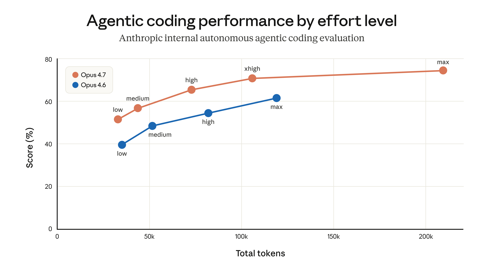
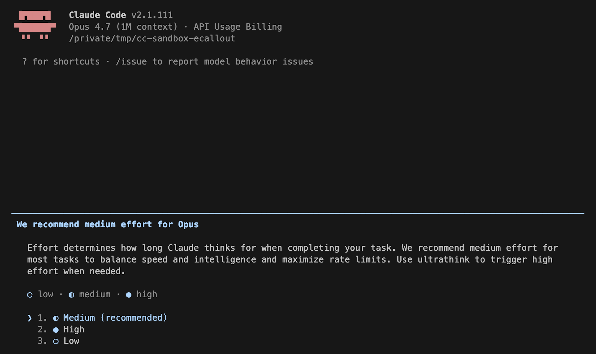

# 关于近期 Claude Code 质量问题报告的更新（中英对照）

> **原文标题：** An update on recent Claude Code quality reports
> **作者：** Anthropic 工程团队
> **原文链接：** https://www.anthropic.com/engineering/april-23-postmortem
> **发布日期：** 2026-04-23
> 排版：每段英文原文在前，中文翻译紧随其后。术语保留英文原文并附中文释义。

---

Over the past month, we've been looking into reports that Claude's responses have worsened for some users. We've traced these reports to three separate changes that affected Claude Code, the Claude Agent SDK, and Claude Cowork. The API was not impacted.

在过去的一个月里，我们一直在调查一些用户反馈的"Claude 的回复质量变差了"的报告。我们把这些报告追溯到了三个相互独立的变更，它们分别影响了 Claude Code、Claude Agent SDK 和 Claude Cowork。API 未受影响。

All three issues have now been resolved as of April 20 (v2.1.116).

截至 4 月 20 日（v2.1.116），这三个问题都已被解决。

In this post, we explain what we found, what we fixed, and what we'll do differently to ensure similar issues are much less likely to happen again.

在这篇文章中，我们说明我们发现了什么、修复了什么，以及我们将做出哪些不同的改变，以确保类似问题再次发生的可能性大大降低。

We take reports about degradation very seriously. We never intentionally degrade our models, and we were able to immediately confirm that our API and inference layer were unaffected.

我们非常严肃地对待关于模型退化的报告。我们从不故意削弱我们的模型，而且我们能够立即确认我们的 API 和推理层未受影响。

After investigation, we identified three different issues:

经过调查，我们确定了三个不同的问题：

1. **On March 4**, we changed Claude Code's default reasoning effort from `high` to `medium` to reduce the very long latency—enough to make the UI appear frozen—some users were seeing in `high` mode. This was the wrong tradeoff. We reverted this change on April 7 after users told us they'd prefer to default to higher intelligence and opt into lower effort for simple tasks. This impacted Sonnet 4.6 and Opus 4.6.
2. **3 月 4 日**，我们把 Claude Code 的默认推理强度（reasoning effort）从 `high` 改为 `medium`，目的是减少部分用户在 `high` 模式下遇到的极长延迟——长到足以让 UI 看起来像卡死。这是一个错误的取舍。在用户告诉我们他们更希望默认使用更高的智能、并为简单任务主动选择更低的强度之后，我们在 4 月 7 日回滚了这一变更。这影响了 Sonnet 4.6 和 Opus 4.6。

3. **On March 26**, we shipped a change to clear Claude's older thinking from sessions that had been idle for over an hour, to reduce latency when users resumed those sessions. A bug caused this to keep happening every turn for the rest of the session instead of just once, which made Claude seem forgetful and repetitive. We fixed it on April 10. This affected Sonnet 4.6 and Opus 4.6.
4. **3 月 26 日**，我们发布了一项变更：清除空闲超过一小时的会话中 Claude 较早的思考（thinking）内容，以减少用户恢复这些会话时的延迟。但一个 bug 导致这个清除动作在会话剩余时间里每一轮都在发生，而不是只发生一次，这让 Claude 显得健忘又重复。我们在 4 月 10 日修复了它。这影响了 Sonnet 4.6 和 Opus 4.6。

5. **On April 16**, we added a system prompt instruction to reduce verbosity. In combination with other prompt changes, it hurt coding quality and was reverted on April 20. This impacted Sonnet 4.6, Opus 4.6, and Opus 4.7.
6. **4 月 16 日**，我们添加了一条系统提示指令以减少冗长输出。与其他提示词变更叠加后，它损害了编码质量，并于 4 月 20 日被回滚。这影响了 Sonnet 4.6、Opus 4.6 和 Opus 4.7。

Because each change affected a different slice of traffic on a different schedule, the aggregate effect looked like broad, inconsistent degradation. While we began investigating reports in early March, they were challenging to distinguish from normal variation in user feedback at first, and neither our internal usage nor evals initially reproduced the issues identified.

由于每个变更都按不同的时间表影响了不同比例的流量，总体效应看起来就像是广泛而不一致的退化。虽然我们从 3 月初就开始调查相关报告，但一开始它们很难与用户反馈中的正常波动区分开来，而且我们内部的使用情况和评测起初都没有复现出这些问题。

This isn't the experience users should expect from Claude Code. As of April 23, we're resetting usage limits for all subscribers.

这不是用户应当从 Claude Code 获得的体验。自 4 月 23 日起，我们将重置所有订阅用户的使用额度（usage limits）。

# 关于 Claude Code 默认推理强度的变更（A change to Claude Code's default reasoning effort）

When we released Opus 4.6 in Claude Code in February, we set the default reasoning effort to `high`.

当我们在 2 月于 Claude Code 中发布 Opus 4.6 时，我们把默认推理强度设为 `high`。

Soon after, we received user feedback that Claude Opus 4.6 in high effort mode would occasionally think for too long, causing the UI to appear frozen and leading to disproportionate latency and token usage for those users.

不久之后，我们收到用户反馈：Claude Opus 4.6 在高强度模式下偶尔会思考过久，导致 UI 看起来像卡死，并给这些用户带来不成比例的延迟和令牌消耗。

In general, the longer the model thinks, the better the output. Effort levels are how Claude Code lets users set that tradeoff—more thinking versus lower latency and fewer usage limit hits. As we calibrate effort levels for our models, we take this tradeoff into account in order to pick points along the test-time-compute curve that give people the best range of options. In the product layer, we then choose which point along this curve we set as our default, and that is the value we send to the Messages API as the effort parameter; we then make the other options available via `/effort`.

一般来说，模型思考得越久，输出就越好。强度级别（effort levels）正是 Claude Code 让用户设置这一取舍的方式——更多的思考，换来的是更低的延迟和更少地触碰使用额度。在为我们的模型校准强度级别时，我们会把这个取舍考虑进去，以便在测试时计算（test-time compute）曲线上选出能给人们提供最佳选项范围的点位。然后在产品层，我们选择把这条曲线上的哪个点设为默认值，并将这个值作为 effort 参数发送给 Messages API；随后再通过 `/effort` 提供其他选项。

In our internal evals and testing, medium effort achieved slightly lower intelligence with significantly less latency for the majority of tasks. It also didn't suffer from the same issues with occasional very long tail latencies for thinking, and it helped maximize users' usage limits. As a result, we rolled out a change making medium the default effort, and explained the rationale via in-product dialog.

在我们的内部评测和测试中，对大多数任务而言，中等强度（medium）在显著降低延迟的同时，智能水平只略低一点。它也不会出现思考时偶尔超长尾延迟的问题，而且有助于最大化用户的使用额度。因此，我们发布了一项变更，把 medium 设为默认强度，并通过产品内对话框解释了这一决策的理由。

Soon after rolling out, users began reporting that Claude Code felt less intelligent. We shipped a number of design iterations to make the current effort setting clearer in order to alert people they could change the default (notices on startup, an inline effort selector, and bringing back ultrathink), but most users retained the medium effort default.

发布后不久，用户开始反馈 Claude Code 感觉变笨了。我们发布了若干设计迭代，让当前强度设置更加醒目，以提醒人们他们可以更改默认值（启动时的通知、内联的强度选择器，以及重新引入 ultrathink），但大多数用户仍然保留了 medium 这一默认强度。

After hearing feedback from more customers, we reversed this decision on April 7. All users now default to `xhigh` effort for Opus 4.7, and `high` effort for all other models.

在听取了更多客户的反馈后，我们在 4 月 7 日推翻了这一决定。现在所有用户的默认强度为：Opus 4.7 使用 `xhigh`，所有其他模型使用 `high`。

# 一个丢弃了先前推理的缓存优化（A caching optimization that dropped prior reasoning）

When Claude reasons through a task, that reasoning is normally kept in the conversation history so that on every subsequent turn, Claude can see why it made the edits and tool calls it did.

当 Claude 对一个任务进行推理时，这些推理通常会被保留在对话历史中，这样在之后的每一轮里，Claude 都能看到自己当初为什么做出那些编辑和工具调用。

On March 26, we shipped what was meant to be an efficiency improvement to this feature. We use prompt caching to make back-to-back API calls cheaper and faster for users. Claude writes the input tokens to the cache when it makes an API request, then after a period of inactivity the prompt is evicted from cache, making room for other prompts. Cache utilization is something we manage carefully (more on our [approach](https://claude.com/blog/lessons-from-building-claude-code-prompt-caching-is-everything)).

3 月 26 日，我们发布了一个本意是改善该功能效率的改动。我们使用提示缓存（prompt caching）来让用户连续多次的 API 调用更便宜、更快。Claude 在发起 API 请求时会把输入令牌写入缓存，在一段时间不活动后，提示词就会从缓存中被逐出，为其他提示词腾出空间。缓存利用率是我们精心管理的一项指标（更多关于我们的[做法](https://claude.com/blog/lessons-from-building-claude-code-prompt-caching-is-everything)）。

The design should have been simple: if a session has been idle for more than an hour, we could reduce users' cost of resuming that session by clearing old thinking sections. Since the request would be a cache miss anyway, we could prune unnecessary messages from the request to reduce the number of uncached tokens sent to the API. We'd then resume sending full reasoning history. To do this we used the `clear_thinking_20251015` API header along with `keep:1`.

这个设计本该很简单：如果一个会话空闲超过一小时，我们可以通过清除旧的思考部分来降低用户恢复该会话的成本。由于这次请求反正也会是缓存未命中（cache miss），我们可以从请求中修剪掉不必要的消息，以减少发送给 API 的未缓存令牌数量。然后再恢复发送完整的推理历史。为了实现这一点，我们使用了 `clear_thinking_20251015` API 头，并配合 `keep:1`。

The implementation had a bug. Instead of clearing thinking history once, it cleared it on every turn for the rest of the session. After a session crossed the idle threshold once, each request for the rest of that process told the API to keep only the most recent block of reasoning and discard everything before it. This compounded: if you sent a follow-up message while Claude was in the middle of a tool use, that started a new turn under the broken flag, so even the reasoning from the current turn was dropped. Claude would continue executing, but increasingly without memory of why it had chosen to do what it was doing. This surfaced as the forgetfulness, repetition, and odd tool choices people reported.

实现中存在一个 bug。它不是清除一次思考历史，而是在会话剩余的时间里每一轮都清除。一旦一个会话跨过了空闲阈值，该进程此后每次请求都会告诉 API 只保留最近的一段推理，并丢弃它之前的所有内容。这还会不断叠加：如果你在 Claude 执行某次工具调用的中途发送一条后续消息，那就会在失效标志下开启新的一轮，于是连当前这一轮的推理也被丢弃了。Claude 会继续执行，却越来越不记得自己当初为什么选择做正在做的事。这表现为用户所报告的那种健忘、重复和古怪的工具选择。

Because this would continuously drop thinking blocks from subsequent requests, those requests also resulted in cache misses. We believe this is what drove the separate reports of usage limits draining faster than expected.

由于这会持续地从后续请求中丢弃思考块，这些请求也都会造成缓存未命中。我们认为，这正是另一批"使用额度消耗得比预期快"的报告背后的原因。

Two unrelated experiments made it challenging for us to reproduce the issue at first: an internal-only server-side experiment related to message queuing; and an orthogonal change in how we display thinking suppressed this bug in most CLI sessions, so we didn't catch it even when testing external builds.

两个不相关的实验一开始让我们难以复现这个问题：一个仅限内部的、与消息队列相关的服务端实验；以及另一个独立的变化——它改变了我们展示思考的方式，结果在大多数 CLI 会话中抑制了这个 bug，所以即便我们在测试外部构建时也没有发现它。

This bug was at the intersection of Claude Code's context management, the Anthropic API, and extended thinking. The changes it introduced made it past multiple human and automated code reviews, as well as unit tests, end-to-end tests, automated verification, and dogfooding. Combined with this only happening in a corner case (stale sessions) and the difficulty of reproducing the issue, it took us over a week to discover and confirm the root cause.

这个 bug 处于 Claude Code 的上下文管理、Anthropic API 和扩展思考（extended thinking）三者的交汇处。它所引入的改动通过了多轮人工与自动化的代码审查，也通过了单元测试、端到端测试、自动化验证和内部试用（dogfooding）。再加上这个问题只出现在一个边角场景（陈旧会话）中，而且很难复现，我们花了一周多的时间才发现并确认了根本原因。

As part of the investigation, we back-tested [Code Review](https://code.claude.com/docs/en/code-review) against the offending pull requests using Opus 4.7. When provided the code repositories necessary to gather complete context, Opus 4.7 found the bug, while Opus 4.6 didn't. To prevent this from happening again, we are now landing support for additional repositories as context for code reviews.

作为调查的一部分，我们用 Opus 4.7 对出问题的 pull request 回测了 [Code Review](https://code.claude.com/docs/en/code-review)。在提供了收集完整上下文所需的代码仓库后，Opus 4.7 发现了这个 bug，而 Opus 4.6 没有。为了防止此类问题再次发生，我们现在正在落地支持把更多仓库作为代码审查的上下文。

We fixed this bug on April 10 in v2.1.101.

我们于 4 月 10 日在 v2.1.101 中修复了这个 bug。

# 一次为减少冗长而做的系统提示变更（A system prompt change to reduce verbosity）

Our latest model, Claude Opus 4.7, has a notable behavioral quirk relative to its predecessor: as we [wrote about](https://www.anthropic.com/news/claude-opus-4-7) at launch, it tends to be quite verbose. This makes it smarter on hard problems, but it also produces more output tokens.

我们最新的模型 Claude Opus 4.7 相对于其前代有一个显著的行为怪癖：正如我们在发布时[写到的](https://www.anthropic.com/news/claude-opus-4-7)，它往往相当冗长。这让它在难题上更聪明，但也会产生更多的输出令牌。

A few weeks before we released Opus 4.7, we started tuning Claude Code in preparation. Each model behaves slightly differently, and we spend time before each release optimizing the harness and product for it.

在发布 Opus 4.7 的几周前，我们就开始为 Claude Code 做相应的调优准备。每个模型的行为都略有不同，我们会在每次发布前花时间为它优化 harness 和产品。

We have a number of tools to reduce verbosity: model training, prompting, and improving thinking UX in the product. Ultimately we used all of these, but one addition to the system prompt caused an outsized effect on intelligence in Claude Code:

我们有很多减少冗长的手段：模型训练、提示词设计，以及改进产品中的思考体验（UX）。最终我们全都用上了，但系统提示中新增的一条内容，对 Claude Code 的智能水平产生了超乎比例的影响：

> *"Length limits: keep text between tool calls to ≤25 words. Keep final responses to ≤100 words unless the task requires more detail."*
> *"长度限制：两次工具调用之间的文字不超过 25 个词。除非任务需要更多细节，否则最终回复不超过 100 个词。"*

After multiple weeks of internal testing and no regressions in the set of evaluations we ran, we felt confident about the change and shipped it alongside Opus 4.7 on April 16.

在经历数周的内部测试、且我们运行的评测集没有出现回归之后，我们对这个变更充满信心，并于 4 月 16 日随 Opus 4.7 一起发布。

As part of this investigation, we ran more ablations (removing lines from the system prompt to understand the impact of each line) using a broader set of evaluations. One of these evaluations showed a 3% drop for both Opus 4.6 and 4.7. We immediately reverted the prompt as part of the April 20 release.

作为本次调查的一部分，我们使用更广泛的评测集做了更多消融实验（ablation，即从系统提示中逐行移除内容以理解每行的影响）。其中一项评测显示，Opus 4.6 和 4.7 都下降了 3%。我们立即在 4 月 20 日的发布中回滚了这条提示。

# 展望未来（Going forward）

We are going to do several things differently to avoid these issues: we'll ensure that a larger share of internal staff use the exact public build of Claude Code (as opposed to the version we use to test new features); and we'll make improvements to our [Code Review](https://code.claude.com/docs/en/code-review) tool that we use internally, and ship this improved version to customers.

我们将做出几项不同的改变以避免这些问题：我们将确保更大比例的内部员工使用与公共版本完全一致的 Claude Code 构建（而不是我们用来测试新功能的版本）；我们还将改进内部使用的 [Code Review](https://code.claude.com/docs/en/code-review) 工具，并把改进后的版本提供给客户。

We're also adding tighter controls on system prompt changes. We will run a broad suite of per-model evals for every system prompt change to Claude Code, continuing ablations to understand the impact of each line, and we have built new tooling to make prompt changes easier to review and audit. We've additionally added guidance to our CLAUDE.md to ensure model-specific changes are gated to the specific model they're targeting. For any change that could trade off against intelligence, we'll add soak periods, a broader eval suite, and gradual rollouts so we catch issues earlier.

我们还在加强对系统提示变更的管控。对 Claude Code 的每一次系统提示变更，我们都会运行一整套按模型区分的评测，继续进行消融实验以理解每一行的影响，并且我们已经构建了新的工具，让提示词变更更容易被审查和审计。我们还向我们的 CLAUDE.md 增加了指导原则，确保针对特定模型的变更只作用于它所针对的那个模型。对于任何可能与智能水平产生取舍的变更，我们会增加观察期（soak periods）、更广泛的评测集和渐进式发布（gradual rollouts），以便更早地发现问题。

We recently created @ClaudeDevs on X to give us the room to explain product decisions and the reasoning behind them in depth. We'll share the same updates in centralized threads on GitHub.

我们最近在 X 上创建了 @ClaudeDevs，以便有空间深入解释产品决策及其背后的理由。我们也会在 GitHub 上的集中讨论串中分享同样的更新。

Finally, we'd like to thank our users: the people who used the `/feedback` command to share their issues with us (or who posted specific, reproducible examples online) are the ones who ultimately allowed us to identify and fix these problems. Today we are resetting usage limits for all subscribers.

最后，我们要感谢我们的用户：正是那些使用 `/feedback` 命令与我们分享问题（或在网上发布了具体、可复现的例子）的人，最终让我们得以发现并修复这些问题。今天，我们将重置所有订阅用户的使用额度。

We're immensely grateful for your feedback and for your patience.

我们非常感谢你们的反馈，也感谢你们的耐心。
