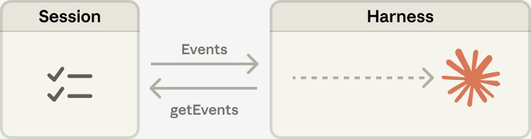
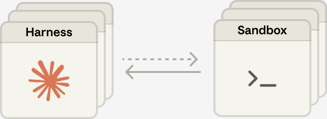

# 扩展托管 Agent：将大脑与双手解耦（中英对照）

> **原文标题：** Scaling Managed Agents: Decoupling the brain from the hands
> **作者：** Lance Martin, Gabe Cemaj, Michael Cohen（Anthropic 工程团队）
> **原文链接：** https://www.anthropic.com/engineering/managed-agents
> **发布日期：** 2026-04-08
> 排版：每段英文原文在前，中文翻译紧随其后。术语保留英文原文并附中文释义。

---

*Get started with Claude Managed Agents by following our [docs](https://platform.claude.com/docs/en/managed-agents/overview).* A running topic on the Engineering Blog is how to [build effective agents](https://www.anthropic.com/engineering/building-effective-agents) and [design harnesses](https://www.anthropic.com/engineering/effective-harnesses-for-long-running-agents) for [long-running work](https://www.anthropic.com/engineering/harness-design-long-running-apps). A common thread across this work is that harnesses encode assumptions about what Claude can’t do on its own. However, those assumptions need to be frequently questioned because they can [go stale](http://www.incompleteideas.net/IncIdeas/BitterLesson.html) as models improve.

请通过我们的[文档](https://platform.claude.com/docs/en/managed-agents/overview)开始使用 Claude Managed Agents。工程博客上一直有一个热门话题：如何[构建高效的 Agent](https://www.anthropic.com/engineering/building-effective-agents)、如何为[长时运行任务](https://www.anthropic.com/engineering/harness-design-long-running-apps) [设计 harness](https://www.anthropic.com/engineering/effective-harnesses-for-long-running-agents)。这些工作有一个共同主线：harness 编码了对"Claude 无法独立完成什么"的假设。然而，随着模型能力的提升，这些假设需要被频繁质疑，因为它们可能[过时](http://www.incompleteideas.net/IncIdeas/BitterLesson.html)。

As just one example, in prior work [we found](https://www.anthropic.com/engineering/harness-design-long-running-apps) that Claude Sonnet 4.5 would wrap up tasks prematurely as it sensed its context limit approaching—a behavior sometimes called "context anxiety." We addressed this by adding context resets to the harness. But when we used the same harness on Claude Opus 4.5, we found that the behavior was gone. The resets had become dead weight.

仅举一例：在先前的工作中，[我们发现](https://www.anthropic.com/engineering/harness-design-long-running-apps) Claude Sonnet 4.5 在感知到上下文上限临近时，会过早地结束任务——这种行为有时被称为"上下文焦虑"（context anxiety）。我们通过在 harness 中加入上下文重置（context reset）解决了这个问题。但当我们在 Claude Opus 4.5 上使用同一个 harness 时，发现这一行为已经消失了。那些重置成了多余的累赘。

We expect harnesses to continue evolving. So we built Managed Agents: a hosted service in the Claude Platform that runs long-horizon agents on your behalf through a small set of interfaces meant to outlast any particular implementation—including the ones we run today.

我们预期 harness 会持续演进。因此我们构建了 Managed Agents：这是 Claude Platform 中的一项托管服务，通过一小套接口代表你运行长时程（long-horizon）Agent，这套接口的设计初衷是比任何特定实现都更长寿——包括我们今天运行的这些。

Building Managed Agents meant solving an old problem in computing: how to design a system for "[programs as yet unthought of](http://www.catb.org/esr/writings/taoup/html/ch03s01.html)." Decades ago, operating systems solved this problem by virtualizing hardware into abstractions—*process, file*—general enough for programs that didn't exist yet. The abstractions outlasted the hardware. The `read()` command is agnostic as to whether it's accessing a disk pack from the 1970s or a modern SSD. The abstractions on top stayed stable while the implementations underneath changed freely.

构建 Managed Agents 意味着解决计算领域的一个古老问题：如何为一个"[尚未构思出来的程序](http://www.catb.org/esr/writings/taoup/html/ch03s01.html)"设计系统。几十年前，操作系统通过把硬件虚拟化成抽象概念——*进程、文件*——解决了这个问题，这些抽象足以容纳还不存在的程序。抽象概念比硬件更长寿。`read()` 命令并不关心它访问的是 1970 年代的磁盘组还是现代 SSD。底层的实现在自由变化，而它上层的抽象一直保持稳定。

Managed Agents follow the same pattern. We virtualized the components of an agent: a session (the append-only log of everything that happened), a harness (the loop that calls Claude and routes Claude's tool calls to the relevant infrastructure), and a sandbox (an execution environment where Claude can run code and edit files). This allows the implementation of each to be swapped without disturbing the others. We're opinionated about the shape of these interfaces, not about what runs behind them.

Managed Agents 遵循同样的模式。我们把 Agent 的各个组件虚拟化：会话（session，一个只追加的日志，记录发生过的一切）、harness（调用 Claude 并将其工具调用路由到相关基础设施的循环）以及沙箱（sandbox，Claude 可以运行代码和编辑文件的执行环境）。这样每个组件的实现都可以在不干扰其他组件的情况下被替换。我们对这些接口的形态有明确主张，但对接口背后运行什么不作规定。

# 别把组件当宠物养（Don't adopt a pet）

We started by placing all agent components into a single container, which meant the session, agent harness, and sandbox all shared an environment. There were benefits to this approach, including that file edits are direct syscalls, and there were no service boundaries to design.

我们起初把所有 Agent 组件放进同一个容器里，这意味着会话、Agent harness 和沙箱共享同一个环境。这种方法有它的好处：文件编辑是直接的系统调用（syscall），而且无需设计任何服务边界。

But by coupling everything into one container, we ran into an old infrastructure problem: we'd adopted a [*pet*](https://cloudscaling.com/blog/cloud-computing/the-history-of-pets-vs-cattle/). In the pets-vs-cattle analogy, a pet is a named, hand-tended individual you can't afford to lose, while cattle are interchangeable. In our case, the server became that pet; if a container failed, the session was lost. If a container was unresponsive, we had to nurse it back to health.

但把所有东西耦合进一个容器后，我们撞上了基础设施领域一个老问题：我们养了一只"[宠物](https://cloudscaling.com/blog/cloud-computing/the-history-of-pets-vs-cattle/)"。在"宠物与牲口"（pets-vs-cattle）的类比中，宠物是有名字、需要亲手照料、丢不起的个体，而牲口是可以随意替换的。在我们的场景里，服务器成了那只宠物；一旦某个容器失败，会话就丢失了。一旦某个容器无响应，我们就得把它"护理"到恢复健康。

Nursing containers meant debugging unresponsive stuck sessions. Our only window in was the WebSocket event stream, but that couldn't tell us *where* failures arose, which meant that a bug in the harness, a packet drop in the event stream, or a container going offline all presented the same. To figure out what went wrong, an engineer had to open a shell inside the container, but because that container often also held user data, that approach essentially meant we lacked the ability to debug.

"护理"容器意味着要调试无响应的卡死会话。我们唯一的窗口是 WebSocket 事件流，但它无法告诉我们失败发生在*哪里*——这意味着 harness 里的一个 bug、事件流中的一次丢包、或者容器掉线，呈现出的现象完全相同。要弄清哪里出了问题，工程师必须进入容器内部打开一个 shell；但由于那个容器往往还装着用户数据，这种做法实质上意味着我们缺乏调试能力。

A second issue was that the harness assumed that whatever Claude worked on lived in the container with it. When customers asked us to connect Claude to their virtual private cloud, they had to either peer their network with ours, or run our harness in their own environment. An assumption baked into the harness became a problem when we wanted to connect it to different infrastructure.

第二个问题是：harness 假设 Claude 所处理的一切都跟它住在同一个容器里。当客户要求我们把 Claude 连接到他们的私有云（VPC）时，他们要么必须把他们的网络与我们对等互联，要么在自己的环境里运行我们的 harness。这个写死在 harness 里的假设，在我们想要把它接到不同基础设施上时就成了问题。

# 让大脑与双手解耦（Decouple the brain from the hands）

The solution we arrived at was to decouple what we thought of as the "brain" (Claude and its harness) from both the "hands" (sandboxes and tools that perform actions) and the "session" (the log of session events). Each became an interface that made few assumptions about the others, and each could fail or be replaced independently.

我们最终得出的解决方案，是把我们称之为"大脑"（brain，即 Claude 及其 harness）的部分，与"双手"（hands，即执行动作的沙箱和工具）以及"会话"（session，会话事件的日志）三者解耦。每一个都成为对彼此很少做假设的接口，并且每一个都能独立地失败或被替换。

**The harness leaves the container. **Decoupling the brain from the hands meant the harness no longer lived inside the container. It called the container the way it called any other tool: `execute(name, input) → string`. The container became cattle. If the container died, the harness caught the failure as a tool-call error and passed it back to Claude. If Claude decided to retry, a new container could be reinitialized with a standard recipe: `provision({resources})`. We no longer had to nurse failed containers back to health.

**harness 离开了容器。**让大脑与双手解耦，意味着 harness 不再住在容器里。它调用容器的方式与调用任何其他工具一样：`execute(name, input) → string`。容器变成了牲口。如果容器死掉，harness 会把它当作一次工具调用错误捕获，并回传给 Claude。如果 Claude 决定重试，就可以用一套标准配方重新初始化一个新容器：`provision({resources})`。我们不再需要把失败的容器"护理"到恢复健康。

**Recovering from harness failure. **The harness also became cattle. Because the session log sits outside the harness, nothing in the harness needs to survive a crash. When one fails, a new one can be rebooted with `wake(sessionId)`, use `getSession(id)` to get back the event log, and resume from the last event. During the agent loop, the harness writes to the session with `emitEvent(id, event)` in order to keep a durable record of events.

**从 harness 失败中恢复。**harness 同样变成了牲口。由于会话日志存放在 harness 之外，harness 里没有任何东西需要熬过一次崩溃。当某个 harness 失败时，可以用 `wake(sessionId)` 重启一个新的 harness，用 `getSession(id)` 取回事件日志，并从最后一条事件处恢复。在 Agent 循环过程中，harness 通过 `emitEvent(id, event)` 写入会话，从而保留一份持久的事件记录。

**The security boundary.** In the coupled design, any untrusted code that Claude generated was run in the same container as credentials—so a prompt injection only had to convince Claude to read its own environment. Once an attacker has those tokens, they can spawn fresh, unrestricted sessions and delegate work to them. Narrow scoping is an obvious mitigation, but this encodes an assumption about what Claude can't do with a limited token—and Claude is getting increasingly smart. The structural fix was to make sure the tokens are never reachable from the sandbox where Claude's generated code runs.

**安全边界。**在耦合式设计里，Claude 生成的任何不受信任的代码都与凭证在同一个容器中运行——因此一次提示注入（prompt injection）只需说服 Claude 读取自己的环境即可。一旦攻击者拿到这些令牌（token），他们就能衍生出全新的、不受限制的会话，并把工作委托给它们。缩小权限范围（narrow scoping）是一种显而易见的缓解措施，但这又编码了一种假设——"Claude 拿着有限令牌就干不了什么"——而 Claude 正变得越来越聪明。结构性的修复是：确保令牌永远不会被运行 Claude 生成代码的沙箱触及。

We used two patterns to ensure this. Auth can be bundled with a resource or held in a vault outside the sandbox. For Git, we use each repository's access token to clone the repo during sandbox initialization and wire it into the local git remote. Git `push` and `pull` work from inside the sandbox without the agent ever handling the token itself. For custom tools, we support MCP and store OAuth tokens in a secure vault. Claude calls MCP tools via a dedicated proxy; this proxy takes in a token associated with the session. The proxy can then fetch the corresponding credentials from the vault and make the call to the external service. The harness is never made aware of any credentials.

我们用两种模式来确保这一点。认证既可以与某个资源捆绑，也可以存放在沙箱之外的保险库（vault）里。对于 Git，我们在沙箱初始化期间使用每个仓库的访问令牌来克隆仓库，并将其接入本地的 git remote。`push` 和 `pull` 在沙箱内部就能工作，而 Agent 从头到尾都不直接接触令牌本身。对于自定义工具，我们支持 MCP，并把 OAuth 令牌存储在安全的保险库中。Claude 通过一个专用代理调用 MCP 工具；这个代理接收与会话相关联的令牌，然后从保险库取出相应的凭据，向外部服务发起调用。harness 永远不知道任何凭据的存在。

# 会话不是 Claude 的上下文窗口（The session is not Claude's context window）

Long-horizon tasks often exceed the length of Claude's context window, and the standard ways to address this all involve irreversible decisions about what to keep. We've explored these techniques in [prior work](https://www.anthropic.com/engineering/effective-context-engineering-for-ai-agents) on context engineering. For example, compaction lets Claude save a summary of its context window and the memory tool lets Claude write context to files, enabling learning across sessions. This can be paired with context trimming, which selectively removes tokens such as old tool results or thinking blocks.

长时程任务常常超过 Claude 上下文窗口的长度，而应对这一问题的标准方法，都涉及"保留什么"这种不可逆的决定。我们曾在关于上下文工程（context engineering）的[先前工作](https://www.anthropic.com/engineering/effective-context-engineering-for-ai-agents)中探索过这些技术。例如，压缩（compaction）让 Claude 保存其上下文窗口的摘要，memory 工具让 Claude 把上下文写入文件，从而能够跨会话学习。这还可以与上下文裁剪（context trimming）搭配使用，后者会选择性移除某些令牌，例如旧的工具结果或思考块（thinking blocks）。

But irreversible decisions to selectively retain or discard context can lead to failures. It is difficult to know which tokens the future turns will need. If messages are transformed by a compaction step, the harness removes compacted messages from Claude's context window, and these are recoverable only if they are stored. Prior work [has explored](https://arxiv.org/pdf/2512.24601) ways to address this by storing context as an object that lives *outside* the context window. For example, context can be an object in a REPL that the LLM programmatically accesses by writing code to filter or slice it.

但是，选择性保留或丢弃上下文的不可逆决定可能导致失败。我们很难预知未来的轮次需要哪些令牌。如果消息经过一次压缩步骤被变换，harness 会把这些被压缩的消息从 Claude 的上下文窗口中移除，而它们只有被存储下来才能恢复。先前的工作[已经探索过](https://arxiv.org/pdf/2512.24601)一些方法来解决这个问题，即把上下文存储为*位于上下文窗口之外*的对象。例如，上下文可以是 REPL 中的一个对象，LLM 通过编写代码过滤或切片它以编程方式访问。

In Managed Agents, the session provides this same benefit, serving as a context object that lives outside Claude's context window. But rather than be stored within the sandbox or REPL, context is durably stored in the session log. The interface, `getEvents(),` allows the brain to interrogate context by selecting positional slices of the event stream. The interface can be used flexibly, allowing the brain to pick up from wherever it last stopped reading, rewinding a few events before a specific moment to see the lead up, or rereading context before a specific action.

在 Managed Agents 中，会话提供了同样的好处，充当着位于 Claude 上下文窗口之外的上下文对象。但与存放在沙箱或 REPL 中不同，上下文被持久化地存储在会话日志里。`getEvents()` 这个接口让大脑可以通过选取事件流的位置切片来查询上下文。这个接口可以灵活使用：让大脑从它上次停止读取的地方继续，回退到某个特定时刻之前的几条事件以查看前因，或者在某个特定动作之前重读上下文。

Any fetched events can also be transformed in the harness before being passed to Claude's context window. These transformations can be whatever the harness encodes, including context organization to achieve a high prompt cache hit rate and context engineering. We separated the concerns of recoverable context storage in the session and arbitrary context management in the harness because we can't predict what specific context engineering will be required in future models. The interfaces push that context management into the harness, and only guarantee that the session is durable and available for interrogation.

任何取回的事件也可以在传入 Claude 的上下文窗口之前，在 harness 中被变换。这些变换可以是 harness 编码的任何形式，包括为达成高提示缓存命中率（prompt cache hit rate）而做的上下文组织，以及上下文工程。我们把"会话中可恢复的上下文存储"与"harness 中任意的上下文管理"这两个关注点分离开来，因为我们无法预测未来的模型需要什么样的具体上下文工程。这些接口把上下文管理推给了 harness，只保证会话是持久的、可供查询的。

# 许多大脑，许多双手（Many brains, many hands）

**Many brains. **Decoupling the brain from the hands solved one of our earliest customer complaints. When teams wanted Claude to work against resources in their own VPC, the only path was to peer their network with ours, because the container holding the harness assumed every resource sat next to it. Once the harness was no longer in the container, that assumption went away. The same change had a performance payoff. When we initially put the brain in a container, it meant that many brains required as many containers. For each brain, no inference could happen until that container was provisioned; every session paid the full container setup cost up front. Every session, even ones that would never touch the sandbox, had to clone the repo, boot the process, fetch pending events from our servers.

**许多大脑。**让大脑与双手解耦解决了我们最早的一批客户抱怨。当团队希望 Claude 针对他们自己 VPC 里的资源工作时，唯一的路径是把他们的网络与我们对等互联，因为装着 harness 的容器假设每个资源都紧挨着它。一旦 harness 不再待在容器里，这个假设就消失了。同样的改动还带来了性能收益。当我们最初把大脑放进容器时，这意味着多少大脑就需要多少个容器。对每个大脑而言，直到那个容器被配置好之前都无法进行推理；每个会话都要预先支付完整的容器设置成本。每个会话——哪怕是永远不会碰沙箱的会话——都必须克隆仓库、启动进程、从我们的服务器拉取待处理事件。

That dead time is expressed in time-to-first-token (TTFT), which measures how long a session waits between accepting work and producing its first response token. TTFT is the latency the user most acutely *feels*.

这段死时间体现在首令牌时间（time-to-first-token，TTFT）上，它衡量的是一个会话在接受到工作与产出第一个响应令牌之间等待了多久。TTFT 正是用户感受最*深切*的延迟。

Decoupling the brain from the hands means that containers are provisioned by the brain via a tool call `(execute(name, input) → string)` only if they are needed. So a session that didn't need a container right away didn't wait for one. Inference could start as soon as the orchestration layer pulled pending events from the session log. Using this architecture, our p50 TTFT dropped roughly 60% and p95 dropped over 90%. Scaling to many brains just meant starting many stateless harnesses, and connecting them to hands only if needed.

让大脑与双手解耦意味着：容器只在需要时，才由大脑通过一次工具调用 `(execute(name, input) → string)` 来配置。因此，一个暂时不需要容器的会话就不必等待容器。只要编排层（orchestration layer）从会话日志拉取到待处理事件，推理就可以开始。使用这一架构，我们的 p50 TTFT 下降了约 60%，p95 下降了超过 90%。扩展到许多大脑，只需启动许多无状态的 harness，并在需要时才把它们连接到双手。

**Many hands. **We also wanted the ability to connect each brain to many hands. In practice, this means Claude must reason about many execution environments and decide where to send work—a harder cognitive task than operating in a single shell. We started with the brain in a single container because earlier models weren't capable of this. As intelligence scaled, the single container became the limitation instead: when that container failed, we lost state for every hand that the brain was reaching into.

**许多双手。**我们还希望每个大脑都能连接到许多双手。在实践中，这意味着 Claude 必须对许多执行环境进行推理，并决定把工作送到哪里——这是一个比在单个 shell 中操作更难的认知任务。我们最初把大脑放在单个容器里，是因为早期的模型不具备这种能力。随着智能水平提升，单个容器反而成了限制：当那个容器失败时，我们会失去大脑所触及的每一只手的全部状态。

Decoupling the brain from the hands makes each hand a tool, `execute(name, input) → string`: a name and input go in, and a string is returned. That interface supports any custom tool, any MCP server, and our own tools. The harness doesn't know whether the sandbox is a container, a phone, or a Pokémon emulator. And because no hand is coupled to any brain, brains can pass hands to one another.

让大脑与双手解耦，使每一只手都成为一个工具 `execute(name, input) → string`：传入一个名称和输入，返回一个字符串。这个接口支持任何自定义工具、任何 MCP 服务器，以及我们自己的工具。harness 并不知道沙箱是一个容器、一部手机、还是一个宝可梦模拟器。而且，由于没有哪只手与哪个大脑耦合，大脑之间还可以互相传递双手。

# 结语（Conclusion）

The challenge we faced is an old one: how to design a system for "programs as yet unthought of." Operating systems have lasted decades by virtualizing the hardware into abstractions general enough for programs that didn't exist yet. With Managed Agents, we aimed to design a system that accommodates future harnesses, sandboxes, or other components around Claude.

我们面临的挑战是一个古老的问题：如何为一个"尚未构思出来的程序"设计系统。操作系统之所以能延续几十年，正是因为它把硬件虚拟化成足够通用的抽象，足以容纳当时还不存在的程序。借助 Managed Agents，我们的目标是设计一个能够容纳未来围绕 Claude 的 harness、沙箱或其他组件的系统。

Managed Agents is a meta-harness in the same spirit, unopinionated about the *specific* harness that Claude will need in the future. Rather, it is a system with general interfaces that allow many different harnesses. For example, Claude Code is an excellent harness that we use widely across tasks. We've also shown that task-specific agent harnesses excel in narrow domains. Managed Agents can accommodate any of these, matching Claude's intelligence over time.

Managed Agents 是一个秉承同样精神的"元 harness"（meta-harness），对 Claude 未来将*具体*需要的 harness 形态不作主张。相反，它是一套拥有通用接口的系统，允许承载许多不同的 harness。例如，Claude Code 就是一个优秀的 harness，我们在各种任务中广泛使用它。我们还证明了，针对特定任务的 Agent harness 在狭窄领域中表现出色。Managed Agents 可以容纳其中任何一种，并随着时间推移与 Claude 的智能水平相匹配。

Meta-harness design means being opinionated about the interfaces around Claude: we expect that Claude will need the ability to manipulate state (the session) and perform computation (the sandbox). We also expect that Claude will require the ability to scale to many brains and many hands. We designed the interfaces so that these can be run reliably and securely over long time horizons. But we make no assumptions about the number or location of brains or hands that Claude will need.

元 harness 设计意味着对 Claude 周边的接口要有明确主张：我们预期 Claude 将需要操作状态的能力（会话）和执行计算的能力（沙箱）。我们还预期 Claude 将需要扩展到许多大脑和许多双手的能力。我们设计的这些接口，能够保障这些能力在长时间尺度上可靠、安全地运行。但对于 Claude 将需要多少大脑或双手、它们在哪里，我们不做任何假设。

# 致谢（Acknowledgements）

Written by Lance Martin, Gabe Cemaj, and Michael Cohen. Thanks to Nodir Turakulov and Jeremy Fox for helpful conversations on these topics. Special thanks to the Agents API team and Jake Eaton for their contributions.

本文作者为 Lance Martin、Gabe Cemaj 和 Michael Cohen。感谢 Nodir Turakulov 和 Jeremy Fox 就这些话题进行的有益讨论。特别感谢 Agents API 团队和 Jake Eaton 的贡献。
