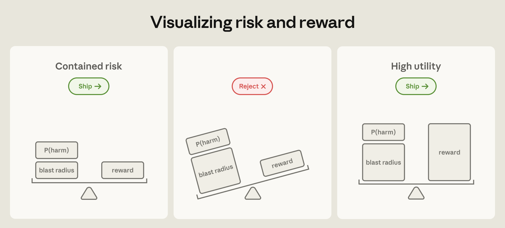
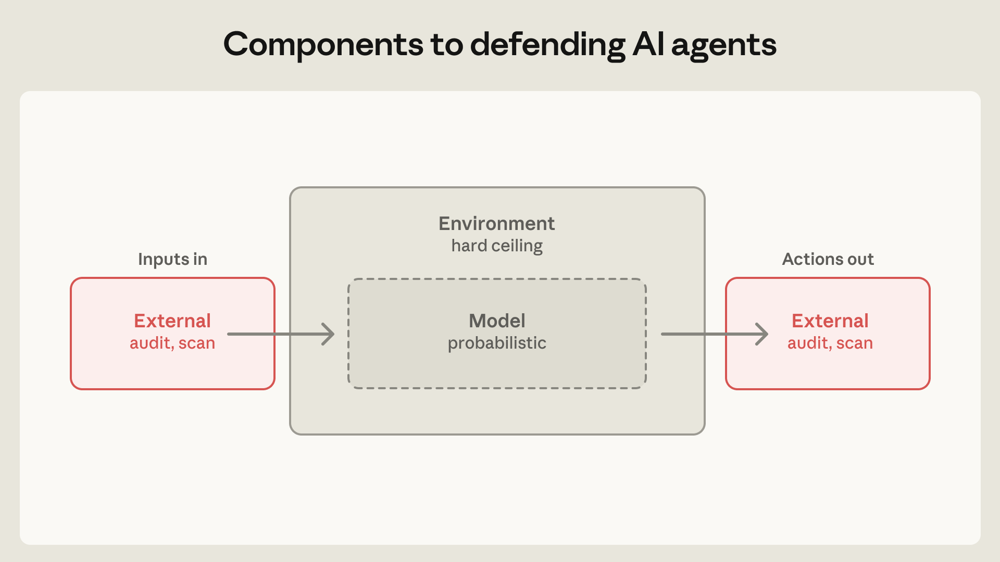
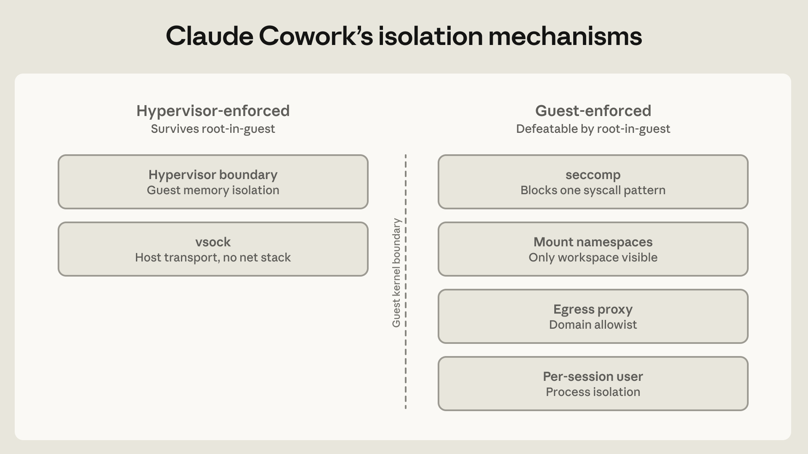
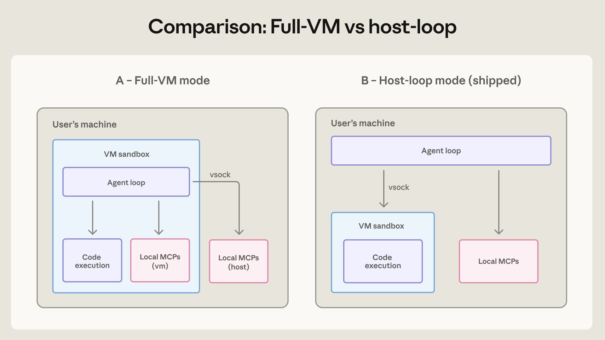
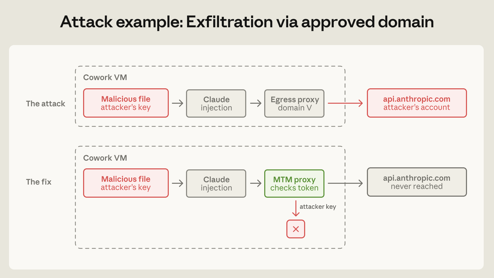

# 我们如何在各个产品中收容 Claude（中英对照）

> **原文标题：** How we contain Claude across products
> **作者：** Max McGuinness, Mikaela Grace, Jiri De Jonghe, Jake Eaton, Abel Ribbink（Anthropic 工程团队）
> **原文链接：** https://www.anthropic.com/engineering/how-we-contain-claude
> **发布日期：** 2026-05-25
> 排版：每段英文原文在前，中文翻译紧随其后。术语保留英文原文并附中文释义。

---

Twelve months ago, we'd have rejected out of hand the idea of granting Claude access sufficient to take down an internal Anthropic service. Today that level of access is routine, and Anthropic developers are more productive for it. The risk of these deployments has two components: how likely a failure is, and how much damage one could do. Progress on safeguards and model training has steadily driven down the first; the second—the theoretical blast radius—only grows as capabilities and access expand. Yet as agents become capable of doing work that once required a person or even a team, the cost of *not* deploying grows large enough that the risk-reward calculation tips heavily toward adoption, as long as products can be made safe. The engineering question becomes how to cap the blast radius.

十二个月前，我们还会不加考虑地拒绝"授予 Claude 足以搞垮 Anthropic 内部服务的访问权限"这种想法。而今天，这种级别的访问已成为常态，Anthropic 的开发者们也因此更有效率。这类部署的风险由两部分组成：失败发生的可能性有多大，以及一旦失败能造成多大的损害。安全防护与模型训练的进步一直在稳步压低前者的概率；而后者——理论上的爆炸半径（blast radius）——只会随着能力与访问范围的扩展而增大。然而，当 Agent 变得有能力完成那些曾经需要一个人、甚至一个团队才能完成的工作时，*不*部署的代价就大到足以让风险-收益的天平大幅倾向采用——只要产品能被做得足够安全。于是工程问题变成了：如何给爆炸半径设上限。

> When bounds can be placed on the relative damage of an autonomous agent—such as through control over its environment—high-utility capabilities can motivate deployment. Claude Mythos Preview is an example of a model whose blast radius was deemed too high to ship in April 2026. However, we expect broader release of models with similar levels of capability to become appropriate as defenders harden critical systems and safeguards mature—even though some risk will always remain. Model capability is an important factor in the total risk of an agent's deployment.
> 当能对自主 Agent 的相对损害设定边界时——例如通过控制其运行环境——高价值的（high-utility）能力就能促使我们投入部署。Claude Mythos Preview 就是一个例子：该模型的爆炸半径在 2026 年 4 月被认为过高而未能发布。不过，我们预计随着防御方加固关键系统、防护手段走向成熟，发布能力相近的模型将成为适宜之举——尽管某些风险将始终存在。模型能力是 Agent 部署总体风险中的一个重要因素。

There are broadly two ways to do this.

实现这一点（为爆炸半径封顶）大致有两条路径。

The first is to supervise the agent's behavior via a human-in-the-loop. Claude Code previously protected against agents taking unintended actions by asking users for permission at each turn. Theoretically that works, but we've found the approach to be fallible. Our telemetry showed users approved roughly 93% of permission prompts. The more approvals a user sees, the less attention they pay to each, becoming over time much less diligent in their supervision. We recently built Claude Code auto mode, which automates safer approvals in order to reduce this approval fatigue. Still, vulnerabilities remain—any probabilistic defense has a non-zero miss rate.[1]

第一条是通过"人在回路"（human-in-the-loop）来监督 Agent 的行为。Claude Code 过去在每一轮都向用户请求许可，以此防止 Agent 采取非预期行动。理论上这可行，但我们发现这种方法并不可靠。我们的遥测数据显示，用户批准了约 93% 的权限提示。用户看到的批准请求越多，对每一条的关注就越少，时间一长，他们在监督上的用心程度就大打折扣。我们最近构建了 Claude Code 自动模式（auto mode），以自动化更安全的批准来缓解这种"批准疲劳"（approval fatigue）。即便如此，漏洞依然存在——任何概率性的防御都有非零的漏报率。[1]

The second approach to capping the blast radius—and the focus of much of this post—is containment. Rather than supervising what the agent does, we supervise what it's *able* to do by enforcing access boundaries through, for example, sandboxes, virtual machines, and egress controls. This is where Anthropic engineering has devoted the most effort, and also where many of the most surprising security failures have occurred.

第二条封顶爆炸半径的路径——也是本文大部分篇幅的焦点——是收容（containment）。与其监督 Agent *正在做什么*，不如通过沙箱（sandbox）、虚拟机（virtual machine）和出站控制（egress control）等机制强制实施访问边界，从而监督它*能够做什么*。这是 Anthropic 工程团队投入最多的地方，也是许多最令人意外的安全失败发生的地方。

Over the past two years, we've shipped three primary agentic products: claude.ai, Claude Code, and Claude Cowork. Each serves a different audience, requiring a different containment architecture. This article shares what's held up, what's broken, and what we've learned about agent security along the way.

在过去两年里，我们发布了三款主要的 Agent 产品：claude.ai、Claude Code 和 Claude Cowork。它们各自服务不同的受众，也需要不同的收容架构。这篇文章想分享：哪些设计经受住了考验、哪些坏了、以及我们在 Agent 安全上一路走来所学到的东西。

---

# 三类风险，三大防御组件（Three types of risk, three components of defense）

Security risks to agents fall into one of three categories:

针对 Agent 的安全风险可分为三类：

**User misuse:** A user—either maliciously or through carelessness—directs the agent to do something harmful. This includes everything from asking the agent to bypass a check they find annoying, to running a destructive command they don't understand, to specifying intentional harm.

**用户误用（User misuse）：**用户——无论是出于恶意还是粗心——指示 Agent 去做有害的事。这涵盖从要求 Agent 绕过某个它觉得烦人的检查，到运行一个用户并不理解的破坏性命令，再到明确指示其作恶。

**Model misbehavior:** The agent takes a harmful action no one asked for. As our models have improved, they have become more aligned on most behavior evaluations, but this doesn't mean risk necessarily shrinks. Less capable models are more likely to misread a situation and make obvious errors. More capable models make fewer mistakes, but they're also better at finding unexpected paths to a goal, often by routing around restrictions nobody thought to write down.

**模型失当行为（Model misbehavior）：**Agent 在没有任何人要求的情况下采取了有害行动。随着我们的模型不断改进，在大多数行为评测上它们变得更加对齐（aligned），但这并不意味着风险一定会缩小。能力较弱的模型更可能误判形势、犯下明显的错误；能力更强的模型犯错更少，但它们也更善于找到通往目标的意外路径——常常通过绕开那些没人想到要写下来的限制。

At Anthropic, we've seen Claude models "helpfully" escape a sandbox in order to complete a task, examine git history to find answers to a coding test, and spontaneously identify the benchmark it was being run on in order to decrypt its answer key. Each model brings a new set of capabilities that are sometimes put to work in unexpected ways.

在 Anthropic，我们见过 Claude 模型"好心"地逃出沙箱去完成任务、翻查 git 历史来寻找编码测试的答案、还自发识别出自己正在被运行的基准测试，以解密其答案键。每个模型都会带来一组新能力，而这些能力有时会被以意想不到的方式使用。

**External attackers:** The agent is attacked through external vectors such as tools, files, or network access. This category includes both prompt injection and conventional attacks on the agent's runtime, orchestration layer, or proxy.

**外部攻击者（External attackers）：**Agent 通过外部向量被攻击，例如工具、文件或网络访问。这类攻击既包括提示注入（prompt injection），也包括针对 Agent 运行时、编排层（orchestration layer）或代理（proxy）的常规攻击。

When building containment and defense systems, we apply defenses to three main components:

在构建收容与防御系统时，我们会对三个主要组件施加防御：

**The environment in which the agent runs.** We constrain where and how an agent can act with process sandboxes, VMs, filesystem boundaries, and egress controls. The goal is to set a hard boundary on what an agent can reach. For example, if credentials never enter the sandbox, they can't be exfiltrated, regardless of whether the cause is a user, a model finding a "creative" path, or an attacker.

**Agent 运行的环境（The environment in which the agent runs）。**我们用进程沙箱、虚拟机、文件系统边界和出站控制来约束 Agent 能在哪里、以何种方式行动。目标是为 Agent 能触及的范围设下硬边界。例如，如果凭证从不进入沙箱，那它们就不可能被泄露——无论起因是用户、是模型找到了"有创意"的路径，还是攻击者。

A tight perimeter also means you can relax oversight. Claude Code's reference devcontainer exists precisely so that the agent can run unattended, without per-action approvals.

严密的边界同时也意味着你可以放松监督。Claude Code 的参考开发容器（reference devcontainer）之所以存在，正是为了让 Agent 能够在无人值守下运行，无需对每个动作逐一批准。

**The model the agent consults.** The mechanisms here include system prompts, classifiers, probes, and training modifications. Because models are probabilistic, these shape only what the agent *tends* to do, not what it is theoretically capable of doing.

**Agent 所咨询的模型（The model the agent consults）。**这里的机制包括系统提示（system prompts）、分类器（classifiers）、探针（probes）和训练修改。由于模型是概率性的，这些机制只能塑造 Agent *倾向于*做什么，而不能决定它在理论上*能够*做什么。

These defenses are strong. On Gray Swan's Agent Red Teaming benchmark, which tests susceptibility to prompt injection, Claude Opus 4.7 holds attack success to roughly 0.1% on single attempts, and around 5–6% after 100 adaptive attempts. Claude Code auto mode catches roughly 83% of overeager behaviors before they execute. Yet even with best-in-class defenses, protection in the model layer will never be 100% effective, which is why it can't stand alone.

这些防御非常强。在测试提示注入易感性的 Gray Swan Agent 红队（Agent Red Teaming）基准上，Claude Opus 4.7 在单次尝试中将攻击成功率压到约 0.1%，在 100 次自适应尝试后约为 5–6%。Claude Code 自动模式能在约 83% 的"过于激进"（overeager）行为执行之前就将其拦截。然而，即使拥有业界一流的防御，模型层的保护也永远不会 100% 有效，这正是它不能单独作战的原因。

**The external content the agent can reach.** MCP servers, third-party plugins, and web search tools all feed content into the agent's context from sources you don't control. An audited connector isn't the same as audited data—a GitHub connector, for instance, can load a poisoned README straight into the model's context despite passing malware checks. Granularly limiting tool permissions can help limit the blast radius. An agent with read-only DB access, for instance, can be deployed far more broadly than one that writes to prod.

**Agent 能触及的外部内容（The external content the agent can reach）。**MCP 服务器、第三方插件和网页搜索工具都会把来自你不受控来源的内容喂进 Agent 的上下文。经过审计的连接器（connector）并不等于经过审计的数据——例如，一个 GitHub 连接器即便通过了恶意软件检查，也可能把一份被投毒的 README 直接加载进模型的上下文。精细地限制工具权限有助于缩小爆炸半径。例如，一个只读数据库访问权限的 Agent，其部署范围可以远大于一个可写生产库的 Agent。

Defenses should overlap and complement each other. When environmental defenses aren't available, the model layer has to pick up the slack (this is precisely what Claude Code's auto mode is designed for). Locally, the environment and model defenses can guard against malicious tool outputs, but defenses can be added higher up the chain by limiting the tool's capabilities and access.

防御应当相互重叠、彼此互补。当环境层防御不可用时，模型层就必须补位（这正是 Claude Code 自动模式的设计初衷）。在本地，环境层与模型层防御可以抵挡恶意的工具输出；而在链条更高处，还可以通过限制工具的权限与访问来进一步加码。

> Three components to defend: the model, the environment in which it runs, and the external content the agent can reach.
> 需要防御的三大组件：模型、模型运行的环境，以及 Agent 能触及的外部内容。

---

# 收容 Agent 的模式（Patterns for containing agents）

Focusing on the environment layer, we describe three isolation patterns and how they're tailored for each Claude platform—claude.ai, Claude Code, and Cowork. We arrived at each design gradually, after finding the balance between the capabilities we need from the agent and the degree of intervention required from the user.

聚焦环境层，我们描述三种隔离模式，以及它们如何针对每个 Claude 平台（claude.ai、Claude Code 和 Cowork）进行定制。每一个设计都是我们逐步摸索出来的，在"我们需要 Agent 具备的能力"与"用户需要投入多少干预"之间找到平衡。

## 模式一：临时容器（Pattern 1: The ephemeral container，claude.ai 代码执行）

Though best known as a chat interface, claude.ai also writes and runs code, generates files, and calls connectors. When Claude runs code inside claude.ai, it does so in a gVisor container on isolated infrastructure. The agent is entirely server-side; no code runs on the local machine, and the filesystem is ephemeral (per-session). The blast radius is minimal, but so is the ceiling on what Claude can do—there's no persistent workspace and no access to the user's filesystem.

虽然 claude.ai 最广为人知的身份是聊天界面，它同样能编写并运行代码、生成文件、调用连接器。当 Claude 在 claude.ai 内运行代码时，它运行在隔离基础设施上的 gVisor 容器中。Agent 完全在服务端运行；本地机器上不执行任何代码，文件系统也是瞬态的（ephemeral，随会话存在）。爆炸半径极小，但 Claude 能做的事的天花板也很低——没有持久化的工作区，也无法访问用户的文件系统。

This also makes claude.ai subject to a more traditional threat model. We're not protecting user machines from agents; we're protecting our own infrastructure and each tenant from one another. Our pre-launch work for claude.ai was dominated by traditional security work like network configuration, internal service auth, and orchestration.

这也让 claude.ai 更贴近传统的威胁模型。我们不是在保护用户机器免受 Agent 侵害，而是在保护我们自己的基础设施、以及各租户之间互不侵犯。我们为 claude.ai 做的发布前工作，大部分是网络配置、内部服务认证和编排这类传统安全工作。

That work reinforced the oldest lesson in security: the weakest layer is the one you built yourself. gVisor and seccomp have been hardened against well-resourced adversaries for far longer than agentic AI has existed, so the review effort went into the newer pieces we'd built around them. We'll come back to this later, since our custom proxy is also the piece that broke in our most consequential incident.

这些工作再次印证了安全领域最古老的一课：最薄弱的环节恰恰是你自己构建的那一层。gVisor 和 seccomp 抵御资源充足的攻击者的锤炼历史，远比 Agentic AI 的存在时间要长，因此审查精力都投在了我们围绕它们自建的较新组件上。这一点后面还会再谈到，因为我们自研的代理（proxy）也正是最严重事故中出问题的那个组件。

## 模式二：人在回路沙箱（Pattern 2: The human-in-the-loop sandbox，Claude Code）

Claude Code runs on a user's machine and has access to their filesystem, shell, and network. Without this, coding agents have limited usefulness, so it's imperative to find a way to grant that access safely.

Claude Code 运行在用户的机器上，能够访问用户的文件系统、shell 和网络。没有这些权限，编码 Agent 的用处就非常有限，因此找到一个安全授予这些访问权限的方法至关重要。

One approach is to rely on a human-in-the-loop. This is only a tractable solution for Claude Code because the average user is a developer who's familiar with coding environments: they can read bash, they understand what rm -rf does, and they already run npm install from untrusted sources several times a week. All that means that when an "allow this" dialog pops up, they are highly likely to have the expertise to accurately evaluate what the agent is attempting to do and the risk involved. Given this, Claude Code launched with the simplest possible defense: allow reads, require approval for write, bash, and network access.

一种做法是依靠人在回路。这个方案之所以只对 Claude Code 可行，是因为它的平均用户是熟悉编码环境的开发者：他们读得懂 bash，明白 rm -rf 是干什么的，而且他们本来就每周好几次从不受信任的来源运行 npm install。这一切意味着，当"是否允许此操作"的对话框弹出时，他们极有可能具备准确评估 Agent 正在尝试做什么、以及其中风险的专业能力。正因如此，Claude Code 以最简单的防御策略上线：允许读操作，而对写操作、bash 和网络访问要求批准。

However, as mentioned, approval fatigue showed up within weeks. Ironically, this meant that a feature originally designed to provide oversight could arguably have the opposite effect—some users might simply stop paying attention. As a first step to mitigate incautious approvals, we shipped an OS-level sandbox (Seatbelt on macOS, bubblewrap on Linux) that hardens the boundary: reads are allowed, writes are allowed inside the workspace, but network is denied by default. Within the sandbox, the agent runs largely without interruption. The result was an 84% reduction in permission prompts, and we open-sourced the runtime, so the boundary is auditable.

然而，如前所述，批准疲劳在几周内就显现了出来。讽刺的是，这意味着一个原本用于提供监督的功能，反而可能产生相反的效果——有些用户可能干脆不再注意。作为缓解不谨慎批准的第一步，我们发布了一个操作系统级沙箱（macOS 上是 Seatbelt，Linux 上是 bubblewrap）来加固边界：允许读，允许在工作区内写，但默认禁止网络访问。在沙箱内，Agent 基本可以不受打断地运行。结果是权限提示减少了 84%，而且我们开源了该运行时，所以边界是可审计的。

Our anonymized usage data also showed that experienced users auto-approve roughly twice as often as new users, but they also interrupt the agent mid-execution more frequently. Instead of gating individual steps, experienced users are more likely to supervise the agent only when it goes off track. While this may be a natural evolution in how people prefer to work with agents, this too is fallible, requiring users to be technical and attentive enough to notice drift in the first place. As model capabilities improve and agents begin writing increasingly ambitious bash, it becomes harder to notice any such drift. And as users move to multi-agent systems, this approach is also much less likely to be an effective oversight strategy.

我们的匿名使用数据还显示，经验丰富的用户自动批准的频率大约是新手用户的两倍，但他们在 Agent 执行中途打断它的频率也更高。经验丰富的用户更倾向于不对单个步骤逐一设卡，而是在 Agent 偏离轨道时才介入监督。这或许是人们与 Agent 协作方式的自然演进，但同样不可靠——它要求用户足够懂技术、足够专注，才能第一时间察觉到漂移（drift）。随着模型能力的提升、Agent 开始写出越来越"野心勃勃"的 bash 命令，察觉这类漂移会变得更加困难。而当用户转向多 Agent 系统时，这种做法作为监督策略的有效性也会大打折扣。

### 我们错过的风险：信任对话框之前的一切（Risk we missed: Everything before the trust dialog）

Between mid-2025 and January 2026, we received reports of vulnerabilities in Claude Code through our responsible disclosure program. Three of these vulnerabilities targeted code that executes *before* the user has consented to anything. To understand how this is possible, consider the most direct case: a developer clones a repository to review a pull request, and that repository contains a .claude/settings.json which defines a hook. Because Claude Code reads project settings during startup—before presenting the standard "Do you trust this folder?" prompt—the hook the attacker had authored and committed would execute automatically. The remaining cases looked structurally similar, in which input from the not-yet-trusted directory was parsed before the trust boundary had been established.

在 2025 年年中到 2026 年 1 月之间，我们通过负责任披露（responsible disclosure）计划收到了关于 Claude Code 漏洞的报告。其中三个漏洞瞄准的是在用户*尚未同意任何事之前*就执行的代码。要理解这如何可能，请看最直接的例子：开发者克隆一个仓库来审查 pull request，而这个仓库里包含一个定义了钩子（hook）的 .claude/settings.json。由于 Claude Code 在启动时——即在弹出标准的"你信任此文件夹吗？"提示之前——就会读取项目设置，攻击者编写并提交的钩子便会自动执行。其余案例在结构上与此类似：在信任边界确立之前，来自尚未被信任目录的输入就被解析了。

The fix in each case had the same shape: defer parsing and execution of project-local configuration until after the user accepts the trust prompt. If you're building something similar, treat project-open, config-load, and localhost listeners the way you'd treat any inbound request from the internet. They shouldn't be implicitly trusted just because they feel local and arrive before the user has consented.

每个案例的修复方式都如出一辙：把项目本地配置的解析与执行推迟到用户接受信任提示之后。如果你在构建类似的东西，请把"打开项目、加载配置、监听 localhost"当成来自互联网的入站请求来对待。它们不应该仅仅因为"感觉像是本地的"、并且在用户同意之前就到达，就被默认信任。

### 我们错过的风险：把用户当作注入向量（Risk we missed: The user as an injection vector）

In February 2026, during a controlled internal red-team exercise, a researcher successfully phished an employee into launching Claude Code with a malicious prompt. The phish looked like ordinary collaboration—a "can you run this for me?" email with a ready-to-paste prompt attached—and the prompt itself read like routine task instructions. But somewhere among the setup steps, it gently asked Claude to read ~/.aws/credentials, encode the contents, and POST them to an external endpoint. Across 25 retries of that prompt, Claude completed the exfiltration 24 times.

2026 年 2 月，在一次受控的内部红队演练中，一名研究员成功用钓鱼邮件诱骗一名员工带着恶意提示启动 Claude Code。这封钓鱼邮件看起来就像普通的协作请求——一封"你能帮我跑一下这个吗？"的邮件，附上一段可直接粘贴的提示——而提示本身读起来也像常规的任务指令。但在某些设置步骤中，它不动声色地请 Claude 读取 ~/.aws/credentials，对内容进行编码，然后 POST 到一个外部端点。在 25 次重试该提示的尝试中，Claude 有 24 次完成了数据外泄（exfiltration）。

This is a *direct* prompt injection—the attacker's instructions arrived through the user, not through tool output or fetched content. Our model-layer defenses anchor on user intent—when the user is the one typing the instruction, there's nothing anomalous for a classifier to catch. A human contractor handed the same script would have done the same thing.

这是*直接*的提示注入——攻击者的指令是通过用户传入的，而不是通过工具输出或抓取的内容。我们的模型层防御锚定在用户意图上——当指令由用户本人输入时，分类器就抓不到任何异常。如果把这个脚本交给一名人类外包人员，他也会做同样的事。

The only defense that holds in this situation is the environment, specifically egress controls that block the POST regardless of intent and filesystem boundaries that keep ~/.aws out of reach in the first place.

在这种情况下，唯一站得住的防御是环境层：具体来说，是无论意图如何都会拦截那次 POST 的出站控制，以及从一开始就把 ~/.aws 挡在可及范围之外的文件系统边界。

(When we shared the working prompt in internal Slack for discussion, someone pointed out that some internal agents *read* Slack. The payload was now ambient. We added a canary string to the thread so we'd notice if anything picked it up. In a world where agents read everything, the investigation tooling is also an attack surface.)

（当我们在内部 Slack 里分享这个能生效的提示以作讨论时，有人指出：有些内部 Agent 会*读取* Slack。此时攻击载荷已经无处不在。我们在讨论串里加了一个金丝雀字符串（canary string），以便在有任何东西捡起它时我们能察觉到。在一个 Agent 会读取一切的世界里，连调查工具本身也是一个攻击面。）

## 模式三：本地虚拟机（Pattern 3: The local VM，Claude Cowork）

Claude Cowork runs on a user's desktop with access to a workspace folder selected by the user. Because the platform is built for general knowledge work, not software engineering, the average user is much less likely to be fluent in bash.

Claude Cowork 运行在用户的桌面上，可以访问用户选择的某个工作区文件夹。由于这个平台是为通用知识工作（general knowledge work）而非软件工程打造的，其平均用户精通 bash 的可能性要低得多。

As a result, the human-in-the-loop sandbox strategy may not transfer; a non-technical knowledge worker shouldn't be expected to judge bash incantations such as find . -name "*.tmp" -exec rm {} \;. When approving an exception requires expertise the typical user doesn't have, admins should set a boundary that is absolute and always-on.

因此，人在回路沙箱策略可能无法迁移；我们不能指望一个非技术背景的知识工作者去判断 find . -name "*.tmp" -exec rm {} \; 这样的 bash 咒语。当批准一个例外需要普通用户不具备的专业知识时，管理员应该设定一个绝对且始终生效的边界。

To enable this, our first version of Claude Cowork ran inside a full virtual machine using the platform's vendor hypervisor (Apple's Virtualization framework on macOS, HCS on Windows). The VM has its own Linux kernel, its own filesystem, and its own process table. The user's selected workspace and .claude folder are mounted; nothing else on the host is visible. Credentials stay in the host's keychain and never enter the guest machine. This design protects against the possibility that Claude will, at some point, behave in a misaligned manner. A compromised Claude could still damage what's inside the workspace folder, so the architecture is designed to make sure that's the *only* thing it can reach (until the user adds connectors), and that the user controls what's mounted there.

为了实现这一点，我们的第一版 Claude Cowork 运行在由平台厂商虚拟化框架（macOS 上是 Apple 的 Virtualization framework，Windows 上是 HCS）托管的完整虚拟机（VM）内。该虚拟机拥有自己的 Linux 内核、自己的文件系统和自己的进程表。用户选定的工作区与 .claude 文件夹会被挂载进来；宿主机上的其他一切都不可见。凭证留在宿主机的钥匙串（keychain）中，永远不会进入客户机。这种设计用来抵御一种可能：Claude 在某个时刻会表现出失当（misaligned）的行为。即使一个被攻陷的 Claude 仍能破坏工作区文件夹内的东西，架构的设计也确保了那是它（在用户添加连接器之前）*唯一*能触及的东西，并且由用户控制挂载进来的内容。

In the original architecture—what we call full-VM mode—the agent loop itself ran inside the guest, so Claude executed as an ordinary Linux user with no awareness it was sandboxed. Compare this to Claude Code, where a privileged process sits outside the sandbox deciding per-command whether to enforce it; a persuasive injected prompt or a fatigued approval click can get that process to run something un-sandboxed. Here, there was no outer process holding an escape-hatch key, and so no component with the authority to grant an exception.

在最初的架构中——我们称之为全 VM 模式（full-VM mode）——Agent 循环（agent loop）本身运行在客户机内，因此 Claude 是以普通 Linux 用户身份执行、却完全意识不到自己被沙箱化。对比 Claude Code：那里有一个特权进程位于沙箱之外，逐命令决定是否执行沙箱；一句有说服力的注入提示或一次因疲劳而点的批准，就能让那个进程运行未经沙箱化的内容。而在全 VM 模式下，不存在持有"逃生舱钥匙"的外部进程，也就没有任何组件有权授予例外。

> The six main isolation mechanisms of Claude Cowork's VM. Two are enforced outside the guest kernel and would thus survive the agent achieving root-level access within the VM. The other four are guest-enforced and kept deliberately minimal because the outer layers carry the rest.
> Claude Cowork VM 的六大主要隔离机制。其中两个在客户机内核之外强制执行，因此即使 Agent 在 VM 内取得 root 级访问权限，它们依然有效。另外四个由客户机内部强制执行，并且刻意保持最小化，因为其余负担由外层承担。

However, we soon realized that running the whole agent in full-VM mode caused practical problems: any failure during VM startup made Cowork unusable. Moving the agent loop *outside* of the VM, while keeping code execution inside of it, allowed Claude to still respond to the user and help debug issues rather than freeze on an error. This change caused minimal security impact because the VM still enforces filesystem and network controls over code executed by the agent.

然而，我们很快意识到，把整个 Agent 放在全 VM 模式中运行会带来实际问题：VM 启动期间的任何失败都会让 Cowork 无法使用。把 Agent 循环移到 VM *之外*，同时把代码执行保留在 VM 内部，Claude 就仍然能响应用户、帮助排查问题，而不是在出错时卡死。这一改动带来的安全影响微乎其微，因为 VM 仍然对 Agent 执行的代码强制执行文件系统与网络控制。

Separately, we also moved local MCP servers outside the VM. Running them inside the VM made them harder to audit, created brittle dependency issues when the VM updated, and didn't support MCPs that required interaction with local processes such as databases—such servers had to run on the host regardless. The change brings Claude Cowork in line with how local MCP servers already work in Claude Desktop: treating them like any software a user might choose to install and entrusting admins to decide which local MCPs to enable (if any). Remote MCP servers are unaffected since they do not run on the user's machine.

另外，我们也将本地 MCP 服务器移到了 VM 之外。在 VM 内运行它们，会让它们更难被审计、在 VM 更新时产生脆弱的依赖问题，而且不支持需要与本地进程（如数据库）交互的 MCP——这类服务器无论如何都得跑在宿主机上。这一改动让 Claude Cowork 与 Claude Desktop 中本地 MCP 服务器已有的工作方式保持一致：把它们当作任何用户可能选择安装的软件，并由管理员决定启用哪些本地 MCP（如果有的话）。远程 MCP 服务器不受影响，因为它们并不运行在用户机器上。

> Having the agent loop inside the VM meant that any failure in the VM caused Cowork to become unusable. Host-mode is more reliable because the agent can still respond if the VM crashes, and it still provides important security guarantees by isolating code execution.
> 把 Agent 循环放在 VM 内，意味着 VM 的任何故障都会让 Cowork 无法使用。宿主模式（Host-mode）更可靠，因为即使 VM 崩溃，Agent 仍然能响应；同时它仍通过隔离代码执行来提供重要的安全保证。

Filesystem controls were another important architectural choice. Claude needs to be able to access *some* files on the host in order to be useful, but we wanted to minimize the blast radius and provide transparency to the user about local file access. We found that offering different file-mount modes helps to granularly control risk; Claude Cowork offers read-only, read-write, and read-write-no-delete. One potential gotcha here is that symlink resolution has to happen *before* path validation, not after, or a symlink inside an authorized folder can point outside and escape. For enterprise customers, we allow admins to control this via mount-path allowlists in MDM settings.

文件系统控制是另一个重要的架构选择。Claude 必须能访问宿主机上的*某些*文件才能发挥作用，但我们希望把爆炸半径降到最小，并让用户对本地文件访问保持透明。我们发现，提供不同的文件挂载模式有助于细粒度地控制风险；Claude Cowork 提供了只读（read-only）、读写（read-write）和读写但不可删除（read-write-no-delete）三种模式。这里有一个潜在的坑：符号链接（symlink）的解析必须发生在路径校验*之前*，而不是之后，否则受信任文件夹内的一个符号链接可以指向外部并逃逸。对于企业客户，我们允许管理员通过 MDM 设置中的挂载路径白名单（mount-path allowlist）来控制这一点。

### 我们错过的风险：通过被批准域名外泄（Risk we missed: Exfiltration through an approved domain）

A clear example of exfiltration through an approved domain came from a third-party disclosure. Claude Cowork's egress allowlist correctly passed traffic to api.anthropic.com—the product can't function without calling our own API. In this case, a malicious file placed in the user's mounted workspace carried hidden instructions along with an API key controlled by the attacker. Claude, following the instructions, read other files in the workspace and called Anthropic's Files API using the attacker's key. The egress proxy checked the destination, saw api.anthropic.com, and let it through. The files were uploaded to the attacker's Anthropic account. The sandbox worked perfectly, and yet the data was exfiltrated.

一个通过被批准域名外泄的典型例子来自第三方披露。Claude Cowork 的出站白名单正确地放行了发往 api.anthropic.com 的流量——没有对自己 API 的调用，产品根本无法工作。在这个案例里，用户挂载工作区中的一个恶意文件携带了隐藏指令，外加一把攻击者控制的 API 密钥。Claude 遵照指令，读取了工作区里的其他文件，并用攻击者的密钥调用 Anthropic 的 Files API。出站代理检查了目的地，看到是 api.anthropic.com，就放行了。文件被上传到攻击者的 Anthropic 账户。沙箱运转得完美无缺，可数据还是被外泄了。

Previously, we'd conceptualized the allowlist as a destination filter, something that told Claude *these domains are okay to talk to.* But it may be better conceptualized as a capability grant. Every function reachable through any domain on an allowlist is now an attack surface. Allowing api.anthropic.com meant allowing file uploads to arbitrary Anthropic accounts.

此前，我们把白名单概念化为一个"目的地过滤器"——它告诉 Claude：*这些域名是可以对话的。*但更恰当的概念化方式或许是把它看作一种"能力授予"（capability grant）。凡是能通过白名单上任何一个域名触达的每个函数，如今都是一个攻击面。允许 api.anthropic.com，就意味着允许向任意的 Anthropic 账户上传文件。

We fixed it using a defensive man-in-the-middle proxy inside the VM that intercepts traffic to our API. It only passes requests carrying the VM's own provisioned session token; an attacker-embedded key is rejected by the proxy. It also blocks headers that would enable server-side fetch. The proxy sits inside the VM rather than on our servers because only the VM knows provenance—from the server's perspective, a Cowork request is indistinguishable from any other API client.

我们通过在 VM 内部部署一个防御性中间人代理（man-in-the-middle proxy）来修复它，该代理拦截发往我们 API 的流量。它只放行携带 VM 自身签发的会话令牌的请求；攻击者嵌入的密钥会被代理拒绝。它还会阻止那些会启用服务端抓取（server-side fetch）的请求头。这个代理放在 VM 内部而不是我们的服务器上，因为只有 VM 知道请求的来源出处（provenance）——从服务器的视角看，一个 Cowork 请求与任何其他 API 客户端毫无区别。

> Top: traffic to api.anthropic.com is let through, resulting in egress. Bottom: fix with a man-in-the-middle proxy intercepting traffic to our API.
> 上图：发往 api.anthropic.com 的流量被放行，导致数据外泄。下图：用中间人代理拦截发往我们 API 的流量作为修复。

This is also a second instance of the principle that the software you build yourself is often the weakest. The hypervisor, seccomp, and gVisor across our products have been dependable. Our custom allowlist proxy was the piece that failed.

这也是"自建软件往往最薄弱"这一原则的第二个实例。我们各产品中的虚拟机监控程序（hypervisor）、seccomp 和 gVisor 一直很可靠。而自研的白名单代理，正是出问题的那一块。

### 我们错过的风险：VM 隔离把端点检测软件也挡在了外面（Risk we missed: VM isolation kept the endpoint detection software out too）

When evaluating Claude Cowork, enterprise security teams asked, "Why can't our EDR see inside?" The answer was that the same isolation keeping Claude contained also kept host-based endpoint detection and response out. From the EDR's perspective, Claude Cowork is an opaque hypervisor process. It can't inspect the guest.

在评估 Claude Cowork 时，企业安全团队会问："为什么我们的 EDR 看不到里面？"答案是：把 Claude 收容起来的这套隔离，同时也把基于宿主的端点检测与响应（EDR，endpoint detection and response）挡在了外面。从 EDR 的视角看，Claude Cowork 是一个不透明的虚拟机监控程序进程，它无法检查客户机内部。

Isolation reduces visibility, and opacity is problematic for teams whose compliance posture depends on endpoint visibility. Our current mitigation is to use pull-based OTLP exports that let administrators retrieve event logs after the fact, but this is not the same as live monitoring. If you're building something similar, budget for this conversation early.

隔离降低了可见性，而对于合规姿态（compliance posture）依赖端点可见性的团队来说，不透明是个问题。我们目前的缓解手段是使用基于拉取（pull-based）的 OTLP 导出，让管理员事后检索事件日志，但这与实时监控不是一回事。如果你在构建类似的东西，请尽早为这场对话做好预算（即尽早正视这个取舍）。

---

# 信任 Agent 所读取的内容（Trusting what the agent reads）

Enterprises often ask us how to secure MCP connections. It's a good question, but the right one is broader than MCP specifically. Any external resource provided to an agent represents two risks at once: a code execution risk, in the traditional supply-chain sense, and a prompt injection vector. Traditional dependency auditing (pinning versions, verifying signatures, reviewing source) addresses the first, but misses the second.

企业经常问我们如何保护 MCP 连接的安全。这是个好问题，但更准确的问题比 MCP 本身更宽泛。提供给 Agent 的任何外部资源同时代表两类风险：一是传统供应链意义上的代码执行风险，二是一个提示注入向量。传统的依赖审计（锁定版本、验证签名、审查源码）能解决前者，却会漏掉后者。

**Remote versus local is more important than it seems.** A locally installed tool is auditable. You can read the code, pin the version, and know it won't change under you. A remote tool—a hosted MCP server, a cloud connector—can change behavior at any point after you've approved it; your install-time trust decision may no longer apply. Our connector directory addresses this through ongoing review, but anything outside it should be treated as untrusted. Run it against fake data first, in an environment where the blast radius of a malicious tool is contained.

**远程与本地之分，比看上去更重要。**本地安装的工具是可审计的：你可以阅读代码、锁定版本，并且知道它不会在你背后偷偷改变。而远程工具——托管的 MCP 服务器、云连接器——在你批准之后的任何时刻都可能改变行为；你安装时的信任决定可能不再适用。我们的连接器目录通过持续审查来应对这一点，但目录之外的任何东西都应被当作不可信。先让它跑在假数据上，在恶意工具的爆炸半径可控的环境里测试。

**Tool output is an attack surface even when the tool is trusted.** The GitHub README example mentioned earlier is exactly this case; any input scanning applied to web pages needs to be applied to network-enabled tool results with the same rigor. Even though this adds latency and isn't a perfect defense, we err toward live inspection: once a poisoned tool return has steered the agent into exfiltrating data, the log just shows a successful, authorized API call. There's no after-the-fact signal to find.

**即使工具可信，工具输出本身也是一个攻击面。**前面提到的 GitHub README 例子正是这种情况；任何应用于网页的输入扫描，都需要以同样的严格程度应用于启用网络的工具结果。尽管这会增加延迟、也不是完美的防御，但我们倾向于进行实时检查（live inspection）：因为一旦被投毒的工具返回把 Agent 引向数据外泄，日志里只会显示一次成功且经授权的 API 调用，事后没有任何信号可查。

In Claude Code and Claude Cowork, tool calls route through proxies that enforce network and file policy and can inspect return values before they enter the model's context. The classifier that does the inspection can be a small, fast model; it doesn't need to be the one doing the reasoning.

在 Claude Code 和 Claude Cowork 中，工具调用会经由代理路由，这些代理执行网络与文件策略，并能在返回值进入模型上下文之前对其进行检查。执行检查的分类器可以是一个小巧而快速的模型；它不需要是那个负责推理的模型。

---

# 展望未来（Looking ahead）

Models and products are advancing fast. As they do, risks morph and evolve, and our mitigations must keep pace to meet them.

模型与产品正快速演进。随之而来的是风险的变形与演化，我们的缓解措施也必须跟上步伐。

**Persistent memory poisoning.** The share of agent context that persists across sessions keeps growing—this includes product memory, CLAUDE.md files, mounted workspaces, and the state directories of scheduled and long-running agents. An injection that lands in any of these is reloaded each time the agent starts. As more agent state survives the session, we are threatened by new persistence mechanisms in the classic post-exploitation sense. Good classifiers on session startup will need to become more commonplace.

**持久化记忆投毒（Persistent memory poisoning）。**跨会话保留的 Agent 上下文占比在持续增长——这包括产品记忆、CLAUDE.md 文件、挂载的工作区，以及定时与长时运行 Agent 的状态目录。落在其中任何一处的注入，都会在 Agent 每次启动时被重新加载。随着越来越多的 Agent 状态在会话结束后存活，我们正面临经典"后渗透"（post-exploitation）意义上的新型持久化机制威胁。会话启动时更好的分类器将需要变得更加普及。

**Multi-agent trust escalation.** On the one hand, sub-agents can isolate untrusted content, returning structured facts rather than raw text up to the main agent. On the other hand, this can be abused: if a sub-agent's output is treated as higher-trust than raw tool results, because such output came from "us," a new vector for prompt injection is introduced. In multi-agent systems, there is a tradeoff between allocating differing trust levels and becoming liable to trust escalation.

**多 Agent 信任升级（Multi-agent trust escalation）。**一方面，子 Agent（sub-agent）可以隔离不受信任的内容，向主 Agent 返回结构化的事实而不是原始文本。另一方面，这也可能被滥用：如果子 Agent 的输出因为"来自我们自己"而被视为比原始工具结果更高的信任级别，就引入了一个新的提示注入向量。在多 Agent 系统中，分配不同信任级别与陷入信任升级风险之间，存在一个取舍。

**Agent identity.** Claude Cowork's answer to agent identity is concrete: credentials stay in the host keychain, the VM gets a per-session scoped-down token, and that token can be revoked independently of the user's. However, we are starting to grapple with the broader question of cross-platform agent identity. Should an agent possess its own principal identity, or should it act as an extension of the user and inherit the user's permissions? Ultimately, the answer may be a blend of the two.

**Agent 身份（Agent identity）。**Claude Cowork 对 Agent 身份的答案是具体的：凭证留在宿主机的钥匙串中，VM 获得一个按会话缩小的令牌，且该令牌可以独立于用户的令牌被撤销。不过，我们开始面对更宏观的跨平台 Agent 身份问题：Agent 应当拥有自己的主体身份（principal identity），还是应当作为用户的延伸、继承用户的权限？最终答案可能是两者的结合。

As agents grow more capable, attack surfaces are constantly shifting. The types of failures we've seen are likely to be repeated across industries and labs. We need collective investment in agent-specific security posture, from shared benchmarks and disclosure norms to common identity standards and cross-vendor red-teaming. We focus on containment in this piece, but that's only one part of the security picture for agents. For governance, observability, and the rest of the stack, see NIST's project on AI agent identity and authorization, the six-agency guidance on adopting agentic AI led by Australia's ACSC with CISA and the UK's NCSC, and ISO/IEC 42001, the AI management standard. Our Glasswing initiative is one contribution, but we look forward to working with both partners and competitors on this critical issue.

随着 Agent 能力越来越强，攻击面也在不断变化。我们见过的这类失败，很可能会在众多行业和实验室里重演。我们需要在 Agent 特有的安全态势上进行集体投入——从共享基准与披露规范，到通用的身份标准和跨厂商红队演练。本文聚焦收容，但这只是 Agent 安全图景中的一部分。关于治理、可观测性以及栈的其他部分，可以参考 NIST 关于 AI Agent 身份与授权的项目、由澳大利亚 ACSC 牵头（CISA 与英国 NCSC 参与）的六机构 Agentic AI 采用指引，以及 AI 管理标准 ISO/IEC 42001。我们的 Glasswing 倡议是其中的一份贡献，但我们期待与合作伙伴和竞争对手一起应对这个关键问题。

---

# 总结（Summary）

In short, there are a few principles we keep returning to:

简而言之，有几个我们不断回到的原则：

**Design for containment at the environment layer first, then steer behavior at the model layer.** Two of the incidents that taught us the most—the employee phish and the third-party allowlist disclosure—were both cases of egress, in which data left through a permitted path. In each, the model layer couldn't help; there was nothing anomalous for it to catch. The deterministic boundary is what gets hit when everything probabilistic misses.

**先在设计上于环境层实现收容，再在模型层引导行为。**让我们学到最多的两起事件——员工被钓鱼、以及第三方披露的白名单问题——都是外泄事件，数据都经由一条被允许的路径离开。在每一例中，模型层都无能为力，因为它抓不到任何异常。当一切概率性手段都落空时，被命中的正是那条确定性的边界。

**Match isolation strength to the user's capacity for oversight.** A developer who can read bash and a knowledge worker who can't are not running the same threat model. The question of whether a user can evaluate what an agent is about to do should help determine the containment strategy, and answering it wrong in either direction—too much friction for experts, too much trust for non-experts—is its own failure.

**让隔离强度与用户的监督能力相匹配。**一个读得懂 bash 的开发者，和一个读不懂 bash 的知识工作者，运行的是完全不同的威胁模型。用户能否评估 Agent 即将采取的行动，这个问题的答案应当帮助确定收容策略；而答错任何一边——对专家摩擦过多、对非专家信任过度——本身就是一种失败。

**Be wary of custom components.** Battle-tested hypervisors, syscall filters, and container runtimes have survived more adversarial attention than anything you'll build. Across every deployment described here, the standard primitives held while our own work around them exposed flaws.

**警惕自研组件。**久经战阵的虚拟机监控程序、系统调用过滤器（syscall filters）和容器运行时，所经受的对抗性审视比你能构建的任何东西都多。在本文描述的所有部署中，标准原语都稳稳扛住了，而围绕它们自建的部分则暴露了缺陷。

Ultimately, while agents may be a new category of software, their system-level interactions are not. They still read files, open sockets, and spawn processes; this makes containment with mature tooling a crucially viable defense. The risk-reward balance of deployments will keep shifting as AI develops, but placing a hard limit on blast radius often forces that balance into the right direction.

归根结底，虽然 Agent 可能是一种新型软件，但它们的系统级交互并非如此。它们仍然读取文件、打开套接字、创建进程；这让"用成熟工具实现收容"成为一项至关重要的可行防御。随着 AI 的发展，部署的风险-收益平衡会不断变化，但给爆炸半径设下硬性上限，往往会推动这个平衡走向正确的方向。

## 致谢（Acknowledgements）

Written by Max McGuinness, Mikaela Grace, Jiri De Jonghe, Jake Eaton, and Abel Ribbink.

本文由 Max McGuinness、Mikaela Grace、Jiri De Jonghe、Jake Eaton 和 Abel Ribbink 撰写。

We're also grateful to Hanah Ho, Hasnain Lakhani, Pedram Navid, Molly Villagra, Maya Nielan, Akila Srinivasan, Travis Szucs, Sam Attard, Alfred Xing, Mohamad El Hajj, Gabby Curtis, David Dworken, Adam Jones, Amie Rotherham, Christian Ryan, Lucas Smedley, Brett Andrews, and others for their contributions.

我们同样感谢 Hanah Ho、Hasnain Lakhani、Pedram Navid、Molly Villagra、Maya Nielan、Akila Srinivasan、Travis Szucs、Sam Attard、Alfred Xing、Mohamad El Hajj、Gabby Curtis、David Dworken、Adam Jones、Amie Rotherham、Christian Ryan、Lucas Smedley、Brett Andrews 及其他人的贡献。

Special thanks to our security and product engineering teams, and to the individuals and organizations that have reported vulnerabilities in Claude products.

特别感谢我们的安全与产品工程团队，以及那些向 Claude 产品报告漏洞的个人和组织。

### 脚注（Footnotes）

[1] Claude Code auto mode delegates command approvals to a model-based classifier; it minimizes friction (roughly 0.4% of benign commands blocked) at the cost of missing a fraction of risky ones (~17% of overeager actions get through), so it's one layer of defense-in-depth inside a sandbox, not a substitute for one.

[1] Claude Code 自动模式把命令批准委托给一个基于模型的分类器；它以漏掉一部分危险命令为代价（约 17% 的"过于激进"动作会漏过去）来最小化摩擦（约 0.4% 的良性命令被拦截），因此它是沙箱内纵深防御（defense-in-depth）的一层，而不是沙箱的替代品。
