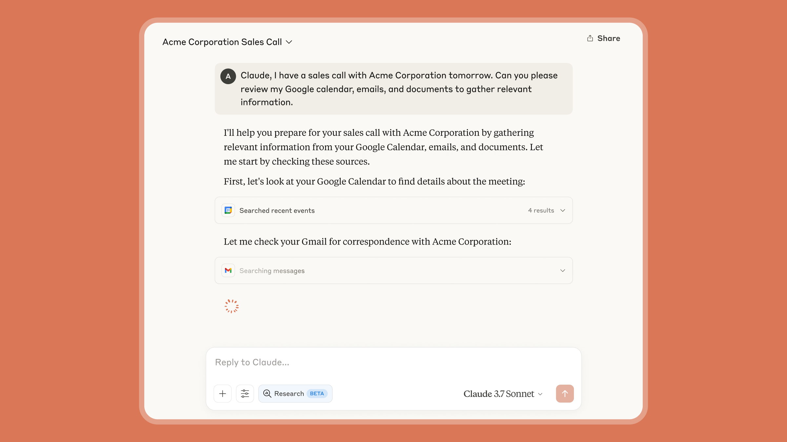
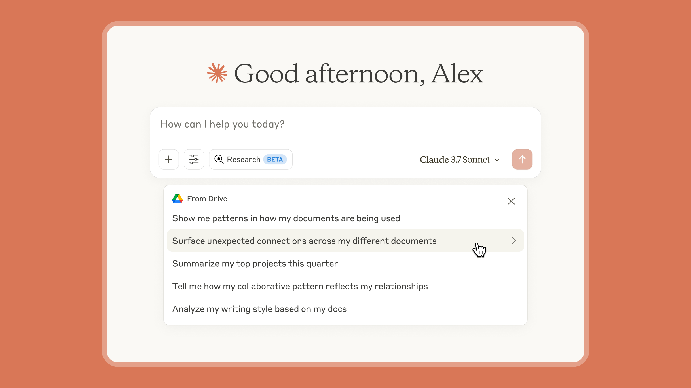

# Claude 把研究带向新境界（中英对照）

> **原文标题：** Claude takes research to new places
> **作者：** Anthropic（原文未署名）
> **原文链接：** https://claude.com/blog/research
> **发布日期：** 2025-04-15
> **翻译模型：** GLM-5.3
> 排版：每段英文原文在前，中文翻译紧随其后。术语保留英文原文并附中文释义。

---

Claude can now conduct in-depth Research by searching across the web and your Google Workspace to deliver comprehensive answers in minutes. Earlier this year, we introduced our vision for Claude as your collaborative partner that delivers hours of work in minutes.

Claude 现在可以开展深入的 Research（研究），通过搜索网络和你的 Google Workspace，在几分钟内交付全面的答案。今年早些时候，我们提出了我们的愿景：让 Claude 成为你的协作伙伴，把数小时的工作缩短到几分钟完成。

Claude can now conduct in-depth Research by searching across the web and your Google Workspace to deliver comprehensive answers in minutes.

Claude 现在可以开展深入的 Research（研究），通过搜索网络和你的 Google Workspace，在几分钟内交付全面的答案。

Earlier this year, we introduced our vision for Claude as your collaborative partner that delivers hours of work in minutes. In line with this vision, we're continuing to expand the context that Claude has access to, as well as the kinds of outputs you can generate with Claude to support your personal and professional work.

今年早些时候，我们提出了我们的愿景：让 Claude 成为你的协作伙伴，把数小时的工作缩短到几分钟完成。秉承这一愿景，我们正在持续扩展 Claude 可访问的上下文，以及你可以用 Claude 生成的产出类型，以支持你的个人与职业工作。

Today, we're introducing two new capabilities that make Claude a more informed and capable collaborator — Research and a Google Workspace integration that connects your email, calendar, and documents to Claude. With Research, Claude can search across both your internal work context and the web to help you make decisions and take action faster than before.

今天，我们推出两项新能力，让 Claude 成为更有见识、更有能力的协作者--Research（研究）功能，以及把你的邮件、日历和文档连接到 Claude 的 Google Workspace 集成。借助 Research，Claude 可以同时搜索你的内部工作上下文和网络，帮助你比以往更快地做出决策并采取行动。

## 研究功能（Research）

Research transforms how Claude finds and reasons with information. Claude operates agentically, conducting multiple searches that build on each other while determining exactly what to investigate next. It explores different angles of your question automatically and works through open questions systematically. This approach delivers thorough answers, complete with easy-to-check citations so you can trust Claude's findings.

Research 改变了 Claude 查找信息并基于信息进行推理的方式。Claude 以智能体方式（agentically）运行：执行多次相互衔接的搜索，同时准确判断接下来要调查什么。它会自动从不同角度探索你的问题，并系统地解决悬而未决的问题。这种方式能交付详尽的答案，并附带易于核查的引用，让你可以信任 Claude 的结论。

Research delivers high-quality, comprehensive answers in minutes, making it practical for the multiple research tasks you tackle throughout your workday. It's this balance of speed and quality that sets it apart.

Research 能在几分钟内交付高质量、全面的答案，使其适用于你工作日中要处理的多项研究任务。正是这种速度与质量的平衡让它脱颖而出。

## Google Workspace

Claude now integrates with Gmail and Calendar, in addition to Google Docs – helping it gain deeper insight into your work context. By connecting Google Workspace, Claude can securely search emails, review documents, and see your calendar commitments – eliminating the need to manually upload files or repeatedly provide context about your work and schedule.

除 Google Docs 之外，Claude 现在还集成了 Gmail 和 Calendar--这帮助它更深入地了解你的工作上下文。通过连接 Google Workspace，Claude 可以安全地搜索邮件、审阅文档并查看你的日历安排--无需再手动上传文件，或反复提供关于你工作和日程的背景信息。

Ask Claude to pull together meeting notes from last week, identify action items from follow-up email threads, and search relevant documents for additional context. Claude brings these insights directly to you, eliminating hours of manual work and letting you focus on strategic planning instead of information gathering. Claude will provide inline citations that you can use to verify the source, so that you can trust Claude is working from the most recent context.

你可以让 Claude 汇总上周的会议记录、从后续往来的邮件串中识别行动项，并搜索相关文档以获取更多背景。Claude 会把这些洞察直接呈现给你，省去数小时的手工劳动，让你专注于战略规划而非信息收集。Claude 会提供行内引用（inline citation）供你核实来源，因此你可以相信 Claude 依据的是最新的上下文。

Using Research with Google Workspace:

将 Research 与 Google Workspace 结合使用：

- Marketing teams can plan for product launches faster by having Claude gather competitive intelligence from the web while pulling relevant product specs, positioning, and strategy documents to create comprehensive launch plans.
- Sales teams can prepare for client meetings more efficiently by having Claude search through correspondence history, calendar invitations with meeting notes, and the latest updates about the prospect's company to create detailed briefing documents.
- Engineers can create technical solutions that integrate with existing systems by having Claude analyze design documents and system specifications alongside external API documentation, implementation patterns, and security best practices.
- University students can learn new topics by working with Claude to analyze learning materials and notes from past courses, while searching for the latest academic research, interactive learning resources, and expert explanations to create personalized study plans.
- Parents can streamline personal organization by having Claude scan emails and calendar events to highlight important commitments, while searching the web for updated school calendars, local community events, and weather forecasts that might affect family plans.

- 市场团队可以让 Claude 从网络收集竞争情报，同时调取相关的产品规格、定位和战略文档来制定全面的发布计划，从而更快地规划产品发布。
- 销售团队可以让 Claude 检索往来通信记录、带会议记录的日历邀请，以及关于潜在客户公司的最新动态，从而生成详细的简报文档，更高效地为客户会议做准备。
- 工程师可以让 Claude 在分析设计文档和系统规格的同时，参考外部 API 文档、实现模式和安全最佳实践，从而创建能与现有系统集成的技术方案。
- 大学生可以与 Claude 一起分析学习材料和以往课程的笔记，同时搜索最新的学术研究、交互式学习资源和专家讲解来制定个性化学习计划，从而学习新主题。
- 家长可以让 Claude 扫描邮件和日历事件以突出重要安排，同时在网上搜索更新的学校校历、本地社区活动和可能影响家庭计划的天气预报，从而简化个人事务管理。

## Google Docs 目录化（Google Docs cataloging）

In addition to Research and Google Workspace, Claude Enterprise administrators can activate cataloging to improve Claude's retrieval quality and accuracy. When cataloging is enabled, Claude leverages a specialized index of your organization's documents to find the information you need—even when it's buried in lengthy documents or scattered across multiple files.

除了 Research 和 Google Workspace 之外，Claude Enterprise 管理员还可以启用目录化（cataloging）来提升 Claude 的检索质量和准确性。启用目录化后，Claude 会利用你组织文档的专用索引来查找所需信息--即使这些信息深埋在冗长的文档中或散落在多个文件里。

This technology utilizes secure retrieval augmented generation techniques to enable Claude to search across your document ecosystem, without requiring you to specify exact files. With enterprise-grade security that keeps your data within your control, Claude maintains the confidentiality of your organization's knowledge while delivering precise answers.

该技术采用安全的检索增强生成（retrieval augmented generation，RAG）技术，使 Claude 能够在你的文档生态系统中进行搜索，而无需你指定具体文件。凭借让数据始终处于你掌控之下的企业级安全，Claude 在交付精确答案的同时，守住你组织知识的机密性。

## 入门（Getting started）

This is just the beginning of updates to make Claude an even better collaborator. In the coming weeks, we'll expand the range of content sources available and the ability for Claude to do research in more depth.

这只是让 Claude 成为更出色协作者的更新的开始。未来几周，我们将扩展可用的内容源范围，并增强 Claude 进行更深入研究的能力。

Research is now available in early beta for Max, Team, and Enterprise plans in the United States, Japan, and Brazil. Simply toggle on the Research setting in chat.

Research 现已在美国、日本和巴西面向 Max、Team 和 Enterprise 计划推出早期 beta 版。只需在聊天中打开 Research 设置即可。

Web search, which launched in the United States in March, is now available in Brazil and Japan and is automatically enabled for paid plans in these regions. Claude for Work administrators must enable web search for your organization in settings.

今年 3 月在美国上线的网页搜索（web search）现已覆盖巴西和日本，并在这些地区为付费计划自动启用。Claude for Work 管理员必须在设置中为你的组织启用网页搜索。

The Google Workspace integration is available in beta to all paid users in profile settings. Team and Enterprise plan admins must enable Google Workspace access domain-wide before individual users connect their accounts. Claude Enterprise plan admins can enable Google Docs cataloging for the entire organization.

Google Workspace 集成已在个人资料设置中面向所有付费用户推出 beta 版。Team 和 Enterprise 计划管理员必须先在全域范围启用 Google Workspace 访问，个人用户才能连接自己的账号。Claude Enterprise 计划管理员可以为整个组织启用 Google Docs 目录化。
