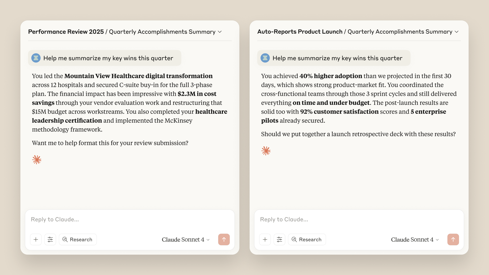
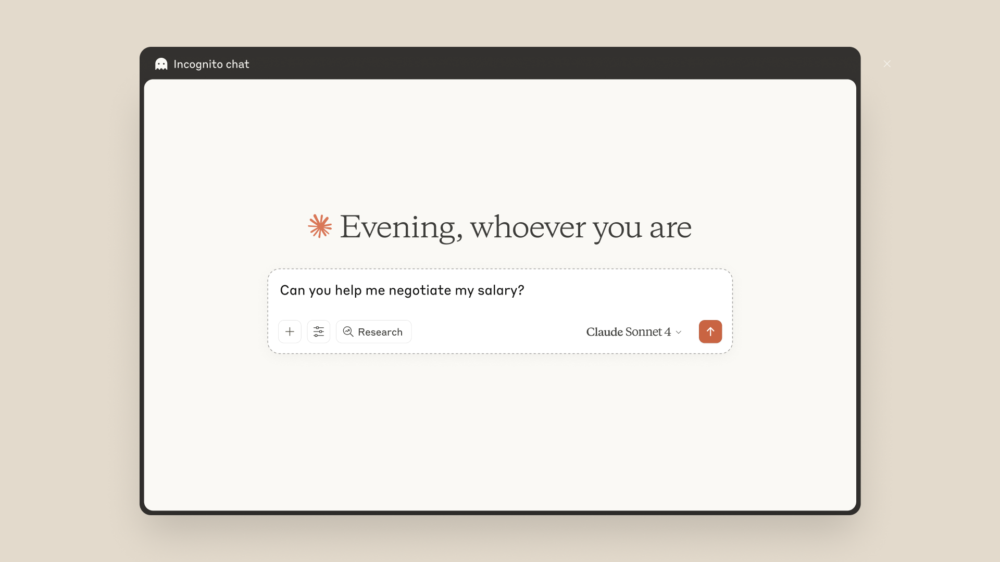

# 为 Claude 带来记忆（中英对照）

> **原文标题：** Bringing memory to Claude
> **作者：** Anthropic（原文未署名）
> **原文链接：** https://claude.com/blog/memory
> **发布日期：** 2025-09-11
> **翻译模型：** GLM-5.3
> 排版：每段英文原文在前，中文翻译紧随其后。术语保留英文原文并附中文释义。

---

Today, we're introducing memory to the Claude app, where Claude remembers you and your team's projects and preferences, eliminating the need to re-explain context and keeping complex work moving forward.

今天，我们为 Claude 应用引入 memory（记忆）功能：Claude 会记住你和你的团队的项目与偏好，无需重复解释上下文，让复杂工作持续推进。

Whether you're iterating on a strategy proposal, debugging an issue, or managing multiple projects, Claude picks up right where you left off. Like Team and Enterprise users, you get project-scoped memory (each project has its own separate memory), full control to view and edit what Claude remembers, and incognito chat for conversations that don't save to memory. Before this rollout, we ran extensive safety testing across sensitive wellbeing-related topics and edge cases—including whether memory could reinforce harmful patterns in conversations, lead to over-accommodation, and enable attempts to bypass our safeguards. Through this testing, we identified areas where Claude's responses needed refinement and made targeted adjustments to how memory functions. These iterations helped us build and improve the memory feature in a way that allows Claude to provide helpful and safe responses to users.To get started, enable memory in Settings.

无论你是在迭代一份策略提案、调试一个问题，还是管理多个项目，Claude 都会从你上次停下的地方继续。与 Team 和 Enterprise 用户一样，你将获得项目级记忆（project-scoped memory，每个项目都有自己独立的记忆）、查看和编辑 Claude 所记内容的完整控制权，以及不会保存到记忆的无痕聊天（incognito chat）。在本次推出之前，我们围绕敏感的身心健康相关话题和边界情况进行了广泛的安全测试--包括记忆是否会在对话中强化有害模式、导致过度迎合，以及是否可能被用于绕过我们的安全防护。通过这些测试，我们找出了 Claude 回复需要改进的地方，并对记忆功能的工作方式进行了针对性调整。这些迭代帮助我们构建并改进了记忆功能，使 Claude 能够为用户提供有帮助且安全的回复。要开始使用，请在设置中开启记忆。

Today, we're introducing memory to the Claude app, where Claude remembers you and your team's projects and preferences, eliminating the need to re-explain context and keeping complex work moving forward.

今天，我们为 Claude 应用引入 memory（记忆）功能：Claude 会记住你和你的团队的项目与偏好，无需重复解释上下文，让复杂工作持续推进。

Memory is fully optional, with granular user controls that help you manage what Claude remembers. We're also introducing Incognito chats that don't appear in your conversation history or save to memory.

记忆功能完全可选，并配有细粒度的用户控制，帮助你管理 Claude 记住的内容。我们还在推出无痕聊天（Incognito chats），它不会出现在你的对话历史中，也不会保存到记忆。

Memory is rolling out to Team and Enterprise plan users starting today. Enterprise admins can choose whether to disable memory for their organization at any time. Incognito chat is available to all Claude users.

记忆功能从今天起面向 Team 和 Enterprise 计划用户推出。Enterprise 管理员可以随时选择是否为其组织禁用记忆。无痕聊天面向所有 Claude 用户开放。

## 为工作而生的记忆（Memory built for work）

With memory, Claude focuses on learning your professional context and work patterns to maximize productivity. It remembers your team's processes, client needs, project details, and priorities. Sales teams keep client context across deals, product teams maintain specifications across sprints, and executives track initiatives without constantly rebuilding context.

借助记忆，Claude 专注于学习你的职业背景和工作模式，以最大化生产力。它会记住你团队的流程、客户需求、项目细节和优先事项。销售团队在多笔交易之间保持客户背景，产品团队跨冲刺（sprint）维护产品规格，高管们则无需不断重建背景信息就能持续跟进各项计划。

If you use projects, Claude creates a separate memory for each project. This ensures that your product launch planning stays separate from client work, and confidential discussions remain separate from general operations. These project boundaries help you and your teams manage complex, concurrent initiatives without mixing unrelated details, serving as a safety guardrail that keeps sensitive conversations contained.

如果你使用项目（projects）功能，Claude 会为每个项目创建独立的记忆。这确保你的产品发布规划与客户工作相互分开，机密讨论与日常运营彼此隔离。这些项目边界帮助你和你所在的团队管理复杂、并行的多项工作而不会混入无关细节，同时充当一道安全护栏，把敏感对话控制在各自范围内。

Claude uses a memory summary to capture all its memories in one place for you to view and edit. In your settings, you can see exactly what Claude remembers from your conversations, and update the summary at any time by chatting with Claude. Based on what you tell Claude to focus on or to ignore, Claude will adjust the memories it references.

Claude 使用一份记忆摘要（memory summary）把它的全部记忆集中在一处，供你查看和编辑。在设置中，你可以清楚地看到 Claude 从你的对话中记住了什么，并随时通过与 Claude 聊天来更新摘要。根据你告诉 Claude 要关注或忽略的内容，Claude 会调整它所引用的记忆。

## 无痕聊天（Incognito chat）

Sometimes you need Claude's help without using or adding to memory. Incognito chat gives you a clean slate for conversations that you don't want to preserve in memory. It is perfect for sensitive brainstorming, confidential strategy discussions, or when you simply want a fresh conversation without context from previous chats. Your regular memory and conversation history remain untouched. If you're using memory on a Team or Enterprise plan, your standard data retention settings apply.

有时你需要在不使用记忆、也不向记忆添加内容的情况下获得 Claude 的帮助。无痕聊天为那些你不想保留在记忆中的对话提供一张白纸。它非常适合敏感的头脑风暴、机密的战略讨论，或者你只是想开启一段不带以往聊天背景的新对话。你的常规记忆和对话历史不会受到任何影响。如果你在 Team 或 Enterprise 计划中使用记忆，你标准的数据保留设置仍然适用。

## 从工作中的团队开始（Starting with teams at work）

Memory introduces new safety considerations and we've designed the feature to be useful in work settings, while avoiding sensitive conversations and topics. We're also taking a thoughtful phased approach to ensure these powerful capabilities are deployed responsibly, and will continue to evaluate and test how memory works across the different ways people use Claude before expanding availability.

记忆功能带来了新的安全考量。我们将该功能设计为在工作场景中实用，同时避开敏感的对话和话题。我们还在采取审慎的分阶段方式，确保这些强大的能力被负责任地部署，并会在扩大可用范围之前，持续评估和测试记忆在人们使用 Claude 的各种不同方式下的表现。

## 入门（Getting started）

To see memory in action, enable the feature in Settings, and let Claude generate memory with your past chats at initial set-up. Ask Claude questions like "what were we working on last week?" to see what Claude remembers across your existing chats and connected tools. If you would like to bring your memory details over from a different AI tool or export your memory from Claude for backup or migration, you can follow these instructions.

要体验记忆功能，请在设置中开启该功能，并在初始设置时让 Claude 根据你过去的聊天生成记忆。向 Claude 提出诸如"我们上周在做什么？"之类的问题，看看 Claude 在你现有的聊天和已连接的工具中记住了什么。如果你想从其他 AI 工具迁移你的记忆详情，或者从 Claude 导出记忆用于备份或迁移，可以按照这些说明操作。

Great work builds over time. With memory, each conversation with Claude improves the next.

出色的工作是日积月累的。有了记忆，与 Claude 的每一次对话都会让下一次更好。
