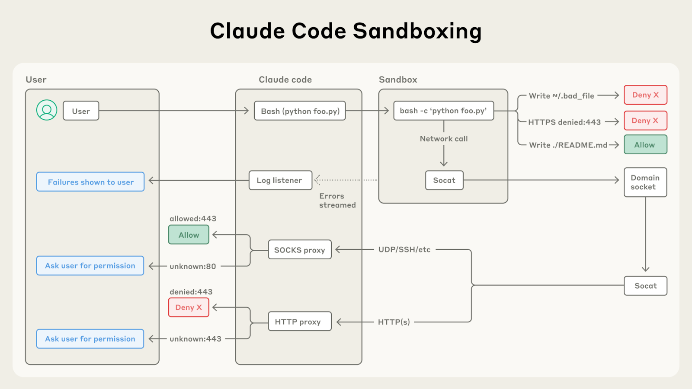
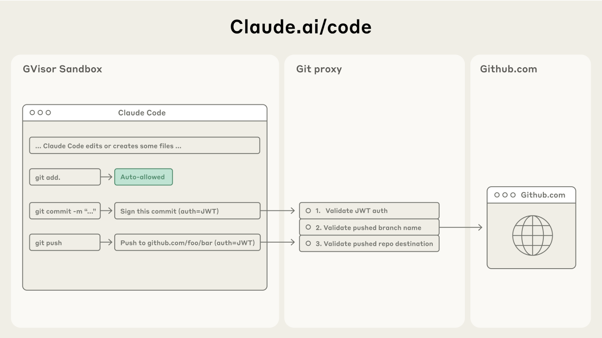

# 超越权限提示：让 Claude Code 更安全也更自主（中英对照）

> **原文标题：** Beyond permission prompts: making Claude Code more secure and autonomous
> **作者：** Anthropic（原文未署名）
> **原文链接：** https://claude.com/blog/beyond-permission-prompts-making-claude-code-more-secure-and-autonomous
> **发布日期：** 2025-10-08
> **翻译模型：** GLM-5.3
> 排版：每段英文原文在前，中文翻译紧随其后。术语保留英文原文并附中文释义。

---

See Claude Code in action—from concept to commit in one seamless workflow.

观看 Claude Code 的实际运行--从概念到提交，一气呵成的工作流。

In Claude Code, Claude writes, tests, and debugs code alongside you, navigating your codebase, editing multiple files, and running commands to verify its work. Giving Claude this much access to your codebase and files can introduce risks, especially in the case of prompt injection, such as Claude deleting files you didn't intend.

在 Claude Code 中，Claude 与你并肩编写、测试和调试代码：遍历你的代码库、编辑多个文件、运行命令来验证自己的工作。给 Claude 这么大的代码库和文件访问权限可能引入风险，尤其是在提示词注入（prompt injection）的场景下，比如 Claude 删掉你并不想删除的文件。

To help address this, we've introduced two new features in Claude Code built on top of sandboxing, both of which are designed to provide a more secure place for developers to work, while also allowing Claude to run more autonomously and with fewer permission prompts. ByThese features are examples of native sandboxing: defining set boundaries within which Claude can work freely, they increase security and agency..

为帮助解决这一问题，我们在 Claude Code 中引入了两个构建于沙箱（sandboxing）之上的新特性，二者都旨在为开发者提供一个更安全的工作环境，同时让 Claude 更自主地运行、减少权限提示（permission prompt）。这些特性是原生沙箱（native sandboxing）的范例：通过划定 Claude 可以自由工作的固定边界，它们同时提升了安全性与自主性。

# 我们目前保障用户安全的做法（Our current approach to keeping users secure）

Claude Code runs on a permission-based model: by default, it's read-only, which means it asks for permission before making modifications or running any commands. There are some exceptions to this: we use static analysis to auto-allow safe commands like echo or cat, but most operations still need explicit approval.

Claude Code 基于权限模型运行：默认情况下它是只读的，也就是说，在做任何修改或运行任何命令之前都会先请求许可。也有一些例外：我们用静态分析自动放行 echo、cat 这类安全命令，但大多数操作仍需要明确批准。

But constantly clicking "approve" slows down development and can lead to 'approval fatigue', where users might not pay close attention to what they're approving. To make Claude Code both safer and more effective, we wanted to find a better method.

但不停地点"批准"会拖慢开发，还可能导致"批准疲劳（approval fatigue）"--用户可能不再仔细看自己批准的到底是什么。为了让 Claude Code 既更安全又更高效，我们想找到一种更好的方法。

# 沙箱：一种更安全也更自主的方案（Sandboxing: a safer and more autonomous approach）

Sandboxing creates pre-defined boundaries within which Claude can work more freely, instead of asking for permission for each action.

沙箱划定了预定义的边界，Claude 可以在边界内更自由地工作，而无需为每个动作逐一请求许可。

With our update to Claude Code, we're shifting to this approach. We're building Our approach to sandboxing is built on top of operating system-level features to enable two new features, each of which are based on the followingtwo sets of boundariesmain things:

在这次 Claude Code 更新中，我们正转向这种方式。我们的沙箱方案构建在操作系统级特性之上，以此支撑两个新特性，它们分别基于下面两组边界：

- Filesystem isolation, which ensures that Claude can only access or modify specific directories. This is particularly important in preventing a prompt-injected Claude from modifying sensitive system files.
- Network isolation, which ensures that Claude can only connect to approved servers. This prevents a prompt-injected Claude from leaking sensitive information or downloading malware.

- 文件系统隔离（filesystem isolation），确保 Claude 只能访问或修改特定目录。这对防止被提示词注入的 Claude 篡改敏感系统文件尤为重要。
- 网络隔离（network isolation），确保 Claude 只能连接到经过批准的服务器。这可以防止被提示词注入的 Claude 泄露敏感信息或下载恶意软件（malware）。

It is worth noting that effective sandboxing requires both filesystem and network isolation. Without network isolation, a compromised agent could exfiltrate sensitive files like SSH keys; without filesystem isolation, a compromised agent could easily escape the sandbox and gain network access. It's by using both techniques that we can provide a safer agentic experience for Claude Code users.

值得注意的是，有效的沙箱需要文件系统隔离和网络隔离两者兼备。没有网络隔离，被攻陷的智能体可能外传 SSH 密钥这类敏感文件；没有文件系统隔离，被攻陷的智能体可以轻易逃出沙箱、获得网络访问。只有两种手段并用，我们才能为 Claude Code 用户提供更安全的智能体（agentic）体验。

## Claude Code 中的两个新沙箱特性（Two new sandboxing features in Claude Code）

### 沙箱化的 bash 工具：无需权限提示的安全 bash 执行（Sandboxed bash tool: safe bash execution without permission prompts）

Today, We're introducing a new sandbox runtime, available in research preview, that lets you define exactly which directories and network hosts your agent can access, without the overhead of spinning up and managing a container. This can be used to sandbox arbitrary processes, agents and MCP servers. It is now available as an open source research preview here: [Github link?]In Claude Code, we use this runtime to sandbox the bash tool, which allows Claude to run commands within the defined limits you set. These commands are safer by default, they require fewer user permission prompts, so Claude can run more autonomously. If Claude tries to access something outside of the sandbox, you'll be notified immediately, and can choose whether or not to allow it.

今天，我们推出一个新的沙箱运行时（sandbox runtime），目前处于 research preview 阶段。它让你能精确定义智能体可访问哪些目录和网络主机，而无须承担启动和管理容器的开销。它可以用来沙箱化任意进程、智能体和 MCP 服务器。它现已作为开源 research preview 在这里发布：[Github link?]在 Claude Code 中，我们用这个运行时对 bash 工具做了沙箱化，使 Claude 可以在你设定的限制内运行命令。这些命令默认更安全，需要的用户权限提示更少，因此 Claude 能更自主地运行。如果 Claude 试图访问沙箱之外的东西，你会立即收到通知，并可自行决定是否允许。

We've built this on top of OS level primitives such as Linux bubblewrap and MacOS seatbelt to enforce these restrictions at the OS level. They cover not just Claude Code's direct interactions, but also any scripts, programs, or subprocesses that are spawned by the command.As described above, this sandbox enforces both:

我们把它构建在操作系统级原语之上，例如 Linux 的 bubblewrap 和 macOS 的 seatbelt，在操作系统层面强制执行这些限制。它们不仅覆盖 Claude Code 的直接交互，也覆盖该命令派生的任何脚本、程序或子进程。如上所述，这个沙箱同时强制执行：

- Filesystem isolation, by allowing read and write access to the current working directory, but blocking the modification of any files outside of it.
- Network isolation, by only allowing internet access through a unix domain socket connected to a proxy server running outside the sandbox. This proxy server enforces restrictions on the domains that a process can connect to, and handles user confirmation for newly requested domains. IAnd if you'd like further-increased security, we alsoeven support customizing this proxy to enforce arbitrary rules on outgoing traffic.

- 文件系统隔离：允许对当前工作目录的读写访问，但阻止修改目录之外的任何文件。
- 网络隔离：只允许通过一个 unix domain socket（域套接字）访问互联网，该套接字连接到运行在沙箱之外的代理服务器。这个代理服务器对进程可连接的域名施加限制，并处理新请求域名的用户确认。如果你想要更高的安全性，我们还支持自定义这个代理，对出站流量执行任意规则。

Both components are configurable: you can easily choose to allow or disallow specific file paths or domains.

两个组件都可配置：你可以轻松选择允许或禁止特定的文件路径或域名。

Sandboxing ensures that even a successful prompt injection is fully isolated, and cannot impact overall user security. This way, a compromised Claude Code can't steal your SSH keys, or phone home to an attacker's server.

沙箱确保即使提示词注入得手，也被完全隔离，无法影响用户的整体安全。这样一来，被攻陷的 Claude Code 偷不走你的 SSH 密钥，也无法回连（phone home）到攻击者的服务器。

To get started with this feature, run: claude --sandbox, and read more technical details about our security model here.

要开始使用这个特性，请运行：claude --sandbox，并可在此处阅读我们安全模型的更多技术细节。

To make it easier for other teams to build safer agents, we have open sourced [XXX]. We believe that other AI companies should consider adopting this technology for their own agents in order to enhance the security posture of their agents.

为了让其他团队更容易构建更安全的智能体，我们已将 [XXX] 开源。我们相信其他 AI 公司也应考虑为自己的智能体采用这项技术，以提升智能体的安全态势（security posture）。

### Claude Code 网页版：在云端安全运行 Claude Code（Claude Code on the web: running Claude Code securely in the cloud）

Today, we're also releasing Claude Code on the web, enabling users to run Claude Code in an isolated sandbox in the cloud. Claude Code on the web executes each Claude Code session in an isolated sandbox where it has full access to its server in a safe and secure way. We've designed this sandbox to ensure that sensitive credentials (such as git credentials or signing keys) are never inside the sandbox with Claude Codenever enter the sandbox environment. This way, even if the code running in the sandbox is compromised, the user is kept safe from further harm.

今天，我们还在发布 Claude Code 网页版（Claude Code on the web），让用户能够在云端的隔离沙箱中运行 Claude Code。Claude Code 网页版把每个 Claude Code 会话放在一个隔离沙箱中执行，在其中它可以安全地完整访问自己的服务器。我们设计这个沙箱是为了确保敏感凭据（例如 git 凭据或签名密钥）绝不会与 Claude Code 一起处于沙箱之内、绝不进入沙箱环境。这样一来，即使沙箱中运行的代码被攻陷，用户也不会受到进一步伤害。

Claude Code on the web uses a custom proxy service that transparently handles all git interactions. Inside the sandbox, the git client authenticates to this service with a custom-built scoped credential. The proxy verifies this credential and the contents of the git interaction (e.g. ensuring it is only pushing to the configured branch), then attaches the right authentication token before sending the request to GitHub.

Claude Code 网页版使用一个定制代理服务，透明地处理所有 git 交互。在沙箱内部，git 客户端使用一个专门构建的受限凭据（scoped credential）向该服务认证。代理验证这个凭据以及 git 交互的内容（例如确保只推送到配置的分支），然后在把请求发给 GitHub 之前附上正确的认证令牌。

# 开始使用（Getting started）

Our new sandboxed bash tool and Claude Code on the web offer substantial improvements in both security and productivity for developers using Claude for their engineering work.

我们新的沙箱化 bash 工具和 Claude Code 网页版，为用 Claude 做工程工作的开发者在安全性和生产力两方面都带来了实质提升。

To get started with these tools:

要开始使用这些工具：

- Run `claude --sandbox` and check out our docs on how to configure this sandbox.
- Go to claude.com/code to try out Claude Code on the web.

- 运行 `claude --sandbox`，并查阅我们关于如何配置这个沙箱的文档。
- 访问 claude.com/code，试用 Claude Code 网页版。

Or, if you're building your own agents, check out our open-sourced sandboxing code, and consider integrating it into your work. We look forward to seeing what you build.

或者，如果你在构建自己的智能体，可以看看我们开源的沙箱代码，并考虑把它集成到你的工作中。我们期待看到你构建出的东西。
