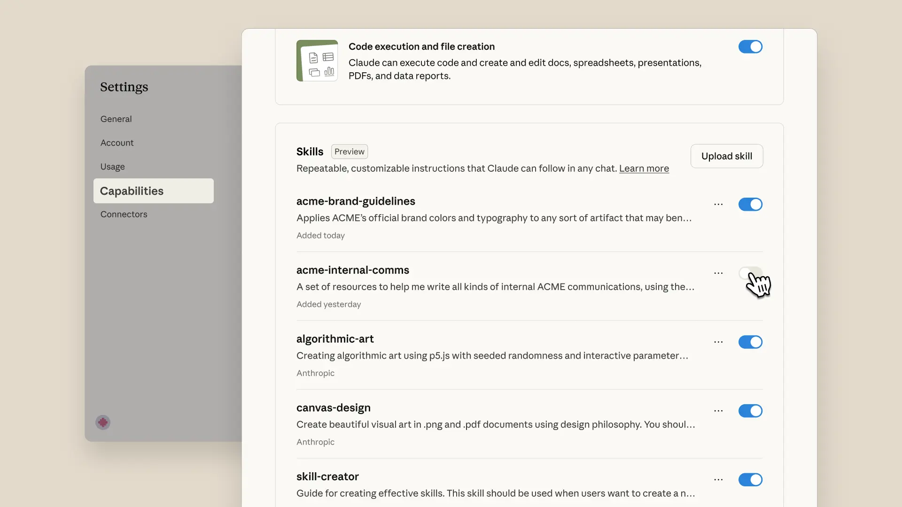

# Agent Skills 正式发布（中英对照）

> **原文标题：** Introducing Agent Skills
> **作者：** Anthropic（原文未署名）
> **原文链接：** https://claude.com/blog/skills
> **发布日期：** 2025-10-16
> **翻译模型：** GLM-5.3
> 排版：每段英文原文在前，中文翻译紧随其后。术语保留英文原文并附中文释义。

---

Claude can now use Skills to improve how it performs specific tasks. Skills are folders that include instructions, scripts, and resources that Claude can load when needed. Claude will only access a skill when it's relevant to the task at hand.

Claude 现在可以使用 Skills 来提升它执行特定任务的方式。Skills 是包含指令、脚本和资源的文件夹，Claude 可以在需要时加载它们。只有当某个 skill 与当前任务相关时，Claude 才会访问它。

Update: We've added organization-wide management for skills, a directory featuring partner-built skills, and published Agent Skills as an open standard for cross-platform portability. (December 18, 2025)

更新：我们新增了面向整个组织的 skill 管理功能、一个收录合作伙伴构建的 skill 的目录，并将 Agent Skills 发布为开放标准，以实现跨平台可移植性。（2025 年 12 月 18 日）

Claude can now use Skills to improve how it performs specific tasks. Skills are folders that include instructions, scripts, and resources that Claude can load when needed.

Claude 现在可以使用 Skills（技能）来提升它执行特定任务的方式。Skills 是包含指令、脚本和资源的文件夹，Claude 可以在需要时加载它们。

Claude will only access a skill when it's relevant to the task at hand. When used, skills make Claude better at specialized tasks like working with Excel or following your organization's brand guidelines.

只有当某个 skill 与当前任务相关时，Claude 才会访问它。使用时，skills 能让 Claude 更擅长专门的任务，比如处理 Excel 或遵循你组织的品牌规范。

You've already seen Skills at work in Claude apps, where Claude uses them to create files like spreadsheets and presentations. Now, you can build your own skills and use them across Claude apps, Claude Code, and our API.

你已经在 Claude 应用中见过 Skills 的实际运作--Claude 用它们来创建电子表格和演示文稿等文件。现在，你可以构建自己的 skill，并在 Claude 应用、Claude Code 和我们的 API 中使用它们。

# Skills 如何运作（How Skills work）

While working on tasks, Claude scans available skills to find relevant matches. When one matches, it loads only the minimal information and files needed—keeping Claude fast while accessing specialized expertise.

在处理任务时，Claude 会扫描可用的 skills 以寻找相关的匹配。一旦匹配，它只加载所需的最少信息和文件--在获取专门知识的同时保持 Claude 的速度。

Skills are:

Skills 具有以下特点：

- Composable: Skills stack together. Claude automatically identifies which skills are needed and coordinates their use.
- Portable: Skills use the same format everywhere. Build once, use across Claude apps, Claude Code, and API.
- Efficient: Only loads what's needed, when it's needed.
- Powerful: Skills can include executable code for tasks where traditional programming is more reliable than token generation.

- 可组合（Composable）：Skills 可以叠加使用。Claude 会自动识别需要哪些 skills，并协调它们的使用。
- 可移植（Portable）：Skills 在各处使用同一格式。一次构建，即可在 Claude 应用、Claude Code 和 API 中使用。
- 高效（Efficient）：只在需要的时候加载所需的内容。
- 强大（Powerful）：对于传统编程比 token 生成更可靠的任务，Skills 可以包含可执行代码。

Think of Skills as custom onboarding materials that let you package expertise, making Claude a specialist on what matters most to you. For a technical deep-dive on the Agent Skills design pattern, architecture, and development best practices, read our engineering blog.

可以把 Skills 想象成定制的入职材料：它让你把专业知识打包，使 Claude 成为对你最重要领域的专家。想从技术层面深入了解 Agent Skills（智能体技能）的设计模式、架构和开发最佳实践，请阅读我们的工程博客。

# Skills 适用于每一个 Claude 产品（Skills work with every Claude product）

## Claude 应用（Claude apps）

Skills are available to Pro, Max, Team and Enterprise users. We provide skills for common tasks like document creation, examples you can customize, and the ability to create your own custom skills.

Skills 面向 Pro、Max、Team 和 Enterprise 用户开放。我们为文档创建等常见任务提供现成的 skills、可供定制的示例，以及创建你自己的自定义 skill 的能力。

Claude automatically invokes relevant skills based on your task—no manual selection needed. You'll even see skills in Claude's chain of thought as it works.Creating skills is simple. The "skill-creator" skill provides interactive guidance: Claude asks about your workflow, generates the folder structure, formats the SKILL.md file, and bundles the resources you need. No manual file editing required.

Claude 会根据你的任务自动调用相关的 skill--无需手动选择。你甚至会在 Claude 工作时在它的思维链（chain of thought）中看到 skills 的身影。创建 skill 很简单。"skill-creator" skill 提供交互式引导：Claude 询问你的工作流，生成文件夹结构，格式化 SKILL.md 文件，并打包你需要的资源。无需手动编辑文件。

Enable Skills in Settings. For Team and Enterprise users, admins must first enable Skills organization-wide.

在设置中开启 Skills。对于 Team 和 Enterprise 用户，管理员必须先在组织范围内启用 Skills。

## Claude 开发者平台（API）（Claude Developer Platform (API)）

Agent Skills, which we often refer to simply as Skills, can now be added to Messages API requests and the new /v1/skills endpoint gives developers programmatic control over custom skill versioning and management. Skills require the Code Execution Tool beta, which provides the secure environment they need to run.

Agent Skills（我们通常简称为 Skills）现在可以被添加到 Messages API 请求中，新的 /v1/skills 端点（endpoint）让开发者能够以编程方式控制自定义 skill 的版本管理。Skills 需要 Code Execution Tool（代码执行工具）beta 版，它为 skill 的运行提供所需的安全环境。

Use Anthropic-created skills to have Claude read and generate professional Excel spreadsheets with formulas, PowerPoint presentations, Word documents, and fillable PDFs. Developers can create custom Skills to extend Claude's capabilities for their specific use cases.

使用 Anthropic 创建的 skills，让 Claude 读取并生成带公式的专业 Excel 电子表格、PowerPoint 演示文稿、Word 文档和可填写的 PDF。开发者也可以创建自定义 Skills，针对自己的具体用例扩展 Claude 的能力。

Developers can also easily create, view, and upgrade skill versions through the Claude Console.

开发者还可以通过 Claude Console 轻松创建、查看和升级 skill 版本。

Explore the documentation , our skills cookbook, or Anthropic Academy to learn more.

请探索文档、我们的 skills cookbook，或 Anthropic Academy 以了解更多。

Skills teaches Claude how to work with Box content. Users can transform stored files into PowerPoint presentations, Excel spreadsheets, and Word documents that follow their organization's standards—saving hours of effort.

Skills 教会 Claude 如何处理 Box 内容。用户可以把存储的文件转换成符合组织标准的 PowerPoint 演示文稿、Excel 电子表格和 Word 文档--省下数小时的工作量。

Canva plans to leverage Skills to customize agents and expand what they can do. This unlocks new ways to bring Canva deeper into agentic workflows—helping teams capture their unique context and create stunning, high-quality designs effortlessly.

Canva 计划利用 Skills 来定制智能体并扩展它们能做的事。这开启了把 Canva 更深入地带入智能体工作流（agentic workflow）的新方式--帮助团队捕获他们独有的上下文，轻松创建惊艳、高质量的设计。

With Skills, Claude works seamlessly with Notion - taking users from questions to action faster. Less prompt wrangling on complex tasks, more predictable results.

借助 Skills，Claude 可以与 Notion 无缝协作--让用户更快地从问题走向行动。复杂任务上更少的提示词折腾，更可预测的结果。

Skills streamline our management accounting and finance workflows. Claude processes multiple spreadsheets, catches critical anomalies, and generates reports using our procedures. What once took a day, we can now accomplish in an hour.

Skills 精简了我们的管理会计与财务工作流。Claude 处理多个电子表格、发现关键异常，并按照我们的流程生成报告。过去要花一天的事，现在一小时就能完成。

## Claude Code

Skills extend Claude Code with your team's expertise and workflows. Install skills via plugins from the anthropics/skills marketplace. Claude loads them automatically when relevant. Share skills through version control with your team. You can also manually install skills by adding them to ~/.claude/skills. The Claude Agent SDK provides the same Agent Skills support for building custom agents.

Skills 用你团队的专业知识和工作流来扩展 Claude Code。通过 anthropics/skills 市场以插件（plugin）形式安装 skills，Claude 会在相关时自动加载它们。通过版本控制与团队共享 skills。你也可以手动安装 skills，把它们添加到 ~/.claude/skills 目录。Claude Agent SDK 为构建自定义智能体提供了同样的 Agent Skills 支持。

# 入门（Getting started）

- Claude apps: User Guide & Help Center
- API developers: Documentation
- Claude Code: Documentation
- Example Skills to customize: GitHub repository

- Claude 应用：用户指南与帮助中心
- API 开发者：文档
- Claude Code：文档
- 可自定义的示例 Skills：GitHub 仓库

# 下一步（What's next）

We're working toward simplified skill creation workflows and enterprise-wide deployment capabilities, making it easier for organizations to distribute skills across teams.

我们正在致力于简化 skill 创建工作流，并打造面向整个企业的部署能力，让组织更轻松地在各团队之间分发 skills。

Keep in mind, this feature gives Claude access to execute code. While powerful, it means being mindful about which skills you use—stick to trusted sources to keep your data safe. Learn more.

请记住，此功能让 Claude 能够执行代码。它虽然强大，但也意味着要留意你所使用的 skills--坚持使用可信来源，以确保你的数据安全。了解更多。
