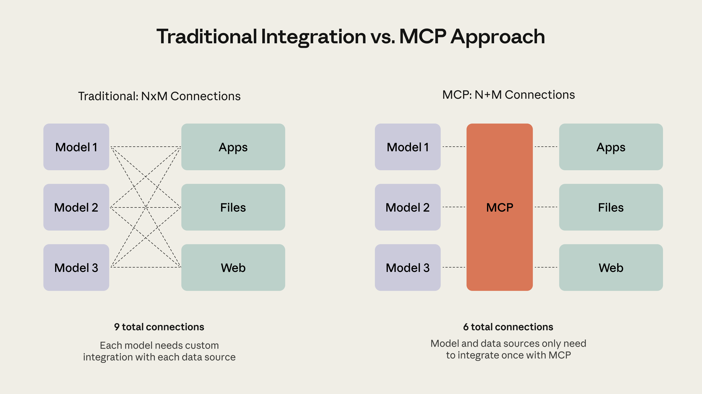
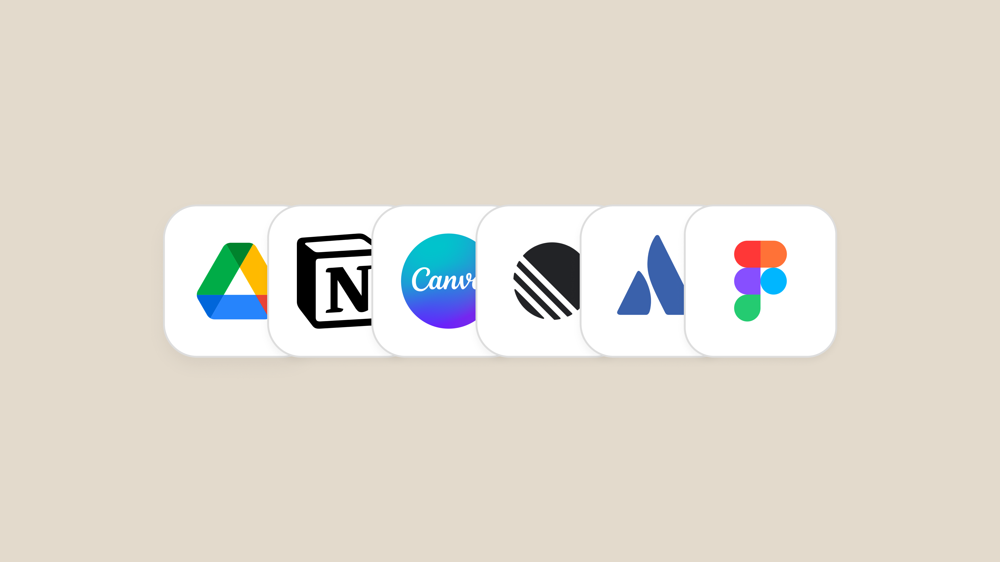

# 什么是模型上下文协议（MCP）？让 AI 连接你的世界（中英对照）

> **原文标题：** What is Model Context Protocol? Connect AI to your world
> **作者：** Anthropic（原文未署名）
> **原文链接：** https://claude.com/blog/what-is-model-context-protocol
> **发布日期：** 2025-10-31
> **翻译模型：** GLM-5.3
> 排版：每段英文原文在前，中文翻译紧随其后。术语保留英文原文并附中文释义。

---

Connect AI assistants to your tools without custom integrations using Model Context Protocol. AI models are only as good as the context provided to them. AI assistants like Claude can answer questions and perform an impressive range of tasks, but if they can't access the data or tools they need,...

使用 Model Context Protocol（模型上下文协议），无需定制集成即可将 AI 助手连接到你的工具。AI 模型的表现取决于提供给它的上下文。像 Claude 这样的 AI 助手可以回答问题、完成种类惊人的任务，但如果无法访问所需的数据或工具……

Connect AI assistants to your tools without custom integrations using Model Context Protocol.

使用 Model Context Protocol（模型上下文协议），无需定制集成即可将 AI 助手连接到你的工具。

AI models are only as good as the context provided to them. AI assistants like Claude can answer questions and perform an impressive range of tasks, but if they can't access the data or tools they need, they're limited in what they can do for you. You typically solve this by copying and pasting context from one tab to another, whether it's editing a document in Google Drive, replying to a thread in Slack, or updating code in an IDE. This process is slow, manual, and risks leaving out important context.

AI 模型的表现取决于提供给它的上下文（context）。像 Claude 这样的 AI 助手可以回答问题、完成种类惊人的任务，但如果无法访问所需的数据或工具，它们能为你做的事就很有限。通常，你只能靠在不同标签页之间复制粘贴上下文来解决这个问题--无论是在 Google Drive 中编辑文档、在 Slack 中回复话题，还是在 IDE 中更新代码。这个过程缓慢、依赖手动操作，而且有可能遗漏重要上下文。

The Model Context Protocol (MCP) offers a solution that is open and widely available across all AI apps and assistants. In this article, you'll learn what MCP is, how it works and why it matters, and who it's for. You'll see examples of MCP in action and understand how you can start using or building with MCP today.

Model Context Protocol（MCP，模型上下文协议）提供了一种开放的解决方案，可在所有 AI 应用和助手中广泛使用。在本文中，你将了解 MCP 是什么、它如何工作、为什么重要，以及它适合谁。你将看到 MCP 的实际应用示例，并理解今天就可以如何开始使用或基于 MCP 进行构建。

# 什么是模型上下文协议（MCP）？（What is the Model Context Protocol (MCP)?）

The Model Context Protocol is an open standard that defines how LLMs communicate with external systems.

Model Context Protocol（模型上下文协议）是一个开放标准，定义了 LLM（大语言模型）如何与外部系统通信。

Think of MCP as USB-C for LLMs. Just as USB-C provides a universal connector for your phone, laptop, and other devices, MCP provides a universal format for LLMs to connect with external systems. Before USB-C, every electronic gadget had its own cable: Lightning for iPhone, micro-USB for Android, proprietary connectors for cameras. As more devices adopted USB-C, connectivity became seamless across the ecosystem.

可以把 MCP 理解为 LLM 的 USB-C。正如 USB-C 为手机、笔记本电脑和其他设备提供了一种通用接口，MCP 为 LLM 连接外部系统提供了一种通用格式。在 USB-C 出现之前，每种电子设备都有自己的线缆：iPhone 用 Lightning，Android 用 micro-USB，相机用专有接口。随着越来越多设备采用 USB-C，整个生态系统的连接变得无缝。

MCP brings this same simplicity to AI integrations. Before MCP, every application and database required custom code to connect with LLMs. Google Drive needed its own integration, Slack needed another, Figma yet another. Now, MCP provides a single, standardized format for connecting these tools to Claude and other AI applications.

MCP 把同样的简洁性带入了 AI 集成。在 MCP 出现之前，每个应用和数据库都需要定制代码才能与 LLM 连接。Google Drive 需要自己的集成，Slack 需要另一个，Figma 又需要一个。现在，MCP 提供了一种单一、标准化的格式，可以把这些工具连接到 Claude 和其他 AI 应用。

# MCP 从何而来？（Where did MCP come from?）

MCP was created at Anthropic by David Soria Parra and Justin Spahr-Summers. The idea originated from David's frustration with constantly copying code between Claude Desktop and his Integrated Development Environment (IDE). Recognizing this as a classic M×N problem where multiple applications need multiple integrations, David pitched building a protocol to solve this to Justin. They designed MCP based on the popular Language Server Protocol and open-sourced it in November 2024 with Anthropic's support to ensure the entire AI ecosystem could benefit.

MCP 由 Anthropic 的 David Soria Parra 和 Justin Spahr-Summers 创建。这个想法源于 David 的一个烦恼：他需要不断在 Claude Desktop 和他的集成开发环境（IDE）之间复制代码。David 意识到这是一个经典的 M×N 问题--多个应用需要多个集成--于是向 Justin 提议构建一个协议来解决它。他们基于广受欢迎的 Language Server Protocol（语言服务器协议）设计了 MCP，并于 2024 年 11 月在 Anthropic 的支持下将其开源，以确保整个 AI 生态系统都能受益。

# MCP 如何工作？（How does MCP work?）

MCP works through a two-sided approach. AI agents and chatbots like Claude create MCP Clients, so they can connect to applications like Notion, Canva, or Figma, who make their tools and data available through MCP Servers.

MCP 通过双边方式运作。像 Claude 这样的 AI 智能体和聊天机器人会创建 MCP Client（MCP 客户端），从而连接到 Notion、Canva 或 Figma 等应用，而这些应用则通过 MCP Server（MCP 服务器）开放自己的工具和数据。

By building an MCP Client, AI agents and chatbots can access thousands of MCP Servers built by the community, giving them a straightforward path to extend their capabilities. Agents can also reach MCP servers behind your firewall through MCP tunnels. By building an MCP Server, companies and developers can make their products readily available to AI, creating a new avenue to provide value.

通过构建 MCP Client，AI 智能体和聊天机器人可以访问由社区构建的数千个 MCP Server，从而获得一条直接的路径来扩展自身能力。智能体还可以通过 MCP 隧道（tunnel）访问防火墙后的 MCP 服务器。通过构建 MCP Server，公司和开发者可以让自己的产品随时可被 AI 使用，开辟一条提供价值的新途径。

As MCP is open-source, anyone can build an MCP Server or Client.

由于 MCP 是开源的，任何人都可以构建 MCP Server 或 Client。

# 为什么 MCP 很重要？（Why is MCP important?）

MCP allows LLMs to go beyond chat and perform real-world tasks: reading an email thread and sending a reply, accessing a codebase and deploying an update, or reviewing a design brief and generating a first draft. The protocol creates a foundation for LLMs to connect with external systems, tools, and applications to access data and take actions. This provides:

MCP 让 LLM 得以超越聊天、执行真实世界的任务：阅读一个邮件串并发送回复、访问代码库并部署更新，或者审阅设计简报并生成初稿。该协议为 LLM 连接外部系统、工具和应用以访问数据、执行操作奠定了基础。它带来了：

## AI 的通用兼容性（Universal compatibility for AI）

AI assistants gain access to thousands of tools — Once an AI assistant implements MCP (via an MCP client), it can instantly connect to thousands of MCP-compatible applications, from specialized coding tools to enterprise workflow platforms, without building custom integrations for each one.

AI 助手可以访问数千种工具--一旦某个 AI 助手实现了 MCP（即内置 MCP 客户端），它就能立即连接到数千个兼容 MCP 的应用，从专业编码工具到企业工作流平台，无需为每一个单独构建定制集成。

Tools and applications connect to every AI assistant at once — Companies like Notion, Figma, or Asana build a single MCP server that works with any AI assistant that's compatible (i.e. has implemented an MCP client). Developers only need to build one integration for all AI connections.

工具与应用一次性接入所有 AI 助手--Notion、Figma 或 Asana 等公司只需构建一个 MCP 服务器，即可与任何兼容的 AI 助手（即实现了 MCP 客户端的助手）协同工作。开发者只需构建一个集成，就能对接所有 AI 连接。

## 开放、AI 原生的生态系统（An Open, AI-native ecosystem）

Anyone can build and share — As an open standard, MCP servers published by developers or companies are compatible with any MCP client. This openness has created a thriving ecosystem of thousands of community-built servers, accelerating the availability of tools and applications for AI assistants..

任何人都可以构建和分享--作为一项开放标准，开发者或公司发布的 MCP 服务器与任何 MCP 客户端兼容。这种开放性造就了一个由数千个社区构建的服务器组成的繁荣生态系统，加速了面向 AI 助手的工具与应用的供给。

Makes software AI-accessible by design — Traditional software is built for humans using web interfaces. MCP provides a parallel interface designed for AI interaction, allowing applications to become truly AI-native. This means better, more reliable integrations between AI models and the tools people already use.

让软件在设计上即可被 AI 访问--传统软件是面向人类、通过 Web 界面构建的。MCP 提供了一个为 AI 交互设计的平行接口，让应用得以成为真正的 AI 原生（AI-native）应用。这意味着 AI 模型与人们已在使用的工具之间会有更好、更可靠的集成。

## 面向智能体的基础协议（A foundational protocol for agents）

MCP creates the infrastructure for AI agents to access any number of services and tools, creating true end-to-end task automation. As more applications adopt the protocol, the vision of AI agents that can independently handle complex, multi-step workflows becomes increasingly practical.

MCP 为 AI 智能体（agent）构建了访问任意数量服务与工具的基础设施，实现真正的端到端任务自动化。随着越来越多应用采纳该协议，AI 智能体独立处理复杂多步骤工作流的愿景正变得日益可行。

# MCP 适合谁？（Who is MCP for?）

Developers get a standardized way to build integrations once and have them work with any compatible AI. Enterprises gain secure, IT-controlled AI connectivity that scales across their organization. Consumers can connect their favorite tools to AI instantly, with no technical knowledge required.

开发者获得了一种标准化的方式：集成只需构建一次，即可与任何兼容的 AI 协同工作。企业则获得由 IT 统一管控、可扩展到整个组织的安全 AI 连接。消费者无需任何技术知识，即可即时把自己喜爱的工具连接到 AI。

## 面向开发者：把 AI 连接到应用的单一标准（For developers: one standard for connecting AI to applications）

Developers can follow a single standard to connect external products to your AI applications and agents. This simplifies the process of building integrations, grows the number of available products to connect to, and improves the overall quality and security of connectivity in the ecosystem.

开发者可以遵循单一标准，把外部产品连接到你的 AI 应用和智能体。这简化了构建集成的过程，增加了可供连接的产品数量，并提升了整个生态系统中连接的整体质量与安全性。

Building an agent that will connect to many applications? Building an application that will connect to many agents? MCP provides you with access to an ecosystem of compatible tools with streamlined integration.

在构建一个要连接众多应用的智能体？还是在构建一个要对接众多智能体的应用？MCP 让你通过精简的集成接入一个由兼容工具组成的生态系统。

## 面向企业：跨组织的安全、可扩展 AI 连接（For enterprises: secure, scalable AI connectivity across your organization）

Enterprises can drive internal adoption of AI tools and applications more effectively, as MCP simplifies the process of connecting your systems to AI. This helps make AI more connected within your organization, expanding its capabilities and usefulness for your staff.

企业可以更有效地推动 AI 工具和应用在内部的落地，因为 MCP 简化了把你的系统连接到 AI 的过程。这有助于让 AI 在你的组织内部实现更广泛的连接，扩展它对员工的能力与用处。

## 面向消费者：即时访问你喜爱的工具（For consumers: instant access to your favorite tools）

MCP provides end-users with seamless connectivity between their favorite AI assistants and work tools. It makes it easier to automate tasks and avoid copying and pasting across tabs. In short, MCP gives AI greater access and connectivity to your world.

MCP 为终端用户在其喜爱的 AI 助手与工作工具之间提供无缝连接。它让任务自动化变得更容易，也让你不必再跨标签页复制粘贴。简而言之，MCP 让 AI 更充分地访问并连接你的世界。

In Claude, you can instantly connect to MCP Servers, known as Connectors. This provides you with a straightforward way to connect Claude to your favorite work apps.

在 Claude 中，你可以即时连接 MCP Server--它们被称为连接器（Connector）。这为你提供了一种直接的方式，把 Claude 连接到你喜爱的办公应用。

# 连接器实战（Connectors (MCP) in action）

The real value of MCP becomes clear when you see it in action with the tools you already use. Here are some examples of MCP being used to power integrations in Claude, known as Connectors:

当你看到 MCP 与你已在使用的工具协同运行时，它的真正价值一目了然。下面是一些 MCP 驱动 Claude 集成的示例，它们被称为连接器（Connector）：

## Claude 中的 Canva（Canva in Claude）

The Canva Connector allows Claude to generate new designs directly within Canva. Using MCP, Claude can connect to the tools Canva provides to generate designs on the canvas.

Canva 连接器让 Claude 可以直接在 Canva 中生成新设计。借助 MCP，Claude 能够连接 Canva 提供的工具，在画布上生成设计。

## Claude 中的 Notion 与 Linear（Notion and Linear in Claude）

Using the Notion and Linear Connectors, Claude can access your pages in Notion and use them to update tickets in Linear. Here MCP creates a seamless transfer of unstructured context into organized tickets in a separate project management system.

使用 Notion 和 Linear 连接器，Claude 可以访问你在 Notion 中的页面，并用它们来更新 Linear 中的工单。在这里，MCP 实现了把非结构化上下文无缝转移到独立项目管理系统中有序组织的工单里。

## Claude Code 中的 Figma（Figma in Claude Code）

The Figma Connector allows Claude to access designs within Figma. This lets Claude Code create working prototypes of websites, applications, or user interfaces based on designs created in Figma.

Figma 连接器让 Claude 可以访问 Figma 中的设计。这使得 Claude Code 能够基于在 Figma 中创建的设计，制作网站、应用或用户界面的可运行原型。

## 可用的 Claude 连接器（Available Claude Connectors）

Claude Connectors include integrations for:

Claude 连接器包括以下集成：

- Notion for workspace documentation
- Linear for issue tracking
- Stripe for payment data
- Canva and Figma for design assistance
- Hubspot for automating CRM tasks
- Sentry for error tracking
- ...and many more

- Notion，用于工作区文档
- Linear，用于问题跟踪
- Stripe，用于支付数据
- Canva 与 Figma，用于设计辅助
- Hubspot，用于自动化 CRM 任务
- Sentry，用于错误跟踪
- ……以及更多

Each connector takes just a few seconds to configure to become part of Claude's working context. Outside of Claude, there is an ecosystem of MCP servers on the open-source MCP Registry.

每个连接器只需几秒钟即可完成配置，成为 Claude 工作上下文的一部分。在 Claude 之外，开源的 MCP Registry（MCP 注册表）上还有一个 MCP 服务器生态系统。

# 开始探索 MCP（Start exploring MCP）

Two paths exist based on your needs.

根据你的需求，有两条路径可选。

## Claude 中的连接器（Connectors in Claude）

Connectors are pre-built, giving Claude instant access to tools, databases, and applications, and providing you with a new set of capabilities. Open Claude, browse available connectors, and click to add them.

连接器是预先构建好的，能让 Claude 即时访问工具、数据库和应用，为你提供一组全新的能力。打开 Claude，浏览可用的连接器，点击即可添加。

## 构建自定义 MCP 连接（Build custom MCP connections）

MCP is open-source, meaning that anyone can adopt MCP to connect AI to applications. The Model Context Protocol documentation walks through how to build with MCP.

MCP 是开源的，这意味着任何人都可以采用 MCP 把 AI 连接到应用。Model Context Protocol 文档详细讲解了如何基于 MCP 进行构建。

# 入门（Getting started）

If you want to try MCP, start by browsing for a Claude Connector you can immediately start using with Claude.

如果你想试用 MCP，可以先浏览找一个能立即在 Claude 中使用的 Claude 连接器。

If an existing MCP server doesn't already exist, creating your own takes some work, but isn't too complex if you know TypeScript or Python. The Model Context Protocol quickstart has working examples you can modify for your needs.

如果现有的 MCP 服务器尚不能满足需求，自己创建一个虽然需要花些功夫，但只要你懂 TypeScript 或 Python，并不会太复杂。Model Context Protocol 快速入门（quickstart）提供了可运行的示例，你可以按自己的需求进行修改。
