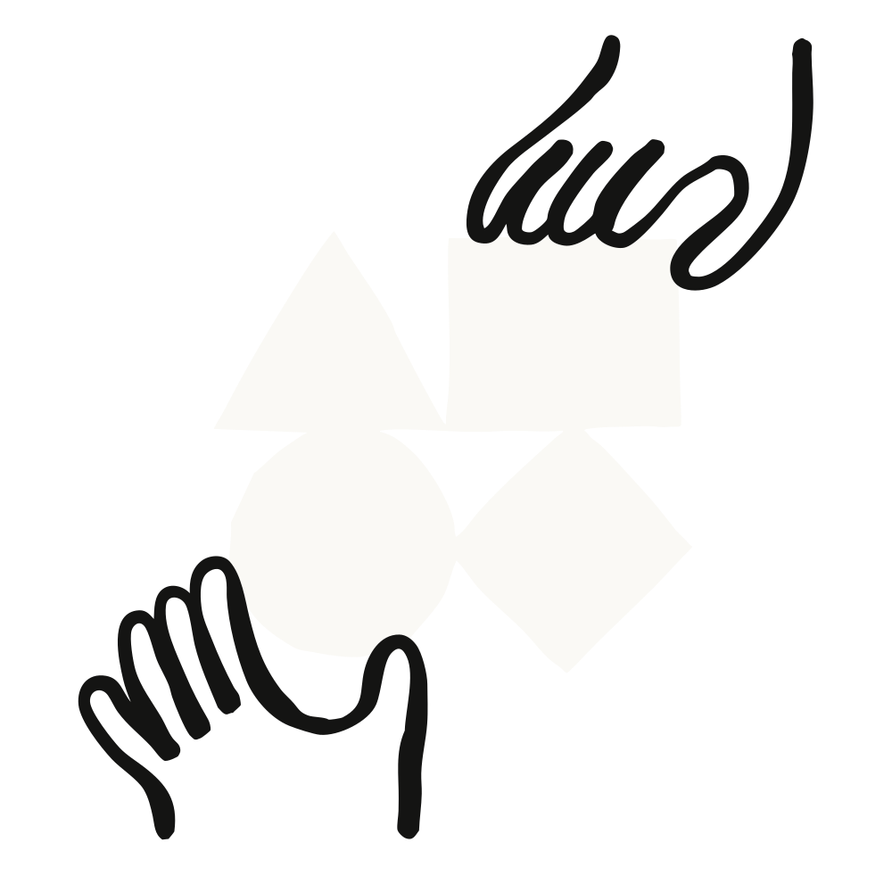

# 三家 YC 创业公司如何用 Claude Code 打造公司（中英对照）

> **原文标题：** How three YC startups built their companies with Claude Code
> **作者：** Anthropic（原文未署名）
> **原文链接：** https://claude.com/blog/building-companies-with-claude-code
> **发布日期：** 2025-11-17
> **翻译模型：** GLM-5.3
> 排版：每段英文原文在前，中文翻译紧随其后。术语保留英文原文并附中文释义。

---

Learn how three YC startups use Claude Code to ship products faster, win government contracts, and scale AI-powered platforms with agentic coding workflows.

了解三家 YC 创业公司如何借助 agentic coding（智能体化编码）工作流，用 Claude Code 更快发布产品、赢得政府合同，并规模化 AI 驱动的平台。

See Claude Code in action—from concept to commit in one seamless workflow.

亲眼看看 Claude Code 的实际表现--在一个无缝工作流中从概念直达提交。（原文此句作为头图视频配注重复出现三次，此处合并呈现一次。）

# 三家 YC 创业公司如何用 Claude Code 打造公司（How three YC startups built their companies with Claude Code）

From non-technical founders winning government contracts to solo devs building at scale, here's how agentic coding is re-writing the startup playbook.

从非技术创始人拿下政府合同，到独立开发者进行规模化构建，本文讲述 agentic coding（智能体化编码）正在如何改写创业公司的打法手册。

Y Combinator, a startup accelerator, has launched over 5,000 companies that have a combined valuation of over $800B since 2005, including household names like Airbnb, Stripe, and DoorDash.

创业加速器 Y Combinator 自 2005 年以来已孵化超过 5,000 家公司，合计估值超过 8,000 亿美元，其中不乏 Airbnb、Stripe 和 DoorDash 这样家喻户晓的名字。

Today, agentic coding tools like Claude Code are fundamentally changing how YC startups build and scale. Founders can now ship products directly from the terminal, compressing development cycles from weeks to hours and enabling even non-technical founders to compete with established players from day one.

如今，像 Claude Code 这样的 agentic coding（智能体化编码）工具正在从根本上改变 YC 创业公司构建与扩张的方式。创始人如今可以直接从终端发布产品，把开发周期从数周压缩到数小时，让即便没有技术背景的创始人也能从第一天起就与成熟玩家同台竞技。

We spoke with three YC startups who demonstrate this transformation in action:

我们与三家正在亲身演绎这场变革的 YC 创业公司进行了交流：

- HumanLayer (F24) built their entire platform and pioneered context engineering practices with Claude Code
- Ambral (W25) is scaling AI-powered account management with sophisticated sub-agent powered workflows built with Claude Code and Claude Agents SDK
- Vulcan Technologies (S25) is using Claude Code to tackle regulatory complexity for the government and industry

- HumanLayer（F24 批次）用 Claude Code 构建了整个平台，并开创了 context engineering（上下文工程）实践
- Ambral（W25 批次）正借助用 Claude Code 和 Claude Agents SDK 构建的精密 sub-agent（子智能体）驱动工作流，规模化其 AI 驱动的客户管理
- Vulcan Technologies（S25 批次）正在用 Claude Code 攻克政府与产业界的监管复杂性难题

Let's dive in.

让我们深入看看。

# HumanLayer：从 SQL 智能体到规模化 AI 优先的工程团队（HumanLayer: From SQL agents to scaling AI-first engineering teams）

Dexter Horthy was building autonomous AI agents to manage SQL warehouses when he noticed a fundamental (but understandable) challenge to agentic adoption: companies weren't comfortable giving AI applications unsupervised access to sensitive operations like dropping database tables.

Dexter Horthy 当时正在构建用于管理 SQL 数据仓库的自主 AI 智能体，此时他注意到了 agentic 采用上一个根本性（但完全可以理解）的挑战：企业不愿意让 AI 应用在无人监督的情况下接触敏感操作，比如删除数据库表。

## 一切由此开始的产品转型（The product pivot that started it all）

That realization became HumanLayer's core insight: often the most useful functions in any software are also the most risky, especially for non-deterministic LLM-powered systems.

这一认识成为 HumanLayer 的核心洞察：任何软件中最有用的功能往往也是风险最高的，对于非确定性的 LLM 驱动系统来说尤其如此。

"Our MVP was an agent that would coordinate with humans in Slack and could do basic cleanup, like dropping any table that hadn't been queried in 90+ days," Horthy explained. "We weren't comfortable with an AI application running raw SQL unsupervised, so we wired in some basic human approval steps."

"我们的 MVP 是一个能在 Slack 中与人类协作的智能体，可以做一些基础清理，比如删掉任何超过 90 天没被查询过的表，"Horthy 解释道，"我们不愿意让一个 AI 应用在无人监督的情况下执行原生 SQL，所以我们接入了基本的人工审批环节。"

In August 2024, Horthy built an MVP, demoed it to different startups across SF, and had his first paying customers.

2024 年 8 月，Horthy 构建了一个 MVP（最小可行产品），在旧金山各地向不同的创业公司演示，并拿到了第一批付费客户。

This progress landed HumanLayer in the YC F24 batch, and the team went all in on providing an API and SDK that lets AI agents contact humans for feedback, input, and approvals across Slack, email, SMS, and other channels.

这些进展让 HumanLayer 进入了 YC F24 批次，团队全力投入打造一套 API 和 SDK，让 AI 智能体能够通过 Slack、电子邮件、短信及其他渠道联系人类，获取反馈、意见和审批。

Through Q1 2025, the HumanLayer team conducted extensive customer discovery, talking to dozens of engineering teams building AI agents and realized there was a gap in the agentic development loop they hadn't accounted for.

整个 2025 年第一季度，HumanLayer 团队开展了大量客户调研，与数十个构建 AI 智能体的工程团队交谈，并意识到 agentic 开发闭环中存在一个他们此前未曾料到的缺口。

"Every team had rolled their own agent architecture," Horthy explained. "We realized we couldn't just build a better API–we needed to help establish the patterns and principles that would let the ecosystem mature."

"每个团队都自己搭了一套智能体架构，"Horthy 解释道，"我们意识到，光做一个更好的 API 是不够的--我们还需要帮助确立能让整个生态走向成熟的模式与原则。"

This led Horthy to document their learnings in "12-Factor Agents: Patterns of reliable LLM applications." Published in April 2025, the guide went viral and synthesized their experience building production agent systems and highlighted best practices for the emergent discipline of context engineering.

于是 Horthy 把这些心得整理成《12-Factor Agents: Patterns of reliable LLM applications》（《十二要素智能体：可靠 LLM 应用的模式》）。这份指南于 2025 年 4 月发布后迅速走红，它浓缩了团队构建生产级智能体系统的经验，并为新兴的 context engineering（上下文工程）学科梳理了最佳实践。

## 用 Claude Code 构建一切（Building everything with Claude Code）

With these learnings in hand, the HumanLayer team started exploring alternative product ideas and pivot angles.

带着这些认知，HumanLayer 团队开始探索新的产品创意和转型方向。

When Anthropic launched Claude Code, Horthy and his team were already strong proponents of Claude models for coding. They immediately began using it to build these experiments.

Anthropic 推出 Claude Code 时，Horthy 和他的团队早已是"用 Claude 模型编程"的坚定拥护者。他们立刻开始用它来做这些实验。

"We just wrote everything with Claude Code," Horthy said. "When the Claude Agent SDK launched with Opus 4 and Sonnet 4, enabling headless agent execution, we knew this was going to be a big deal."

"我们就是把所有东西都用 Claude Code 写出来的，"Horthy 说，"当 Claude Agent SDK 随 Opus 4 和 Sonnet 4 一起发布、支持 headless（无界面）智能体执行时，我们就知道这会是一件大事。"

After months of refining their Claude Code workflows internally, Horthy began sharing them with close founder friends.

在内部打磨数月 Claude Code 工作流之后，Horthy 开始与关系要好的创始人朋友们分享。

"The moment that told me we needed to go all in on this was an all-day pairing session with Vaibhav from BoundaryML (YC W23)," Horthy recalled. "Vaibhav was skeptical at first, but after we spent 7 hours shipping what would normally be 1-2 weeks of work, he was sold. I realized this workflow could work for other teams and other codebases."

"让我确信必须全力投入的那一刻，是与 BoundaryML（YC W23 批次）的 Vaibhav 进行为期一整天的结对编程，"Horthy 回忆道，"Vaibhav 起初将信将疑，但当我们用 7 个小时交付了通常需要 1-2 周的工作量之后，他被彻底说服了。我意识到这套工作流在其他团队、其他代码库上同样行得通。"

## 构建 CodeLayer：规模化 AI 优先的工程（Building CodeLayer: Scaling AI-first engineering）

Today, HumanLayer's product CodeLayer helps teams run multiple Claude agent sessions in parallel using worktrees and remote cloud workers. They've discovered a critical pattern: once an engineer masters Claude Code, their productivity gains are so substantial that the real challenge becomes organizational—scaling these workflows across entire teams.

如今，HumanLayer 的产品 CodeLayer 帮助团队利用 worktree（工作树）和远程云端 worker 并行运行多个 Claude 智能体会话。他们发现了一个关键模式：一旦工程师掌握了 Claude Code，其生产力提升会如此显著，以至于真正的挑战变成了组织层面的--如何在整个团队中规模化推广这些工作流。

"Once you have multiple people on your team shipping AI-written code, you have a completely different type of problem," Horthy explained. "It's a communication, collaboration, tooling, and management problem. You have to rewire everything about how your team builds software."

"一旦团队里有多个人在交付 AI 写的代码，你面对的就是一类完全不同的问题，"Horthy 解释道，"这是沟通、协作、工具和管理问题。你必须彻底重构团队构建软件的全部方式。"

Since the start of Q4 2025, HumanLayer has closed several large pilots across engineering teams of all sizes to deploy these tools and workflows, all built with Claude Code.

自 2025 年第四季度初以来，HumanLayer 已与各种规模的工程团队敲定多个大型试点项目，来部署这些工具和工作流--而它们全部是用 Claude Code 构建的。

# Ambral：用 subagent 构建生产系统（Ambral: Building production systems with subagents）

Jack Stettner and Sam Brickman founded Ambral to solve a problem familiar to every B2B startup founder and CRO: as companies scale, the founder-level customer intimacy that drives early growth becomes impossible to maintain.

Jack Stettner 和 Sam Brickman 创立 Ambral，是为了解决每个 B2B 创业公司创始人和 CRO（首席营收官）都再熟悉不过的问题：随着公司规模扩大，那种驱动早期增长的、创始人级别的客户亲密关系变得难以维系。

## 用 Claude Agent SDK 变革客户管理（Transforming account management with the Claude Agent SDK）

Whether at early companies experiencing hyper growth or at established enterprise companies, account managers routinely juggle 50 to 100 accounts simultaneously. "You can't give an effective account management experience with 1/50th of someone's attention," Stettner explained. Customer context that once fit in a founder's head scatters across systems, logs, Slack messages, meeting transcripts, and product usage data.

无论是在经历超高速增长的早期公司，还是在成熟的企业级公司，客户经理通常都要同时应付 50 到 100 个客户账户。"如果只投入一个人注意力的五十分之一，你不可能提供有效的客户管理体验，"Stettner 解释道。曾经装在创始人脑子里的客户上下文，如今散落在各种系统、日志、Slack 消息、会议记录和产品使用数据之中。

Ambral synthesizes signals from customer activity and interactions into AI-powered models of every account. The system pinpoints who needs attention and why, autonomously driving or recommending expansions while catching early signs of dissatisfaction to prevent churn.

Ambral 把来自客户活动和互动的信号，合成为每个账户的 AI 驱动模型。系统能精准指出谁需要关注、为什么需要，自主推动或推荐扩展销售，同时捕捉客户不满的早期信号以防止流失。

"We're trying to provide the experience of every customer having a one-to-one account manager," Stettner said.

"我们想提供这样一种体验：每个客户都拥有一名一对一的客户经理，"Stettner 说。

As CTO and sole engineer at this young startup, Stettner relies heavily on Claude Code for development and Claude's Agent SDK to power the product itself. The technical architecture reflects sophisticated understanding of how to extract maximum value from different Claude models.

作为这家年轻创业公司的 CTO（首席技术官）兼唯一工程师，Stettner 在开发上高度依赖 Claude Code，并依靠 Claude 的 Agent SDK 驱动产品本身。其技术架构体现出他对如何从不同 Claude 模型中获取最大价值的深刻理解。

## 委派式工作流：Opus 负责思考，Sonnet 负责构建，subagent 随处不在（Delegated workflow: Opus for thinking, Sonnet for building, and subagents all around）

Stettner has adopted a precise workflow that leverages the strengths of different Claude models in conjunction with subagents:

Stettner 采用了一套精确的工作流，将不同 Claude 模型的优势与 subagent（子智能体）结合起来：

"I use Opus 4.1 to do research and planning. Sonnet 4.5 has been absolutely killer in terms of being able to then go and implement these plans that I create in Markdown," Stettner explained.

"我用 Opus 4.1 做研究和规划。而 Sonnet 4.5 在把我用 Markdown 写的这些计划落地实现方面，表现简直绝了，"Stettner 解释道。

His development process follows three discrete phases:

他的开发流程分为三个相互独立的阶段：

- Research phase (Opus 4.1): Perform deep research on whatever background is needed for a feature implementation. "I think the most important thing is doing research before you plan," Stettner emphasized. "Have Claude do research for you and create a large, long research document." He uses a series of subagents to research multiple areas of the codebase in parallel.
- Planning phase (Opus 4.1): Create a plan with discrete phases on how to implement the feature. "I'll have Opus create a plan with phases, discrete phases on how to actually go about implementing it, and I'll go revise that plan. Maybe I'll chat with Opus about questions about certain details, or I'll manually update this markdown file."
- Implementation phase (Sonnet 4.5): Execute each phase of the plan systematically. "Then I'll use Sonnet 4.5 to go and implement each phase."

- 研究阶段（Opus 4.1）：针对功能实现所需的任何背景材料开展深度研究。"我认为最重要的是先研究、再规划，"Stettner 强调，"让 Claude 替你做研究，并生成一份又长又详尽的研究文档。"他会用一系列 subagent 并行研究代码库的多个区域。
- 规划阶段（Opus 4.1）：制定一份分阶段的功能实现计划。"我会让 Opus 制定一个带阶段的计划，也就是关于具体如何实施的离散阶段，然后我会去修订这份计划。也许我会就某些细节问题与 Opus 讨论，或者手动更新这个 Markdown 文件。"
- 实现阶段（Sonnet 4.5）：按部就班地执行计划的每个阶段。"然后我就用 Sonnet 4.5 去逐一实现每个阶段。"

This approach prevailed over the other workflows Stettner tried and was influenced by some of the work Horthy is doing at Humanlayer: "I tried every coding tool, and I experimented with basically every model. I just think Anthropic's models are the best at tool use right now, and that translates to code."

这套方法胜过了 Stettner 尝试过的其他工作流，并受到了 Horthy 在 HumanLayer 所做工作的影响："我试遍了所有编码工具，也基本体验过所有模型。我就是认为 Anthropic 的模型目前在工具使用上是最强的，而这一点会直接体现在代码上。"

## 构建健壮的研究引擎（Building a robust research engine）

The product itself mirrors this multi-agent approach. Stettner built Ambral's core research engine using the Claude Agent SDK with dedicated sub-agents for each data type.

产品本身也沿用了这种多智能体方法。Stettner 用 Claude Agent SDK 构建了 Ambral 的核心研究引擎，为每种数据类型配备了专门的 sub-agent（子智能体）。

"I spent a lot of time using the Claude Agent SDK to basically build a very robust research engine that can operate across all of this data," Stettner explained. "It's based around Claude sub-agents, and for every type of data we have a dedicated sub-agent which is an expert in understanding that data."

"我花了大量时间用 Claude Agent SDK 构建了一个非常健壮的研究引擎，它能够处理所有这些数据，"Stettner 解释道，"它以 Claude sub-agent 为核心，针对每一种数据类型我们都有一个专门的 sub-agent，它是理解这类数据的专家。"

Whether users chat with the system or Ambral builds automations for customers, everything is backed by the Claude Agent SDK and a series of sub-agents retrieving and reasoning across usage data, Slack messages, meeting transcripts, and product interactions.

无论是用户与系统对话，还是 Ambral 为客户构建自动化流程，一切都由 Claude Agent SDK 和一系列 sub-agent 支撑，它们在使用数据、Slack 消息、会议记录和产品交互之间进行检索与推理。

The architectural inspiration came directly from Stettner's development experience: "I think how well Claude Code subagents were doing and helping me do development is what inspired me to basically want to take those same sub-agents and use it for the research engine in the product itself."

架构上的灵感直接来自 Stettner 的开发体验："我想，正是 Claude Code subagent 的出色表现和对我的开发帮助，启发我把同样的 sub-agent 搬到产品本身的研究引擎中。"

# Vulcan Technologies：让非技术创始人也能推出产品（Vulcan Technologies: Empowering non-technical founders to launch products）

For Tanner Jones, CEO and co-founder of Vulcan, Claude Code's impact extends far beyond productivity—it constitutes the democratization of company building. Founding their startup, the Vulcan team believed there had to be a product that could make government work better for citizens. That vision would have remained impossible without Claude Code because neither founder had an engineering background.

对 Vulcan 的 CEO 兼联合创始人 Tanner Jones 来说，Claude Code 的影响远不止于生产力--它意味着公司创建的民主化。在创立公司之初，Vulcan 团队就坚信，一定存在一种能让政府更好地服务民众的产品。若没有 Claude Code，这个愿景将始终无法实现，因为两位创始人都没有工程背景。

## 在没有专职工程师的情况下交付产品（Shipping a product without dedicated engineers）

Vulcan tackles a problem that's been accumulating for centuries: regulatory code complexity. Virginia's House of Burgesses, the oldest continuous democratic institution in the world, exemplifies this challenge. Regulatory buildup over 400+ years has created one of the most nuanced and complex codes in the U.S.

Vulcan 攻克的是一个积累了好几个世纪的问题：监管法规的复杂性。弗吉尼亚州的 House of Burgesses（州议会下院）是世界上最古老且连续运作的民主机构，正是这一挑战的缩影。400 多年累积下来的监管条文，造就了全美国最细密、最复杂的法规体系之一。

When Aleksander Mekhanik and Tanner Jones co-founded Vulcan in April 2025, neither had a traditional engineering background. Mekhanik studied ML and mathematics in college, and Jones' last programming experience was an AP JavaScript class in high school where they wrote code with pen and paper. Yet the duo built a prototype of their first product for Virginia's governor's office by May 1st—and won the contract over established consulting firms.

Aleksander Mekhanik 和 Tanner Jones 于 2025 年 4 月共同创立 Vulcan 时，两人都没有传统的工程背景。Mekhanik 在大学学的是机器学习和数学，而 Jones 最近一次编程经历是高中的一门 AP JavaScript 课程，当时他们还是用纸笔写代码。然而就是这样的两个人，在 5 月 1 日前就为弗吉尼亚州州长办公室做出了第一款产品的原型--并击败老牌咨询公司赢下了合同。

"The entire prototype was made using Claude," Jones explained. "This was pre-Claude Code. It was literally copy-pasting scripts into the web app, swapping out methods." After building the prototype, they hired their CTO, Christopher Minge, who had experience working at Google on Gemini and Waymo. Then, when Claude Code launched in June, the trio's velocity multiplied again.

"整个原型都是用 Claude 做出来的，"Jones 解释道，"那时还没有 Claude Code。真的是把脚本复制粘贴到网页应用里，再逐个替换方法。"原型完成之后，他们聘请了 CTO Christopher Minge，他曾在 Google 参与过 Gemini 和 Waymo 的工作。随后，当 Claude Code 于 6 月发布时，三人的开发速度再一次成倍提升。

Vulcan's AI-powered regulatory analysis helped reduce the average price of a new home in Virginia by $24,000, saving Virginians over a billion dollars annually by identifying redundant and duplicative regulatory requirements. Virginia's governor loved Vulcan's work so much that he signed Executive Order 51, mandating that all state agencies use "agentic AI regulatory review."

Vulcan 的 AI 驱动监管分析帮助弗吉尼亚州将新房均价降低了 24,000 美元，通过识别冗余和重复的监管要求，每年为该州居民节省超过 10 亿美元。弗吉尼亚州州长对 Vulcan 的工作极为赞赏，甚至签署了第 51 号行政令（Executive Order 51），要求所有州机构采用"agentic AI 监管审查"。

## 让创建公司走向民主化（Democratizing company building）

For Jones, Claude Code's impact goes beyond productivity metrics.

在 Jones 看来，Claude Code 的影响超出了生产力指标的范畴。

"If you understand language and you understand critical thinking, you can use Claude Code well," he said. "I actually think there might be some marginal benefit for people who studied humanities, because the medium by which we're communicating with AI is language. If you have a great command of language and are good at constructing well-organized ordinal lists, nested bullet points and well-thought-out processes, your prompts may execute better."

"只要你理解语言、懂得批判性思维，你就能用好 Claude Code，"他说，"我甚至认为人文学科出身的人可能还有一些微弱优势，因为我们与 AI 沟通的媒介就是语言。如果你驾驭语言的能力很强，又擅长构建条理清晰的有序列表、嵌套项目符号和深思熟虑的流程，你的提示词可能会执行得更好。"

Jones commends Claude Code as a major component of Vulcan's success: "In four months, with three founders, only one of whom was properly technical, we secured state and federal government contracts and raised an $11m seed round from some of the top VCs. None of this would have been possible without Anthropic's unbelievable tools."

Jones 将 Claude Code 视为 Vulcan 成功的重要组成部分："四个月里，三位创始人中只有一位真正具备技术背景，我们却拿到了州政府和联邦政府的合同，并从一些顶级风投（VC）那里融到了 1,100 万美元种子轮。没有 Anthropic 那些不可思议的工具，这一切都不可能实现。"

Christopher Minge, Vulcan's CTO with "properly technical" training, experienced his own shift in how he thinks about engineering.

拥有"真正技术"训练背景的 Vulcan CTO Christopher Minge，对自己思考工程的方式也经历了一次转变。

"It feels a little bit like I have a co-worker at Google who I'm giving all of my ideas and tasks to, and they make mistakes frequently, but my role is delegating to several Claude Code instances and getting good at checking for common mistakes and communicating ideas effectively," Minge explained.

"感觉就像我在 Google 有位同事，我把所有想法和任务都交给他，他会经常犯错，而我的角色是向多个 Claude Code 实例委派任务，练就检查常见错误和高效表达想法的本领，"Minge 解释道。

# 来自 YC 创始人的最佳实践（Best practices from YC founders）

These three startups have developed battle-tested approaches to maximizing Claude Code's impact, including:

这三家创业公司打磨出了一套经受过实战检验的方法，用以最大化 Claude Code 的作用，包括：

## 1. 将研究、规划和实现拆分为相互独立的会话（1. Separate research, planning, and implementation into discrete sessions）

"Don't make Claude do research while it's trying to plan, while it's trying to implement," Stettner advised. "Use discrete prompts and make those into discrete steps."

"不要让 Claude 在规划的同时做研究、在实现的同时又做规划，"Stettner 建议，"使用离散的提示词，把它们变成一个个独立的步骤。"

This pattern prevents context contamination and allows each phase to focus on its core objective. Start a new Claude Code session for each major phase, passing only the distilled conclusions forward rather than dragging the entire context history.

这一模式可以防止上下文污染（context contamination），让每个阶段都专注于自己的核心目标。每个主要阶段都新开一个 Claude Code 会话，只把提炼后的结论传递下去，而不是拖着整段上下文历史前行。

## 2. 有意识地管理上下文（2. Be deliberate about context management）

Stettner's advice for other founders centers on deliberate context management:

Stettner 给其他创始人的建议，核心在于有意识的上下文管理：

"Context is critical. When I've seen output that was unexpected or low quality, it's generally due to a contradiction that I have in a prompt somewhere," he explained. "Be very deliberate in terms of what information you're putting into a system prompt or when you choose to start a new conversation, because you don't want to cloud your context. If there's any contradictions in your prompt, you're going to receive lower quality output."

"上下文至关重要。每当我看到意料之外或质量低下的输出，原因基本上都是我的某处提示词里存在自相矛盾，"他解释道，"往系统提示词里放什么信息、何时选择开启新对话，都要非常审慎，因为你不想让上下文变得混浊。提示词里只要有一处矛盾，你得到的输出质量就会下降。"

## 3. 监控并打断思维链（3. Monitor and interrupt the chain of thought）

"Try to scrutinize the chain of thought and watch what it's doing," Jones suggested. "Have your finger on the trigger to escape and interrupt any bad behavior."

"尽量仔细审视思维链（chain of thought），盯着它在做什么，"Jones 建议，"手指放在扳机上，随时退出并打断任何不良行为。"

This becomes especially important when running multiple instances. Catching a wrong direction early—within the first few tool calls—saves significantly more time than letting Claude Code complete an entire misguided approach.

在同时运行多个实例时，这一点尤为重要。在前几次工具调用中就及早发现方向性错误，比放任 Claude Code 完成一整套误入歧途的方案，要节省大量时间。

# 新一代构建者的优势（The new builder advantage）

These three startups demonstrate a fundamental shift in how companies are built with tools like Claude Code. HumanLayer pivoted and scaled while codifying context engineering practices that are now used across the YC ecosystem. Ambral is tackling customer success at massive scale with a lean founding team. Vulcan won government contracts as non-engineers.

这三家创业公司展示了在 Claude Code 这类工具之下，公司的创建方式正在发生根本性转变。HumanLayer 在转型和扩张的同时，把 context engineering 实践沉淀成文，如今已在整个 YC 生态中被广泛使用。Ambral 以精简的创始团队在大规模层面解决客户成功问题。Vulcan 则以非工程师身份赢得了政府合同。

Traditional barriers to building software—technical expertise, team size, development time—are giving way to new competitive advantages: clear thinking, structured problem decomposition, and the ability to effectively collaborate with AI.

构建软件的传统壁垒--技术专长、团队规模、开发时间--正在让位于新的竞争优势：清晰的思考、结构化的问题分解，以及与 AI 高效协作的能力。

Ready to build with Claude Code? Get started.

准备好用 Claude Code 开始构建了吗？立即上手。

"We're automating the mundane. 80% of Sales work today is manual, laborious, data work. In the era of AI, humans can focus on truly human, creative work, and we can leave the data work in the hands of AI."

"我们正在让平凡琐碎的工作自动化。如今 80% 的销售工作是手工的、繁重的数据工作。在 AI 时代，人类可以专注于真正属于人类的创造性工作，而把数据工作交到 AI 手中。"

"Claude Sonnet 4.5's intelligence is immediately noticeable—it makes better use of Augment's codebase context, handles longer-horizon tasks, and opens up new agentic possibilities we're actively exploring."

"Claude Sonnet 4.5 的智能提升立即可感--它更充分地利用 Augment 的代码库上下文，能处理更长周期的任务，还开启了我们正在积极探索的新 agentic 可能性。"
