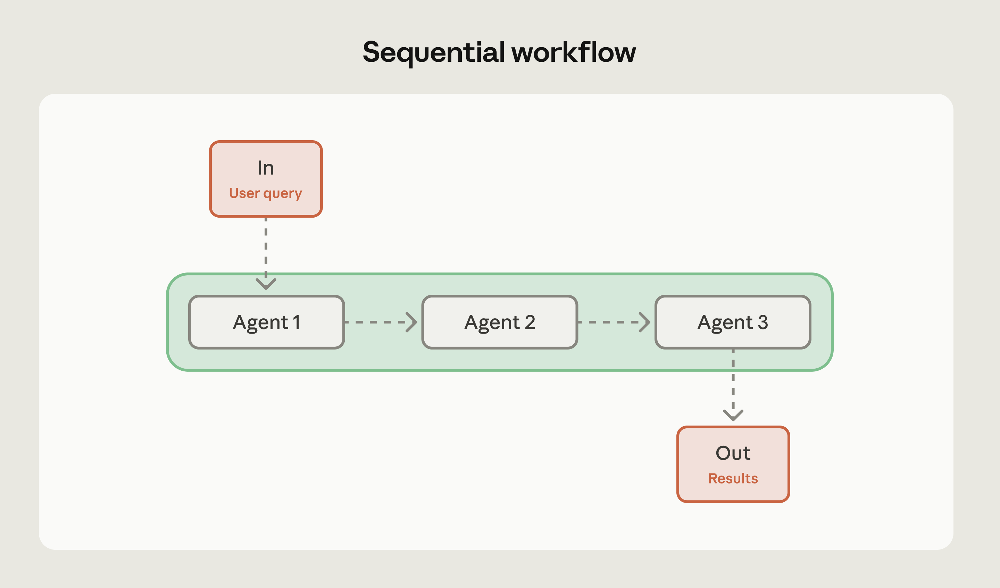

# 常见的 AI 智能体工作流模式及其使用时机（中英对照）

> **原文标题：** Common workflow patterns for AI agents-and when to use them
> **作者：** Anthropic（原文未署名）
> **原文链接：** https://claude.com/blog/common-workflow-patterns-for-ai-agents-and-when-to-use-them
> **发布日期：** 2026-03-05
> **翻译模型：** GLM-5.3
> 排版：每段英文原文在前，中文翻译紧随其后。术语保留英文原文并附中文释义。

---

Practical guidance on how to structure agent tasks using three common workflow patterns, with tradeoffs and benefits for each.

关于如何使用三种常见工作流（workflow）模式来组织智能体（agent）任务的实用指南，并分析每种模式的权衡与收益。

AI agents make decisions autonomously, and workflows are how you bring structure to that autonomy. They establish execution patterns that channel agent capabilities toward complex problems requiring coordinated steps, predictable outcomes, and orchestrated timing.

AI 智能体会自主做出决策，而工作流是你为这种自主性引入结构的方式。工作流建立起执行模式，把智能体的能力引导到那些需要协调步骤、可预测结果和精确编排时序的复杂问题上。

When you need multiple agents working together, the real decision is which pattern fits your problem.

当你需要多个智能体协同工作时，真正要决定的是哪种模式适合你的问题。

We've worked with dozens of teams building AI agents, and in production, three patterns cover the vast majority of use cases: sequential, parallel, and evaluator-optimizer.

我们与数十个构建 AI 智能体的团队有过合作。在生产环境中，三种模式就能覆盖绝大多数用例：顺序（sequential）、并行（parallel）与评估器-优化器（evaluator-optimizer）。

Each solves different problems, and picking the wrong one costs you in latency, tokens, or reliability. This piece breaks down all three, with guidance on when each fits and how to combine them.

每种模式解决不同的问题，选错了会在延迟、token 或可靠性上付出代价。本文将逐一剖析这三种模式，并就各自适用场景以及如何组合使用给出指导。

# 工作流与智能体如何协同（How workflows and agents work together）

If you've managed a team, you already understand workflows.

如果你管理过团队，你就已经理解什么是工作流了。

Think of a manufacturing assembly line: each station has a skilled worker making decisions about their specific tasks, but the overall flow is designed ahead of time-even when individual steps involve dynamic decisions like routing or retries.

想想制造业的流水线：每个工位都有一名技术娴熟的工人在就自己的具体任务做决策，但整体流程是提前设计好的--即使个别步骤涉及路由或重试这类动态决策。

Agent workflows operate the same way.

智能体工作流的运作方式与此相同。

## 理解工作流与自主智能体（Understanding workflows vs. autonomous agents）

Workflows don't replace agent autonomy; they shape where and how agents apply it.

工作流并不会取代智能体的自主性，而是塑造智能体在何处、以何种方式运用这种自主性。

A fully autonomous agent decides everything: which tools to use, what order to execute tasks, and when to stop.

完全自主的智能体决定一切：使用哪些工具、以什么顺序执行任务，以及何时停止。

A workflow provides structure: it establishes the overall flow, defines checkpoints, and sets boundaries for how agents operate at each step, while still allowing dynamic behavior within those boundaries.

工作流则提供结构：它确立整体流程、定义检查点（checkpoint），并为智能体在每一步的运作方式设定边界，同时仍允许在这些边界之内进行动态行为。

Each step in a workflow can still leverage an agent's reasoning and tool use, but the overall orchestration follows a defined path. A workflow pattern gives you agent intelligence within each step, and a predictable process flows across the entire task.

工作流中的每一步仍然可以借助智能体的推理能力和工具使用，但整体编排遵循一条确定的路径。工作流模式让你在每个步骤内部拥有智能体的智能，同时在整个任务范围内保持可预测的流程。

# 智能体工作流模式（Agent workflow patterns）

In production, we see three workflow patterns come up most often. Think of these as building blocks rather than rigid templates-you'll often combine or nest them as your requirements evolve:

在生产环境中，我们最常遇到三种工作流模式。请把它们视为构建块而非僵化的模板--随着需求演进，你常常会将它们组合或嵌套使用：

- Sequential workflows - for executing tasks in a fixed order
- Parallel workflows - for running independent tasks across agents simultaneously
- Evaluator-optimizer workflows - for outputs that need iterative refinement

- 顺序工作流（sequential workflow）--按固定顺序执行任务
- 并行工作流（parallel workflow）--让多个智能体同时运行相互独立的任务
- 评估器-优化器工作流（evaluator-optimizer workflow）--用于需要迭代打磨的输出

Each workflow type solves specific problems and comes with clear tradeoffs around complexity, cost, and performance.

每种工作流类型都解决特定问题，并在复杂度、成本和性能方面各有明确的权衡。

| Workflow pattern | Problem it solves | When to use | Tradeoff | Benefit |
| --- | --- | --- | --- | --- |
| Sequential | Tasks have dependencies: step B needs step A's output | Multi-stage processes, data pipelines, draft-review-polish cycles | Adds latency (each step waits for the previous one) | Can improve accuracy by letting each agent focus on one thing |
| Parallel | Tasks are independent but doing them one at a time is slow | Evaluations across multiple dimensions, code review, document analysis | Costs more (multiple concurrent API calls) and requires an aggregation strategy | Can lead to faster completion and separation of concerns across engineering teams |
| Evaluator-optimizer | First-draft quality isn't good enough | Technical documentation, customer communications, code generation against specific standards | Multiplies token usage and adds iteration time | Can generate better outputs through structured feedback loops |

| 工作流模式 | 解决的问题 | 适用场景 | 权衡 | 收益 |
| --- | --- | --- | --- | --- |
| 顺序（Sequential） | 任务之间存在依赖：步骤 B 需要步骤 A 的输出 | 多阶段流程、数据管道、"起草-评审-润色"循环 | 增加延迟（每一步都要等待上一步完成） | 让每个智能体专注于单一事项，从而提升准确性 |
| 并行（Parallel） | 任务相互独立，但逐个执行太慢 | 多维度评估、代码评审、文档分析 | 成本更高（多次并发 API 调用），且需要聚合策略 | 可以更快完成任务，并在工程团队间实现关注点分离（separation of concerns） |
| 评估器-优化器（Evaluator-optimizer） | 初稿质量不够好 | 技术文档、客户沟通、需符合特定标准的代码生成 | token 用量成倍增加，并带来迭代时间 | 通过结构化的反馈循环生成更好的输出 |

‍Start with the simplest pattern that solves your problem. Default to sequential. Move to parallel when latency is the bottleneck and tasks are independent and add evaluator-optimizer loops only when you can measure the quality improvement.

从能解决问题的最简单模式开始。默认选择顺序模式。当延迟成为瓶颈且任务相互独立时，转向并行模式；只有当你能衡量质量提升时，再加入评估器-优化器循环。

## 顺序工作流（Sequential workflows）

Sequential workflows execute tasks in a predetermined order.

顺序工作流按照预先确定的顺序执行任务。

Agents at each stage process inputs, make decisions, make tool calls as needed, then pass results to the next stage. The result is a clear chain of operations where outputs flow linearly through the system.

每个阶段的智能体处理输入、做出决策、按需发起工具调用，然后把结果传递给下一个阶段。其结果是形成一条清晰的操作链，输出在系统中线性流转。

When to use: Sequential workflows excel when tasks naturally break down into distinct stages with clear dependencies. You're trading some latency for higher accuracy by focusing each agent on a specific subtask instead of trying to handle everything at once.

何时使用：当任务能够自然分解为具有清晰依赖关系的不同阶段时，顺序工作流表现尤为出色。通过让每个智能体专注于一个特定的子任务，而不是试图一次处理所有事情，你是在用一些延迟换取更高的准确性。

Use sequential workflows when there are:

在以下情况下使用顺序工作流：

- Multi-stage processes where each step depends on the previous output
- Data transformation pipelines where each stage adds specific value
- Tasks that can't be parallelized due to inherent dependencies
- Iterative improvement cycles like draft-review-polish cycles

- 多阶段流程，每一步都依赖上一步的输出
- 数据转换管道，每个阶段都贡献特定价值
- 由于内在依赖而无法并行化的任务
- 迭代式改进循环，例如"起草-评审-润色"循环

When to avoid: Skip sequential workflows when a single agent can handle the entire task effectively, or when agents need to collaborate rather than hand off work sequentially. If you're forcing a task into sequential steps when it doesn't naturally fit that structure, you're adding unnecessary complexity.

何时避免：当单个智能体就能有效处理整个任务时，或者当智能体之间需要协作而非按顺序交接工作时，应跳过顺序工作流。如果你硬是把一个任务塞进它并不天然适合的顺序步骤结构里，就是在增加不必要的复杂性。

Example: Sequential workflows work well when each step involves genuinely different work:

示例：当每一步都涉及真正不同的工作时，顺序工作流效果很好：

- Generating marketing copy, then translating it into multiple languages-or extracting data from documents, validating it against a schema, and loading it into a database
- Content moderation pipelines also work well sequentially: extract content, classify it, apply moderation rules, then route appropriately

- 先生成营销文案，再将其翻译成多种语言--或者从文档中提取数据、按 schema 校验后加载到数据库
- 内容审核管道同样适合按顺序执行：提取内容、分类、应用审核规则，然后进行适当路由

Pro tip: First try your pipeline as a single agent, where the steps are just part of the prompt. If that's good enough, you've solved the problem without additional complexity. Only split into a multi-step workflow when a single agent can't handle it reliably.

专业提示：先把你的管道（pipeline）当作单个智能体来尝试，让各个步骤只是提示词的一部分。如果效果已经足够好，你就没有增加任何额外复杂性地解决了问题。只有当单个智能体无法可靠处理时，才拆分为多步骤工作流。

## 并行工作流（Parallel workflows）

Parallel workflows distribute independent tasks across multiple agents that execute simultaneously. Instead of waiting for one agent to finish before starting the next, you run multiple agents at once and merge their results.

并行工作流将相互独立的任务分发给多个同时执行的智能体。不是等一个智能体完成后再启动下一个，而是一次运行多个智能体并合并它们的结果。

This pattern can deliver speed improvements when tasks don't depend on each other.

当任务之间互不依赖时，这种模式可以带来速度提升。

The approach resembles the fan-out/fan-in pattern from distributed systems. You send the same or related work to multiple agents, each processes independently, then you aggregate or synthesize their outputs.

这种做法类似于分布式系统中的扇出/扇入（fan-out/fan-in）模式：你把相同或相关的工作分发给多个智能体，各自独立处理，然后聚合或综合它们的输出。

Agents don't hand off work to each other-they operate autonomously and produce results that contribute to the overall task.

智能体之间并不相互交接工作--它们各自自主运作，产出有助于整体任务的结果。

When to use: Parallelization makes sense when you can divide work into independent subtasks that benefit from simultaneous processing, or when you need multiple perspectives on the same problem. It also enables separation of concerns: different engineers can own and optimize individual agents independently without their work interfering with each other. For complex tasks, handling each consideration with a separate AI call often outperforms trying to juggle everything in one call.

何时使用：当你能把工作拆分成可从同时处理中获益的独立子任务，或者需要对同一问题获得多种视角时，并行化是合理的选择。它还能实现关注点分离：不同的工程师可以各自独立负责和优化单个智能体，互不干扰。对于复杂任务，用单独的 AI 调用分别处理每一项考量，往往优于试图在一次调用中兼顾所有事情。

Consider parallel workflows for:

在以下场景考虑并行工作流：

- Sectioning approaches where different agents handle different aspects (like one processing queries while another screens for safety issues)
- Evaluation scenarios where each agent assesses different quality dimensions
- Voting patterns where multiple agents analyze the same content and you aggregate their assessments

- 分块（sectioning）方式：不同智能体负责不同方面（比如一个处理查询，另一个筛查安全问题）
- 评估场景：每个智能体评估不同的质量维度
- 投票（voting）模式：多个智能体分析同一内容，再由你聚合它们的评估结果

When to avoid: Don't use parallel workflows when agents need cumulative context or must build on each other's work. Skip this pattern when resource constraints like API quotas make concurrent processing inefficient, or when you lack clear strategies for handling contradictory results from different agents. If result aggregation becomes too complex or degrades output quality, parallelization isn't worth it.

何时避免：当智能体需要累积的上下文，或必须基于彼此的工作继续推进时，不要使用并行工作流。当 API 配额之类的资源约束使并发处理不划算，或你缺乏处理不同智能体之间相互矛盾结果的明确策略时，也应跳过这种模式。如果结果聚合变得过于复杂或降低输出质量，并行化就不值得了。

Example: Parallel workflows work well for:

示例：并行工作流适合：

- Automating evaluations (each agent checks different quality metrics) or code review (multiple agents examine different vulnerability categories)
- Document analysis is another strong use case: parallelize extraction of key themes, sentiment analysis, and factual verification, then combine the insights

- 自动化评估（每个智能体检查不同的质量指标）或代码评审（多个智能体分别审查不同类别的漏洞）
- 文档分析是另一个典型用例：并行执行关键主题提取、情感分析和事实核查，然后综合各项洞见

Pro tip: Design your aggregation strategy before implementing parallel agents. Will you take the majority vote? Average confidence scores? Defer to the most specialized agent? Having a clear plan for synthesizing results prevents you from collecting conflicting outputs with no way to resolve them.

专业提示：在实现并行智能体之前，先设计好聚合策略。你会采用多数表决？平均置信度得分？还是听从最专业的那个智能体？对结果的综合方式有清晰计划，能避免你收集到相互冲突的输出却无从解决。

## 评估器-优化器工作流（Evaluator-optimizer workflows）

Evaluator-optimizer workflows pair two agents in an iterative cycle: one generates content, another evaluates it against specific criteria, and the generator refines based on that feedback. This continues until the output meets your quality threshold or hits a maximum iteration count.

评估器-优化器工作流将两个智能体配对成一个迭代循环：一个生成内容，另一个按特定标准评估内容，生成器再根据反馈进行改进。如此往复，直到输出达到你的质量阈值或触及最大迭代次数。

The key insight is that generation and evaluation are different cognitive tasks. Separating them lets each agent specialize-the generator focuses on producing content, the evaluator focuses on applying consistent quality criteria.

关键洞察在于：生成与评估是两种不同的认知任务。将它们分开能让每个智能体各司其职--生成器专注于产出内容，评估器专注于持续一致地应用质量标准。

When to use: This pattern works when you have clear, measurable quality criteria that an AI evaluator can apply consistently, and when the gap between first-attempt and final quality is meaningful enough to justify the extra tokens and latency.

何时使用：当你拥有清晰、可衡量、且 AI 评估器能够持续一致地执行的质量标准，并且首次尝试与最终质量之间的差距大到足以证明额外的 token 和延迟合理时，这种模式才有效。

Consider evaluator-optimizer workflows for:

在以下场景考虑评估器-优化器工作流：

- Code generation with specific requirements (security standards, performance benchmarks, style guidelines)
- Professional communications where tone and precision matter
- Any scenario where first-draft quality consistently falls short of requirements

- 有特定要求的代码生成（安全标准、性能基准、风格指南）
- 对语气和精确性有要求的专业沟通
- 任何初稿质量始终达不到要求的场景

When to avoid: Skip evaluator-optimizer workflows when first-attempt quality already meets your needs-you're burning tokens on unnecessary iterations. Don't use this pattern for real-time applications requiring immediate responses, simple routine tasks like basic classification, or when evaluation criteria are too subjective for an AI evaluator to apply consistently. If deterministic tools exist (like linters for code style), use those instead. Also avoid this pattern when resource constraints outweigh quality improvements.

何时避免：当首次尝试的质量已经满足需求时，跳过评估器-优化器工作流--否则你是在把 token 浪费在不必要的迭代上。不要把这种模式用于需要即时响应的实时应用、基础分类这类简单的常规任务，或评估标准过于主观、AI 评估器难以一致执行的场景。如果存在确定性工具（如检查代码风格的 linter），请改用它们。当资源约束的重要性超过质量改进时，也应避免这种模式。

Example: Evaluator-optimizer workflows work well for:

示例：评估器-优化器工作流适合：

- Generating API documentation (generator writes docs, evaluator checks for completeness, clarity, and accuracy against the codebase)
- Creating customer communications (generator drafts email, evaluator assesses tone and policy compliance)
- Producing SQL queries (generator writes query, evaluator checks for efficiency and security issues)

- 生成 API 文档（生成器撰写文档，评估器对照代码库检查完整性、清晰度和准确性）
- 撰写客户沟通内容（生成器起草邮件，评估器评估语气与政策合规性）
- 生成 SQL 查询（生成器编写查询，评估器检查效率与安全问题）

Pro tip: Set clear stopping criteria before you start iterating. Define maximum iteration counts and specific quality thresholds. Without these guardrails, you can end up in expensive loops where the evaluator keeps finding minor issues and the generator keeps tweaking, but quality plateaus well before you stop iterating. Know when good enough is good enough.

专业提示：在开始迭代之前设定清晰的停止标准。定义最大迭代次数和具体的质量阈值。缺少这些护栏（guardrail），你可能陷入代价高昂的循环：评估器不断挑出细枝末节的问题，生成器不停修修补补，而质量早在你停止迭代之前就已进入平台期。要知道什么时候"足够好"就是足够好。

# 选择合适的工作流模式（Choosing the right workflow pattern）

The right workflow pattern depends on your task structure, quality requirements, and resource constraints.

合适的工作流模式取决于你的任务结构、质量要求和资源约束。

Before choosing a pattern, try the task as a single agent call first. If that meets your quality bar, you're done. If not, identify where it falls short-that tells you which pattern to reach for.

在选择模式之前，先尝试用单次智能体调用来完成任务。如果它能达到你的质量标准，就大功告成。如果不能，找出不足之处--它会告诉你该选择哪种模式。

Here are a few questions to help you decide:

以下几个问题可以帮你决策：

- Can a single agent handle this task effectively? If yes, don't use workflows at all.
- Does the task have clear sequential dependencies? Use sequential workflows.
- Can subtasks be processed independently and simultaneously, and would faster completion help? Consider parallel workflows.
- Does quality improve meaningfully with iterative refinement? Consider evaluator-optimizer patterns.

- 单个智能体能有效处理这个任务吗？如果能，就完全不要用工作流。
- 任务有清晰的顺序依赖吗？使用顺序工作流。
- 子任务可以独立且同时处理吗？更快完成有好处吗？考虑并行工作流。
- 质量会随迭代改进而显著提升吗？考虑评估器-优化器模式。

Once you've selected a pattern, consider:

选定模式后，还需考虑：

- Failure handling: Define fallback behavior and retry logic for each step.
- Latency and cost constraints: These determine how many agents you can run and how many iterations you can afford.
- Measuring improvement: Set a baseline with a single agent so you can tell whether the workflow actually helps.

- 失败处理：为每个步骤定义回退行为和重试逻辑。
- 延迟与成本约束：它们决定了你能运行多少智能体、能负担多少次迭代。
- 衡量改进：先用单个智能体建立基线（baseline），这样才能判断工作流是否真的有帮助。

Combining patterns: These patterns aren't mutually exclusive. You can nest them as complexity demands.

组合使用模式：这些模式并非互斥。你可以按复杂度的需要将它们嵌套。

- An evaluator-optimizer workflow might use parallel evaluation where multiple evaluators assess different quality dimensions simultaneously.
- A sequential workflow might include parallel processing at certain stages where multiple independent operations happen before moving to the next step.

- 评估器-优化器工作流可以采用并行评估，由多个评估器同时评估不同的质量维度。
- 顺序工作流可以在某些阶段纳入并行处理，即在进行下一步之前同时执行多个独立操作。

The key is matching pattern complexity to actual requirements. Don't add parallel processing because you can-add it when concurrent execution provides clear benefits. Don't implement evaluator-optimizer loops unless they improve output quality in a way you can measure.

关键在于让模式的复杂度与实际需求相匹配。不要因为"可以做并行处理"就加上--只有在并发执行带来明确收益时才加。也不要实现评估器-优化器循环，除非它能以可衡量的方式提升输出质量。

# 深思熟虑地演进你的工作流（Evolve your workflows thoughtfully）

Our best advice: start with the simplest pattern that works. If a sequential workflow handles your use case, don't add parallelization. If first-attempt quality is good enough, skip the evaluator-optimizer loop.

我们最好的建议是：从可行的最简单模式开始。如果顺序工作流就能满足你的用例，就不要加并行化。如果首次尝试的质量已经足够好，就跳过评估器-优化器循环。

These three patterns give you clear upgrade paths as requirements change. A sequential workflow can incorporate parallel processing at bottleneck stages. An agentic approach can add evaluation when quality standards tighten, and because these patterns are modular, you won't need complete rewrites.

这三种模式为需求变化提供了清晰的升级路径。顺序工作流可以在瓶颈阶段引入并行处理；当质量标准收紧时，智能体化（agentic）方案可以增加评估环节。而且由于这些模式是模块化的，你不需要完全重写。

For implementation guidance, detailed examples, and advanced patterns including hybrid approaches, check out our full white paper: Building effective AI agents: architecture patterns and implementation frameworks.

有关实现指导、详细示例以及包括混合方法在内的高级模式，请查阅我们的完整白皮书：《Building effective AI agents: architecture patterns and implementation frameworks》。

Build on the Claude Developer Platform today.

立即在 Claude Developer Platform 上开始构建吧。
