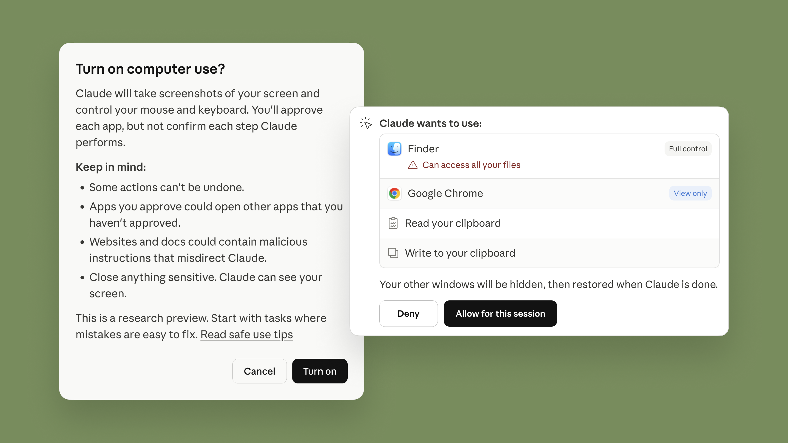
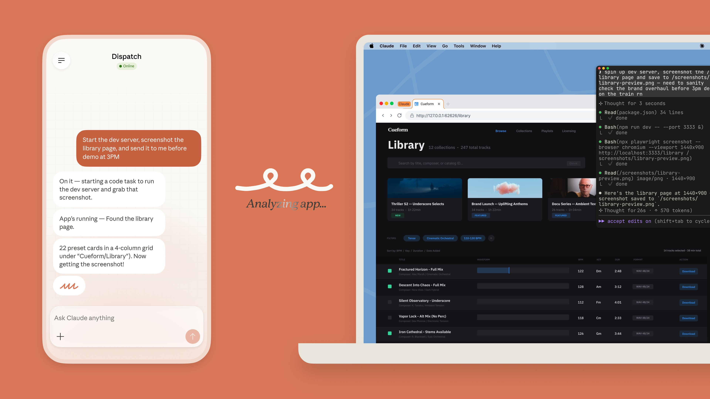

# 让 Claude 在你的电脑上工作（中英对照）

> **原文标题：** Put Claude to work on your computer
> **作者：** Anthropic（原文未署名）
> **原文链接：** https://claude.com/blog/dispatch-and-computer-use
> **发布日期：** 2026-03-23
> **翻译模型：** GLM-5.3
> 排版：每段英文原文在前，中文翻译紧随其后。术语保留英文原文并附中文释义。

---

Claude now opens your apps, navigates your browser, and runs your dev tools to complete tasks. Assign from your phone with Dispatch. Research preview on macOS.

Claude 现在可以打开你的应用、操作你的浏览器、运行你的开发工具来完成任务。通过 Dispatch 从手机上分配任务。macOS 上以研究预览版（research preview）形式提供。

In Claude Cowork and Claude Code, Claude can use your computer to point, click, and complete tasks. Dispatch lets you assign them from your phone.

在 Claude Cowork 和 Claude Code 中，Claude 可以使用你的电脑进行指点、点击并完成任务；而 Dispatch 让你可以从手机上分配这些任务。

In Claude Cowork and Claude Code, you can now enable Claude to use your computer to complete tasks. When Claude doesn't have access to the tools it needs, it will point, click, and navigate what's on your screen to perform the task itself. It can open files, use the browser, and run dev tools automatically — with no setup required.

在 Claude Cowork 和 Claude Code 中，你现在可以启用 Claude 使用你的电脑来完成任务。当 Claude 无法访问它所需的工具时，它会通过指点、点击和浏览你屏幕上的内容来亲自执行任务。它可以自动打开文件、使用浏览器并运行开发工具（dev tools）--无需任何配置。

This feature is now available in research preview for Claude Pro and Max subscribers. It works especially well with Dispatch, which lets you assign Claude tasks from your phone.

该功能目前以研究预览版形式向 Claude Pro 和 Max 订阅用户开放。它与 Dispatch 配合使用效果尤佳--Dispatch 让你可以从手机上给 Claude 分配任务。

# Claude 如何使用你的电脑（How Claude uses your computer）

Claude will reach for the most precise tool first, starting with connectors to services like Slack or Google Calendar. When there isn't a connector, Claude can directly control your browser, mouse, keyboard, and screen to complete tasks. It will scroll, click to open, and explore as needed, always asking for your explicit permission first.

Claude 会优先选用最精确的工具，首先是对 Slack 或 Google Calendar 这类服务的连接器（connectors）。在没有连接器可用的情况下，Claude 可以直接控制你的浏览器、鼠标、键盘和屏幕来完成任务。它会滚动页面、点击打开、按需探索，并且始终会先征求你的明确许可。

We've built this capability with safeguards that minimize risk, including prompt injection. When Claude uses your computer, our system will automatically scan activations within the model to detect for such activity. You also have the ability to stop Claude at any point, and Claude will always request permission before accessing new applications.

我们在构建这一能力时配套了可将风险降到最低的防护措施，涵盖提示注入（prompt injection）等威胁。当 Claude 使用你的电脑时，我们的系统会自动扫描模型内部的激活值（activations）来检测此类行为。你也可以随时叫停 Claude，而且 Claude 在访问新应用之前总会先请求许可。

Computer use is still early compared to Claude's ability to code or interact with text. Claude can make mistakes, and while we continue to improve our safeguards, threats are constantly evolving. We recommend starting with the apps you trust and not working with sensitive data. Some apps are off-limits by default for this reason. You can learn more about safety best practices here.

与 Claude 编写代码或处理文本的能力相比，computer use（电脑使用）仍处于早期阶段。Claude 可能会犯错，而且尽管我们在持续改进防护措施，威胁也在不断演变。我们建议从你信任的应用开始尝试，并且不要用它处理敏感数据。出于这一原因，某些应用默认被列为禁用。你可以在此处了解更多安全最佳实践。

# 随时随地给 Claude 发消息（Message Claude from anywhere）

Last week, we released Dispatch: a new feature in Claude Cowork (and now available in Claude Code) that lets you have one continuous conversation with Claude from your phone or your desktop. You can assign Claude a task on your phone, turn your attention to something else, then open up the finished work on your computer.

上周，我们发布了 Dispatch：这是 Claude Cowork 中的一项新功能（现也已可在 Claude Code 中使用），让你可以在手机或桌面端与 Claude 保持一段连续的对话。你可以在手机上给 Claude 分配一项任务，转而去忙别的事情，然后到电脑上打开完成好的工作成果。

With Dispatch, you can tell Claude to automatically check your emails every morning or pull some metrics every week, or spin up a Claude Cowork or Claude Code session for a report or a pull request.

借助 Dispatch，你可以让 Claude 每天早上自动查看你的邮件，或者每周拉取一些指标数据，也可以为一份报告或一个 pull request 启动一个 Claude Cowork 或 Claude Code 会话。

Claude's new computer use capability makes Dispatch even more helpful. Now, Claude can use your computer on your behalf while you're away. For example, to create a morning briefing while you're on the train; make changes in your IDE, run tests, and put up a PR; or keep your 3D printing project moving according to your initial plan.

Claude 新的 computer use 能力让 Dispatch 变得更加实用。现在，Claude 可以在你离开时代你使用你的电脑。比如，在你坐火车时生成一份晨间简报；在你的 IDE 中修改代码、运行测试并提交一个 PR；或者让你的 3D 打印项目按照最初的计划持续推进。

# 开始使用（Getting started）

Claude's computer use capability in Claude Cowork and Claude Code is in research preview. It won't always work perfectly: complex tasks sometimes need a second try, and working through your screen is slower than using a direct integration. We're sharing it early because we want to learn where it works and where it falls short—just like we did with Claude Cowork.

Claude 在 Claude Cowork 和 Claude Code 中的 computer use 能力目前处于研究预览阶段。它不会总是运行得很完美：复杂任务有时需要再试一次，而且通过屏幕操作的方式比使用直接集成（direct integration）更慢。我们之所以提前发布，是因为我们想了解它在哪些地方行之有效、在哪些地方仍有不足--就像我们当初发布 Claude Cowork 时一样。

It is available now for Claude Pro and Claude Max subscribers. Computer use is supported on macOS and Windows, and you'll need to enable it in the desktop app settings. You'll also need to make sure your desktop app is awake and running. From there, you can pair it with the mobile app and try handing off a task from your phone.

该功能现已向 Claude Pro 和 Claude Max 订阅用户开放。Computer use 支持 macOS 和 Windows，你需要在桌面应用的设置中启用它。你还需要确保桌面应用保持唤醒并正在运行。之后，你可以将其与移动应用配对，试着从手机上交接一项任务。
