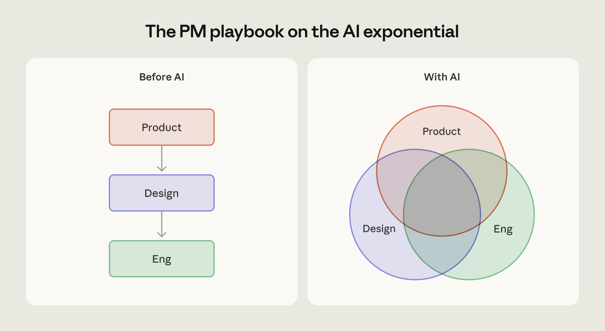
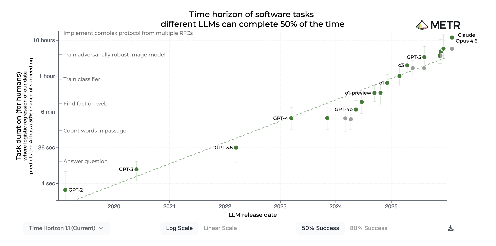

# AI 指数曲线上的产品管理（中英对照）

> **原文标题：** Product management on the AI exponential
> **作者：** Anthropic（原文未署名）
> **原文链接：** https://claude.com/blog/product-management-on-the-ai-exponential
> **发布日期：** 2026-03-19
> **翻译模型：** GLM-5.3
> 排版：每段英文原文在前，中文翻译紧随其后。术语保留英文原文并附中文释义。

---

Claude Code's Head of Product Cat Wu on AI product management: how to rethink your workflows and roadmaps as model intelligence compounds.

Claude Code 产品负责人 Cat Wu 谈 AI 产品管理：当模型智能持续复合式增长时，如何重新思考你的工作流与路线图。

Claude Code's Head of Product Cat Wu shares how product management teams are adapting their workflows and roadmaps in the face of rapidly evolving model intelligence.

Claude Code 产品负责人 Cat Wu 分享产品管理团队如何在模型智能快速演进的背景下调整自己的工作流与路线图。

Since Claude Sonnet 3.5 (new) in October 2024, I made a habit of testing every new model by asking Claude Code (an internal tool at the time) to add a table tool to Excalidraw. With each new model, Claude got a little further but still failed.

自 2024 年 10 月的 Claude Sonnet 3.5（new）发布以来，我养成了一个习惯：每发布一个新模型，就让 Claude Code（当时还是内部工具）给 Excalidraw 添加一个表格工具。每换一个新模型，Claude 都能多前进一点，但仍然会失败。

Then, with the release of Opus 4 in June 2025, Claude started occasionally succeeding, enough that we turned the exercise into a pre-recorded demo for the Claude 4 model launch to show what had become possible with our latest model.

后来，随着 2025 年 6 月 Opus 4 的发布，Claude 开始偶尔成功，以至于我们把这项练习做成了 Claude 4 模型发布的预录演示，用来展示我们的最新模型已经能够做到什么。

Less than a year later, Opus 4.6 can one-shot Excalidraw feature requests reliably enough that we feel comfortable doing it live, in front of thousands of professional developers.

不到一年之后，Opus 4.6 已经能可靠地一次性（one-shot）完成 Excalidraw 的功能请求，可靠到我们敢于在数千名专业开发者面前现场演示。

The speed of model progress keeps expanding what's possible. The traditional product management playbook is built on the assumption that what's technologically possible at the start of a project is roughly what's possible at the end. PMs would gather enough information upfront to make confident bets about the future, then execute against a plan over the course of months.

模型进步的速度在不断扩展可能的边界。传统产品管理的打法建立在一个假设之上：项目开始时技术上的可能性，与项目结束时大致相同。产品经理（PM）会在前期收集足够的信息，以便对未来做出有把握的下注，然后按照计划在数月内执行。

Exponentially improving models break that assumption. The constraints you designed around might disappear mid-project. You're building on ground that's rising underneath you, and teams need to reorganize around that reality. The new AI product management rhythm is rapid experimentation, consistent shipping, and doubling down on what works.

指数级改进的模型打破了这个假设。你当初围绕其设计的约束可能在项目中途就消失了。你正站在一块不断抬升的地面上建造，团队需要围绕这一现实重新组织。新的 AI 产品管理节奏是：快速实验、持续交付（shipping），并在有效之处加倍投入。

Not surprisingly, one of the most common questions I get as a product manager at Anthropic is how our role is changing. Here's what I've learned.

毫不意外，作为 Anthropic 的产品经理，我最常被问到的问题之一就是：我们的角色正在如何变化。以下是我的心得。

# 我走向 Claude Code 产品管理的历程（My journey to product management with Claude Code）

I started my career as a product engineer at startups like Scale AI and Dagster, and then became a venture capitalist, a role in which I still wrote code to automate the tedious parts of my job, like scanning X for the announcement of new companies or detecting when open source projects were gaining momentum.

我的职业生涯始于在 Scale AI 和 Dagster 等初创公司担任产品工程师，后来成为一名风险投资人（venture capitalist）--即便在那个岗位上，我依然会写代码把工作中繁琐的部分自动化，比如扫描 X 上新公司的发布公告，或者检测哪些开源项目正在积攒势头。

I joined Anthropic in August 2024 as a product manager on the Research PM team, which bridges our research team and real-world customers to deliver better models. When Claude Code became available internally that fall, I used it to accelerate the more manual parts of my job, including building Streamlit apps to analyze large-scale user feedback and running evals to help the company find new benchmarks to trust. The low barrier to building also meant I could explore well beyond my usual role, like creating RL environments to better understand training.

2024 年 8 月，我加入 Anthropic，成为 Research PM 团队的产品经理。这个团队在我们的研究团队与真实世界的客户之间架起桥梁，以交付更好的模型。那年秋天 Claude Code 在内部开放后，我用它来加速工作中偏手动的部分，包括搭建 Streamlit 应用来分析大规模用户反馈，以及运行 evals（评测）帮助公司找到值得信任的新基准。搭建门槛的降低也意味着我可以探索远超日常职责的范围，比如创建 RL（强化学习）环境来更好地理解训练。

These projects took hundreds of hours of prompting Claude Code powered by Sonnet 3.5 (new), but not a single line of code written by hand.

这些项目花费了数百小时去提示（prompting）由 Sonnet 3.5（new）驱动的 Claude Code，但没有一行代码是手写的。

# 设计新的产品管理工作流（Designing a new product management workflow）

> Tools like Claude Code and Cowork are blurring the lines between distinct roles in the product development life cycle.
> Claude Code 和 Cowork 等工具正在模糊产品开发生命周期中不同角色之间的界限。

Claude Code isn't the only tool powering my workflow. Over time, I've settled into a natural division of labor across three products: a chat collaborator (Claude.ai), agentic coding tool (Claude Code), and a knowledge work tool (Cowork).

Claude Code 并不是支撑我工作流的唯一工具。随着时间推移，我在三款产品之间形成了一种自然的分工：聊天协作者（Claude.ai）、agentic coding（智能体化编码）工具（Claude Code），以及知识工作工具（Cowork）。

Claude.ai is where I talk to Claude as a thought partner without needing it to take action. I bounce ideas for strategy docs, how to handle tricky situations, and get quick answers.

Claude.ai 是我把 Claude 当作思考伙伴（thought partner）来交谈的地方，不需要它采取行动。我会在这里就策略文档抛出想法、讨论如何处理棘手的局面，并快速获得答案。

Claude Code is where I build prototypes, evals, and scripts, many of which call Claude API. I use this when the output is code.

Claude Code 是我构建原型、evals 和脚本的地方，其中很多都会调用 Claude API。当产出物是代码时，我就用它。

Cowork is where I do everything else, from getting to inbox zero, tracking and acting on a todo list, creating slide decks, understanding the history of a decision by searching Slack, and booking my work travel.

Cowork 则承载其余的一切：从把收件箱清零（inbox zero）、跟进待办清单并逐项执行、制作幻灯片，到通过搜索 Slack 理解某项决策的来龙去脉，以及预订出差行程。

I've talked with product managers across the industry who've found their own versions of this workflow:

我和行业内许多产品经理交流过，他们也找到了各自版本的工作流：

> "Claude has raised the ceiling on what good product teams can build, and dramatically shortened the distance between idea and prototype. Getting something tangible in front of customers used to take weeks of building. Now I'll start in Claude Cowork, pulling in context from Slack, our codebase, and docs, then move into Claude Code to have something demo-able in a couple of hours. Good product teams have always tested their ideas with real customers, and that instinct hasn't changed. What has is how many more high-quality ideas we can actually put through the loop." - Bihan Jiang, Director of Product, Decagon

> "Claude 抬高了优秀产品团队能构建成果的上限，也极大缩短了从想法到原型的距离。过去，要让客户看到有形的东西，需要数周的开发。现在，我会先从 Claude Cowork 开始，从 Slack、我们的代码库和文档中提取上下文，然后转到 Claude Code，几个小时之内就能做出可演示的成果。优秀的产品团队一直都坚持用真实客户来检验想法，这种直觉没有改变。改变的是，我们真正能送入这个验证循环的高质量想法多了多少。" -- Bihan Jiang，Decagon 产品总监（Director of Product）

> "To me, being a PM in an AI-native world is both creative and academic. Each new model release changes what's possible, and in building Datadog's Bits AI SRE agent we study its strengths and failure modes through offline evaluation on real-world production incidents. We also design tight feedback loops, refining the UX to surface where the agent struggles and turning those insights into product improvements. In that sense, a PM's craft has shifted from defining certainty upfront to accelerating discovery." - Kai Xin Tai, Senior Product Manager, Datadog

> "对我来说，在 AI-native（AI 原生）世界里做产品经理，既需要创造力也需要学术精神。每一次新模型发布都会改变可能的边界。在构建 Datadog 的 Bits AI SRE 智能体时，我们通过对真实生产事故进行离线评估（offline evaluation）来研究它的优势与失败模式。我们还设计了紧密的反馈循环，不断打磨 UX，让智能体的薄弱环节暴露出来，并把这些洞察转化为产品改进。从这个意义上说，产品经理的手艺已经从'预先定义确定性'转变为'加速发现'。" -- Kai Xin Tai，Datadog 高级产品经理（Senior Product Manager）

One of the most exciting parts of being a product manager today is that these workflows are constantly evolving and giving us more leverage.

当今产品经理工作最令人兴奋的一点是，这些工作流在不断演进，给了我们更大的杠杆。

# 拥抱 AI 指数曲线（Leaning into the AI exponential）

> METR. (2026, March). Task-Completion Time Horizons of Frontier AI Models. https://metr.org/time-horizons/
> METR.（2026 年 3 月）。《前沿 AI 模型的任务完成时间跨度》。https://metr.org/time-horizons/

METR finds that, about half the time, Opus 4.6 can complete software tasks which take humans almost 12 hours. When we first started building Claude Code, Sonnet 3.5 (new) was the frontier model and METR measured that it could do tasks that would take a human around 21 minutes. That's a roughly 41x jump in 16 months.

METR 发现，Opus 4.6 大约有半数概率能完成人类需要将近 12 小时才能完成的软件任务。而我们刚开始构建 Claude Code 时，Sonnet 3.5（new）还是前沿模型，METR 测得它能完成人类大约需要 21 分钟的任务。这相当于 16 个月里约 41 倍的跃升。

The Claude Code team has evolved to keep pace with how quickly models improve. Our roles are blending together: designers ship code, engineers make product decisions, product managers build prototypes and evals. This works because clear strategy and goals let everyone prioritize autonomously. The product manager's job is to create clarity in the ambiguity that rapid model progress creates, push the team to think bigger about what's possible, and clear the path to shipping faster.

Claude Code 团队也在进化，以跟上模型改进的速度。我们的角色正在彼此融合：设计师发布代码，工程师做产品决策，产品经理构建原型和 evals。这种模式之所以行得通，是因为清晰的策略和目标让每个人都能自主排列优先级。产品经理的职责，是在模型快速进步带来的模糊性中创造清晰，推动团队对可能性展开更大胆的思考，并为更快交付扫清道路。

Here are four shifts we've embraced:

以下是我们已经拥抱的四个转变：

Plan in short sprints

用短冲刺来规划。

Traditional product manager thinking treats exploration as something that happens before the roadmap gets locked. You do your research, you write the PRD, and you hand it off for the engineering team to build.

传统产品经理思维把探索视为路线图锁定之前发生的事情。你做调研、写 PRD（产品需求文档），然后交接给工程团队去实现。

Instead of a long-term roadmap, we encourage everyone on the team (engineers, product managers, designers) to take on side quests. A side quest is a short self-directed experiment you run outside your official roadmap—an afternoon spent prototyping an idea, testing a capability you assumed was out of reach, or just seeing what happens when you push the model harder than you expect to.

我们不采用长期路线图，而是鼓励团队中的每个人（工程师、产品经理、设计师）去承接"支线任务"（side quest）。支线任务是在官方路线图之外进行的短期自主实验--花一个下午把一个想法做成原型、测试一项你原以为遥不可及的能力，或者只是看看当你把模型逼到超出预期的程度时会发生什么。

Some of Anthropic's most popular features—Claude Code on Desktop, the AskUserQuestion tool, and todo lists—emerged this way.

Anthropic 一些最受欢迎的功能--桌面版 Claude Code（Claude Code on Desktop）、AskUserQuestion 工具和待办清单（todo lists）--就是这样诞生的。

Encourage demos and evals over docs

鼓励以演示和评测取代文档。

Our team has largely replaced documentation-first thinking with prototype-first thinking. Instead of hosting traditional stand-ups, we share demos of new ideas. Internal users try them, and the ones with real engagement get polished and shared more broadly. Because you can prototype in an afternoon, wrong bets are cheap.

我们的团队在很大程度上已经用"原型优先"的思维取代了"文档优先"的思维。我们不再开传统的站会，而是分享新想法的演示。内部用户试用之后，那些真正有人用的会被打磨得更完善，并更广泛地推广。因为你可以在一个下午就做出原型，错误的赌注成本很低。

For example, when Noah shared his plugins spec with Claude Code, the prototype that came back was close to production ready. That prototype anchored what the team ultimately shipped since it enabled the team to quickly validate the UX.

例如，当 Noah 把他的插件规格说明（spec）交给 Claude Code 时，返回的原型已经接近可用于生产环境。那个原型锚定了团队最终发布的东西，因为它让团队能够快速验证 UX。

Pro-tip: after you write a spec, send it to Claude Code and see if it can build it. Even a rough prototype changes the conversation.

实用技巧：写完规格说明后，把它发给 Claude Code，看看它能不能做出来。哪怕只是一个粗糙的原型，也能改变讨论的走向。

In addition to demos, evals can also help make an abstract product feel more concrete. For example, for agent teams which lets users coordinate multiple Claude Code instances working together, Conner hand-crafted a set of evals to understand when agent teams work well, when they don't, and what to fix. Measuring whether the feature is working makes it easier to improve it.

除了演示，evals 也能让抽象的产品变得更具体。以 agent teams（智能体团队，允许用户协调多个 Claude Code 实例协同工作）为例，Conner 手工打造了一组 evals，用来理解智能体团队什么时候运转良好、什么时候不行、以及该修复什么。度量一个功能是否正常工作，会让改进它变得更容易。

Revisit features with new models

用新模型重新审视已有功能。

Now, you ship a feature, then a better model comes out and your feature could be dramatically better. Every model release is an implicit prompt to revisit what you've already built.

现在的情况是：你发布了一个功能，接着更好的模型问世，你的功能就可能大幅提升。每一次模型发布都是一个隐性的提示：重新审视你已经构建的东西。

The best way to catch these moments is to be a daily active user and deliberately ask it to do things you think might be too hard. Sometimes it works, and that's a signal that the product needs to catch up.

捕捉这些时刻的最佳方式，就是成为每日活跃用户，并刻意让它做一些你认为可能太难的事情。有时候它真的做到了，这就是一个信号：产品需要跟上了。

That's how Claude Code with Chrome happened. We noticed users were building web apps with Claude Code and then manually switching to Claude in Chrome to test it. Users were manually prompting and copying and pasting instructions between these two tools. It worked well enough that we realized this should be a built-in feature. If users are hacking something together, that's scaffolding you can build into the product.

Claude Code with Chrome 就是这样诞生的。我们注意到用户用 Claude Code 构建 Web 应用，然后手动切换到 Chrome 中的 Claude 去测试。用户在两个工具之间手动发提示、复制粘贴指令。这已经好用 到我们意识到它应该成为一个内置功能。如果用户在手动拼凑某种用法，那就是你可以内建到产品中的脚手架（scaffolding）。

When prototyping these ideas, always optimize for capability first. Use more tokens than you think you need. It's a common mistake to cut token costs too early and ship something much less capable as a result. You can always bring costs down later as cheaper models catch up, but first you need to know whether the feature is even possible.

在为这些想法做原型时，永远先为能力优化。用比自认为需要的更多的 token。过早削减 token 成本、结果交付出能力大打折扣的东西，是一种常见错误。随着更便宜的模型逐渐跟上，成本总可以后来再降，但首先你得知道这个功能到底可不可行。

Do the simple thing

做简单的事。

At Anthropic, we have a guiding principle across every team: do the simple thing that works.

在 Anthropic，我们每个团队都有一条指导原则：做简单可行的事。

If your product cleverly works around a model limitation, that workaround becomes unnecessary complexity when the next model drops. That's why "do the simple thing" matters: the simpler your implementation, the easier it is to swap in new capabilities when they arrive.

如果你的产品巧妙地绕过了某个模型局限，那么当下一个模型发布时，这种绕行方案就会变成不必要的复杂性。这正是"做简单的事"重要的原因：实现越简单，当新能力到来时就越是容易替换进去。

When we first launched todo lists in Claude Code, the model wouldn't reliably check off items as it completed them. So we added system reminders every few messages that would periodically nudge the agent to update its own todo list. It worked, but it was a hack. With the next model, the behavior came for free and we removed the reminders entirely. We've seen this pattern repeatedly: our system prompt and tool descriptions used to be heavily engineered to compensate for model limitations, and we've been able to cut the prompting with each model, including a 20% reduction for Opus 4.6.

我们最初在 Claude Code 中发布待办清单时，模型并不能可靠地在完成条目后勾选它们。于是我们每隔几条消息就插入 system reminders（系统提醒），周期性地提示智能体更新自己的待办清单。这招管用，但它是个 hack。到了下一个模型，这种行为是自然具备的，我们便彻底移除了这些提醒。这个模式我们反复见到：我们的系统提示词和工具描述过去经过重度工程化以弥补模型的局限，而随着每一个新模型，我们都能削减提示词，Opus 4.6 就减少了 20%。

# 展望未来（Looking forward）

Many product managers are used to having tight control over the full product experience, but AI pushes you to let go in order to move quickly. That instinct for control is the first thing AI product management asks you to unlearn.

许多产品经理习惯于对完整的产品体验保持紧密控制，但 AI 会推动你放手，才能快速前进。这种控制本能，正是 AI 产品管理要求你首先戒除的东西。

When it comes to building AI products in particular, it feels like surfing a wave where the most important thing is to stay on it. As a perfectionist, this was the hardest shift for me to get comfortable with, but the product manager's role is now to identify the handful of true non-negotiables and let the rest go.

尤其是在构建 AI 产品时，感觉就像在冲浪，最重要的是留在浪头上。作为一个完美主义者，这是我最难适应的转变，但产品经理现在的职责是识别出少数真正不可妥协的事项，其余的则放手。

The net effect of these shifts is that product teams can move significantly faster. When a product manager can go from idea to working prototype in an afternoon, the gap between "what if we tried…" and "here, try this" nearly disappears.

这些转变的净效应是产品团队的行动速度显著加快。当产品经理能在一个下午之内从想法走到可运行的原型，"我们要不要试试……"和"来，试试这个"之间的鸿沟几乎消失了。

At Anthropic, product managers aren't the only ones transforming their workflows with Claude. Our data science, finance, marketing, legal, and design teams picked up these tools on their own. The whole organization moves at the same speed instead of waiting on handoffs.

在 Anthropic，用 Claude 改造工作流的不只是产品经理。我们的数据科学、财务、市场、法务和设计团队都自发用起了这些工具。整个组织以同样的速度前进，而不是等待交接。

The PM role now is to track both things at once: how AI is changing the way you work, and how it's changing what's possible in your product. Do that well, and you stop being surprised when the table tool finally works. You're the one who saw it coming.

如今 PM 的角色是同时追踪两件事：AI 如何改变你工作的方式，以及它如何改变产品中可能的边界。这件事做得好，当表格工具终于跑通时你就不会再惊讶了。因为你正是那个预见到它会来的人。

Start building better products with Claude Code.

开始用 Claude Code 构建更好的产品吧。

Acknowledgments: This article was written by Cat Wu, the Head of Product for Claude Code at Anthropic. You can find her on X and LinkedIn. She'd like to thank Bihan Jiang and Kai Xin Tai for their contributions to this piece.

致谢：本文由 Cat Wu 撰写，她是 Anthropic Claude Code 的产品负责人。你可以在 X 和 LinkedIn 上找到她。她要感谢 Bihan Jiang 和 Kai Xin Tai 对本文的贡献。
