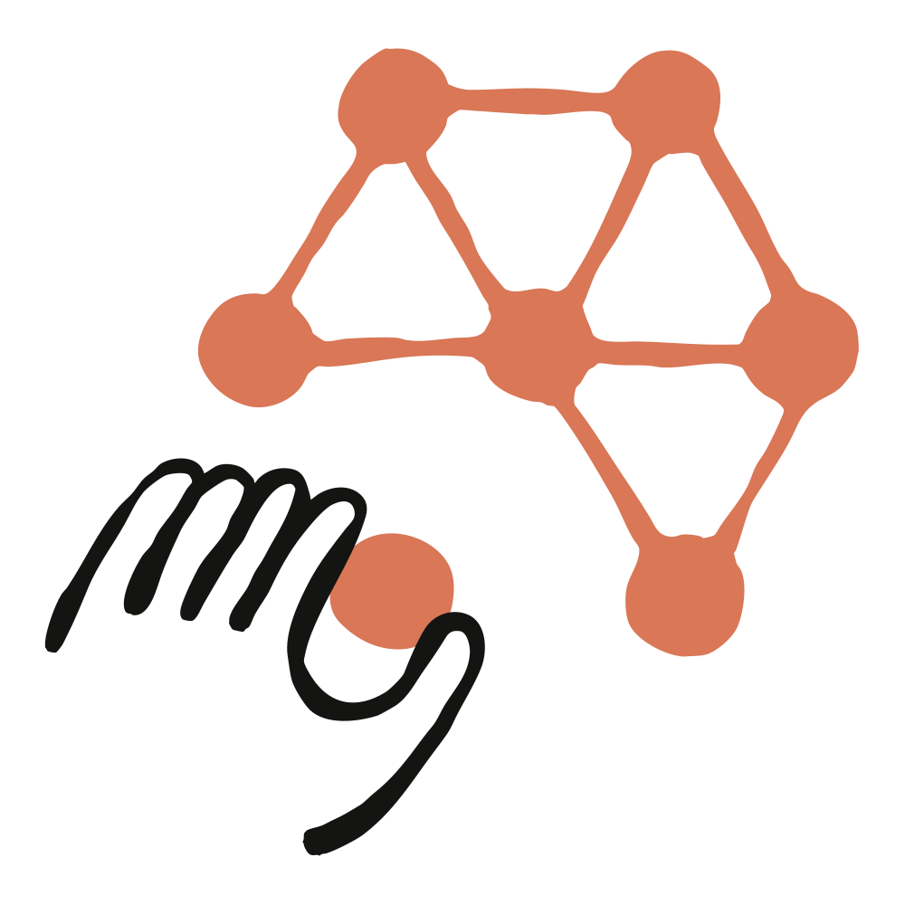
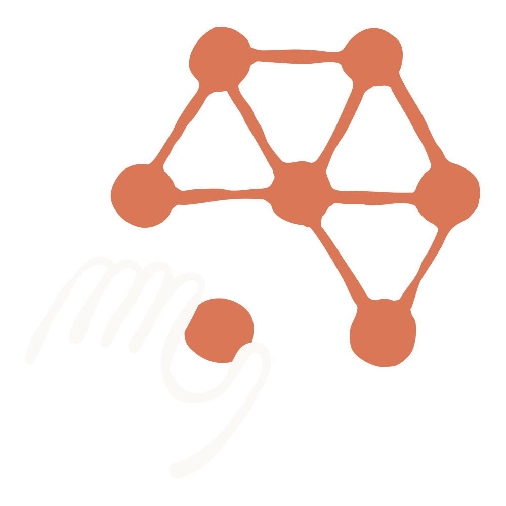

# Skills 详解：Skills 与提示词、Projects、MCP 和 subagents 的对比（中英对照）

> **原文标题：** Skills explained: How Skills compares to prompts, Projects, MCP, and subagents
> **作者：** Anthropic（原文未署名）
> **原文链接：** https://claude.com/blog/skills-explained
> **发布日期：** 2026-03-05
> **翻译模型：** GLM-5.3
> 排版：每段英文原文在前，中文翻译紧随其后。术语保留英文原文并附中文释义。

---

Skills are an increasingly powerful tool for creating custom AI workflows and agents, but where do they fit in the Claude stack? We explain what tool to use when - and how they all work together.

Skills 是创建自定义 AI 工作流和智能体时越来越强大的工具，但它在 Claude 技术栈中处于什么位置？我们解释什么场景该用什么工具--以及它们如何协同工作。

Since introducing Skills, there's been interest in understanding how the various components of Claude's agentic ecosystem work together.

自推出 Skills 以来，很多人有兴趣了解 Claude 智能体生态中各个组件是如何协同工作的。

Whether you're building sophisticated workflows in Claude Code, creating enterprise solutions with the API, or maximizing your productivity on Claude.ai, knowing which tool to reach for-and when-can transform how you work with Claude.

无论你是在 Claude Code 中构建复杂的工作流，用 API 创建企业级解决方案，还是在 Claude.ai 上最大化自己的生产力，知道该用哪个工具--以及何时用--都会改变你与 Claude 协作的方式。

This guide breaks down each building block, explains when to use what, and shows you how to combine them for powerful agentic workflows.

本指南会拆解每个构建块（building block），解释何时该用什么，并展示如何组合它们以构建强大的智能体工作流。

# 理解你的智能体构建块（Understanding your agentic building blocks）

## 什么是 Skills？（What are Skills?）

Skills are folders containing instructions, scripts, and resources that Claude discovers and loads dynamically when relevant to a task. Think of them as specialized training manuals that give Claude expertise in specific domains-from working with Excel spreadsheets to following your organization's brand guidelines.

Skills 是包含指令、脚本和资源的文件夹，Claude 会在与任务相关时动态发现并加载它们。可以把它们想象成专业培训手册，赋予 Claude 特定领域的专业能力--从处理 Excel 电子表格到遵循你所在组织的品牌规范。

How Skills work: When Claude encounters a task, it scans available Skills to find relevant matches. Skills use progressive disclosure: metadata loads first (~100 tokens), providing just enough information for Claude to know when a Skill is relevant. Full instructions load when needed (<5k tokens), and bundled files or scripts load only as required.

Skills 的工作方式：当 Claude 遇到任务时，它会扫描可用的 Skills 寻找相关匹配。Skills 采用渐进式披露（progressive disclosure）：先加载元数据（约 100 个 token），恰好足以让 Claude 判断某个 Skill 是否相关。需要时再加载完整指令（5k token 以内），打包的文件或脚本则仅在需要时加载。

When to use Skills: Choose Skills when you need Claude to perform specialized tasks consistently and efficiently. They're ideal for:

何时使用 Skills：当你需要 Claude 一致且高效地执行专业化任务时，选择 Skills。它们非常适合：

- Organizational workflows: Brand guidelines, compliance procedures, document templates
- Domain expertise: Excel formulas, PDF manipulation, data analysis
- Personal preferences: Note-taking systems, coding patterns, research methods

- 组织工作流：品牌规范、合规流程、文档模板
- 领域专业知识：Excel 公式、PDF 处理、数据分析
- 个人偏好：笔记系统、编码模式、研究方法

Example: Create a brand guidelines Skill that includes your company's color palette, typography rules, and layout specifications. When Claude creates presentations or documents, it automatically applies these standards without you needing to explain them each time.

示例：创建一个品牌规范 Skill，包含你公司的色彩方案、字体规则和版式规格。当 Claude 创建演示文稿或文档时，会自动应用这些标准，你无需每次都解释一遍。

Learn more about Skills and check out our growing Skills library.

了解更多关于 Skills 的信息，并浏览我们不断丰富的 Skills 库。

## 什么是提示词？（What are prompts?）

Prompts are the instructions you provide to Claude in natural language during a conversation. They're ephemeral, conversational, and reactive-you provide context and direction in the moment.

提示词（prompt）是你在对话中用自然语言提供给 Claude 的指令。它们是临时的、对话式的、被动响应的--你在当下提供上下文和方向。

When to use prompts: Use prompts for:

何时使用提示词：在以下场景使用提示词：

- One-off requests: "Summarize this article"
- Conversational refinement: "Make that tone more professional"
- Immediate context: "Analyze this data and identify trends"
- Ad-hoc instructions: "Format this as a bulleted list"

- 一次性请求："总结这篇文章"
- 对话式修改："把语气改得更专业一些"
- 即时上下文："分析这份数据并找出趋势"
- 临时指令："把它格式化为项目符号列表"

Example:

示例：

Please conduct a comprehensive security review of this code. I'm looking for:

请对这段代码进行一次全面的安全审查。我希望看到：

1. Common vulnerabilities including:

1. 常见漏洞，包括：

- Injection flaws (SQL, command, XSS, etc.)
- Authentication and authorization issues
- Sensitive data exposure
- Security misconfigurations
- Broken access control
- Cryptographic failures
- Input validation problems
- Error handling and logging issues

- 注入缺陷（SQL 注入、命令注入、XSS 等）
- 身份验证与授权问题
- 敏感数据暴露
- 安全配置错误
- 访问控制失效
- 加密机制失效
- 输入验证问题
- 错误处理与日志问题

2. For each issue you find, please provide:

2. 对于发现的每个问题，请提供：

- Severity level (Critical/High/Medium/Low)
- Location in the code (line numbers or function names)
- Explanation of why it's a security risk and how it could be exploited
- Specific fix recommendation with code examples where possible
- Best practice guidance to prevent similar issues

- 严重程度（危急/高/中/低）
- 代码中的位置（行号或函数名）
- 解释为什么存在安全风险以及可能如何被利用
- 具体修复建议，尽可能附代码示例
- 防止类似问题的最佳实践指引

3. Code context: [Describe what the code does, the language/framework, and the environment it runs in - e.g., "This is a Node.js REST API that handles user authentication and processes payment data"]

3. 代码背景：[描述代码的功能、所用语言/框架及其运行环境--例如："这是一个处理用户身份验证和支付数据的 Node.js REST API"]

4. Additional considerations:

4. 其他注意事项：

- Are there any OWASP Top 10 vulnerabilities present?
- Does the code follow security best practices for [specific framework/language]?
- Are there any dependencies with known vulnerabilities?

- 是否存在 OWASP Top 10 清单中的漏洞？
- 代码是否遵循 [特定框架/语言] 的安全最佳实践？
- 是否存在带有已知漏洞的依赖项？

Please prioritize findings by severity and potential impact.

请按严重程度和潜在影响对发现的问题排序。

Pro-tip: Prompts are your primary way of interacting with Claude, but they don't persist across conversations. For repeated workflows or specialized knowledge, consider capturing prompts as Skills or project instructions.

小技巧：提示词是你与 Claude 交互的主要方式，但它们不会跨会话保留。对于重复性工作流或专业知识，可以考虑把提示词沉淀为 Skills 或项目指令。

When to use a Skill instead: If you find yourself typing the same prompt repeatedly across multiple conversations, it's time to create a Skill. Transform recurring instructions like "review this code for security vulnerabilities using OWASP standards" or "format this analysis with executive summary, key findings, and recommendations" into Skills. This saves you from re-explaining procedures each time and ensures consistent execution.

何时改用 Skill：如果你发现自己在多个会话中反复输入同样的提示词，就该创建一个 Skill 了。把"按照 OWASP 标准审查这段代码的安全漏洞"或"把这份分析格式化为执行摘要、关键发现和建议"这类反复出现的指令转化为 Skills。这样你不必每次重新解释流程，还能确保执行的一致性。

Check out our prompt library, prompting best practices, or our smart prompt maker to get started.

可以查看我们的提示词库、提示词最佳实践或智能提示词生成器来上手。

## 什么是 Projects？（What are Projects?）

Available on all paid Claude plans, Projects are self-contained workspaces with their own chat histories and knowledge bases. Each project includes a 200K context window where you can upload documents, provide context, and set custom instructions that apply to all conversations within that project.

Projects（项目）在所有 Claude 付费方案中可用，是自带聊天记录和知识库的独立工作区。每个项目包含一个 200K 的上下文窗口（context window），你可以上传文档、提供背景信息，并设置适用于该项目内所有对话的自定义指令。

How Projects work: Everything you upload to a project's knowledge base becomes available across all chats within that project. Claude automatically uses this context to provide more informed, relevant responses. When your project knowledge approaches context limits, Claude seamlessly enables Retrieval Augmented Generation (RAG) mode to expand capacity by up to 10x.

Projects 的工作方式：你上传到项目知识库的所有内容，都会在该项目内的所有聊天中可用。Claude 会自动利用这些上下文给出更有依据、更相关的回答。当项目知识接近上下文上限时，Claude 会无缝启用检索增强生成（Retrieval Augmented Generation，RAG）模式，将容量最多扩展 10 倍。

When to use Projects: Choose Projects when you need:

何时使用 Projects：在需要以下能力时选择 Projects：

- Persistent context: Background knowledge that should inform every conversation
- Workspace organization: Separate contexts for different initiatives
- Team collaboration: Shared knowledge and conversation history (on Team and Enterprise plans)
- Custom instructions: Project-specific tone, perspective, or approach

- 持久上下文：应当为每次对话提供背景的知识
- 工作区组织：为不同的项目事务划分独立上下文
- 团队协作：共享知识与对话记录（Team 和 Enterprise 方案）
- 自定义指令：项目专属的语气、视角或方法

Example: Create a "Q4 Product Launch" project containing market research, competitor analysis, and product specifications. Every chat in this project has access to this knowledge without you needing to re-upload or re-explain the context.

示例：创建一个"Q4 产品发布"项目，放入市场研究、竞争对手分析和产品规格。该项目内的每次聊天都能使用这些知识，你无需重新上传或重新解释背景。

When to use a Skill instead: Projects give Claude persistent context for a specific body of work-your company's codebase, a research initiative, an ongoing client engagement. Skills teach Claude how to do something. A Project might contain all the background on your product launch, while a skill could teach Claude your team's writing standards or code review process. If you find yourself copying the same instructions across multiple Projects, that's a signal to create a skill instead.

何时改用 Skill：Projects 为某一具体工作--你公司的代码库、一项研究计划、一个进行中的客户合作--提供持久上下文。而 Skills 教 Claude 如何做事。一个 Project 可以装下产品发布的全部背景，而一个 Skill 可以教会 Claude 你团队的写作规范或代码审查流程。如果你发现自己在多个 Projects 之间复制同样的指令，那就是该创建 Skill 的信号。

Learn more about Projects.

了解更多关于 Projects 的信息。

## 什么是 subagents？（What are subagents?）

Subagents are specialized AI assistants with their own context windows, custom system prompts, and specific tool permissions. Available in Claude Code and the Claude Agent SDK, subagents handle discrete tasks independently and return results to the main agent.

Subagents（子智能体）是拥有独立上下文窗口、自定义 system prompt 和特定工具权限的专用 AI 助手。Subagents 在 Claude Code 和 Claude Agent SDK 中可用，独立处理离散任务并把结果返回给主智能体。

How subagents work: Each subagent operates with its own configuration-you define what it does, how it approaches problems, and which tools it can access. Claude automatically delegates tasks to appropriate subagents based on their descriptions, or you can explicitly request a specific subagent.

Subagents 的工作方式：每个 subagent 以自己的配置运行--你定义它做什么、如何处理问题以及可以访问哪些工具。Claude 会根据描述自动把任务委派给合适的 subagent，你也可以显式指定某个 subagent。

When to use subagents: Use subagents for:

何时使用 subagents：在以下场景使用 subagents：

- Task specialization: Code review, test generation, security audits
- Context management: Keep the main conversation focused while offloading specialized work
- Parallel processing: Multiple subagents can work on different aspects simultaneously
- Tool restriction: Limit specific subagents to safe operations (e.g., read-only access)

- 任务专业化：代码审查、测试生成、安全审计
- 上下文管理：把专业性工作分流出去，保持主对话聚焦
- 并行处理：多个 subagents 可以同时处理不同方面
- 工具限制：把特定 subagent 限制在安全操作上（例如只读访问）

Example:

示例：

```
Create a code-reviewer subagent with access to Read, Grep, and Glob tools but not Write or Edit. When you modify code, Claude automatically delegates to this subagent for quality and security review without risking unintended code changes.
```

When to use a Skill instead: If multiple agents or conversations need the same expertise-like security review procedures or data analysis methods-create a Skill rather than building that knowledge into individual subagents. Skills are portable and reusable, while subagents are purpose-built for specific workflows. Use Skills to teach expertise that any agent can apply; use subagents when you need independent task execution with specific tool permissions and context isolation.

何时改用 Skill：如果多个智能体或会话需要同样的专业知识--比如安全审查流程或数据分析方法--就创建一个 Skill，而不要把这些知识分别构建进一个个单独的 subagent。Skills 可移植、可复用，而 subagents 是为特定工作流量身定制的。想教任何智能体都能使用的专业知识，用 Skills；需要独立执行任务并配合特定工具权限和上下文隔离时，用 subagents。

Learn more about subagents.

了解更多关于 subagents 的信息。

## 什么是 MCP？（What is MCP?）


> MCP creates a universal connection layer between AI applications and your existing tools and data sources.
> MCP 在 AI 应用与你现有的工具和数据源之间建立一个通用连接层。

The Model Context Protocol (MCP) is an open standard for connecting AI assistants to external systems where data lives-content repositories, business tools, databases, and development environments.

模型上下文协议（Model Context Protocol，MCP）是一个开放标准，用于把 AI 助手连接到数据所在的各类外部系统--内容仓库、商业工具、数据库和开发环境。

How MCP works: MCP provides a standardized way to connect Claude to your tools and data sources. Instead of building custom integrations for each data source, you build against a single protocol. MCP servers expose data and capabilities; MCP clients (like Claude) connect to these servers.

MCP 的工作方式：MCP 提供了一种把 Claude 连接到你的工具和数据源的标准化方式。你不需要为每个数据源构建定制集成，只需面向单一协议构建。MCP 服务器暴露数据和能力；MCP 客户端（如 Claude）连接这些服务器。

When to use MCP: Choose MCP when you need Claude to:

何时使用 MCP：当你需要 Claude 做以下事情时选择 MCP：

- Access external data: Google Drive, Slack, GitHub, databases
- Use business tools: CRM systems, project management platforms
- Connect to development environments: Local files, IDEs, version control
- Integrate with custom systems: Your proprietary tools and data sources

- 访问外部数据：Google Drive、Slack、GitHub、数据库
- 使用商业工具：CRM 系统、项目管理平台
- 连接开发环境：本地文件、IDE、版本控制
- 集成定制系统：你的专有工具和数据源

Example: Connect Claude to your company's Google Drive via MCP. Now Claude can search documents, read files, and reference internal knowledge without manual uploads-the connection persists and updates automatically.

示例：通过 MCP 把 Claude 连接到你公司的 Google Drive。现在 Claude 可以搜索文档、读取文件、引用内部知识，无需手动上传--连接会持久保留并自动更新。

When to use a Skill instead: MCP connects Claude to data; Skills teach Claude what to do with that data. If you're explaining how to use a tool or follow procedures-like "when querying our database, always filter by date range first" or "format Excel reports with these specific formulas"-that's a Skill. If you need Claude to access the database or Excel files in the first place, that's MCP. Use both together: MCP for connectivity, Skills for procedural knowledge.

何时改用 Skill：MCP 把 Claude 连接到数据；Skills 教 Claude 如何处理这些数据。如果你是在解释如何使用某个工具或遵循某套流程--比如"查询我们的数据库时，总是先按日期范围过滤"或"用这些特定公式格式化 Excel 报表"--那是 Skill。如果你首先需要 Claude 能访问数据库或 Excel 文件，那是 MCP。两者配合使用：MCP 负责连接，Skills 负责程序性知识。

Learn more about MCP and check out documentation on how to build an MCP server.

了解更多关于 MCP 的信息，并查阅关于如何构建 MCP 服务器的文档。

# 它们如何协同工作（How they work together）

The real power emerges when you combine these building blocks. Each serves a distinct purpose, and together they create sophisticated agentic workflows.

真正的力量来自把这些构建块组合起来。每个组件都有独特用途，组合起来就能创造复杂的智能体工作流。

## 对比：选择合适的工具（Comparison: choosing the right tool）

| Feature | Skills | Prompts | Projects | Subagents | MCP |
| --- | --- | --- | --- | --- | --- |
| What it provides | Procedural knowledge | Moment-to-moment instructions | Background knowledge | Task delegation | Tool connectivity |
| Persistence | Across conversations | Single conversation | Within project | Across sessions | Continuous connection |
| Contains | Instructions + code + assets | Natural language | Documents + context | Full agent logic | Tool definitions |
| When it loads | Dynamically, as needed | Each turn | Always in project | When invoked | Always available |
| Can include code | Yes | No | No | Yes | Yes |
| Best for | Specialized expertise | Quick requests | Centralized context | Specialized tasks | Data access |

| 特性 | Skills | 提示词（Prompts） | Projects | Subagents | MCP |
| --- | --- | --- | --- | --- | --- |
| 提供什么 | 程序性知识 | 即时指令 | 背景知识 | 任务委派 | 工具连接 |
| 持久性 | 跨会话保留 | 单次会话内 | 项目内 | 跨会话 | 持续连接 |
| 包含内容 | 指令 + 代码 + 资源 | 自然语言 | 文档 + 上下文 | 完整智能体逻辑 | 工具定义 |
| 加载时机 | 按需动态加载 | 每轮对话 | 始终在项目中 | 被调用时 | 始终可用 |
| 可否包含代码 | 是 | 否 | 否 | 是 | 是 |
| 最适合 | 专业化技能 | 快速请求 | 集中管理上下文 | 专业化任务 | 数据访问 |

## 智能体工作流示例：研究智能体（Example agentic workflow: research agent）

Let's build a comprehensive research agent that combines multiple building blocks. This example shows how to assemble and activate an agent for competitive analysis.

我们来构建一个组合多个构建块的综合研究智能体。这个例子展示如何为竞争分析组装并激活一个智能体。

Step 1: Set up your Project

第 1 步：搭建你的 Project

Create a "Competitive Intelligence" project and upload:

创建一个"竞争情报"（Competitive Intelligence）项目并上传：

- Industry reports and market analyses
- Competitor product documentation
- Customer feedback from your CRM
- Previous research summaries

- 行业报告与市场分析
- 竞争对手产品文档
- 来自 CRM 的客户反馈
- 以往研究摘要

Add project instructions:

添加项目指令：

Analyze competitors through the lens of our product strategy. Focus on differentiation opportunities and emerging market trends. Present findings with specific evidence and actionable recommendations.

从我们产品战略的视角分析竞争对手。聚焦差异化机会和新兴市场趋势。呈现发现时要有具体证据和可执行的建议。

Step 2: Connect data sources via MCP

第 2 步：通过 MCP 连接数据源

Enable MCP servers for:

为以下服务启用 MCP 服务器：

- Google Drive (to access shared research documents)
- GitHub (to review competitor open-source repositories)
- Web search (for real-time market information)

- Google Drive（访问共享研究文档）
- GitHub（审查竞争对手的开源仓库）
- 网络搜索（获取实时市场信息）

Step 3: Create specialized Skills

第 3 步：创建专用 Skills

Create a "competitive-analysis" skill:

创建一个"competitive-analysis"（竞争分析）Skill：

```markdown
# My Company GDrive Navigation Skill

## Overview

Optimized search and retrieval strategy for Meridian Tech's Google Drive structure. Use this skill to efficiently locate internal documents, research, and strategic materials.

## Drive Organization

**Top-level structure:**

- `/Strategy & Planning/` - OKRs, quarterly plans, board decks
- `/Product/` - PRDs, roadmaps, technical specs
- `/Research/` - Market research, competitive intel, user studies
- `/Sales & Marketing/` - Case studies, pitch decks, campaign materials
- `/Customer Success/` - Implementation guides, success metrics
- `/Company Ops/` - Policies, org charts, team directories

**Naming conventions:**

- Format: `YYYY-MM-DD_DocumentName_vX`
- Final versions marked with `_FINAL`
- Drafts include `_DRAFT` or `_WIP`

## Search Best Practices

1. **Start broad, then filter** - Use folder context + keywords
2. **Target document owners** - Sales materials from Sales/, not root
3. **Check recency** - Prioritize documents from last 6 months for current strategy
4. **Look for "source of truth"** - Files with `_FINAL`, `_APPROVED`, or in `/Archives/Official/`

## Research Agent Workflow

1. Identify topic category (product, market, customer)
2. Search relevant folder with targeted keywords
3. Retrieve 3-5 most recent/relevant documents
4. Cross-reference with `/Strategy & Planning/` for context
5. Cite sources with file names and dates
```

Step 4: Configure subagents (Claude Code/SDK only)

第 4 步：配置 subagents（仅限 Claude Code/SDK）

Create specialized subagents:

创建专用 subagents：

market-researcher subagent:

market-researcher subagent：

```yaml
name: market-researcher
description: Research market trends, industry reports, and competitive landscape data. Use proactively for competitive analysis.
tools: Read, Grep, Web-search

---

You are a market research analyst specializing in competitive intelligence. When researching:

1. Identify authoritative sources (Gartner, Forrester, industry reports)
2. Gather quantitative data (market share, growth rates, funding)
3. Analyze qualitative insights (analyst opinions, customer reviews)
4. Synthesize trends and patterns

Present findings with citations and confidence levels.
```

technical-analyst subagent:

technical-analyst subagent：

```yaml
name: technical-analyst
description: Analyze technical architecture, implementation approaches, and engineering decisions. Use for technical competitive analysis.
tools: Read, Bash, Grep

---

You are a technical architect analyzing competitor technology choices. When analyzing:

1. Review public repositories and technical documentation
2. Assess architecture patterns and technology stack
3. Evaluate scalability and performance approaches
4. Identify technical strengths and limitations

Focus on actionable technical insights that inform our product decisions.
```

Step 5: Activate your research agent

第 5 步：激活你的研究智能体

Now when you ask Claude: "Analyze how our top three competitors are positioning their new AI features and identify gaps we can exploit"

现在，当你对 Claude 说："分析我们排名前三的竞争对手如何定位他们的新 AI 功能，并找出我们可以利用的差距"

Here's what happens:

接下来会发生这些事：

- Project context loads: Claude accesses your uploaded research documents and follows project instructions
- MCP connections activate: Claude searches your Google Drive for recent competitor briefs and pulls GitHub data
- Skills engage: The competitive-analysis Skill provides the analytical framework
- Subagents execute (in Claude Code): The market-researcher gathers industry data while the technical-analyst reviews technical implementations
- Prompts refine: You provide conversational guidance: "Focus especially on enterprise customers in healthcare"

- 加载 Project 上下文：Claude 访问你上传的研究文档并遵循项目指令
- 激活 MCP 连接：Claude 在你的 Google Drive 中搜索最新的竞争对手简报，并抓取 GitHub 数据
- 启用 Skills：competitive-analysis Skill 提供分析框架
- 执行 Subagents（在 Claude Code 中）：market-researcher 收集行业数据，同时 technical-analyst 审查技术实现
- 用提示词微调：你以对话方式给出指引："尤其要关注医疗健康领域的企业客户"

The result: A comprehensive competitive analysis that draws from multiple data sources, follows your analytical framework, leverages specialized expertise, and maintains context throughout your research project.

最终结果：一份综合的竞争分析--取材于多个数据源，遵循你的分析框架，利用专业化能力，并在整个研究项目中保持上下文连贯。

# 常见问题（Common questions）

### Skills 是如何工作的？（How do Skills work?）

Skills use progressive disclosure to keep Claude efficient. When working on tasks, Claude first scans Skill metadata (descriptions and summaries) to identify relevant matches. If a Skill matches, Claude loads the full instructions. Finally, if the Skill includes executable code or reference files, those load only when needed.

Skills 使用渐进式披露来保持 Claude 的高效。处理任务时，Claude 先扫描 Skill 元数据（描述和摘要）以识别相关匹配。如果某个 Skill 匹配，Claude 再加载完整指令。最后，如果该 Skill 包含可执行代码或参考文件，这些也只在需要时加载。

This architecture means you can have many Skills available without overwhelming Claude's context window. Claude accesses exactly what it needs, when it needs it.

这种架构意味着你可以同时拥有许多可用的 Skills，而不会撑爆 Claude 的上下文窗口。Claude 在需要的时候，恰好获取它需要的内容。

### Skills 对比 subagents：何时用哪个（Skills vs. subagents: when to use what）

Use Skills when: You want capabilities that any Claude instance can load and use. Skills are like training materials-they make Claude better at specific tasks across all conversations.

使用 Skills 的场景：你希望任何 Claude 实例都能加载并使用这些能力。Skills 像培训材料--它们让 Claude 在所有对话中都更擅长特定任务。

Use subagents when: You need complete, self-contained agents designed for specific purposes that handle workflows independently. Subagents are like specialized employees with their own context and tool permissions.

使用 subagents 的场景：你需要为特定目的设计、能独立处理工作流的完整独立智能体。Subagents 就像拥有自己上下文和工具权限的专职员工。

Use them together when: You want subagents with specialized expertise. For example, a code-review subagent can use Skills for language-specific best practices, combining the independence of a subagent with the portable expertise of Skills.

两者结合的场景：你想要具备专业知识的 subagents。例如，一个代码审查 subagent 可以使用面向特定语言最佳实践的 Skills，把 subagent 的独立性与 Skills 的可移植专业知识结合起来。

### Skills 对比 prompts：何时用哪个（Skills vs. prompts: when to use what）

Use prompts when: You're giving one-time instructions, providing immediate context, or having a conversational back-and-forth. Prompts are reactive and ephemeral.

使用 prompts 的场景：你在下达一次性指令、提供即时上下文，或进行来回对话。Prompts 是被动响应且转瞬即逝的。

Use Skills when: You have procedures or expertise that you'll need repeatedly. Skills are proactive-Claude knows when to apply them-and persistent across conversations.

使用 Skills 的场景：你有需要反复使用的流程或专业知识。Skills 是主动的--Claude 知道何时应用它们--并且跨会话持久存在。

Use them together: Prompts and Skills complement each other naturally. Use Skills to provide foundational expertise, then use prompts to provide specific context and refinement for each task.

两者结合：Prompts 和 Skills 天然互补。用 Skills 提供基础专业知识，再用 prompts 为每个任务提供具体上下文和细化要求。

### Skills 对比 Projects：何时用哪个（Skills vs. Projects: when to use what）

Use Projects when: You need background knowledge and context that should inform all conversations about a specific initiative. Projects provide static reference material that's always loaded.

使用 Projects 的场景：你需要背景知识和上下文，来支撑围绕某项具体事务的所有对话。Projects 提供始终加载的静态参考资料。

Use Skills when: You need procedural knowledge and executable code that activates only when relevant. Skills provide dynamic expertise that loads on-demand, saving your context window.

使用 Skills 的场景：你需要只在相关时才激活的程序性知识和可执行代码。Skills 提供按需加载的动态专业知识，节省你的上下文窗口。

Use them together when: You want both persistent context and specialized capabilities. For example, a "Product Development" project containing product specs and user research, combined with Skills for creating technical documentation and analyzing user feedback data.

两者结合的场景：你既想要持久上下文，又想要专业化能力。例如，一个包含产品规格和用户研究的"产品开发"项目，再配合用于创建技术文档和分析用户反馈数据的 Skills。

Key difference: Projects say "here's what you need to know." Skills say "here's how to do things." Projects provide a knowledge base you work within. Skills provide capabilities that work everywhere-any conversation, any project.

关键区别：Projects 说的是"这是你需要知道的"；Skills 说的是"这是做事的方法"。Projects 提供一个你在其中工作的知识库；Skills 提供到处可用的能力--任何对话、任何项目。

### Subagents 能使用 Skills 吗？（Can subagents use Skills?）

Yes. In Claude Code and the Agent SDK, subagents can access and use Skills just like the main agent. This creates powerful combinations where specialized subagents leverage portable expertise.

可以。在 Claude Code 和 Agent SDK 中，subagents 可以像主智能体一样访问和使用 Skills。这就形成了强大的组合：专业化 subagents 借助可移植的专业知识工作。

For example, your python-developer subagent can use the pandas-analysis Skill to perform data transformations following your team's conventions, while your documentation-writer subagent uses the technical-writing skill to format API documentation consistently.

例如，你的 python-developer subagent 可以使用 pandas-analysis Skill，按照团队规范执行数据转换；而你的 documentation-writer subagent 可以使用 technical-writing Skill，以一致的格式编写 API 文档。

# 开始使用（Getting started）

Ready to build with Skills? Here's how to start:

准备好用 Skills 构建了吗？可以这样开始：

Claude.ai users:

Claude.ai 用户：

- Enable Skills in Settings -> Features
- Create your first project at claude.ai/projects
- Try combining project knowledge with Skills for your next analysis task

- 在 Settings -> Features 中启用 Skills
- 在 claude.ai/projects 创建你的第一个项目
- 在下一次分析任务中尝试把项目知识与 Skills 结合起来

API developers:

API 开发者：

- Explore the Skills endpoint in documentation
- Check out our skills cookbook

- 在文档中探索 Skills 端点（endpoint）
- 查看我们的 skills cookbook（技能食谱）

Claude Code users:

Claude Code 用户：

- Install Skills via plugin marketplaces
- Check out our skills cookbook

- 通过插件市场安装 Skills
- 查看我们的 skills cookbook（技能食谱）

# Agent Skills

Start using Skills with Claude to build more powerful applications today.

立即开始在 Claude 中使用 Skills，构建更强大的应用。




