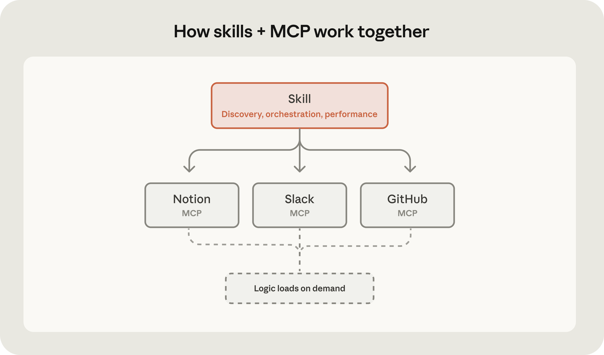

# 构建可通过 MCP 触达生产系统的智能体（中英对照）

> **原文标题：** Building agents that reach production systems with MCP
> **作者：** Anthropic（原文未署名）
> **原文链接：** https://claude.com/blog/building-agents-that-reach-production-systems-with-mcp
> **发布日期：** 2026-04-22
> **翻译模型：** GLM-5.3
> 排版：每段英文原文在前，中文翻译紧随其后。术语保留英文原文并附中文释义。

---

Patterns for building effective MCP integrations: server design, OAuth with CIMD and vaults, context-efficient clients, and skills. Plus where MCP fits alongside direct API calls and CLIs for connecting agents to your systems.

构建高效 MCP 集成的模式：服务器设计、结合 CIMD 与 vault 的 OAuth、上下文高效的客户端，以及 Skills。此外还有 MCP 与直接 API 调用、CLI 各自适用的位置--如何把智能体连接到你的系统。

Agents are only as useful as the systems they can reach. Teams tend to converge on three approaches for connecting them to external systems-direct API calls, CLIs, and MCP. This post lays out where each fits, why production agents tend to land on MCP, and the patterns for building those integrations effectively.

智能体有多有用，取决于它能触达多少系统。团队在把智能体连接到外部系统时，往往会收敛到三种方式--直接 API 调用、CLI 和 MCP。这篇文章说明各自适合的场景、为什么生产级智能体最终往往落在 MCP 上，以及高效构建这类集成的模式。

# 把智能体连接到外部系统（Connecting agents to external systems）

We generally see three paths for connecting agents to external systems: direct API calls, CLIs, and MCP. Each makes sense somewhere, depending on what you're building. The key distinction is whether there's a common layer between agents and services, and how far that layer reaches.

我们总体上看到三种把智能体连接到外部系统的路径：直接 API 调用、CLI 和 MCP。取决于你在构建什么，每种都有其合理位置。关键区别在于：智能体与服务之间是否存在一个公共层（common layer），以及这个层能延伸多远。

## 直接 API 调用（Direct API calls）

The agent calls your API directly-either by writing code that issues HTTP requests inside a code-execution sandbox, or through a generic function-calling tool. This is where most teams start, and it works fine for one agent talking to one service, or a small number of integrations that don't need to be reused across agent platforms.The challenges start to hit at scale. With no common layer between agents and services, each agent–service pair becomes a bespoke integration with its own auth handling, tool descriptions, and edge cases-the M×N integration problem.

智能体直接调用你的 API--要么在代码执行沙箱（code-execution sandbox）中编写发起 HTTP 请求的代码，要么通过通用的函数调用（function-calling）工具。大多数团队都从这里起步，对于一个智能体对接一个服务、或者少量不需要跨智能体平台复用的集成来说，它完全够用。规模一大，挑战就来了。由于智能体与服务之间没有公共层，每一对"智能体–服务"都变成一次定制集成，各自有独立的认证处理、工具描述和边界情况--这就是 M×N 集成问题。

## 命令行界面（Command-line interface，CLI）

The agent runs your command-line tool in a shell. This is fast, lightweight, and leans on pre-existing tooling. It works great for local environments and sandboxed containers-anywhere there's a filesystem and a shell. This provides a common layer, but it's thin. CLIs hit hard limits reaching mobile, web, or cloud-hosted platforms that don't expose a container, and auth is handled by the CLI's own mechanism-usually a credential file on disk. This is best suited to quick, permissive integrations in local environments.

智能体在 shell 中运行你的命令行工具。这种方式快速、轻量，并能复用已有的工具链。它非常适合本地环境和沙箱容器--任何有文件系统和 shell 的地方。这提供了一个公共层，但它很薄。面对不暴露容器的移动端、Web 或云托管平台，CLI 会碰到硬性上限，而且认证由 CLI 自身的机制处理--通常是磁盘上的凭证文件。它最适合本地环境中快速、权限宽松的集成。

## 模型上下文协议（Model Context Protocol，MCP）

MCP provides the common layer as a protocol. The agent connects to a server that exposes your system's capabilities, with auth, discovery, and rich semantics standardized. One remote server reaches any compatible client (Claude, ChatGPT, Cursor, VS Code, and more), in any deployment environment.

MCP 以协议的形式提供这个公共层。智能体连接到一个暴露你系统能力的服务器，认证、发现（discovery）和丰富语义都是标准化的。一个远程服务器就能触达任何兼容客户端（Claude、ChatGPT、Cursor、VS Code 等），在任何部署环境中都可以。

It requires a little bit more upfront investment. The return is that the integration is portable, and provides the semantics needed for a feature-rich agent integration.

它需要多一点的先期投入。回报是集成可移植，并且提供功能丰富的智能体集成所需的语义。

# 生产级智能体运行在云端（Production agents run in the cloud）

Production agents increasingly run in the cloud, so they can scale and operate continuously. The systems they need to reach are cloud-hosted too: where your data lives, work is tracked, and your infrastructure runs. Often these systems are remote and behind auth, where MCP provides the common layer. And when those systems live inside a private network rather than on the public internet, MCP tunnels in Claude Managed Agents connect agents to them over an outbound-only connection - no exposed ports or public endpoints required.

生产级智能体越来越多地运行在云端，以便扩展并持续运转。它们需要触达的系统同样托管在云上：你的数据所在、工作被跟踪、基础设施运行的地方。这些系统往往位于远程且在认证之后，MCP 在这里提供公共层。而当这些系统位于私有网络而非公共互联网时，Claude Managed Agents 中的 MCP 隧道（tunnel）可以通过仅出站（outbound-only）连接把智能体接进去--不需要暴露端口或公共端点。

We're already seeing this in adoption. The MCP SDKs recently surpassed 300 million downloads a month, up from 100 million at the start of the year, with strong adoption across enterprises and popular agentic platforms. Millions of people use MCP with Claude every day, and the protocol underpins much of what we've shipped recently, including Claude Cowork, Claude Managed Agents, and channels in Claude Code. ‍As MCP continues to support production agentic systems, we're sharing patterns for building these integrations well: from building advanced servers to context-efficient clients, and where skills complement the protocol.

我们已经从采纳数据中看到了这一点。MCP SDK 的月下载量最近突破 3 亿次，年初时还是 1 亿次，企业和主流智能体平台都在大量采纳。每天有数百万人与 Claude 一起使用 MCP，该协议也是我们最近发布的许多产品的基础，包括 Claude Cowork、Claude Managed Agents 和 Claude Code 中的 channels。随着 MCP 继续支撑生产级智能体系统，我们在此分享把这类集成做好的模式：从构建高级服务器到上下文高效的客户端，以及 Skills 在哪些地方与协议互补。

# 构建高效的 MCP 服务器（Building effective MCP servers）

We have over 200 MCP servers in our directory, used by millions of people every day. From working closely with enterprises and developers building on the protocol, we've spotted a handful of design patterns that determine how reliably agents can use a server.

我们的目录中有 200 多个 MCP 服务器，每天有数百万人使用。通过与在该协议上构建的企业和开发者的密切合作，我们总结出少数几个设计模式，它们决定了智能体使用一个服务器的可靠程度。

## 构建远程服务器以获得最大触达（Build remote servers for maximum reach）

A remote server is what gives you distribution-it's the only configuration that runs across web, mobile, and cloud-hosted agents, and it's what every major client is optimized to consume. Build remote servers so agents can use your system wherever they run.

远程服务器才能给你分发能力--它是唯一能在 Web、移动端和云托管智能体上通吃的配置，也是所有主流客户端都做了优化适配的形态。请构建远程服务器，让智能体无论运行在哪里都能使用你的系统。

## 按意图而非端点组织工具（Group tools around intent, not endpoints）

Fewer, well-described tools consistently outperform exhaustive API mirrors. Don't wrap your API into an MCP server one-to-one-group tools around intent, so the agent can accomplish a task in a couple of calls instead of stitching many primitives together. A single create_issue_from_thread tool beats get_thread + parse_messages + create_issue + link_attachment. See writing effective tools for agents to learn more about the full pattern.

数量更少、描述更好的工具，总是胜过面面俱到的 API 镜像。不要把 API 一对一地包装成 MCP 服务器--按意图组织工具，让智能体几次调用就能完成一项任务，而不是把一堆原语拼接起来。一个 create_issue_from_thread 工具胜过 get_thread + parse_messages + create_issue + link_attachment。完整模式请参阅"为智能体编写高效的工具"（writing effective tools for agents）。

## 当功能面很大时，为代码编排而设计（Design for code orchestration when your surface is large）

If your service requires hundreds of distinct operations, such as Cloudflare, AWS, or Kubernetes, an intent-grouped toolset likely won't cover it. Instead, expose a thin tool surface that accepts code: the agent writes a short script, your server runs it in a sandbox against your API, and only the result returns. Cloudflare's MCP server is the reference example-two tools (search and execute) cover ~2,500 endpoints in roughly 1K tokens.

如果你的服务需要数百种不同的操作--比如 Cloudflare、AWS 或 Kubernetes--按意图分组的工具集很可能覆盖不过来。此时应暴露一个接受代码的薄工具面（thin tool surface）：智能体写一小段脚本，你的服务器在沙箱中针对你的 API 运行它，只返回结果。Cloudflare 的 MCP 服务器是参考范例--两个工具（search 和 execute）用大约 1K token 覆盖约 2,500 个端点。

## 在有用的地方提供丰富语义（Ship rich semantics where they help）

MCP Apps is the first official protocol extension and lets a tool return an interactive interface, such as a chart, form, or dashboard, all rendered inline in the chat interface. Servers that ship MCP apps tend to see meaningfully higher adoption and retention than those that return text alone. Use it to put your product's UI in front of agents or end-users at the moment it matters-the extension is supported in Claude.ai, Claude Cowork, and many other top AI tools.

MCP Apps 是第一个官方协议扩展，它让工具可以返回交互式界面--如图表、表单或仪表盘--全部内联渲染在聊天界面中。提供 MCP Apps 的服务器，其采纳率和留存率往往显著高于只返回文本的服务器。用它在关键时刻把你的产品 UI 呈现在智能体或最终用户面前--该扩展已在 Claude.ai、Claude Cowork 和许多其他顶级 AI 工具中受支持。

‍Elicitation lets your server pause mid-tool call to ask the user for input. Form mode sends a simple schema and the client renders a native form-use it to request a missing parameter, confirm a destructive action, or disambiguate options. URL mode hands the user to a browser-use it to complete downstream OAuth, take a payment, or collect any credential that should never transit the MCP client. Both keep the user in the flow instead of sending them to a settings page. Form mode is supported broadly; URL mode is supported in Claude Code, with more clients in progress.

Elicitation（征询）让你的服务器可以在工具调用中途暂停，向用户征求输入。表单模式（Form mode）发送一个简单的 schema，由客户端渲染成原生表单--用它来补齐缺失参数、确认破坏性操作或澄清选项。URL 模式把用户带到浏览器--用它完成下游 OAuth、收款，或收集任何绝不应经由 MCP 客户端传输的凭证。两者都让用户留在当前流程中，而不是被甩到一个设置页面。表单模式已获得广泛支持；URL 模式目前支持 Claude Code，更多客户端的支持正在推进中。

## 依靠标准化认证（Lean on standardized auth）

Standardized auth makes MCP practical for cloud-hosted agents. If your server requires OAuth, the latest MCP spec supports CIMD (Client ID Metadata Documents) for client registration-it gives users a fast first-time auth flow and far fewer surprise re-auth prompts. This is our recommended approach for auth, the capability is supported in MCP SDKs, Claude.ai, and Claude Code, and is being broadly adopted across the industry.Once a user has authorized, the next question is how a cloud-hosted agent holds and reuses those tokens at runtime. Vaults in Claude Managed Agents covers this: register a user's OAuth tokens once, reference the vault by ID at session creation, and the platform injects the right credentials into each MCP connection and refreshes them on your behalf-no secret store to build, no tokens to pass around per call.

标准化认证让 MCP 对云托管智能体真正可用。如果你的服务器需要 OAuth，最新的 MCP 规范支持用 CIMD（Client ID Metadata Documents，客户端 ID 元数据文档）做客户端注册--它给用户带来快速的首次认证流程，也大幅减少意外的重新认证提示。这是我们推荐的认证方式，该能力已在 MCP SDK、Claude.ai 和 Claude Code 中受支持，并正在全行业被广泛采纳。用户完成授权后，下一个问题是云托管智能体如何在运行时持有并复用这些令牌。Claude Managed Agents 中的 Vaults（凭证保管库）解决了这个问题：只需注册一次用户的 OAuth 令牌，创建会话时按 ID 引用 vault，平台就会替你把正确的凭证注入每条 MCP 连接并自动刷新--不需要自建密钥存储，也不需要每次调用都传递令牌。

# 让 MCP 客户端更省上下文（Making MCP clients more context-efficient）

MCP standardizes how AI agents (clients) connect to and work with tools and data sources they need (servers). The server securely exposes a range of capabilities, while the client orchestrates them and manages context. If you're building an MCP client, make it context-efficient with patterns for progressive disclosure.

MCP 标准化了 AI 智能体（客户端）如何连接并使用它们所需的工具和数据源（服务器）。服务器安全地暴露一系列能力，客户端则负责编排这些能力并管理上下文。如果你在构建 MCP 客户端，可以用渐进式披露（progressive disclosure）模式让它更省上下文。

## 用工具搜索按需加载工具定义（Load tool definitions on demand with tool search）

Tool search defers loading all tools into context, rather than loading them upfront. This allows the agent to search the catalog at runtime, pulling in the relevant tools when needed. In our testing, tool search tends to cut tool-definition tokens by 85%+ while maintaining high selection accuracy.

工具搜索（tool search）不再预先把所有工具加载进上下文，而是推迟这一步。智能体可以在运行时搜索工具目录，需要时再拉取相关工具。在我们的测试中，工具搜索通常能把工具定义的 token 开销削减 85% 以上，同时保持很高的选择准确率。

> Reducing context usage with tool search. Source: advanced tool use
> 用工具搜索减少上下文占用。来源：advanced tool use（高级工具使用）

## 用程序化工具调用在代码中处理工具结果（Process tool results in code with programmatic tool calling）

Programmatic tool calling processes tool results in a code-execution sandbox, rather than returning them raw to the model. This lets the agent loop, filter, and aggregate across calls in code, with only the final output reaching context. In our testing, this reduces token usage by roughly 37% on complex multi-step workflows.

程序化工具调用（programmatic tool calling）在代码执行沙箱中处理工具结果，而不是把原始结果直接返回给模型。这让智能体可以用代码跨调用进行循环、过滤和聚合，只有最终输出进入上下文。在我们的测试中，这能在复杂的多步骤工作流上减少约 37% 的 token 用量。

Together, these patterns compose naturally across multiple servers: leaner context, fewer round-trips, faster responses. See advanced tool use for the full breakdown.

这些模式组合起来，可以自然地跨多个服务器发挥作用：上下文更精简、往返更少、响应更快。完整解析请参阅 advanced tool use（高级工具使用）。

# 将 MCP 服务器与 Skills 搭配（Pairing MCP servers with skills）

Skills and MCP are complementary. MCP gives an agent access to tools and data from external systems, while skills teach an agent the procedural knowledge of how to use those tools to accomplish real work. The most capable agents use both, and skills make MCP servers scale beyond a handful of connections. There are two general patterns for combining them:

Skills 与 MCP 互补。MCP 让智能体能够访问外部系统的工具和数据，而 Skills 教给智能体如何使用这些工具完成实际工作的程序性知识。最强大的智能体两者都用，而且 Skills 能让 MCP 服务器的规模突破"少数几个连接"的局限。组合它们有两种常见模式：

## 把 Skills 和 MCP 服务器打包为插件（Bundle skills and MCP servers as a plugin）

Plugins for Claude are a useful abstraction that allow developers to bundle skills, MCP servers, hooks, LSP servers, and specialized subagents in one easily-consumable distribution method. Using this approach is the best way to unify multiple context providers with minimal friction. Combining MCP servers with skills allows Claude to act more like a domain-specialist. Grab your tools via MCP, and give Claude the skills to orchestrate workflows end-to-end. See our data plugin for Cowork as an example, which consists of 10 skills and 8 MCP servers for apps like Snowflake, Databricks, BigQuery, Hex and more.

Claude 的插件（plugin）是一种实用的抽象，让开发者能把 Skills、MCP 服务器、hooks、LSP 服务器和专用 subagents 打包成一种易于消费的分发方式。采用这种方式，是以最小摩擦统一多个上下文提供方的最佳途径。把 MCP 服务器与 Skills 组合，能让 Claude 的表现更接近领域专家。用 MCP 获取工具，再给 Claude 配上 Skills 来端到端编排工作流。可以参考我们为 Cowork 提供的数据插件，它由 10 个 Skills 和 8 个 MCP 服务器组成，覆盖 Snowflake、Databricks、BigQuery、Hex 等应用。

> Combining skills with MCP. Source: Extending Claude's capabilities with skills and MCP servers
> 将 Skills 与 MCP 结合。来源：《用 Skills 和 MCP 服务器扩展 Claude 的能力》（Extending Claude's capabilities with skills and MCP servers）

## 从 MCP 服务器分发 Skills（Distribute skills from an MCP server）

It's increasingly common for providers to publish a skill alongside their MCP server, so the agent gets both the raw capabilities and an opinionated playbook for using them well. Canva, Notion, Sentry, and more do this today in Claude, listing the skill next to their connector in our web directory.

服务提供方在发布 MCP 服务器的同时附带一个 Skill，正变得越来越常见--这样智能体既获得原始能力，也获得一份用好这些能力的"最佳实践手册"。Canva、Notion、Sentry 等公司今天已在 Claude 中这样做，在我们的 Web 目录中把 Skill 列在它们的连接器旁边。

To make that pairing portable across every client, the MCP community is actively working on an extension for delivering skills directly from servers. This way the client inherits the relevant expertise automatically, versioned with the API it depends on. We expect this pattern to see broad adoption as the extension stabilizes.

为了让这种搭配在每个客户端都可移植，MCP 社区正在积极推进一项扩展，支持直接从服务器交付 Skills。这样客户端会自动继承相关专业知识，并与其依赖的 API 保持版本同步。我们预计随着该扩展趋于稳定，这一模式将获得广泛采纳。

# 不断复利的层（The compounding layer）

We opened with three paths for connecting agents to external systems. In practice, mature integrations will ship all three: the API as the foundation, a CLI for local-first environments, and MCP for cloud-based agents.

开篇我们讲了连接智能体与外部系统的三条路径。实践中，成熟的集成会三条都上：API 作为基础，CLI 面向本地优先环境，MCP 面向云端智能体。

As production agents move to the cloud, MCP becomes the critical layer, and it's the one that compounds. Today, a remote server reaches every compatible client across any deployment environment, with auth, interactivity, and rich semantics handled by the protocol. As more clients adopt the spec and more extensions land in it, that same server gets more capable without you shipping anything new.

随着生产级智能体迁移到云端，MCP 成为关键的一层，而且是会不断复利的一层。今天，一个远程服务器就能触达任何部署环境中的所有兼容客户端，认证、交互性和丰富语义都由协议处理。随着更多客户端采纳规范、更多扩展落地，同一个服务器无需你发布任何新东西，就会变得更有能力。

When building an integration, if your goal is to have production agents in the cloud reach your system, build an MCP server and make it excellent using the patterns above. Every integration built on MCP strengthens the ecosystem: fewer edge cases to solve alone, fewer bespoke integrations to maintain.

构建集成时，如果你的目标是让云端的生产级智能体触达你的系统，那就构建一个 MCP 服务器，并用上面的模式把它做到出色。每一个建立在 MCP 上的集成都在增强生态：需要独自解决的边界情况更少，需要维护的定制集成也更少。

## 致谢（Acknowledgements）

Thanks to Den Delimarsky, David Soria Parra, Henry Shi, Felix Rieseberg, Conor Kelly, Molly Vorwerck, Andy Schumeister, Kevin Garcia, Amie Rotherham, Matt Samuels, Angela Jiang, Katelyn Lesse, AJ Rebeiro and Jess Yan for their contributions to this blog.

感谢 Den Delimarsky、David Soria Parra、Henry Shi、Felix Rieseberg、Conor Kelly、Molly Vorwerck、Andy Schumeister、Kevin Garcia、Amie Rotherham、Matt Samuels、Angela Jiang、Katelyn Lesse、AJ Rebeiro 和 Jess Yan 对本文的贡献。
