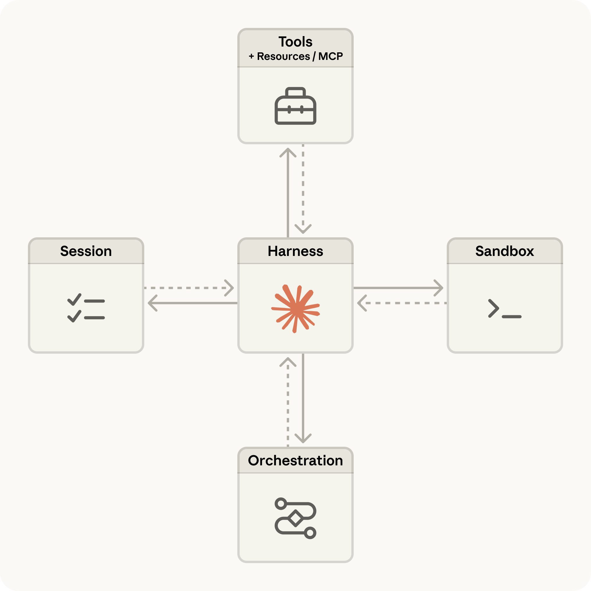

# Claude Managed Agents：10 倍速直达生产环境（中英对照）

> **原文标题：** Claude Managed Agents: get to production 10x faster
> **作者：** Anthropic（原文未署名）
> **原文链接：** https://claude.com/blog/claude-managed-agents
> **发布日期：** 2026-04-08
> **翻译模型：** GLM-5.3
> 排版：每段英文原文在前，中文翻译紧随其后。术语保留英文原文并附中文释义。

---

Claude Managed Agents is Anthropic's suite of composable APIs for building and deploying cloud-hosted agents at scale. See what's new and how to get started.

Claude Managed Agents 是 Anthropic 推出的一套可组合 API，用于大规模构建和部署云端托管的智能体（agent）。一起来看看它有哪些新特性，以及如何上手。

Announcing Claude Managed Agents, Anthropic's new suite of composable APIs for building and deploying cloud-hosted agents at scale.

我们正式发布 Claude Managed Agents--Anthropic 全新的一套可组合 API，用于大规模构建和部署云端托管的智能体。

# Claude Managed Agents 详解（Claude Managed Agents explained）

Claude Managed Agents is a suite of composable APIs for building and deploying cloud-hosted agents at scale. It pairs an Anthropic-managed harness with production infrastructure for state, memory, permissions, and scheduled execution.

Claude Managed Agents 是一套可组合 API，用于大规模构建和部署云端托管的智能体。它把由 Anthropic 托管的 harness（智能体运行框架）与涵盖状态（state）、记忆（memory）、权限（permissions）和定时执行（scheduled execution）的生产级基础设施结合在一起。

Prior to today's launch, building agents meant spending development cycles on secure infrastructure, state management, permissioning, and reworking your agent loops for every model upgrade. Managed Agents combines an agent harness tuned for performance with production infrastructure to go from prototype to launch in days rather than months.

在今天的发布之前，构建智能体意味着把开发周期耗在安全基础设施、状态管理、权限控制上，而且每次模型升级都要重写智能体循环（agent loop）。Managed Agents 将针对性能调优的智能体 harness 与生产级基础设施相结合，让你在数天而非数月内从原型走到上线。

Whether you're building single-task runners or complex multi-agent pipelines, you can focus on the user experience, not the operational overhead.

无论你构建的是单一任务的执行器，还是复杂的多智能体（multi-agent）流水线，你都可以专注于用户体验，而不是运维负担。

Managed Agents is available today in public beta on the Claude Platform.

Managed Agents 从今天起在 Claude 平台（Claude Platform）上开放公测（public beta）。

# 10 倍速构建与部署智能体（Build and deploy agents 10x faster）

Shipping a production agent requires sandboxed code execution, checkpointing, credential management, scoped permissions, and end-to-end tracing. That's months of infrastructure work before you ship anything users see.

发布一个生产级智能体，需要沙箱化的代码执行（sandboxed code execution）、检查点机制（checkpointing）、凭证管理（credential management）、范围化权限（scoped permissions）以及端到端追踪（end-to-end tracing）。在你交付任何用户可见的东西之前，这些都是长达数月的基础设施工作。

Managed Agents handles the complexity. You define your agent's tasks, tools, and guardrails and we run it on our infrastructure. A built-in orchestration harness decides when to call tools, how to manage context, and how to recover from errors.

Managed Agents 负责处理这些复杂性。你定义智能体的任务、工具和护栏（guardrails），我们则在自己的基础设施上运行它。内置的编排 harness 会决定何时调用工具、如何管理上下文，以及如何从错误中恢复。

Managed Agents includes:

Managed Agents 包括：

- Production-grade agents with secure sandboxing, authentication, and tool execution handled for you.
- Long-running sessions that operate autonomously for hours, with progress and outputs that persist even through disconnections.
- Multi-agent coordination so agents can spin up and direct other agents to parallelize complex work (available in research preview, request access here).‍
- Trusted governance, giving agents access to real systems with scoped permissions, identity management, and execution tracing built in.

- 生产级智能体，安全沙箱（sandboxing）、身份验证（authentication）和工具执行（tool execution）统统由我们代劳。
- 长时运行的会话（session）可自主工作数小时，即使连接中断，进度和产出也会持久保存。
- 多智能体协调（multi-agent coordination），让智能体能够启动并指挥其他智能体，并行处理复杂工作（现为研究预览版（research preview），可在此处申请访问）。‍
- 可信治理（governance），让智能体在范围化权限、身份管理和执行追踪等内置能力的保障下访问真实系统。

> Claude Managed Agents architecture
> Claude Managed Agents 架构

# 为充分发挥 Claude 的能力而设计（Designed to make the most of Claude）

Claude models are built for agentic work. Managed Agents is purpose-built for Claude, enabling you to get better agent outcomes with less effort.

Claude 模型为智能体式工作（agentic work）而生。Managed Agents 则是专为 Claude 打造的，让你以更少的投入获得更好的智能体成果（outcomes）。

With Managed Agents, you define outcomes and success criteria, and Claude self-evaluates and iterates until it gets there (available in research preview, request access here). It also supports traditional prompt-and-response workflows when you want tighter control.

使用 Managed Agents，你只需定义成果（outcomes）和成功标准，Claude 会自我评估并不断迭代，直到达成目标（现为研究预览版，可在此处申请访问）。当你想要更严格的控制时，它也支持传统的"提示-响应"（prompt-and-response）工作流。

In internal testing around structured file generation, Managed Agents improved outcome task success by up to 10 points over a standard prompting loop, with the largest gains on the hardest problems.

在围绕结构化文件生成的内部测试中，Managed Agents 相比标准提示循环（prompting loop）将任务成功率最高提升了 10 个百分点，且在最困难的问题上提升最大。

Session tracing, integration analytics, and troubleshooting guidance are built directly into the Claude Console, so you can inspect every tool call, decision, and failure mode.

会话追踪、集成分析和故障排查指引直接内置于 Claude Console（控制台），因此你可以审查每一次工具调用、每一个决策和每一种失败模式。

# 各团队正在构建什么（What teams are building）

Teams are already shipping 10x faster with Managed Agents across a range of production use cases. Coding agents that read a codebase, plan a fix, and open a PR. Productivity agents that join a project, pick up tasks, and deliver work alongside the rest of the team. Finance and legal agents that process documents and extract what matters. In each case, shipping in days meant providing value to users faster.

各团队已经在借助 Managed Agents，以 10 倍速度将一系列生产级用例推向市场：读取代码库、规划修复并提交 PR 的编程智能体；加入项目、认领任务并与团队其他成员并肩交付工作的生产力智能体；处理文档并提取关键信息的财务与法律智能体。在每一个案例中，数天内上线都意味着更快地为用户创造价值。

- Notion lets teams delegate work to Claude directly inside their workspace (available now in private alpha inside Notion Custom Agents). Engineers use it to ship code, while knowledge workers use it to produce websites and presentations. Dozens of tasks can run in parallel while the whole team collaborates on the output.
- Rakuten shipped enterprise agents across product, sales, marketing and finance that plug into Slack and Teams, letting employees assign tasks and get back deliverables like spreadsheets, slides, and apps. Each specialist agent was deployed within a week.
- Asana built AI Teammates, collaborative AI agents that work alongside humans inside Asana projects, taking on tasks and drafting deliverables. The team used Managed Agents to add advanced features dramatically faster than they would have been able to otherwise.
- Vibecode helps their customers go from prompt to deployed app using Managed Agents as the default integration, powering a new generation of AI-native apps. Users can now spin up that same infrastructure at least 10x quicker than before.‍
- Sentry paired Seer, their debugging agent, with a Claude-powered agent that writes the patch and opens the PR, so developers go from a flagged bug to a reviewable fix in one flow. The integration shipped in weeks instead of months on Managed Agents.

- Notion 让团队直接在工作区内把工作交给 Claude（现已在 Notion Custom Agents 内开启私测（private alpha））。工程师用它交付代码，知识工作者则用它制作网站和演示文稿。数十个任务可以并行运行，整个团队同时围绕产出协作。
- Rakuten 推出了覆盖产品、销售、市场和财务部门的企业智能体，接入 Slack 和 Teams，员工可以直接分派任务，并收到电子表格、幻灯片和应用等交付物。每个专用智能体都在一周内部署完成。
- Asana 构建了 AI Teammates（AI 队友）--在 Asana 项目中与人类并肩工作的协作式 AI 智能体，可认领任务并起草交付物。借助 Managed Agents，该团队添加高级功能的速度远超以往。
- Vibecode 以 Managed Agents 作为默认集成，帮助客户从一句提示词走到部署上线的应用，驱动新一代 AI 原生应用。用户现在搭建同样的基础设施至少比以前快 10 倍。‍
- Sentry 将其调试智能体 Seer 与一个由 Claude 驱动、负责编写补丁并提交 PR 的智能体配对，让开发者在一个流程中从被标记的缺陷直达可供评审的修复。这项集成基于 Managed Agents 在数周而非数月内上线。

"We want Notion to be the best place for teams to work with agents and get things done. We integrated Claude Managed Agents, which can handle long-running sessions, manage memory, and deliver high-quality outputs over time, to make that possible. Our users can now delegate open-ended, complex tasks, everything from coding to generating slides and spreadsheets, without ever leaving Notion."

"我们希望 Notion 成为团队与智能体协作、把事情做完的最佳场所。为此我们集成了 Claude Managed Agents--它能够处理长时运行的会话、管理记忆，并随着时间的推移持续交付高质量产出。我们的用户现在可以委派开放式的复杂任务，从编程到生成幻灯片和电子表格，一切都在 Notion 内完成，无需离开。"

"With Claude Managed Agents, our power users become like Galileo, contributing across domains far beyond a single specialty or discipline. We deploy each specialist agent within a week, managing long-running tasks across engineering, product, sales, marketing, and finance, generating apps, proposal decks, and spreadsheets in sandboxed environments. As agents become more capable, Managed Agents lets us scale safely without building agentic infrastructure ourselves, so we can focus entirely on democratizing innovation across the company."

"借助 Claude Managed Agents，我们的高级用户变得像伽利略一样，做出的贡献远远超出单一专业或学科的范畴。我们每周就能部署一个专用智能体，管理横跨工程、产品、销售、市场和财务的长时任务，在沙箱环境中生成应用、提案演示文稿和电子表格。随着智能体能力不断增强，Managed Agents 让我们无需自建智能体基础设施就能安全扩展，从而可以心无旁骛地专注于在全公司普及创新。"

"Claude Managed Agents dramatically accelerated our development of Asana AI Teammates — helping us ship advanced capabilities faster — and freeing us to focus on creating an enterprise-grade multiplayer user experience."

"Claude Managed Agents 大大加速了我们开发 Asana AI Teammates 的进程--帮助我们更快交付高级能力--让我们得以专注于打造企业级的多人协作用户体验。"

"Before Claude Managed Agents, users would have to manually run LLMs in sandboxes, manage their lifecycle, equip them with appropriate tools, and oversee their execution, a process that could take weeks or months to set up. Now, with a few lines of code, users can spin up that same infrastructure at least 10x quicker than before. This opens up what's possible to be built by developers and vibe coders alike. We're going to see a surge of AI-native applications on web and mobile."

"在 Claude Managed Agents 出现之前，用户必须在沙箱中手动运行 LLM、管理其生命周期、为其配备合适的工具并监督其执行，这一套流程搭建起来可能要数周甚至数月。现在，只需几行代码，用户搭建同样基础设施的速度就至少比以前快 10 倍。无论是开发者还是氛围编程者（vibe coder），可构建的东西都被打开了想象空间。我们将看到 AI 原生应用在网络和移动端迎来爆发式增长。"

"Turns out telling developers what's wrong with their code isn't enough: they want you to fix it too. Customers can now go from Seer's root cause analysis straight to a Claude-powered agent that writes the fix and opens a PR. We chose Claude Managed Agents because it gives us a secure, fully managed agent runtime, allowing us to focus our efforts on building a seamless developer experience around the handoff. Managed Agents not only allowed us to build the initial integration in weeks instead of months, but has also eliminated the ongoing operational overhead of maintaining bespoke agent infrastructure."

"事实证明，只告诉开发者代码哪里有问题是不够的：他们还希望你能把它修好。客户现在可以从 Seer 的根因分析直接进入一个由 Claude 驱动的智能体，由它编写修复代码并提交 PR。我们选择 Claude Managed Agents，是因为它提供了一个安全、完全托管的智能体运行时，让我们能把精力集中在围绕这个交接环节打造无缝的开发者体验上。Managed Agents 不仅让我们把初期集成的周期从数月缩短到数周，还消除了维护定制智能体基础设施的持续运维开销。"

"Atlassian helps enterprises orchestrate work across humans and agents. With Claude Managed Agents, we can build agents for developers directly into the workflows teams already rely on in weeks instead of months, so customers can assign tasks right from Jira. Managed Agents handles the hard parts like sandboxing, sessions, and scoped permissions, which means our engineers can spend less time on infrastructure and more time building great features for our end users."

"Atlassian 帮助企业在人类与智能体之间编排工作。借助 Claude Managed Agents，我们能够在数周而非数月内，把面向开发者的智能体直接构建进团队早已依赖的工作流中，客户可以直接从 Jira 分派任务。Managed Agents 负责沙箱、会话、范围化权限这些难啃的部分，这意味着我们的工程师可以把更少的时间花在基础设施上，把更多时间用来为终端用户打造出色的功能。"

"Using Claude Managed Agents, we've built a system that can pull information from our users' documents and correspondence to answer any query they ask, even when we haven't built a specific tool to retrieve the data. Before Managed Agents, we would've had to anticipate every question our users might want to ask and build tools or prompt workflows for each one. Now, with Managed Agents it can code up any tool it needs on the fly, allowing it to handle virtually any user query. This cut development time by 10x, letting us focus on UX and integrating more data sources instead."

"利用 Claude Managed Agents，我们构建了一个能从用户的文档和往来信件中提取信息的系统，可以回答用户提出的任何问题--即使我们没有专门构建检索这些数据的工具。在没有 Managed Agents 之前，我们必须预先想到用户可能问的每一个问题，并为每一个问题构建工具或提示词工作流。现在，借助 Managed Agents，智能体可以现场编写它需要的任何工具，从而处理几乎任何用户查询。这让开发时间缩短为原来的十分之一，让我们得以专注于用户体验和接入更多数据源。"

"Claude Managed Agents made it 3x faster to build a production-ready meeting prep agent. We went from idea to shipping in a matter of days. Our agent researches every participant ahead of a meeting to surface what matters for moving the conversation forward. Custom tools let us feed in our own calendar and contacts data, MCP made it simple to connect external systems like meeting notetakers, CRMs, etc., and the managed harness handled the heavy lifting, including sandboxed execution and built-in web search. Letting us focus on building the product, not the infrastructure."

"Claude Managed Agents 让我们构建一个生产可用的会议准备智能体的速度快了 3 倍。我们从想法到上线只用了几天。我们的智能体会在会议前研究每一位与会者，找出对推进对话最有价值的信息。自定义工具让我们能接入自己的日历和联系人数据，MCP 让连接会议记录工具、CRM 等外部系统变得简单，而托管 harness 则扛起了所有重活，包括沙箱执行和内置网络搜索。我们因此可以专注于打造产品，而不是基础设施。"

# Claude Managed Agents 的新特性（What's new in Claude Managed Agents）

New capabilities regularly. Agents can now learn across sessions with built-in memory and improve themselves through dreaming, outcomes, and multiagent orchestration. They can run unattended on scheduled deployments with credentials stored in vaults, and operate inside your own perimeter with self-hosted sandboxes and MCP tunnels.

新能力会持续推出。智能体现在可以借助内置记忆（memory）跨会话学习，并通过 dreaming（"做梦"）、outcomes（成果标准）和 multiagent orchestration（多智能体编排）自我改进。它们可以在定时部署中无人值守地运行，凭证保存在 Vaults（凭证保管库）中；还能通过 self-hosted sandboxes（自托管沙箱）和 MCP tunnels（MCP 隧道）在你自己的安全边界内运作。

# 开始使用（Getting started）

Managed Agents is priced on consumption. Standard Claude Platform token rates apply, plus $0.08 per session-hour for active runtime. See the docs for full pricing details.

Managed Agents 按用量计费。适用 Claude 平台的标准 token 费率，另加活跃运行时每会话小时 0.08 美元的费用。完整定价详情请参阅文档。

Managed Agents is available now on the Claude Platform. Read our docs to learn more, head to the Claude Console, or use our new CLI to deploy your first agent.

Managed Agents 现已在 Claude 平台上可用。阅读我们的文档了解更多，前往 Claude Console，或使用我们的新 CLI 部署你的第一个智能体。

Developers can also use the latest version of Claude Code and built-in claude-api Skill to build with Managed Agents. Just ask "start onboarding for managed agents in Claude API" to get started.

开发者也可以使用最新版 Claude Code 和内置的 claude-api Skill 来基于 Managed Agents 构建。只需对它说 "start onboarding for managed agents in Claude API" 即可开始。
