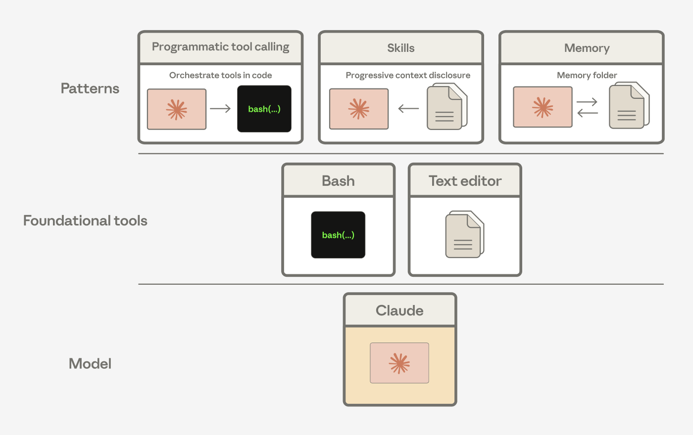
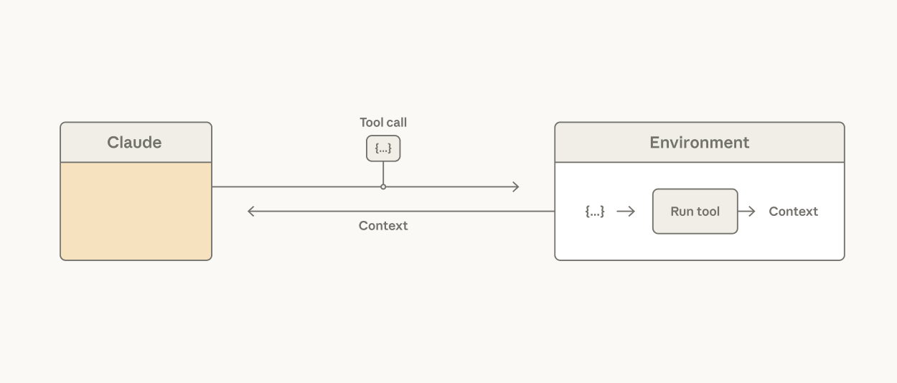
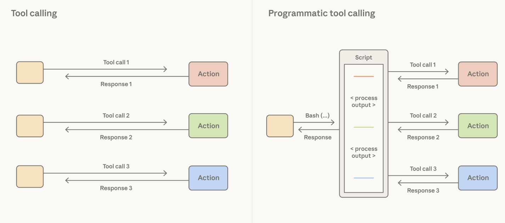
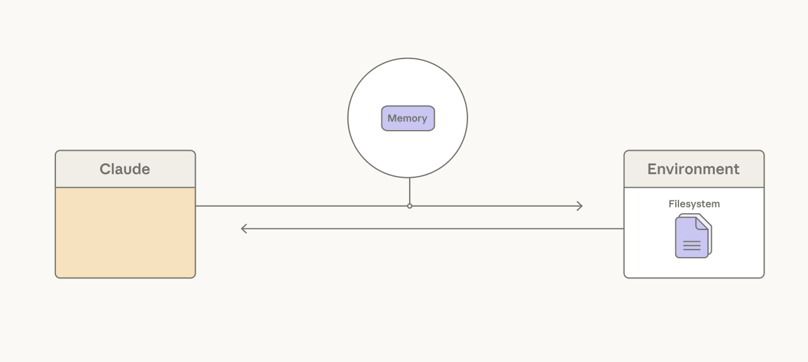

# Agent Harness 设计：驾驭 Claude 智能的三种模式（中英对照）

> **原文标题：** Agent Harness Design: 3 Patterns for Harnessing Claude's Intelligence
> **作者：** Lance Martin（Claude Platform 团队技术成员）
> **原文链接：** https://claude.com/blog/harnessing-claudes-intelligence
> **发布日期：** 2026-04-02
> **翻译模型：** GLM-5.3
> 排版：每段英文原文在前，中文翻译紧随其后。术语保留英文原文并附中文释义。

---

Agent harness design is deciding what scaffolding your agent needs-and what it doesn't. Three patterns from Anthropic for building harnesses that improve as Claude does.

Agent harness 设计，就是决定你的智能体需要哪些脚手架、又不需要哪些。来自 Anthropic 的三种模式，帮你构建随 Claude 一同进步的 harness。

One of Anthropic's co-founders, Chris Olah, says that generative AI systems like Claude are grown more than they are built. Researchers set the conditions to direct growth, but the exact structure or capabilities that emerge aren't always predictable.

Anthropic 联合创始人 Chris Olah 曾说，像 Claude 这样的生成式 AI 系统与其说是"建造"出来的，不如说是"培育"出来的。研究者设定引导生长的条件，但最终涌现出的具体结构或能力并不总是可以预测。

This creates a challenge for building with Claude: agent harnesses encode assumptions about what Claude can't do on its own, but those assumptions grow stale as Claude gets more capable.

这给基于 Claude 的构建带来了挑战：agent harness 编码了大量关于"Claude 自己做不到什么"的假设，而随着 Claude 越来越强，这些假设会逐渐过时。

An agent harness is the software scaffolding around a model: the loop, tools, context management, and guardrails that turn raw intelligence into a working agent. Agent harness design is the practice of deciding what belongs in that scaffolding and, as models improve, what you can take out.

Agent harness（智能体脚手架/运行框架）是包裹模型的软件脚手架：循环（loop）、工具、上下文管理，以及把原始智能转化为可用智能体的护栏（guardrail）。Agent harness 设计，就是决定什么应该放进这层脚手架；而随着模型进步，又要决定什么可以拿掉。

In this article, we share three patterns that teams should use when building applications that keep pace with Claude's evolving intelligence while balancing latency and cost: use what it already knows, ask what you can stop doing, and carefully set boundaries with the agent harness.

本文分享三种模式，帮助团队在平衡延迟与成本的同时，构建能跟上 Claude 不断演进的智能的应用：利用它已知的知识，追问哪些事可以不再做，以及用 agent harness 谨慎设定边界。

## 1. 依靠模型而非 harness：使用 Claude 已知的知识（1. Lean on the model, not the harness: use what Claude knows）

We suggest building applications using tools that Claude understands well.

我们建议使用 Claude 非常熟悉的工具来构建应用。

In late 2024, Claude 3.5 Sonnet reached 49% on SWE-bench Verified-then state of the art-with only a bash tool and a text editor tool for viewing, creating, and editing files. Claude Code is grounded in these same tools. Bash wasn't designed for building agents, but it's a tool that Claude knows how to use and gets better at using over time.

2024 年末，Claude 3.5 Sonnet 仅凭一个 bash 工具和一个用于查看、创建、编辑文件的文本编辑器工具，就在 SWE-bench Verified 上拿到 49% 的成绩--彼时的业界最佳。Claude Code 正扎根于这同一组工具。Bash 并不是为构建智能体而设计的，但它是 Claude 会用、而且越用越顺手的工具。


> Scores on the SWE-bench Verified benchmark across Claude model versions highlight its evolution.

> 各代 Claude 模型在 SWE-bench Verified 基准上的得分，凸显了它的演进。

We've seen Claude compose these general tools into patterns that solve different problems. For instance, Agent Skills, programmatic tool calling, and the memory tool are all built from the bash and text editor tools.

我们看到 Claude 把这些通用工具组合成解决不同问题的模式。例如，Agent Skills、程序化工具调用（programmatic tool calling）和记忆工具（memory tool）都构建于 bash 和文本编辑器工具之上。



> Programmatic tool calling, skills, and memory are compositions of our bash and text editor tools.

> 程序化工具调用、skills 和记忆都是 bash 与文本编辑器工具的组合产物。

## 2. 精简你的 agent harness：追问哪些事可以不做了（2. Strip your agent harness down: ask what you can stop doing）

Agent harnesses encode assumptions about what Claude can't do on its own. As Claude gets more capable, those assumptions should be tested.

Agent harness 编码了关于"Claude 自己做不到什么"的假设。随着 Claude 能力增强，这些假设应当被重新检验。

Let Claude orchestrate its own actions

让 Claude 编排自己的行动

A common assumption is that every tool result should flow back through Claude's context window to inform the next action. Processing tool results in tokens can be slow, costly, and unnecessary if it only needs to be passed to the next tool or if Claude only cares about a small slice of the output.

一个常见的假设是：每个工具结果都应流回 Claude 的上下文窗口，用以指导下一步行动。把工具结果当作 token 处理，可能既缓慢又昂贵，而且没有必要--如果结果只需传给下一个工具，或者 Claude 只关心输出中的一小部分。



> Claude calls tools, which are executed in an environment.

> Claude 调用工具，工具在某个环境中执行。

Consider reading a large table to reason about a single column: the whole table lands in context and Claude pays the token cost for every row it doesn't need. It's possible to tackle this in tool design, using hard-coded filters. But this does not address the fact that the agent harness is making an orchestration decision that Claude is better positioned to make.

设想读取一张大表却只为推理其中一列：整张表落入上下文，Claude 要为每一行它并不需要的数据支付 token 成本。在工具设计层面用硬编码过滤器可以缓解这个问题，但这并没有触及要害：agent harness 正在替 Claude 做一个本该由 Claude 来做更合适的编排决策。

Giving Claude a code execution tool (e.g., bash tool or language-specific REPL) addresses this: it allows Claude to write code to express tool calls and the logic between them. Rather than the harness deciding that every tool call result is processed as tokens, Claude decides what results to pass through, filter, or pipe into the next call without touching the context window. Only the output of code execution reaches Claude's context window.

给 Claude 一个代码执行工具（例如 bash 工具或特定语言的 REPL）可以解决这个问题：它允许 Claude 编写代码来表达工具调用及调用之间的逻辑。不再由 harness 决定"每个工具调用的结果都按 token 处理"，而是由 Claude 决定哪些结果直接透传、过滤、或管道输送给下一次调用，全程不触碰上下文窗口。只有代码执行的最终输出才会进入 Claude 的上下文窗口。



> Claude can write code that expresses tool calls and the logic between them.

> Claude 可以编写代码来表达工具调用及调用之间的逻辑。

The orchestration decision moves from the harness to the model. Since code is a general way for Claude to orchestrate actions, a strong coding model is also a strong general agent. Claude shows strong performance on non-coding evals using this pattern: on BrowseComp, a benchmark that tests the ability of agents to browse the web, giving Opus 4.6 the ability to filter its own tool outputs brought accuracy from 45.3% to 61.6%.

编排决策从 harness 移交给了模型。既然代码是 Claude 编排行动的通用方式，那么一个强大的编码模型同时也是一个强大的通用智能体。Claude 借助这一模式在非编码评测上同样表现出色：在考查智能体网页浏览能力的基准 BrowseComp 上，让 Opus 4.6 能够过滤自己的工具输出，把准确率从 45.3% 提升到了 61.6%。

Let Claude manage its own context

让 Claude 管理自己的上下文

Task-specific context steers Claude's use of general tools like bash and the text editor tool. A common assumption is that system prompts should be hand-crafted with task-specific instructions. The problem is that pre-loading prompts with instructions does not scale across many tasks: every token added depletes Claude's attention budget and it is wasteful to pre-load context with rarely used instructions.

任务特定的上下文为 Claude 如何使用 bash、文本编辑器工具等通用工具掌舵。一个常见的假设是：系统提示词应当手工填满任务特定的指令。问题在于，向提示词预载指令无法随任务数量扩展：每增加一个 token 都在消耗 Claude 的注意力预算，而用很少用到的指令预载上下文纯属浪费。

Giving Claude the ability to access skills addresses this: the YAML frontmatter of each skill is a short description pre-loaded into the context window, providing an overview of the skill contents. The full skill can be progressively disclosed by Claude calling a read file tool if a task calls for it.

让 Claude 能够访问 skills 可以解决这一问题：每个 skill 的 YAML frontmatter 是一段预载入上下文窗口的简短描述，概括了 skill 的内容。如果任务需要，Claude 可以调用读文件工具，渐进式披露（progressive disclosure）完整的 skill 内容。


> Claude can use skills to progressively disclose task-relevant context.

> Claude 可以利用 skills 渐进式披露与任务相关的上下文。

While skills give Claude the freedom to assemble its own context window, context editing is the inverse, providing a way to selectively remove context that's become stale or irrelevant, such as old tool results or thinking blocks.

skills 给了 Claude 自主拼装上下文窗口的自由；上下文编辑（context editing）则是反向操作，提供了一种选择性移除陈旧或无关上下文的方式，比如旧的工具结果或思考块（thinking block）。

With subagents, Claude is getting better at knowing when to fork into a fresh context window to isolate work on a specific task. With Opus 4.6, the ability to spawn subagents improved results on BrowseComp by 2.8% over the best single-agent runs.

借助 subagent，Claude 越来越善于判断何时分叉（fork）到一个全新的上下文窗口，以隔离特定任务的工作。在 Opus 4.6 上，孵化 subagent 的能力让 BrowseComp 成绩比最好的单智能体运行提升了 2.8%。

Let Claude persist its own context

让 Claude 持久化自己的上下文

Long-running agents can exceed the limit of a single context window. A common assumption is that memory systems should rely on retrieval infrastructure around the model. Much of our work has focused on giving Claude simple ways to choose for itself what content to persist.

长时间运行的智能体可能超出单个上下文窗口的极限。一个常见的假设是：记忆系统应当依赖模型外围的检索基础设施。而我们的工作重心，很大一部分放在给 Claude 简单的方式，让它自己选择持久化哪些内容。

For example, compaction lets Claude summarize its past context in order to maintain continuity on long-horizon tasks. Over several releases, Claude has gotten better at choosing what to remember. On BrowseComp, for example, an agentic search task, Sonnet 4.5 stayed flat at 43% regardless of the compaction budget we gave it. Yet Opus 4.5 scaled to 68% and Opus 4.6 reached 84% with the same setup.

例如，压缩（compaction）让 Claude 总结过去的上下文，以在长时程任务中保持连贯。经过数次版本迭代，Claude 在"记住什么"上做得越来越好。以智能体搜索任务 BrowseComp 为例，无论我们给多大的压缩预算，Sonnet 4.5 都稳定停留在 43%；而 Opus 4.5 在相同配置下提升到 68%，Opus 4.6 更达到 84%。

A memory folder is another approach, allowing Claude to write context to files and later read them as needed. We've seen Claude use this for agentic search. On BrowseComp-Plus, giving Sonnet 4.5 a memory folder lifted accuracy from 60.4% to 67.2%.

记忆文件夹（memory folder）是另一种做法：Claude 可以把上下文写入文件，之后按需读取。我们看到 Claude 在智能体搜索中使用它。在 BrowseComp-Plus 上，给 Sonnet 4.5 一个记忆文件夹，把准确率从 60.4% 提升到 67.2%。



> Claude can persist context to a memory folder.

> Claude 可以把上下文持久化到记忆文件夹。

Long-horizon games, such as Pokémon, are an example of Claude's improved ability to use a memory folder. Sonnet 3.5 treated memory as a transcript, writing down what non-player characters (NPCs) said rather than what mattered. After 14,000 steps it had 31 files-including two near-duplicates about caterpillar Pokémon-and was still in the second town:

宝可梦（Pokémon）这类长时程游戏，展示了 Claude 使用记忆文件夹能力的进步。Sonnet 3.5 把记忆当成对话记录，记下的是非玩家角色（NPC）说过的话，而不是真正要紧的内容。跑了 14,000 步之后，它留下 31 个文件--包括两个内容几乎重复、关于毛毛虫宝可梦的文件--人还停在第二个城镇：

```
caterpie_weedle_info:
- Caterpie and Weedle are both caterpillar Pokémon.
- Caterpie is a caterpillar Pokémon that does not have poison.
- Weedle is a caterpillar Pokémon that does have poison.
- This information is crucial for future encounters and battles.
- If our Pokémon get poisoned, we should seek healing at a Pokémon Center as soon as possible.
```

Later models wrote tactical notes. Opus 4.6, at the same step count, had 10 files organized into directories, three gym badges, and a learnings file distilled from its own failures:

后来的模型写下的是战术笔记。同样步数下，Opus 4.6 拥有 10 个按目录组织的文件、三枚道馆徽章，以及一份从自身失败中提炼出的"经验教训"文件：

```
/gameplay/learnings.md:
- Bellsprout Sleep+Wrap combo: KO FAST with BITE before Sleep Powder lands. Don't let it set up!
- Gen 1 Bag Limit: 20 items max. Toss unneeded TMs before dungeons.
- Spin tile mazes: Different entry y-positions lead to DIFFERENT destinations. Try ALL entries and chain through multiple pockets.
- B1F y=16 wall CONFIRMED SOLID at ALL x=9-28 (step 14557)
```

## 3. 在 harness 设计中谨慎设定边界（3. Set boundaries carefully in your harness design）

Agent harnesses provide structure around Claude to enforce UX, cost, or security.

Agent harness 为 Claude 提供结构性约束，以强制落实 UX、成本或安全方面的要求。

Design context to maximize cache hits

设计上下文以最大化缓存命中

The Messages API is stateless. Claude cannot see the conversation history of prior turns. This means that the agent harness needs to package new context alongside all past actions, tool descriptions, and instructions for Claude at each turn.

Messages API 是无状态的。Claude 看不到之前轮次的对话历史。这意味着 agent harness 需要在每一轮把新上下文连同过去所有动作、工具描述和指令一起打包发给 Claude。

Prompts can be cached based on set breakpoints. In other words, the Claude API writes context up until a breakpoint to the cache and checks whether the context matches any prior cache entries.

提示词可以按设定的断点（breakpoint）缓存。换言之，Claude API 会把直到某个断点为止的上下文写入缓存，并检查该上下文是否与既有缓存条目匹配。

Since cached tokens are 10% the cost of base input tokens, here are a few principles in the agent harness help maximize cache hits:

由于缓存 token 的价格只有基础输入 token 的 10%，以下是 agent harness 中有助于最大化缓存命中（cache hit）的几条原则：

| Principle | Description |
| --- | --- |
| Static first, dynamic last | Order requests so that stable content (system prompt, tools) come first. |
| Messages for updates | Append a `<system-reminder>` in messages instead of editing the prompt. |
| Don't change models | Avoid switching models during a session. Caches are model-specific; switching breaks them. If you need a cheaper model, use a subagent. |
| Carefully manage tools | Tools sit in the cached prefix. Adding or removing one invalidates it. For dynamic discovery, use tool search, which appends without breaking cache. |
| Update breakpoints | For multi-turn applications (e.g., agents), move the breakpoint to the latest message in order to keep the cache up-to-date. Use auto-caching for this. |

| 原则 | 说明 |
| --- | --- |
| 静态内容在前，动态内容在后 | 调整请求顺序，让稳定内容（系统提示词、工具）排在前面。 |
| 用消息承载更新 | 在 messages 中追加 `<system-reminder>`，而不是修改提示词。 |
| 不要中途换模型 | 避免在会话中切换模型。缓存与模型绑定，切换即失效。如果需要更便宜的模型，使用 subagent。 |
| 谨慎管理工具 | 工具位于缓存前缀中。增删任何一个都会使缓存失效。若需动态发现，使用工具搜索（tool search），它只追加而不破坏缓存。 |
| 更新断点 | 对多轮应用（如智能体），把断点移到最新一条消息，让缓存保持最新。可使用自动缓存（auto-caching）实现。 |

Use declarative tools for UX, observability, or security boundaries

用声明式工具筑牢 UX、可观测性或安全边界

Claude doesn't necessarily know an application's security boundary or UX surface. Claude emits tool calls, which are handled by the harness. A bash tool gives Claude broad programmatic leverage to perform actions, but it gives the harness only a command string-the same shape for every action. Promoting actions to dedicated tools gives the harness an action-specific hook with typed arguments it can intercept, gate, render, or audit.

Claude 未必了解一个应用的安全边界或 UX 表面。Claude 发出工具调用，由 harness 负责处理。bash 工具给了 Claude 广泛的程序化行动能力，但留给 harness 的只有一个命令字符串--每个动作的形状都一模一样。把动作提升（promote）为专门的工具，harness 就得到一个针对具体动作的钩子（hook），带有类型化参数，可以拦截、门控、渲染或审计。

Actions that require a security boundary are natural candidates for dedicated tools. Reversibility is often a good criterion, and hard-to-reverse actions such as external API calls can be gated by user confirmation. Write tools like edit can include a staleness check so Claude doesn't overwrite a file that changed since it was last read.

需要安全边界的动作天然适合做成专门工具。可逆性往往是不错的判据，像外部 API 调用这类难以撤销的动作，可以设置用户确认门控（gate）。edit 这类写入工具可以加入过期检查（staleness check），避免 Claude 覆盖一个自上次读取后已被修改的文件。


> Dedicated tools can be used for actions based upon security, UX, or observability considerations.

> 基于安全、UX 或可观测性考量，可以为相应动作设置专门工具。

Tools are also useful when an action needs to be presented to a user. For example, they can be rendered as a modal to display a question clearly to the user, give the user multiple options, or block the agent loop until a user provides feedback.

当某个动作需要呈现给用户时，工具同样有用。例如，可以把它们渲染成模态框，向用户清晰展示一个问题、给出多个选项，或阻塞智能体循环直到用户给出反馈。

Finally, tools are useful for observability. When the action is a typed tool, the harness gets structured arguments it can log, trace, and replay.

最后，工具对可观测性（observability）也很有用。当动作是一个带类型定义的工具时，harness 就获得了结构化的参数，可以记录日志、追踪和重放。

The decision to promote actions to tools should be continually re-evaluated. For example, Claude Code's auto-mode (in research mode at the time of publication) provides a security boundary around the bash tool: it has a second Claude read the command string and judge whether it's safe. This pattern can limit the need for dedicated tools, and should only be used for tasks where users trust the general direction. Dedicated tools can still earn their place for certain high-stakes actions.

"是否把动作提升为工具"这个决定应当持续重新评估。例如，Claude Code 的 auto-mode（发布时处于研究模式）为 bash 工具提供了一层安全边界：让另一个 Claude 阅读命令字符串并判断其是否安全。这种模式可以减少对专门工具的需求，但只应用于用户信任其大方向的任务。对于某些高风险动作，专门工具依然有它的一席之地。

## Agent harness 设计的未来（The future of agent harness design）

The frontier of Claude's intelligence is always changing. Assumptions about what Claude can't do need to be re-tested with each step change in its capability.

Claude 智能的前沿总在变化。关于"Claude 做不到什么"的假设，需要随其能力的每一次阶跃式变化重新检验。

We see this pattern repeat itself. In an agent we built for long-horizon tasks, Sonnet 4.5 would wrap up prematurely as it sensed the context limit approaching. We added resets to clear the context window in order to address this "context anxiety." With Opus 4.5, the behavior was gone. The context resets we built to compensate had become dead weight in the agent harness.

我们看到这一模式反复上演。在我们为长时程任务构建的一个智能体中，Sonnet 4.5 一旦察觉上下文极限临近就会草草收尾。为应对这种"上下文焦虑"（context anxiety），我们加入了重置机制来清空上下文窗口。到了 Opus 4.5，这个行为消失了，而我们为补偿它而构建的上下文重置，反倒成了 agent harness 里的死重。

Removing this dead weight is important because it can bottleneck Claude's performance. Over time, the structure or boundaries in our applications should be pruned based the question: what can I stop doing?

清掉这些死重很重要，因为它可能成为 Claude 性能的瓶颈。随着时间推移，我们应用中的结构或边界应当依据一个问题来修剪：哪些事我可以不做了？

To use all tools and patterns discussed here, check out our claude-api skill.

要使用本文讨论的所有工具与模式，请查看我们的 claude-api skill。

## 致谢（Acknowledgements）

Written by Lance Martin, member of technical staff on the Claude Platform team. Special thanks to Thariq Shihipar, Barry Zhang, Mike Lambert, David Hershey, and Daliang Li for helpful discussion on the topics covered. Thanks to Lydia Hallie, Lexi Ross, Katelyn Lesse, Andy Schumeister, Rebecca Hiscott, Jake Eaton, Pedram Navid, and Molly Vorwerck for their editorial review and feedback.

本文由 Claude Platform 团队技术成员 Lance Martin 撰写。特别感谢 Thariq Shihipar、Barry Zhang、Mike Lambert、David Hershey 和 Daliang Li 就文中主题进行的有益讨论。感谢 Lydia Hallie、Lexi Ross、Katelyn Lesse、Andy Schumeister、Rebecca Hiscott、Jake Eaton、Pedram Navid 和 Molly Vorwerck 的编辑审阅与反馈。
