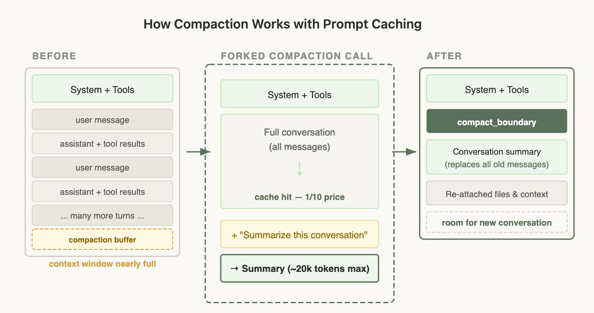

# 构建 Claude Code 的经验：提示缓存就是一切（中英对照）

> **原文标题：** Lessons from building Claude Code: Prompt caching is everything
> **作者：** Thariq Shihipar（Claude Code 团队技术成员）
> **原文链接：** https://claude.com/blog/lessons-from-building-claude-code-prompt-caching-is-everything
> **发布日期：** 2026-04-30
> **翻译模型：** GLM-5.3
> 排版：每段英文原文在前，中文翻译紧随其后。术语保留英文原文并附中文释义。

---

Best practices for optimizing prompt caching in Claude Code, including how to most effectively structure your prompt, use tools, and layer on compaction.

在 Claude Code 中优化提示缓存（prompt caching）的最佳实践，包括如何最有效地组织提示词、使用工具，以及分层运用压缩（compaction）。

We share best practices for optimizing prompt caching in Claude Code, including how to most effectively structure your prompt, use tools, and layer on compaction.

我们分享在 Claude Code 中优化提示缓存的最佳实践，包括如何最有效地组织提示词、使用工具，以及分层运用压缩。

It is often said in engineering that "cache rules everything around me", and the same rule holds for agents.

工程圈常有人说 "cache rules everything around me"（缓存主宰我身边的一切），这条法则同样适用于 agent。

Long running agentic products like Claude Code are made feasible by prompt caching which allows us to reuse computation from previous roundtrips and significantly decrease latency and cost.

Claude Code 这类长时间运行的 agent 产品之所以可行，靠的是提示缓存--它让我们能够复用此前往返（roundtrip）中已完成的计算，从而显著降低延迟与成本。

At Claude Code, we build our entire harness around prompt caching. A high prompt cache hit rate decreases costs and helps us create more generous rate limits for our subscription plans, so we run alerts on our prompt cache hit rate and declare SEVs if they're too low.

在 Claude Code，我们的整个 harness 都围绕提示缓存构建。较高的提示缓存命中率可以降低成本，帮助我们为订阅计划提供更宽松的速率限制（rate limit），因此我们对提示缓存命中率设置了告警，一旦过低就会宣告 SEV（严重事故）。

These are the (often unintuitive) lessons we've learned from optimizing prompt caching at scale.

以下是我们在大规模优化提示缓存的过程中学到的（常常反直觉的）经验。

# 为缓存而组织提示词（Lay out your prompt for caching）

> Claude Code's system prompt is organized so the stable pieces stay cached and only the conversation itself grows turn by turn.
> Claude Code 的系统提示词（system prompt）经过精心组织，使稳定部分持续保持缓存命中，只有对话本身逐轮增长。

Prompt caching works by prefix matching-the API caches everything from the start of the request up to each cache_control breakpoint. This means the order you put things in matters enormously, you want as many of your requests to share a prefix as possible.

提示缓存的工作原理是前缀匹配（prefix matching）--API 会缓存从请求开头到每个 cache_control 断点之间的全部内容。这意味着内容的排列顺序至关重要：你要让尽可能多的请求共享同一个前缀。

How you structure a prompt matters for output quality too, not just cache hits - the prompt engineering fundamentals are the other half of the discipline.

提示词的组织方式不仅影响缓存命中，也影响输出质量--提示词工程的基本功是这门学科的另一半。

The best way to do this is static content first, dynamic content last. For Claude Code this looks like:

最佳做法是：静态内容在前，动态内容在后。在 Claude Code 中，结构如下：

- Static system prompt & Tools (globally cached)
- CLAUDE.md (cached within a project)
- Session context (cached within a session)
- Conversation messages

- 静态 system prompt 与工具（全局缓存）
- CLAUDE.md（项目内缓存）
- 会话上下文（会话内缓存）
- 对话消息

This way we maximize how many sessions share cache hits.

这样我们就能最大化共享缓存命中的会话数量。

But this approach can be surprisingly fragile. We've broken this ordering before for a variety of reasons, including: putting an in-depth timestamp in the static system prompt, shuffling tool order definitions non-deterministically, and updating parameters of tools (e.g., what agents the Agent tool can call).

但这种方式出奇地脆弱。我们曾因各种原因破坏过这个顺序，包括：在静态 system prompt 中放入精确到细节的时间戳、以非确定性方式打乱工具定义顺序，以及更新工具的参数（例如 Agent 工具可以调用哪些 agent）。

# 用 messages 传递更新（Use messages for updates）

There may be times when the information you put in your prompt becomes out of date, for example if you have the time or if the user changes a file. It may be tempting to update the prompt, but that would result in a cache miss and could end up being quite expensive for the user.

有时你放进提示词里的信息会过期，例如其中包含的时间，或者用户更改了某个文件。直接更新提示词看似顺理成章，但这会导致缓存未命中（cache miss），最终可能让用户付出高昂代价。

Consider if you can pass in this information via messages in the agent's next turn instead. In Claude Code, we add a <system-reminder> tag in the next user message or tool result with the updated information for the model, which helps preserve the cache.

不妨考虑改在 agent 的下一轮中通过 messages 传入这些信息。在 Claude Code 中，我们会在下一条用户消息或工具结果中加入一个 <system-reminder> 标签，把更新后的信息带给模型，这有助于保住缓存。

# 不要在会话中途更换模型（Don't change models mid-session）

Prompt caches are unique to models and this can make the math of prompt caching quite unintuitive.

提示缓存是按模型隔离的，这使得提示缓存的成本账算起来相当反直觉。

For example, if you're 100k tokens into a conversation with Opus and want to ask a question that is fairly easy to answer, it would actually be more expensive to switch to Haiku than to have Opus answer, because we would need to rebuild the prompt cache for Haiku.

举例来说，如果你已经和 Opus 进行了 100k token 的对话，想问一个相当容易回答的问题，此时切换到 Haiku 反而比让 Opus 直接回答更贵，因为我们需要为 Haiku 重建整个提示缓存。

If you need to switch models, the best way to do it is with subagents; extending the above example, you could deploy a subagent that prompts Opus to prepare a "hand-off" message to another model on the task that it needs to get done. We do this often with the Claude Code's Explore agents, which use Haiku.

如果确实需要切换模型，最佳方式是使用 subagent；延续上面的例子，你可以部署一个 subagent，让 Opus 为另一个模型准备一条关于待办任务的“交接（hand-off）”消息。我们在 Claude Code 的 Explore agent（使用 Haiku）中经常这样做。

# 绝不要在会话中途增删工具（Never add or remove tools mid-session）

Changing the tool set in the middle of a conversation is one of the most common ways people break prompt caching. It seems intuitive-you should only give the model tools you think it needs right now. But because tools are part of the cached prefix, adding or removing a tool invalidates the cache for the entire conversation.

在对话中途更改工具集是人们破坏提示缓存最常见的方式之一。这看起来很符合直觉--只给模型当下需要的工具就好。但由于工具是缓存前缀的一部分，增加或删除一个工具都会使整个对话的缓存失效。

Using Plan Mode to design around the cache

利用 Plan Mode 围绕缓存进行设计

Plan Mode is a great example of designing features around caching constraints. The intuitive approach would be: when the user enters plan mode, swap out the tool set to only include read-only tools, but that would break the cache.

Plan Mode 是围绕缓存约束来设计功能的一个绝佳例子。直觉上的做法是：当用户进入 plan mode 时，把工具集换成仅包含只读工具，但这会破坏缓存。

Instead, we keep all tools in the request at all times and use EnterPlanMode and ExitPlanMode as tools themselves. When the user toggles Plan Mode on, the agent gets a system message explaining that it's in Plan Mode and what the instructions are: explore the codebase, don't edit files, and call ExitPlanMode when the plan is complete. The tool definitions never change.

我们的做法是：请求中始终保留全部工具，并把 EnterPlanMode 和 ExitPlanMode 本身做成工具。当用户开启 Plan Mode 时，agent 会收到一条系统消息，说明它正处于 Plan Mode 以及相关指令：探索代码库、不要编辑文件、计划完成后调用 ExitPlanMode。工具定义从不改变。

This has a bonus benefit: because EnterPlanMode is a tool the model can call itself, it can autonomously enter plan mode when it detects a hard problem, without any cache break.

这还带来一个额外好处：由于 EnterPlanMode 是模型可以自己调用的工具，它可以在检测到难题时自主进入 plan mode，而不产生任何缓存断裂。

Use tool search to defer instead of remove

用工具搜索来延迟加载而非移除

The same principle applies to our tool search tool. Claude Code can have dozens of MCP tools loaded, and including all of them in every request would be expensive, but removing them mid-conversation would break the cache.

同样的原则也适用于我们的工具搜索（tool search）工具。Claude Code 可能加载了几十个 MCP 工具，把它们全部放进每个请求代价高昂，但在对话中途移除它们又会破坏缓存。

Our solution: defer_loading. Instead of removing tools, we send lightweight stubs ( just the tool name, with defer_loading: true) that the model can "discover" via tool search when needed. The full tool schemas are only loaded when the model selects them. This keeps the cached prefix stable because the same stubs are always present in the same order.

我们的解决方案是 defer_loading。我们不移除工具，而是发送轻量级的桩（stub，只含工具名，并带 defer_loading: true），模型在需要时可通过工具搜索“发现”它们。完整的工具 schema 只在模型选中时才加载。由于这些桩始终以相同的顺序存在，缓存前缀得以保持稳定。

You can also use the tool search tool through our API to simplify this.

你也可以通过我们的 API 使用工具搜索工具来简化这一操作。

# 在不破坏缓存的前提下压缩（Compacting without breaking the cache）

> When the context window fills up, Claude Code forks a cached call to summarize the conversation, then resumes with the summary in place of the original messages.
> 当上下文窗口填满时，Claude Code 会分叉（fork）出一个命中缓存的调用来总结对话，然后以摘要替代原始消息继续。

Compaction is what happens when you run out of the context window. We summarize the conversation so far and continue a new session with that summary.

压缩（compaction）就是上下文窗口耗尽时的处理方式：我们把迄今为止的对话总结成摘要，再带着这份摘要继续一个新会话。

Compaction interacts with prompt caching in ways that are easy to get wrong. To compact a conversation, you have to send the full conversation to the model so it can write a summary. The simplest way to do that is a separate API call with its own system prompt (something like "summarize this") and no tools attached, but that's exactly where the cost trap is. Prompt caching only applies when a request's prefix matches what's already cached, byte for byte, from the start. Your main conversation is cached under one system prompt and tool set; the summarization call uses a different system prompt and no tools, so the prefixes diverge at the very first token and none of the cache applies. You end up paying the full, uncached input rate for the entire conversation you're sending in - and the longer the conversation (i.e., the more you need compaction in the first place), the more expensive that one call becomes.

压缩与提示缓存的交互方式很容易踩坑。要压缩一段对话，你必须把完整对话发给模型，它才能写出摘要。最简单的做法是发起一个单独的 API 调用，配上自己的 system prompt（类似 "summarize this"）且不挂任何工具，但这恰恰是成本陷阱所在。提示缓存只有在请求前缀与已缓存内容从第一个字节起逐字节（byte for byte）匹配时才生效。你的主对话是在一套 system prompt 和工具集下缓存的；而摘要调用使用不同的 system prompt 且不带工具，前缀在第一个 token 处就分道扬镳，缓存完全派不上用场。你最终要为发送进来的整段对话支付全额的非缓存输入价格--而且对话越长（也就是说越需要压缩），这一次调用就越贵。

The solution: cache-safe forking

解决方案：缓存安全的分叉（cache-safe forking）

When we run compaction, we use the exact same system prompt, user context, system context, and tool definitions as the parent conversation. We prepend the parent's conversation messages, then append the compaction prompt as a new user message at the end.

运行压缩时，我们使用与父对话完全相同的 system prompt、用户上下文、系统上下文和工具定义。我们先原样前置父对话的消息，再把压缩提示词作为一条新的用户消息追加到末尾。

From the API's perspective, this request looks nearly identical to the parent's last request-same prefix, same tools, same history-so the cached prefix is reused. The only new tokens are the compaction prompt itself.

在 API 看来，这个请求与父对话的最后一次请求几乎一模一样--相同的前缀、相同的工具、相同的历史--因此缓存的前缀得以复用。唯一新增的 token 只有压缩提示词本身。

This does mean however that we need to save a "compaction buffer" so that we have enough room in the context window to include the compact message and the summary output tokens.

不过，这也意味着我们需要预留一块“压缩缓冲（compaction buffer）”，确保上下文窗口中有足够的空间容纳压缩消息和摘要输出的 token。

Compaction is tricky but luckily, you don't need to learn these lessons yourself-based on our learnings from Claude Code we built compaction directly into the API, so you can apply these patterns in your own applications.

压缩并不简单，但幸运的是，你不必亲自踩这些坑--基于我们从 Claude Code 中获得的经验，我们把压缩能力直接内置到了 API 中，你可以在自己的应用中运用这些模式。

# 经验总结（Lessons learned）

Here are a few patterns we've found useful for optimizing prompt caching when building an agent:

以下是我们在构建 agent 时发现的、对优化提示缓存很有用的几个模式：

- Prompt caching is a prefix match. Any change anywhere in the prefix invalidates everything after it. Design your entire system around this constraint. Get the ordering right and most of the caching works for free.
- Use messages instead of system prompt changes. You may be tempted to edit the system prompt to do things like entering plan mode, changing the date, etc. but it would actually be better to insert these into messages during the conversation.
- Don't change tools or models mid-conversation. Use tools to model state transitions (like plan mode) rather than changing the tool set. Defer tool loading instead of removing tools.
- Monitor your cache hit rate like you monitor uptime. We alert on cache breaks and treat them as incidents. A few percentage points of cache miss rate can dramatically affect cost and latency.
- Fork operations need to share the parent's prefix. If you need to run a side computation (compaction, summarization, skill execution), use identical cache-safe parameters so you get cache hits on the parent's prefix.

- 提示缓存是前缀匹配。前缀中任何位置的任何更改，都会使其后的全部内容失效。围绕这一约束设计你的整个系统。顺序排对了，大部分缓存就会免费自动生效。
- 用 messages 代替对 system prompt 的修改。你可能忍不住想通过编辑 system prompt 来实现诸如进入 plan mode、更改日期等操作，但更好的做法是在对话过程中把这些信息插入到 messages 里。
- 不要在对话中途更换工具或模型。用工具来建模状态转换（比如 plan mode），而不是更改工具集。延迟加载工具，而不是移除工具。
- 像监控可用性（uptime）一样监控你的缓存命中率。我们对缓存断裂进行告警并视之为事故。几个百分点的缓存未命中率就可能显著影响成本和延迟。
- 分叉（fork）操作需要共享父对话的前缀。如果你需要运行旁路计算（压缩、摘要、skill 执行），请使用完全一致的缓存安全参数，以便在父对话的前缀上命中缓存。

Claude Code is built around prompt caching from day one; for the best results when building an agent, we suggest you do, too.

Claude Code 从第一天起就围绕提示缓存构建；要想在构建 agent 时获得最佳效果，我们建议你也这样做。

Get started with Claude Code today.

今天就开启 Claude Code 吧。

This article was written by Thariq Shihipar, a member of technical staff on the Claude Code team.

本文由 Claude Code 团队的技术成员（member of technical staff）Thariq Shihipar 撰写。
