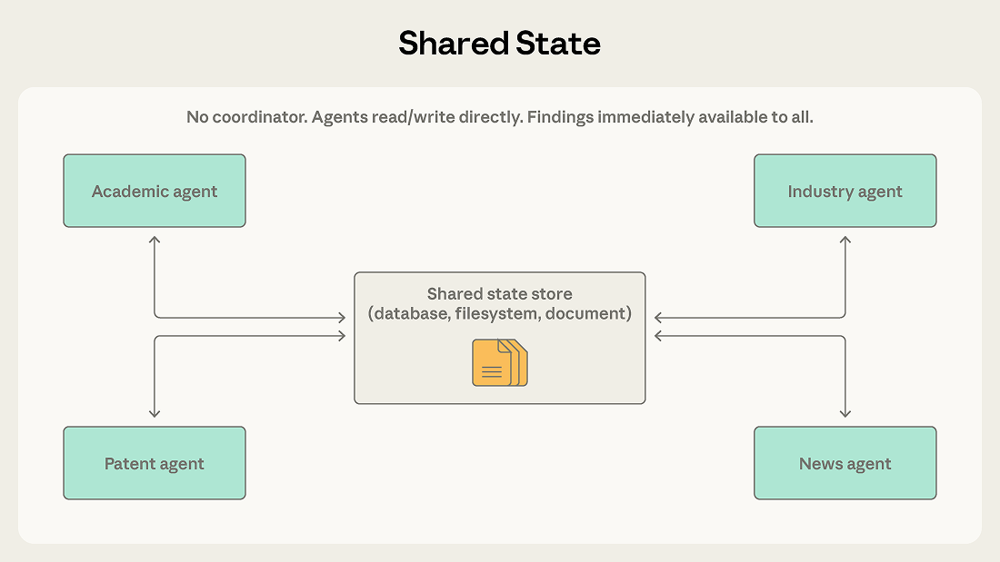
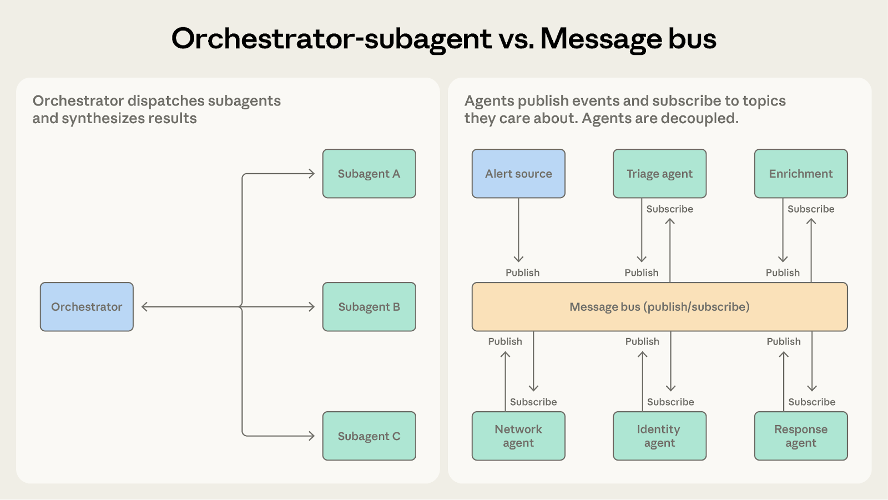
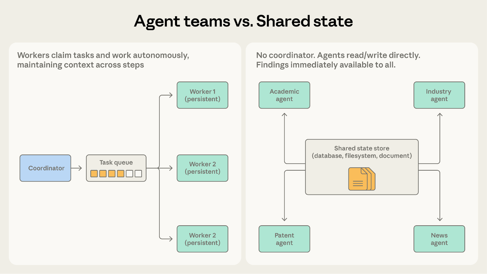

# 多智能体协调模式：五种方法及其适用场景（中英对照）

> **原文标题：** Multi-agent coordination patterns: Five approaches and when to use them
> **作者：** Cara Phillips（贡献者：Eugene Yan、Jiri De Jonghe、Samuel Weller、Erik S. 等）
> **原文链接：** https://claude.com/blog/multi-agent-coordination-patterns
> **发布日期：** 2026-04-10
> **翻译模型：** GLM-5.3
> 排版：每段英文原文在前，中文翻译紧随其后。术语保留英文原文并附中文释义。

---

Five multi-agent coordination patterns, their trade-offs, and when to evolve from one to another.

五种多智能体协调模式、它们的取舍，以及何时从一种模式演进到另一种。

In an earlier post, we explored when multi-agent systems provide value and when a single agent is the better choice. This post is for teams that have made that call and now need to decide which coordination pattern fits their problem.

在早前的一篇文章中，我们探讨了多智能体系统何时能创造价值、何时单智能体才是更好的选择。本文面向已经做出这一决策、现在需要决定哪种协调模式适合自己问题的团队。

We've seen teams choose patterns based on what sounds sophisticated rather than what fits the problem at hand. We recommend starting with the simplest pattern that could work, watching where it struggles, and evolving from there. This post examines the mechanics and limitations of five patterns:

我们看到过一些团队依据"哪个听起来更高级"而非"哪个适合手头的问题"来选择模式。我们建议从可行的最简模式入手，观察它在哪里吃力，再从那里逐步演进。本文将剖析五种模式的运作机制与局限：

- Generator-verifier, for quality-critical output with explicit evaluation criteria
- Orchestrator-subagent, for clear task decomposition with bounded subtasks
- Agent teams, for parallel, independent, long-running subtasks
- Message bus, for event-driven pipelines with a growing agent ecosystem
- Shared-state, for collaborative work where agents build on each other's findings

- 生成器-验证器（Generator-verifier）：用于有明确评估标准、对输出质量要求极高的场景
- 编排器-子智能体（Orchestrator-subagent）：用于任务可清晰分解、子任务边界明确的场景
- 智能体团队（Agent teams）：用于并行、独立、长时间运行的子任务
- 消息总线（Message bus）：用于事件驱动、智能体生态不断扩张的流水线
- 共享状态（Shared-state）：用于智能体相互借鉴彼此发现的协作型工作

# 模式 1：生成器-验证器（Pattern 1: Generator-verifier）

This is the simplest multi-agent pattern and among the most deployed. We introduced it as the verification subagent pattern in our previous post, and here we use the broader generator-verifier framing because the generator need not be an orchestrator.

这是最简单、也是部署最广的多智能体模式之一。我们在上一篇文章中以"验证子智能体模式"（verification subagent pattern）的名字介绍过它；这里我们采用更宽泛的"生成器-验证器"框架，因为生成器并不一定是编排器（orchestrator）。

## 工作原理（How it works）

A generator receives a task and produces an initial output, which it passes to a verifier for evaluation. The verifier checks whether the output meets the required criteria and either accepts it as complete or rejects it with feedback. If rejected, that feedback is routed back to the generator, which uses it to produce a revised attempt. This loop continues until the verifier accepts the output or the maximum number of iterations is reached.

生成器（generator）接收一个任务并产出初始输出，随后将其交给验证器（verifier）评估。验证器检查输出是否满足要求的标准，要么接受并视为完成，要么附带反馈予以拒绝。若被拒绝，反馈会被送回生成器，生成器据此产出一个修改后的版本。这个循环持续进行，直到验证器接受输出，或达到最大迭代次数。

## 适用场景（Where it works well）

Consider a support system that generates email responses to customer tickets. The generator produces an initial response using product documentation and ticket context. The verifier checks accuracy against the knowledge base, evaluates tone against brand guidelines, and confirms the response addresses each issue raised. Failed checks return to the generator with feedback that names the exact problem, such as a feature misattributed to the wrong pricing tier or a ticket issue left unanswered.

设想一个为客服工单生成电子邮件回复的客户支持系统。生成器依据产品文档和工单上下文产出初始回复；验证器对照知识库核查准确性、对照品牌指南评估语气，并确认回复覆盖了工单中提出的每一个问题。未通过的检查会连同反馈一起返回给生成器，反馈会点名确切的问题，比如某项功能被错误归到错误的定价档位，或工单中的某个问题未获答复。

Use this pattern when output quality is critical and evaluation criteria can be made explicit. It's effective for code generation (one agent writes code, another writes and runs tests), fact-checking, rubric-based grading, compliance verification, and any domain where an incorrect output costs more than an additional generation cycle.

当输出质量至关重要、且评估标准可以明确表述时，就使用这一模式。它适用于代码生成（一个智能体写代码，另一个编写并运行测试）、事实核查、基于评分量规（rubric）的打分、合规审查，以及任何"错误输出的代价高于多跑一轮生成"的领域。

## 局限之处（Where it struggles）

The verifier is only as good as its criteria. A verifier told only to check whether output is good, with no further criteria, will rubber-stamp the generator's output. Teams most often fail by implementing the loop without defining what verification means, which creates the illusion of quality control without the substance. (We discussed this early victory problem in the previous post.)

验证器的水平取决于它的标准。如果只告诉验证器"检查输出好不好"而没有进一步的标准，它就会对生成器的输出走过场（盖橡皮章）。团队最常见的失败，是实现了循环却没有定义"验证"到底意味着什么--这制造出质量控制的假象而没有实质。（我们在上一篇文章中讨论过这种"过早胜利"（early victory）问题。）

The pattern also assumes generation and verification are separable skills. If evaluating a creative approach is as hard as generating one, the verifier may not reliably catch problems.

该模式还默认生成与验证是可分离的两种技能。如果评估一个创意方案与生成它一样难，验证器就未必能可靠地发现问题。

Finally, iterative loops can stall. If the generator can't address the verifier's feedback, the system oscillates without converging. A maximum iteration limit with a fallback strategy (escalate to a human, return the best attempt with caveats) prevents this from becoming an infinite loop.

最后，迭代循环可能停滞。如果生成器无法解决验证器提出的问题，系统就会来回震荡而无法收敛。设置最大迭代上限并配以后备策略（升级给人工处理、附带保留意见地返回最佳尝试），可以避免它变成无限循环。

# 模式 2：编排器-子智能体（Pattern 2: Orchestrator-subagent）

Hierarchy defines this pattern. One agent acts as a team lead that plans work, delegates tasks, and synthesizes results. Subagents handle specific responsibilities and report back.

层级结构定义了这一模式。一个智能体充当团队负责人（team lead），负责规划工作、分派任务、综合结果；子智能体（subagent）承担具体职责并汇报结果。

## 工作原理（How it works）

A lead agent receives a task and determines how to approach it. It may handle some subtasks directly while dispatching others to subagents. Subagents complete their work and return results, which the orchestrator synthesizes into a final output.

主智能体（lead agent）接收任务并决定如何着手。它可以直接处理一部分子任务，同时把其余的分派给子智能体。子智能体完成工作并返回结果，再由编排器综合成最终输出。

Claude Code uses this pattern. The main agent writes code, edits files, and runs commands itself, dispatching subagents in the background when it needs to search a large codebase or investigate independent questions so work continues while results stream back. Each subagent operates in its own context window and returns distilled findings. This keeps the orchestrator's context focused on the primary task while exploration happens in parallel.

Claude Code 使用的就是这一模式。主智能体自己写代码、改文件、跑命令；当需要搜索大型代码库或调查相互独立的问题时，它会在后台分派子智能体，这样在结果回传的同时工作仍在继续。每个子智能体在各自独立的上下文窗口（context window）中运行，并返回提炼后的结论。这让编排器的上下文始终聚焦于主任务，而探索工作并行进行。

## 适用场景（Where it works well）

Consider an automated code review system. When a pull request arrives, the system needs to check for security vulnerabilities, verify test coverage, assess code style, and evaluate architectural consistency. Each check is distinct, requires different context, and produces a clear output. An orchestrator dispatches each check to a specialized subagent, collects the results, and synthesizes a unified review.

设想一个自动化代码评审系统。当一个拉取请求（pull request）到来时，系统需要检查安全漏洞、核实测试覆盖率、评估代码风格、评判架构一致性。每项检查彼此独立、需要不同的上下文、并产出明确的结果。编排器把每项检查分派给专门的子智能体，收集结果，再综合成一份统一的评审。

Use this pattern when task decomposition is clear and subtasks have minimal interdependence. The orchestrator maintains a coherent view of the overall goal while subagents stay focused on specific responsibilities.

当任务分解清晰、子任务之间几乎不相互依赖时，使用这一模式。编排器对总体目标保持连贯的把握，而子智能体专注于各自的职责。

## 局限之处（Where it struggles）

The orchestrator becomes an information bottleneck. When a subagent discovers something relevant to another subagent's work, that information has to travel back through the orchestrator. If the security subagent finds an authentication flaw that affects the architecture subagent's analysis, the orchestrator must recognize this dependency and route the information appropriately. After several such handoffs, critical details are often lost or summarized away.

编排器会成为信息瓶颈。当某个子智能体的发现与另一个子智能体的工作相关时，这些信息必须绕回编排器中转。如果安全子智能体发现了一个会影响架构子智能体分析的认证缺陷，编排器必须识别出这一依赖关系并把信息正确传递过去。经过几次这样的中转之后，关键细节往往丢失或被摘要掉。

Sequential execution also limits throughput. Unless explicitly parallelized, subagents run one after another, meaning the system incurs multi-agent token costs without the speed benefit.

顺序执行也限制了吞吐量。除非显式并行化，否则子智能体只能一个接一个运行，这意味着系统付出了多智能体的 token 成本，却得不到速度上的收益。

# 模式 3：智能体团队（Pattern 3: Agent teams）

When work decomposes into parallel subtasks that can proceed independently for extended periods, orchestrator-subagent can become unnecessarily constraining.

当工作能分解为可长时间独立推进的并行子任务时，编排器-子智能体模式反而会成为不必要的束缚。

## 工作原理（How it works）

A coordinator spawns multiple worker agents as independent processes. Teammates claim tasks from a shared queue, work on them autonomously across multiple steps, and signal completion.

协调器（coordinator）以独立进程的形式孵化多个工作智能体。队友（teammate）从共享队列中认领任务，自主地跨越多个步骤推进工作，并发出完成信号。

The difference from orchestrator-subagent is worker persistence. The orchestrator spawns a subagent for one bounded subtask, and the subagent terminates after returning a result. Teammates stay alive across many assignments, accumulating context and domain specialization that improve their performance over time. The coordinator assigns work and collects outcomes but doesn't reset workers between tasks.

与编排器-子智能体的区别在于工作者的持久性（persistence）。编排器为一个有边界的子任务孵化一个子智能体，子智能体返回结果后即终止；而队友跨多个任务持续存活，不断积累上下文和领域专长，性能随之提升。协调器分派工作、收集成果，但不会在任务之间重置工作者。

## 适用场景（Where it works well）

Consider migrating a large codebase from one framework to another. A teammate can migrate each service independently, with its own dependencies, test suite, and deployment configuration. A coordinator assigns each service to a teammate, and each teammate works through the migration autonomously: dependency updates, code changes, test fixes, validation. The coordinator collects completed migrations and runs integration tests across the full system.

设想把一个大型代码库从一个框架迁移到另一个。每个队友可以独立迁移一个服务，包括它自己的依赖、测试套件和部署配置。协调器把每个服务分派给一个队友，每个队友自主完成迁移：更新依赖、修改代码、修复测试、验证。协调器收集已完成的迁移，并对整个系统运行集成测试。

Use this pattern when subtasks are independent and benefit from sustained, multi-step work. Each teammate builds up context about its domain rather than starting fresh with each dispatch.

当子任务相互独立、且能从持续的多步骤工作中受益时，使用这一模式。每个队友会逐步建立起对自己领域的上下文积累，而不是每次分派都从零开始。

## 局限之处（Where it struggles）

Independence is the critical requirement. Unlike orchestrator-subagent, where the orchestrator can mediate between subagents and route information, teammates operate autonomously and can't easily share intermediate findings. If one teammate's work affects another's, neither is aware, and their outputs may conflict.

独立性是关键前提。与编排器-子智能体模式不同--那里编排器可以在子智能体之间调解并传递信息--队友自主运行，难以共享中间发现。如果一个队友的工作会影响另一个，双方都无从察觉，产出还可能相互冲突。

Completion detection is also harder. Since teammates work autonomously for variable durations, the coordinator must handle partial completion where one teammate finishes in two minutes and another takes twenty.

完成检测也更困难。由于队友自主工作、耗时各异，协调器必须处理"部分完成"的状态：一个队友两分钟就完成，另一个却要二十分钟。

Shared resources compound both problems. When multiple teammates operate on the same codebase, database, or file system, two teammates may edit the same file or make incompatible changes. The pattern requires careful task partitioning and conflict resolution mechanisms.

共享资源会放大这两个问题。当多个队友在同一个代码库、数据库或文件系统上操作时，可能出现两个队友编辑同一文件或做出不兼容修改的情况。这一模式需要仔细的任务切分和冲突解决机制。

# 模式 4：消息总线（Pattern 4: Message bus）

As agent count increases and interaction patterns grow complex, direct coordination becomes difficult to manage. A message bus introduces a shared communication layer where agents publish and subscribe to events.

随着智能体数量增加、交互模式日趋复杂，直接协调会变得难以管理。消息总线引入一个共享的通信层，智能体在其中发布（publish）和订阅（subscribe）事件。

## 工作原理（How it works）

Agents interact through two primitives: publish and subscribe. Agents subscribe to the topics they care about, and a router delivers matching messages. New agents with new capabilities can start receiving relevant work without rewiring existing connections.

智能体通过两个原语交互：发布与订阅。智能体订阅自己关心的话题（topic），由路由器（router）投递匹配的消息。具备新能力的新智能体可以直接开始接收相关工作，而无需重新接线现有连接。

## 适用场景（Where it works well）

A security operations automation system demonstrates where this pattern excels. Alerts arrive from multiple sources, and a triage agent classifies each by severity and type, routing high-severity network alerts to a network investigation agent and credential-related alerts to an identity analysis agent. Each investigation agent may publish enrichment requests that a context-gathering agent fulfills. Findings flow to a response coordination agent that determines the appropriate action.

一个安全运营自动化系统可以展示这一模式的用武之地。告警从多个来源涌入，分诊（triage）智能体按严重程度和类型对每条告警分类，把高严重度的网络告警路由给网络调查智能体，把凭证相关告警路由给身份分析智能体。每个调查智能体可以发布富化请求（enrichment request），由上下文收集智能体来满足。调查发现流向响应协调智能体，由它决定恰当的处置动作。

This pipeline suits the message bus because events flow from one stage to the next, teams can add new agent types as threat categories evolve, and teams can develop and deploy agents independently.

这条流水线适合消息总线，因为事件从一阶段流向下一阶段，团队可以随着威胁类别的演变增加新的智能体类型，并且各团队可以独立开发和部署智能体。

Use this pattern for event-driven pipelines where the workflow emerges from events rather than a predetermined sequence, and where the agent ecosystem is likely to grow.

在以下情况使用这一模式：事件驱动的流水线--工作流由事件涌现而非预先确定的顺序驱动，并且智能体生态大概率会持续扩张。

## 局限之处（Where it struggles）

The flexibility of event-driven communication makes tracing harder. When an alert triggers a cascade of events across five agents, understanding what happened requires careful logging and correlation. Debugging is harder than following an orchestrator's sequential decisions.

事件驱动通信的灵活性让链路追踪变得更难。当一条告警触发横跨五个智能体的事件级联时，要理解究竟发生了什么，需要细致的日志和关联分析。这比跟踪编排器的顺序决策更难调试。

Routing accuracy is also critical. If the router misclassifies or drops an event, the system fails silently, handling nothing but never crashing. LLM-based routers provide semantic flexibility but introduce their own failure modes.

路由准确性也至关重要。如果路由器错误分类或丢弃了某个事件，系统会静默失败--什么都没处理，却也永不崩溃。基于 LLM 的路由器提供了语义上的灵活性，但也引入了它们自己的失败模式。

# 模式 5：共享状态（Pattern 5: Shared state）

Orchestrators, team leads, and message routers in the previous patterns all centrally manage information flow. Shared state removes the intermediary by letting agents coordinate through a persistent store that all can read and write directly.

前几种模式中的编排器、团队负责人和消息路由器都以集中方式管理信息流。共享状态移除了这个中间人：智能体通过一个所有人都能直接读写的持久化存储来协调。

## 工作原理（How it works）

Agents operate autonomously, reading from and writing to a shared database, file system, or document. There's no central coordinator. Agents check the store for relevant information, act on what they find, and write their findings back. Work typically begins when an initialization step seeds the store with a question or dataset, and ends when a termination condition is met: a time limit, a convergence threshold, or a designated agent determining the store contains a sufficient answer.

智能体自主运行，对一个共享的数据库、文件系统或文档进行读写。这里没有中央协调器。智能体查看存储中是否有相关信息，依据所见采取行动，并把发现写回。工作通常始于一个初始化步骤向存储注入问题或数据集，终于满足终止条件：时间上限、收敛阈值（convergence threshold），或某个指定智能体判定存储中已包含足够充分的答案。

## 适用场景（Where it works well）

Consider a research synthesis system where multiple agents investigate different aspects of a complex question. One explores academic literature, another analyzes industry reports, a third examines patent filings, a fourth monitors news coverage. Each agent's findings may inform the others' investigations. The academic literature agent might discover a key researcher whose company the industry agent should examine more closely.

设想一个研究综合系统，多个智能体分别调查一个复杂问题的不同侧面：一个探索学术文献，一个分析行业报告，一个检视专利申请，一个监测新闻报道。每个智能体的发现都可能启发其他智能体的调查。比如学术文献智能体发现了一位关键研究者，而这位研究者所在的公司正值得行业智能体深入考察。

With shared state, findings go directly into the store. The industry agent can see the academic agent's discoveries immediately, without waiting for a coordinator to route the information. Agents build on each other's work, and the shared store becomes an evolving knowledge base.

有了共享状态，发现直接写入存储。行业智能体可以立刻看到学术智能体的发现，无需等待协调器中转信息。智能体在彼此的工作之上继续构建，共享存储也就成为一座不断演进的知识库。

Shared state also removes the coordinator as a single point of failure. If any one agent stops, the others continue reading and writing. In orchestrator and message-bus systems, a coordinator or router failure halts everything.

共享状态还消除了协调器这个单点故障（single point of failure）。任何一个智能体停止，其余的仍能继续读写。而在编排器和消息总线系统里，协调器或路由器一旦失效，一切都会停摆。

## 局限之处（Where it struggles）

Without explicit coordination, agents may duplicate work or pursue contradictory approaches. Two agents might independently investigate the same lead. Agent interactions produce system behavior rather than top-down design, which makes outcomes less predictable.

没有显式协调，智能体可能重复劳动或采取相互矛盾的路径。两个智能体可能各自独立地调查同一条线索。系统行为由智能体交互涌现，而非出自自上向下的设计，这让结果更难预测。

The harder failure mode is reactive loops. For example, Agent A writes a finding, Agent B reads it and writes a follow-up, Agent A sees the follow-up and responds. The system keeps burning tokens on work that isn't converging. Duplicate work and concurrent writes have known engineering fixes (locking, versioning, partitioning). Reactive loops are a behavioral problem and need first-class termination conditions: a time budget, a convergence threshold (no new findings for N cycles), or a designated agent whose job is to decide when the store contains a sufficient answer. Systems that treat termination as an afterthought tend to cycle indefinitely or stop arbitrarily when one agent's context fills.

更棘手的失败模式是反应式循环（reactive loop）。例如，智能体 A 写入一条发现，智能体 B 读到后写入后续，A 看到后续又做出回应。系统不断把 token 烧在不会收敛的工作上。重复劳动和并发写有成熟的工程解法（加锁、版本化、分区），反应式循环却是行为层面的问题，需要一等公民（first-class）级别的终止条件：时间预算、收敛阈值（连续 N 个周期没有新发现）、或一个专职智能体来判定存储中何时已有足够充分的答案。那些把终止当作事后补丁的系统，往往会无限循环，或者在某一个智能体的上下文填满时戛然而止。

# 在模式之间选择与演进（Choosing and evolving between patterns）

The right pattern depends on a handful of structural questions about the system. In our previous post, we argued for context-centric decomposition, which divides work by what context each agent needs rather than by what type of work it does. That principle applies here too. The patterns differ in how they manage context boundaries and information flow.

选择哪种模式取决于对系统结构性问题的回答。在上一篇文章中，我们主张按上下文切分（context-centric decomposition）：按每个智能体需要什么上下文来划分工作，而不是按工作类型划分。这一原则在这里同样适用。各模式的差异正体现在它们如何管理上下文边界与信息流。

## 编排器-子智能体 vs. 智能体团队（Orchestrator-subagent vs. agent teams）

Both involve a coordinator dispatching work to other agents. The question is how long workers need to maintain their context.

两者都涉及协调器向其他智能体分派工作。关键问题是：工作者需要把自己的上下文维持多久。

- Choose orchestrator-subagent when subtasks are short, focused, and produce clear outputs. The code review system works well here because each check runs its analysis, generates a report, and returns within a single bounded invocation. The subagent doesn't need to carry context across multiple cycles.
- Choose agent teams when subtasks benefit from sustained, multi-step work. The codebase migration fits here because each teammate develops real familiarity with its assigned service: the dependency graph, test patterns, deployment configuration. That accumulated context improves performance in ways one-shot dispatch can't replicate.

- 当子任务短小、聚焦、产出明确时，选择编排器-子智能体。代码评审系统在此很合适，因为每项检查运行自己的分析、生成报告，并在单次有边界的调用内返回。子智能体不需要跨多个周期携带上下文。
- 当子任务能从持续的多步骤工作中受益时，选择智能体团队。代码库迁移属于这种情况，因为每个队友会与自己负责的服务建立起真正的熟悉度：依赖图、测试模式、部署配置。这种积累的上下文带来的性能提升，是一次性分派无法复制的。

When subagents need to retain state across invocations, agent teams are the better fit.

当子智能体需要在多次调用之间保留状态时，智能体团队是更合适的选择。

## 编排器-子智能体 vs. 消息总线（Orchestrator-subagent vs. message bus）

Both can handle multi-step workflows. The question is how predictable the workflow structure is.

两者都能处理多步骤工作流。关键问题是：工作流的结构有多可预测。

- Choose orchestrator-subagent when the sequence of steps is known in advance. The code review system follows a fixed pipeline: receive a PR, run checks, synthesize results.
- Choose message bus when the workflow emerges from events and may vary based on what's discovered. The security operations system can't predict what alerts will arrive or what investigation paths they'll require. New alert types may emerge that need new handling. The message bus accommodates that variability by routing events to capable agents rather than following a predetermined sequence.

- 当步骤顺序可以预先确定时，选择编排器-子智能体。代码评审系统遵循固定流水线：接收 PR、运行检查、综合结果。
- 当工作流由事件涌现、且可能随发现不同而变化时，选择消息总线。安全运营系统无法预测会到来什么告警、需要什么样的调查路径，也可能出现需要新处理方式的新告警类型。消息总线通过把事件路由给有能力处理的智能体来容纳这种多变性，而不是遵循预先确定的顺序。

As conditional logic accumulates in the orchestrator to handle an expanding variety of cases, the message bus makes that routing explicit and extensible.

当编排器中为了应对日益增多的情形而堆积条件逻辑时，消息总线能让这种路由变得显式且可扩展。

## 智能体团队 vs. 共享状态（Agent teams vs. shared state）

Both involve agents working autonomously. The question is whether agents need each other's findings.

两者都涉及智能体自主工作。关键问题是：智能体是否需要彼此的发现。

- Choose agent teams when agents work on separate partitions that don't interact. The codebase migration fits here because each teammate handles its service and the coordinator combines results at the end.
- Choose shared state when agents' work is collaborative and findings should flow between them in real time. The research synthesis system is a better match because the academic agent's discovery of a key researcher immediately becomes relevant to the industry agent's investigation.

- 当智能体在互不交互的独立分区上工作时，选择智能体团队。代码库迁移属于这种情况：每个队友处理自己的服务，协调器在最后汇总结果。
- 当智能体的工作是协作型的、发现需要在彼此之间实时流动时，选择共享状态。研究综合系统是更好的匹配，因为学术智能体发现关键研究者的那一刻，这一发现立刻就与行业智能体的调查相关。

Once teammates need to communicate with each other rather than only share final results, shared state makes that more natural.

一旦队友需要相互沟通、而不只是共享最终结果，共享状态会让这一切更自然。

## 消息总线 vs. 共享状态（Message bus vs. shared state）

Both support complex multi-agent coordination. The question is whether work flows as discrete events or accumulates into a shared knowledge base.

两者都支持复杂的多智能体协调。关键问题是：工作是以离散事件的形式流动，还是积累成一座共享的知识库。

- Choose message bus when agents react to events in a pipeline. The security operations system processes alerts stage by stage, with each event triggering the next before completing. The pattern is efficient at routing events to capable agents.
- Choose shared state when agents build on accumulated findings over time. The research synthesis system gathers knowledge continuously. Agents return to the store repeatedly, seeing what others have discovered and adjusting their investigations.

- 当智能体在流水线中对事件做出反应时，选择消息总线。安全运营系统逐阶段处理告警，每个事件在完成前触发下一个。这一模式在把事件路由给有能力处理的智能体方面非常高效。
- 当智能体在时间维度上基于积累的发现继续构建时，选择共享状态。研究综合系统持续汇聚知识，智能体反复回到存储，查看别人的发现，并调整自己的调查方向。

The message bus still has a router, which means a central component decides where events go. Shared state is decentralized. If eliminating single points of failure is a priority, shared state provides that more completely.

消息总线仍有路由器，这意味着仍由一个中央组件决定事件去向；共享状态则是去中心化的。如果消除单点故障是首要考量，共享状态做得更彻底。

If agents in a message bus system are publishing events to share findings rather than trigger actions, shared state is a better fit.

如果消息总线系统中的智能体发布事件是为了共享发现而非触发动作，那么共享状态是更合适的选择。

# 开始上手（Getting started）

Production systems often combine patterns. A common hybrid uses orchestrator-subagent for the overall workflow with shared state for a collaboration-heavy subtask. Another uses message bus for event routing with agent team-style workers handling each event type. These patterns are building blocks, not mutually exclusive choices.

生产系统常常组合多种模式。一种常见的混合方案是用编排器-子智能体承载整体工作流，再用共享状态支撑某个重协作的子任务；另一种是用消息总线做事件路由，由智能体团队式的工作者处理每种事件类型。这些模式是积木，而非互斥的选项。

The following table summarizes when each pattern is appropriate.

下表总结了每种模式的适用时机。

| Situation | Pattern |
| --- | --- |
| Quality-critical output, explicit evaluation criteria | Generator-Verifier |
| Clear task decomposition, bounded subtasks | Orchestrator-Subagent |
| Parallel workload, independent long-running subtasks | Agent Teams |
| Event-driven pipeline, growing agent ecosystem | Message Bus |
| Collaborative research, agents share discoveries | Shared State |
| No single point of failure required | Shared State |

| 情形 | 模式 |
| --- | --- |
| 对输出质量要求极高、评估标准明确 | 生成器-验证器（Generator-Verifier） |
| 任务分解清晰、子任务有边界 | 编排器-子智能体（Orchestrator-Subagent） |
| 并行负载、独立的长时运行子任务 | 智能体团队（Agent Teams） |
| 事件驱动流水线、智能体生态持续增长 | 消息总线（Message Bus） |
| 协作型研究、智能体共享发现 | 共享状态（Shared State） |
| 要求无单点故障 | 共享状态（Shared State） |

For most use cases, we recommend starting with orchestrator-subagent. It handles the widest range of problems with the least coordination overhead. Observe where it struggles, then evolve toward other patterns as specific needs become clear.

对大多数用例，我们建议从编排器-子智能体起步。它以最少的协调开销覆盖最广的问题范围。观察它在哪里吃力，再随着具体需求变得清晰，向其他模式演进。

‍In upcoming posts, we will examine each pattern in depth with production implementations and case studies. For background on when multi-agent systems are worth the investment, see Building multi-agent systems: when and how to use them.

在接下来的文章中，我们将结合生产实现和案例研究深入剖析每种模式。关于多智能体系统何时值得投入的背景知识，请参阅《Building multi-agent systems: when and how to use them》。

# 致谢（Acknowledgements）

Written by Cara Phillips, with contributions from Eugene Yan, Jiri De Jonghe, Samuel Weller, and Erik S.

本文由 Cara Phillips 撰写，Eugene Yan、Jiri De Jonghe、Samuel Weller 和 Erik S. 贡献内容。
