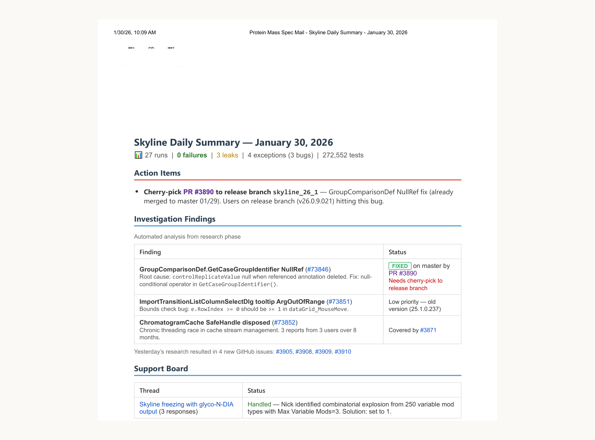
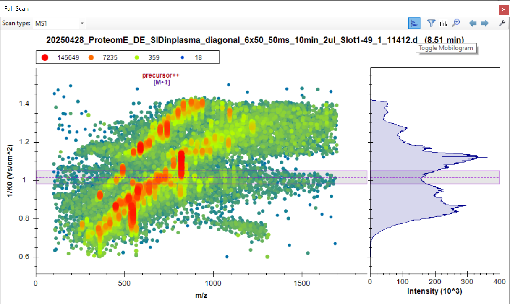

# 像对待新开发者一样让 Claude Code 入职：来自 17 年开发的经验（中英对照）

> **原文标题：** Onboarding Claude Code like a new developer: Lessons from 17 years of development
> **作者：** Anthropic（原文未署名）
> **原文链接：** https://claude.com/blog/onboarding-claude-code-like-a-new-developer-lessons-from-17-years-of-development
> **发布日期：** 2026-04-28
> **翻译模型：** GLM-5.3
> 排版：每段英文原文在前，中文翻译紧随其后。术语保留英文原文并附中文释义。

---

The methodology that onboards new developers to MacCoss Lab's 700,000-line codebase works on Claude Code, too. Here's how Brendan MacLean, a Claude Developer Ambassador whose lab is part of our Claude for Open Source program, did it.

让新开发者快速上手 MacCoss Lab 70 万行代码库的那套方法论，对 Claude Code 同样有效。本文讲述 Claude Developer Ambassador、其实验室参与我们 Claude for Open Source 计划的 Brendan MacLean 是如何做到的。

Skyline, the open source protein analysis software maintained by principal developer Brendan MacLean at the University of Washington's MacCoss Lab, has been in active development since 2008. Skyline helps researchers detect and quantify proteins in things like blood plasma and tissue, which is vital for biomarker discovery, disease research, and drug development. The MacCoss Lab codebase contains 700,000+ lines of C#, maintained for 17 years by a small team running 200,000+ automated nightly tests.

Skyline 是华盛顿大学 MacCoss Lab 由首席开发者 Brendan MacLean 维护的开源蛋白质分析软件，自 2008 年起持续开发至今。Skyline 帮助研究人员检测和定量分析血浆、组织等样本中的蛋白质，这对生物标志物发现、疾病研究和药物开发至关重要。MacCoss Lab 的代码库包含 70 余万行 C#，由一个小团队维护了 17 年，每晚运行超过 20 万个自动化测试。

> A 3D illustration of the Seattle skyline created in Blender, representing the home of the University of Washington's MacCoss Lab, where Brendan MacLean and his team have developed and maintained Skyline since 2008. Claude helped Brendan add the Claude logo in the back. Image courtesy of MacCoss lab.

> 用 Blender 制作的西雅图天际线 3D 插图，代表华盛顿大学 MacCoss Lab 的所在地--Brendan MacLean 和他的团队自 2008 年起在这里开发并维护 Skyline。Claude 帮 Brendan 在背景中加上了 Claude 标志。图片由 MacCoss Lab 提供。

For nearly three decades, Brendan has been Skyline's connective tissue, onboarding dozens of undergrads, grad students, and postdocs to the lab.*

近三十年来，Brendan 一直是 Skyline 的"结缔组织"，先后为实验室培养了数十名本科生、研究生和博士后。*

As developers joined and left, the codebase absorbed their contributions. By 2024, it carried the usual burdens of a long-lived project. Certain areas had grown untouchable as developers turned over.

随着开发者来来去去，代码库吸收了他们的贡献。到 2024 年，它背负上了长生命周期项目常见的包袱。随着人员更替，某些区域已经变得无人敢碰。

After decades of training lab members, Brendan knew how to bring researchers up to speed on the lab's massive codebase. What he didn't expect was that the same methodology, applied to an AI tool, would make Skyline's codebase manageable again.

经过数十年培训实验室成员，Brendan 深知如何让研究者快速上手实验室庞大的代码库。他没想到的是，同一套方法论应用到一个 AI 工具上，竟让 Skyline 的代码库重新变得可控。

# 同样的入职问题，另一类开发者（The same onboarding problem, a different kind of developer）

Brendan was skeptical modern AI coding tools could understand lines of C# the way a tool purpose-built for exactly this language and environment already did.

Brendan 起初不相信现代 AI 编码工具能像那些专为这门语言和这个环境打造的工具一样理解 C# 代码。

Early experiments with Claude.ai in the browser confirmed the pattern. He'd describe a problem, get a response, and copy a whole C# file back into his project, limiting scope to contained problems he could describe without any reference to project code.

早期在浏览器里使用 Claude.ai 的实验印证了他的判断。他会描述一个问题，得到回复，再把一整个 C# 文件复制回项目里，把使用范围局限在不涉及项目代码、能独立描述清楚的问题上。

"It became very laborious once changes became more incremental," Brendan says.

"一旦修改变得更碎片化，这个过程就变得非常繁琐，"Brendan 说。

Every session with Claude.ai felt like starting from scratch as it had no understanding of what Skyline was, how its components related, or what 17 years of development had established.

与 Claude.ai 的每次会话都像从零开始，因为它完全不了解 Skyline 是什么、各组件之间有什么关系，也不知道 17 年的开发确立了什么。

That was the same experience Brendan faced onboarding new developers, which gave him an idea.

这与 Brendan 培养新开发者时面对的经历一模一样，于是他有了一个想法。

"I could introduce Claude through Claude Code to my large project as I would a trainee developer: by explaining enough to achieve a successful limited project and produce improved context for the next iteration," Brendan says.

"我可以通过 Claude Code 把 Claude 当作一名实习开发者介绍给我的大型项目：讲解足够多的内容，让它完成一个成功的小项目，并为下一轮迭代产出更好的上下文，"Brendan 说。

He moved all AI context into its own repository, pwiz-ai, kept separate from the codebase so it applies across all branches and time points. The CLAUDE.md file at the root handles environment setup and points Claude to the relevant documentation: think of it as the 'lay of the land,' not the expertise itself.

他把所有 AI 上下文移到了一个独立仓库 pwiz-ai 中，与代码库分开维护，这样它就能适用于所有分支和所有时间点。根目录的 CLAUDE.md 文件负责环境配置，并指引 Claude 查阅相关文档：把它当作"地形概览"（lay of the land），而不是专业知识本身。

The expertise lives in skills, an open format for giving agents capabilities and expertise. His debugging skill, for example, is designed to pull Claude out of what he calls "guess and test" mode, pushing it toward root cause analysis before attempting any fix. Skills can be triggered manually or automatically; Brendan tunes his most critical ones with explicit conditions-the debugging skill description reads "ALWAYS load when investigating bugs, failures, or unexpected behavior."

专业知识存放在 skills 中--一种赋予 agent（智能体）能力和专业知识的开放格式。例如他的 debugging skill 就是为了把 Claude 从他所说的"猜了就试"（guess and test）模式里拉出来，促使它先做根因分析（root cause analysis）再动手修复。skills 可以手动或自动触发；Brendan 为最关键的几个 skill 设定了显式条件--debugging skill 的描述写着"在调查 bug、故障或意外行为时务必加载（ALWAYS load）"。

> The pwiz-ai repository structure, showing how context, skills, and MCP integrations connect to Skyline's codebase. Image courtesy of MacCoss lab.

> pwiz-ai 仓库结构，展示上下文、skills 和 MCP 集成如何连接到 Skyline 的代码库。图片由 MacCoss Lab 提供。

With context established, the overhead of teaching Claude the ins and outs of debugging the codebase becomes significantly less steep. Claude already knows what the code does. The interaction starts from understanding rather than from zero.

上下文建立之后，教 Claude 熟悉代码库调试细节的门槛显著降低。Claude 已经知道代码是做什么的，交互从理解出发，而不是从零开始。

"What seemed like a major concern-'Claude can't truly learn about my large project'-grows ever clearer: context is just another artifact to maintain and grow," Brendan says.

"起初看似一大隐忧--'Claude 无法真正了解我的大型项目'--如今越来越清晰：上下文不过是又一个需要维护和生长的工件（artifact），"Brendan 说。

# 减少技术债，加速开发（Reducing tech debt and accelerating development）

A year-long project to build a Files View panel in Skyline-a new interface showing all document-related files, with file system monitoring and drag-and-drop organization- sat unfinished after the developer who owned it left. Brendan picked it up with Claude Code.

Skyline 中一个历时一年的项目--Files View 面板，一个展示所有文档相关文件的新界面，带文件系统监控和拖拽整理功能--在负责它的开发者离开后一直搁置。Brendan 用 Claude Code 把它捡了起来。

Two weeks later it was done, with all final commits co-authored by Claude.

两周后项目完成，所有最终提交均由 Claude 共同署名（co-authored）。

"Prior efforts left in that shape have typically ended up being discarded," says Brendan. In an academic lab, developers rotate often-grad students finish degrees, postdocs move on, interns leave at the end of summer. In the past, any work-in-progress would have remained forever shelved.

"以往半途留下的工作通常最终都被丢弃了，"Brendan 说。在学术实验室，人员轮换是常态--研究生毕业、博士后另谋高就、实习生暑期结束离开。过去，任何进行中的工作都只能永远搁置。

Three years ago, Brendan stopped adding features to Skyline's nightly test management module after losing the developer who maintained it. The module was coded in Java as part of the LabKey Server scientific data web portal. Recently, after having a skilled LabKey developer create setup documentation using Claude Code, Brendan spent less than a day adding features he'd wanted for years and updating the page layout with CSS he had only ever employed designers to produce in the past.

三年前，在失去维护者之后，Brendan 停止了为 Skyline 的每夜测试管理模块添加功能。该模块用 Java 编写，是科学数据 Web 门户 LabKey Server 的一部分。最近，在请一位熟练的 LabKey 开发者用 Claude Code 编写好环境搭建文档之后，Brendan 花了不到一天就加上了他多年来想要的功能，还用 CSS 更新了页面布局--这些 CSS 过去他从来都是请设计师来写的。

New infrastructure followed.

新的基础设施随之而来。

Screenshot reproduction for Skyline's 2,000+ tutorial images is now fully automated and nearly 100% reproducible, extended with Claude Code to add diff-only views and pixel change amplification, and an MCP server written in C# by Claude so that it can "see" these diffs. Claude Code generates a daily summary each morning, showing test failures, exceptions, and open support threads pulled from Skyline's nightly test infrastructure that lands in Brendan's inbox before he sits down to work.

Skyline 的 2000 多张教程截图的复现现已完全自动化，接近 100% 可复现，并用 Claude Code 扩展了 diff-only 视图和像素变化放大功能；还有一个由 Claude 用 C# 编写的 MCP 服务器，让它能"看见"这些差异。Claude Code 每天早上会生成一份日报，列出从 Skyline 每夜测试基础设施拉取的测试失败、异常和未关闭的支持线程，在 Brendan 坐下开始工作之前送达他的收件箱。

Claude also wrote the MCP server in Python to make this capability possible, drawing from three separate relational data streams on a LabKey Server, team email, and code with release tags on GitHub.

Claude 还用 Python 编写了实现这一能力的 MCP 服务器，从三个独立的关系型数据流中取数：LabKey Server、团队邮件，以及 GitHub 上带发布标签的代码。

> A daily summary email generated automatically by Claude Code, pulling from Skyline's nightly test infrastructure. Image courtesy of MacCoss lab.

> 由 Claude Code 自动生成的每日摘要邮件，数据来自 Skyline 的每夜测试基础设施。图片由 MacCoss Lab 提供。

Brendan's developers are now barely writing code themselves, largely instructing Claude Code instead, and use the tool to autonomously generate automation scripts and MCP implementations. For instance, a developer in the lab who had been skeptical of agentic coding tools built and shipped a new plotting extension-a mobilogram pane for visualizing ion mobility data-and credited Claude Code.

Brendan 手下的开发者如今几乎不自己写代码了，主要是给 Claude Code 下指令，并用这个工具自主生成自动化脚本和 MCP 实现。例如，实验室里一位曾对 agentic coding 工具持怀疑态度的开发者，构建并发布了一个新的绘图扩展--用于可视化离子迁移率数据的 mobilogram 面板--并把功劳归于 Claude Code。

> The mobilogram pane was built with Claude Code, visualizing ion mobility data alongside mass spectrometry results. Image courtesy of MacCoss lab.

> mobilogram 面板由 Claude Code 构建，将离子迁移率数据与质谱结果一同可视化。图片由 MacCoss Lab 提供。

"I am seeing almost everyone taking on fun new features that they might have felt too buried in other work to attempt," says Brendan.

"我看到几乎所有人都在挑战有趣的新功能，放在以前，他们可能觉得深陷其他工作而无暇尝试，"Brendan 说。

# 给在遗留代码库上工作的开发者的建议（Advice for developers working on legacy codebases）

Based on 17 years of onboarding developers and more than a year of applying the same methodology to Claude Code, here's what Brendan would tell developers working on legacy codebases.

基于 17 年的开发者培养经验和一年多把同一套方法论应用于 Claude Code 的实践，以下是 Brendan 想对在遗留代码库上工作的开发者说的话。

Context is your best friend

上下文是你最好的朋友

The to-do lists and plans Claude generates don't persist across sessions. Context is what persists, and it has to be maintained deliberately. This is the part most developers skip, and it's why most developer success plateaus.

Claude 生成的待办清单和计划不会跨会话保留。能留存下来的是上下文，而且必须刻意维护。这正是大多数开发者跳过的环节，也是大多数人的成效停滞不前的原因。

"Understand that Claude can't learn without you recording 'context.' Don't expect magic," says Brendan. "Invest in building and maintaining your context layer. And treat it like any other project artifact: version it, grow it, maintain it."

"要明白，如果你不记录'上下文'，Claude 就无法学习。别指望魔法，"Brendan 说，"要在构建和维护上下文层上投入。把它当作任何其他项目工件一样对待：为它做版本管理，让它生长，对它加以维护。"

Brendan keeps the AI context in a separate repository because it grows at a different speed than the code and applies to all branches and time points-keeping it inside the code repository was becoming limiting. Keeping context in the same repo is a valid alternative; what matters is that it's versioned, maintained, and available when needed.

Brendan 把 AI 上下文放在独立仓库里，因为它的生长速度与代码不同，且要适用于所有分支和时间点--放在代码仓库内部会变得束手束脚。把上下文放在同一仓库也是可行的替代方案；关键在于它有版本管理、有人维护、需要时可用。

Invest in building your skill library

投入建设你的 skill 库

Use skills to encode domain knowledge any Claude instance can load. Brendan's skills follow a "reference do not embed" principle: each skill points into a central documentation knowledgebase rather than duplicating content, keeping them lightweight and easy to maintain.

用 skills 把任何 Claude 实例都能加载的领域知识编码下来。Brendan 的 skills 遵循"引用而非内嵌"（reference do not embed）原则：每个 skill 都指向中央文档知识库，而不是复制内容，从而保持轻量、易维护。

His most-used include: a skyline-development skill that orients Claude to the project and its documentation; a version-control skill that encodes project-specific commit and PR conventions; and a debugging skill designed to pull Claude out of "guess and test" mode, pushing it toward root cause analysis before attempting any fix.

他用得最多的包括：帮助 Claude 熟悉项目及其文档的 skyline-development skill；编码了项目特定提交和 PR 规范的 version-control skill；以及一个把 Claude 从"猜了就试"模式中拉出来、促使它先做根因分析再修复的 debugging skill。

Use MCP integrations when data access is keyBuild MCP integrations where Claude needs access to real data: test results, exception reports, support threads.

数据访问是关键时，使用 MCP 集成--在 Claude 需要访问真实数据之处构建 MCP 集成：测试结果、异常报告、支持线程。（原文此段标题与正文粘连，照实翻译。）

For open source projects, building and maintaining a context layer carries particular weight. There's no onboarding budget, no institutional memory beyond what gets written down, no guarantee that any contributor will still be around next year. Context, once built, is available to every contributor and persists across the project's lifetime in a way that human institutional knowledge never does. The pwiz-ai repository is itself an open source artifact-context that belongs to the project, not any one contributor, and outlasts everyone who built it.

对开源项目来说，构建和维护上下文层的分量格外重。没有入职预算，没有写下来之外的机构记忆（institutional memory），也无法保证哪位贡献者明年还在。上下文一旦建成，就对每位贡献者可用，并以人类机构记忆永远做不到的方式贯穿项目的一生。pwiz-ai 仓库本身就是一个开源工件--属于项目而非任何单个贡献者的上下文，比所有建造它的人都活得更久。

# 十七年入职培养，一个结论（Seventeen years of onboarding, one conclusion）

You wouldn't hand a new hire a 700,000-line codebase and expect results on day one. You'd find them a contained project, walk them through it, and expand their scope as their understanding grew.

你不会把一个 70 万行的代码库丢给新员工，然后指望他第一天就出成果。你会给他找一个边界清晰的项目，带着他走一遍，随着理解加深再扩大他的职责范围。

As Brendan learned, the context you build with Claude works the same way.

正如 Brendan 领悟到的，你与 Claude 一起构建的上下文，也遵循同样的道理。

Once knowledgeable enough about a codebase, engineers can work across branches and time points. Claude, given sufficient context and direction, can do the same.

工程师一旦对代码库足够熟悉，就能跨分支、跨时间点地工作。Claude 只要拥有足够的上下文和指引，同样可以做到。

*Dario Amodei, co-founder of Anthropic, was previously a member of the MacCoss Lab.

*Anthropic 联合创始人 Dario Amodei 曾是 MacCoss Lab 的成员。
