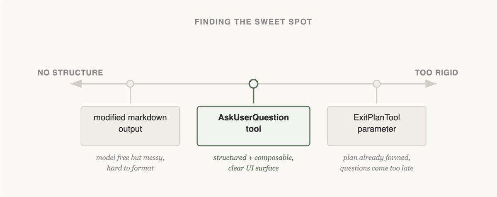
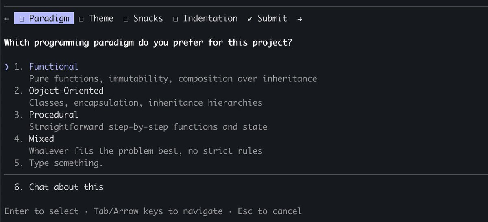
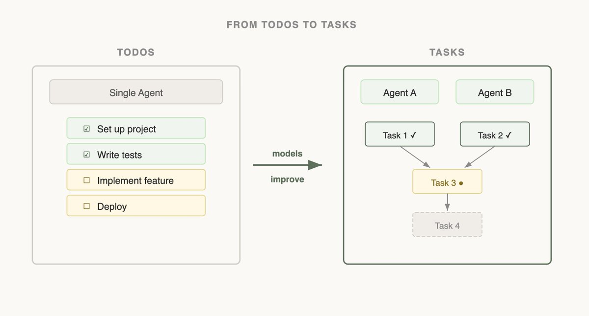

# 像 Agent 一样看世界：我们如何在 Claude Code 中设计工具（中英对照）

> **原文标题：** Seeing like an agent: how we design tools in Claude Code
> **作者：** Thariq Shihipar（Anthropic 技术团队成员，Claude Code）
> **原文链接：** https://claude.com/blog/seeing-like-an-agent
> **发布日期：** 2026-04-10
> **翻译模型：** GLM-5.3
> 排版：每段英文原文在前，中文翻译紧随其后。术语保留英文原文并附中文释义。

---

Building Claude Code: How Anthropic designs and refines AI agent tools like AskUserQuestion and Task tool. The key is progressive disclosure and learning to "see like an agent" to maximize effectiveness.

构建 Claude Code：Anthropic 如何设计与打磨 AskUserQuestion 工具、Task 工具等 AI 智能体工具。关键在于渐进式披露（progressive disclosure），以及学会"像 Agent 一样看世界"，以最大化工具效能。

Learn how the Claude Code team designs, tests, and evolves tools by thinking from the model's point of view.

了解 Claude Code 团队如何站在模型的视角思考，来设计、测试和演进工具。

One of the hardest parts about building an agent harness is constructing its tools.

构建智能体 harness（运行脚手架）最难的部分之一，就是构造它的工具。

Claude acts completely through tool calling, but there are a number of ways tools can be constructed in the Claude API with primitives like bash, skills and code execution. (You can read more about programmatic tool calling on the Claude API in @RLanceMartin's new article).

Claude 完全通过工具调用（tool calling）来行动，而在 Claude API 中有多种构造工具的方式，可用的原语包括 bash、skills 和代码执行（code execution）。（关于 Claude API 上的程序化工具调用（programmatic tool calling），可以在 @RLanceMartin 的新文章中读到更多。）

So how do you design your agents' tools? Do you give it one general-purpose tool like bash or code execution? Or fifty specialized tools, one for each use case?

那么，你该如何为自己的智能体设计工具？是给它一个像 bash 或代码执行这样的通用工具？还是五十个专门工具、一种用例一个？

To put yourself in the mind of the model, imagine being given a difficult math problem. What tools would you want in order to solve it? It would depend on your own skill set!

要把自己代入模型的心智，不妨想象你拿到一道很难的数学题。你会想要什么工具来解决它？这取决于你自己的技能组合！

Paper would be the minimum, but you'd be limited by manual calculations. A calculator would be better, but you would need to know how to operate the more advanced options. The fastest and most powerful option would be a computer, but you would have to know how to use it to write and execute code.

纸笔是最低配置，但你会受限于手工计算。计算器更好，但你得会用那些更高级的功能。最快也最强大的选项是计算机，但你必须知道如何用它来编写并执行代码。

This is a useful framework for designing your agent. You want to give it tools that are shaped to its own abilities. But how do you know what those abilities are? You pay attention, read its outputs, experiment. You learn to see like an agent.

这是设计智能体时一个有用的思考框架：你要给它与其自身能力相匹配的工具。可你怎么知道那些能力是什么？你留心观察、阅读它的输出、做实验。你学会像 Agent 一样看世界。

If you're building an agent, you'll face the same questions we did: when to add a tool, when to remove one, and how to tell the difference. Here's how we've answered them while building Claude Code, including where we got it wrong first.

如果你在构建智能体，你会遇到我们曾遇到的同样问题：何时增加一个工具、何时移除一个工具、又如何分辨两者。以下是我们在构建 Claude Code 过程中给出的回答--包括我们先期踩过的坑。

# 用 AskUserQuestion 工具改进引导式提问（Improving elicitation with the AskUserQuestion tool）

When building the AskUserQuestion tool, our goal was to improve Claude's ability to ask questions (often called elicitation).

构建 AskUserQuestion 工具时，我们的目标是提升 Claude 提问的能力（这通常被称为引导式提问，elicitation）。

While Claude could just ask questions in plain text, we found answering those questions felt like they took an unnecessary amount of time. How could we lower this friction and increase the bandwidth of communication between the user and Claude?

虽然 Claude 可以直接用纯文本提问，但我们发现用户回答这些问题时似乎要花费不必要的时间。我们如何才能降低这种摩擦、提高用户与 Claude 之间的通信带宽？

## 尝试 1：修改 ExitPlanTool（Attempt 1: Editing the ExitPlanTool）

The first approach we tried was adding a parameter to the ExitPlanTool to have an array of questions alongside the plan. This was the easiest fix to implement, but it confused Claude because we were simultaneously asking for a plan and a set of questions about the plan. What if the user's answers conflicted with what the plan said? Would Claude need to call the ExitPlanTool twice? We knew this tactic wouldn't work, so we went back to the drawing board. (You can read more about why we made an ExitPlanTool in our post on prompt caching)

我们尝试的第一种方法，是给 ExitPlanTool 增加一个参数，让它随计划一起携带一个问题数组。这是最容易实现的改法，但它让 Claude 感到困惑，因为我们同时要求它给出计划和一组关于计划的问题。如果用户的回答与计划内容冲突怎么办？Claude 是否需要调用两次 ExitPlanTool？我们知道这个路数行不通，于是回到绘图板重新构思。（关于我们为什么做 ExitPlanTool，可以在我们关于提示词缓存（prompt caching）的文章中读到更多。）

## 尝试 2：改变输出格式（Attempt 2: Changing output format）

Next, we tried updating Claude's output instructions to serve a slightly modified markdown format that it could use to ask questions. For example, we could ask it to output a list of bullet point questions with alternatives in brackets. We could then parse and format that question as UI for the user.

接下来，我们尝试更新 Claude 的输出指令，让它用一种稍作修改的 markdown 格式来提问。比如，我们可以要求它输出一组列表式问题，并在方括号中给出候选项。然后我们解析这些内容，把它格式化成呈现给用户的界面。

Claude could usually produce this format, but not reliably. It would append extra sentences, drop options, or abandon the structure altogether. Onto the next approach.

Claude 通常能产出这种格式，但并不可靠。它时而追加多余的句子、时而丢掉选项、时而干脆放弃这个结构。于是进入下一种方法。

## 尝试 3：AskUserQuestion 工具（Attempt 3: The AskUserQuestion Tool）

Finally, we landed on creating a tool that Claude could call at any point, but it was particularly prompted to do so during plan mode. When the tool triggered we would show a modal to display the questions and block the agent's loop until the user answered.

最后，我们落在的方案是创建一个 Claude 在任意时刻都能调用的工具，并在计划模式（plan mode）下特别提示它去调用。工具触发时，我们会弹出一个模态框（modal）来展示问题，并阻塞智能体的循环，直到用户作答。

This tool allowed us to prompt Claude for a structured output and it helped us ensure that Claude gave the user multiple options. It also gave users ways to compose this functionality, for example calling it in the Agent SDK or using referring to it in skills.

这个工具让我们能要求 Claude 产出结构化输出，也帮助我们确保 Claude 给用户提供多个选项。它还让用户能够组合复用这一功能，例如在 Agent SDK 中调用它，或在 skills 中引用它。

Most importantly, Claude seemed to like calling this tool and we found its outputs worked well. After all, even the best designed tool doesn't work if Claude doesn't understand how to call it.

最重要的是，Claude 似乎喜欢调用这个工具，我们也发现它的输出效果很好。毕竟，设计再好的工具，如果 Claude 不理解怎么调用，也无济于事。

Is this the final form of elicitation in Claude Code? We doubt it. As Claude gets more capable, the tools that serve it have to evolve too. The next section shows a case where a tool that once helped started getting in the way.

这就是 Claude Code 中引导式提问的最终形态吗？我们对此存疑。随着 Claude 能力增强，为它服务的工具也必须演进。下一节将展示一个案例：一个曾经帮忙的工具，后来反而开始碍事。

## 随能力演进做更新：任务与待办（Updating with capabilities: tasks & todos）

When we first launched Claude Code, we realized that the model needed a todo list to keep it on track. Todos could be written at the start and checked off as the model did work. To do this we gave Claude the TodoWrite tool, which would write or update Todos and display them to the user.

刚发布 Claude Code 时，我们意识到模型需要一份待办清单（todo list）来保持正轨：待办事项可以在开头写好，随着模型推进工作逐项勾掉。为此我们给了 Claude TodoWrite 工具，用它写入或更新待办事项，并展示给用户。

But even then, we often saw Claude forgetting what it had to do. To adapt, we inserted system reminders every 5 turns that reminded Claude of its goal.

但即便如此，我们还是经常看到 Claude 忘记自己要做什么。为了适应，我们每 5 轮就插入一条系统提醒（system reminder），提醒 Claude 它的目标。

As models improved, they found To-do lists limiting. Being sent reminders of the todo list made Claude think that it had to stick to the list instead of modifying it when it realized it needed to change course. We also saw Opus 4.5 also get much better at using subagents, but how could subagents coordinate on a shared todo list?

随着模型改进，它们开始觉得待办清单是一种限制。不断收到待办清单的提醒，让 Claude 以为自己必须死守这份清单，而不是在意识到需要改变方向时去修改它。我们还发现 Opus 4.5 也大幅提升了使用 subagent 的能力，但多个 subagent 要如何在一份共享的待办清单上协调呢？

Seeing this, we replaced the TodoWrite feature with the Task tool . Whereas todos are focused on keeping the model on track, tasks help agents communicate with each other. Tasks could include dependencies, share updates across subagents and the model could alter and delete them.

看到这些，我们用 Task 工具取代了 TodoWrite 功能。待办（todo）聚焦于让模型保持正轨，而任务（task）帮助智能体之间相互沟通。任务可以包含依赖关系、在多个 subagent 之间共享进展更新，模型还可以修改和删除它们。

As model capabilities increase, the tools that your models once needed might now be constraining them. It's important to constantly revisit previous assumptions on what tools are needed. This is also why it's useful to stick to a small set of models to support that have a fairly similar capabilities profile.

随着模型能力提升，你的模型曾经需要的工具，现在可能反过来束缚它们。不断重新审视"需要哪些工具"的既有假设非常重要。这也是为什么最好只支持一小组能力画像相当接近的模型。

# 设计搜索界面（Designing a search interface）

The most consequential tools we've built are the ones that let Claude find its own context.

我们构建的影响最深远的工具，是那些让 Claude 自己找到上下文的工具。

When Claude Code was first released internally, we used RAG: a vector database would pre-index the codebase, and the harness would retrieve relevant snippets and hand them to Claude before each response.. While RAG was powerful and fast, it required indexing and setup and could be fragile across a host of different environments. Most importantly, Claude was given this context instead of finding the context itself.

Claude Code 最初在内部分布时，我们用的是 RAG（检索增强生成）：由一个向量数据库预先索引代码库，harness 检索相关片段，并在每次响应前交给 Claude。RAG 虽然强大且快速，但它需要索引和配置，在众多不同环境里可能相当脆弱。最重要的是，这些上下文是被"喂"给 Claude 的，而不是 Claude 自己找到的。

But if Claude could search on the web, why couldn't it also search your codebase? By giving Claude a Grep tool, we could let it search for files and build context itself.

但如果 Claude 能搜索网络，为什么它不能搜索你的代码库？给 Claude 一个 Grep 工具，我们就能让它自己搜索文件、自行构建上下文。

As Claude gets smarter, it becomes increasingly good at building its context when given the right tools.

随着 Claude 变得更聪明，只要给对工具，它在构建自身上下文方面会做得越来越好。

When we introduced Agent Skills, we formalized the idea of progressive disclosure, which allows agents to incrementally discover relevant context through exploration.

在推出 Agent Skills 时，我们把渐进式披露（progressive disclosure）这一理念正式化--它允许智能体通过探索渐进地发现相关上下文。

Claude could now read skill files and those files could then reference other files that the model could read recursively. In fact, a common use of skills is to add more search capabilities to Claude like giving it instructions on how to use an API or query a database.

Claude 现在可以读取 skill 文件，而这些文件还可以引用其他文件，供模型递归读取。事实上，skills 的一个常见用法就是为 Claude 增加更多搜索能力，比如给它如何调用某个 API 或查询某个数据库的说明。

Over the course of a year, Claude went from not really being able to build its own context to being able to do nested search across several layers of files to find the exact context it needed.

一年之间，Claude 从几乎无法自行构建上下文，成长为能够跨多层文件做嵌套搜索、找到它所需的精确上下文。

Progressive disclosure is now a common technique we use to add new functionality without adding a tool. In the next section, we explain why.

如今，渐进式披露已成为我们常用的手法：不必新增工具就能添加新功能。下一节我们解释原因。

# 渐进式披露：Claude Code Guide 智能体（Progressive disclosure: the Claude Code Guide agent）

Claude Code currently has ~20 tools, and our team frequently revisits if we need all of them for Claude to be most effective. The bar to add a new tool is high, because this gives the model one more option to think about.

Claude Code 目前有约 20 个工具，我们团队会反复审视：要让 Claude 发挥最大效能，是否真的需要所有这些工具。新增一个工具的门槛很高，因为这会让模型多一个需要考虑的选项。

For example, we noticed that Claude did not know enough about how to use Claude Code. If you asked it how to add a MCP or what a slash command did, it would not be able to reply.

比如，我们注意到 Claude 对如何使用 Claude Code 本身了解得不够。如果你问它如何添加一个 MCP，或者某个斜杠命令（slash command）是做什么的，它答不上来。

We could have put all of this information in the system prompt, but given that users rarely asked about this, it would have added context rot and interfered with Claude Code's main job: writing code.

我们本可以把所有这些信息放进系统提示词（system prompt），但考虑到用户很少问到，那样做只会加剧上下文腐化（context rot），并干扰 Claude Code 的主职：写代码。

Instead, we tried progressive disclosure: we gave Claude a link to its docs that it could load and search when needed. This worked, but Claude would pull large chunks of documentation into context to find an answer the user could have gotten in one sentence.

我们转而尝试渐进式披露：给 Claude 一个指向其文档的链接，需要时自行加载和搜索。这行得通，但 Claude 会把大段文档拉进上下文，只为找到一个用户一句话就能得到的答案。

So we built the Claude Code Guide - a subagent Claude calls whenever a user asks about Claude Code itself. The subagent does the doc-searching in its own context, follows detailed instructions on how to search and what to extract, and hands back only the answer. The main agent's context stays clean.

于是我们构建了 Claude Code Guide--一个每当用户询问 Claude Code 自身时 Claude 就会调用的 subagent。这个 subagent 在自己的上下文里搜索文档，遵循关于如何搜索、提取什么的详细指令，只把答案交回来。主智能体的上下文保持干净。

While this isn't a perfect solution (Claude can still get confused when you ask it about how to set itself up), we were able to add things to Claude's action space without adding a new tool.

虽然这并非完美方案（当你问 Claude 如何配置它自己时，它仍可能犯迷糊），但我们做到了不新增工具就扩展 Claude 的行动空间（action space）。

## 像 Agent 一样看世界是一门艺术，而非科学（Seeing like an agent is an art, not a science）

Designing the tools for your models is as much an art as it is a science. It depends heavily on the model you're using, the goal of the agent and the environment it's operating in.

为模型设计工具，既是科学也是艺术。它在很大程度上取决于你使用的模型、智能体的目标，以及它运行的环境。

Our best advice? Experiment often, read your outputs, try new things. And most importantly, try to see like an agent.

我们最好的建议？勤做实验、细读输出、大胆尝新。而最重要的，是努力像 Agent 一样看世界。

Get started with Claude Code today.

今天就上手 Claude Code 吧。

About the author: Thariq Shihipar is a member of technical staff at Anthropic, working on Claude Code.

关于作者：Thariq Shihipar 是 Anthropic 的技术团队成员，从事 Claude Code 相关工作。
