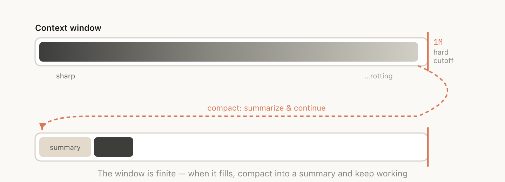
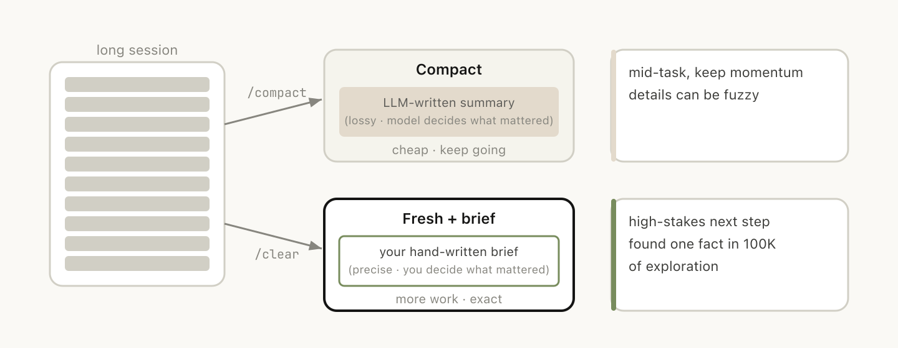

# Using Claude Code：会话管理与 1M 上下文（中英对照）

> **原文标题：** Using Claude Code: session management and 1M context
> **作者：** Thariq Shihipar（Anthropic 技术团队成员，从事 Claude Code 开发）
> **原文链接：** https://claude.com/blog/using-claude-code-session-management-and-1m-context
> **发布日期：** 2026-04-15
> **翻译模型：** GLM-5.3
> 排版：每段英文原文在前，中文翻译紧随其后。术语保留英文原文并附中文释义。

---

Learn how to manage context in Claude Code-when to continue, rewind, compact, or clear a session, and how subagents keep parent context clean.

学习在 Claude Code 中管理上下文：何时继续、回退、压缩或清空会话，以及 subagents 如何保持父上下文干净。

How you manage sessions, context, and compaction in Claude Code shapes your results more than you might expect. Here's a practical guide to making the right call at every turn.

在 Claude Code 中，你如何管理会话、上下文与压缩（compaction），对结果的影响远超你的想象。这里有一份实用指南，帮你在每个节点做出正确选择。

We released /usage, a new slash command to help you understand your usage with Claude Code. This feature was informed by a number of conversations with customers.

我们发布了 /usage，一个新的斜杠命令（slash command），帮助你了解自己在 Claude Code 中的使用情况。这个功能的诞生源于与客户的多轮交流。

What came up again and again in these calls is that there is a lot of variance in how users manage their sessions, especially with our new update to 1 million context in Claude Code.

这些沟通中反复出现的一个话题是：用户管理会话的方式差异很大，尤其是在我们为 Claude Code 更新到 1M 上下文之后。

Do you only use one session or two sessions that you keep open in a terminal? Do you start a new session with every prompt? When do you use compact, rewind or subagents? What causes a bad compact or bad session?

你是只在终端里常开一两个会话？还是每条提示都新开一个会话？你什么时候用 compact、rewind 或 subagents？是什么导致了一次糟糕的 compact 或糟糕的会话？

There's a surprising amount of detail here that can really shape your experience with Claude Code and almost all of it comes from managing your context window.

这里面的细节多得惊人，而它们实实在在地塑造着你使用 Claude Code 的体验，且几乎全部来自对上下文窗口的管理。

# 上下文、压缩与上下文腐坏入门（A quick primer on context, compaction and context rot）

The context window is everything the model can "see" at once when generating its next response. It includes your system prompt, the conversation so far, every tool call and its output, and every file that's been read. Claude Code has a context window of one million tokens.

上下文窗口（context window）是模型生成下一条回复时能一次性“看到”的全部内容。它包括你的 system prompt、到目前为止的对话、每一次工具调用及其输出，以及读过的每一个文件。Claude Code 拥有一百万 token 的上下文窗口。

Unfortunately, using context has a slight impact on performance, which is often called context rot. Context rot is the observation that model performance degrades as context grows because attention gets spread across more tokens, and older, irrelevant content starts to distract from the current task.

遗憾的是，使用上下文会轻微影响性能，这通常被称为上下文腐坏（context rot）。上下文腐坏指的是：随着上下文增长，模型性能会退化，因为注意力被摊薄到更多 token 上，而较旧的无关内容开始干扰当前任务。

Context windows are a hard cutoff, so when you're nearing the end of the context window, the task you've been working on is automatically summarized into a smaller description and the model continues the work in a new context window. We call this compaction. You can also trigger compaction yourself.

上下文窗口是硬性上限，因此当你接近窗口末端时，你一直在做的任务会被自动总结成一段更短的描述，模型再在新的上下文窗口中继续工作。我们称之为压缩（compaction）。你也可以自行触发压缩。

# 把每一轮对话当作分叉点（Every turn as a branching point）

Say you've just asked Claude to do something and it's finished-you've now got some information in context (tool calls, tool outputs, your instructions) and you have a surprising number of options for what to do next:

假设你刚让 Claude 做完一件事--此时上下文里已经有了一些信息（工具调用、工具输出、你的指令），而接下来怎么做，你可选择的选项多得惊人：

- Continue - send another message in the same session
- /rewind (esc esc) - jump back to a previous message and try again from there
- /clear - start a new session, usually with a brief you've distilled from what you just learned
- Compact - summarize the session so far and keep going on top of the summary
- Subagents - delegate the next chunk of work to an agent with its own clean context, and only pull its result back in

- Continue（继续）--在同一会话中发送下一条消息
- /rewind（连按两次 esc）--跳回之前某条消息，从那里重试
- /clear--开启新会话，通常附上你从刚学到的内容中提炼出的简报
- Compact（压缩）--总结当前会话，在摘要之上继续工作
- Subagents（子智能体）--把下一块工作委派给一个拥有干净上下文的智能体，只把结果收回来

While the most natural course is just to continue, the other four options exist to help manage your context.

虽然最自然的做法就是继续，但另外四个选项的存在是为了帮你管理上下文。

# 什么时候该开新会话（When to start a new session）

When do you keep a long running session vs starting a new one? Our general rule of thumb is when you start a new task, you should also start a new session.

什么时候保持长会话，什么时候开新的？我们的经验法则是：开始新任务时，也开一个新会话。

While 1M context windows mean that you can now do longer tasks more reliably, for example building a full-stack app from scratch, context rot may occur.

1M 上下文窗口意味着你现在可以更可靠地完成更长的任务，比如从零构建一个全栈应用，但上下文腐坏仍可能发生。

Sometimes you may do related tasks where some of the context is still necessary, but not always. For example, writing the documentation for a feature you just implemented. While you could start a new session, Claude would have to reread the files that you just implemented, which would be slower and more expensive.

有时你会做一些相关任务，其中部分上下文仍然必要，但并非总是如此。例如，为你刚实现的功能编写文档。虽然你可以新开会话，但 Claude 将不得不重新读取你刚实现过的那些文件，这会更慢也更贵。

# 与其纠正，不如回退（Rewinding instead of correcting）

In Claude Code, double-tapping Esc (or running /rewind) lets you jump back to any previous message and re-prompt from there. The messages after that point are dropped from the context.

在 Claude Code 中，连按两次 Esc（或运行 /rewind）可以跳回之前的任意一条消息，并从那里重新提示。该点之后的消息会从上下文中丢弃。

Rewind is often the better approach to correction. For example, Claude reads five files, tries an approach, and it doesn't work. Your instinct may be to type "that didn't work, try X instead." But the better move may be to rewind to just after the file reads, and re-prompt with what you learned. "Don't use approach A, the foo module doesn't expose that-go straight to B."

面对纠正，回退往往是更好的方式。比如，Claude 读了五个文件，尝试了一种方案，结果行不通。你的本能可能是输入“刚才不行，改试 X”。但更好的做法可能是回退到刚读完文件的时刻，带着你学到的东西重新提示：“别用方案 A，foo 模块没有暴露那个接口--直接上 B。”

You can also use "summarize from here" or the /rewind slash command to have Claude summarize its learnings and create a handoff message, kind of like a message to the previous iteration of Claude from its future self that tried something and it didn't work.

你还可以使用“从此处总结（summarize from here）”或 /rewind 斜杠命令，让 Claude 总结它的经验教训并生成一条交接（handoff）消息--有点像来自未来的 Claude 给上一轮 Claude 的留言：试了某条路，没走通。

# 压缩 vs. 另起全新会话（Compacting vs. launching a fresh session）

Once a session gets long, you have two ways to shed extraneous context: /compact or /clear (and start fresh). They feel similar but behave very differently.

会话一旦变长，你有两种甩掉无关上下文的办法：/compact 或 /clear（然后从头开始）。它们感觉相似，行为却大不相同。

Compact asks the model to summarize the conversation so far, then replaces the history with that summary. It's lossy, but you didn't have to write anything yourself and Claude might be more thorough in including important learnings or files. You can also steer it by passing instructions (/compact focus on the auth refactor, drop the test debugging).

Compact 让模型总结到目前为止的对话，然后用摘要替换历史。它是有损的，但你什么都不用自己写，而且 Claude 可能会更周全地把重要经验或文件囊括进来。你还可以通过传入指令来引导它（/compact 专注于认证重构，丢掉测试调试部分）。

With /clear you write down what matters ("we're refactoring the auth middleware, the constraint is X, the files that matter are A and B, we've ruled out approach Y") and start clean. It's more work, but the resulting context is what you decided was relevant.

用 /clear 时，你亲手写下要紧的东西（“我们在重构认证中间件，约束是 X，要紧的文件是 A 和 B，方案 Y 已排除”），然后干净起步。工作量更大，但留下的上下文正是你判定相关的内容。

# 是什么导致了一次糟糕的自动压缩？（What causes a bad autocompact?）

If you run a lot of long-running sessions, you might have noticed times in which compacting might be particularly bad. In this case we've often found that bad compacts can happen when the model can't predict the direction your work is going.

如果你经常跑长会话，可能注意到有些时候压缩效果特别差。我们常常发现，糟糕的压缩往往发生在模型无法预测你工作走向的时候。

In the example above, autocompact fires after a long debugging session and summarizes the investigation and your next message is "now fix that other warning we saw in bar.ts."

在上面的例子里，自动压缩（autocompact）在一段漫长的调试会话后触发，总结了这次排查，而你的下一条消息是“现在修一下我们刚才在 bar.ts 里看到的另一个警告”。

But because the session was focused on debugging, the other warning might have been dropped from the summary.

但由于整个会话都聚焦于调试，那个另外的警告可能已被摘要丢掉了。

This is particularly difficult, because due to context rot, the model is at its least intelligent point when compacting. With one million context, you have more time to /compact proactively with a description of what you want to do.

这一点尤其棘手，因为受上下文腐坏影响，模型在压缩时正处于智能的最低点。拥有一百万上下文后，你就有更充裕的时间，带着对接下来要做之事的描述，主动执行 /compact。

# Subagents 与全新上下文窗口（Subagents and fresh context windows）

Subagents tend to work well when you know in advance that a chunk of work will produce a lot of intermediate output you won't need again.

当你预先知道某块工作会产生大量之后不再需要的中间输出时，subagents 往往很好用。

When Claude spawns a subagent via the Agent tool, that subagent gets its own fresh context window. It can do as much work as it needs to, and then synthesize its results so only the final report comes back to the parent.

当 Claude 通过 Agent 工具派生 subagent 时，该 subagent 会得到一个属于自己的全新上下文窗口。它想做多少工作都可以，然后综合自己的结果，只把最终报告交回父会话。

The mental test we use at Anthropic: will I need this tool output again, or just the conclusion?

我们在 Anthropic 用的心智检验：这个工具输出我之后还需要，还是只需要结论？

While Claude Code will automatically call subagents, you may want to tell it to explicitly do this. For example, you may want to tell it to:

虽然 Claude Code 会自动调用 subagents，但你也可以明确指示它这么做。例如，你可以让它：

- "Spin up a subagent to verify the result of this work based on the following spec file"
- "Spin off a subagent to read through this other codebase and summarize how it implemented the auth flow, then implement it yourself in the same way"
- "Spin off a subagent to write the docs on this feature based on my git changes"

- “拉起一个 subagent，根据以下规格文件验证这项工作的结果”
- “分出一个 subagent 通读另一个代码库，总结它是如何实现认证流程的，然后你按同样的方式自行实现”
- “分出一个 subagent，根据我的 git 改动编写这个功能的文档”

Putting it together

把这一切串起来

To help you choose which context management feature to use, we put together this helpful table that outlines common situations, what tool to reach for, and why.

为了帮你选择该用哪项上下文管理功能，我们整理了下面这张实用表格，列出常见情形、该用什么工具，以及原因。

| Situation | Consider reaching for | Why |
| --- | --- | --- |
| Same task, context is still relevant | Continue | Everything in the window is still load-bearing; don't pay to rebuild it. |
| Claude went down a wrong path | Rewind (double-Esc) | Keep the useful file reads, drop the failed attempt, re-prompt with what you learned. |
| Mid-task but the session is bloated with stale debugging/exploration | /compact \<hint\> | Low effort; Claude decides what mattered. Steer it with instructions if needed. |
| Starting a genuinely new task | /clear | Zero rot; you control exactly what carries forward. |
| Next step will generate lots of output you'll only need the conclusion from (codebase search, verification, doc writing) | Subagent | Intermediate tool noise stays in the child's context; only the result comes back. |

| 情形 | 可以考虑使用 | 原因 |
| --- | --- | --- |
| 同一任务，上下文仍然相关 | Continue（继续） | 窗口里的所有内容仍在发挥作用；不必花钱重建。 |
| Claude 走错了路 | Rewind（回退，连按两次 Esc） | 保留有用的文件读取，丢弃失败的尝试，带着所学重新提示。 |
| 任务进行中，但会话被过期的调试/探索撑大 | /compact \<提示\> | 省力；由 Claude 决定什么要紧。需要时可用指令引导。 |
| 开始一个真正的新任务 | /clear | 零腐坏；什么内容被带入下一轮完全由你掌控。 |
| 下一步会产生大量你只需要其结论的输出（代码库搜索、验证、写文档） | Subagent | 中间工具噪音留在子智能体的上下文里；只有结果会回来。 |

We look forward to seeing what you build.

我们期待看到你构建出的东西。

Get started with Claude Code today.

今天就开始使用 Claude Code。

About the author: Thariq Shihipar is a member of technical staff at Anthropic, working on Claude Code.

关于作者：Thariq Shihipar 是 Anthropic 的技术团队成员，从事 Claude Code 开发。
