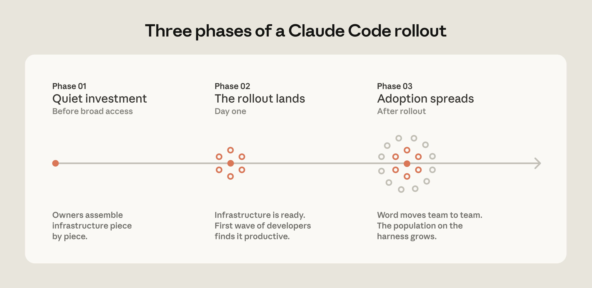

# Claude Code 在大型代码库中如何运作：最佳实践与入手指南（中英对照）

> **原文标题：** How Claude Code works in large codebases: Best practices and where to start
> **作者：** Anthropic（原文未署名）
> **原文链接：** https://claude.com/blog/how-claude-code-works-in-large-codebases-best-practices-and-where-to-start
> **发布日期：** 2026-05-14
> **翻译模型：** GLM-5.3
> 排版：每段英文原文在前，中文翻译紧随其后。术语保留英文原文并附中文释义。

---

The most successful Claude Code deployments share a set of recognizable patterns across configurations, tooling, and org structure. This article is part of Claude Code at scale, a new series covering best practices for engineering organizations building with Claude Code at enterprise scale.

最成功的 Claude Code 部署在配置、工具链和组织结构上呈现出一组可辨识的模式。本文是 Claude Code at scale（Claude Code 规模化实践）系列的一部分--该新系列面向以企业级规模使用 Claude Code 构建的工程组织，介绍最佳实践。

Claude Code is running in production across multi-million-line monorepos, decades-old legacy systems, distributed architectures spanning dozens of repositories, and at organizations with thousands of developers. These environments present challenges that smaller, simpler codebases don't, whether that's build commands that differ across every subdirectory or legacy code spread across folders with no shared root.

Claude Code 已经在生产环境中运行于数百万行的 monorepo（单体仓库）、有几十年历史的遗留系统、横跨数十个仓库的分布式架构，以及拥有数千名开发者的组织。这些环境带来了更小、更简单的代码库所没有的挑战--无论是每个子目录都不同的构建命令，还是散落在没有共同根目录的多个文件夹中的遗留代码。

This article covers the patterns we've observed that have led to successful adoption of Claude Code at scale. We use "large codebase" to refer to a wide range of deployments: monorepos with millions of lines, legacy systems built over decades, dozens of microservices across separate repositories, or any combination of the above. That also includes codebases running on languages that teams don't always associate with AI coding tools, such as C, C++, C#, Java, PHP. (Claude Code performs better than most teams expect it to in those cases, particularly as of recent model releases.) While every large codebase deployment is shaped by its specific version control, team structure, and accumulated conventions, the patterns here generalize across them and are a good starting point for teams considering adopting Claude Code.

本文介绍我们观察到的、促成 Claude Code 大规模成功落地的模式。我们所说的"大型代码库"涵盖多种部署形态：数百万行的 monorepo、数十年积累而成的遗留系统、分布在数十个独立仓库中的微服务，或以上任意组合。其中也包括使用团队通常不会与 AI 编码工具联系起来的语言的代码库，例如 C、C++、C#、Java、PHP。（在这些场景下，Claude Code 的表现比大多数团队的预期更好，尤其是近期的模型版本。）尽管每个大型代码库的部署都受其特定的版本控制、团队结构和长期积累的约定影响，本文的模式具有普遍适用性，对考虑采用 Claude Code 的团队是很好的起点。

# Claude Code 如何浏览大型代码库（How Claude Code navigates large codebases）

Claude Code navigates a codebase the way a software engineer would: it traverses the file system, reads files, uses grep to find exactly what it needs, and follows references across the codebase. It operates locally on the developer's machine and doesn't require a codebase index to be built, maintained, or uploaded to a server.

Claude Code 浏览代码库的方式与软件工程师一样：遍历文件系统、读取文件、用 grep 精确查找所需内容，并顺着代码库中的引用追踪下去。它在开发者本地机器上运行，不需要构建、维护代码库索引，也不需要把索引上传到服务器。

RAG-powered AI coding tools work by embedding the entire codebase and retrieving relevant chunks at query time. At large scale, those systems can fail because embedding pipelines can't keep up with active engineering teams. By the time a developer queries the index, it reflects the codebase as it previously existed weeks, days, or even hours before. Retrieval then returns a function the team renamed two weeks ago, or references a module that was deleted in the last sprint, with no indication that either is out of date.

基于 RAG（检索增强生成）的 AI 编码工具的做法是：对整个代码库做嵌入（embedding），查询时检索相关片段。在大规模场景下，这类系统可能失效，因为嵌入流水线跟不上活跃工程团队的节奏。等到开发者查询索引时，索引反映的是几周、几天甚至几小时前的代码库。检索于是返回团队两周前就已改名的函数，或引用上一个迭代（sprint）中已被删除的模块，且丝毫不提示它们已经过时。

Agentic search avoids those failure modes. There's no embedding pipeline or centralized index to maintain as thousands of engineers commit new code. Each developer's instance works from the live codebase.

Agentic 搜索（智能体式搜索）避开了这些失效模式。当成千上万名工程师提交新代码时，不存在需要维护的嵌入流水线或集中式索引。每位开发者的实例都直接基于实时代码库工作。

But the approach has a tradeoff: it works best when Claude has enough starting context to know where to look. This means the quality of Claude's navigation is shaped by how well the codebase is set up, layering context with CLAUDE.md files and skills. If you ask it to find all instances of a vague pattern across a billion-line codebase, you'll hit context-window limits before the work begins. Teams that invest in codebase setup see better results.

但这种方式有权衡：当 Claude 拥有足够的起始上下文、知道去哪里找时，效果最好。这意味着 Claude 导航的质量取决于代码库的配置有多好--用 CLAUDE.md 文件和 skills（技能）分层组织上下文。如果你让它在一个十亿行的代码库中查找某个模糊模式的所有实例，工作还没开始就会撞上上下文窗口（context window）上限。在代码库配置上投入的团队会看到更好的效果。

# harness 与模型同样重要（The harness matters as much as the model）

One of the most common misconceptions about Claude Code is that its capabilities are solely defined by the model used. Teams focus on a model's benchmarks and how it performs on test tasks. In practice, the ecosystem built around the model-the harness-determines how Claude Code performs more than the model alone.

关于 Claude Code 最常见的误解之一，是认为它的能力完全由所用的模型决定。团队往往只关注模型的基准测试（benchmark）及其在测试任务上的表现。实践中，围绕模型构建的生态系统--即 harness（承载模型的工具框架）--对 Claude Code 表现的影响超过了模型本身。

The harness is built from five extension points-CLAUDE.md files, hooks, skills, plugins, and MCP servers-each serving a different function. The order in which teams build them matters, as each layer builds on what came before. Two additional capabilities, LSP integrations and subagents, round out the setup. Below, we explain what each of these components and capabilities do:

Harness 由五个扩展点构成--CLAUDE.md 文件、hooks、skills、plugins（插件）和 MCP 服务器--各自承担不同职能。团队构建它们的顺序很重要，因为每一层都建立在上一层之上。另有两种能力--LSP 集成和 subagent（子代理）--让整套配置更加完整。下面我们逐一说明这些组件与能力的作用：

CLAUDE.md files come first. These are context files that Claude reads automatically at the start of every session: root file for the big picture, subdirectory files for local conventions. They give Claude the codebase knowledge it needs to do anything well. Because they load in every session regardless of the task, keeping them focused on what applies broadly will prevent them from becoming a drag on performance.

CLAUDE.md 文件排在首位。这是 Claude 在每个会话开始时自动读取的上下文文件：根目录文件负责全局图景，子目录文件负责局部约定。它们为 Claude 提供把任何事情做好的代码库知识。由于无论任务是什么，它们都会在每个会话中加载，让其内容聚焦于广泛适用的信息，才能避免拖累性能。

Hooks make the setup self-improving. Most teams think of hooks as scripts that prevent Claude from doing something wrong, but their more valuable use is continuous improvement. A stop hook can reflect on what happened during a session and propose CLAUDE.md updates while the context is fresh. A start hook can load team-specific context dynamically so every developer gets the right setup for their module without manual configuration. For automated checks like linting and formatting, hooks enforce the rules deterministically and produce more consistent results than relying on Claude to remember an instruction.

Hooks 让整套配置具备自我改进能力。多数团队把 hooks 当作防止 Claude 犯错的脚本，但它们更有价值的用途是持续改进。Stop hook 可以趁上下文还新鲜时回顾会话中发生了什么，并提议更新 CLAUDE.md；SessionStart hook 可以动态加载团队特定的上下文，让每位开发者无需手动配置就能获得适合其模块的配置。对于 lint 和格式化这类自动化检查，hooks 以确定性方式执行规则，比指望 Claude 记住某条指令产生更一致的结果。

Skills keep the right expertise available on-demand without bloating every session. In a large codebase with dozens of task types, not all expertise needs to be present in every session. Skills solve this through progressive disclosure, offloading specialized workflows and domain knowledge that would otherwise compete for context space and loading them only when the task calls for it. For example, a security review skill loads when Claude is assessing code for vulnerabilities, while a document processing skill loads when a code change is made and documentation needs to be updated.

Skills 让合适的专业知识按需可用，而不会撑大每个会话。在拥有数十种任务类型的大型代码库中，并非所有专业知识都需要出现在每个会话里。Skills 通过渐进式披露（progressive disclosure）解决这一问题：把原本会争夺上下文空间的专业工作流和领域知识卸载出去，只在任务需要时才加载。例如，安全审查 skill 会在 Claude 评估代码漏洞时加载，而文档处理 skill 会在代码发生变更、文档需要更新时加载。

Skills can also be scoped to specific paths so they only activate in the relevant part of the codebase. A team that owns a payments service can bind their deployment skill to that directory, so it never auto-loads when someone is working elsewhere in the monorepo.

Skills 还可以限定在特定路径，只在代码库的相关部分激活。负责支付服务的团队可以把他们的部署 skill 绑定到该目录，这样当有人在 monorepo 的其他地方工作时，它绝不会自动加载。

Plugins distribute what works. One challenge with large codebases is that good setups can stay tribal. A plugin bundles skills, hooks, and MCP configurations into a single installable package, so when a new engineer installs that plugin on day one, they will immediately have the same context and capabilities as those who have been using Claude already. Plugin updates can be distributed across the organization through managed marketplaces.

Plugins 负责分发行之有效的配置。大型代码库的一个挑战是，好的配置可能只留在少数人的经验里（tribal knowledge，部落知识）。plugin 把 skills、hooks 和 MCP 配置打包成单一可安装的包，新工程师入职第一天装上它，就立刻拥有与老用户相同的上下文和能力。plugin 更新可以通过受管理的市场（marketplace）在全组织内分发。

For example, a large retail organization we work with built a skill connecting Claude to their internal analytics platform so that business analysts could pull performance data without leaving their workflow. They distributed it as a plugin before the broad rollout to the business.

例如，与我们合作的一家大型零售企业构建了一个 skill，把 Claude 接入其内部分析平台，让业务分析师无需离开工作流即可拉取绩效数据。在向业务部门大规模推广之前，他们先把它打包成 plugin 分发。

Language server protocol (LSP) integrations give Claude the same navigation a developer has in their IDE. Most large-codebase IDEs already have an LSP running, powering "go to definition" and "find all references." Surfacing this to Claude gives it symbol-level precision: it can follow a function call to its definition, trace references across files, and distinguish between identically named functions in different languages. Without it, Claude pattern-matches on text and can land on the wrong symbol. One enterprise software company we worked with deployed LSP integrations org-wide before their Claude Code rollout, specifically to make C and C++ navigation reliable at scale. For multi-language codebases, this is one of the highest-value investments.

语言服务器协议（Language Server Protocol，LSP）集成让 Claude 拥有与开发者在 IDE 中相同的导航能力。大多数大型代码库的 IDE 已经在运行 LSP，支撑着"转到定义"（go to definition）和"查找所有引用"（find all references）。把这些能力暴露给 Claude，就赋予了它符号级（symbol-level）精度：它可以顺着函数调用找到定义、跨文件追踪引用，并区分不同语言中同名的函数。没有它，Claude 只能对文本做模式匹配，可能会找错符号。与我们合作的一家企业软件公司在推行 Claude Code 之前，先在全组织部署了 LSP 集成，正是为了让 C 和 C++ 的导航在大规模下可靠。对多语言代码库来说，这是回报最高的投入之一。

MCP servers extend everything. MCP servers are how Claude connects to internal tools, data sources, and APIs that it can't otherwise reach. The most sophisticated teams built MCP servers exposing structured search as a tool Claude can call directly. Others connect Claude to internal documentation, ticketing systems, or analytics platforms.

MCP 服务器把一切进一步延伸。MCP 服务器是 Claude 连接内部工具、数据源和 API 的方式--这些原本它无法触及。最成熟的团队构建了把结构化搜索暴露为工具的 MCP 服务器，供 Claude 直接调用。另一些团队则把 Claude 接入内部文档、工单系统或分析平台。

Subagents split exploration from editing. A subagent is an isolated Claude instance with its own context window that takes a task, does the work, and returns only the final result to the parent. Once the harness is in place, some teams spin up a read-only subagent to map a subsystem and write findings to a file, then have the main agent edit with the full picture.

Subagents 把探索与编辑分开。subagent 是一个拥有独立上下文窗口的隔离 Claude 实例：接收任务、完成工作，只把最终结果返回给父级。harness 就位之后，一些团队会启动一个只读 subagent 去摸清某个子系统并把发现写入文件，然后让主 agent 带着完整图景进行编辑。

> Claude Code's extension layer at a glance.

> Claude Code 扩展层一览。

The table below summarizes what each component does, when it loads, and the most common mistakes we see with each:

下表总结了各组件的用途、加载时机，以及我们在每个组件上最常见的误区：

| Component | What it is | When it loads | Best for | Common confusion |
| --- | --- | --- | --- | --- |
| CLAUDE.md | Context file Claude reads automatically | Every session | Project-specific conventions, codebase knowledge | Using it for reusable expertise that belongs in a skill |
| Hooks | Scripts that run at key moments | Triggered by events | Automating consistent behavior, capturing session learnings | Using prompts for things that should run automatically |
| Skills | Packaged instructions for specific task types | On demand, when relevant | Reusable expertise across sessions and projects | Loading everything into CLAUDE.md instead |
| Plugins | Bundled skills, hooks, MCP configs | Always available once configured | Distributing a working setup across the org | Letting good setups stay tribal |
| Language server protocol (LSP)* | Real-time code intelligence via language specific servers | Always available once configured | Symbol-level navigation and automatic error detection in typed languages | Assuming that it's automatic |
| MCP servers | Connections to external tools and data | Always available once configured | Giving Claude access to internal tools it can't otherwise reach | Building MCP connections before the basics are working |
| Subagents* | Separate Claude instances for specific tasks | When invoked | Splitting exploration from editing, parallel work | Running exploration and editing in the same session |

| 组件 | 是什么 | 何时加载 | 最适合 | 常见误区 |
| --- | --- | --- | --- | --- |
| CLAUDE.md | Claude 自动读取的上下文文件 | 每个会话 | 项目特定约定、代码库知识 | 把本应放进 skill 的可复用专业知识塞进来 |
| Hooks | 在关键时刻运行的脚本 | 由事件触发 | 自动化一致行为、沉淀会话经验 | 用提示词去做本应自动执行的事情 |
| Skills | 面向特定任务类型的打包指令 | 按需、相关时 | 跨会话、跨项目的可复用专业知识 | 把所有内容都塞进 CLAUDE.md |
| Plugins | 打包的 skills、hooks、MCP 配置 | 配置后始终可用 | 在全组织分发行之有效的配置 | 任由好的配置留在个别人的经验里 |
| Language server protocol (LSP)* | 通过语言专属服务器提供实时代码智能 | 配置后始终可用 | 符号级导航及类型语言中的自动错误检测 | 想当然地认为它会自动生效 |
| MCP servers | 连接外部工具与数据 | 配置后始终可用 | 让 Claude 访问原本无法触及的内部工具 | 在基础还没跑通之前就先建 MCP 连接 |
| Subagents* | 承担特定任务的独立 Claude 实例 | 被调用时 | 把探索与编辑分离、并行工作 | 在同一会话里既做探索又做编辑 |

*LSP is accessed through the plugin layer. Subagents are a delegation capability rather than a configured extension point.

*LSP 通过 plugin 层接入。subagent 是一种委托能力，而非配置型扩展点。

# 来自成功部署的三种配置模式（Three configuration patterns from successful deployments）

How you configure Claude Code for a large codebase depends heavily on how that codebase is structured. Still, three patterns appeared consistently across the deployments we observed.

如何为大型代码库配置 Claude Code，很大程度上取决于代码库的结构。尽管如此，在我们观察过的部署中，有三种模式反复出现。

## 让代码库在大规模下可浏览（Making the codebase navigable at scale）

Claude's ability to help in a large codebase is bounded by its ability to find the right context. Too much context loaded into every session degrades performance, while too little context leaves Claude to navigate blind. The most effective deployments invest upfront in making the codebase legible to Claude. A few patterns appear consistently:

Claude 在大型代码库中提供帮助的能力，受限于它找到正确上下文的能力。每个会话加载过多上下文会拖累性能，而上下文太少则让 Claude 盲目导航。最有效的部署会预先投入，让代码库对 Claude 清晰易读。以下几种模式反复出现：

- Keeping CLAUDE.md files lean and layered. Claude loads them additively as it moves through the codebase: root file for the big picture, subdirectory files for local conventions. The root file should be pointers and critical gotchas only; everything else drifts into noise.
- Initializing in subdirectories, not at the repo root. Claude works best when it's scoped to the part of the codebase that's actually relevant to the task. In monorepos, this can feel counterintuitive because tooling often assumes root access, but Claude automatically walks up the directory tree and loads every CLAUDE.md file it finds along the way, so root-level context is never lost.
- Scoping test and lint commands per subdirectory. Running the full suite when Claude changed one service causes timeouts and wastes context on irrelevant output. CLAUDE.md files at the subdirectory level should specify the commands that apply to that part of the codebase. This works well for service-oriented codebases where each directory has its own test and build commands. In compiled-language monorepos with deep cross-directory dependencies, per-subdirectory scoping is harder to achieve and may require project-specific build configurations.
- Using .ignore files to exclude generated files, build artifacts, and third-party code. Committing permissions.deny rules in .claude/settings.json means the exclusions are version-controlled, so every developer on the team gets the same noise reduction without configuring it themselves. In some codebases, generated files are themselves the subject of development work. Developers who work on code generators can override project-level exclusions in their local settings without affecting the rest of the team.
- Building codebase maps when the directory structure doesn't do the work. For organizations where code isn't consolidated in a conventional directory structure, a lightweight markdown file at the repo root listing each top-level folder with a one-line description of what lives there gives Claude a table of contents it can scan before opening files. For codebases with hundreds of top-level folders, this works best as a layered approach: the root file describes only the highest-level structure, and subdirectory CLAUDE.md files provide the next level of detail, loading on demand as Claude moves through the tree. For simpler cases, @-mentioning the specific files or directories Claude should reference can do the same job.
- Running LSP servers so Claude searches by symbol, not by string. Grep for a common function name in a large codebase returns thousands of matches and Claude burns context opening files to figure out which matters. LSP returns only the references that point to the same symbol, so the filtering happens before Claude reads anything. Setting this up requires installing a code intelligence plugin for your language and the corresponding language server binary; the Claude Code documentation covers the available plugins and troubleshooting.

- 保持 CLAUDE.md 文件精简且分层。Claude 在代码库中移动时会叠加加载它们：根目录文件负责全局图景，子目录文件负责局部约定。根文件应只包含指引和关键陷阱（gotcha）；其余内容都会沦为噪声。
- 在子目录而非仓库根目录初始化。当 Claude 的作用域限定在与任务真正相关的代码库部分时，效果最好。在 monorepo 中，这可能有违直觉，因为工具链通常假设从根目录访问，但 Claude 会自动沿目录树向上遍历，加载沿途发现的每一个 CLAUDE.md 文件，因此根级上下文不会丢失。
- 按子目录分别指定测试和 lint 命令。Claude 只改了一个服务却运行完整测试套件，会导致超时，并把上下文浪费在不相关的输出上。子目录级别的 CLAUDE.md 文件应当写明适用于该部分代码库的命令。这种做法很适合每个目录各有测试和构建命令的服务型代码库。在跨目录依赖很深的编译型语言 monorepo 中，按子目录划定作用域更难实现，可能需要项目特定的构建配置。
- 使用 .ignore 文件排除生成文件、构建产物和第三方代码。把 permissions.deny 规则提交到 .claude/settings.json 意味着这些排除项纳入了版本控制，团队每位开发者无需自行配置即可获得同样的降噪效果。在某些代码库中，生成文件本身就是开发对象。开发代码生成器的开发者可以在本地设置中覆盖项目级排除项，而不影响团队其他人。
- 在目录结构本身不足以说明问题时，构建代码库地图。对于代码未按常规目录结构集中管理的组织，可在仓库根目录放一个轻量 markdown 文件，列出每个顶层文件夹并用一行描述其中内容，这就给 Claude 提供了一份目录（table of contents），可在打开文件之前先扫读。对于有数百个顶层文件夹的代码库，分层做法效果最好：根文件只描述最高层结构，子目录 CLAUDE.md 文件提供下一层细节，随 Claude 在目录树中移动按需加载。更简单的场景下，@ 提及（@-mention）Claude 应引用的具体文件或目录即可达到同样效果。
- 运行 LSP 服务器，让 Claude 按符号而非字符串搜索。在大型代码库中对一个常见函数名做 grep 会返回成千上万条匹配，Claude 要打开一个个文件、烧掉大量上下文才能判断哪条重要。LSP 只返回指向同一符号的引用，筛选发生在 Claude 读取任何内容之前。搭建它需要为你的语言安装代码智能 plugin 及对应的语言服务器二进制文件；Claude Code 文档介绍了可用的 plugin 和故障排查方法。

One caveat: there are edge cases where even the hierarchical CLAUDE.md approach breaks down, for example codebases with hundreds of thousands of folders and millions of files, or legacy systems on non-git version control. We will address their challenges in future installments of this series. For legacy estates see how AI is breaking the cost barrier to COBOL modernization.

需要注意：确实存在一些边界情况，连分层 CLAUDE.md 方案也会失效，例如拥有数十万个文件夹、数百万个文件的代码库，或使用非 Git 版本控制的遗留系统。我们将在本系列后续文章中讨论这些挑战。关于遗留系统，可参阅 AI 如何打破 COBOL 现代化的成本壁垒一文。

## 随模型智能演进，主动维护 CLAUDE.md 文件（Actively maintaining CLAUDE.md files as model intelligence evolves）

As models evolve, instructions written for your current model can work against a future one. CLAUDE.md files that guided Claude through patterns it used to struggle with may either become unnecessary or actively constraining when the next model ships. For example, a CLAUDE.md rule that tells Claude to break every refactor into single-file changes may have helped an earlier model stay on track but would prevent a newer one from making coordinated cross-file edits it handles well.

随着模型演进，为当前模型写的指令可能会掣肘未来的模型。那些曾经引导 Claude 走出挣扎期的 CLAUDE.md 文件，在下一代模型发布后可能变得多余，甚至成为束缚。例如，一条要求 Claude 把每次重构都拆成单文件变更的 CLAUDE.md 规则，或许曾帮助早期模型保持正轨，却会阻止新模型进行它早已驾轻就熟的跨文件协同编辑。

Skills and hooks built to compensate for specific model limitations, whether in the model's reasoning or in Claude Code's own tooling, become overhead once those limitations no longer exist. A hook that intercepted file writes to enforce p4 edit in a Perforce codebase, for example, became redundant once Claude Code added native Perforce mode.

为弥补特定模型局限而构建的 skills 和 hooks--无论是模型推理层面的，还是 Claude Code 自身工具层面的--一旦这些局限不复存在，就会变成负担。例如，一个在 Perforce 代码库中拦截文件写入以强制执行 p4 edit 的 hook，在 Claude Code 原生支持 Perforce 模式后便失去了意义。

Teams should expect to do a meaningful configuration review every three to six months, but it's also worth doing one whenever performance feels like it's plateaued after major model releases.

团队应当预期每三到六个月做一次实质性的配置复盘；此外，每当重大模型版本发布后感觉性能停滞不前时，也值得做一次。

## 为 Claude Code 的管理与推广指定责任人（Assigning ownership for Claude Code management and adoption）

Technical configuration alone doesn't drive adoption. The organizations that got it right invested in the organizational layer, too.

单靠技术配置无法推动普及。做对了的组织同样在组织层面做了投入。

The rollouts that spread fastest had a dedicated infrastructure investment before broad access. A small team, sometimes even just one person, wired up the tooling so Claude already fit developer workflows when they first touched it. At one company, a couple of engineers built a suite of plugins and MCPs that were available on day one. At another, an entire team focused on managing AI coding tools had the infrastructure in place before the rollout began. In both cases, developers' first experience was productive rather than frustrating, and adoption spread from there.

推广最快的那些组织，都在放开大规模使用之前做了专门的基础设施投入。一个小团队--有时甚至只有一个人--把工具链搭好，开发者第一次接触 Claude 时，它已经融入了工作流。一家公司里，几位工程师构建了一整套 plugin 和 MCP，第一天就可用；另一家公司里，一个专门管理 AI 编码工具的团队在推广开始前就把基础设施准备就绪。在这两个案例中，开发者的初次体验是高效而非受挫，普及由此铺开。

The teams doing this work today tend to sit under developer experience or developer productivity, which is typically the function responsible for onboarding new engineers and building developer tooling. An emerging role in several organizations is an agent manager: a hybrid PM/engineer function dedicated to managing the Claude Code ecosystem. For organizations without a dedicated team, the minimum viable version is a DRI: one person with ownership over the Claude Code configuration, the authority to make calls on settings, permissions policy, the plugin marketplace, and CLAUDE.md conventions, and the responsibility to keep them current.

如今承担这项工作的团队通常隶属于开发者体验（developer experience）或开发者生产力（developer productivity）部门--后者通常也负责新工程师入职和开发者工具建设。在若干组织中兴起了一个新角色：agent manager（智能体经理），一个专门管理 Claude Code 生态的 PM/工程师混合职能。对于没有专职团队的组织，最小可行版本是设一名 DRI（directly responsible individual，直接责任人）：一个人拥有 Claude Code 配置的所有权，有权对设置、权限策略、plugin 市场和 CLAUDE.md 约定做决定，并负责让它们保持最新。

Bottoms-up adoption generates enthusiasm but can fragment without someone to centralize what works. You need to have an individual or a team assemble and evangelize the right Claude Code conventions (such as a standardized CLAUDE.md hierarchy or a curated set of skills and plugins). Without that work, knowledge will stay tribal and adoption will plateau.

自下而上的采用能激发热情，但若无人集中沉淀有效经验，就会走向碎片化。你需要让某个人或某个团队来整合并推广正确的 Claude Code 约定（例如标准化的 CLAUDE.md 层级结构，或一套精选的 skills 和 plugins）。缺了这项工作，知识会一直困在个别人手里，普及也会停滞不前。

In large organizations, especially those in regulated industries, governance questions come up early, such as: who controls which skills and plugins are available, how do you prevent thousands of engineers from independently rebuilding the same thing, how do you make sure AI-generated code goes through the same review process as human-generated code? To address these early on, we suggest starting with a defined set of approved skills, required code review processes, and limited initial access, and expand as confidence builds.

在大型组织--尤其是受监管行业的组织中，治理问题会很快浮现，例如：谁来控制哪些 skills 和 plugins 可用？如何防止数千名工程师各自重复造同一个轮子？如何确保 AI 生成的代码与人工编写的代码经过同样的评审流程？为了尽早应对这些问题，我们建议从一组明确的获批 skills、必需的代码评审流程和有限的初始访问权限入手，随着信心增强再逐步放开。

We've observed the smoothest deployments at organizations that establish cross-functional working groups early by bringing together engineering, information security, and governance representatives to define requirements together and build a rollout roadmap.

我们观察到，最顺利的部署来自那些早期就建立跨职能工作组的组织：把工程、信息安全和治理方面的代表聚在一起，共同定义需求并制定推广路线图。

# 把这些模式应用到你的组织（Applying these patterns to your organization）

Claude Code is designed around conventional software engineering environments where engineers are the primary codebase contributors, the repo uses Git, and code follows standard directory structures. Most large codebases fit this mold, but non-traditional setups such as game engines with large binary assets, environments with unconventional version control, or non-engineers contributing to the codebase require additional configuration work. Our guidance assumes a conventional setup and the patterns we've described have worked across many of our customers. Any remaining complexity requires judgment specific to your codebase, tooling, and organization. That's where Anthropic's Applied AI team works directly with engineering teams to translate these patterns into your organization's specific requirements.

Claude Code 围绕常规软件工程环境设计：工程师是代码库的主要贡献者、仓库使用 Git、代码遵循标准目录结构。大多数大型代码库符合这一形态，但非传统环境--例如包含大量二进制资源的游戏引擎、使用非传统版本控制的环境，或有非工程师参与贡献的代码库--需要额外的配置工作。我们的指南以常规环境为前提，所描述的模式已在众多客户处得到验证。其余的复杂性需要结合你的代码库、工具链和组织做具体判断。这也正是 Anthropic Applied AI 团队与工程团队直接合作之处，帮助把这些模式转化为你们组织的具体要求。

Get started with Claude Code for Enterprise.

开始使用 Claude Code for Enterprise。

Acknowledgements: Special thanks to Alon Krifcher, Charmaine Lee, Chris Concannon, Harsh Patel, Henrique Savelli, Jason Schwartz, Jonah Dueck and Kirby Kohlmorgen from Anthropic's Applied AI team for sharing their experience deploying Claude Code at scale, and to Amit Navindgi at Zoox for providing feedback on this article.

致谢：特别感谢 Anthropic Applied AI 团队的 Alon Krifcher、Charmaine Lee、Chris Concannon、Harsh Patel、Henrique Savelli、Jason Schwartz、Jonah Dueck 和 Kirby Kohlmorgen 分享他们大规模部署 Claude Code 的经验，并感谢 Zoox 的 Amit Navindgi 对本文的反馈。
