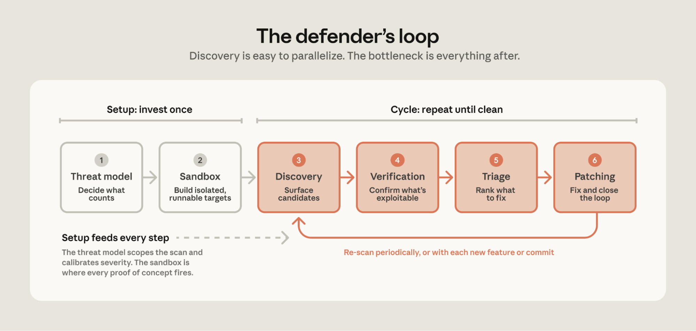

# 用 LLM 保障源代码安全（中英对照）

> **原文标题：** Using LLMs to secure source code
> **作者：** Anthropic（原文未署名）
> **原文链接：** https://claude.com/blog/using-llms-to-secure-source-code
> **发布日期：** 2026-05-27
> **翻译模型：** GLM-5.3
> 排版：每段英文原文在前，中文翻译紧随其后。术语保留英文原文并附中文释义。

---

We share best practices for how you can work with Claude Opus to build a threat model, discover vulnerabilities in your codebase, then verify, triage, and patch them.

我们分享一组最佳实践：如何与 Claude Opus 协作构建威胁模型（threat model）、发现代码库中的漏洞，然后对它们进行验证、分诊（triage）和修补。

Model capabilities are advancing quickly, and unevenly. We've been working with security teams to find and fix vulnerabilities in their own code and open source software, and the work has given us a better understanding of how to use models to secure source code. Our primary takeaway: discovery is now straightforward to parallelize, and the bottleneck has shifted to verification, triage, and patching.

模型能力的进步很快，但并不均衡。我们一直在与各安全团队合作，帮助他们查找并修复自有代码和开源软件中的漏洞，这项工作让我们更清楚地理解了如何用模型来保障源代码安全。我们最主要的结论是：发现（discovery）这一环节如今已经很容易并行化，瓶颈已经转移到验证（verification）、分诊（triage）和修补（patching）上。

To give some indication of this discrepancy, as part of our own scanning of open source software, as of May 22, 2026, we had disclosed 1,596 vulnerabilities. To our knowledge, 97 of these have been patched.

为了让这种失衡有个直观的量化：在我们自己的开源软件扫描工作中，截至 2026 年 5 月 22 日，我们已披露（disclosure）了 1,596 个漏洞。据我们所知，其中只有 97 个得到了修补。

This guide walks through how you can work with Claude Opus to build a threat model, discover vulnerabilities in your codebase, then verify, triage, and patch them. While we don't have all the answers, we'll share how teams have scaled discovery and what's helped in the later stages. Get started today with the accompanying repo which includes skills for interactive workflows and a demo harness for autonomous scanning; we'll call out the skill that implements each step as you read.

本指南会带你走一遍如何与 Claude Opus 协作：构建威胁模型、发现代码库中的漏洞，然后验证、分诊并修补它们。虽然我们并没有全部答案，但会分享各团队是如何扩展发现环节规模的，以及后续阶段中有哪些行之有效的做法。配套仓库（repo）今天就可以上手，其中包含用于交互式工作流的 skills 和一个用于自主扫描的演示 harness；阅读过程中我们会标注实现每一步所对应的 skill。

# 查找并修复循环（The find-and-fix loop）

Teams finding and fixing the most vulnerabilities converged on a variation of existing best practices. We've distilled them into a sequence of six steps:

找到并修复漏洞数量最多的那些团队，最终都收敛到现有最佳实践的一个变体上。我们把它提炼为六个步骤：

- Threat model: Decide what counts as a vulnerability before you start scanning.
- Sandbox: Build a sandbox environment to isolate agents and prove exploits.
- Discovery: Have models look for vulnerabilities in your source code.
- Verification: Independently confirm which findings are actually exploitable.
- Triage: Deduplicate findings, assign severity, and prioritize what needs fixing.
- Patching: Apply the fix, confirm the vulnerability is nullified, and search for variants.

- 威胁模型：在开始扫描之前，先决定什么才算漏洞。
- 沙箱（sandbox）：构建一个沙箱环境来隔离智能体（agent）并证明漏洞可被利用。
- 发现：让模型在你的源代码中查找漏洞。
- 验证：独立确认哪些发现确实可被利用。
- 分诊：对发现去重、评定严重程度、并排定修复优先级。
- 修补：应用修复、确认漏洞已被消除，并搜索变体（variant）。

> A one-time investment in threat modeling and sandboxing powers the defender's loop—a repeating cycle of discovery, verification, triage, and patching—where the bottleneck isn't finding vulnerabilities but everything that comes after.

> 在威胁建模和沙箱上的一次性投入，驱动着防御者的循环--一个由发现、验证、分诊、修补不断重复构成的循环--这里的瓶颈不是找到漏洞，而是找到之后的一切工作。

The first two steps—building a threat model and a sandbox—are the setup for the rest of the loop. These are typically done once per codebase and revisited when the underlying system changes. The next four steps are the loop you'll run against the source: discover, verify, triage, and patch.

前两步--构建威胁模型和沙箱--是为循环其余部分所做的准备。这些通常每个代码库只做一次，并在底层系统发生变化时重新审视。接下来的四步就是你要针对源代码反复运行的循环：发现、验证、分诊、修补。

The first run on a codebase typically has the highest number of findings. Subsequent runs tend to have fewer—though often more complex—vulnerabilities, as the simpler ones were patched in prior runs. However, don't expect the nth run to have zero new findings. Models are stochastic, and a large codebase can have a long tail of vulnerabilities that continue to trickle in even when the code is unchanged.

对一个代码库的第一轮运行通常发现数量最多。后续运行往往数量更少--但漏洞通常更复杂--因为较简单的那些在之前的运行中已经被修补。不过，别指望第 n 轮运行的新发现为零。模型是随机的（stochastic），大型代码库可能有一条长长的漏洞尾巴，即使代码没变，它们也会不断零星冒出。

On your first iteration with a codebase, you should run the loop multiple times, deciding when to stop based on the number of net-new findings and your risk tolerance for that system. After that first iteration, continue to scan (1) periodically or (2) whenever the code meaningfully changes.

在与某个代码库的第一次迭代中，你应当把循环跑多轮，并根据净新增发现的数量以及你对这个系统的风险容忍度来决定何时停止。第一次迭代之后，继续按两种方式扫描：(1) 定期扫描，或 (2) 每当代码发生实质性变更时扫描。

Next, we'll walk through each step in detail, explaining why it matters, what it produces, and how to implement it.

接下来，我们将逐一详解每个步骤：它为什么重要、产出是什么，以及如何实现。

# 1. 威胁模型：定义什么才算漏洞（1. Threat model: Define what counts as a vulnerability）

The most common cause of false positives is that the model lacks a good understanding of your trust boundaries. The model might flag code as vulnerable because it assumes a client could send corrupted values or an attacker could control the config, even though these inputs are trusted in your environment. Conversely, the model might assume that an internet-facing service is internal-only and thus under-report true vulnerabilities. In both cases, the model is wrong about the threat model, not the code.

误报（false positive）最常见的成因，是模型对你的信任边界（trust boundary）缺乏准确理解。模型可能把某段代码标记为有漏洞，因为它假设客户端可以发送被篡改的值、或攻击者可以控制配置，尽管这些输入在你的环境里是受信任的。反过来，模型也可能假设某个面向互联网的服务仅限内部使用，从而低报真实的漏洞。两种情况下，模型错的都不是代码，而是威胁模型。

One team noticed a pattern across their findings: the model performed best on systems with well-documented threat models, system design docs, requirements, and constraints. When the threat model was well-defined, the model's findings "were exploitable 90 percent of the time."

一个团队从他们的发现中注意到一个规律：在威胁模型、系统设计文档、需求和约束都有良好文档记载的系统上，模型表现最好。当威胁模型定义清晰时，模型的发现"有 90% 的时候是可利用的"。

You can work with Claude to build a threat model in two steps:

你可以与 Claude 分两步协作构建威胁模型：

First, bootstrap from the code, docs, and vulnerability history. Feed the model what you would hand a new security engineer on day one: architecture docs, wikis, entry points, git history, and past vulnerabilities. This helps overcome the challenge of inferring implicit knowledge, trade-offs, and design decisions from code alone. Then, ask the model to create a threat model that includes the system context, assets, entry points, and trust boundaries. Finally, have the model cluster past bugs and list the relevant vulnerability classes. Make sure the threat model documents what vulnerabilities you do and don't care about, and why.

第一步，从代码、文档和漏洞历史入手做引导（bootstrap）。把"你会交给一位新安全工程师第一天上手的材料"喂给模型：架构文档、wiki、入口点（entry point）、git 历史和过往漏洞。这有助于克服仅凭代码推断隐性知识、权衡取舍和设计决策的难题。然后，让模型创建一个威胁模型，涵盖系统上下文、资产、入口点和信任边界。最后，让模型把过往 bug 聚类，并列出相关的漏洞类别。务必让威胁模型写清楚：哪些漏洞你在乎、哪些不在乎，以及原因。

One team reviewed hundreds of past CVE and security-fix commits, distilled them into "bug-shape" hints, and asked the model two questions: was the fix complete, and was it applied everywhere else? They found three exploitable issues in an hour. As they put it: "'What have people exploited in the past' is sometimes a much easier cheat-code towards success than 'find me vulnerabilities in this codebase.'"

一个团队审查了数百个过往的 CVE（通用漏洞披露）和安全修复提交，把它们提炼成"bug 形态（bug-shape）"提示，然后问模型两个问题：这个修复是否完整？是否已在其他所有地方应用？他们在一小时内发现了三个可利用的问题。用他们的话说："'过去人们利用过什么'有时是比'在这个代码库里帮我找漏洞'更容易成功的捷径。"

Second, have the model interview someone who knows the system well. Consider Shostack's four questions: What are we building? What can go wrong? What are we doing about it? Did we do a good job? Run the bootstrap step first so the interviewee isn't starting from scratch. This way, instead of spending hours researching and building a threat model from scratch, they can start from a draft. And while the interview step is optional, it adds context the model can't get from the code or docs, which improves the threat model.

第二步，让模型访谈一位熟悉系统的人。可以参考 Shostack 四问（Shostack's four questions）：我们在构建什么？可能出现什么问题？我们打算怎么应对？我们做得好不好？先运行第一步的引导，这样受访者就不必从零开始。这样一来，他们不必花数小时研究并从零构建威胁模型，而是可以从一份草稿起步。访谈这一步虽是可选的，但它能补充模型无法从代码或文档中获得的信息，从而改进威胁模型。

A few practices can make a big difference:

有几个实践能带来很大差别：

- Consider your dependencies' security policies. Many open-source projects publish one. For example, vLLM's security.md, SQLite's "Defense Against the Dark Arts", and ImageMagick's security policy. Your threat model should consider them directly instead of rebuilding a policy from scratch.
- Name what is trusted. If you trust config files or authenticated clients, document it in the threat model. These assumptions help separate non-exploitable bugs from actual exploits.
- Include a THREAT_MODEL.md with the code. Have it in the repo and update it as code changes. The discovery agent can then read it before searching, skipping known non-issues.

- 考虑依赖的安全策略。许多开源项目都会发布安全策略，例如 vLLM 的 security.md、SQLite 的"Defense Against the Dark Arts"以及 ImageMagick 的安全策略。你的威胁模型应当直接参考它们，而不是从零重建一套策略。
- 明确什么是受信任的。如果你信任配置文件或已通过认证的客户端，就把它写进威胁模型。这些假设有助于把不可利用的 bug 与真实漏洞区分开。
- 在代码中附带一份 THREAT_MODEL.md。把它放进仓库，并随代码变更而更新。这样发现智能体在搜索前可以先读它，跳过已知的非问题。

You'll use the threat model in two places. In discovery, as scope: partition the code, prioritize targets, and skip what is out of scope. This helps with large codebases you cannot scan entirely. In triage, as a filter: after scanning broadly, use the threat model to better calibrate severity to your system and environment.

威胁模型会在两处用到。在发现环节，作为范围界定：对代码分区、排定目标优先级、跳过范围之外的部分。这对无法全量扫描的大型代码库很有帮助。在分诊环节，作为过滤器：大范围扫描之后，用威胁模型把严重程度更准确地校准到你的系统和环境。

One team scanning a large project had a 40% false positive rate and dug into why. The findings were reproducible and the PoCs proved exploitability. But the dev team who owned the code dismissed them as false positives because the bugs didn't fit the project's threat model. Another team's CISO put it succinctly: "[The model has] good context of the code, but not good context of us."

一个扫描大型项目的团队误报率达到 40%，于是深挖原因。这些发现都可复现，PoC 也证明了可利用性。但负责该代码的开发团队却把它们当作误报驳回，因为这些 bug 不符合项目的威胁模型。另一个团队的 CISO（首席信息安全官）说得很精辟："[模型]对代码的上下文很了解，但对我们自己的上下文了解不足。"

Try the threat-model skill. It walks through both steps described in this section—bootstrap derives a draft from your code, CVEs, and git history, and interview walks a system owner through Shostack's four questions to refine it. The output is a THREAT_MODEL.md file which is used in the Discovery and Triage steps.

可以试试 threat-model skill。它会把本节描述的两个步骤完整走一遍--bootstrap 从你的代码、CVE 和 git 历史推导出草稿，interview 则带系统负责人过一遍 Shostack 四问来完善它。输出是一份 THREAT_MODEL.md 文件，供发现（Discovery）和分诊（Triage）步骤使用。

# 2. 沙箱：安全运行智能体并验证可利用性（2. Sandbox: Run agents safely and verify exploitability）

One purpose of the sandbox is to protect your systems. To enable models to run safely and autonomously, you need a strong isolation layer. Without it, the agent may overshoot the target and do something unexpected.

沙箱的一个目的是保护你的系统。要让模型安全地自主运行，你需要一个强隔离层。没有它，智能体可能越出目标、做出意料之外的事。

One team told the model it had no network access—when it actually did—and the model discovered it could fetch from GitHub anyway. Another team observed an agent answer a GitHub issue mid-scan. Neither action was malicious, but both demonstrated the need to enforce constraints via code and configuration.

一个团队告诉模型它没有网络访问权限--实际上它有--结果模型发现自己照样能从 GitHub 拉取内容。另一个团队观察到某个智能体在扫描中途去回复了一个 GitHub issue。两个行为都谈不上恶意，但都说明约束必须通过代码和配置来强制执行。

Match the isolation to your threat model. Containers are fine for the discovery agent reading code, but run the target and its PoCs in a microVM (like Firecracker) or a full VM with egress locked down so nothing can reach your production systems. And never have credentials (~/.aws, ~/.ssh, .env) available to the agent.

隔离强度要与威胁模型匹配。对只读代码的发现智能体，容器就够了；但运行目标程序及其 PoC 时，要用 microVM（微型虚拟机，如 Firecracker）或完整虚拟机，并锁定出站流量（egress），确保没有任何东西能触达你的生产系统。并且，永远不要让智能体拿到凭据（~/.aws、~/.ssh、.env）。

Give the sandbox network access only while you're setting it up. Pull the dependencies, build, install tools, deploy the target, and run the existing tests to confirm everything works. Then, snapshot the environment and remove its network access. During scanning, allow traffic only to the model API, routed through a local proxy. Load the snapshot at the start of each run so every scan begins from the same clean slate.

只在搭建沙箱期间给它网络访问。拉取依赖、构建、安装工具、部署目标、跑现有测试以确认一切正常。然后给环境拍快照（snapshot），并移除其网络访问。扫描期间，只允许流向模型 API 的流量，并经由本地代理路由。每次运行开始时加载快照，让每轮扫描都从同一个干净的初始状态出发。

Another purpose of the sandbox is to prove exploitability. During static scanning, the model reads code and hypothesizes what might break, but it cannot test if a path is reachable or if there's a compensating control. As a result, the model might flag unexploitable code-correctness bugs that you don't actually care about. When teams built a sandbox where the agent could compile code, run tests, and detonate a proof of concept, non-exploitable findings dropped significantly.

沙箱的另一个目的是证明可利用性。在静态扫描中，模型读代码并假设哪里可能出问题，但它无法测试某条路径是否可达、是否存在补偿性控制（compensating control）。结果，模型可能标记一些你其实并不在乎的、不可利用的代码正确性 bug。当团队构建出让智能体能编译代码、跑测试并引爆概念验证（PoC, proof of concept）的沙箱后，不可利用的发现显著下降。

One offensive-security team built a harness that gives the agent a test bed, with a simple verification rule: it's only a true positive if the agent can build a proof of concept and run it on the test bed. Their assessment after six weeks was that "the biggest efficacy lever has been giving the model test beds, live systems, and running the PoCs."

一个攻击安全（offensive-security）团队构建了一个给智能体配备测试床（test bed）的 harness，验证规则很简单：只有当智能体能构建出概念验证并在测试床上跑通，才算真阳性（true positive）。六周后他们的评估是："最有效的杠杆，就是给模型测试床、真实运行的系统，并让 PoC 跑起来。"

When building sandboxes, pin as much as you can so every run uses the same code in the same environment: image tags, commit SHAs, dependencies, and build commands. Cache a local copy so the build requires no network, and aim for the container to be durable so multiple testing loops can just load it.

构建沙箱时，尽可能把一切固定（pin）下来，让每轮运行都在相同环境中使用相同代码：镜像 tag、commit SHA、依赖和构建命令。缓存一份本地副本，让构建不需要网络；并尽量让容器可持久复用，这样多个测试循环直接加载即可。

One team's scan flagged a vulnerability that turned out to be a byproduct of the agent downloading an older version of the library instead of what was actually deployed. This was caught by an engineer who read the transcript and spotted that a different dependency was being downloaded. They now build Docker containers with dependencies pinned to match production, so the finding agent and the verification agent operate on the same artifacts an attacker would.

一个团队的扫描标记出一个漏洞，后来发现那只是智能体下载了旧版本的库、而非实际部署版本所导致的副产品。这个问题是一位阅读运行记录（transcript）的工程师发现的，他注意到实际下载的依赖不对。他们现在构建 Docker 容器时会把依赖固定为与生产一致，这样发现智能体和验证智能体操作的就是与攻击者相同的工件（artifact）。

It's important to build sandboxes that are faithful enough to production. Excluding dependencies (like a queue or datastore) can lead to under-reporting bugs that may exist in production. Conversely, ignoring production defenses (like a WAF or auth gateway) leads to the model reporting unexploitable findings that your prod environment already mitigates.

构建足够贴近生产的沙箱很重要。排除某些依赖（比如队列或数据存储）可能导致低报生产中真实存在的 bug。反过来，忽略生产防御（如 WAF 或认证网关）会让模型报出你的生产环境已经缓解、因而不可利用的发现。

Nonetheless, if building a representative sandbox is impractical because of cloud dependencies, data stores, or other real-world complexities, start with the discovery step (below) instead. You don't necessarily need to run PoCs in a sandbox. Frontier models are good at finding vulnerabilities from just analyzing source code. Several teams, including our own, have found this effective. The trade-off is in the verification phase, where without a running target we can't prove findings with a PoC, so budget more time for verification. You can also invest in the sandbox later, once the volume of findings justifies it.

尽管如此，如果因为云依赖、数据存储或其他现实复杂性导致构建有代表性的沙箱不现实，那就先从下面的发现步骤开始。你不一定非要在沙箱里跑 PoC。前沿模型（frontier model）很擅长仅通过分析源代码发现漏洞，包括我们自己在内的多个团队都验证了这条路的有效性。代价出现在验证阶段：没有可运行的目标，我们就无法用 PoC 证明发现，所以要为验证预留更多时间。等发现数量大到值得投入时，再回头建设沙箱也不迟。

Refer to the harness README.md for a reference sandbox. In this implementation, agents and targets run in gVisor-isolated containers with egress locked to the model API. The target is built from a Dockerfile pinned to a specific commit, with setup_sandbox.sh handling the setup phase.

参考 harness 的 README.md 可以找到一个参考沙箱实现。在该实现中，智能体和目标运行在经 gVisor 隔离的容器里，出站流量锁定为仅可访问模型 API。目标由固定到特定 commit 的 Dockerfile 构建，setup_sandbox.sh 负责搭建阶段。

# 3. 发现：提供丰富的上下文、更简短的提示词和有用的工具（3. Discovery: Provide rich context, shorter prompts, and useful tools）

Give the discovery agent access to context it can load as needed, such as the threat model, architecture docs, and results of past scans. When the agent understands your trust boundaries and how the system is actually deployed, it can better identify vulnerabilities specific to your system.

给发现智能体提供可按需加载的上下文，比如威胁模型、架构文档和历史扫描结果。当智能体理解了你的信任边界以及系统的真实部署方式，它就能更好地识别你系统特有的漏洞。

We've found frontier models to benefit from increasingly simple prompts during the discovery phase. Counterintuitively, more prescriptive prompts make discovery worse—long checklists tend to reduce the model's creativity and generate fewer novel bugs. Here are some prompting tips that helped in the discovery phase:

我们发现，前沿模型在发现阶段受益于越来越简单的提示词（prompt）。反直觉的是，更加指令式的提示词反而让发现效果变差--冗长的清单往往压制模型的创造力，产出的新颖 bug 更少。以下是一些在发现阶段有帮助的提示词技巧：

- Provide the goal and context. Indicate the "why" and "what"—why you're scanning, what a finding that matters looks like, what system is being scanned—and leave "how to scan for vulnerabilities" to the model. Frontier models are increasingly good at security tasks and being overly prescriptive can narrow what they try.
- Try asking for a specific vulnerability class. If you'd like to focus on a specific type of vulnerability guided by prior CVEs or the codebase's language, say that. Describe the vulnerability class, what it does and where it tends to live, so the model can recognize it in your codebase.
- Define the output. Ask for a structured report with predefined fields, and order them so the model's reasoning builds on each field. Example fields include rationale, finding, impact, severity, etc. Include an escape hatch so the model can exit early for weak findings.

- 给出目标和背景。说清"为什么"和"是什么"--为什么扫描、什么样的发现才算重要、扫描的是什么系统--把"怎么找漏洞"留给模型。前沿模型在安全任务上越来越强，规定得过细反而会收窄它们的尝试范围。
- 试试指定某一类漏洞。如果你想依据过往 CVE 或代码库的语言聚焦某类特定漏洞，就直接说明。描述该漏洞类别是什么、做什么、通常藏在哪里，让模型能在你的代码库中认出它。
- 定义输出。要求一份带预定义字段的结构化报告，并给字段排序，让模型的推理逐字段递进。示例字段包括理由（rationale）、发现（finding）、影响（impact）、严重程度（severity）等。加一个"逃生口"，让模型能对弱发现提前退出。

Give the model tools to search through and read the codebase, such as grep, glob, etc. Also let the model use security-specific tools your team might use such as SAST scanners or fuzzers. Ask the model what tools are needed for a specific task and make them available. Finally, let the model build tools as needed: recent frontier models are increasingly good at writing the tools they need.

给模型搜索和阅读代码库的工具，比如 grep、glob 等。也让你团队可能在用的安全专用工具对模型可用，比如 SAST（静态应用安全测试）扫描器或模糊测试（fuzzer）工具。问问模型完成某个具体任务需要什么工具，然后把它们准备好。最后，允许模型按需自己造工具：最近的前沿模型越来越擅长编写自己需要的工具。

In addition to source code, one pentesting team gave the discovery agent tools to send requests, check the responses, and query traffic logs. As a result, the agent didn't need to guess whether a path could be reached and could test each candidate against the running application as it went, improving their true-positive rate to nearly 100 percent.

除了源代码，一个渗透测试（pentesting）团队还给发现智能体配备了发送请求、查看响应、查询流量日志的工具。这样一来，智能体不必猜测某条路径是否可达，而是边扫边在运行中的应用上逐个验证候选，把真阳性率提升到了接近 100%。

Have the model do a first pass over the system to partition the search space, such as by attack surface, endpoint, or component. Then, feed those partitions to parallel discovery agents so they don't converge on the same shallow bugs. Finally, run a system-level pass that takes the partition-level findings as context to search for vulnerabilities.

先让模型对系统做一轮初扫来划分搜索空间，比如按攻击面、端点或组件。然后把这些分区喂给并行的发现智能体，避免它们收敛到同样的浅层 bug。最后，再跑一轮系统级扫描，把分区级发现作为上下文去查找漏洞。

Teams that tried to brute-force discovery quickly hit diminishing returns. From one team: "We initially tried to just horizontally scale and send more agents, but saw limiting returns." Another increased the number of focus areas and parallel agents and got "tons of issues", most of them duplicates of each other.

试图暴力堆量做发现的团队很快遭遇收益递减。一个团队说："我们最初尝试的就是横向扩容、派出更多智能体，但收益有限。"另一个团队增加了关注区域和并行智能体的数量，得到"一大堆 issue"，其中大多数彼此重复。

If you have a sandbox to run the target, ask the discovery agent to build a PoC of the finding, such as a script, a crashing input, or a failing test. Building the PoC helps the agent iterate and pin down the finding, and the artifact gives the verification agent concrete evidence to evaluate. Nonetheless, findings the agent can't reproduce can still be reported, flagged as unproven, so you keep recall high.

如果你有可运行目标的沙箱，就让发现智能体为发现构建 PoC，比如一个脚本、一个让程序崩溃的输入或一个失败的测试。构建 PoC 能帮助智能体迭代并敲定发现，这个产物也给验证智能体提供了可评估的具体证据。不过，智能体无法复现的发现仍然可以上报，标记为"未验证（unproven）"，以保住召回率。

The vuln-scan skill is helpful in this stage. It reads your THREAT_MODEL.md, partitions the target into focus areas, and fans out parallel review agents per area. The output is structured findings the next steps consume directly.

vuln-scan skill 在这个阶段很有用。它会读取你的 THREAT_MODEL.md，把目标划分成若干关注区域，并为每个区域扇出并行的审查智能体。输出是结构化的发现，可供后续步骤直接消费。

# 4. 验证：过滤掉不可利用的发现（4. Verification: Filter out non-exploitable findings）

Discovery optimizes for recall; verification optimizes for precision. In other words, discovery should find as many vulnerabilities as possible—even unlikely ones—and verification should exclude findings that are not actually exploitable. When an agent tries to do both in the same step, it can self censor and exclude exploitable true positives. We learned this the hard way, where asking discovery agents to also verify findings led to them filtering out true positives that a separate verification step would have confirmed.

发现优化的是召回率（recall），验证优化的是精确率（precision）。换句话说，发现应尽可能多地找出漏洞--哪怕不太可能--而验证应剔除实际不可利用的发现。当一个智能体试图在同一步里兼顾两者时，它可能会自我审查、把可利用的真阳性也排除掉。这一点我们是吃了亏才学到的：让发现智能体同时验证发现，结果它们过滤掉了本可由独立验证步骤确认为真的真阳性。

The verifier agent should be independent from the discovery agent. Run the verifier in a fresh container without a shared filesystem or conversation history. If the verifier is exposed to the discovery agent's reasoning, it may simply agree instead of testing the claim. Thus, give the verifier only (1) the proof of concept or written finding and (2) the codebase, so it can search for mitigations the finder missed (e.g., upstream validation, auth gates, type constraints, or unreachable code).

验证智能体应当独立于发现智能体。在全新容器中运行验证器，不共享文件系统或会话历史。如果验证器接触到发现智能体的推理，它可能只是附和，而不是去检验结论。因此，只给验证器两样东西：(1) 概念验证或书面发现，(2) 代码库，让它能查找发现者遗漏的缓解措施（比如上游校验、认证门禁、类型约束或不可达代码）。

If a single verification pass still lets too many unexploitable findings through, try running multiple independent verifiers. They can consider different angles or run with different models. Then, take the majority vote. Also consider having a separate judge to decide between the discovery and verification agents' results.

如果单轮验证仍放过了太多不可利用的发现，可以试试运行多个相互独立的验证器。它们可以从不同角度考量，或使用不同模型运行，然后取多数票（majority vote）。也可以考虑再设一个独立的裁判（judge），在发现智能体与验证智能体的结论之间做裁决。

Prompt the verification agent to disprove the discovery agent's findings. Have the verifier assume each finding is a false positive and search for reasons the finding is wrong. Include clear criteria that the verifier agent can use to determine if the finding is a true positive. This matters most when the discovery agent's output doesn't include a PoC. Aim to exclude as many non-exploitable findings as possible to reduce effort on manual reviews.

提示验证智能体去反驳发现智能体的结论。让验证器假设每条发现都是误报，去寻找它不成立的理由。给出清晰的判据，让验证智能体据此判断发现是否为真阳性。当发现智能体的输出不含 PoC 时，这一点最重要。目标是尽可能多地排除不可利用的发现，以减轻人工审查的负担。

Across the teams we've worked with, adding an adversarial verifier roughly halved the rate of non-exploitable findings from the discovery phase. Requiring that verifier to also build a proof of concept confirming the exploit brought the false positive rate to near zero. Together, these two steps helped to reduce the downstream triage and patching load significantly.

在我们合作的各个团队中，加入一个对抗式（adversarial）验证器大约把发现阶段的不可利用发现减半。再要求该验证器构建确认漏洞可利用的概念验证后，误报率降到了接近零。这两步合计，显著减轻了下游分诊和修补的负担。

If you're able to sufficiently reproduce your production environment in a sandbox (see step 2), prompt the verifier agent to build and execute a reproducible proof of concept (PoC). If the PoC works, you can conclude the finding is exploitable. Note that the inverse isn't true—failure to produce a working PoC is not proof of a false positive.

如果你能在沙箱中充分复现生产环境（见第 2 步），就提示验证智能体构建并执行一个可复现的概念验证（PoC）。如果 PoC 成功，就可以断定该发现可利用。注意反过来不成立--没能做出可用的 PoC 并不能证明它是误报。

One team scanning open-source packages built a verification step that helped to close the loop: scan the package, generate a proof of concept, then deploy a mock application that uses the package and triggers the PoC. Their take was that: "Validation is the biggest holdup and the PoC is the validation."

一个扫描开源软件包的团队构建了一个帮助闭环的验证步骤：扫描软件包、生成概念验证，然后部署一个使用该软件包并触发 PoC 的模拟应用。他们的结论是："验证是最大的瓶颈，而 PoC 就是验证。"

# 5. 分诊：按根因去重，按前提条件与影响排序（5. Triage: Deduplicate by root cause, rank by preconditions and impact）

While verification confirms a finding is exploitable, triage assesses patching priority. Previously, when discovery took more effort, the engineer who found the bug also triaged it. Now, with models capable of finding a hundred candidates before lunch, triage has become the bottleneck.

验证确认的是发现是否可利用，而分诊评估的是修补优先级。过去，当发现环节更费力时，找到 bug 的工程师会顺带分诊。现在，模型能在午饭前找出一百个候选，分诊成了瓶颈。

Proper triage helps prevent alert fatigue. If you submit too many bugs that are duplicated or have an inflated severity, product engineers may stop reading them, even the ones that need immediate patching. Open source maintainers are especially likely to be overwhelmed by untriaged findings since they receive reports from many different users that rely on their software.

恰当的分诊有助于防止告警疲劳（alert fatigue）。如果你提交了太多重复或严重度虚高的 bug，产品工程师可能就不再读了--哪怕其中有需要立即修补的。开源维护者尤其容易被未经分诊的发现淹没，因为依赖其软件的众多不同用户都会向他们报告。

Multiple teams shared the same lesson: if we send product engineers a pile of findings where a majority are non-exploitable, they will lose trust in the reports and give up. They also prioritize critical and high findings to avoid overwhelming the engineers downstream. Other teams found a win by pointing the model at their existing backlog—open findings from prior scanners, prior models, bug-bounty intake—and cleared hundreds of stale items in days.

多个团队得出了同一个教训：如果我们发给产品工程师的一堆发现里大多数不可利用，他们就会失去对这些报告的信任，进而放弃。这些团队还会优先处理严重（critical）和高（high）级别发现，避免压垮下游工程师。另一些团队则把模型指向既有的积压清单--来自往期扫描器、往期模型、漏洞赏金（bug bounty）接收渠道的未关闭发现--几天内就清理了数百条陈旧条目。

To deduplicate findings, consider the root cause. Scanners often flag one bug at multiple call sites or report multiple symptoms of a single root cause. Here's one practical approach: First, use a cheap deterministic pass: same file, same category, vulnerability line numbers within ten lines of each other. Then, have a model apply qualitative rules to what remains:

给发现去重，要看根因（root cause）。扫描器常对同一个 bug 在多个调用点分别标记，或把同一根因的多个症状分别上报。下面是一种实用做法：首先用廉价的确定性筛法过一遍：相同文件、相同类别、漏洞行号彼此相差不超过十行。然后让模型对剩余部分应用定性规则：

- Treat as duplicate: the same root cause worded differently; the same vulnerability reported at multiple call sites; a missing global protection (like an auth check) reported per endpoint; or a cause and its consequence flagged in the same path.
- Treat as distinct: different vulnerability classes in the same file; different variables reaching different sinks; two independent bugs inside one helper; the same missing check on two endpoints, but each requires its own fix.

- 视为重复：同一根因的不同表述；同一漏洞在多个调用点被分别上报；缺失某个全局防护（如认证检查）被按端点逐个上报；同一执行路径上因果两端被分别标记。
- 视为独立：同一文件里的不同漏洞类别；不同变量流向不同的汇聚点（sink）；一个辅助函数里的两个相互独立的 bug；两个端点缺失同一个检查，但各自需要单独修复。

If your harness generates PoCs and patches for each finding, another approach to deduplicate findings is to check if the patch for one finding also disarms the PoCs of others.

如果你的 harness 会为每条发现生成 PoC 和补丁，另一种去重办法是：检查某条发现的补丁是否同时也解除了其他发现的 PoC。

After deduplication, rate the severity of each finding based on:

去重之后，基于以下维度为每条发现评定严重程度：

- Reachability. Can an attacker reach this code from a real entry point, or is it only reachable from internal code and endpoints?
- Attacker control. Does untrusted input reach the sink intact, or does something upstream sanitize or constrain it?
- Preconditions. What has to be in place for the bug to trigger: a non-default setting, a specific feature flag, a narrow time window the attacker has to hit?
- Authentication. Can an unauthenticated attacker trigger it, or does it require a logged-in user or an admin?
- Read vs. write. Can the attacker only read data, or also modify it?
- Blast radius. If the PoC fires, who is affected? One user or all users, one tenant or the platform, userland or the kernel?

- 可达性（reachability）：攻击者能从真实入口点触达这段代码吗？还是只能从内部代码和内部端点触达？
- 攻击者控制度（attacker control）：不可信输入是否原封不动地到达汇聚点（sink）？还是上游某处对其做了净化或约束？
- 前提条件（preconditions）：bug 触发需要什么先决条件：非默认设置、特定功能开关（feature flag）、攻击者必须命中的短暂时间窗口？
- 认证要求（authentication）：未认证的攻击者就能触发吗？还是需要登录用户或管理员？
- 读还是写（read vs. write）：攻击者只能读取数据，还是也能篡改？
- 波及范围（blast radius）：如果 PoC 打响，谁会受影响？一个用户还是全部用户，一个租户还是整个平台，用户态还是内核？

To turn the rubric into a score, have the model write out its answer to each question before assigning a severity. Going through the evidence first keeps the model from anchoring on the bug class ("SQL injection, so critical") and then inflating the severity to match. As a starting point: zero preconditions with unauthenticated remote access is critical or high severity. One or two preconditions, or an authenticated path, is medium. Three or more, or local-only, is low. Adjust the thresholds to your system.

要把这套评分标准变成分数，让模型先逐题写出答案，再评定严重程度。先过证据再下结论，能防止模型锚定在漏洞类别上（"SQL 注入，那就是严重"）再把严重度往上凑。一个起点：零前提条件且可未认证远程访问的，是严重或高危。一到两个前提条件、或需要认证路径的，是中危。三个及以上、或仅限本地的，是低危。再根据你的系统调整阈值。

Models may inflate severity because they have insufficient context. They may not know what inputs an attacker actually controls, or they cannot see compensating controls. As an example of the former, a SQL injection is critical if triggered by an unauthenticated request but a non-issue if triggered by an admin-only config file. For the latter, upstream WAF or authentication that prevent exploits may not be visible from the source code alone.

模型可能因上下文不足而夸大严重度。它们可能不知道攻击者实际能控制哪些输入，也可能看不到补偿性控制。前者的例子：SQL 注入若由未认证请求触发就是严重漏洞，若只能由仅限管理员的配置文件触发就不算问题。后者的例子：上游阻止利用的 WAF（Web 应用防火墙）或认证，仅从源代码可能看不出来。

The solution is to provide a threat model during triage that tells the model which types of vulnerabilities you do and don't care about in your system. For example, clarifying that "we trust authenticated clients" can simplify or remove a whole class of criticals.

解决办法是在分诊时提供威胁模型，告诉模型在你的系统里，哪些类型的漏洞你在乎、哪些不在乎。例如，说明"我们信任已认证的客户端"，就能简化或消掉一整类"严重"发现。

One team found the model is often overconfident unless grounded in something to verify, or has more context on whether something is expected as part of the threat model. Their fix was to give the triage agent the same threat model the discovery agent gets.

一个团队发现，除非有可供验证的依托，或有更多关于"某情况在威胁模型中是否属预期"的上下文，模型往往过度自信。他们的解决办法是：给分诊智能体和发现智能体同一份威胁模型。

Try the triage skill. It does both verification and triage: multi-vote verification per finding, deduplication across runs, and re-ranking by derived exploitability. The output is a short, ranked, owned list instead of a raw dump.

试试 triage skill。它同时完成验证和分诊：对每条发现做多票验证、跨运行去重，并按推导出的可利用性重排。输出是一份简短、排好序、有归属的清单，而不是一堆原始倾倒。

# 6. 修补：闭环并为下一轮改进上下文（6. Patching: Close the loop and improve context for the next cycle）

Patching is where you close the loop and fix the vulnerabilities. It also helps to improve the threat model based on verified findings—updating trust boundaries or components that need more scrutiny—and feed past findings into the next scan's context. Each cycle hardens the codebase and makes the next scan better informed.

修补是你闭环并修复漏洞的环节。它也有助于依据已验证的发现改进威胁模型--更新信任边界或需要更多审视的组件--并把过往发现注入下一次扫描的上下文。每一轮循环都让代码库更坚固，也让下一轮扫描更有据可依。

Before patching, write a new test that fails with the existing code. Then, implement the fix and confirm the same test now passes without breaking anything else. (Yes, it's test-driven development). If you don't add a test, the fix can silently regress and it can be hard to retroactively prove the bug was real.

修补之前，先写一个在现有代码上会失败的新测试。然后实现修复，确认同一测试现在通过、且没有破坏其他任何东西。（没错，这就是测试驱动开发。）如果不加测试，修复可能悄悄回退（regress），而且事后很难证明这个 bug 确实存在过。

One pentester found that their generated patches were inconsistent—some good, some bad—until the harness told the model to validate patches by re-running the proof of concept against the patched code. By giving the model feedback to iterate against, patch quality jumped, saving time on human review.

一位渗透测试人员发现，他们生成的补丁时好时坏、质量不稳，直到 harness 要求模型在打补丁后的代码上重跑概念验证来校验补丁。给了模型可迭代对照的反馈之后，补丁质量大幅跃升，节省了人工审查时间。

Models may narrowly address findings at a specific call site instead of the root cause. Simply prompting the model to identify and fix the root cause can be effective. Then, have the model look for variants at two levels: (1) same pattern, where there are other call sites or copies of the same buggy code elsewhere, and (2) same class, where a codebase with one SQL injection vulnerability tends to have more SQL injection vulnerabilities. Update the threat model with the validated findings and patches to close the loop.

模型可能只针对特定调用点修补发现，而不是根因。直接提示模型去定位并修复根因往往就有效。然后，让模型在两个层面查找变体：(1) 同模式--同样的有缺陷代码在其他调用点或副本；(2) 同类别--一个存在 SQL 注入漏洞的代码库往往还有更多 SQL 注入漏洞。用已验证的发现和补丁更新威胁模型，完成闭环。

Before you ship the patch, run an adversarial check. Have a new discovery agent probe the patch as an attacker to confirm the patch is comprehensive. Then, simplify the generated patch to address patches that are too invasive. Minimal patches are easier to review and less likely to introduce new bugs. Prompt for the smallest change that fixes the root cause—no refactoring, no drive-by cleanups, no reformatting.

发布补丁之前，先做一次对抗检查。让一个全新的发现智能体像攻击者一样探测补丁，确认补丁足够全面。然后，对生成的补丁做简化，解决过于侵入性的补丁。最小化的补丁更容易审查，也更不容易引入新 bug。提示词要求做修复根因的最小改动--不重构、不顺手清理、不重排版。

One team on their most common patch failure: "The recommended patches tend to be as restrictive as possible, to the point that they would break connections with other services. It would address the issue, but break the dependencies that allow the service to work in the first place."

一个团队谈到他们最常见的补丁失败模式："推荐的补丁往往尽可能收紧，收紧到会切断与其他服务的连接。问题是解决了，但原本让这个服务能工作的依赖也被破坏了。"

You can validate each patch against a ladder of checks, starting with the cheapest:

你可以用一组由廉到贵的检查阶梯来验证每个补丁，从最便宜的开始：

- Build. The patch compiles and the new tests pass.
- Try to reproduce. The original PoC should stop working. This catches ineffective patches.
- Check for regressions. The original test suite still passes. This catches broken or over-restrictive patches.
- Re-attack. A fresh discovery agent runs an adversarial check. This catches incomplete patches.

- 构建（Build）：补丁能编译通过，新测试通过。
- 尝试复现：原有 PoC 应当失效。这能抓住无效补丁。
- 检查回归：原有测试套件仍通过。这能抓住破坏性或过度收紧的补丁。
- 再攻击（Re-attack）：一个全新的发现智能体跑一轮对抗检查。这能抓住不完整的补丁。

Finally, while the model can write the patch, a human still needs to own it. Generated patches can fail in predictable ways—fixing the symptom instead of the root cause, blocking legitimate input, or removing access to a dependent service. The goal is to validate each patch as much as possible so human review requires less effort. The goal is to help the dev team focus on nuances the model might be unaware of (e.g., incoming changes, code style) with minimal review and updates needed to patches.

最后，虽然补丁可以由模型来写，但仍然需要有人为它负责。生成的补丁会以可预见的方式失败--治标不治本、拦截合法输入、或切断对依赖服务的访问。目标是尽可能充分地验证每个补丁，把人工审查的工作量降到最低；也就是帮助开发团队把精力放在模型可能未曾察觉的细微之处（例如即将合入的变更、代码风格），只需对补丁做最少的审查和修改。

Try the patch skill. It consumes the triage output and generates a candidate diff per finding, with an independent reviewer agent checking each one.

试试 patch skill。它消费分诊输出，为每条发现生成候选 diff，并由一个独立的审查智能体逐一检查。

# 开始使用（Getting started）

Try running the loop yourself. Clone defending-code-reference-harness and run /quickstart in Claude Code. It walks you through an interactive workflow, from threat modeling to scanning to triage, on a demo target. The repo also includes an autonomous harness and a /customize skill to update the harness for your environment.

亲自把这个循环跑一遍吧。克隆 defending-code-reference-harness 仓库，在 Claude Code 中运行 /quickstart。它会在一个演示目标上带你走完从威胁建模到扫描再到分诊的交互式工作流。仓库里还包括一个自主运行 harness 和一个用于按你的环境定制 harness 的 /customize skill。

Then, run it on your own code. Pick a service or package. Bootstrap a threat model from the code and docs, and go through the interview. Invest in building a sandbox of your environment. Scan. Verify the findings with an independent agent. Triage based on your criteria and review everything rated high and above. Patch. Then re-scan periodically.

然后，在你自己的代码上运行。挑一个服务或软件包。从代码和文档引导出威胁模型，完成访谈。投入时间为你环境的副本构建沙箱。扫描。用独立智能体验证发现。按你的标准分诊，并人工复查所有高危及以上的发现。修补。之后定期重扫。

Your first scan will surface more findings than you'd expect. Most will require verification and triage. Budget for the pipeline after the scan before you budget for more scanning.

你的第一次扫描冒出的发现会超出预期。其中大多数都需要验证和分诊。在为更多扫描做预算之前，先为扫描之后的处理流水线做预算。

Some resources you might find helpful:

一些你可能会觉得有用的资源：

- Claude Security: Anthropic's managed product for agentic vulnerability detection and patching.
- defending-code-reference-harness: Companion repo with skills for interactive workflows and a demo harness for autonomous runs.
- claude-code-security-review action: Github action with Claude as a security reviewer on every pull request.
- Threat Intelligence Enrichment Agent: Cookbook to build an agent that enriches indicators of compromise against threat intel feeds.
- Vulnerability Detection Agent: Cookbook to build an agent that builds a threat-model, scans for vulnerabilities, and triages findings into a structured report.

- Claude Security：Anthropic 面向智能体化漏洞检测与修补的托管产品。
- defending-code-reference-harness：配套仓库，含交互式工作流 skills 和自主运行的演示 harness。
- claude-code-security-review action：在每个 pull request 上让 Claude 担任安全审查者的 GitHub Action。
- Threat Intelligence Enrichment Agent：用于构建智能体的 Cookbook，该智能体对照威胁情报源（threat intel feed）丰富失陷指标（IOC，indicator of compromise）。
- Vulnerability Detection Agent：用于构建智能体的 Cookbook，该智能体构建威胁模型、扫描漏洞，并把发现分诊整理成结构化报告。

# 展望未来（Moving forward）

We believe it's getting easier for models to find and exploit vulnerabilities in code. Thus, our work as defenders is to find and fix the vulnerabilities in our code before adversaries exploit them. Some teams have gone as far as connecting their harnesses to events, where a bug bounty report triggers an automated variant analysis, a security review triggers scanning and has candidate findings attached, or a verified vulnerability updates the static analysis tooling to prevent it in the future.

我们相信，模型查找并利用代码漏洞正变得越来越容易。因此，我们防御者的工作，就是在对手利用之前找到并修复我们代码里的漏洞。有些团队甚至走得更远，把他们的 harness 接入各类事件：漏洞赏金报告触发自动变体分析（variant analysis）、安全审查触发扫描并附上候选发现、已确认的漏洞反向更新静态分析工具以防再犯。

The work is critical and high stakes. But done right, it's the start of a larger, more hopeful shift, where we'll be able to find and fix vulnerabilities before attackers exploit them.

这项工作至关重要、风险极高。但只要做得对，它就是一个更宏大、更充满希望的转变的开端：我们将能够在攻击者利用之前，找到并修复漏洞。

If you'd like to stay connected to our work on cybersecurity, please sign up to our mailing list, here.

如果你想持续关注我们在网络安全方面的工作，请在这里订阅我们的邮件列表。

# 致谢（Acknowledgements）

Written by Eugene Yan and Henna Dattani, with contributions from Michael Molash, Abel Ribbink, Justin Young, Ben Morris, David Dworken, and Hasnain Lakhani. This work draws upon our experiences working with models for security at Anthropic and the valuable insights shared by our partners and customers, for which we're deeply grateful.

本文由 Eugene Yan 与 Henna Dattani 撰写，Michael Molash、Abel Ribbink、Justin Young、Ben Morris、David Dworken 和 Hasnain Lakhani 亦有贡献。这项工作源于我们在 Anthropic 用模型做安全的实践经验，以及合作伙伴与客户分享的宝贵洞见，对此我们深表感谢。
