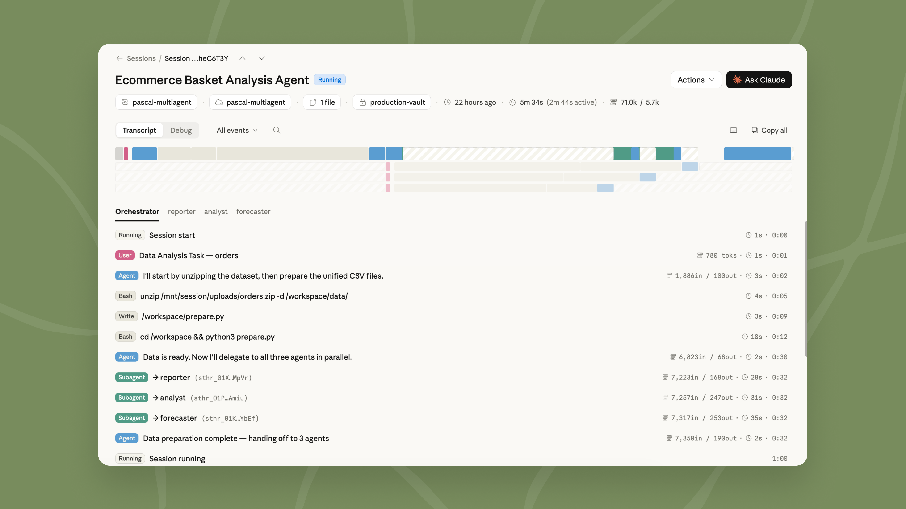

# Claude Managed Agents 新功能：dreaming、outcomes 与多智能体编排（中英对照）

> **原文标题：** New in Claude Managed Agents: dreaming, outcomes, and multiagent orchestration
> **作者：** Anthropic（原文未署名）
> **原文链接：** https://claude.com/blog/new-in-claude-managed-agents
> **发布日期：** 2026-05-19
> **翻译模型：** GLM-5.3
> 排版：每段英文原文在前，中文翻译紧随其后。术语保留英文原文并附中文释义。

---

Dreaming, outcomes, and multiagent orchestration are now available in Claude Managed Agents. Build agents that learn, meet a quality bar, and work in parallel.

Dreaming（"做梦"）、outcomes（成果标准）和 multiagent orchestration（多智能体编排）现已在 Claude Managed Agents 中推出。构建能够学习、达到质量标准并并行工作的智能体。

Today we're launching dreaming in Claude Managed Agents as a research preview. Dreaming extends memory by reviewing past sessions to find patterns and help agents self-improve. We're also making outcomes, multiagent orchestration, and webhooks available to developers building with Managed Agents. Together, these updates make agents more capable at handling complex tasks with minimal steering.

今天，我们在 Claude Managed Agents 中以研究预览（research preview）的形式推出 dreaming。Dreaming 扩展了记忆（memory）能力：通过回顾过去的会话来发现模式，帮助智能体自我改进。我们还同时向基于 Managed Agents 构建的开发者开放 outcomes、multiagent orchestration 和 webhooks（网络钩子）。这些更新加在一起，让智能体在极少人工引导（steering）的情况下也能胜任复杂任务。

# 用 dreaming 构建自我改进的智能体（Build self-improving agents with dreaming）

Dreaming is a scheduled process in Claude Managed Agents that reviews agent sessions and memory stores, extracts patterns, and curates memories so agents improve over time. You decide how much control you want: dreaming can update memory automatically, or you can review changes before they land.

Dreaming 是 Claude Managed Agents 中的一个定时进程，它会审查智能体的会话和记忆存储（memory store），提炼模式并整理记忆，让智能体随时间不断改进。控制程度由你决定：dreaming 可以自动更新记忆，也可以由你在变更生效前先行审查。

Dreaming surfaces patterns that a single agent can't see on its own, including recurring mistakes, workflows that agents converge on, and preferences shared across a team. It also restructures memory so it stays high-signal as it evolves. This is especially useful for long-running work and multiagent orchestration.

Dreaming 能揭示单个智能体靠自身无法察觉的模式，包括反复出现的错误、多个智能体逐渐收敛到的工作流，以及团队内部共享的偏好。它还会重构记忆，使其在演化过程中始终保持高信噪比。这对长时间运行的工作和多智能体编排尤其有用。

Together, memory and dreaming form a robust memory system for self-improving agents. Memory lets each agent capture what it learns as it works. Dreaming refines that memory between sessions, pulling shared learnings across agents and keeping it up-to-date.

记忆与 dreaming 结合在一起，构成了一套面向自我改进智能体的健壮记忆系统。记忆让每个智能体在工作中随手记下所学；dreaming 则在会话之间精炼这些记忆，汇聚跨智能体的共同经验，并让其保持最新。

Dreaming is available in Managed Agents on the Claude Platform; developers can request access here.

Dreaming 已在 Claude 平台的 Managed Agents 中提供；开发者可在此处申请访问。

# Outcomes：为智能体的工作定义质量标准（Outcomes: define the quality bar for agent work）

With outcomes, you write a rubric describing what success looks like and the agent works toward it. A separate grader evaluates the output against your criteria in its own context window, so it isn't influenced by the agent's reasoning. When something isn't right, the grader pinpoints what needs to change and the agent takes another pass.

使用 outcomes，你只需写一份评分标准（rubric）描述成功是什么样子，智能体就会朝着它努力。一个独立的评分器（grader）会在自己的上下文窗口中依据你的标准评估输出，因此不会受智能体自身推理的影响。当结果不达标时，评分器会精确指出需要修改之处，智能体再来一轮。

Agents do their best work when they know what "good" looks like. For example, a structural framework, a presentation standard, or a set of requirements that need to be met. With outcomes, agents can check their work against that bar and self-correct until the output is good enough, without a human needing to review each attempt.

当智能体知道"好"是什么样子时，它们的表现最好。比如一个结构框架、一套演示标准，或一组必须满足的要求。有了 outcomes，智能体可以对照这个标准检查自己的工作并自我修正，直到输出足够好，无需人工逐次审查。

Outcomes is particularly useful for tasks that require attention to detail and exhaustive coverage. It also works for subjective quality, like whether copy matches a brand voice or a design follows visual guidelines. In testing, outcomes improved task success by up to 10 points over a standard prompting loop, with the largest gains on the hardest problems. Outcomes also improved file generation quality, with +8.4% task success on docx and +10.1% on pptx in our internal benchmarks.

Outcomes 对那些注重细节、要求覆盖无遗漏的任务尤其有用。它同样适用于主观质量的把关，比如文案是否符合品牌语气、设计是否遵循视觉规范。在测试中，outcomes 相比标准提示循环（prompting loop）将任务成功率最高提升 10 个百分点，且最难的问题提升最大。在内部基准测试中，outcomes 还提升了文件生成质量：docx 任务成功率提高 8.4%，pptx 提高 10.1%。

You can also now define an outcome, let the agent run, and get notified by a webhook when it's done.

你现在还可以定义一个 outcome，让智能体自行运行，完成时通过 webhook 通知你。

# 多智能体编排：用多个智能体处理复杂任务（Multiagent orchestration: Handle complex tasks with multiple agents）

When there is too much work for a single agent to do well, multiagent orchestration lets a lead agent break the job into pieces and delegate each one to a specialist with its own model, prompt, and tools. For example, a lead agent can run an investigation while subagents fan out through deploy history, error logs, metrics, and support tickets.

当工作量大到单个智能体难以做好时，multiagent orchestration 可以让一个主智能体（lead agent）把任务拆分，并将每一部分委派给拥有独立模型、提示词和工具的专家智能体。例如，主智能体可以主持一项调查，同时各个 subagent（子智能体）分头检索部署历史、错误日志、指标和客服工单。

These specialists work in parallel on a shared filesystem and contribute to the lead agent's overall context. The lead agent can check back in with other agents mid-workflow because events are persistent and every agent remembers what it's done. You can also trace every step in the Claude Console: which agent did what, in what order, and why, giving you full visibility into how your task was delegated and executed.

这些专家智能体在共享文件系统上并行工作，并把成果汇入主智能体的整体上下文。主智能体可以在工作流中途与其他智能体核对进展，因为事件是持久化的，每个智能体都记得自己做过什么。你还可以在 Claude Console 中追踪每一步：哪个智能体做了什么、按什么顺序、为什么这么做--任务如何被委派和执行，全程清晰可见。

# 各团队正在构建什么（What teams are building）

Teams are using dreaming, outcomes, and multiagent orchestration to ship agents that verify their own work, learn across sessions, and parallelize complex jobs:

各团队正在使用 dreaming、outcomes 和 multiagent orchestration，推出能自我验证、跨会话学习并并行处理复杂任务的智能体：

- Harvey uses Managed Agents to coordinate complex legal work like long-form drafting and document creation. With dreaming, their agents remember what they learned between sessions, including filetype workarounds and tool-specific patterns. Completion rates went up ~6x in their tests.
- Netflix's platform team built an analysis agent that processes logs from hundreds of builds across different sources. With changes that affect thousands of applications, what matters is finding the issues that recur across many of them. Multiagent orchestration lets the agent analyze batches in parallel and surface only the patterns worth acting on.
- Spiral by Every is using multiagent orchestration and outcomes to power the writing agent behind their new API and CLI. The lead agent runs on Haiku: it fields incoming requests, poses quick follow-up questions when needed, then delegates the drafting to subagents running on Opus. When a user asks for multiple drafts, the subagents run in parallel. Writing quality is Spiral's core value, so they use outcomes to enforce it. Each draft is scored against a rubric of Every's editorial principles and the user's voice, both pulled from memory. Only drafts that clear the bar are returned.
- Wisedocs built a document quality check agent on Managed Agents, using outcomes to grade each review against their internal guidelines. Reviews now run 50% faster, while staying aligned with their team's standards.

- Harvey 使用 Managed Agents 协调长文起草、文档创建等复杂法律工作。借助 dreaming，他们的智能体能记住跨会话学到的东西，包括针对特定文件类型的变通处理和特定工具的使用模式。在他们的测试中，任务完成率提升了约 6 倍。
- Netflix 的平台团队构建了一个分析智能体，处理来自不同来源、数百次构建的日志。当一次变更会影响到数千个应用时，关键是找出其中反复出现的问题。Multiagent orchestration 让智能体可以并行分析各批次，只呈现值得处理的那类模式。
- Every 旗下的 Spiral 正在使用 multiagent orchestration 和 outcomes，为其新 API 和 CLI 背后的写作智能体提供动力。主智能体运行在 Haiku 上：它接收请求，必要时提出简短的追问，然后把起草工作委派给运行在 Opus 上的 subagent。当用户要求多个草稿时，这些 subagent 会并行工作。写作质量是 Spiral 的核心价值，因此他们用 outcomes 来把关：每份草稿都依照由 Every 编辑原则和用户文风构成的评分标准打分，两者都从记忆中调取。只有达标通过的草稿才会返回。
- Wisedocs 基于 Managed Agents 构建了文档质检智能体，用 outcomes 依照内部规范为每次评审打分。评审速度现在快了 50%，同时仍与团队标准保持一致。

# 开始使用（Getting started）

Dreaming is available in research preview, outcomes, multiagent orchestration, and memory are available in public beta as part of Managed Agents. To get started with dreaming, request access here. Explore our documentation to learn more or visit the Claude Console to deploy your first agent.

Dreaming 以研究预览形式提供；outcomes、multiagent orchestration 和记忆（memory）则作为 Managed Agents 的一部分已进入公测。要开始使用 dreaming，请在此处申请访问。查阅我们的文档了解更多，或前往 Claude Console 部署你的第一个智能体。
