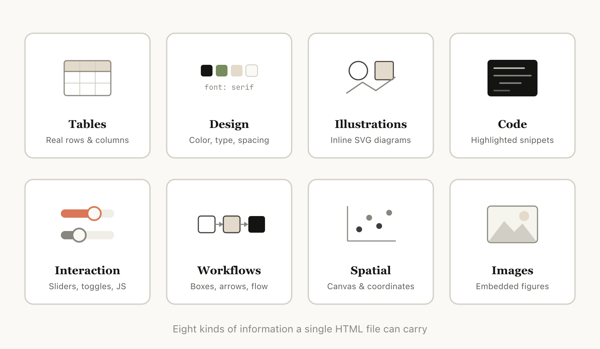
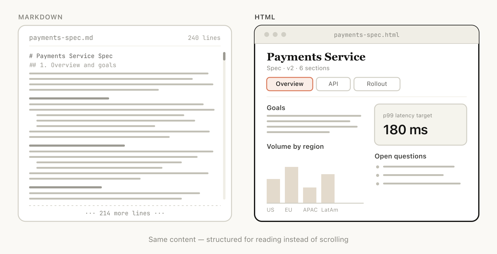
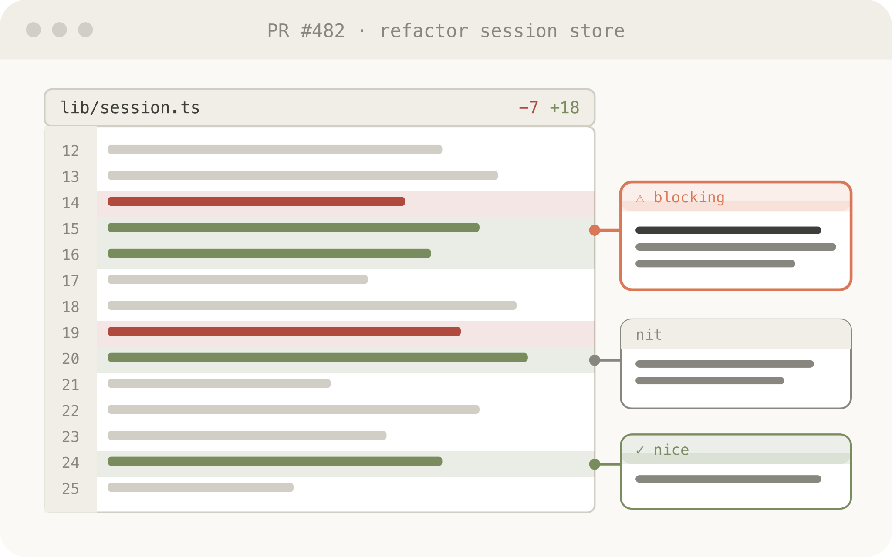
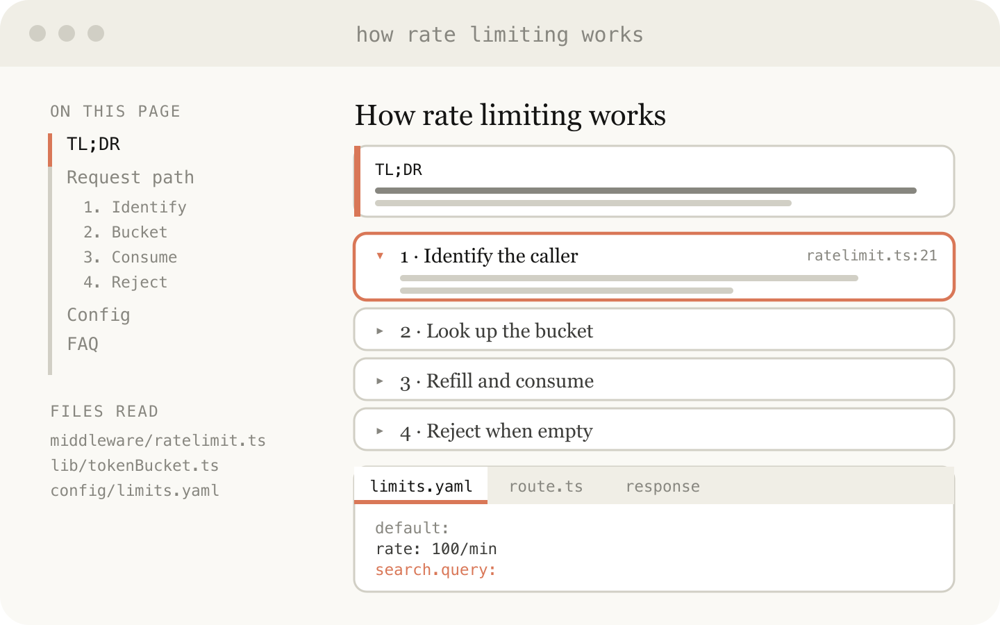
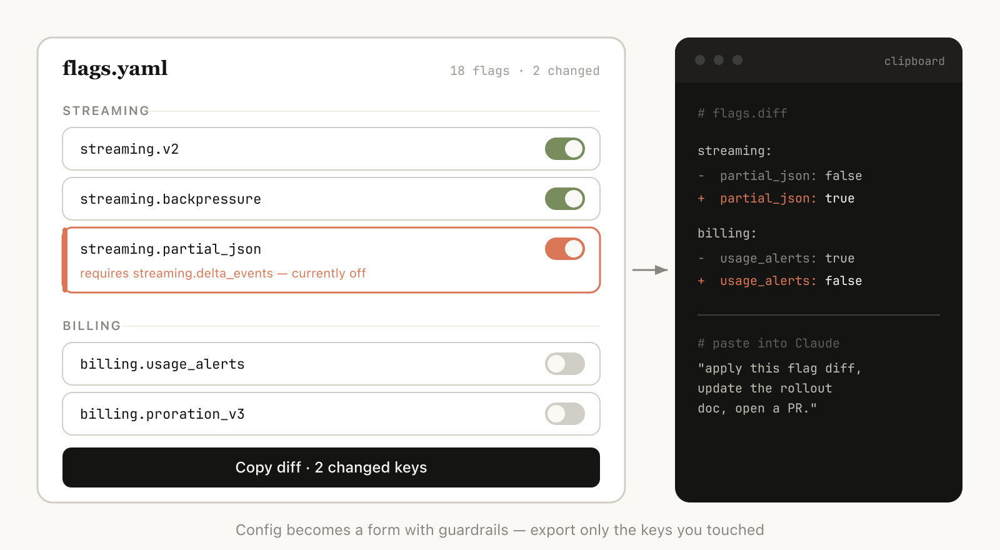

# Using Claude Code：HTML 出乎意料的有效性（中英对照）

> **原文标题：** Using Claude Code: The unreasonable effectiveness of HTML
> **作者：** Thariq Shihipar（Anthropic 技术团队成员）
> **原文链接：** https://claude.com/blog/using-claude-code-the-unreasonable-effectiveness-of-html
> **发布日期：** 2026-05-20
> **翻译模型：** GLM-5.3
> 排版：每段英文原文在前，中文翻译紧随其后。术语保留英文原文并附中文释义。

---

How and why members of the Claude Code team use HTML instead of Markdown to produce richer, more readable, and easily shareable outputs.

Claude Code 团队成员为何以及如何用 HTML 取代 Markdown，产出更丰富、更易读、也更易分享的输出。

Markdown has become the dominant file format used by agents to communicate with humans. It's simple, portable, has some rich text capability and is easy to edit. Claude has even gotten surprisingly good at using ASCII to make diagrams inside of Markdown files.

Markdown 已成为智能体与人沟通的主流文件格式。它简单、可移植、具备一定的富文本能力，而且易于编辑。Claude 甚至已经出奇地擅长在 Markdown 文件里用 ASCII 画图。

But as agents have become more and more powerful, I've found that Markdown has become an increasingly restrictive format. Specifically, I find it difficult to read a Markdown file of more than a hundred lines; I want to use Claude to generate richer visualizations, color and diagrams; and I want to be able to share these outputs more easily.

但随着智能体越来越强大，我发现 Markdown 已成为一种越来越受限的格式。具体来说：超过一百行的 Markdown 文件我读起来很吃力；我想用 Claude 生成更丰富的可视化、颜色和图表；我还希望能更轻松地分享这些输出。

I also am increasingly not editing these files myself, but using them as specs and reference files. When I do make edits, I'm usually prompting Claude to edit them, which removes one of Markdown's largest benefits.

而且我越来越多地不再亲自编辑这些文件，而是把它们当作规格和参考文件。即便要改，通常也是让 Claude 去改，这就抹掉了 Markdown 最大的优势之一。

Instead, I've started preferring HTML as an output format instead of Markdown and increasingly see this pattern being applied by others on the Claude Code team. In this post, I share why and how our team uses HTML to produce richer, more readable Claude Code outputs. If you'd like to follow along, you can start using these HTML file templates for common use cases, too.

取而代之的是，我开始偏好用 HTML 而非 Markdown 作为输出格式，并且看到 Claude Code 团队的其他人也越来越多地采用这一模式。在这篇文章里，我会分享我们团队为什么以及如何用 HTML 产出更丰富、更易读的 Claude Code 输出。如果你想跟着做，也可以在这些常见用例中开始使用这些 HTML 文件模板。

# 为什么用 HTML？（Why use HTML?）

A few things make HTML a better fit than Markdown for the kind of work I'm now doing with Claude Code, including tasks that require or entail:

对于我现在用 Claude Code 做的这类工作，有几件事让 HTML 比 Markdown 更合适，包括那些需要或伴随以下特点的任务：

## 信息密度（Information density）

HTML can convey much richer information compared to Markdown. It can, of course, do simple document structure like headers and formatting, but it can also represent all sorts of other information such as:

与 Markdown 相比，HTML 能传达丰富得多的信息。它当然能处理标题、格式这类简单的文档结构，但也能表示各种其他信息，比如：

- Tabular data using tables
- Design data with CSS
- Illustrations with SVG
- Code snippets with script tags
- Interactions using HTML elements with javascript + CSS
- Workflows using SVG and HTML
- Spatial data using absolute positions and canvases
- Images using image tags

- 用表格（table）表示的表格数据
- 用 CSS 表示的设计数据
- 用 SVG 绘制的插图
- 用 script 标签承载的代码片段
- 用 HTML 元素配合 javascript + CSS 实现的交互
- 用 SVG 和 HTML 描绘的工作流
- 用绝对定位和 canvas 呈现的空间数据
- 用 image 标签嵌入的图片

In my opinion, there is almost no set of information that Claude can read that you cannot efficiently represent with HTML. This makes it a highly efficient way for the model to communicate in-depth information to you and for you to review it.

在我看来，凡是 Claude 能读的信息，几乎没有什么不能用 HTML 高效表达的。这使它成为模型向你传递深度信息、以及你审阅这些信息的一种高效方式。

I've found that in the absence of being able to do this, the model may do more inefficient things in Markdown, like ASCII diagrams or, my favorite, estimating colors with unicode characters.

我发现，在做不到这一点的时候，模型可能会在 Markdown 里做一些更低效的事，比如 ASCII 图，或者我最“喜欢”的--用 unicode 字符来估摸颜色。

## 视觉清晰与易读性（Visual clarity and ease of reading）

As Claude is capable of tackling more complex work, it's also able to write larger and larger specs and plans. I've found that I tend to not actually read more than a 100-line Markdown file, and I certainly am not able to get anyone else in my organization to read it.

随着 Claude 能胜任越来越复杂的工作，它写出的规格和计划也越来越大。我发现自己其实读不进超过 100 行的 Markdown 文件，更别提让组织里的其他人去读了。

But HTML documents are much easier to read because Claude can organize the structure visually to be ideal to navigate with tabs, illustrations, and links. It can even be mobile responsive so you can read it differently based on your form factor.

但 HTML 文档读起来轻松得多，因为 Claude 可以在视觉上组织结构，用标签页、插图和链接打造理想的浏览体验。它甚至可以做成移动端自适应（responsive），让你在不同设备上以不同方式阅读。

## 易于分享（Ease of sharing）

Markdown files are fairly hard to share since most browsers do not render them natively well. You often have to add them as attachments to emails or messages.

Markdown 文件相当难分享，因为大多数浏览器无法原生很好地渲染它们。你常常只能把它们作为附件加到邮件或消息里。

As long as you upload the HTML file, you can share the link easily. Your colleagues can open it wherever they wish and easily reference it.

只要把 HTML 文件上传上去，你就能轻松分享链接。同事可以在任何地方打开它，也很容易引用它。

The chance of someone actually reading your spec, report, or PR writeup is much higher if it's in HTML.

如果你的规格、报告或 PR 说明是 HTML 的，别人真正去读的概率会高得多。

## 双向交互（Two-way interactions）

HTML can also allow you to interact with the document; for example, you might want to ask it to add sliders or knobs to adjust a design or allow you to tweak different options in the algorithm to see what happens. You can also ask it to let you copy these changes into a prompt to paste back into Claude Code.

HTML 还能让你与文档交互；比如，你可以让它加上滑块或旋钮来调整设计，或者让你改动算法里的不同参数看看会发生什么。你还可以让它提供把这些改动复制成提示词的功能，好粘贴回 Claude Code。

When useful, this can allow you to create individual editing environments for the specific problem you're working on.

在合适的时机，这能让你为手头的具体问题打造专属的编辑环境。

## 数据摄取（Data ingestion）

One of the biggest reasons to use Claude Code to make HTML files instead of Claude.ai or Claude Design is all of the context Claude Code can ingest. For example, when writing this article, I asked Claude Code to read through my code folder and find all the HTML files I've generated, group and categorize them, and then make an HTML file with diagrams representing each type. The diagrams you see in this article are a direct result of that.

用 Claude Code 而不是 Claude.ai 或 Claude Design 来生成 HTML 文件，最大的原因之一是 Claude Code 能摄取的上下文。比如写这篇文章时，我让 Claude Code 通读我的代码文件夹，找出我生成过的所有 HTML 文件，分组归类，然后生成一个用图表展示每种类型的 HTML 文件。你在本文中看到的图就是那次操作的直接成果。

Besides the file system, Claude Code can find additional context using your MCPs (like Slack, Linear, etc.), your web browser (with Claude in Chrome), and your git history.

除了文件系统，Claude Code 还能通过你的 MCP（如 Slack、Linear 等）、你的网页浏览器（借助 Claude in Chrome）以及你的 git 历史找到更多上下文。

# 入门（Getting started）

One thing worth noting: you don't need to do much to get Claude to generate HTML like this. You can simply prompt it to "make an HTML file" or "make an HTML artifact." The main thing is knowing what you want the artifact to do and how you might use it. Over time, it may make sense to build a skill around recurring patterns, but starting by prompting from scratch is a good way to get a feel for how it works across different use cases.

有一点值得注意：要让 Claude 生成这样的 HTML，你并不需要做太多。直接提示它“生成一个 HTML 文件”或“做一个 HTML artifact”即可。关键在于知道你想让这个产物做什么、你打算怎么用它。随着时间推移，围绕反复出现的模式构建一个 skill 或许更划算，但从零开始提示入手，是感受它在不同用例中如何运作的好方法。

## 用例（Use cases）

To make this approach more concrete, below are some example use cases where I think using HTML files make more sense than Markdown. You can also follow along with a GitHub gallery of these use cases, here.

为了让这个方法更具体，下面列出一些我认为用 HTML 文件比 Markdown 更合适的示例用例。你也可以在此处通过这些用例的 GitHub 画廊跟着做。

### 规格、规划与探索（Specs, planning, and exploration）

HTML is a rich canvas for Claude to dive into a problem. When I start working on a problem instead of a simple Markdown plan I expect to make a web of HTML files. For example, I might start with asking Claude Code to brainstorm and create some explorations of different options. I would then ask it to expand more into one, maybe make mockups or examples of the type interfaces. Finally, when I feel good I'll ask it to write an implementation plan. When I'm happy with the plan I'll create a new session and pass in all of these files for it to implement.

HTML 是 Claude 深入问题的一块丰富画布。当我开始处理一个问题时，我预期做的不是一份简单的 Markdown 计划，而是一张由 HTML 文件构成的网。比如，我会先让 Claude Code 头脑风暴，对不同选项做一些探索；然后让它就其中一个展开，或许做些类型接口的模型稿（mockup）或示例；最后，等感觉差不多了，我再让它写实现计划。计划满意后，我会开一个新会话，把这些文件全部传入让它实现。

When verifying I'll also ask the verification agent to read in the files and it will have much broader context on what is needed.

验证时，我也会让验证智能体读入这些文件，这样它对需求的上下文会宽广得多。

Example prompts:

示例提示词：

- I'm not sure what direction to take the onboarding screen. Generate 6 distinctly different approaches-vary layout, tone, and density-and lay them out as a single HTML file in a grid so I can compare them side by side. Label each with the tradeoff it's making.
- Create a thorough implementation plan in a HTML file, be sure to make some mockups, show data flow and add important code snippets I might want to review. Make it easy to read and digest.

- 我不确定引导页（onboarding screen）该往哪个方向走。生成 6 种截然不同的方案--在布局、基调和信息密度上做出变化--并把它们以网格形式排在单个 HTML 文件里，方便我并排比较。给每个方案标注它所做的权衡。
- 在 HTML 文件里创建一份详尽的实现计划，务必做一些模型稿，展示数据流，并附上我可能需要审查的重要代码片段。要让它易读易消化。

Use this for:

适用于：

- Exploring other ways to implement something in code
- Experimenting with multiple visual designs at once

- 探索同一功能在代码中的其他实现方式
- 同时试验多套视觉设计

### 代码审查与理解（Code review and understanding）

Code can be difficult to read in a Markdown file, but with HTML, we can render diffs, annotations, flowcharts, and modules. Use HTML to understand code that the agent has written, to review code, or to explain a PR to someone reviewing your code.

代码放在 Markdown 文件里可能很难读，但用 HTML，我们可以渲染 diff、注释、流程图和模块。用 HTML 来理解智能体写的代码、审查代码，或者向审查你代码的人解释一个 PR。

Example prompt:

示例提示词：

Help me review this PR by creating an HTML artifact that describes it. I'm not very familiar with the streaming/backpressure logic, so focus on that. Render the actual diff with inline margin annotations, color-code findings by severity and whatever else might be needed to convey the concept well.

做一个描述这个 PR 的 HTML 工件来帮我审查。我不太熟悉里面的流式/背压（backpressure）逻辑，所以重点放在那上面。渲染真实 diff 并配上正文旁注，按严重程度给发现项标色，再加上任何有助于把概念讲清楚的东西。

Use this for:

适用于：

- Creating a PR
- Reviewing a PR
- Understanding a topic in code

- 创建 PR
- 审查 PR
- 理解代码中的某个主题

### 设计与原型（Design and prototypes）

Claude Design is based on HTML because HTML is incredibly expressive at design, even if your end surface is not HTML. Claude can sketch out a design in HTML and then write it in your language of choice, be it React, Swift, etc.

Claude Design 基于 HTML，因为 HTML 在设计上的表现力惊人，哪怕你最终交付的载体不是 HTML。Claude 可以先用 HTML 勾勒设计，再用你选择的语言（React、Swift 等）实现。

You can also prototype interactions, such as animations, actions, etc. Consider asking Claude to make sliders, knobs, etc. to tune in exactly what you're looking for.

你还可以为交互做原型，比如动画、动作等。可以考虑让 Claude 做些滑块、旋钮等控件，把效果精确调到你想要的样子。

Example prompt:

示例提示词：

I want to prototype a new checkout button, when clicked it does a play animation and then turns purple quickly. Create a HTML file with several sliders and options for me to try different options on this animation, give me a copy button to copy the parameters that worked well.

我想为一个新的结账按钮做原型：点击时播放一段动画，然后迅速变紫。创建一个 HTML 文件，带若干滑块和选项，让我在这个动画上尝试不同参数，再给我一个复制按钮，把效果好的参数复制下来。

Use this for:

适用于：

- Creating design system artifacts
- Adjusting components
- Visualizing component libraries
- Prototyping animations

- 创建设计系统（design system）工件
- 调整组件
- 可视化组件库
- 为动画做原型

### 报告、研究与学习（Reports, research, and learning）

Claude Code is very effective at synthesizing information across multiple data sources and converting it into a report for readability. You can prompt Claude to search your Slack, your codebase, git history, or the internet and use it to generate easy to read reports..

Claude Code 非常擅长跨多个数据源综合信息，并把它们转成可读性好的报告。你可以让 Claude 检索你的 Slack、代码库、git 历史或互联网，并用它生成易于阅读的报告。。

You could assemble this in the form of a long HTML document, an interactive explainer or even a slideshow/deck. Ask Claude to use SVG for diagrams to help visualize it.

你可以把它组织成一份长 HTML 文档、一个交互式讲解页，甚至一份幻灯片/演示文稿。让 Claude 用 SVG 画图，帮助可视化。

Example prompt:

示例提示词：

I don't understand how our rate limiter actually works. Read the relevant code and produce a single HTML explainer page: a diagram of the token-bucket flow, the 3–4 key code snippets annotated, and a "gotchas" section at the bottom. Optimize it for someone reading it once.

我搞不懂我们的限流器（rate limiter）到底是怎么工作的。阅读相关代码，产出一个单页 HTML 讲解页：一张令牌桶（token-bucket）流程图、3–4 段带注释的关键代码片段，以及底部的“坑点”（gotchas）部分。为只读一遍的读者优化。

Use this for:

适用于：

- Writing feature summarizations
- Generating explainers
- Drafting weekly status reports
- Creating incident reports
- Producing SVG illustrations, flowcharts, and technical diagrams,

- 撰写功能总结
- 生成讲解文档
- 起草每周状态报告
- 创建事故报告
- 制作 SVG 插图、流程图和技术图表，

### 自定义编辑界面（Custom editing interfaces）

Sometimes it's hard to describe what you want purely in a text box. For this use case, I'll often ask Claude to build me a throwaway editor for the exact thing I'm working on: not a product, or a reusable tool, but a single HTML file, purpose-built for this one piece of data.

有时候，很难光靠一个文本框描述清楚你想要什么。对这种用例，我常常让 Claude 给我做一个针对当前工作的用完即弃编辑器：不是产品，也不是可复用工具，而是一个专门为这份数据量身构建的单个 HTML 文件。

The trick is always to end with an export: a "copy as JSON" or "copy as prompt" button that turns whatever I did in the UI back into something I can paste into Claude Code or commit to a file. You stay in the loop, but the loop gets much tighter.

诀窍是永远以导出收尾：一个“复制为 JSON”或“复制为提示词”按钮，把我在 UI 里做的一切变回可以粘贴进 Claude Code 或提交到文件里的东西。你仍在这个循环里，但循环收紧了很多。

Example prompts:

示例提示词：

- I need to reprioritize these 30 Linear tickets. Make me an HTML file with each ticket as a draggable card across Now / Next / Later / Cut columns. Pre-sort them by your best guess. Add a "copy as Markdown" button that exports the final ordering with a one-line rationale per bucket.
- Here's our feature flag config. Build a form-based editor for it, group flags by area, show dependencies between them, warn me if I enable a flag whose prerequisite is off. Add a "copy diff" button that gives me just the changed keys.
- I'm tuning this system prompt. Make a side-by-side editor: editable prompt on the left with the variable slots highlighted, three sample inputs on the right that re-render the filled template live. Add a character/token counter and a copy button.

- 我需要重新排定这 30 个 Linear 工单的优先级。给我做一个 HTML 文件，每张工单是一张可拖拽的卡片，分布在 Now / Next / Later / Cut 四列。先按你的最佳判断预排序。加一个“复制为 Markdown”按钮，导出最终排序，并为每个分桶附一行理由。
- 这是我们的功能开关（feature flag）配置。为它构建一个表单式编辑器：按区域分组，展示开关之间的依赖，当我启用一个前置开关未开启的 flag 时警告我。加一个“复制 diff”按钮，只给我变更过的键。
- 我在调优这个 system prompt。做一个左右并排的编辑器：左边是可编辑的提示词，变量槽位高亮显示；右边是三个示例输入，实时重新渲染填充后的模板。加上字符/token 计数器和一个复制按钮。

Use this for:

适用于：

- Reordering, triaging, or bucketing anything (tickets, test cases, feedback)
- Editing structured config (feature flags, env vars, JSON/YAML with constraints)
- Tuning prompts, templates, or copy with live preview
- Curating datasets - approve/reject rows, tag examples, export the selection
- Annotating a document, transcript, or diff and exporting the annotations
- Picking values that are painful to express in text: colors, easing curves, crop regions, cron schedules, regexes

- 对任何东西做重排、分诊或分桶（工单、测试用例、反馈）
- 编辑结构化配置（feature flag、环境变量、带约束的 JSON/YAML）
- 带实时预览地调优提示词、模板或文案
- 管理数据集--批准/拒绝行、给示例打标签、导出所选内容
- 为文档、转写文本或 diff 做标注并导出标注
- 挑选用文字表达很痛苦的值：颜色、缓动曲线、裁剪区域、cron 计划、正则表达式

### 常见问题（Frequently asked questions）

These are the questions I get asked most often about using HTML with Claude Code, paired with the practical, day-to-day habits I've landed on:

这些是我最常被问到的关于在 Claude Code 中用 HTML 的问题，同时附上我落定的日常实用习惯：

Isn't it less efficient?

这样不是更低效吗？

While Markdown often uses fewer tokens, I've found that the added expressiveness of HTML and the much higher likelihood of me reading it means I get overall better output. With the 1MM context window in Opus 4.7, the increased token usage is not really noticeable in the context window.

虽然 Markdown 往往用更少的 token，但我发现 HTML 增加的表达力、加上我真正去读它的概率高得多，意味着总体产出更好。有了 Opus 4.7 的 1M 上下文窗口，多出的 token 用量在上下文窗口里几乎察觉不到。

When do you use Markdown for now?

那你现在什么时候还用 Markdown？

I have honestly stopped using Markdown altogether for almost everything, but I'm probably far on the HTML maximalist side of things.

说实话，几乎所有事我都彻底不用 Markdown 了，不过我大概算是 HTML 最大化主义者那一端的。

Is this how you've replaced planning?

这就是你替代规划的方式吗？

I've found that instead of having a single plan, I tend to have a few different HTML files for different parts/stages of the plan. For example, I may make an implementation plan in HTML and then do another file for exploration of UIs, and then finally make a HTML component that lists every design. I tend to keep these files around as references for the future, as well for use in verification.

我发现，与其持有单一计划，我更倾向于为计划的不同部分/阶段持有几个不同的 HTML 文件。比如，我可能用 HTML 做一份实现计划，然后另做一个文件探索 UI，最后再做一个列出所有设计的 HTML 组件。我倾向于把这些文件留作将来的参考，也用于验证。

## 与 Claude 保持同步（Staying in the loop with Claude）

All of the above is to say that the real reason I use HTML instead of Markdown is that it helps me feel much more in the loop with Claude. As Claude takes on more, I'd noticed I was reading plans less closely, and I wanted a way to stay engaged with its choices rather than just hand them off. HTML turned out to be exactly that. I feel more in the loop now than I ever did before."

以上所有想说的其实是：我用 HTML 取代 Markdown 的真正原因，是它让我感觉自己与 Claude 的联动紧密得多。随着 Claude 承担得越来越多，我注意到自己读计划读得越来越粗，我想要一种持续参与它的选择的方式，而不是当甩手掌柜。HTML 恰恰做到了这一点。我现在感觉与循环的联结比以往任何时候都紧密。"

Get started with Claude Code.

开始使用 Claude Code。

This article was written by Thariq Shihipar, member of technical staff, and expresses his personal opinions – and affinity – for using HTML files with Claude Code.

本文由技术团队成员 Thariq Shihipar 撰写，表达了他个人对在 Claude Code 中使用 HTML 文件的观点--与偏爱。
