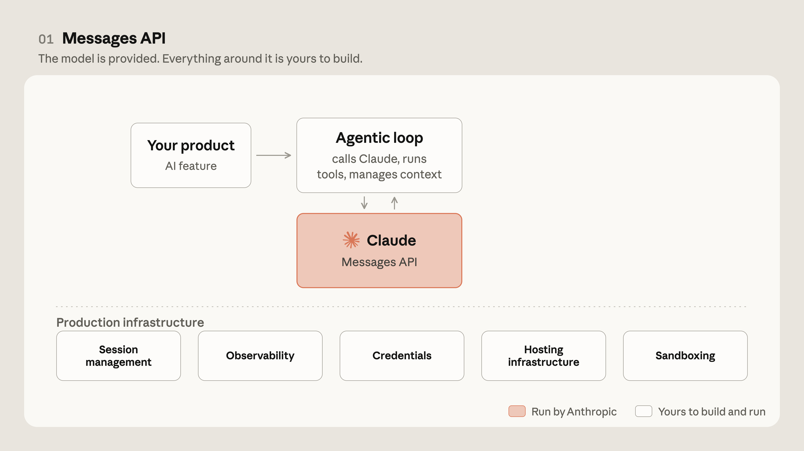
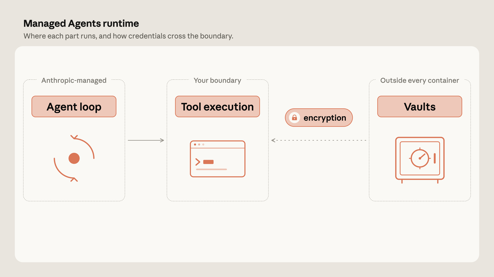
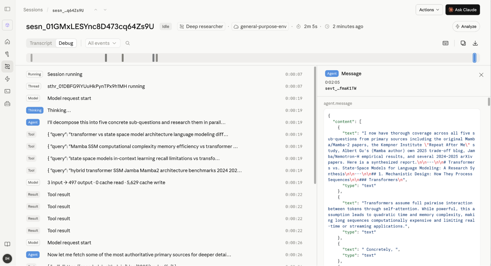

# 智能体界面的演进：使用 Claude Managed Agents 构建（中英对照）

> **原文标题：** The evolution of agentic surfaces: building with Claude Managed Agents
> **作者：** Gagan Bhat and Isabella He, Members of Technical Staff on Anthropic's Applied AI team（Anthropic Applied AI 团队技术成员）
> **原文链接：** https://claude.com/blog/building-with-claude-managed-agents
> **发布日期：** 2026-06-10
> **翻译模型：** GLM-5.3
> 排版：每段英文原文在前，中文翻译紧随其后。术语保留英文原文并附中文释义。

---

Claude Managed Agents allows teams to build and deploy agents in production environments reliably at scale. Here's why and how teams are using it.

Claude Managed Agents 让团队能够可靠地大规模构建并部署生产环境中的智能体（agent）。以下是各团队使用它的原因与方式。

As model intelligence and agentic harnesses evolve, Anthropic's Claude Managed Agents allows teams to build and deploy agents in production environments reliably at scale. Here's why and how teams are using it.

随着模型智能水平和智能体 harness（agentic harness，智能体运行框架）的不断演进，Anthropic 的 Claude Managed Agents 让团队能够可靠地大规模构建并部署生产环境中的智能体。以下是各团队使用它的原因与方式。

Getting an agent into production takes more than a good prompt. The agent needs somewhere to run the code it writes, credentials to reach your data, observable sessions, and infrastructure that scales with usage. On the Applied AI team, we work at the intersection of product, research, and the customers building on Claude—and we see the same pattern repeatedly: infrastructure is what separates a prototype from a production agent. All too often, teams burn development cycles on security, state management, permissioning, and harness tuning.

让一个智能体走进生产环境，靠的不只是一个好提示词。智能体需要一个地方来运行它编写的代码、访问你的数据所需的凭证（credentials）、可观测的会话（session），以及能随用量扩展的基础设施。在 Applied AI 团队（应用 AI 团队），我们的工作处在产品、研究与基于 Claude 构建产品的客户的交汇点--我们反复看到同一个规律：基础设施正是原型与生产级智能体的分水岭。太多团队把开发周期耗在安全、状态管理、权限控制和 harness 调优上。

Claude Managed Agents, our suite of composable APIs for building and deploying production-grade agents, pairs an agent harness tuned for performance with production infrastructure, allowing teams to go from prototype to launch in days rather than months. In this post, we'll cover the evolution of Anthropic's agentic building blocks, why we built Claude Managed Agents, and how teams are using it in production today.

Claude Managed Agents 是我们用于构建和部署生产级智能体的一套可组合 API，它把针对性能调优过的智能体 harness 与生产级基础设施组合在一起，让团队得以在数天而非数月内从原型走到上线。在这篇文章中，我们将介绍 Anthropic 智能体构建块的演进、我们为什么构建 Claude Managed Agents，以及各团队如今如何在生产中使用它。

# 智能体架构的演进（Evolving the agent architecture）

When we opened up Claude to developers in 2023, the API was deliberately simple: tokens in, tokens out. You sent a prompt, Claude returned a completion, and you built the harness and underlying infrastructure.

2023 年我们向开发者开放 Claude 时，API 刻意保持简单：token 进、token 出。你发送一个提示词，Claude 返回一段补全（completion），而 harness 和底层基础设施都由你自己构建。

The API grew steadily richer over the years, but the contract underneath never changed: one request, one model turn, and your application decides what happens next. For a long time, that was enough. Summarizing a document, classifying a support ticket, rewriting a block of text—the kind of work that fits comfortably in a single turn.

这些年来，API 稳步变得更丰富，但底层契约从未改变：一次请求、一轮模型输出，接下来发生什么由你的应用决定。在很长一段时间里，这就够了。总结一份文档、给一个客服工单分类、改写一段文字--这类工作恰好能舒服地装进单轮对话里。

Over time, however, the tasks people wanted to hand off stopped fitting. They wanted Claude to carry a task all the way through, look something up, act on it, see what changed, and decide what to do next. And they wanted it to operate in the systems their work already ran on, like a codebase, internal wiki, or ticketing system.

然而，随着时间推移，人们想交托出去的任务不再装得下单轮对话。他们希望 Claude 把一项任务从头做到尾：查一些东西、据此行动、看看发生了什么变化，再决定下一步做什么。他们还希望它在日常工作已经依赖的系统里运作，比如代码库、内部 wiki 或工单系统。

With the API, turning Claude into an agent meant building your own loop: ask the model what to do, run the tool, feed the result back, and repeat. You were responsible for building and deploying the agent scaffolding, which may need tuning as models evolve. For agents that require full customization, this approach makes sense. For agentic workloads that are more predictable and less complex, optimizing harnesses as models and products evolved became tedious.

只用 API 把 Claude 变成智能体，就意味着构建你自己的循环：问模型该做什么、运行工具、把结果喂回去，如此往复。构建和部署智能体脚手架（scaffolding）是你的责任，而它可能需要随模型演进不断调优。对于需要完全定制的智能体，这种方式说得通；但对于更可预测、更不复杂的智能体工作负载来说，随着模型和产品演进而不断优化 harness 就变得令人生厌。

Claude Code, the agentic coding tool we launched in 2025 that lets Claude interact directly with your codebase, contained our own version of that harness: the loop, tool execution, subagents, context management, and rich capabilities that made it an effective agent. Developers naturally wanted similar harness machinery for their own agents across various domains.

Claude Code 是我们 2025 年推出的智能体编程工具，让 Claude 能直接与你的代码库交互，其中就包含我们自研的那套 harness：循环、工具执行、subagent（子智能体）、上下文管理，以及让它成为高效智能体的丰富能力。开发者自然希望在自己各领域的智能体里也用上类似的 harness 机制。

To enable teams to build agents on top of the Claude Code harness, we released Claude Agent SDK. Claude Agent SDK gives developers tools to build their own agents on the same machinery that runs Claude Code instead of maintaining a homegrown loop. For a lot of teams, this is when agents became practical: the harness arrived already tuned for Claude with infrastructure primitives and it kept improving as Claude Code did.

为了让团队能够在 Claude Code harness 之上构建智能体，我们发布了 Claude Agent SDK。Claude Agent SDK 给开发者提供工具，让他们在运行 Claude Code 的同一套机制上构建自己的智能体，而不必维护自制的循环。对很多团队来说，智能体正是从这时起变得切实可行：harness 天生就为 Claude 调好并附带基础设施原语（primitive），而且随着 Claude Code 的改进而不断改进。

Even with a harness, though, deploying agents in production environments can be challenging for several reasons:

不过，即便有了 harness，把智能体部署到生产环境仍然颇有挑战，原因有以下几点：

- Hosting and scaling. Where does the agent run, how long can a process stay alive for a multi-hour task, and what scales it when usage grows?
- Session management. Where does an agent's history and progress live? Can a run survive an interruption and resume unencumbered? Can you go back and inspect what happened in previous sessions?
- Filesystem management. Doing real work means producing artifacts: editing code, writing files, building outputs. Where does the agent get a workspace to act on, and what happens to that workspace between runs?
- Execution isolation. The code Claude writes has to execute somewhere. What's the blast radius if it's wrong, and what boundary would you actually trust in production?
- Credentials. The agent needs access to your systems. How does it get that access without exposing proprietary information to the code it generates?
- Observability. When an agent works autonomously for an hour and does something surprising, can you reconstruct every step it took?

- 托管与扩缩容（Hosting and scaling）。智能体在哪里运行？对于一个耗时数小时的任务，进程能存活多久？用量增长时靠什么来扩容？
- 会话管理（Session management）。智能体的历史和进度存在哪里？一次运行能否在中断后幸存并无碍地恢复？你能否回头检视以往会话中发生了什么？
- 文件系统管理（Filesystem management）。做真正的工作就意味着产出工件（artifact）：编辑代码、写文件、构建输出。智能体在哪里获得可以施展的工作区（workspace）？两次运行之间，这个工作区又会怎样？
- 执行隔离（Execution isolation）。Claude 写的代码总得在某个地方执行。如果代码出错，影响范围（blast radius）有多大？在生产环境中你真正信任哪种边界？
- 凭证（Credentials）。智能体需要访问你的系统。它如何获得这种访问权限，又不把专有信息暴露给它自己生成的代码？
- 可观测性（Observability）。当智能体自主工作了一个小时并做出某种出人意料的举动时，你能还原它走过的每一步吗？

With the Agent SDK, many elements of the aforementioned production infrastructure are provided through Claude Code's machinery. The agent gets a real filesystem to work in, session state is persisted locally or on external storage, and observability is exportable through OpenTelemetry into whatever monitoring stack you already run.

有了 Agent SDK，上述生产基础设施的许多要素都通过 Claude Code 的机制提供。智能体获得一个真实文件系统来工作，会话状态可持久化到本地或外部存储，可观测性数据则可通过 OpenTelemetry 导出，进入你已经在运行的任何监控技术栈。

However, as teams increasingly built agents that moved out of local development into production, they needed a way to deploy them at scale and with managed infrastructure. And as models and their surrounding harnesses become more advanced–running longer, executing more code, touching more systems, and taking more actions– scaling, security, and sandboxing became more challenging.

然而，随着团队构建的智能体越来越多地从本地开发走向生产，他们需要一种依托托管基础设施、可大规模部署的方式。而随着模型及其周边 harness 变得更先进--运行更久、执行更多代码、接触更多系统、采取更多行动--扩缩容、安全与沙箱化（sandboxing）也变得更具挑战。

Several of these hurdles stem from a common architectural choice: agent harnesses often run inside the same container as the filesystem it works on. A container has to spin up (paying a startup cost) before Claude can think, the agent along with code execution lives right next to your credentials, and when the container dies, the run dies with it.

这些障碍中有几个源自一个共同的架构选择：智能体 harness 往往与它所操作的文件系统运行在同一个容器里。Claude 要思考，容器就必须先转起来（付出启动成本）；智能体连同代码执行就紧挨着你的凭证运行；而容器一死，这次运行也随之而死。

Managed Agents solves these problems by decoupling the brain from the hands. The harness that calls Claude runs separately from the sandbox where code executes, and the session–an append-only log of every model call, tool call, and result–connects the two. Claude can start reasoning before any container exists, the sandbox stays far away from your credentials, and a whole run can be reconstructed from its session at any point.

Managed Agents 通过把"大脑"与"双手"解耦来解决这些问题。调用 Claude 的 harness 与执行代码的沙箱分开运行，而把二者连接起来的，是会话--一份只追加（append-only）的日志，记录每一次模型调用、工具调用及结果。Claude 可以在任何容器存在之前就开始推理，沙箱与你的凭证相隔甚远，而整次运行在任意时刻都能从其会话中完整还原。

# 何时以及为何使用 Claude Managed Agents（When and why to use Claude Managed Agents）

When building with Managed Agents, users define the task, the tools, and the guardrails, and Anthropic runs the agent on our infrastructure and handles the agentic loop underneath: how to give an agent an execution environment to call tools, how to recover when something fails, multi-agent orchestration, and more.

使用 Managed Agents 构建时，用户定义任务、工具和护栏（guardrail），由 Anthropic 在我们的基础设施上运行智能体，并处理底层的智能体循环：如何给智能体一个调用工具的执行环境、出故障时如何恢复、多智能体编排等等。

When the harness doesn't evolve alongside model intelligence, the agent breaks down. On Claude Sonnet 4.5, an agent would rush to finish as it neared the end of its context, cutting work short rather than using the room it had left—a pattern called "context anxiety." Our fix was to add context resets to the harness, baking in an assumption that Claude needed help staying coherent near the limit. That assumption didn't survive the next model. On Claude Opus 4.5, the behavior was gone, and the resets we'd added were just overhead.

当 harness 不随模型智能水平同步演进时，智能体就会失灵。在 Claude Sonnet 4.5 上，智能体在临近上下文尽头时会急着收尾，把工作草草截断，而不是利用剩下的空间--这个模式被称为"上下文焦虑"（context anxiety）。我们的修复是给 harness 加上上下文重置（context reset），把"Claude 在接近上限时需要帮助才能保持连贯"这一假设硬编码了进去。这个假设没能活过下一代模型：在 Claude Opus 4.5 上，这种行为消失了，我们加上的重置反倒成了纯开销。

For most organizations, maintaining a harness is overhead that doesn't differentiate their product. Harnesses have to be tuned for certain model behaviors; primitives like compaction, tool execution, and caching works differently on Claude than other models. With Claude Managed Agents, the harness evolves alongside the model, allowing teams to focus on what will differentiate their agents: context management and domain expertise.

对大多数组织而言，维护 harness 是一种不会给产品带来差异化的开销。harness 必须针对特定模型行为调优；压缩（compaction）、工具执行、缓存这些原语在 Claude 上的工作方式与其他模型不同。有了 Claude Managed Agents，harness 与模型同步演进，团队得以专注于真正能让智能体产生差异化的东西：上下文管理和领域专长。

To enable developers to configure the context and tools necessary to build effective agents, Managed Agents is built around three primary resources: agents, environments, and sessions. An agent is a configuration: a model, a prompt, a set of tools, and the guardrails around them. An environment is the execution context the agent runs in: the sandbox container, its networking rules, and the packages pre-installed in it, hosted on our cloud or on infrastructure you control. Each run is a session, which pairs an agent with an environment and gets its own isolated sandbox instance. Sessions persist their full event history, sandbox state, and outputs server-side, so long-running work can pause, resume cleanly, and be traced step by step after the fact. With Managed Agents, you can define an agent and an environment once, then run many sessions against the same configuration as your workload grows.

为了让开发者能够配置构建高效智能体所需的上下文与工具，Managed Agents 围绕三种核心资源构建：agent（智能体）、environment（环境）和 session（会话）。agent 是一份配置：一个模型、一个提示词、一组工具，以及围绕它们的护栏。environment 是智能体运行所处的执行上下文：沙箱容器、它的网络规则，以及预装在其中的软件包，托管在我们的云上或你控制的基础设施上。每次运行就是一个 session，它把一个 agent 与一个 environment 配对，并获得自己独立的沙箱实例。session 会在服务端持久化完整的事件历史、沙箱状态和输出，因此长时间运行的工作可以暂停、干净地恢复，事后还能逐步追溯。有了 Managed Agents，你可以只定义一次 agent 和 environment，然后随着工作负载的增长，在同一配置下运行大量 session。

# 在 Managed Agents 上为生产与规模化而构建（Building for production and scale on Managed Agents）

Within Applied AI, we see agents go from prototype to production both inside Anthropic and across our customers' systems, across coding, finance, support, legal, and a dozen other domains. This gives us a clear view of what separates a demo from a production-ready agent and where teams often get stuck.

在 Applied AI 团队，我们看着智能体从原型走向生产，既在 Anthropic 内部，也在客户的系统里，横跨编程、金融、客服、法律等十几个领域。这让我们清楚地看到，什么把演示与生产就绪的智能体区分开来，以及团队常常卡在哪里。

Below, we share the most common reasons to build on a managed service like Claude Managed Agents:

下面，我们分享基于 Claude Managed Agents 这类托管服务来构建的最常见理由：

1. Credentials are kept out of the sandbox. When everything runs in one container, the code Claude generates sits right next to your credentials, so prompt injections could lead the model to leak a token by convincing the model to read its own environment. We can protect against this by setting up robust guardrails within the same container, but decoupling the architecture enables a much more secure approach by keeping credentials out of the sandbox entirely. Tokens for tools like MCPs, CLIs, and GitHub repos live in a separate vault, and a proxy fetches them and decrypts them only on demand. Managed Agents provides Vaults that handle credentials out-of-the-box, so you don't need to run your own secret store, transmit tokens on every call, or lose track of which end user an agent acted on behalf of. Vault credentials are protected with envelope encryption before storage, and retrieval requires a signed request token for verification.

1. 凭证被挡在沙箱之外。当一切都跑在同一个容器里时，Claude 生成的代码就紧挨着你的凭证，因此提示词注入（prompt injection）可能诱使模型读取自己的环境，从而泄露某个 token。我们可以通过在同一个容器内设置坚固的护栏来防范这一点，但把架构解耦能带来安全得多的做法：让凭证完全置身沙箱之外。MCP、CLI、GitHub 仓库这类工具的 token 存放在单独的保险库（vault）里，由一个代理按需获取并解密。Managed Agents 提供开箱即用处理凭证的 Vaults，你不必自建密钥存储、不必在每次调用时传输 token，也不会弄不清智能体代表哪位最终用户行事。Vault 中的凭证在存储前以信封加密（envelope encryption）保护，取回时需要持有签名的请求 token 做验证。

2. Lower latency from eliminated sandbox overhead. Latency is a metric that is top-of-mind for many enterprise teams, since users acutely feel when they're waiting for Claude to respond. Without the Managed Agents architecture, a container has to be spun up for every session, even the ones where the agent only needs to think and never runs a tool. That setup time is wasted, and the user feels it as a delay before the first response. With Managed Agents, Claude begins reasoning immediately while the environment spins up in parallel, and sessions that never run a tool skip the container entirely. This means the user sees the first token without waiting on container startup, and the environment is ready by the time the agent needs to run something. In our testing, that cut the time-to-first-token by roughly 60% in the median case (p50) and by over 90% in the slowest cases (p95).

2. 消除沙箱开销带来的更低延迟。延迟是许多企业团队最挂心的指标，因为用户对等待 Claude 响应的感受极为敏锐。没有 Managed Agents 架构时，每个会话都必须启动一个容器，哪怕智能体只需要思考、从不运行工具。这段启动时间被白白浪费，而用户把它感知为首次响应前的延迟。有了 Managed Agents，Claude 立即开始推理，环境同时并行启动；从不运行工具的会话则完全跳过容器。这意味着用户无需等待容器启动就能看到首个 token，而当智能体需要运行什么东西时，环境已经就绪。在我们的测试中，这把首 token 时间（time-to-first-token）在中位场景（p50）下缩短了约 60%，在最慢场景（p95）下缩短了超过 90%。

3. Reliable, persistent sessions that enable session management, observability, and memory. Instead of request/response, Managed Agents thinks in terms of events. A session is an ongoing stream of events: every model call, tool call, and result, are appended to a log that lives outside the process running the agent. With this architecture, you get real-time updates as events stream in while the agent works, and you can resume any session later with no database or save-points to manage. History is preserved between interactions unless you delete the session, and when a session goes idle its container is checkpointed so you can pick up cleanly from where it paused. And because the whole run is already a record of events, observability and memory come with it: the Claude Developer Console offers a native visual timeline view of your agent sessions, and a debugging experience that allows you to examine any transcript in-depth. Managed Agents also comes with features like Memory and Dreaming that also use this session durability. Dreaming is a scheduled process that reviews your agent sessions and memory stores, extracts patterns, and curates memories so your agents improve over time. Dreaming refines memory between sessions so that it can improve from recurring mistakes and user preferences by reading from the persistent session logs.

3. 可靠、持久的会话，支撑会话管理、可观测性与记忆。Managed Agents 不以请求/响应思考，而以事件（event）思考。一个会话是一条持续的事件流：每一次模型调用、工具调用及结果，都会追加到一份日志里，而这份日志位于运行智能体的进程之外。凭借这一架构，你可以在智能体工作的同时随事件流入获得实时更新，之后还能恢复任意会话，无需管理任何数据库或保存点（save-point）。除非你删除会话，历史会在多次交互之间保留；会话闲置时，其容器会被打上检查点（checkpoint），你可以从它暂停的地方干净地继续。而且由于整次运行本身就是一份事件记录，可观测性和记忆也随之而来：Claude Developer Console 为你的智能体会话提供原生的可视化时间线视图，以及让你深入检视任何记录（transcript）的调试体验。Managed Agents 还附带 Memory 和 Dreaming 等同样利用这种会话持久性的功能。Dreaming 是一个按计划运行的过程，它审视你的智能体会话与记忆存储，提炼模式并整理记忆，让你的智能体随时间不断改进。Dreaming 在会话之间打磨记忆，通过读取持久的会话日志，从反复出现的错误和用户偏好中学习改进。

4. Flexibility in Anthropic-managed or self-hosted cloud containers. By default, with Managed Agents, you can delegate both orchestration and tool execution to Anthropic-managed cloud containers. This makes hosting and scaling simple and easy, delivering a faster path to production. Because the brain is decoupled from the hands in Managed Agents, the hands can live anywhere, including inside your Virtual Private Cloud (VPC). Thus, we also offer self-hosted sandboxes for teams that want control over tool execution, so the agent's code, filesystem, and network egress never leave their environment. We also provide MCP tunnels, which let you connect Claude to Model Context Protocol (MCP) servers that run inside your private network. So self-hosted sandboxes control where the agent's code executes, and MCP tunnels control how Anthropic reaches MCP servers in your network, giving you the ability to control exactly what stays inside your boundary.

4. 在 Anthropic 托管与自托管云容器之间的灵活性。默认情况下，使用 Managed Agents 时，你可以把编排和工具执行都委托给 Anthropic 托管的云容器。这让托管与扩缩容简单省事，也提供了更快通往生产的路径。由于 Managed Agents 把大脑与双手解耦，"双手"可以放在任何地方，包括你的虚拟私有云（VPC）之内。因此，我们也为想要掌控工具执行的团队提供自托管沙箱，让智能体的代码、文件系统和网络出口永远不离开他们的环境。我们还提供 MCP 隧道（MCP tunnel），让你把 Claude 连接到运行在你私有网络内的 Model Context Protocol（MCP）服务器。也就是说，自托管沙箱控制智能体的代码在哪里执行，MCP 隧道控制 Anthropic 如何触达你网络中的 MCP 服务器，让你能够精确控制哪些东西留在你的边界之内。

> The built-in observability console for Claude Managed Agents records every event, so you can scrub the timeline, open any step, and read its raw payload.
> Claude Managed Agents 内置的可观测性控制台记录每一个事件，你可以拖动时间线、打开任意步骤、读取其原始载荷（payload）。

Beyond these features, additional capabilities include outcomes that let an agent grade its own work against a rubric, multiagent orchestration, permission policies, and webhooks. Learn more here.

除这些功能之外，还有更多能力，包括让智能体按评分标准（rubric）给自己工作打分的 outcomes（结果评估）、多智能体编排、权限策略（permission policy）以及 webhooks。在此了解更多。

## 客户如今如何在 Managed Agents 上构建（How customers are building on Managed Agents today）

Across industries, customers are already shipping agents in production with Claude Managed Agents. Here are a few examples:

各行各业的客户已经在用 Claude Managed Agents 把智能体送上生产。以下是几个例子：

- Notion runs its Custom Agents on Managed Agents: teams assign work to Claude straight from a task board, Claude picks up the docs, meeting notes, and connected data around each task, and the finished code, decks, and sites land back in the workspace for review. Dozens of tasks run in parallel, and their team has described an early prototype turning roughly twelve hours of work into twenty minutes.
- Rakuten used Managed Agents to ship specialist agents across product, sales, marketing, and finance, each live within about a week.
- Sentry paired its Seer debugging agent with a Claude agent that writes the patch and opens the PR, built in weeks instead of months by a single engineer.
- Asana built AI Teammates that pick up tasks inside projects, and Atlassian put developer agents into Jira workflows.

- Notion 将其 Custom Agents 运行在 Managed Agents 上：团队直接从任务看板上给 Claude 派活，Claude 自动收集每个任务相关的文档、会议纪要和已连接的数据，完成的代码、幻灯片和网站会落回工作区等待审阅。数十个任务并行运行，他们团队曾描述一个早期原型把大约十二小时的工作压缩成了二十分钟。
- Rakuten 用 Managed Agents 在产品、销售、营销和财务各条线上推出专项智能体，每个大约一周内上线。
- Sentry 将其 Seer 调试智能体与一个负责编写补丁、提交 PR 的 Claude 智能体配对，由一名工程师在数周而非数月内建成。
- Asana 构建了在项目内接手任务的 AI Teammates，Atlassian 则把开发者智能体嵌入了 Jira 工作流。

# 开始使用 Claude Managed Agents（Getting started with Claude Managed Agents）

We built Managed Agents to make it as easy as possible to spin up agents through Claude Code and the Claude Developer Console at platform.claude.com. The Console's quickstart, for example, lets you start from an agent template or describe an agent in plain language, then turn it into a production-ready agent you can secure and deploy in minutes.

我们构建 Managed Agents，就是为了让你能尽可能轻松地通过 Claude Code 和 platform.claude.com 上的 Claude Developer Console 启动智能体。例如，控制台的快速入门（quickstart）让你从智能体模板出发，或用日常语言描述一个智能体，然后把它变成一个生产就绪的智能体，几分钟内即可完成安全加固并部署。

> The agent quickstart at platform.claude.com: start from a template or describe what you want to build.
> platform.claude.com 上的智能体快速入门：从模板开始，或描述你想构建的东西。

> A few steps later: the agent is created, the environment is configured, and a session is live. The console streams the run as it happens.
> 几步之后：智能体已创建，环境已配置，会话已上线。控制台实时流式呈现运行过程。

In Claude Code, the /claude-api skill is provided by default and provides Claude with detailed, up-to-date reference material for building applications on Claude Managed Agents. We highly recommend that you utilize it for the best practices on setting up your Managed Agents application. Get started by running /claude-api managed-agents-onboard for an interview-driven walkthrough for setting up a new Managed Agent from scratch.

在 Claude Code 中，/claude-api skill 默认提供，它为 Claude 提供构建 Claude Managed Agents 应用的详细且最新的参考资料。我们强烈建议你利用它来获取设置 Managed Agents 应用的最佳实践。你可以先运行 /claude-api managed-agents-onboard，它会以访谈引导的方式带你从零开始设置一个新的 Managed Agent。

# 构建托管智能体的未来（The future of building managed agents）

As teams share what they're building with Managed Agents, we see that the time they used to spend on production infrastructure now goes to what differentiates their agents: managing context and tailoring the experience to users. Now, when a new model comes out, you update your agent to use it, rerun your evals, and ship the improvement without touching the architecture underneath.

随着各团队分享他们在 Managed Agents 上构建的东西，我们看到：他们过去花在生产基础设施上的时间，如今投向了真正让智能体产生差异化的地方：管理上下文、为用户量身打造体验。现在，新模型发布时，你只需把智能体更新到新模型，重跑一遍评估（eval），就能发布改进，完全不必触碰底层架构。

We're excited to see what you build.

我们期待看到你构建的一切。

Get started with Claude Managed Agents.

立即开始使用 Claude Managed Agents。

This article was written by Gagan Bhat and Isabella He, Members of Technical Staff on Anthropic's Applied AI team. They'd like to thank Hema Thanki, Jess Yan, and Molly Vorwerck for their contributions.

本文由 Gagan Bhat 与 Isabella He 撰写，二人都是 Anthropic Applied AI 团队的技术成员（Members of Technical Staff）。他们感谢 Hema Thanki、Jess Yan 和 Molly Vorwerck 的贡献。
