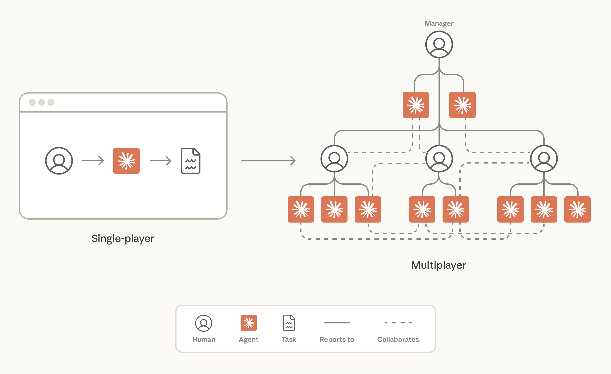
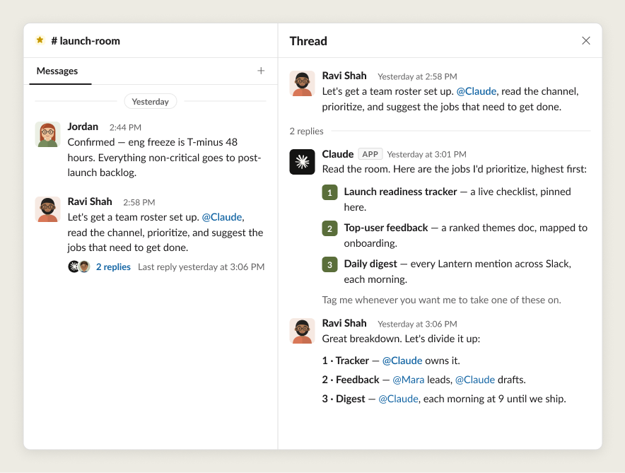
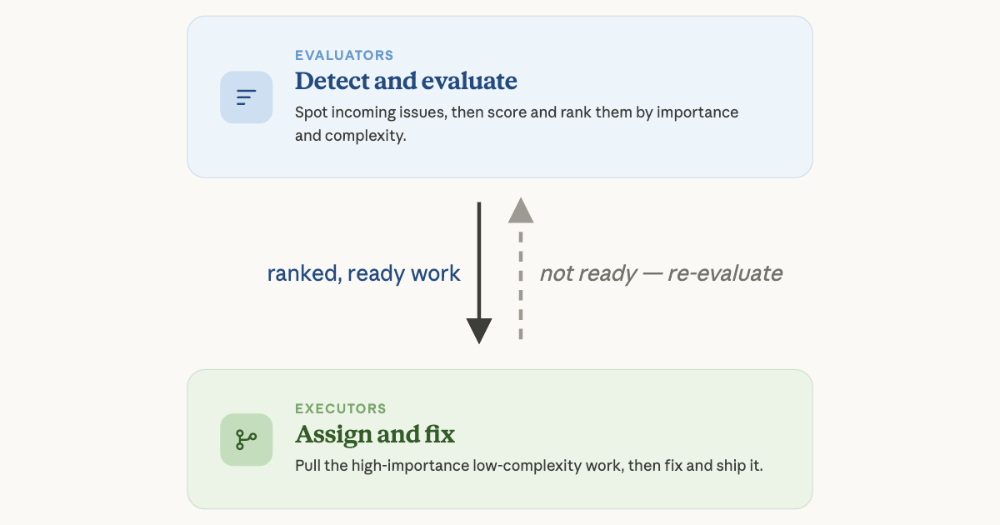

# 构建高效的人类-智能体团队（中英对照）

> **原文标题：** Building effective human-agent teams
> **作者：** Kristen Swanson（Anthropic 教育团队成员）
> **原文链接：** https://claude.com/blog/building-effective-human-agent-teams
> **发布日期：** 2026-06-24
> **翻译模型：** GLM-5.3
> 排版：每段英文原文在前，中文翻译紧随其后。术语保留英文原文并附中文释义。

---

The way we work with AI is evolving from a single-player to a multiplayer experience, where humans and agents work together as a team to achieve shared goals. The Anthropic team shares examples of this new way of working in action.

我们与 AI 协作的方式正在从"单人游戏"（single-player）演变为"多人游戏"（multiplayer）体验：人类与智能体（agent）像一个团队一样协作，共同实现共享目标。Anthropic 团队将分享这种新工作方式的实际案例。

The way we work with AI is evolving from a single-player to a multiplayer experience, where humans and agents work together as a team to achieve shared goals. We share examples of this new way of working in action.

我们与 AI 协作的方式正在从"单人游戏"演变为"多人游戏"体验：人类与智能体像一个团队一样协作，共同实现共享目标。我们将分享这种新工作方式的实际案例。

Working with AI used to mean one person interfacing with a single chat window. Over time, AI has become increasingly capable at handling complex, long-running work, like coding, research, and financial analysis. With this, we've seen many new ways to use AI-from the terminal and IDE to spreadsheets and decks-but the work has still very much been a "single-player" experience: one human worked with one agent to accomplish individual tasks.

过去，使用 AI 往往意味着一个人面对一个单独的聊天窗口。随着时间推移，AI 处理复杂、长时间运行的工作（如编程、研究和财务分析）的能力越来越强。与此同时，我们也看到了许多使用 AI 的新方式--从终端和 IDE 到电子表格和幻灯片--但这些工作在很大程度上仍是一种"单人游戏"体验：一个人与一个智能体协作完成各项任务。

This is changing with the release of tools like Claude Tag. Now, humans and agents can work together in the same workspace, collaborating in service of goals shared by a team. Work now looks a lot more like a multiplayer game, with teams of humans setting the strategy, and Claude executing the work.

随着 Claude Tag 这类工具的发布，情况正在改变。如今，人类和智能体可以在同一个工作空间中协同工作，为团队共同的目标而合作。工作现在更像一场多人游戏：人类团队制定战略，Claude 负责执行。

This involves some new ways of working. At Anthropic, we've been testing the technology required to make human-agent teams successful for the last several months. In this article, we explain what multiplayer agents are, and the lessons we've learned for building with them.

这带来了一些新的工作方式。过去几个月，Anthropic 一直在测试让人类-智能体团队（human-agent team）取得成功所需的技术。在本文中，我们将解释什么是多人智能体（multiplayer agent），以及我们在使用它们的过程中总结的经验教训。

# 什么是多人智能体？（What are multiplayer agents?）

"Multiplayer agents" is how we refer here to AI models that work with many different humans at the same time. Much like regular agents, they have their own memory and skills. But in other respects they're quite different. They have their own credentials and they live in places where work happens. At Anthropic, that's inside team collaboration tools like Slack.

"多人智能体"（multiplayer agent）是我们在本文中对同时与许多不同人类协作的 AI 模型的称呼。与普通智能体类似，它们拥有自己的记忆和技能。但在其他方面，它们又大不相同：它们拥有自己的凭据（credentials），并且驻留在工作实际发生的地方。在 Anthropic，这意味着 Slack 这样的团队协作工具内部。

Here's an example of a human-agent team analyzing a dataset together in Slack:

下面是一个人类-智能体团队在 Slack 中共同分析数据集的例子：

For agents to productively participate in a team channel, they need specific capabilities:

智能体要在团队频道中高效参与，需要具备以下特定能力：

- Persistent memory, so they can remember goals and tune their execution towards them
- Credentials not tied to humans, so they can operate within safe, predictable guardrails
- Ongoing broad access to information, so they can learn how the organization works and take action to execute tasks in service of the team's goals

- 持久记忆（persistent memory），使其能够记住目标并围绕目标调整执行
- 不与人类绑定的凭据，使其能够在安全、可预期的护栏（guardrail）内运作
- 持续、广泛的信息访问权限，使其能够了解组织的运作方式，并采取行动执行服务于团队目标的任务

These capabilities amount to the technical foundation required for an agent to participate productively across a team of many humans. However, making human-agent teams successful requires more than this: teams need specific ways of working and shared norms, too.

这些能力构成了智能体在由多名人类组成的团队中高效参与所需的技术基础。然而，要让人类-智能体团队取得成功，仅有这些还不够：团队还需要特定的工作方式和共同的规范。

# 经验一：公开工作，并给智能体充分的上下文（Lesson 1: Work in public and give agents broad context）

Teams at Anthropic share information proactively and openly. This is especially true when agents are on the team, because agents build their understanding entirely from the text a team makes searchable: Slack, code, docs, and meeting notes. Private messages, hallway conversations, and restricted documents can't provide agents with context. For an agent, if it's not written down and accessible, it doesn't exist.

Anthropic 的团队会主动、开放地共享信息。当团队中有智能体时尤其如此，因为智能体的理解完全建立在团队能让其检索到的文本之上：Slack、代码、文档和会议纪要。私信、走廊里的闲谈和受限文档无法为智能体提供上下文。对智能体而言，没有写下来且无法访问的东西，就等于不存在。

Instead of deciding what information should be available to agents one doc or Slack channel at a time, we use clearly defined security boundaries that apply to entire Slack workspaces, as well as to meeting transcripts and doc libraries. Within the security boundary, context flows to every teammate-whether human or AI. Not only does this increase what agents and humans get access to, it also reduces confusion about what can be shared and with whom. Humans and agents alike find it difficult to navigate the soft boundaries of per-item sharing: should this channel be public or private? Can I share this doc with that person? Is this agent allowed to see that thread? A small number of clear, workspace-level boundaries removes decision fatigue from day-to-day work.

我们不是逐个文档、逐个 Slack 频道地决定哪些信息应对智能体开放，而是使用明确定义的安全边界（security boundary），作用于整个 Slack 工作区以及会议记录和文档库。在安全边界之内，上下文会流向每一位团队成员--无论人类还是 AI。这不仅增加了智能体和人类可访问的内容，也减少了"什么可以共享、与谁共享"带来的困惑。人类和智能体都很难驾驭按条目共享的软性边界：这个频道应该公开还是私密？我能把这份文档分享给那个人吗？这个智能体可以查看那个讨论串吗？少量清晰的工作区级边界，能把决策疲劳从日常工作中消除。

A high degree of transparency has a reward. For instance, agents that can read decisions from team meetings won't suggest tasks or projects that were deprioritized. Agents with access to product specs beyond their own team can recommend patterns that have succeeded for others. And because agents can read enormous volumes of text far faster than humans do, they routinely surface relevant work that humans would otherwise have missed. We lean on our agents heavily to stay informed and coordinated in a busy, fast-moving industry.

高度的透明是有回报的。例如，能够读到团队会议决策的智能体，不会再去建议已被降低优先级（deprioritize）的任务或项目；能访问本团队之外产品规格的智能体，可以推荐别人已经成功的模式。而且由于智能体阅读海量文本的速度远超人类，它们经常能挖掘出人类原本会遗漏的相关工作。在这个忙碌、快速变化的行业里，我们高度依赖智能体来保持信息灵通和步调一致。

At Anthropic, working in public looks like:

在 Anthropic，公开工作的具体做法包括：

- Choosing a handful of security boundaries at the company and creating workspaces and document sharing settings that match each security boundary
- Defaulting new communication channels to public within the organization, and ensuring decisions land in channels, docs, and meeting notes every time
- Writing artifacts and meeting notes so that agents can find them, since agents are now a primary consumer of team documentation
- Making sure AI has access to the right tools and information needed to get their job done

- 在公司层面选定少数几个安全边界，并创建与每个安全边界相匹配的工作区和文档共享设置
- 将新的沟通频道默认设为组织内公开，并确保每次决策都会落到频道、文档和会议纪要中
- 以智能体能够检索到的方式撰写产出物（artifact）和会议纪要，因为智能体如今是团队文档的主要消费者
- 确保 AI 拥有完成工作所需的合适工具和信息

Defaulting information to be internally public can require cultural shifts. However, the difference between human-agent teams with context and those without is too stark to ignore.

将信息默认设为对内公开可能需要文化上的转变。不过，拥有上下文与缺乏上下文的人类-智能体团队之间的差距太过明显，不容忽视。

Of course, some interactions are sensitive and will need to be private between a single human and AI. For those, with Claude Tag you can send @Claude a direct message, or you can use the existing Claude.ai and Claude Cowork applications. These tools give Claude access to private information via your personal MCP connectors, with the knowledge that your conversation and what you share with the agent will remain private.

当然，有些交互是敏感的，需要在一人与 AI 之间保持私密。对于这类场景，你可以通过 Claude Tag 给 @Claude 发私信，也可以使用现有的 Claude.ai 和 Claude Cowork 应用。这些工具通过你个人的 MCP 连接器（connector）让 Claude 访问私密信息，同时你可以确信，你的对话以及你与智能体共享的内容都会保持私密。

# 经验二：每个人类和智能体都有明确的角色和称手的工具（Lesson 2: Every human and agent get a defined role with the right tools for the job）

Human-agent teams share one roster, one set of artifacts, and one working space. Agents have their own credentials, skills, and tool access. Different agents also hold different roles: for instance, while one might own the data analysis for a project, another will hold and enforce the design standard, and a third will run research synthesis.

人类-智能体团队共享同一份花名册、同一套产出物和同一个工作空间。智能体拥有自己的凭据、技能和工具访问权限。不同的智能体也承担不同的角色：例如，一个可能负责项目的数据分析，另一个掌握并执行设计规范，第三个则负责研究综合（research synthesis）。

When a project kicks off, humans chat with the agents to figure out which roles to assign, and how the humans and agents will work together.

项目启动时，人类会与智能体沟通，确定分配哪些角色，以及人类和智能体将如何协作。

Once the jobs for humans and agents are clear, an agent might spin up other agents to make sure that specific tasks are handled by the agents with the right memory and appropriate access. Importantly, they need access to all the tools required to accomplish the job: one that handles data analysis might need access to BigQuery, and one that performs QA might need access to the Playwright MCP.

一旦人类和智能体的分工明确，某个智能体可能会再启动（spin up）其他智能体，以确保特定任务由拥有合适记忆和适当权限的智能体来处理。重要的是，它们需要访问完成工作所需的全部工具：负责数据分析的智能体可能需要访问 BigQuery，执行 QA 的智能体可能需要访问 Playwright MCP。

Clearly defined roles and responsibilities set human-agent teams up for success. Humans often work in the same threads the agents do, but they hold the roles only humans can hold. This ensures everything works together and human judgment is applied to the most important decisions. Without clear roles, people end up running fleets of personal AIs on the side, duplicating work and fracturing the team's context. Metrics tracking is a common case: a multiplayer agent can do the job once and let everyone see the same numbers.

明确界定的角色和职责是人类-智能体团队取得成功的基础。人类常常与智能体在同一些讨论串中工作，但由人类承担只有人类才能承担的角色。这确保了各项工作协调一致，并且最重要的决策由人类判断把关。如果没有明确的角色，人们最终会在私底下运行大量个人 AI，造成重复劳动，也割裂了团队的上下文。指标跟踪就是一个常见例子：一个多人智能体可以把这项工作一次性做好，让所有人看到同样的数字。

At Anthropic, having clearly defined roles on human-agent teams looks like:

在 Anthropic，为人类-智能体团队设定明确角色的具体做法包括：

- An agreed-upon task set: the team's humans and its agents agree on who does what
- Humans and agents working in the same shared threads, so anyone can pick up where anyone left off
- Humans and agents that have access to the right tools to accomplish their respective jobs
- Descriptions of agents' roles and scopes

- 一套约定好的任务集：团队中的人类和智能体就"谁做什么"达成一致
- 人类和智能体在相同的共享讨论串中工作，任何人都能接着其他人中断的地方继续
- 人类和智能体各自拥有完成本职工作所需的合适工具
- 对智能体角色和职责范围的描述

> Claude agents share the day-to-day maintenance of a codebase, triaging feedback, planning, writing code, reviewing changes, and reporting status. Each owns a clear task and works on its own schedule; people set the goals and review output.
> Claude 智能体共同承担代码库的日常维护：分拣反馈、规划、编写代码、审查变更、汇报状态。每个智能体都拥有明确的任务并按自己的节奏工作；由人来设定目标并审查产出。

An engineering team at Anthropic started creating rosters to help codify human and agent roles because it made driving their work much easier and more concrete. Some things that clicked for them early on:

Anthropic 的一个工程团队开始编写花名册来明确人类和智能体的角色，因为这让推动工作变得更轻松、更具体。他们很早就体会到了以下几点：

- Specific roles also help humans easily track where responsibility for a task lies, whether that's in individual tasks or an entire team's set of responsibilities
- Writing skill files to define specific agents' roles helps to make specialization easy, and allows people across the company to quickly stand up other agents of the same type
- The team adds new agents to focus on new areas when projects get more complex. For example, they added a release manager agent to deal with new software releases.

- 明确的角色还能帮助人类轻松追踪某项任务的责任归属，无论是单个任务还是整个团队的职责集合
- 编写技能文件（skill file）来定义特定智能体的角色，有助于轻松实现专业化，也让公司里的其他人能快速搭建起同类型的其他智能体
- 当项目变得更复杂时，团队会添加新的智能体来专注新的领域。例如，他们添加了一个发布经理（release manager）智能体来处理新的软件发布。

These methods let humans' mental model of a human-agent team scale as the number of agents grows.

这些方法让人类对人类-智能体团队的心智模型能够随智能体数量的增长而扩展。

# 经验三：设定北极星目标，让智能体更主动（Lesson 3: Set a north star to make agents more proactive）

Although some agents at Anthropic simply complete assigned tasks, the most important ones proactively suggest new projects and workstreams. This often happens when a team that has already given its agents rich context and clear roles adds another guide: a north star.

尽管 Anthropic 的一些智能体只是完成分配的任务，但最重要的那些智能体会主动提出新项目和新工作流（workstream）。这往往发生在团队已经给智能体提供了丰富上下文和明确角色之后，又添加了另一重指引：北极星（north star）。

North stars are ambitious, wide-reaching goals that help teams decide which tasks and workstreams are the right ones. At Anthropic, humans always set the north star, grounding it in the mission and goals of the business.

北极星是雄心勃勃、影响广泛的目标，能帮助团队判断哪些任务和工作流才是正确的。在 Anthropic，北极星始终由人类设定，并立足于公司的使命和业务目标。

Once a north star is clearly articulated in writing, humans share it with the agents on their team. Then, importantly, humans choose which agents should proactively suggest new workstreams to help achieve this long-term goal. (It's unlikely that every agent on the team will have the prerequisite skills and trust to proactively suggest work successfully.)

一旦北极星被清晰地写成文字，人类就会与团队中的智能体分享它。接着，很重要的一步是，由人类选择哪些智能体应当主动提出新的工作流，以帮助实现这个长期目标。（团队中的每个智能体都不太可能同时具备主动成功提出工作所需的技能和信任。）

For example, an internal tools team with a north star to "make product onboarding more helpful" saw an agent proactively recommended copy revisions to the onboarding flow error messages. These changes measurably increased onboarding success the following week.

例如，一个以"让产品新手引导更有帮助"为北极星的内部工具团队，发现一个智能体主动建议修改新手引导流程错误提示的文案。随后一周，这些改动可衡量地提升了新手引导的成功率。

At Anthropic, setting a north star looks like:

在 Anthropic，设定北极星的具体做法包括：

- Having humans discuss, debate, and document an ambitious north star goal for their human-agent team-one that's rooted in the company's mission and business goals
- Sharing the north star with agents on the team and explicitly naming which agents can proactively recommend new workstreams
- Keeping high-fidelity human time protected on the calendar, with meetings now focused on the most important work

- 由人类为自己的智能体团队讨论、辩论并记录一个雄心勃勃的北极星目标--一个植根于公司使命和业务目标的目标
- 与团队中的智能体分享北极星，并明确指定哪些智能体可以主动推荐新的工作流
- 在日程表上保护高保真的人类时间，让会议聚焦于最重要的工作

A clear north star gives agents a consistent direction to work toward and meaningful opportunities to proactively support a team's work.

清晰的北极星为智能体提供了始终如一的努力方向，以及主动支持团队工作的有意义的机会。

# 经验四：随着时间推移建立信任（Lesson 4: Build trust over time）

Teams at Anthropic grant agents autonomy in proportion to demonstrated reliability, then expand it deliberately. Engineers have successfully dispatched agents on their team to handle 500 bug fixes independently, but things certainly didn't start off that way.

Anthropic 的团队会根据智能体已展现的可靠性授予相应自主权，然后再审慎地扩大权限。工程师们已成功派出团队中的智能体独立处理 500 个 bug 修复，但事情当然不是一开始就这样。

When a new human colleague joins the team, it takes time to assess their capabilities and develop strong working routines. It usually takes multiple feedback cycles to externalize all the tacit information about how tasks are best completed. The same is true for agents. Users have to experiment with giving agents many different tasks so they can learn what the agent is capable of, how to clearly describe the goal, what skill files it needs, and what prompts work best to elicit a desired behavior. It's also important to retest tasks as models change and improve. Prompts may need re-wording and guardrails that used to be helpful may constrain a smarter model from pursuing more creative solutions.

当一位新的人类同事加入团队时，评估其能力、建立稳固的工作惯例需要时间。要把"如何把任务做到最好"的全部隐性知识显性化，通常需要多轮反馈循环。智能体也是如此。用户必须通过给智能体分配许多不同的任务来进行试验，才能了解智能体的能力边界、如何清晰描述目标、它需要哪些技能文件，以及哪些提示词（prompt）最能引发期望的行为。随着模型的更迭和进步，重新测试任务也很重要。提示词可能需要改写，过去有用的护栏也可能束缚更聪明的模型，使其无法追求更有创造性的解决方案。

Notably, we've found that the best long-running agents have many different ways to verify their work before a human looks at it. Code has tests, of course, but most other work can be verified as well. For example, technical docs can have rubrics and style guides applied to them. When humans set the bar and ensure all work assigned to an agent can be vetted, quality stays high and doesn't drift from the original intention. Separately, as with humans, it often helps to give one agent the job of doing the task and another agent the job of checking the first agent's work. This is often called the "Doer-Verifier" agent harness.

值得注意的是，我们发现最好的长时间运行智能体在人类查看之前，就有多种不同的方式来验证自己的工作。代码当然有测试，但大多数其他工作同样可以被验证。例如，可以对技术文档应用评分标准（rubric）和风格指南。当人类设定标准并确保分配给智能体的所有工作都能被审查时，质量就会保持高位，不会偏离最初的意图。另外，与人类一样，让一个智能体负责执行任务、另一个智能体负责检查前者工作的做法往往很有效。这通常被称为"执行者-验证者"（Doer-Verifier）智能体 harness。

At Anthropic, building trust with agents over time looks like:

在 Anthropic，随时间推移与智能体建立信任的具体做法包括：

- Reviewing agent work manually in the beginning to vet quality, provide feedback, and design task verification checklists
- Telling the agent to use a "verifier" agent to check its work as part of the task
- Building reflection into the cycle and asking agents to review their own misses so work improves over time
- Tracking which kinds of tasks each agent has earned autonomy on and expanding scope per task type after repeated successes

- 起初人工审查智能体的工作，以检验质量、提供反馈，并设计任务验证清单
- 告诉智能体把使用"验证者"（verifier）智能体检查自己的工作作为任务的一部分
- 在循环中引入复盘（reflection），让智能体审视自己的失误，使工作质量随时间提升
- 跟踪每个智能体在哪些类型的任务上赢得了自主权，并在反复成功后按任务类型逐步扩大授权范围

One engineering leader at Anthropic took on a new team with a big backlog. To get a handle on it, he invited a few humans and a few agents to help him sort through the backlog and prioritize what was most important. One set of agents on the team read through all of the items in the backlog, figured out if anyone was working on the items, and assigned a complexity score to anything that was unowned. The other set read from the list, filtered to the medium and low complexity items, and created code changes. At the beginning, humans reviewed every decision made by an agent and marked any that required human input. Then the humans taught the agents to surface those decisions to humans directly, ensuring that decisions with hard tradeoffs always had a human in the loop.

Anthropic 的一位工程负责人接手了一个积压了大量工作的新团队。为了掌控局面，他邀请了几位人类和几个智能体帮忙梳理积压任务并排列优先级。团队中的一组智能体通读了积压列表中的所有条目，弄清是否有人正在处理这些条目，并为无人认领的条目评定复杂度分数。另一组智能体则从列表中筛选出中等和低复杂度的条目并创建代码变更。起初，人类会审查智能体做出的每一个决定，并标记出任何需要人类介入的决定。随后，人类教会智能体把这些决定直接提交给人类，确保存在艰难权衡的决定始终有人类参与（human in the loop）。

Every week, the leader and his team asked the agents to compile a weekly report that included "lessons & missteps" so the agents would keep track of mistakes and avoid making them again in the future. Over time, the leader was able to give more and more complex code changes to his agents and spend less time guiding the agents' day to day tasks.

每周，这位负责人和他的团队都会让智能体编写一份包含"经验与失误"的周报，让智能体记录错误并避免将来重犯。随着时间推移，他能够把越来越复杂的代码变更交给智能体，而花在指导智能体日常任务上的时间越来越少。

And once the agents were more independent, the leader coached them to treat human attention as the scarce resource it is: to batch questions to be answered in a single pass, repeat key context to get a human up to speed quickly, and limit how many things each human sees at once.

而当智能体更加独立之后，这位负责人开始指导它们把人类的注意力当作稀缺资源来对待：把问题批量打包、一次性作答；重复关键上下文，让人类迅速进入状态；并限制每位人类一次能看到的内容数量。

Helping agents communicate well ensures that they remain helpful and effective. Some people have agents in their team with the sole role of deciding how to batch and elevate only the most important communication for human team members. Others set guardrails around how much work agents should do per day, so that humans are able to meaningfully engage with the work. Such guardrails ensure that humans maintain skills that are important to them, and that the number of items requiring human review stays sustainable.

帮助智能体做好沟通，能确保它们持续有用、高效。有些人的团队中设有专职智能体，其唯一职责就是决定如何打包并只向人类团队成员呈报最重要的沟通内容。另一些人为智能体每天应做的工作量设置护栏，使人类能够有意义地参与工作。这样的护栏确保人类保住对自己重要的技能，也让需要人类审查的事项数量保持在可持续的水平。

# 值得自问的问题（Questions to ask）

As you're laying the foundation for your human-agent teams, consider the following questions:

在你为人类-智能体团队打下基础时，不妨思考以下问题：

- Is all the information and access that agents and humans need both public and broadly searchable?
- Can you write down your team's roster (humans and agents), and say what each member owns?
- Does every human and agent on the team have access to the right tools to perform their job?
- Do you have rubrics or tests for humans and agents to verify key work products?
- Does your team have a clear north star that everyone can reference?

- 智能体和人类所需的所有信息和访问权限，是否既公开又易于广泛检索？
- 你能否写下团队的花名册（人类和智能体），并说明每个成员负责什么？
- 团队中的每个人类和智能体是否都拥有完成本职工作所需的合适工具？
- 你是否有人类和智能体用来验证关键工作成果的评分标准或测试？
- 你的团队是否有一个每个人都能引用的清晰北极星？

# 展望未来（Moving forward）

None of these patterns are new-at least not for humans. A strong north star, clear roles, strong documentation, a shared bar for quality, and room to learn from mistakes are the healthy team habits we've known for decades. Agents just make it even more important not to skip them.

这些模式没有一个是新东西--至少对人类而言如此。强有力的北极星、清晰的角色、完善的文档、统一的质量标准，以及从错误中学习的空间，都是我们几十年来熟知的健康团队习惯。智能体只是让"不跳过这些步骤"变得更重要了。

The teams getting the most from their agents are the ones who are most intentional about applying these fundamentals.

从智能体身上收获最多的团队，正是那些最有意识地践行这些基本原理的团队。

Acknowledgements

致谢

This article was written by Kristen Swanson, a member of the Education team at Anthropic. She'd like to thank Matt Bell, Erik Olesund, Hasnain Lakhani, Shale Craig, Nolan Caudill, Mike Schiraldi, Aleks Todorova, and Molly Vorwerck for their contributions to this piece.

本文由 Kristen Swanson 撰写，她是 Anthropic 教育团队（Education team）成员。她要感谢 Matt Bell、Erik Olesund、Hasnain Lakhani、Shale Craig、Nolan Caudill、Mike Schiraldi、Aleks Todorova 和 Molly Vorwerck 对本文的贡献。

Start building multiplayer agents using agent teams in Claude Code or by using Claude Tag.

使用 Claude Code 中的 agent teams 或 Claude Tag，开始构建你的多人智能体吧。
