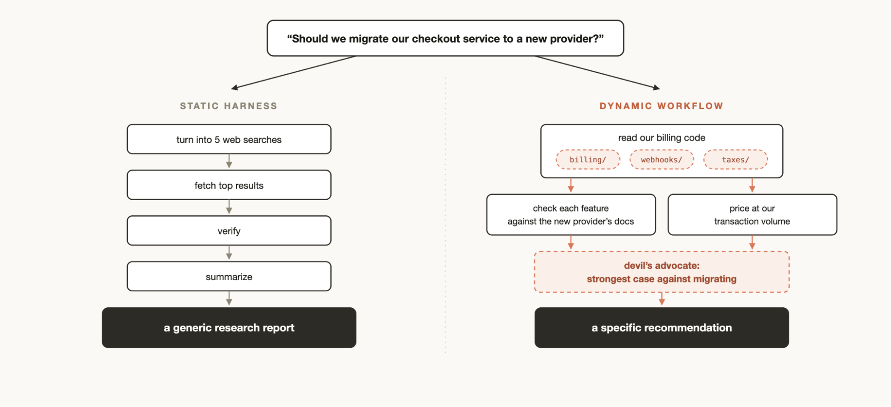
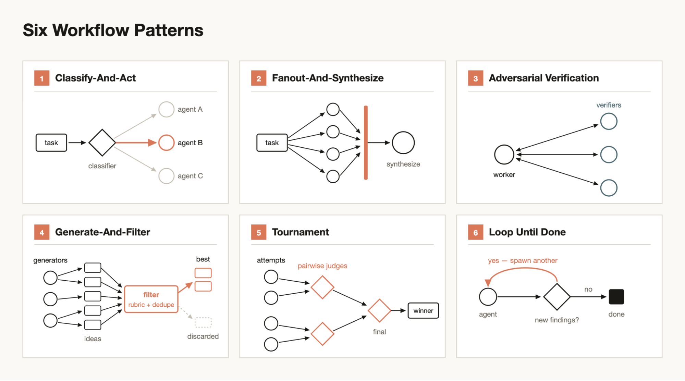
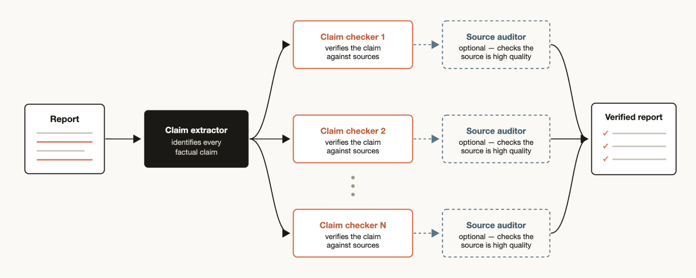

# 为每个任务打造 harness：Claude Code 中的动态工作流（中英对照）

> **原文标题：** A harness for every task: dynamic workflows in Claude Code
> **作者：** Thariq Shihipar、Sid Bidasaria（Anthropic 技术团队成员）
> **原文链接：** https://claude.com/blog/a-harness-for-every-task-dynamic-workflows-in-claude-code
> **发布日期：** 2026-06-02
> **翻译模型：** GLM-5.3
> 排版：每段英文原文在前，中文翻译紧随其后。术语保留英文原文并附中文释义。

---

Claude Code can now write and orchestrate its own multi-agent harness on the fly. Here's how dynamic workflows work, and the patterns that get the most out of them.

Claude Code 现在可以即时（on the fly）编写并编排自己的多智能体（multi-agent）harness。本文介绍动态工作流（dynamic workflow）的工作原理，以及最能发挥其威力的模式。

Claude Code can now write and orchestrate its own multi-agent harness on the fly. Here's how dynamic workflows work, and the patterns that get the most out of them.

Claude Code 现在可以即时编写并编排自己的多智能体 harness。本文介绍动态工作流的工作原理，以及最能发挥其威力的模式。

Last week, we released dynamic workflows in Claude Code. Claude can now write its own harness on the fly, custom-built for the task at hand.

上周，我们在 Claude Code 中发布了动态工作流（dynamic workflow）。Claude 现在可以针对手头的任务，即时编写量身定制的 harness。

While the default Claude Code harness is built for coding, it is also useful for many other types of tasks because, as it turns out, many tasks resemble coding tasks. But there are certain classes of tasks where we have had to build custom harnesses on top of Claude Code to achieve peak performance such as Research, security analysis, agent teams, or Code Review.

默认的 Claude Code harness 是为编程构建的，但它对许多其他类型的任务同样有用，因为事实证明，许多任务与编程任务相似。不过，对于某些类别的任务--如研究、安全分析、智能体团队（agent team）和代码审查（Code Review）--我们不得不在 Claude Code 之上构建定制 harness，才能获得峰值性能。

Workflows allow you to dynamically create harnesses built on top of Claude Code that enable Claude to solve all of those problems more natively. You can also share and reuse these workflows with others.

工作流（workflow）让你能够动态地创建构建于 Claude Code 之上的 harness，使 Claude 可以更原生的地解决上述所有问题。你还可以与他人分享和复用这些工作流。

In this article, I'll cover my initial workflows experiences and learnings so you can best take full advantage. Keep in mind, best practices are still developing: dynamic workflows often use more tokens and are best suited for complex, high value tasks.

在本文中，我将分享我初期使用工作流的经验和心得，帮助你充分利用这一能力。请记住，最佳实践仍在发展之中：动态工作流通常会消耗更多 token，最适合复杂、高价值的任务。

# 示例提示词（Example prompts）

Before diving into the technical details, I'd like to start with several example prompts to get you thinking about the possibilities with workflows:

在深入技术细节之前，我想先给出几个示例提示词（prompt），启发你思考工作流的可能性：

"This test fails maybe 1 in 50 runs. Set up a workflow to reproduce it. Form competing theories about the race, and don't stop until one theory survives the evidence."

"这个测试大概每 50 次运行会失败 1 次。建立一个工作流来复现它。围绕这个竞态（race）提出多个相互竞争的假设，在某个假设经得起证据检验之前不要停下。"

"Using a workflow, go through my last 50 sessions and mine them for corrections I keep making and turn the recurring ones into CLAUDE.md rules"

"用一个工作流梳理我最近 50 个会话，从中挖掘我反复做出的纠正，并把反复出现的那些转化为 CLAUDE.md 规则"

"Use a workflow to dig through #incidents in Slack for the past six months and find recurring root causes where nobody has filed a ticket."

"用一个工作流深挖 Slack 中 #incidents 频道过去六个月的记录，找出反复出现却无人提交工单的根因。"

"Take my business plan and run a workflow where different agents tear it apart from an investor's, a customer's, and a competitor's perspective."

"拿上我的商业计划书，运行一个工作流，让不同的智能体分别从投资者、客户和竞争对手的视角对它进行挑刺。"

"Here's a folder of 80 resumes, use a workflow to rank them for the backend role and double-check the top ten. Interview me using the AskUserQuestion tool for a rubric."

"这里有一个装着 80 份简历的文件夹，用一个工作流为这个后端岗位对它们排序，并复核前十名。使用 AskUserQuestion 工具面试我，以确定评分标准（rubric）。"

"I need a name for this CLI tool. Use a workflow to brainstorm a bunch of options and run a tournament to pick the top 3."

"我需要给这个 CLI 工具起个名字。用一个工作流头脑风暴出一批候选，然后办一场锦标赛（tournament）选出前 3 名。"

"Use a workflow to rename our User model to Account everywhere."

"用一个工作流把我们的 User 模型在各处统一改名为 Account。"

"Go through my blog post draft and verify every technical claim against the codebase using a workflow, I don't want to ship anything wrong."

"用一个工作流通读我的博客草稿，并对照代码库验证其中每一个技术论断，我不想发布任何错误的内容。"

# 动态工作流的工作原理（How dynamic workflows work）

Dynamic workflows execute a javascript file with a few special functions that help spawn and coordinate subagents:

动态工作流会执行一个 JavaScript 文件，其中包含若干用于生成和协调 subagent 的特殊函数：

Dynamic workflows also include standard JavaScript functions like JSON, Math, and Array, to help process data.

动态工作流还包含 JSON、Math、Array 等标准 JavaScript 函数，帮助处理数据。

It's particularly useful to know that dynamic workflows can decide which models an agent uses and whether subagents are run in their own worktree, allowing Claude to choose the intelligence level and isolation needed.

特别有用的一点是，动态工作流可以决定某个智能体使用哪些模型，以及 subagent 是否在各自独立的工作树（worktree）中运行，让 Claude 能够按需选择智能水平和隔离程度。

If a workflow is interrupted, for example by user action or quitting the terminal, resuming the session will allow the workflow to pick up where it left off.

如果工作流被中断--例如因用户操作或退出终端--恢复会话后，工作流可以从中断处继续执行。

# 为什么需要动态工作流（Why dynamic workflows）

When you ask the default Claude Code harness to do a task, it needs to both plan and execute in the same context window. For many coding tasks, this is highly effective, but it can break down over long-running, massively parallel, highly structured and/or adversarial tasks.

当你让默认的 Claude Code harness 执行任务时，它需要在同一个上下文窗口（context window）中完成规划和执行。对许多编程任务来说，这非常高效；但在长时间运行、大规模并行、高度结构化和/或对抗性的任务上，这种模式可能会失效。

This is because the longer Claude works on a complex task in a single context window, the more it becomes susceptible to a few specific failure modes:

这是因为 Claude 在单个上下文窗口中处理复杂任务的时间越长，就越容易受到几种特定失效模式（failure mode）的影响：

- Agentic laziness refers to when Claude stops before finishing a particularly complex, multi-part task and declares the job done after partial progress, for example addressing 35 of the 50 items in a security review.
- Self-preferential bias refers to Claude's tendency to prefer its own results or findings, especially when asked to verify or judge them against a rubric.
- Goal drift refers to the gradual loss of fidelity to the original objective across many turns, especially after compaction. Each summarization step is lossy, and details like edge-case requirements or "don't do X" constraints can get lost.

- 智能体惰性（agentic laziness）指 Claude 在完成一项特别复杂的多环节任务之前就停下来，并在取得部分进展后宣称任务已完成，例如在一次安全审查中只处理了 50 项中的 35 项。
- 自我偏好偏差（self-preferential bias）指 Claude 倾向于偏爱自己的结果或发现，尤其是在被要求对照评分标准验证或评判它们时。
- 目标漂移（goal drift）指经过许多轮对话后，对最初目标的忠实度逐渐丧失，尤其是在压缩（compaction）之后。每一次摘要步骤都是有损的，边界情况要求或"不要做 X"之类的约束细节可能会丢失。

Creating a workflow helps combat these by orchestrating separate Claude subagents with their own context windows and focused, isolated goals.

创建工作流有助于对抗这些问题：它会编排多个各自拥有独立上下文窗口和聚焦、隔离目标的 Claude subagent。

# 动态工作流 vs 静态工作流（Dynamic vs static workflows）

You may have previously created a static workflow using the Claude Agent SDK or claude -p to coordinate multiple instances of Claude Code together.

你可能此前已经用 Claude Agent SDK 或 claude -p 创建过静态工作流（static workflow），把多个 Claude Code 实例协调在一起。

But because static workflows need to work for all edge cases, they are usually more generic. With Claude Opus 4.8 and dynamic workflows, Claude is now intelligent enough to write a custom harness tailor-made for your use case.

但由于静态工作流必须适用于所有边界情况（edge case），它们通常更为通用。有了 Claude Opus 4.8 和动态工作流，Claude 已经聪明到可以为你的具体用例量身定制一个 harness。

# 使用动态工作流的实用模式（Helpful patterns when using dynamic workflows）

You can start using dynamic workflows just by asking Claude to make one, or by using the trigger word "ultracode" to ensure that Claude Code creates a workflow.

只要让 Claude 创建一个工作流，你就可以开始使用动态工作流了；或者使用触发词"ultracode"来确保 Claude Code 创建工作流。

But building a mental model for how dynamic workflows work will help you understand when to use them and how you might nudge Claude via prompts.

但为动态工作流的工作原理建立心智模型，会帮助你理解何时使用它们，以及如何通过提示词引导 Claude。

There are a few common patterns that Claude might use and compose together when building workflows:

Claude 在构建工作流时，可能会使用并组合以下几种常见模式：

## 分类后执行（Classify-and-act）

Use a classifier agent to decide on the type of task, and then route to different agents or behavior based on the task. Or, use a classifier at the end to determine output.

用一个分类器智能体（classifier agent）判断任务类型，再根据任务路由到不同的智能体或行为。或者在最后用一个分类器来决定输出。

## 扇出再综合（Fan-out-and-synthesize）

Split up a task into many smaller steps, run an agent on each step and then synthesize those results. This is particularly useful for when there are a large number of smaller steps, or when each step benefits from its own clean context window so they don't interfere or cross-contaminate. The synthesize step is a barrier-it waits for all the fan-out agents, then merges their structured outputs into one result.

把任务拆分成许多更小的步骤，每个步骤各由一个智能体执行，然后综合这些结果。当小步骤数量庞大，或每个步骤都受益于拥有自己干净的上下文窗口、从而互不干扰或交叉污染时，这种模式尤其有用。综合步骤是一道屏障--它会等待所有扇出（fan-out）的智能体完成，再把它们的结构化输出合并为一个结果。

## 对抗性验证（Adversarial verification）

For each spawned agent, run a separate spawned agent to adversarially verify its output against a rubric or criteria.

为每个生成的智能体，再单独生成一个智能体，对照评分标准或验收条件对其输出进行对抗性验证。

## 生成再过滤（Generate-and-filter）

Generate a number of ideas on a topic and then filter them by a rubric or by verification, dedupe duplicates and return only the highest quality, tested ideas.

围绕某个主题生成一批想法，然后用评分标准或验证手段进行过滤，去除重复项，只返回质量最高、经过检验的想法。

## 锦标赛（Tournament）

Instead of dividing the work, have agents compete on it. Spawn N agents that each attempt the same task using different approaches. Prompts or models then judge the results in a pairwise fashion using a judging agent until you have a winner.

不是分摊工作，而是让智能体围绕同一项工作展开竞争。生成 N 个智能体，各自用不同的方法尝试同一任务。然后由提示词或模型通过评判智能体（judging agent）以两两对比（pairwise）的方式评判结果，直到决出胜者。

## 循环直到完成（Loop until done）

For tasks with an unknown amount of work, loop spawning agents until a stop condition is met (no new findings, or no more errors in the logs) instead of a fixed number of passes.

对于工作量未知的任务，循环生成智能体，直到满足停止条件（不再有新发现，或日志中不再有错误），而不是固定运行多少轮。

# 用例（Use cases）

Think creatively of when and how to ask Claude Code to make dynamic workflows. I've found that workflows are sometimes even more useful for non-technical work.

发挥创造力，想想何时以及如何让 Claude Code 创建动态工作流。我发现工作流有时对非技术工作甚至更有用。

## 迁移与重构（Migrations and refactors）

Bun was rewritten from Zig to Rust using workflows. You can read more about how that was done in Jarred's X thread or see how we run AI code migrations across million-line codebases.

Bun 就是使用工作流从 Zig 重写为 Rust 的。你可以在 Jarred 的 X 帖子中了解更多细节，或看看我们如何在百万行级别的代码库中运行 AI 代码迁移。

The key is to break down the task into a series of steps that need to be operated on for example callsites, failing tests, modules, etc. Spin off a subagent for every fix in a worktree to make the fix, then have another agent adversarially review, and merge them. Consider telling the agent not to use resource intensive commands so that you can maximally parallelize without running out of resources on your machine.

关键在于把任务分解为一系列需要逐一处理的步骤，例如调用点（callsite）、失败的测试、模块等。在独立工作树中为每个修复派生一个 subagent 来完成修复，然后让另一个智能体进行对抗性审查，最后合并。可以考虑告诉智能体不要使用资源密集型命令，这样你就能最大限度并行，而不会耗尽机器资源。

## 深度研究（Deep research）

We published a deep research skill (/deep-research) inside Claude Code that uses dynamic workflows. Specifically, it fans-out web searches, fetches sources, adversarially verifies their claims, and synthesizes a cited report.

我们在 Claude Code 中发布了一个使用动态工作流的深度研究技能（/deep-research）。具体来说，它会扇出多个网络搜索、抓取来源、对来源论断进行对抗性验证，并综合成一份带引用的报告。

But you may do this sort of research for more than just web searches. For example, asking Claude to compile a status report from context in Slack or to research how a feature works by exploring a codebase in-depth.

但这类研究并不限于网络搜索。例如，可以让 Claude 根据 Slack 中的上下文编写状态报告，或者通过深入探索代码库来研究某个功能是如何实现的。

## 深度验证（Deep verification）

On the other hand, if you have a report where you want to check and source every factual claim that it references you may want to generate a workflow which has one agent identify all of the factual claims and then spin off a subagent to check each one in-detail. You could also have a verification agent check the source subagent to make sure its source is high quality.

反过来，如果你有一份报告，想检查并溯源其中引用的每一个事实性论断，你可以生成一个这样的工作流：先让一个智能体识别所有事实性论断，然后为每条论断派生一个 subagent 逐一详查。你还可以让一个验证智能体检查负责查源的 subagent，确保它找到的来源质量可靠。

## 排序（Sorting）

You may have a list of items that you want to sort by some qualitative measurement that you believe that Claude Code is good at evaluating, for example: support tickets sorted by severity of the bug. But if you try to sort 1000+ rows in one prompt, quality degrades and it won't fit in context. Instead run a tournament, a pipeline of pairwise-comparison agents (comparative judgment is more reliable than absolute scoring), or bucket-rank in parallel then merge. Each comparison is its own agent, so the deterministic loop holds the bracket and only the running order stays in context.

你可能有一列条目，想按某种你认为 Claude Code 擅长评估的定性指标排序，例如按 bug 严重程度对客服工单排序。但如果你试图在一次提示中排序 1000 多行，质量会下降，而且上下文也装不下。取而代之的做法是：运行一场锦标赛、一条由两两对比智能体组成的流水线（比较判断比绝对打分更可靠），或者并行做分桶排序再合并。每次比较都是独立的智能体，因此确定性的循环持有对阵表（bracket），上下文中只保留当前的运行顺序。

## 记忆与规则遵循（Memory and rule adherence）

If you have a particular set of rules that you find Claude misses or struggles with, even when put into the CLAUDE.mds, create a workflow with a list of rules that must be checked by verifier agents-one verifier per rule. Creating a skeptic persona subagent to review the rules to make sure they are in line will help avoid too many false positives.

如果你有一组 Claude 总是遗漏或难以遵守的规则，即使写进 CLAUDE.md 也无济于事，那就创建一个工作流，列出必须由验证者智能体逐条检查的规则--每条规则一个验证者。再创建一个怀疑者人设（skeptic persona）的 subagent 来复查这些规则是否合理对齐，有助于避免过多误报。

The reverse direction works too: mine your recent sessions and code review comments for corrections you keep making, cluster them with parallel agents, adversarially verify each candidate (would this rule have prevented a real mistake?), and then distill the survivors back into a CLAUDE.md.

反方向也行得通：挖掘你近期会话和代码审查评论中反复出现的纠正，用并行智能体聚类，再对每个候选规则做对抗性验证（这条规则本可以避免某个真实错误吗？），最后把幸存者提炼回 CLAUDE.md。

## 根因调查（Root-cause investigation）

Debugging works best when you come up with several independent hypotheses and test them, but if you're only using one context window, Claude can run into self-preferential bias

调试的最佳方式是提出多个相互独立的假设并逐一检验，但如果只用一个上下文窗口，Claude 可能陷入自我偏好偏差（self-preferential bias）

A workflow can structurally prevent this by spinning up agents to generate hypotheses from disjoint evidence. For example, separate agents for logs, files, and data. Each hypothesis can then face a panel of verifiers and refuters.

工作流可以从结构上杜绝这一点：启动多个智能体，从互不重叠的证据各自生成假设，例如分别负责日志、文件和数据的智能体。然后，每个假设都要面对一组验证者和反驳者。

This isn't just for code. Workflows can be used for sales (why did sales drop in March?), data engineering (why did this pipeline fail?), or any post-mortem exercise.

这不只适用于代码。工作流还可用于销售（为什么三月销售额下滑？）、数据工程（为什么这条流水线失败了？），或任何复盘（post-mortem）练习。

## 大规模分诊（Triaging at scale）

Every team has a support queue, bug reports, or some other backlog that cannot be fully processed by humans.

每个团队都有客服队列、bug 报告或其他一些靠人力无法完全处理的积压工作。

A triage workflow classifies each item, dedupes against what's already tracked, and takes action. This could mean attempting the fix or escalating to a human user.

分诊（triage）工作流会对每个条目分类、对照已有跟踪记录去重，然后采取行动：可能是尝试修复，也可能是上报给人类用户。

A useful pattern for triage workflows is quarantine. This involves barring the agents that read untrusted public content from taking high-privilege actions, which are instead done by the agents in charge of acting on the information.

分诊工作流的一个实用模式是隔离（quarantine）：禁止阅读不可信公开内容的智能体执行高权限操作，这些操作改由负责根据信息采取行动的智能体完成。

Pair triage workflows with /loop to have Claude do this continuously.

将分诊工作流与 /loop 搭配，让 Claude 持续执行这项工作。

## 探索与品味（Exploration and taste）

Workflows can be useful when exploring different approaches to a solution, especially when it is taste based, like design or naming, and would benefit from a rubric.

在探索同一问题的不同解法时，工作流很有用，尤其是当评判基于品味（taste）时--例如设计或命名--此时评分标准会大有帮助。

Try asking Claude to explore a bunch of solutions, and give a review agent a rubric for what a good solution looks like. The task is complete when the review agent feels like it has met the criteria. Solutions can also be ordered or selected via a tournament based on the rubric.

试着让 Claude 探索一批解决方案，并给审查智能体一份"好方案长什么样"的评分标准。当审查智能体认为方案已满足标准时，任务即告完成。方案也可以依据评分标准，通过锦标赛来排序或遴选。

## 评估（Evals）

You can run lightweight evals for particular tasks by spinning off separate agents in a worktree and then spinning off comparison agents to compare and grade the specific outputs against a rubric. For example, evaluating and then refining a skill you've created against a particular criteria.

你可以在工作树中派生独立智能体，为特定任务运行轻量级评估（eval），然后再派生对比智能体，按评分标准对具体输出进行比较和打分。例如，按照特定标准评估并改进你创建的技能。

## 模型与智能水平路由（Model and intelligence routing）

Create a classifier agent tuned to your tasks that decides which model to use. This can be helpful when your task will involve many tool calls and conducting research prior to execution can identify the best model for the job.

创建一个针对你的任务调优的分类器智能体，由它决定使用哪个模型。当任务会涉及大量工具调用时，这会很有帮助--在执行前先做点研究，就能找出最适合这项工作的模型。

For example, the best model for the task "explain how the auth module works" depends on how many files in the auth module there are and the shape of the codebase. A classifier agent can do this research and then route to Sonnet or Opus based on the expected complexity of the task.

例如，"解释 auth 模块是如何工作的"这一任务，最适合的模型取决于 auth 模块包含多少文件以及代码库的形态。分类器智能体可以先完成这项调研，再根据任务的预期复杂度路由到 Sonnet 或 Opus。

# 什么时候不该用动态工作流（When not to use dynamic workflows）

Workflows are new. While there are many use cases where it will create outsized results, they are not needed for every task and may end up using significantly more tokens.

工作流是一项新能力。虽然许多用例会因此获得超常的回报，但并非每个任务都需要它，而且它最终可能消耗显著更多的 token。

It's best to use workflows creatively to push Claude Code in ways that you haven't previously. For regular coding tasks, try and ask yourself: does it really need more compute? For example, most traditional coding tasks do not need a panel of 5 reviewers.

最好创造性地使用工作流，以你从未尝试过的方式释放 Claude Code 的潜力。对于常规编程任务，不妨问问自己：它真的需要更多算力吗？例如，大多数传统编程任务并不需要一支 5 人评审团。

The same judgment applies one level up, at the architecture layer: the multi-agent vs single agent decision follows similar logic - parallelism and specialization have to earn their coordination cost.

同样的判断也适用于更上一层的架构层面：多智能体还是单智能体的决策遵循类似的逻辑--并行和专业化带来的收益，必须配得上它们的协调成本。

# 构建动态工作流的技巧（Tips for building dynamic workflows）

## 提示词（Prompting）

Detailed prompting, using the specific techniques we described above, for dynamic workflows creates the best results.

为动态工作流编写详细的提示词，并运用上文描述的具体技巧，会产生最好的效果。

Workflows are not just for large tasks. You can prompt the model to use a "quick workflow." For example, you can create a quick adversarial review of an assumption.

工作流并不只服务于大型任务。你可以提示模型使用"快速工作流（quick workflow）"。例如，对某个假设做一次快速的对抗性审查。

## 与 /goal 和 /loop 组合使用（Combine with /goal and /loop）

When using workflows that can be repeated, for example triage, research, or verification, pair them with /loop to be run at regular intervals, and /goal to set a hard completion requirement.

对于可重复运行的工作流，例如分诊、研究或验证，可以搭配 /loop 让它定期运行，并用 /goal 设定硬性的完成要求。

## Token 用量预算（Token usage budgets）

You can set explicit token usage budgets for dynamic workflows to limit how many tokens a task uses. You can prompt it with a budget like: "use 10k tokens," which will set the cap.

你可以为动态工作流设置明确的 token 用量预算，以限制任务消耗的 token 数量。例如在提示中给出"使用 1 万 token"这样的预算，即可设下上限。

## 保存与分享动态工作流（Saving and sharing dynamic workflows）

You can save workflows by pressing "s" in the workflow menu. You can check these into ~/.claude/workflows or distribute them via a skill.

在工作流菜单中按"s"即可保存工作流。你可以把它们提交到 ~/.claude/workflows，或通过技能（skill）分发。

To share them via a skill, put your JavaScript workflow files in the skill and folder and reference them in the SKILL.MD. To allow for more flexibility, you may want to prompt Claude to think of the workflows in the skill as a template instead of a script that needs to be run verbatim.

要通过技能分享工作流，可把你的 JavaScript 工作流文件放入技能文件夹，并在 SKILL.MD 中引用它们。为了获得更大的灵活性，你可以提示 Claude 把技能中的工作流当作模板，而不是必须逐字执行的脚本。

# 探索的新起点（A new starting point for discovery）

Workflows are a helpful new way to extend Claude Code. I encourage you to think of them as a starting point to explore new ways to use Claude to help accomplish your tasks. There is still much to discover in how to use them best. Let me know what you find.

工作流是扩展 Claude Code 的一种有益的新方式。我鼓励你把它们当作一个起点，去探索使用 Claude 完成任务的新玩法。关于如何把它们用到极致，还有很多值得发掘。欢迎告诉我你的发现。

For principles on what belongs in a harness in the first place, see our three harness design patterns for building with Claude.

关于 harness 中究竟应该放什么的原则，请参阅我们的《构建 Claude 的三种 harness 设计模式》。

This article was written by Thariq Shihipar and Sid Bidasaria, members of technical staff at Anthropic working on Claude Code.

本文由 Thariq Shihipar 和 Sid Bidasaria 撰写，他们是 Anthropic 从事 Claude Code 开发的技术团队成员。
