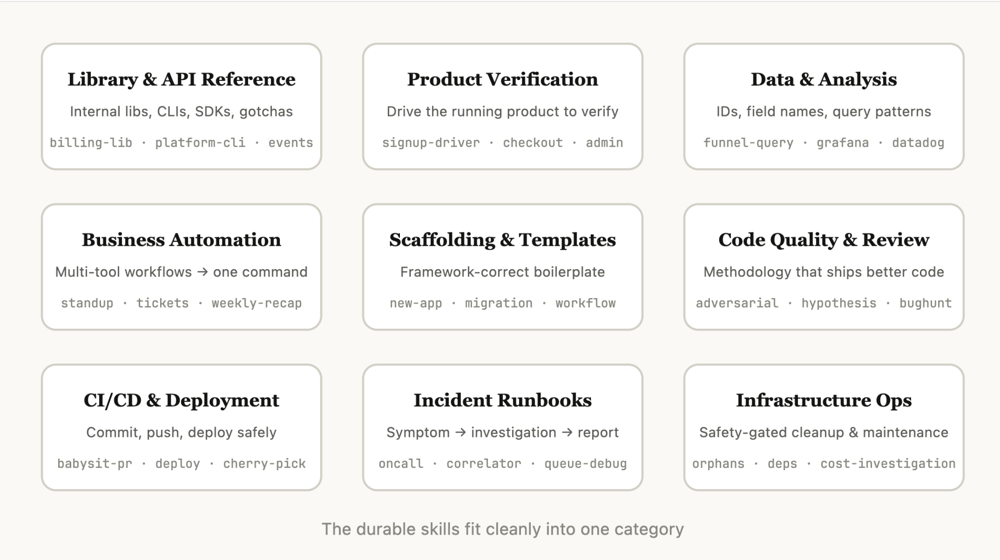
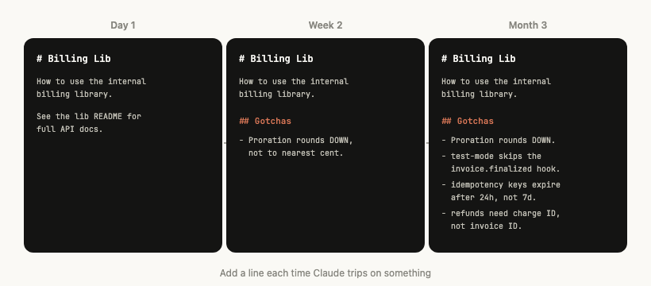
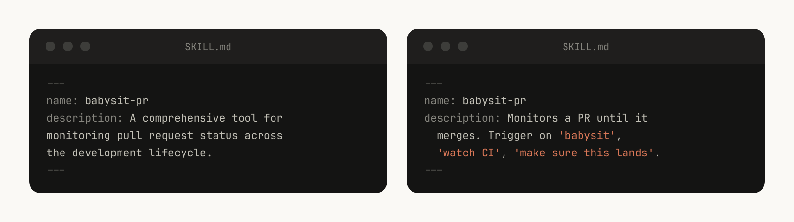
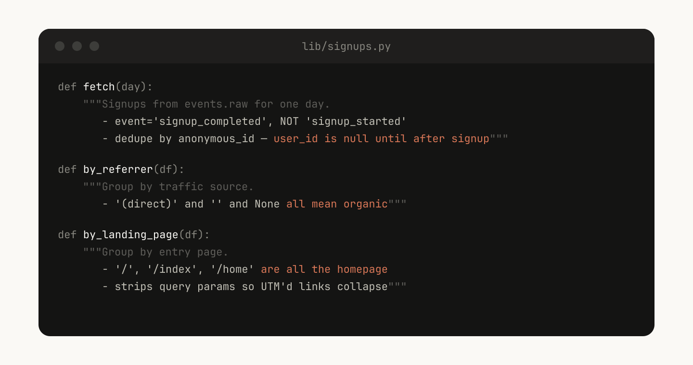

# 构建 Claude Code 的经验：我们如何使用 skills（中英对照）

> **原文标题：** Lessons from building Claude Code: How we use skills
> **作者：** Thariq Shihipar（Anthropic 技术团队成员，从事 Claude Code 开发）
> **原文链接：** https://claude.com/blog/lessons-from-building-claude-code-how-we-use-skills
> **发布日期：** 2026-06-03
> **翻译模型：** GLM-5.3
> 排版：每段英文原文在前，中文翻译紧随其后。术语保留英文原文并附中文释义。

---

What we learned building and scaling hundreds of skills internally at Anthropic.

在 Anthropic 内部构建并规模化数百个 skills 的过程中，我们学到的东西。

Skills have become one of the most used extension points in Claude Code. They're flexible, easy to make, and easy to distribute.

Skills 已成为 Claude Code 中使用最广泛的扩展点（extension point）之一。它们灵活、易于创建，也易于分发。

But this flexibility also makes it hard to know what works best. What type of skills are worth making? How do you structure a skill? When do you share them with others?

但这种灵活性也让人难以判断什么做法效果最好。哪些类型的 skills 值得做？如何组织一个 skill 的结构？什么时候把它们分享给别人？

We've been using skills in Claude Code extensively at Anthropic with hundreds of them in active use. These are the lessons we've learned about using skills to accelerate our development.

在 Anthropic，我们大量使用 Claude Code 的 skills，活跃使用的有数百个。以下是我们关于用 skills 加速开发的经验教训。

# 什么是 skills？（What are skills?）

Skills are folders of instructions, scripts, and resources that agents can discover and use to do things more accurately and efficiently. This blog post assumes familiarity with skills basics; if you're new, start with our Introduction to agent skills course on Skilljar.

Skills 是由指令、脚本和资源组成的文件夹，agent 可以发现并使用它们，把事情做得更准确、更高效。本文假设你已了解 skills 的基础知识；如果你是新手，请先学习我们在 Skilljar 上的 Introduction to agent skills 课程。

A common misconception we hear about skills is that they are "just markdown files." They're actually folders that can include scripts, assets, data, etc. that the agent can discover, explore and manipulate.

我们常听到一个关于 skills 的误解：它们"只是一些 markdown 文件"。实际上它们是文件夹，可以包含脚本、素材、数据等，agent 可以发现、探索并调用这些内容。

In Claude Code, skills also have a wide variety of configuration options including registering dynamic hooks.

在 Claude Code 中，skills 还有丰富多样的配置选项，包括注册动态 hooks（dynamic hooks）。

We've found that some of the most effective skills in Claude Code use these configuration options and folder structure effectively.

我们发现，Claude Code 中最有效的一些 skills，往往很好地利用了这些配置选项和文件夹结构。

# Skills 的类型（Types of skills）

After cataloging all of our internal skills at Anthropic, we noticed they cluster into nine categories. The best skills fit cleanly into one; the ones that try to do too much straddle several and confuse the agent. This isn't a definitive list, but it is a useful framework for identifying gaps in your own skills library.

在编目 Anthropic 内部的所有 skills 之后，我们注意到它们聚成九大类。最好的 skills 干净利落地归入其中一类；那些试图做太多事的 skills 横跨多类，反而让 agent 困惑。这并非一份权威清单，但它是一个有用的框架，可用来发现你自己的 skills 库中的空缺。

> The Claude Code team categorized our internal skills and found that they could be bucketed into nine distinct categories.
> Claude Code 团队对内部 skills 进行分类，发现它们可以归入九个不同的类别。

## 1. 库与 API 参考（1. Library and API reference）

These are skills that explain how to correctly use a library, CLI, or SDKs. They could be both for internal libraries or common libraries that Claude Code sometimes struggles to handle. These skills often included a folder of reference code snippets and a list of gotchas for Claude to avoid when writing a script.

这类 skills 解释如何正确使用某个库、CLI 或 SDK。它们既可以面向内部库，也可以面向 Claude Code 有时处理不好的常见库。这类 skills 通常包含一个参考代码片段文件夹，以及一份 Claude 编写脚本时应避开的"坑"（gotchas）清单。

Examples include:

示例包括：

- billing-lib - your internal billing library: edge cases, footguns, etc.
- internal-platform-cli - every subcommand of your internal CLI wrapper with examples on when to use them.
- sandbox-proxy - configuring your org's egress gateway for dev work: which hosts are reachable, how to debug "connection refused" errors, how to add an allowlist entry.

- billing-lib--你的内部计费库：边界情况、易错点（footgun）等
- internal-platform-cli--你的内部 CLI 封装的每个子命令，并附使用时机示例
- sandbox-proxy--为开发工作配置你所在组织的出口网关（egress gateway）：哪些主机可达、如何调试"connection refused"错误、如何添加白名单条目

## 2. 产品验证（2. Product verification）

These are skills that describe how to test or verify that your code is working. They are often paired with playwright, tmux, or other external tools for verification.

这类 skills 描述如何测试或验证你的代码是否正常工作。它们通常配合 playwright、tmux 或其他外部工具进行验证。

Verification skills have had the most measurable impact on Claude's output quality internally. It can be worth having an engineer spend a week just making your verification skills excellent.

在内部，验证类 skills 对 Claude 产出质量的影响是最可度量的。让一位工程师专门花一周时间，把你们的验证 skills 打磨到优秀，可能是值得的。

Consider techniques like having Claude record a video of its output so you can see exactly what it tested, or enforcing programmatic assertions on state at each step. These are often done by including a variety of scripts in the skill.

可以考虑一些技巧，比如让 Claude 录制一段它输出过程的视频，让你确切看到它测试了什么；或者在每一步对状态执行程序化断言（programmatic assertion）。这些通常通过在 skill 中包含多种脚本来实现。

Examples include:

示例包括：

- signup-flow-driver - runs through signup -> email verify -> onboarding in a headless browser, with hooks for asserting state at each step
- checkout-verifier - drives the checkout UI with Stripe test cards, verifies the invoice actually lands in the right state
- tmux-cli-driver - for interactive CLI testing where the thing you're verifying needs a TTY

- signup-flow-driver--在无头浏览器中跑完 注册 -> 邮箱验证 -> 引导流程，并带 hooks 在每一步断言状态
- checkout-verifier--用 Stripe 测试卡驱动结账 UI，验证发票确实进入正确状态
- tmux-cli-driver--用于被验证对象需要 TTY 的交互式 CLI 测试

## 3. 数据获取与分析（3. Data fetching and analysis）

These are skills that connect to your data and monitoring stacks. These skills might include libraries to fetch your data with credentials, specific dashboard ids, etc., as well as instructions on common workflows or ways to get data.

这类 skills 连接你的数据和监控体系。它们可能包含带凭据获取数据的库、具体的仪表盘 ID 等，也可能包含常见工作流或取数方式的说明。

Examples include:

示例包括：

- funnel-query - "which events do I join to see signup -> activation -> paid" plus the table that actually has the canonical user_id
- cohort-compare - compare two cohorts' retention or conversion, flag statistically significant deltas, link to the segment definitions
- grafana - datasource UIDs, cluster names, problem -> dashboard lookup table
- datadog - field reference (@request_id vs trace_id), service list, metric prefix conventions

- funnel-query--"要看到 注册 -> 激活 -> 付费，我该 join 哪些事件"，以及真正存有权威 user_id 的那张表
- cohort-compare--比较两个用户群组的留存或转化，标记统计显著的差异，附细分群组定义的链接
- grafana--数据源 UID、集群名称、"问题 -> 仪表盘"对照表
- datadog--字段参考（@request_id 与 trace_id 的区别）、服务列表、指标前缀约定

## 4. 业务流程与团队自动化（4. Business process and team automation）

These are skills that automate repetitive workflows into one command. These skills are usually fairly simple instructions but might have more complicated dependencies on other skills or MCPs. For these skills, saving previous results in log files can help the model stay consistent and reflect on previous executions of the workflow.

这类 skills 把重复性工作流自动化成一条命令。它们的指令通常相当简单，但可能对其他 skills 或 MCP 有较复杂的依赖。对这类 skills 来说，把以往结果保存到日志文件里，可以帮助模型保持一致，并回顾工作流此前的执行情况。

Examples include:

示例包括：

- standup-post - aggregates your ticket tracker, GitHub activity, and prior Slack -> formatted standup, delta-only
- create-<ticket-system>-ticket - enforces schema (valid enum values, required fields) plus post-creation workflow (ping reviewer, link in Slack)
- weekly-recap - merged PRs + closed tickets + deploys -> formatted recap post

- standup-post--聚合你的工单系统、GitHub 动态和此前的 Slack 消息 -> 生成格式化站会内容，只含增量
- create-<ticket-system>-ticket--强制 schema（合法枚举值、必填字段），外加创建后的工作流（提醒 reviewer、在 Slack 中贴链接）
- weekly-recap--合并的 PR + 关闭的工单 + 部署 -> 格式化周报帖子

## 5. 代码脚手架与模板（5. Code scaffolding and templates）

These are skills that generate framework boilerplates for a specific function in a codebase. You might combine these skills with scripts that can be composed. They are especially useful when your scaffolding has natural language requirements that can't be purely covered by code.

这类 skills 为代码库中的特定功能生成框架样板代码（boilerplate）。你可以把这些 skills 与可组合的脚本结合使用。当你的脚手架包含无法完全用代码覆盖的自然语言要求时，它们尤其有用。

Examples include:

示例包括：

- new-<framework>-workflow - scaffolds a new service/workflow/handler with your annotations
- new-migration - your migration file template plus common gotchas
- create-app - new internal app with your auth, logging, and deploy config pre-wired

- new-<framework>-workflow--用你们的注解脚手架生成新的 service/workflow/handler
- new-migration--你们的 migration 文件模板，外加常见的坑
- create-app--新建内部应用，预先接好你们的认证、日志和部署配置

## 6. 代码质量与审查（6. Code quality and review）

These are skills that enforce code quality inside of your org and help review code. These can include deterministic scripts or tools for maximum robustness. You may want to run these skills automatically as part of hooks or inside of a GitHub Action.

这类 skills 在组织内部强制执行代码质量标准并协助代码审查。它们可以包含确定性脚本或工具，以获得最强的健壮性。你可能希望把这些 skills 作为 hooks 的一部分或在 GitHub Action 中自动运行。

- adversarial-review - spawns a fresh-eyes subagent to critique, implements fixes, iterates until findings degrade to nitpicks
- code-style - enforces code style, especially styles that Claude does not do well by default.
- testing-practices - instructions on how to write tests and what to test.

- adversarial-review--派生一个"新眼光"subagent 来挑刺，实施修复，反复迭代，直到发现的问题降级为细枝末节
- code-style--强制执行代码风格，尤其是 Claude 默认做得不好的那些风格
- testing-practices--关于如何写测试、测试什么的说明

## 7. CI/CD 与部署（7. CI/CD and deployment）

These are skills that help you fetch, push, and deploy code inside of your codebase. These skills may reference other skills to collect data.

这类 skills 帮你在代码库中拉取、推送和部署代码。它们可能会引用其他 skills 来收集数据。

Examples include:

示例包括：

- babysit-pr - monitors a PR -> retries flaky CI -> resolves merge conflicts -> enables auto-merge
- deploy-<service> - build -> smoke test -> gradual traffic rollout with error-rate comparison -> auto-rollback on regression
- cherry-pick-prod - isolated worktree -> cherry-pick -> conflict resolution -> PR with template

- babysit-pr--监控 PR -> 重试不稳定的 CI -> 解决合并冲突 -> 启用自动合并
- deploy-<service>--构建 -> 冒烟测试 -> 结合错误率对比的渐进流量发布 -> 出现回归时自动回滚
- cherry-pick-prod--隔离 worktree -> cherry-pick -> 解决冲突 -> 按模板创建 PR

## 8. 操作手册（8. Runbooks）

These are skills that take a symptom (such as a Slack thread, alert, or error signature), walk through a multi-tool investigation, and produce a structured report.

这类 skills 接收一个症状（如一个 Slack 讨论串、告警或错误签名），走一遍多工具排查，然后产出结构化报告。

Examples include:

示例包括：

- <service>-debugging - maps symptoms -> tools -> query patterns for your highest-traffic services
- oncall-runner - fetches the alert -> checks the usual suspects -> formats a finding
- log-correlator - given a request ID, pulls matching logs from every system that might have touched it

- <service>-debugging--为你流量最高的服务映射"症状 -> 工具 -> 查询模式"
- oncall-runner--拉取告警 -> 检查常见嫌疑 -> 格式化出一条结论
- log-correlator--给定一个请求 ID，从每个可能接触过它的系统里拉取匹配日志

## 9. 基础设施运维（9. Infrastructure operations）

These are skills that perform routine maintenance and operational procedures, some of which involve destructive actions that benefit from guardrails. These make it easier for engineers to follow best practices in critical operations.

这类 skills 执行例行维护和运维流程，其中一些涉及破坏性操作，需要护栏（guardrail）保护。它们让工程师在关键操作中更容易遵循最佳实践。

Examples include:

示例包括：

- <resource>-orphans - finds orphaned pods/volumes -> posts to Slack -> soak period -> user confirms -> cascading cleanup
- dependency-management - your org's dependency approval workflow
- cost-investigation - "why did our storage/egress bill spike" with the specific buckets and query patterns

- <resource>-orphans--发现孤立的 pod/卷 -> 发到 Slack -> 观察期 -> 用户确认 -> 级联清理
- dependency-management--你们组织的依赖审批流程
- cost-investigation--"为什么我们的存储/出口流量账单激增"，附具体的 bucket 和查询模式

# 制作 skills 的技巧（Tips for making skills）

Once you've decided on the skill to make, how do you write it? These are some of the Claude Code team's best practices, tips, and tricks for making skills

确定了要做什么 skill 之后，该怎么写？以下是 Claude Code 团队制作 skills 的一些最佳实践、技巧和窍门

## 不要陈述显而易见的东西（Don't state the obvious）

Claude already knows how to code and can read your codebase. A skill that restates what Claude would do by default adds context without adding value. If you're publishing a skill that is primarily about knowledge, focus on information that pushes Claude out of its normal way of thinking.

Claude 已经知道怎么写代码，也能读你的代码库。一个只是重述 Claude 默认行为的 skill，只会增加上下文而不增加价值。如果你要发布的 skill 主要承载知识，请把重点放在能把 Claude 推出惯性思维的信息上。

The frontend design skill is a great example; it was built by an engineer at Anthropic by iterating with customers on improving Claude's design taste, avoiding classic patterns like the Inter font and purple gradients.

frontend design skill 就是一个绝佳例子；它由 Anthropic 的一位工程师通过与客户不断迭代、打磨 Claude 的设计品味而建成，帮助 Claude 避开 Inter 字体、紫色渐变这类俗套模式。

## 建一个"坑"专区（Build a gotchas section）

The highest-signal content in any skill is the Gotchas section. These sections should be built up from common failure points that Claude runs into when using your skill. Ideally, you will update your skill over time to capture these gotchas.

任何 skill 中信息密度最高的内容都是 Gotchas（坑）专区。这些专区应当由 Claude 使用你的 skill 时常踩的失败点积累而成。理想情况下，你会随着时间推移不断更新 skill，把这些坑沉淀下来。

For example:

例如：

"The subscriptions table is append-only. The row you want is the one with the highest version, not the most recent created_at." "This field is called @request_id in the API gateway and trace_id in the billing service. They're the same value." "Staging returns 200 even when the Stripe webhook didn't actually process. Check payment_events for the real state."

"subscriptions 表是 append-only 的。你要的行是版本号最高的那行，不是 created_at 最新的那行。""这个字段在 API 网关里叫 @request_id，在计费服务里叫 trace_id。它们是同一个值。""即使 Stripe webhook 实际没有处理，Staging 环境也会返回 200。真实状态要看 payment_events。"

## 利用文件系统与渐进式披露（Use the file system and progressive disclosure）

> The SKILL.md file points to several other files Claude can reference for specific situations. For example, if a job is pending, it should reference stuck-jobs.md.
> SKILL.md 文件指向另外几个文件，Claude 可以在特定情况下参考它们。例如，如果某个任务处于 pending 状态，就应参考 stuck-jobs.md。

Like we said earlier, a skill is a folder, not just a markdown file. You should think of the entire file system as a form of context engineering and progressive disclosure. Tell Claude what files are in your skill, and it will read them at appropriate times.

正如前面所说，skill 是一个文件夹，而不只是一个 markdown 文件。你应当把整个文件系统当作一种上下文工程（context engineering）和渐进式披露（progressive disclosure）的手段。告诉 Claude 你的 skill 里有哪些文件，它会在合适的时机去读。

The simplest form of progressive disclosure is to point to other markdown files for Claude to use. For example, you may split detailed function signatures and usage examples into references/api.md.

渐进式披露最简单的形式，是指向其他供 Claude 使用的 markdown 文件。例如，你可以把详细的函数签名和使用示例拆到 references/api.md 中。

Another example: if your end output is a markdown file, you might include a template file for it in assets/ to copy and use.

另一个例子：如果你的最终产出是一个 markdown 文件，可以在 assets/ 中放一份模板文件，供 Claude 复制使用。

You can have folders of references, scripts, examples, etc., which help Claude work more effectively.

你还可以准备 references、scripts、examples 等文件夹，帮助 Claude 更有效地工作。

## 避免把 Claude 钉死在轨道上（Avoid railroading Claude）

Claude will generally try to stick to your instructions, and because skills are so reusable you'll want to be careful of being too specific in your instructions. Give Claude the information it needs, but give it the flexibility to adapt to the situation.

Claude 通常会尽量遵循你的指令，而正因为 skills 高度可复用，你要小心不要把指令写得过于死板。给 Claude 需要的信息，但也给它因地制宜的灵活度。

For example:

例如：

## 把 setup 想清楚（Think through the setup）

> The skill above is written to prompt the user if the Slack channel is not included in the configuration.
> 上面这个 skill 的写法是：当配置中没有 Slack 频道时，就提示用户。

Some skills may need to be set up with context from the user. For example, if you are making a skill that posts your standup to Slack, you may want Claude to ask which Slack channel to post it in.

有些 skills 可能需要用户提供背景信息来完成设置。例如，如果你在做的是一个把站会内容发到 Slack 的 skill，你可能希望 Claude 先问一下要发到哪个 Slack 频道。

A good pattern to do this is to store this setup information in a config.json file in the skill directory like the above example. If the config is not set up, the agent can then ask the user for information.

一个好模式是把这类设置信息存在 skill 目录下的 config.json 文件里，就像上面的例子那样。如果配置尚未就绪，agent 就可以向用户询问信息。

If you want the agent to present structured, multiple choice questions you can instruct Claude to use the AskUserQuestion tool.

如果你希望 agent 提出结构化的多选题，可以指示 Claude 使用 AskUserQuestion 工具。

## 给模型而不是给人写描述（Write descriptions for the model, not for humans）

When Claude Code starts a session, it builds a listing of every available skill with its description. This listing is what Claude scans to decide "is there a skill for this request?" Which means the description field is not a summary, it's a description of when to trigger this skill.

Claude Code 启动会话时，会构建一份清单，列出每个可用 skill 及其描述。Claude 扫描这份清单来决定"这个请求有没有对应的 skill？"因此，描述字段不是摘要，而是"何时触发这个 skill"的说明。

> It's helpful to include triggers for the skill, like "babysit," in its description.
> 在 skill 的描述里写明触发词（比如"babysit"）会很有帮助。

## 帮 Claude 记住（Help Claude remember）

> This text log file helps Claude remember past events like reviewing Sarah's auth PR.
> 这个文本日志文件帮助 Claude 记住过往事件，比如审查过 Sarah 的 auth PR。

Some skills can include a form of memory by storing data within them. You could store data in anything as simple as an append only text log file or JSON files, or as complicated as a SQLite database.

有些 skills 可以通过在自身内部存储数据来获得某种形式的记忆。数据可以存在简单到只是一个 append-only 文本日志或 JSON 文件里，也可以复杂到用一个 SQLite 数据库。

For example, a standup-post skill might keep a standups.log with every post it's written, which means the next time you run it, Claude reads its own history and can tell what's changed since yesterday.

例如，standup-post skill 可以维护一个 standups.log，记录它写过的每一篇内容。这意味着下次运行时，Claude 会读自己的历史，并说出与昨天相比有什么变化。

You can use the env variable ${CLAUDE_PLUGIN_DATA} to get a stable directory where you can store data, read more persisting data in skills here: https://code.claude.com/docs/en/plugins-reference#persistent-data-directory.

你可以使用环境变量 ${CLAUDE_PLUGIN_DATA} 获取一个稳定的目录来存放数据；关于在 skills 中持久化数据的更多内容，请看：https://code.claude.com/docs/en/plugins-reference#persistent-data-directory。

## 存放脚本并生成代码（Store scripts and generate code）

One of the most powerful tools you can give Claude is code. Giving Claude scripts and libraries lets Claude spend its turns on composition, deciding what to do next rather than reconstructing boilerplate.

你能给 Claude 的最强大工具之一就是代码。给 Claude 脚本和库，可以让 Claude 把轮次（turn）花在组合与决定下一步上，而不是重建样板代码。

For example, in your data-science skill you might have a library of functions to fetch data from your event source. In order for Claude to do complex analysis, you could give it a set of helper functions like this:

例如，在你的数据科学 skill 里，你可能有一组从事件源取数的函数库。为了让 Claude 做复杂分析，你可以给它一组像这样的辅助函数（helper function）：

Claude can then generate scripts on the fly to compose this functionality to do more advanced analysis for prompts like "What happened on Tuesday?"

随后 Claude 可以即时生成脚本来组合这些功能，针对"周二发生了什么？"这类提示词做更高级的分析。

## 使用按需 hooks（Use on-demand hooks）

Skills can include hooks that are only activated when the skill is called, and that only last for the duration of the session. Use this for more opinionated hooks that you don't want to run all the time, but are extremely useful sometimes.

Skills 可以包含只在 skill 被调用时才激活、且只持续到会话结束的 hooks。这适合那些你不想一直开着、但有时极其有用、立场鲜明（opinionated）的 hooks。

For example:

例如：

- /careful - blocks rm -rf, DROP TABLE, force-push, kubectl delete via PreToolUse matcher on Bash. You only want this when you know you're touching prod - having it always on would drive you insane.
- /freeze - blocks any Edit/Write that's not in a specific directory. Useful during debugging: "I want to add logs but I keep accidentally 'fixing' unrelated code."

- /careful--通过 Bash 上的 PreToolUse 匹配器阻断 rm -rf、DROP TABLE、force-push、kubectl delete。你只在确定要动生产环境时才想开它--一直开着会把人逼疯。
- /freeze--阻断任何不在特定目录内的 Edit/Write。调试期间很好用："我想加点日志，但总忍不住顺手'修'了无关的代码。"

# 分发 skills（Distributing skills）

One of the biggest benefits of skills is that you can share them with the rest of your team.

Skills 最大的好处之一，就是可以分享给团队里的其他人。

There are two ways you might want to share skills with others:

把 skills 分享给他人大致有两种方式：

- check your skills into your repo (under ./.claude/skills)
- make a plugin and have a Claude Code Plugin marketplace where users can upload and install plugins (read more on the documentation here)

- 把你的 skills 提交进仓库（放在 ./.claude/skills 下）
- 制作 plugin，并搭建一个 Claude Code Plugin 市场，让用户上传和安装插件（更多内容见文档）

For smaller teams working across relatively few repos, checking your skills into repos works well. But every skill that is checked in also adds a little bit to the context of the model. As you scale, an internal plugin marketplace allows you to distribute skills and let your team decide which ones to install, as well as include a setup flow.

对于在较少仓库上工作的小团队来说，把 skills 提交进仓库就够用了。但每提交一个 skill，也会给模型上下文增加一点负担。随着规模扩大，内部 plugin 市场让你可以分发 skills、让团队自行决定安装哪些，并且还能附带一个设置流程。

# 管理 skills 市场（Managing a skills marketplace）

How do you decide which skills go in a marketplace? How do people submit them?

如何决定哪些 skills 进入市场？大家怎么提交？

At Anthropic, we don't have a centralized team that decides; instead we try to find the most useful skills organically. If someone has a skill that they want people to try out, they can upload it to a sandbox folder in GitHub and point people to it in Slack or other forums.

在 Anthropic，我们没有一个中心化团队来做决定；相反，我们尝试以自下而上的有机方式发现最有用的 skills。如果有人做了一个 skill 想让大家试用，可以上传到 GitHub 的一个沙盒文件夹，然后在 Slack 或其他论坛里引导大家去用。

Once a skill has gotten traction (which is up to the skill owner to decide), they can put in a PR to move it into the marketplace.

一旦某个 skill 获得了关注（由 skill 作者自行判断），就可以提一个 PR 把它移入市场。

# 组合 skills（Composing skills）

You may want to have skills that depend on each other. For example, you may have a file upload skill that uploads a file, and a CSV generation skill that makes a CSV and uploads it. This sort of dependency management is not natively built into marketplaces or skills yet, but you can just reference other skills by name, and the model will invoke them if they are installed.

你可能希望 skills 之间互相依赖。例如，你可能有一个上传文件的 file upload skill，还有一个生成 CSV 并上传它的 CSV generation skill。这种依赖管理目前尚未原生内建在市场或 skills 中，但你只要按名称引用其他 skills，模型就会在它们已安装时调用它们。

# 度量 skills（Measuring skills）

To understand how a skill is doing, we use a PreToolUse hook that lets us log skill usage within the company (example code here). This means we can find skills that are popular or are undertriggering compared to our expectations.

为了解一个 skill 用得怎么样，我们使用一个 PreToolUse hook 在公司内部记录 skill 的使用情况（示例代码在此）。这样我们就能发现哪些 skills 很受欢迎，哪些的触发次数低于预期。

# 开始上手（Get started）

Skills best practices are still evolving. Most of our best skills began as a few lines and a single gotcha, then got better because people kept adding to them as Claude hit new edge cases.

Skills 的最佳实践仍在演进。我们最好的那些 skills 大多起步于寥寥数行和一个坑，之后随着 Claude 撞上新的边界情况而被人不断补充，才变得越来越好。

The best way to understand skills is to get started, experiment, and see what works for you.

理解 skills 最好的方式就是动手开始、做实验，看看什么对你有效。

- Check out our skills documentation
- Find example skills to customize

- 查阅我们的 skills 文档
- 寻找可自定义的示例 skills

This article was written by Thariq Shihipar, a member of technical staff at Anthropic, working on Claude Code.

本文由 Thariq Shihipar 撰写，他是 Anthropic 技术团队成员，从事 Claude Code 开发。
