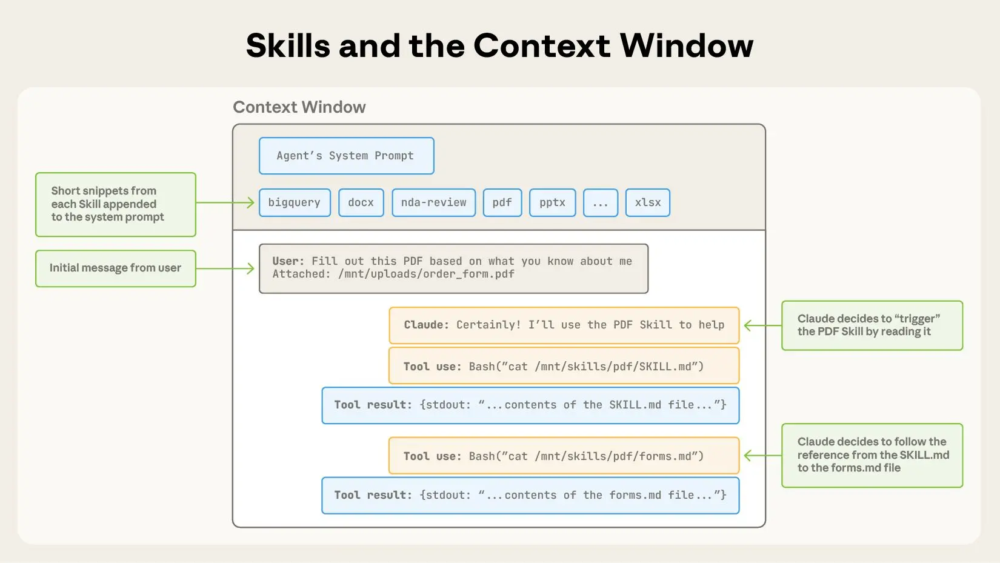
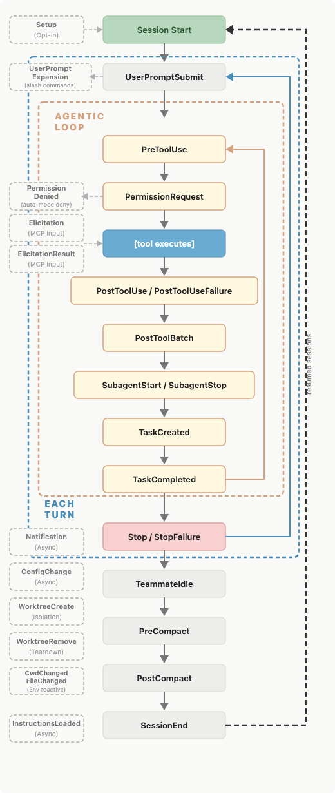

# 驾驭 Claude Code：何时使用 CLAUDE.md、skills、hooks 与 subagents（中英对照）

> **原文标题：** Steering Claude Code: when to use CLAUDE.md, skills, hooks, and subagents
> **作者：** Michael Segner（Anthropic 员工）
> **原文链接：** https://claude.com/blog/steering-claude-code-skills-hooks-rules-subagents-and-more
> **发布日期：** 2026-06-18
> **翻译模型：** GLM-5.3
> 排版：每段英文原文在前，中文翻译紧随其后。术语保留英文原文并附中文释义。

---

Seven ways to steer Claude Code-CLAUDE.md files, rules, skills, subagents, hooks, and more-and when to use each, based on context cost and authority.

驾驭 Claude Code 的七种方式--CLAUDE.md 文件、rules（规则）、skills（技能）、subagents（子代理）、hooks（钩子）等--以及基于上下文成本（context cost）和权限级别（authority），各自适用于什么场景。

Claude is built to work the way you work, and in Claude Code you can customize it.

Claude 的设计初衷是顺应你的工作方式，而在 Claude Code 中，你可以对它进行自定义。

There are seven methods for instructing Claude's behavior: CLAUDE.md files, rules, skills, subagents, hooks, output styles, and appending the system prompt.

指示 Claude 行为的方法共有七种：CLAUDE.md 文件、rules、skills、subagents、hooks、output styles（输出样式）以及追加系统提示词（appending the system prompt）。

Each method controls:

每种方法分别控制：

- When an instruction loads into context;
- Whether it persists through long sessions (compaction behavior); and
- How much authority it carries.

- 指令何时被加载进上下文（context）；
- 它在长会话中是否持续存在（压缩/compaction 行为）；以及
- 它具有多大的权限（authority）。

The table below provides a quick summary of key differences across each method while the post provides additional detail and decision framework for determining where each of your Claude instructions belongs.

下表快速总结了各方法之间的关键差异，本文正文则提供更多细节和一个决策框架，帮助你判断每条 Claude 指令应该放在哪里。

| Method | When it's loaded | Compaction behavior | Context cost | When to use |
|---|---|---|---|---|
| CLAUDE.md (root) | Session start; stays in context for the entire session | Memoized. Read once and cached for the session; cache cleared and re-read after compaction | High. Every line costs tokens whether relevant or not | Build commands, directory layout, monorepo structure, coding conventions, team norms |
| CLAUDE.md (subdirectory) | On-demand, when Claude reads a file under that subdirectory | Lost until that subdirectory is touched again | Low. Only consumes context when the relevant subdirectory is being worked on | Conventions specific to a subdirectory |
| Rules | Session start (user-level rules) or only when matching files are touched (path-scoped) | Re-injected on compaction | Medium. Always-on unless path-scoped | Specific constraints or conventions (e.g., all API handlers must validate input with Zod) |
| Skills | Name and description at session start; full body loads when the skill is invoked | Invoked skills re-injected up to a shared budget; oldest dropped first | Low. Full body loads only when invoked; subject to a shared token budget across invoked skills | Procedural workflows (deploy or release checklists) |
| Subagents | Name, description, and tool list at session start; body loads only when called via the Agent tool | Only the final message (summary plus metadata) returns to the main session | Low. Zero cost in main context until called; runs in its own isolated context window | Running work in parallel or side tasks that should run in isolation and return only a summary (deep search, log analysis, dependency audit) |
| Hooks | Fire on lifecycle events | Bypass compaction entirely | Low. Configuration lives outside main context; some output may return (e.g., blocking errors) | Deterministic automation: run linters, post to Slack on completion, block commands, back up chat history on PreCompact |
| Output styles | Session start; injected into the system prompt | Never compacted | High. Occupies context window, but overwrites default system prompt | Significant role changes (code assistant to general assistant) |
| Appending the system prompt | Session start; passed as a CLI flag | Never compacted; applies only to that invocation | Moderate. Cached after first request in a session | Tone, response length, formatting preferences |

| 方法 | 何时加载 | 压缩（compaction）行为 | 上下文成本 | 适用场景 |
|---|---|---|---|---|
| CLAUDE.md（根目录） | 会话开始时；整个会话期间一直留在上下文中 | 有记忆化（memoized）。读取一次并在会话内缓存；压缩后缓存清空并重新读取 | 高。无论是否相关，每一行都消耗 token | 构建命令、目录布局、monorepo 结构、编码规范、团队约定 |
| CLAUDE.md（子目录） | 按需加载，当 Claude 读取该子目录下的文件时 | 丢失，直到再次涉及该子目录 | 低。仅在处理相关子目录时才消耗上下文 | 特定于某个子目录的约定 |
| Rules | 会话开始时（用户级 rules），或仅在触及匹配文件时（路径限定/path-scoped） | 压缩时重新注入 | 中。除非路径限定，否则始终加载 | 特定约束或约定（例如，所有 API handler 必须用 Zod 校验输入） |
| Skills | 会话开始时加载名称和描述；完整正文在调用该 skill 时加载 | 已调用的 skills 会被重新注入，直到达到共享预算上限；最旧的先被丢弃 | 低。完整正文仅在调用时加载；受所有已调用 skills 共享的 token 预算约束 | 流程化工作（部署或发布检查清单） |
| Subagents | 会话开始时加载名称、描述和工具列表；正文仅在通过 Agent 工具调用时加载 | 只有最终消息（摘要加元数据）返回主会话 | 低。调用前在主上下文中零成本；在自身隔离的上下文窗口中运行 | 并行运行工作，或应隔离运行且只返回摘要的旁路任务（深度搜索、日志分析、依赖审计） |
| Hooks | 在生命周期事件上触发 | 完全绕过压缩 | 低。配置位于主上下文之外；部分输出可能返回（例如阻断错误） | 确定性自动化：运行 linter、完成时发 Slack 消息、阻断命令、在 PreCompact 时备份聊天历史 |
| Output styles | 会话开始时；注入系统提示词（system prompt） | 从不被压缩 | 高。占用上下文窗口，但会覆盖默认系统提示词 | 重大角色转变（从代码助手变为通用助手） |
| 追加系统提示词 | 会话开始时；作为 CLI 标志传入 | 从不被压缩；仅作用于当次调用 | 中等。会话内首次请求后即被缓存 | 语气、回复长度、格式偏好 |

# 传递指令的七种方法（The seven methods for delivering instructions）

There are seven ways to customize Claude Code's behavior: CLAUDE.md files for always-on project context, rules for hard constraints, skills for reusable procedures, subagents for delegated work, hooks for deterministic automation, and output styles or system-prompt appends for global changes.

自定义 Claude Code 行为的方式共有七种：CLAUDE.md 文件用于常驻的项目上下文，rules 用于硬性约束，skills 用于可复用的流程，subagents 用于委派工作，hooks 用于确定性自动化，output styles 或系统提示词追加（system-prompt append）用于全局性变更。

Each method trades context cost against authority. These methods influence Claude's behavior while two separate dials, which model and effort level you choose, control how capable it is and how hard it works.

每种方法都在上下文成本与权限（authority）之间做权衡。这些方法影响 Claude 的行为，而另外两个独立的"旋钮"——选择哪个模型以及投入程度（effort level）——则控制它的能力上限和卖力程度。

## CLAUDE.md 文件（CLAUDE.md files）

CLAUDE.md is a markdown file at the root of your project. It loads into context at session start and stays there for the entire session.

CLAUDE.md 是位于项目根目录的 markdown 文件。它在会话开始时加载进上下文，并在整个会话期间一直留在那里。

Build commands, directory layout, monorepo structure, coding conventions, and team norms all fit naturally here.

构建命令、目录布局、monorepo 结构、编码规范和团队约定都天然适合放在这里。

There are two types, and they load differently:

它有两种类型，加载方式各不相同：

- Always loaded: The first type is a root CLAUDE.md file, either in a shared repository and/or saved locally for your personal preferences specific to a project. All these files load at session start, and won't get lost or degraded across long sessions. When Claude Code compacts the conversation, it re-reads these files.
- On-demand: CLAUDE.md files in subdirectories below the folder where you initialized the session. For example, app/api/CLAUDE.md loads when Claude reads a file under app/api, not at session start. It shares the compaction behavior of path-scoped rules: gone until that subdirectory is touched again.

- 始终加载（Always loaded）：第一类是根目录 CLAUDE.md 文件，可以放在共享仓库中，也可以在本地保存一份，承载你对某个项目的个人偏好。所有这些文件都会在会话开始时加载，在长会话中不会丢失或衰减。当 Claude Code 压缩（compact）对话时，会重新读取这些文件。
- 按需加载（On-demand）：位于你初始化会话的文件夹之下各子目录中的 CLAUDE.md 文件。例如，app/api/CLAUDE.md 在 Claude 读取 app/api 下的文件时才加载，而不是在会话开始时。它的压缩行为与路径限定（path-scoped）的 rules 相同：在再次涉及该子目录之前，一直处于丢失状态。


> All subdirectory CLAUDE.md files below the cwd load when Claude reads a file within that directory.
> 当前工作目录（cwd）之下所有子目录的 CLAUDE.md 文件，都会在 Claude 读取该目录内的文件时加载。

In a shared repository, CLAUDE.md grows the way any unowned config file does: every team appends its own instructions and nothing gets deleted. The cost compounds at scale.

在共享仓库中，CLAUDE.md 的膨胀方式与任何无人负责的配置文件一样：每个团队都往里追加自己的指令，而没有任何内容被删除。这种成本会随规模不断叠加。

Every line loads into every session for every engineer working in the repo, whether it's relevant to their task or not. This consumes tokens and dilutes adherence to the instructions that actually matter. As the file grows, push team-specific conventions into path-scoped rules and procedures into skills, where they load only when relevant.

文件里的每一行都会加载进在这个仓库工作的每位工程师的每个会话，无论与其任务是否相关。这既消耗 token，又稀释了 Claude 对真正重要指令的遵循度。随着文件增长，应把团队专属的约定迁移到路径限定的 rules 中，把流程性内容迁移到 skills 中，让它们只在相关时才加载。

Tip: Keep CLAUDE.md under 200 lines, give it an owner, and review changes to it like code. The content itself should follow the same rules as any prompt: writing effective prompts means being explicit, explaining the why behind constraints, and showing examples.

提示：让 CLAUDE.md 保持在 200 行以内，为它指定一名负责人，并像评审代码一样评审对它的修改。内容本身应遵循与任何提示词（prompt）相同的规则：写出有效的提示词意味着表达明确、解释约束背后的原因，并给出示例。

Think of this file as giving Claude an overview of your codebase, or as an index pointing to other files where Claude can find more information as needed.

可以把这个文件理解为给 Claude 的一份代码库概览，或者一个索引，指向其他文件，让 Claude 在需要时从中查找更多信息。

In monorepos, give each team's directory its own subdirectory CLAUDE.md so teams only load their own conventions, and developers can use the claudeMdExcludes setting to skip files from teams whose code they never touch.

在 monorepo 中，为每个团队的目录配置其专属的子目录 CLAUDE.md，这样各团队只会加载自己的约定；开发者还可以使用 claudeMdExcludes 设置来跳过那些他们从不接触其代码的团队的文件。

For standards that must apply to every repository in the organization - security policies, compliance requirements - a centrally managed CLAUDE.md can be deployed to developer machines via MDM or config management, and it can't be excluded by individual settings.

对于必须适用于组织内每个仓库的标准--安全策略、合规要求--可以通过 MDM 或配置管理将集中管理的 CLAUDE.md 部署到开发者的机器上，而且它无法被个人设置排除。

More on setting up CLAUDE.md in our blog post, CLAUDE.md files: Customizing Claude Code for your codebase.

关于配置 CLAUDE.md 的更多内容，参见我们的博客文章《CLAUDE.md files: Customizing Claude Code for your codebase》。

## 规则（Rules）

Rules are markdown files in .claude/rules/ that give Claude specific constraints or conventions.

Rules 是位于 .claude/rules/ 中的 markdown 文件，为 Claude 提供特定的约束或约定。

Unscoped rules behave like CLAUDE.md in that they are always loaded at session start and get re-injected on compaction. This can waste tokens by loading context even when it's not relevant for the task at hand.

未限定作用域（unscoped）的 rules 行为与 CLAUDE.md 类似：总在会话开始时加载，并在压缩时重新注入。这会在内容与手头任务无关时也照常加载，从而浪费 token。

Path-scoped rules allow you to load rule instructions only when they are relevant by adding a paths field that controls when they load.

路径限定（path-scoped）的 rules 允许你通过添加一个控制加载时机的 paths 字段，让规则指令仅在相关时才加载。

For example: a rule scoped to src/api/** stays out of context during a docs-only session. It would only be loaded whenever Claude reads files within that src/api/ directory.

例如：一条限定于 src/api/** 的规则，在纯文档会话中不会进入上下文。只有当 Claude 读取 src/api/ 目录内的文件时，它才会被加载。

Here's what that looks like:

它看起来是这样的：

```
---
paths:
  - "src/api/**"
  - "**/*.handler.ts"
---

All API handlers must validate input with Zod before processing.
```

Tip: A file-specific constraint, like "migrations are append-only," fits best as a rule placed in your paths: frontmatter. Reach for a path scoped rule over a nested CLAUDE.md file when the instruction regards a cross-cutting concern or file that appears in multiple (but not all) corners of the codebase.

提示：文件特定的约束（如"migration 是只允许追加的/append-only"）最适合作为一条 rule，放进你的 paths: frontmatter 中。当指令涉及横切关注点（cross-cutting concern），或涉及出现在代码库多个（但并非全部）角落的文件时，应优先使用路径限定 rule，而不是嵌套的 CLAUDE.md 文件。

## 技能（Skills）

Skills live in .claude/skills/ as folders of instructions, scripts, and resources that Claude loads dynamically. Each skill has a SKILL.md file with a name, description, and body.

Skills 位于 .claude/skills/ 中，是由指令、脚本和资源组成的文件夹，由 Claude 动态加载。每个 skill 都有一个 SKILL.md 文件，包含名称（name）、描述（description）和正文（body）。

Only the name and description load at session start; the full body loads when Claude invokes the skill, either through a slash command (/code-review) or by auto-matching the task.

会话开始时只加载名称和描述；完整正文在 Claude 调用该 skill 时才加载——要么通过斜杠命令（/code-review），要么通过自动匹配任务。



> Skills are triggered via your system prompt.
> Skills 通过你的系统提示词（system prompt）触发。

For example, /code-review is a built-in skill that reviews your current diff and reports its findings without editing files. The skill defines the playbook so Claude follows the same structured approach every time you invoke it.

例如，/code-review 是一个内置 skill，它会审查你当前的 diff 并报告发现，而不会编辑文件。这个 skill 定义了"作战手册"（playbook），因此每次调用时 Claude 都会遵循同样的结构化流程。

On compaction, Claude Code re-injects invoked skills up to a total budget across all invoked skills. If you've invoked many skills during a session, the oldest ones drop first.

压缩时，Claude Code 会重新注入已调用的 skills，总量不超过所有已调用 skills 的共享总预算。如果会话中调用了很多 skills，最旧的会先被丢弃。

Tip: Instructions that are procedural, like deploy workflows, release checklists, or review processes, belong in a skill rather than in CLAUDE.md.

提示：流程性的指令，如部署工作流、发布检查清单或评审流程，应该放在 skill 里，而不是 CLAUDE.md 里。

Claude Code ships with skills, but you can also write your own custom skills. Our complete guide to building skills for Claude shows you how.

Claude Code 自带了一批 skills，你也可以编写自己的自定义 skills。我们的 Claude skills 构建完整指南会告诉你怎么做。

## 子代理（Subagents）

Subagents are markdown files in .claude/agents/ that define isolated assistants for specific side tasks. Each file uses YAML frontmatter (name, description, plus optional fields for model and tool access) followed by a body that becomes that subagent's system prompt.

Subagents 是位于 .claude/agents/ 中的 markdown 文件，为特定的旁路任务定义隔离的助手。每个文件使用 YAML frontmatter（name、description，以及模型和工具访问权限等可选字段），其后是正文，正文会成为该 subagent 的系统提示词。

Subagents are similar to skills in that the name, description, and tool list load at session start, but the larger context within the body of the agent doesn't auto-invoke. Claude calls them via the Agent tool, passing in a prompt string.

Subagents 与 skills 的相似之处在于，名称、描述和工具列表在会话开始时加载，但 agent 正文中那份更大的上下文不会自动启用（auto-invoke）。Claude 通过 Agent 工具调用它们，并传入一个提示词字符串。


> Claude Code's context window holds everything Claude knows about your session. The interactive timeline here walks through what loads and when.
> Claude Code 的上下文窗口（context window）承载着 Claude 对你本次会话的全部认知。这里的交互式时间线逐步展示了哪些内容在什么时机被加载。

Not only does the larger instructional context within the body of the subagent not auto-invoke, it never enters the parent conversation at all.

subagent 正文中那份更大的指令上下文不仅不会自动启用，而且根本不会进入父对话。

The subagent then runs in its own fresh context window, and the only thing that returns to your main session is the subagent's final message (often the aggregated result of many subtasks) plus metadata.

随后，subagent 在自己全新的上下文窗口中运行，返回你主会话的只有它的最终消息（通常是多个子任务结果的聚合）加上元数据。

This pattern scales: subagents can nest up to five levels deep, and dynamic workflows orchestrate tens to hundreds of background agents without requiring you to specify each detail of the subagent architecture. The orchestration plan and intermediate results live in script variables rather than in Claude's context window, which enables scale without losing instructional fidelity.

这种模式可以扩展：subagents 最多可嵌套五层，而动态工作流（dynamic workflow）可以编排数十到数百个后台 agent，无需你逐一指定 subagent 架构的每个细节。编排计划和中间结果存放在脚本变量中，而不是 Claude 的上下文窗口里，从而在实现规模化的同时不损失指令保真度。

Tip: That isolation is one of the main reasons to reach for a subagent instead of a skill. Use a subagent when a side task like deep search, a log analysis pass, or a dependency audit would clutter your main conversation with intermediate results you won't reference again. Use a skill when you want the procedure to play out inside the main thread so you can see and steer each step.

提示：这种隔离性正是选择 subagent 而非 skill 的主要原因之一。当深度搜索、日志分析或依赖审计这类旁路任务会用你不会再引用的中间结果淹没主对话时，使用 subagent；当你希望流程在主线程内展开、以便观察和掌舵每一步时，使用 skill。

## 钩子（Hooks）

Hooks are user-defined commands, HTTP endpoints, or LLM prompts that provide more deterministic control over Claude's behavior by firing on specific events in Claude's lifecycle like file edits, tool calls, or session start.

Hooks 是用户定义的命令、HTTP 端点或 LLM 提示词，通过在 Claude 生命周期的特定事件（如文件编辑、工具调用或会话启动）上触发，对 Claude 的行为提供更确定性的控制。



> A map of events in a Claude Code session when a hook can fire.
> Claude Code 会话中 hook 可触发的事件图谱。

You register hooks in settings.json, managed policy settings, or skill/agent frontmatter.

你可以在 settings.json、托管策略设置（managed policy settings）或 skill/agent 的 frontmatter 中注册 hooks。

There are several types of hooks: command, HTTP, mcp_tool, prompt, and agent. All hooks are deterministically triggered. The first three execute deterministically while the latter two, prompt and agent, use Claude's judgment rather than a set of rules to determine the output.

hooks 有几种类型：command、HTTP、mcp_tool、prompt 和 agent。所有 hooks 都是确定性触发的。前三种确定性执行，而后两种（prompt 和 agent）则依靠 Claude 的判断而非一组规则来决定输出。

Hooks have low context costs because the configuration or instruction lives outside the main context window. The harness runs the handler (command, http, mcp_tool) or makes model calls with separate windows (prompt, agent) depending on the hook type.

hooks 的上下文成本很低，因为配置或指令位于主上下文窗口之外。harness 会根据 hook 类型运行处理器（command、http、mcp_tool），或使用独立窗口进行模型调用（prompt、agent）。

Some hooks may have the output saved to the main context window. For example, a blocking hook's standard error is saved within context so Claude knows why the call was denied.

某些 hooks 的输出可能会被保存到主上下文窗口。例如，阻断型（blocking）hook 的标准错误（standard error）会保存在上下文中，这样 Claude 就知道调用为何被拒绝。

But most hooks won't have the output saved to the main window unless the configuration explicitly returns it. If you backed up your chat history into another file for later reference before compaction using the PreCompact event, Claude wouldn't know which file had the chat history saved.

但大多数 hooks 的输出不会保存到主窗口，除非配置显式地返回它。如果你在压缩前用 PreCompact 事件把聊天历史备份到另一个文件以备后用，Claude 并不会知道聊天历史被存在哪个文件里。

This makes these hook types fundamentally different from CLAUDE.md, rules, and skills. You can learn more in our post how to configure hooks.

这使得这些 hook 类型与 CLAUDE.md、rules 和 skills 有根本区别。想了解更多，请参阅我们的文章《how to configure hooks》。

Tip: Use hooks for anything that should happen deterministically: running linters after edits, posting to Slack on completion, or blocking specific commands before they execute. A PreToolUse hook can inspect any tool call and exit code 2 to deny it.

提示：任何应当确定性发生的事情都用 hooks 来做：编辑后运行 linter、完成时发 Slack 消息，或在特定命令执行前阻断它。PreToolUse hook 可以检查任何工具调用，并以退出码 2 拒绝它。

They have low context cost because they are code that the harness runs rather than instructions to Claude that get loaded into context. Skills and hooks are also the building blocks of designing agent loops-repeating workflows that run until a stop condition is met.

它们的上下文成本很低，因为它们是 harness 运行的代码，而不是加载进上下文的、给 Claude 的指令。Skills 和 hooks 也是设计 agent 循环（agent loop）的基本构件——agent 循环是不断重复运行、直到满足停止条件的工作流。

## 输出样式（Output styles）

Output styles are files in .claude/output-styles/ that inject instructions into the system prompt. They never get compacted, load at the start of every session, and are cached after the first request within a session, meaning they have a moderate context cost.

Output styles 是位于 .claude/output-styles/ 中的文件，会将指令注入系统提示词。它们从不会被压缩，在每个会话开始时加载，并在会话内首次请求后被缓存，这意味着它们具有中等的上下文成本。

Because they sit in the system prompt, output styles carry the highest instruction-following weight of any method that we've covered so far and should be used judiciously.

由于位于系统提示词中，output styles 在迄今介绍过的所有方法中具有最高的指令遵循权重，应当审慎使用。

Changes to the output style will replace the default output style (unless you set keep-coding-instructions: true in the style's frontmatter).

对 output style 的更改会替换默认的 output style（除非你在该样式的 frontmatter 中设置 keep-coding-instructions: true）。

In Claude Code, this would remove instructions that tell Claude it is helping users with software engineering tasks and contains other critical default instructions such as:

在 Claude Code 中，这会移除告诉 Claude 它正在帮助用户完成软件工程任务的指令，以及其中包含的其他关键默认指令，例如：

- How to scope changes;
- When to add or omit code comments;
- What to do about security concerns; and
- Verification habits like running tests before declaring work complete.

- 如何界定变更范围；
- 何时添加或省略代码注释；
- 如何处理安全问题；以及
- 验证习惯，如宣告工作完成前先运行测试。

By default, a custom output style drops all of this and Claude Code becomes more of a general assistant than a software engineer assistant.

默认情况下，自定义 output style 会丢弃所有这些内容，Claude Code 会从软件工程助手变成更偏通用的助手。

Tip: Before writing a custom output style, check the built-in styles. Proactive, Explanatory, and Learning cover the most common needs (autonomy, teaching mode, collaborative coding) without you having to maintain a style file.

提示：在编写自定义 output style 之前，先看看内置样式。Proactive、Explanatory 和 Learning 覆盖了最常见的需求（自主执行、教学模式、协作编码），无需你自己维护样式文件。

## 追加系统提示词（Appending the system prompt）

An alternative to modifying output styles is the append-system-prompt flag. Whereas modifying output style files can have large, unintended changes to Claude's behavior, the append flag is only additive to the original system prompt. It doesn't modify Claude's role; it just adds instructions to its default role.

修改 output styles 的替代方案是 append-system-prompt 标志。修改 output style 文件可能对 Claude 的行为产生巨大的意外改变，而 append 标志对原始系统提示词只是追加。它不修改 Claude 的角色，只是在其默认角色上添加指令。

It is also passed at invocation time, and only applies to that invocation, rather than persisted as a file across sessions.

它在调用时传入，仅作用于当次调用，而不是作为文件跨会话持久化。

Appending the system prompt can have a higher context cost compared to other methods of passing instructions. It increases input tokens, though prompt caching reduces this cost after the first request in a session. Instructing Claude to use a more verbose or longer style also increases output tokens.

与其他传递指令的方法相比，追加系统提示词可能带来更高的上下文成本。它会增加输入 token，不过提示词缓存（prompt caching）会在会话内首次请求后降低这一成本。让 Claude 使用更冗长或更长的风格也会增加输出 token。

Tip: Appending the system prompt is best for adding specific coding standards, output formatting, or domain-specific knowledge. Keep in mind that appending the system prompt has diminishing returns for adherence. Generally, the more instructions you provide using this method, the less strictly Claude will follow them, particularly if any contradict.

提示：追加系统提示词最适合用于添加特定的编码标准、输出格式或领域知识。请记住，追加系统提示词在遵循度上收益递减。一般来说，用这种方法提供的指令越多，Claude 遵循得越不严格，尤其是当指令之间存在矛盾时。

# 何时使用各方法（When to use each method）

If you find yourself doing one of the following, you may want to consider an alternative location for your instructions:

如果你发现自己正在做以下事情之一，可能就该考虑为你的指令换个存放位置了：

"Every time X, always do Y" in CLAUDE.md. If the behavior should happen reliably, like running prettier after every edit or posting to Slack on completion, use a hook in settings.json instead. The model choosing to run a formatter is different from the formatter running automatically.

在 CLAUDE.md 里写"每次 X 之后，总是做 Y"。如果某个行为应当可靠地发生，比如每次编辑后运行 prettier 或完成时发 Slack 消息，应改用 settings.json 中的 hook。模型"选择"运行格式化工具，与格式化工具自动运行，是两回事。

"Never do this" in CLAUDE.md. When there's something that absolutely must not happen, an instruction is the wrong tool. Claude will follow the instruction most of the time, but when under pressure, in a long session or an ambiguous situation, or due to a prompt injection in a file accessed as part of the task, the model can fail to follow a prompted rule. A real guardrail needs to be deterministic, and the enforcement methods are hooks and permissions. A PreToolUse hook can inspect a call and exit with code 2 to block it. Managed settings go further: they are admin-deployed, cannot be overridden by a user's local config, and are the only way to enforce a deterministic, organization-wide guardrail.

在 CLAUDE.md 里写"绝不要做这件事"。当某事绝对不允许发生时，指令是错误的工具。Claude 大多数时候会遵循指令，但在压力之下、长会话中、情况含糊时，或由于任务访问的文件中存在提示词注入（prompt injection），模型可能无法遵循写在提示词里的规则。真正的护栏（guardrail）必须是确定性的，执行手段是 hooks 和权限（permissions）。PreToolUse hook 可以检查一次调用并以退出码 2 阻断它。托管设置（managed settings）更进一步：由管理员部署，不能被用户的本地配置覆盖，是实施确定性、组织级护栏的唯一方式。

A 30-line procedure in CLAUDE.md. Procedures belong in skills. CLAUDE.md is for facts Claude should hold all the time: build commands, monorepo layout, team conventions. A deployment runbook or a security review checklist should live in .claude/skills/, where the body loads only when invoked.

在 CLAUDE.md 里放 30 行的流程。流程属于 skills。CLAUDE.md 用于 Claude 应当时刻掌握的事实：构建命令、monorepo 布局、团队约定。部署手册（runbook）或安全审查清单应该放在 .claude/skills/ 中，其正文只在被调用时加载。

An API-specific rule without paths. If a rule only applies to src/api/**, scoping it with paths: keeps it out of context during unrelated work. An unscoped rule is mechanically identical to putting the content in CLAUDE.md: always loaded, always costing tokens.

没有 paths 的 API 专属规则。如果一条 rule 只适用于 src/api/**，用 paths: 限定作用域可以让它在无关工作期间不进入上下文。未限定作用域的 rule 在机制上与把内容写进 CLAUDE.md 完全相同：始终加载，始终消耗 token。

Writing personal preferences to a project-level CLAUDE.md file. All file-based methods have a user-level counterpart loaded for every Claude Code session regardless of which repo you're in. Use local files for personal preferences (always use semantic commit messages). Keep project-level files for preferences that are team-wide but specific to a given codebase.

把个人偏好写进项目级 CLAUDE.md 文件。所有基于文件的方法都有对应的用户级版本，无论你在哪个仓库，每个 Claude Code 会话都会加载它。个人偏好（比如总是使用语义化提交信息）应放在本地（用户级）文件中；项目级文件留给那些全团队通用但特定于某个代码库的偏好。

# Claude Code 自定义入门（Getting started with Claude Code customization）

You can find more tips and patterns for getting the most out of Claude Code, from configuring your environment to scaling across parallel sessions, in our best practices for Claude Code documentation.

从配置环境到跨并行会话扩展，你可以在我们的 Claude Code 最佳实践文档中找到更多充分释放 Claude Code 价值的技巧和模式。

Once you have a few of these working, you can bundle many of them (skills, subagents, hooks, output styles) as a plugin to share a coherent setup across teammates or projects.

当其中几项运转起来后，你可以把其中的许多（skills、subagents、hooks、output styles）打包成一个插件（plugin），在队友或项目之间共享一套连贯的配置。

This article was written by Michael Segner member of Anthropic staff.

本文由 Anthropic 员工 Michael Segner 撰写。
