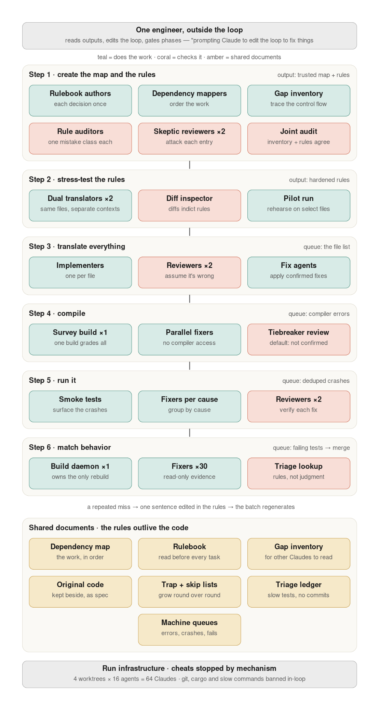
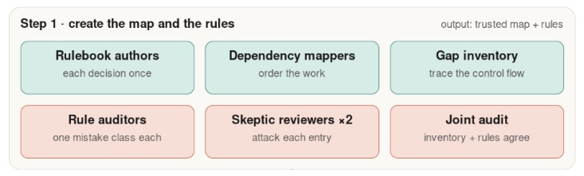
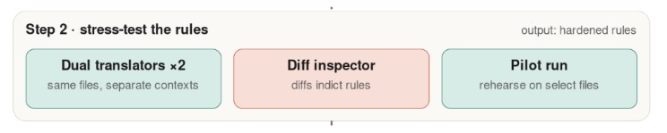
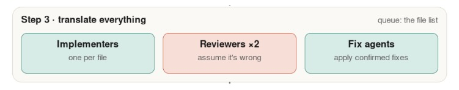
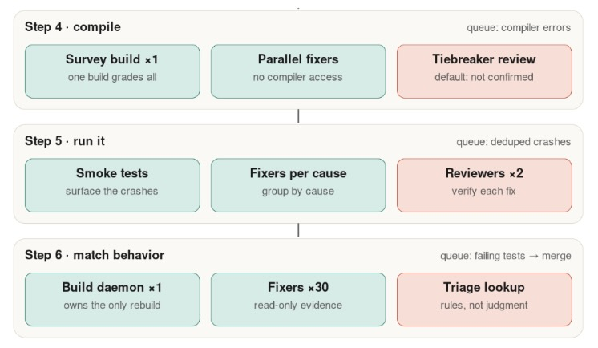

# Anthropic 如何用 Claude Code 执行大规模代码迁移（中英对照）

> **原文标题：** How Anthropic runs large-scale code migrations with Claude Code
> **作者：** Anthropic（原文未署名）
> **原文链接：** https://claude.com/blog/ai-code-migration
> **发布日期：** 2026-07-16
> **翻译模型：** GLM-5.3
> 排版：每段英文原文在前，中文翻译紧随其后。术语保留英文原文并附中文释义。

---

How Anthropic runs large-scale AI code migrations with Claude Code: a six-step process and an open-source starter kit, from Bun's million-line Zig-to-Rust port.

Anthropic 如何用 Claude Code 执行大规模 AI 代码迁移：一套六步流程和一个开源入门工具包（starter kit），经验来自 Bun 百万行代码的 Zig 到 Rust 移植。

A step-by-step guide to running large code migrations with AI agents - including Bun's million-line Zig-to-Rust port.

一份用 AI 智能体执行大型代码迁移的分步指南--包括 Bun 百万行代码的 Zig 到 Rust 移植。

Code migrations, projects that port a production codebase to a new language, were multi-year endeavors until recently.

代码迁移（code migration）--把生产代码库移植到新语言的项目--直到最近都还是以年计的工程。

In the last month, individual developers at Anthropic migrated 10 code packages consisting of tens to hundreds of thousands of lines of code using Claude Fable 5, Claude Opus 4.8, and dynamic workflows. In this article we'll cover two examples along with best practices from these projects.

就在上个月，Anthropic 的几位开发者用 Claude Fable 5、Claude Opus 4.8 和动态工作流（dynamic workflows）完成了 10 个代码包的迁移，规模从数万到数十万行代码不等。本文将介绍其中两个案例，以及从这些项目中总结出的最佳实践。

Jarred Sumner, co-founder of Bun and Member of Technical Staff at Anthropic, used Claude Code to migrate Bun from Zig to Rust. A million lines of code were produced in less than two weeks, with 100% of Bun's existing test suite passing in CI before merge. Nineteen regressions surfaced after merge and have all been fixed. The Rust port was shipped inside Claude Code in June.

Bun 联合创始人、Anthropic 技术团队成员（Member of Technical Staff）Jarred Sumner 用 Claude Code 把 Bun 从 Zig 迁移到了 Rust。百万行代码在不到两周内完成，合并前 Bun 现有测试套件在 CI 中 100% 通过。合并后浮现了十九个回归（regression），目前已全部修复。该 Rust 移植版已于六月随 Claude Code 发布。

Mike Krieger, co-lead of Anthropic Labs, migrated a Python codebase to 165,000 lines of TypeScript over a weekend. This included hundreds of agents, eight phase gates, three adversarial review rounds, and a final parity check that diffed every command's output against the Python original.

Anthropic Labs 联合负责人 Mike Krieger 在一个周末把一个 Python 代码库迁移为 165,000 行 TypeScript。整个过程动用了数百个智能体、八道阶段闸门（phase gate）、三轮对抗性审查（adversarial review），以及一次把每条命令的输出与 Python 原版逐项比对的一致性校验（parity check）。

Claude Code's new capabilities change the math for these long-deferred projects. Below is the six-step process we now use, drawn from what these migrations taught us.

Claude Code 的新能力改变了这些被长期搁置项目的账目。下面是我们如今采用的六步流程，提炼自这些迁移项目带来的经验。

The core insight is that you don't fix the code. You fix the process (loop) that produced the code.

核心洞见在于：你不是在修代码，而是在修产出代码的那个流程（循环）。

# 什么是 AI 代码迁移？（What is an AI code migration?）

An AI code migration uses AI agents to port a production codebase to a new language or framework. Instead of translating files by hand, engineers write migration rules and verification loops; agents then translate, compile, and test until the new code's behavior matches the original - compressing multi-year projects into weeks.

AI 代码迁移是用 AI 智能体把生产代码库移植到新语言或新框架。工程师不再逐文件手工翻译，而是编写迁移规则和验证循环；智能体随后进行翻译、编译和测试，直到新代码的行为与原版一致--把以年计的项目压缩到几周。

# 为什么迁移语言、何时迁移（Why and when to migrate languages）

Before going straight into the how, it's worth discussing the when and why because the assumptions around these projects have evolved.

在直接讲“怎么做”之前，值得先讨论“何时”与“为何”，因为围绕这类项目的种种假设已经变了。

Teams launch migrations because of landscape changes between their initial build and current project. Either a known trade-off has become limiting, a better approach has emerged, or the original ecosystem is shrinking.

团队发起迁移，是因为从最初构建到当下项目之间环境发生了变化：要么某个已知的权衡开始掣肘，要么出现了更好的方案，要么原有生态正在萎缩。

For example, Jarred originally chose Zig because it offered C-level performance with radical simplicity, ideal for a solo founder "writing Bun in 1 year in a cramped Oakland apartment pre-LLM." This simplicity came with known tradeoffs, which he writes about here.

例如，Jarred 当初选择 Zig，是因为它以极致的简洁提供了 C 级性能，对一位“在前 LLM 时代、在奥克兰的狭窄公寓里用一年写出 Bun”的独立创始人来说堪称理想。这种简洁伴随着已知的权衡，他在这里写到了这些。

Fast forward to 2026. Bun's CLI is getting over 10 million monthly downloads and is used extensively within Claude Code.

快进到 2026 年。Bun CLI 的月下载量已超过 1000 万次，并在 Claude Code 中被大量使用。

As recently as last quarter, those tradeoffs wouldn't have been enough to justify freezing the roadmap and committing resources to a multi-quarter project. Migrating languages can deliver smaller, faster, and safer systems, but no one wants to pay for them.

就在上个季度，这些权衡还不足以让人冻结路线图、为一个跨多季度的项目投入资源。迁移语言确实能带来更小、更快、更安全的系统，但没人愿意为此买单。

Software engineers have also had to contend with the career risk inherent in these formerly mega-projects. You could maintain two parallel code bases for quarters or years, and if the end result was 90% parity, you had a bigger headache than when you started.

软件工程师还必须应对这类昔日超级工程固有的职业风险：你可能要维护两套并行代码库几个季度甚至几年，而如果最终结果只达到 90% 的一致性，你面临的麻烦比开工前还大。

Now, the worst case scenario is you delete the branch and try again.

现在，最坏的情况不过是删掉分支重来。

There still needs to be a justifiable business case. While million line migrations no longer cost $3 to $4 million in engineering resources over the course of a four year project, they still cost tens to hundreds of thousands of dollars or more to execute. The Bun migration, for example, consumed 5.9 billion uncached input tokens and 690 million output tokens - around $165,000 at API pricing. The main portion of Mike's port was 27 million tokens.

当然，仍然需要有说得通的业务理由。百万行级的迁移不再需要在四年周期里耗费 300 万到 400 万美元的工程资源，但执行起来仍要花费数万到数十万美元甚至更多。以 Bun 迁移为例，它消耗了 59 亿未缓存输入 token 和 6.9 亿输出 token--按 API 定价约合 165,000 美元。Mike 移植的主要部分则消耗了 2700 万 token。


> Jarred's million-line PR.
> Jarred 的百万行 PR。

However, the migration case no longer needs to be existential. A year of memory-bug patches in the changelog, or one chronic bottleneck, can now justify it.

不过，迁移的理由已不必是生死攸关的大事。变更日志里整年的内存 bug 补丁，或一个长期存在的瓶颈，如今就足以支撑它。

The compile step was the impetus for Mike's project. The internal tool his team works on ships to users as a single binary. Producing that binary with the Python toolchain took roughly eight minutes per platform, totaling a 30-minute wait across the build matrix on every release. After the port, the same compile now takes about two seconds, the binary starts 6x faster, and the team was able to retire a separate deployment pipeline.

编译步骤是 Mike 项目的直接动因。他团队开发的内部工具以单一二进制文件的形式交付给用户。用 Python 工具链产出该二进制文件，每个平台大约需要八分钟，构建矩阵全跑完、每次发布要等 30 分钟。移植之后，同样的编译现在只需约两秒，二进制启动快了 6 倍，团队还得以退役一条独立的部署流水线。

# 为什么 AI 改变了代码迁移的账（Why AI changes the code migration math）

Claude Fable 5 is our most capable, generally available model. Fable and Opus 4.8 are particularly good at delegating, directing, and verifying parallel workstreams with subagents while finding multiple paths towards stated goals.

Claude Fable 5 是我们目前能力最强、已正式发布可用（generally available）的模型。Fable 和 Opus 4.8 尤其擅长用 subagents 委派、指挥和验证并行工作流，同时能为既定目标寻找多条路径。

Large code migrations are a particularly effective use case for these advanced models because:

大型代码迁移对这些先进模型来说尤其有效，原因如下：

- The work is parallel. Work can be executed across thousands of independent units such as files and crates, so agents can work at the same time rather than have one waiting on the other.
- Context is clear and comprehensive. The old code serves as a great spec for the model. It also serves as a core reference to help build the guide for translation agents to follow.
- There is a built-in referee. Many large codebases will include a test suite that agents can use to verify their work. Agents perform their best when verification is objective, because the model can grind against a ground truth for days without a human arbitrating quality.
- The queue writes itself. When a compiler or test run fails, that becomes the next item for an agent to fix.
- They require consistency and edge case handling: The process is built so drift has nowhere to hide: reviewers cite the rule behind every finding, so a violation becomes a queue item instead of a quiet divergence. And when an agent does hit an edge case, the fix becomes a rule every subsequent agent follows.

- 工作是并行的。工作可以拆分到数千个独立单元（如文件和 crate）上执行，智能体可以同时干活，而不是一个等另一个。
- 上下文清晰而完整。旧代码本身就是给模型的绝佳规格（spec），也是帮助构建翻译智能体所遵循指南的核心参照。
- 自带裁判。许多大型代码库都包含测试套件，智能体可以用它验证自己的工作。验证客观时智能体表现最佳，因为模型可以对着一个基准真值（ground truth）连磨好几天，无需人工裁决质量。
- 任务队列自动生成。编译或测试一旦失败，失败项就成了智能体要修的下一件事。
- 它们要求一致性与边界情况处理：流程的设计让偏差无处遁形：审查者要为每个发现引用背后的规则，于是违规会变成队列里的一项，而不是悄悄的偏离。而当智能体真的撞上一个边界情况（edge case），修复方案就会变成此后所有智能体遵循的规则。

As we will see below, both Mike and Jarred used Fable for key steps in their migration process, particularly in an advisory pattern that used multiple model classes to optimize token consumption.

如下文所见，Mike 和 Jarred 都在迁移过程的关键步骤用了 Fable，尤其是采用一种使用多个模型档级的顾问模式，以优化 token 消耗。

# 大型代码迁移六步法（Six steps for large code migrations）

The process below has been generalized to be relevant to multiple languages and scenarios. For additional details, you can read Jarred's blog. You can also access the Migration starter kit. Note: The starter kit is a generalized template of the process above - it's not what these specific ports ran on.

下面的流程已做泛化，适用于多种语言和场景。更多细节可以阅读 Jarred 的博客，也可以获取迁移入门工具包（Migration starter kit）。注意：入门工具包是上述流程的通用模板--并非这两个移植项目实际所用的东西。

## 前置条件（Prerequisites）

A prerequisite before starting on your migration project is to have a strong judge in place, otherwise you won't have an exit condition or measure of success.

启动迁移项目之前的一个前置条件，是先备好一个强有力的裁判（judge），否则你既没有退出条件，也没有成功的度量。

The judge must be able to evaluate both the original code and the target code on equal terms. Test suites written in the original language will often depend on internal functions that won't exist in the target code.

这个裁判必须能在同等条件下评估原始代码和目标代码。用原语言编写的测试套件往往依赖目标代码中不会存在的内部函数。

To build this judge:

构建这个裁判的方法：

- Categorize existing tests. Use Claude to identify which tests are expressible as external calls and which depend on internals that won't port.
- Rewrite for portability. Convert the external-facing tests into assertions that can run against both the original and the port. Use adversarial agents to verify the rewritten tests don't weaken the assertions.
- Validate the judge. Run it against the original code to confirm it passes. Then run it against deliberately broken code to confirm it fails - a judge that doesn't catch breakage isn't a judge.

- 给现有测试分类。用 Claude 识别哪些测试可以表达为外部调用，哪些依赖无法移植的内部实现。
- 为可移植性重写。把面向外部的测试改写成既能对原版、也能对移植版运行的断言。再用对抗性智能体验证重写后的测试没有削弱断言。
- 验证裁判。先在原始代码上跑一遍，确认它通过；再在故意改坏的代码上跑一遍，确认它失败--抓不住破坏的裁判算不上裁判。

Jarred had a large test suite written in a third language (TypeScript), but that will not be the case for most projects. For his Python-to-TypeScript port, Mike created a parity harness of seven real-world scenarios and considered any behavior change a bug to be fixed.

Jarred 拥有一套用第三种语言（TypeScript）编写的大型测试套件，但大多数项目没有这种条件。在他的 Python 到 TypeScript 移植中，Mike 构建了一个由七个真实场景组成的一致性测试组件（parity harness），并把任何行为变化都视为待修复的 bug。

Before we get into each stage, this graphic may help you follow along. This mostly follows Jarred's methodology, with reviews and gates at each stage. Mike followed a similar overall structure using similar loop workflows, but he ran the entire migration end to end, revised the rules and the workflow based on the results, and ran it again - discarding the output each time until the third run.

在进入每个阶段之前，这张图或许有助于你跟上节奏。它基本遵循 Jarred 的方法论，每个阶段都设审查和闸门。Mike 采用的总体结构类似、循环工作流也类似，但他是把整个迁移从头到尾跑一遍、根据结果修订规则和工作流、然后再跑--每次都丢弃输出，直到第三轮为止。



## 第 1 步--创建规则手册、依赖图和差距清单（Step 1 - Create the rulebook, dependency map, and gap inventory）



In this stage we are creating the foundations of our migration: an inventory of places where code will need to be refactored rather than just translated, a rulebook for how to translate our code, and a dependency map to order our migration implementation workstreams.

这个阶段要为迁移打好地基：一份清单，列出哪些地方需要重构而非单纯翻译；一本规则手册（rulebook），规定代码如何翻译；还有一张依赖图（dependency map），用来排定迁移实现工作流的顺序。

The order matters: the rulebook must come before the gap inventory. The gap inventory is defined by what the rulebook's defaults won't cover, and the two are tested together in a joint audit.

顺序很重要：规则手册必须先于差距清单（gap inventory）。差距清单由规则手册默认规则覆盖不到的部分来定义，二者要在一次联合审计中一起检验。

### 规则手册（Rulebook）

The exact shape of the rulebook depends on key architectural decisions you must make at the start. Chief among them, if the new code will follow the same structure, or if it will be completely redesigned.

规则手册的确切形态取决于你必须在开头做出的关键架构决策，其中首要的是：新代码是沿用原有结构，还是彻底重新设计。

If it's the former (Jarred), the rulebook will primarily be lookup tables that translates types and idioms between languages while pointing to the gap inventory for the harder-to-translate components. If it's the latter (Mike), it will be a design document.

如果是前者（Jarred），规则手册主要是查找表（lookup table），在两种语言之间转换类型与惯用法，并为较难翻译的组件指向差距清单。如果是后者（Mike），它就会是一份设计文档。

Jarred created his rulebook by chatting with Claude, forming a policy for each area of ambiguity. He also used eight subagents specifically designed to review for 8 different categories of common failure modes based on his own intuition.

Jarred 通过与 Claude 对话来创建规则手册，为每一处模糊地带制定策略。他还根据自身直觉，专门设计了八个 subagents，分别审查八类常见的失败模式。

### 依赖图（Dependency map）

You need to understand file dependencies to effectively break up workstreams for a parallel migration so you know which files to migrate first and which files to contain in the same batch. Some languages and codebases have explicit manifests that make this easy, but for legacy codebases and many popular languages like C/C++ and Python, these dependencies need to be discovered and mapped.

你需要理解文件间依赖，才能为并行迁移有效拆分工作流，从而知道先迁移哪些文件、哪些文件要放进同一批。有些语言和代码库有显式的清单（manifest）让这件事轻而易举，但对于遗留代码库以及 C/C++、Python 等许多流行语言，这些依赖需要被发现和绘制。

Claude Code can deploy agents to create and run a deterministic script to produce this map. The prompt in the migration kit uses a workflow to create a review-and-fix loop. Note: The starter kit is a generalized template of the process laid out in this post - it's not what these specific ports ran on.

Claude Code 可以派出智能体创建并运行一个确定性脚本来产出这张图。迁移工具包中的提示词用一个工作流构建“审查--修复”循环。注意：入门工具包是本文所述流程的通用模板--并非这两个移植项目实际所用的东西。

### 差距清单与怀疑式审查者（Gap inventory and skeptic reviewers）

The new language has different requirements from the old language that must be met. For Zig to Rust the difference was manual memory management (C and C++ work the same way). For example:

新语言有着不同于旧语言、必须予以满足的要求。从 Zig 到 Rust，差异在于手动内存管理（C 和 C++ 也是同样的机制）。例如：

Zig

```zig
fn readConfig(allocator: std.mem.Allocator) ![]u8 {
    const buf = try allocator.alloc(u8, 1024);
    // ...fill buf...
    return buf; // caller must free this - but only the comment says so
}
// A caller that forgets 'defer allocator.free(buf)' still compiles - the leak only surfaces at runtime.
```

Rust

```rust
fn read_config() -> Vec<u8> {
    let buf = vec![0u8; 1024];
    // ...fill buf...
    buf // ownership moves to the caller; memory is freed automatically
}
// Use it after it's moved? Free it twice? Neither compiles.
// Forget to free it? There's no free call to forget - drop is automatic.
```

For Python to TypeScript the gap was interfaces and contracts. Python doesn't require a contract declaring what shape of object it will accept or what it returns, but TypeScript does. For example:

从 Python 到 TypeScript，差距在于接口与契约。Python 不要求声明接受什么形状的对象、返回什么，而 TypeScript 要求。例如：

Python

```python
def register(handler):
    handler.setup()
    return handler.run({"retries": 3})
# Any object with .setup() and .run() works here. Which objects actually get passed in? Read the whole codebase to find out.
```

TypeScript

```typescript
interface RunResult { ok: boolean }
interface Handler {
  setup(): void;
  run(opts: { retries: number }): Promise<RunResult>;
}
function register(handler: Handler): Promise<RunResult> {
  handler.setup();
  return handler.run({ retries: 3 });
}
// The contract must be written down before this compiles
```

Both Jarred and Mike created gap inventory files capturing this implicit knowledge. Jarred inventoried these gaps up front, which is what we do here, while Mike chose to translate first and then create the gap inventory by auditing afterwards. You may need to do both.

Jarred 和 Mike 都创建了差距清单文件来沉淀这些隐性知识。Jarred 是预先清点差距（也就是我们这里采用的做法），Mike 则选择先翻译、事后通过审计来建差距清单。你可能两者都需要。

Check out this sample Claude Code prompt to create a gap inventory file.

可以看看这个创建差距清单文件的 Claude Code 示例提示词。

## 第 2 步--压力测试规则（Step 2 - Stress-test the rules）



This step involves a mini-migration that serves as a "shakedown cruise" for the larger migration.

这一步要做一次小型迁移，作为大迁移之前的“试航”（shakedown cruise）。

In this step, Jarred used one agent to translate three files using the rulebook, one agent to translate three files "like a senior Rust engineer," and one agent to use the diff to create new translation rules. At this stage he caught two critical issues that would have created numerous issues if fanned out across all 1,448 files.

在这一步，Jarred 用一个智能体按规则手册翻译三个文件，用一个智能体“像资深 Rust 工程师那样”翻译三个文件，再用一个智能体根据 diff 创建新的翻译规则。他在这个阶段抓到了两个关键问题--如果扩散到全部 1,448 个文件，它们会引发无数麻烦。

The prompt may look something like this.

提示词大致如下。

This type of stress test only works for structure-preserving migrations, where two translations of the same file are comparable line by line. If your rulebook is a redesign - like Mike's - the equivalent test is attacking the design document directly with adversarial reviewers, then validating it with a disposable end-to-end run.

这类压力测试只适用于保持结构的迁移，即同一文件的两种译文可以逐行比较。如果你的规则手册是一次重新设计--比如 Mike 那样--对应的测试就是让对抗性审查者直接攻击设计文档，再用一次可丢弃的端到端运行加以验证。

Regardless, throw out any translated files. The goal is to refine the rules, not make incremental progress.

无论如何，译出的文件一律扔掉。目标是打磨规则，而不是攒渐进的进度。

## 第 3 步--翻译一切（Step 3 - Translate everything）



For the remaining steps, you run the same multi-agent loop architecture: implement, review, and fix.

在剩余步骤中，你运行的都是同一套多智能体循环架构：实现、审查、修复。

You can offload implementer work to smaller models and keep reviewers on larger ones. For example, Mike used Claude Sonnet when he fanned out 12 subagents for the main migration.

可以把实现工作交给较小的模型，审查则留给较大的模型。例如，Mike 在主迁移中派出 12 个 subagents 时用的是 Claude Sonnet。

The work queue should be mechanical. A batch script decides what's done by checking whether the translated file exists on disk, then slices the pending files into batches for the implementer agents. Because the queue is rebuilt from disk every time, the migration is resumable by construction.

工作队列应当是机械的。一个批处理脚本通过检查译文文件是否存在于磁盘来判定完成与否，再把待处理文件切成分批交给实现智能体。由于队列每次都从磁盘重建，迁移天然就是可续跑的。

At this stage, agents can be overly cautious with how much work they do. The fix can be a blunt, emphatic prompt instruction with context that the compiler will catch mistakes in the next step.

在这个阶段，智能体对工作量可能过于保守。解决办法是给出一条直白、语气强烈的提示指令，并说明编译器会在下一步抓住错误。

Anything the translator can't execute confidently gets flagged with // TODO(port): <reason> to be dealt with in step 4. From here on, the to-do lists write themselves: the compiler enumerates the errors, the smoke tests find the crashes, the suite reports the failures.

翻译者没有把握执行的部分，都用 // TODO(port): <reason> 标记出来，留待第 4 步处理。从这时起，待办清单会自动生成：编译器枚举错误，冒烟测试（smoke test）发现崩溃，测试套件报告失败。

Two adversarial reviewers evaluate the work of the implementers using separate contexts and disagreement between reviewers goes to a third agent. When a reviewer keeps catching the same mistake across files, the fix isn't per-file. You add one sentence to the rulebook and regenerate the affected batch. The rulebook keeps growing through this step; the code never gets hand-patched against it.

两个对抗性审查者用各自独立的上下文评估实现者的工作，二人意见不合时交给第三个智能体。当某个审查者跨文件反复抓到同一类错误时，修复不是逐文件进行：你在规则手册里加一句话，然后重新生成受影响的批次。规则手册在这一步持续增长；代码从不针对它打手工补丁。

One important design decision to note in this step is where the compiler sits. Mike ran the TypeScript compiler inside every loop, because it checks a unit in seconds. Jarred banned the compiler from the loop entirely and deferred it to the next step, because cargo takes minutes.

这一步值得注意的一个重要设计决策是编译器放在哪里。Mike 把 TypeScript 编译器放进每个循环里，因为它几秒钟就能检查完一个单元；Jarred 则完全禁止编译器进入循环、把它推迟到下一步，因为 cargo 一跑就是几分钟。

At this step, much of the heavy lifting has been done and the prompts start to get shorter.

到这一步，大量重活已经完成，提示词也开始变短。

## 第 4、5、6 步--编译、运行并对齐行为（Steps 4, 5, 6 - Compile, run, and match behavior）



These three steps share the same loop architecture and need progressively less human judgment, so we cover them together.

这三步共用同一套循环架构，且所需的人工判断逐级递减，因此放在一起讲。

Step 4, for example, may often dissolve into step 3 depending on the language and size of the migration.

例如，视语言和迁移规模而定，第 4 步往往会被并进第 3 步。

Depending on the size and difficulty of the compiler step, agents may not run this at all. Jarred executed this with an orchestrator script that invoked the compiler once across the whole workspace. "Fixer agents" then ran through the error list in parallel with adversarial review. The build runs again, rinse and repeat.

视编译步骤的规模和难度，智能体可能根本不运行这一步。Jarred 用一个编排器（orchestrator）脚本对整个工作区一次性调用编译器，然后由“修复智能体（fixer agents）”并行地跑错误清单，同时伴随对抗性审查。再次构建，如此往复。

Reviewing the error list is helpful to catch systemic issues that may require adjustments. For example, Jarred ran into thousands of Rust module errors that surfaced after fixing cyclic imports that Zig's lazy compilation tolerated. He fixed the loop by encoding logic to classify which dependence to delete, move, or restructure the boundary.

审查错误清单有助于发现可能需要调整的系统性问题。例如，Jarred 遇到过数千个 Rust 模块错误，它们在修复了 Zig 惰性编译所容忍的循环导入（cyclic import）之后才浮出水面。他通过给循环加入一段分类逻辑来修复：判断每个依赖该删除、移动，还是重构边界。

Step 5 also has a mechanical source of truth similar to the compiler error list: crashes from the smoke test. Again, the loop fix was to group issues into categories, in this case grouping causes by root cause that are reviewed by adversarial subagents.

第 5 步也有一个类似编译器错误清单的机械真值来源：冒烟测试的崩溃。同样，循环的修法是把问题归类，这里是按根因（root cause）分组，交由对抗性 subagents 审查。

Step 6 and the end of our story is comparing the programs' behavior across the two codebases.

第 6 步也是我们故事的尾声：比较两个代码库之间程序的行为。

Our files have now been translated, compiled, and smoke tested. Now it's time to shard them and run the test suite (from the prerequisite stage) against them. Tackle failures with "fixer agents" that review the failed tests against both codebases. Adversarial reviewers check their fixes.

文件此时已完成翻译、编译和冒烟测试。接下来要把它们分片（shard），并运行（前置阶段准备的）测试套件来检验。用“修复智能体”对照两个代码库审查失败的测试来攻坚，对抗性审查者再检查它们的修复。

The next stage in this loop is a build daemon, which is the only process allowed to rebuild the binary. Fixers write patches; the daemon batches them, rebuilds once, re-runs the affected tests, and feeds the results back. This serializes the most expensive operation instead of letting multiple agents trigger it independently.

这个循环的下一阶段是一个构建守护进程（build daemon），它是唯一被允许重建二进制的进程。修复者写补丁；守护进程把补丁攒起来、重建一次、重跑受影响的测试，再把结果回馈回去。这样就把最昂贵的操作串行化，而不是让多个智能体各自触发。

When the same failure repeats across many tests, the fix moves upstream: you amend the rule that produced the bug and regenerate only the files that rule touched.

当同一失败在许多测试中反复出现时，修复要向上游走：修订产生 bug 的那条规则，只重新生成该规则触及的文件。

Mike's approach matters here, because many developers won't have a built-out or ported test suite. Mike had Claude create a small script to run 7 real-world scenarios against both the new port and the original Python codebase, and diffed the results. Each failing scenario got its own fix agent, and the loop ran until all seven passed.

Mike 的做法在这里很有意义，因为很多开发者并没有现成的或移植好的测试套件。Mike 让 Claude 写了个小脚本，对新移植和原始 Python 代码库各跑 7 个真实场景，然后比对结果。每个失败的场景配一个专属修复智能体，循环一直跑到七个场景全部通过。

Then he went one step further. Claude designed its own end-to-end test suite and ran it autonomously overnight, fixing what broke and re-running four nights in a row. As a result, it caught the paper cuts no scenario list would have predicted.

之后他更进一步。Claude 设计了自己的端到端测试套件，整夜自主运行，修好崩的、再跑一遍，连跑四晚。结果，它抓到了任何场景清单都预料不到的小毛病（paper cut）。

The lesson is that a missing test suite doesn't block this step. If you can't inherit a referee, have Claude build one. Your original codebase is the ground truth either way.

经验是：缺测试套件并不卡住这一步。如果你无法继承一个裁判，就让 Claude 造一个。无论哪种情况，你的原始代码库都是基准真值（ground truth）。

# 代码迁移最佳实践（Code migrations best practices）

Every run taught us something the previous one didn't. It's a safe bet your next migration will teach you things this guide can't. But a few practices held up across every project:

每一轮都教会我们上一轮没教的东西。几乎可以肯定，你的下一次迁移也会教你这本指南教不了的东西。但有几点实践在每个项目里都站住了脚：

- Don't follow this guide blindly. Each migration is different. Treat this as a starting point, and plan your specific migration with Claude before committing to it.
- Don't focus on individual failures. Individual failures are the loop's job. Fixer agents burn those down. Your attention belongs on the patterns.
- Make review adversarial and verification mechanical. Adversarial review allows for longer running tasks and is often worth the token consumption. Let scripts - a compiler, a diff, a test suite - be the referee.
- Don't use the largest model for everything. Token spend concentrates in your loops, so design them deliberately. Smaller models handle the high-volume implementation fan-out well; save your largest model for reviewers and for anything that writes rules other agents will follow.
- Front-load the human hours. The rulebook and the stress test are the most time-consuming. Everything after is mostly queues burning down.
- Make the work queue mechanical and resumable. Done should mean "the output file exists on disk."

- 不要盲从本指南。每次迁移都不同。把它当作起点，在正式投入之前先和 Claude 一起规划你的具体迁移。
- 别盯着个别失败。个别失败是循环的职责所在，修复智能体会把它们烧光。你的注意力应该放在模式上。
- 让审查对抗化、验证机械化。对抗性审查支持更长时运行的任务，通常值得那份 token 消耗。让脚本--编译器、diff、测试套件--来当裁判。
- 不要什么都用最大的模型。token 花销集中在你的循环里，所以要刻意设计。大批量铺开的实现工作，小模型处理得很好；把最大的模型留给审查者，以及任何要为其他智能体编写规则的工作。
- 把人工工时前置。规则手册和压力测试最耗时间，之后的一切基本就是队列逐步清空。
- 让工作队列机械化且可续跑。“完成”的定义应当是“输出文件已存在于磁盘”。

# 审查循环的结果，而非代码（Review loop results, not code）

Jarred's Bun migration is now in production, although every migration has tradeoffs. For example, about 4% of the Rust code sits inside "unsafe" blocks, mostly single-line pointer operations at C/C++ boundaries.

Jarred 的 Bun 迁移现已上线生产，不过每次迁移都有权衡。例如，约 4% 的 Rust 代码位于 unsafe 块内，大多是 C/C++ 边界处的单行指针操作。

But the new codebase is measurably better. Every memory leak the team's tooling can detect has been fixed: one benchmark of 2,000 repeated builds dropped from 6,745 MB of memory to 609. The binary is 19% smaller on Linux and Windows. And cross-language optimization made it 2–5% faster across HTTP serving and real-world workloads like next build and tsc.

但新代码库在可度量的指标上更好。团队工具能检测到的每一处内存泄漏都已修复：一项 2,000 次重复构建的基准测试，内存占用从 6,745 MB 降到 609。二进制在 Linux 和 Windows 上小了 19%。跨语言优化还让它在 HTTP 服务以及 next build 和 tsc 等真实负载上快了 2–5%。

Consider whether it's time to re-run the math of your long deferred migration. Pick the codebase you've been tolerating and ask Claude what the migration process looks like for it.

想想是不是该为你搁置已久的迁移重新算一笔账。挑一个你一直在忍受的代码库，问问 Claude 它的迁移流程会是什么样。

Related

相关资源

- Migration starter kit Note: The starter kit is a generalized template of the process above - it's not what these specific ports ran on.
- Code-modernization plugin - for legacy modernization and framework upgrades rather than language ports
- Dynamic workflows in Claude Code

- 迁移入门工具包（Migration starter kit）注意：入门工具包是上述流程的通用模板--并非这两个移植项目实际所用的东西。
- 代码现代化插件（Code-modernization plugin）--用于遗留系统现代化和框架升级，而非语言移植
- Claude Code 中的动态工作流（Dynamic workflows in Claude Code）
