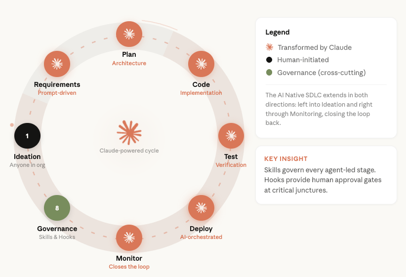
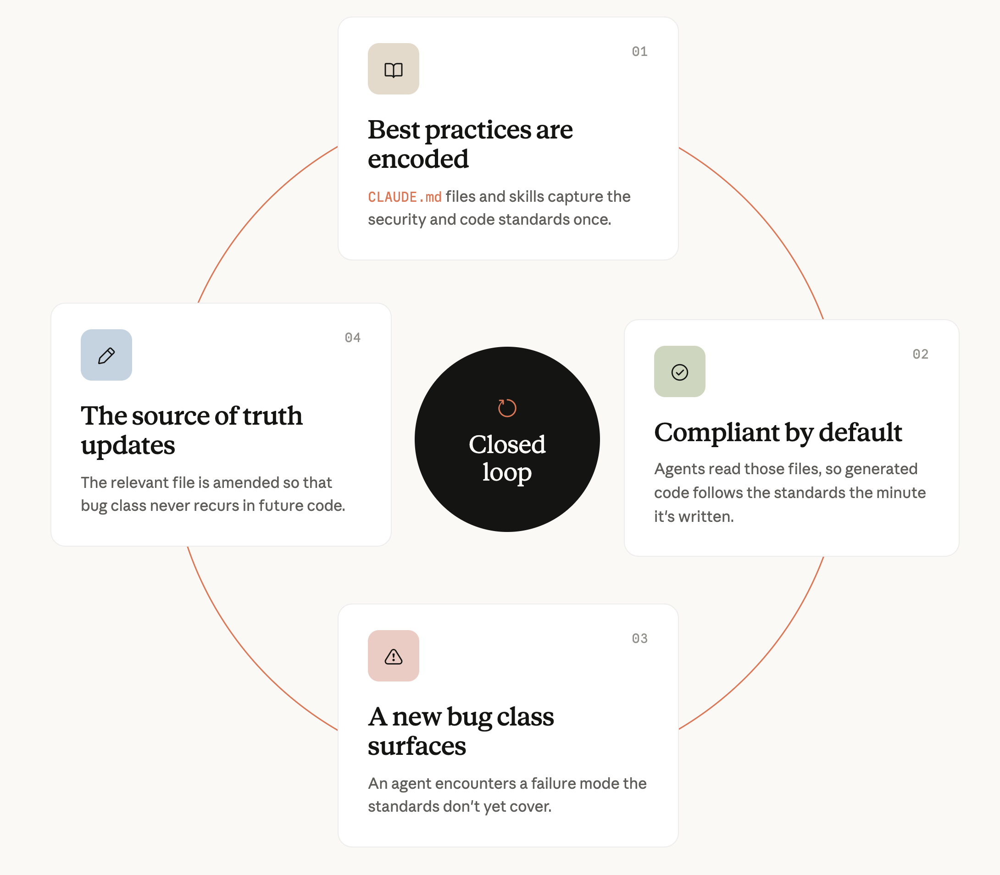
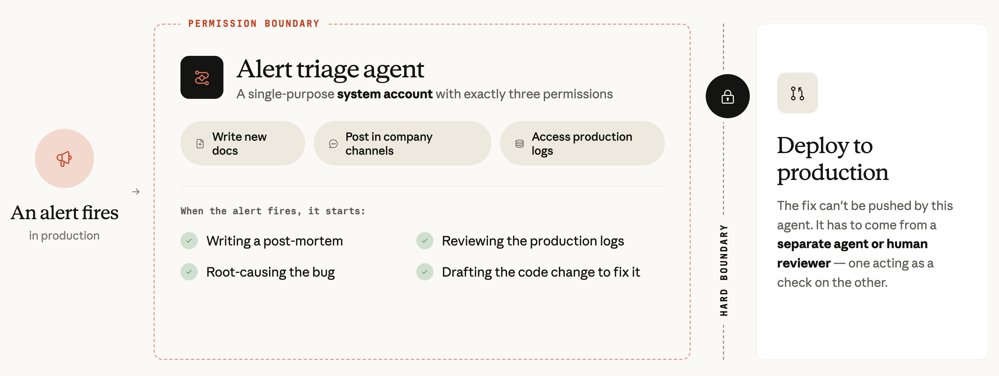

# Anthropic 如何保障其 AI 原生软件开发生命周期的安全（中英对照）

> **原文标题：** How Anthropic secures its AI-native software development lifecycle
> **作者：** Jason Clinton, Deputy CISO, Anthropic（副首席信息安全官）
> **原文链接：** https://claude.com/blog/how-anthropic-secures-its-ai-native-software-development-lifecycle
> **发布日期：** 2026-07-21
> **翻译模型：** GLM-5.3
> 排版：每段英文原文在前，中文翻译紧随其后。术语保留英文原文并附中文释义。

---

Anthropic Deputy CISO Jason Clinton details how the Security Engineering team secures an AI-native SDLC where AI authors 80% of merged code.

Anthropic 副首席信息安全官（Deputy CISO）Jason Clinton 详细介绍了安全工程团队如何保障一个由 AI 编写 80% 合入代码的 AI 原生 SDLC 的安全。

Anthropic Deputy CISO, Jason Clinton, details how the Security Engineering team secures a SDLC that has AI authoring 80% of merged code.

Anthropic 副首席信息安全官（Deputy CISO）Jason Clinton 详细介绍了安全工程团队如何保障一个由 AI 编写其中 80% 合入代码的 SDLC 的安全。

At Anthropic, the amount of code and velocity of deployment have scaled exponentially. Our software engineers on average ship 8x as much code per quarter as they did from 2021 to 2025.

在 Anthropic，代码量和部署速度都呈指数级增长。我们的软件工程师现在平均每季度发布的代码量是 2021 至 2025 年期间的 8 倍。

Our reviews, monitoring, and other security processes needed to scale alongside this increased pace. Otherwise it becomes a formula for bottlenecks (Amdahl's Law).

我们的评审、监控及其他安全流程需要与这种提速同步扩展，否则就会成为瓶颈的成因（阿姆达尔定律，Amdahl's Law）。

Our software development processes have changed drastically as well. Claude has evolved from coding assistant to primary creator and reviewer. Claude authors about 80% of the code merged into our codebase today.

我们的软件开发流程也发生了巨变。Claude 已从编码助手演变为主要的创建者和评审者。如今合入我们代码库的代码中约有 80% 由 Claude 编写。

More than half of all code is being merged by our internal version of Claude Tag while human engineers focus on directing, setting intent, and owning final approval.

超过一半的代码由我们内部版的 Claude Tag 合入，而人类工程师则专注于指导、设定意图，并对最终审批负责。

This means our security team must defend a rapidly expanding surface area and harden a lifecycle with non-deterministic, constantly evolving agents at its heart. In this article, I cover strategies to secure the software development lifecycle (SDLC).

这意味着我们的安全团队必须防御一个快速扩张的攻击面，并加固一个以非确定性、持续演进的智能体（agent）为核心的生命周期。在本文中，我将介绍保障软件开发生命周期（software development lifecycle，SDLC）安全的策略。

(This is intended to be combined with the Zero Trust for Agents framework we recently published; everything in this article uses security design ideas from that framework in the implementation.)

（本文旨在与我们近期发布的 Zero Trust for Agents 框架结合阅读；本文中的一切实现都采用了该框架中的安全设计思想。）

The threats we're designing against are specific: a compromised or prompt-injected agent introducing a malicious change; supply-chain and dependency poisoning that an agent ingests as trusted input; and the more familiar classes of application vulnerability now arriving at higher volume. Every control that follows maps to at least one of those.

我们所针对的威胁是具体的：被攻陷或遭到提示词注入（prompt injection）的智能体引入恶意变更；被智能体当作可信输入摄取的供应链攻击（supply chain attack）与依赖投毒（dependency poisoning）；以及如今以更高量级涌入的、更为人熟知的应用漏洞类别。下文的每一项控制措施都至少对应其中一类威胁。

There are several overarching strategies we've deployed to accomplish this without significantly throttling dev velocity including:

为了在不显著拖慢开发速度的前提下做到这一点，我们部署了若干总体策略，包括：

- Shifting security left and fully integrating with the code development stage;
- Using hard access and identity boundaries to contain the blast radius;
- Combining automated deterministic and agentic reviews before and after production; and
- Inserting humans in the loop at the highest leveraged points.

- 将安全左移（shifting security left）并与代码开发阶段完全整合；
- 利用严格的访问与身份边界来控制爆炸半径（blast radius）；
- 在上线前后结合自动化的确定性评审与智能体评审；以及
- 在杠杆效应最大的节点插入人工介入（human in the loop）。

In this article, we'll cover the security processes we have implemented at specific stages of the software development lifecycle as well as the core principles behind them. These principles are more enduring as security teams must reexamine, and often reinvent, their processes as model capabilities evolve.

在本文中，我们将介绍我们在软件开发生命周期特定阶段已实施的安全流程，以及其背后的核心原则。这些原则更具持久价值，因为随着模型能力演进，安全团队必须重新审视、甚至常常要重塑自己的流程。

# 不断演进的软件开发生命周期（The evolving software development lifecycle）

Our development team has covered the changes to their software development lifecycle at length, so this will be a brief primer before we dive into each stage.

我们的开发团队已详细撰文介绍过其软件开发生命周期的变化，因此在深入每个阶段之前，这里只做一个简要的入门说明。

At a high level, our software development lifecycle is compressed. It is driven by prototypes and internal adoption (dogfooding) more than lengthy planning cycles. Ideation comes from all corners of the organization and traditional roles (frontend, backend, design) are blurred. Reviews and approvals still have humans in the loop, but are also driven by agentic loops.

总体来看，我们的软件开发生命周期被压缩了。它更多由原型和内部自用（dogfooding）驱动，而非漫长的规划周期。创意来自组织的各个角落，传统角色（前端、后端、设计）的界限也变得模糊。评审与审批仍然有人工介入，但同时也由智能体循环（agentic loop）驱动。

While each stage has been fundamentally transformed and accelerated by Claude Code and Claude Tag, the names and purposes of each stage wouldn't look alien to a developer coming from a more traditional organization. These are natural gates that we also use as part of our security processes for an AI-native SDLC.

虽然每个阶段都被 Claude Code 和 Claude Tag 彻底改变并加速，但对于来自较传统组织的开发者来说，各阶段的名称和用途并不陌生。这些是天然的关卡（gate），我们也将它们用作 AI 原生 SDLC 安全流程的一部分。

# 规划（Plan）

One of our first security automations ever was a simple Claude Opus powered PSR (project security review) web application. It ingested a project design document and analyzed it against the MITRE ATT&CK framework to identify potential vulnerabilities and suggested mitigations.

我们最早的安全自动化之一是一个由 Claude Opus 驱动的简单 PSR（project security review，项目安全评审）Web 应用。它接收项目设计文档，并对照 MITRE ATT&CK 框架进行分析，以识别潜在漏洞并给出缓解建议。

We've significantly enhanced the system by connecting it to an internal knowledge index that provides much deeper context across our organization-wide policies, past decisions, and related systems.

我们将其接入一个内部知识索引，从而大幅增强了该系统；该索引提供了覆盖全组织政策、过往决策及相关系统的更深层上下文。

> The process internally at Anthropic for an automated PSR.
> Anthropic 内部自动化 PSR 的流程。

This gives us a better understanding of potential risk, and it also captures information missing from the PSR. This one implementation saved the majority of the AppSec team's time. Once we gained confidence that Claude was accurate in assessing risk, we allowed teams to approve their own project, if Claude deemed the launch low enough risk.

这让我们能更好地理解潜在风险，同时还能补全 PSR 中缺失的信息。仅这一项实现就为应用安全（AppSec）团队节省了大部分时间。一旦我们确信 Claude 评估风险的准确性，我们就允许团队在 Claude 认为上线风险足够低时自行批准自己的项目。

Here we can see one of the first key adaptations to an AI-native SDLC. A PSR was originally designed to catch security issues before the lengthy and expensive coding process. Catching an issue at this stage saved months of re-development.

这里可以看到针对 AI 原生 SDLC 的首批关键调整之一。PSR 最初的设计目的是在漫长而昂贵的编码过程之前发现安全问题。在此阶段发现问题可以节省数月的返工开发。

Today, multiple prototypes of major features can be created in hours, making detailed architectural review a less critical gate. Connecting our PSR application to our knowledge index captures context that could otherwise be missed without creating an unnecessary speed bump. Creating a Claude Code skill allowed Claude to further fan out and capture additional context wherever it lived.

如今，重大功能的多个原型可以在几小时内完成，这使详细的架构评审不再是那么关键的关卡。将 PSR 应用接入我们的知识索引，能在不制造不必要减速带的前提下捕获本可能遗漏的上下文。创建 Claude Code 技能（skill）则让 Claude 得以进一步扇出，在上下文所在的任何地方捕获更多上下文。

Enduring Principle: Connect security agents to organizational context. As the planning cycle compresses, it is much more effective to bring these agents to where the context already lives – chat threads, prior reviews, the codebase – rather than forcing detailed documentation at stages that may no longer require them. Either way, agents need context outside of the code itself.

持久原则：将安全智能体接入组织上下文。随着规划周期压缩，把这些智能体带到上下文原本所在之处--聊天线程、过往评审、代码库--远比在可能不再需要详细文档的阶段强制编写文档更有效。无论如何，智能体都需要代码本身之外的上下文。

# 编码（Code）

Security professionals within an AI-native engineering organization have a new lever: they can directly shape how code is created, helping to prevent vulnerabilities at the source.

在 AI 原生的工程组织内，安全从业者有了一个新的杠杆：他们可以直接塑造代码的生成方式，从源头帮助预防漏洞。

Previously, teams observed recurring vulnerabilities and created secure coding guidelines to address them, but those guidelines were difficult to enforce and rarely standardized.

以前，团队会观察反复出现的漏洞并制定安全编码指南来应对，但这些指南难以执行，也很少被标准化。

At Anthropic, those guidelines are encoded in CLAUDE.md files and references to org-wide skills so the code follows these best practices the minute it's generated. This is done as part of a closed loop. Once an agent discovers a bug class, the relevant file is updated to prevent it recurring in future code.

在 Anthropic，这些指南被写入 CLAUDE.md 文件并引用组织级技能（skill），使代码在生成的那一刻就遵循这些最佳实践。这是闭环的一部分：一旦某个智能体发现了一类 bug，相关文件就会被更新，以防止其在未来代码中再次出现。

Of course, that doesn't mean all code comes out perfect. Our team started with a CLAUDE.md file that instructs the agent to run /security-review as a final step before opening a PR. This generally available command, the productized version of our team's internal review workflow, looks for places where potential attacker-controllable input enters, scans for suspicious links, and then verifies its findings.

当然，这并不意味着生成的所有代码都完美无缺。我们团队最初的做法是使用一个 CLAUDE.md 文件，指示智能体在开启 PR（pull request，拉取请求）之前运行 /security-review 作为最后一步。这个已正式发布（generally available）的命令是我们团队内部评审工作流的产品化版本，它会寻找潜在攻击者可控输入的进入位置，扫描可疑链接，然后验证其发现。

Today, these reviews take place while Claude generates the code. Once a security guidance plugin is installed, Claude reviews the conversation and code as it goes. It suggests security improvements and addresses common vulnerabilities in the same session as it generates the code.

如今，这些评审在 Claude 生成代码的同时进行。安装安全指导插件后，Claude 会随时评审对话和代码，在生成代码的同一会话中提出安全改进建议并处理常见漏洞。

Other nudges at PR-time push internal, non-technical teams towards hosting their app on our low-code app-hosting platform, avoiding shadow IT that had traditionally plagued security teams.

PR 阶段的其他引导措施则推动内部非技术团队将应用托管到我们的低代码应用托管平台上，避免了长期困扰安全团队的影子 IT（shadow IT）。

Some of our customers choose to integrate /security-review with a PreToolUse hook, which makes this step a harder gate. That is also effective, but our team has chosen to incorporate our hard code review gate at the test/CI stage of the cycle.

一些客户选择将 /security-review 与 PreToolUse 钩子（hook）集成，使这一步成为更严格的关卡。这也同样有效，但我们团队选择把硬性代码评审关卡放在生命周期的测试/CI 阶段。

In addition to shaping and reviewing code, containing the blast radius is one of our primary concerns at this stage. We do this by setting hard boundaries around identity (more on that in the monitor section) and setting our devs up to code on virtual machines.

除了塑造和评审代码之外，控制爆炸半径也是我们在这一阶段的主要关注点之一。我们通过围绕身份设置严格边界（详见"监控"一节），并让开发者在虚拟机上编码来实现这一点。

Moving our coding to remote VMs was a relatively painless shift and gave us increased control and visibility compared to laptops alone. Agent traffic on these VMs is egress-allowlisted.

将编码迁移到远程虚拟机是一个相对轻松的转变，与单纯使用笔记本电脑相比，它带来了更强的控制力和可见性。这些虚拟机上的智能体流量采用出站白名单（egress allowlist）管理。

These tight egress controls matter especially when the agent is reading untrusted input which can carry a prompt-injection payload. An injected instruction can't reach arbitrary destinations on the internet: exfiltration paths are limited to a small set of monitored services.

当智能体读取可能携带提示词注入载荷（payload）的不可信输入时，这些严格的出站控制尤为重要。被注入的指令无法到达互联网上的任意目的地：数据外传（exfiltration）路径被限制在一小组受监控的服务之内。

Here again you can see a clear adaptation for an AI-native SDLC. Remote coding was previously used mainly to contain IP, and today we're seeing more mature AI coding teams adopt these environments as a means to contain agents.

这里再次可以看到针对 AI 原生 SDLC 的明确调整。远程编码以前主要用于保护知识产权（IP），而如今我们看到更成熟的 AI 编码团队采用这类环境作为约束智能体的手段。

Enduring Principle: Shifting left in an AI-native engineering organization means closing the loop between vulnerability discovery and updating instructions to customize how Claude generates code. Limit the blast radius (Principle of Least Agency) and what an agent can access with hard boundaries as appropriate.

持久原则：在 AI 原生工程组织中，安全左移意味着在漏洞发现与更新指令之间形成闭环，以定制 Claude 生成代码的方式。并按需以硬性边界限制爆炸半径（最小代理原则，Principle of Least Agency）以及智能体可访问的内容。

# 测试（Test (CI)）

In my experience, the test or CI stage quickly becomes the most painful bottleneck for engineering teams in the midst of an AI-native transformation. At Anthropic, once most developers were using agentic coding tools and running multiple agents at one time, it quickly became obvious the team could only move as quickly as humans could review code.

以我的经验，对于正处于 AI 原生转型之中的工程团队来说，测试或 CI 阶段会很快成为最痛苦的瓶颈。在 Anthropic，当大多数开发者都用上智能体编码工具并同时运行多个智能体后，一个事实很快显现：团队的推进速度受限于人类评审代码的速度。

Let's be clear: human accountability is still central to our process. What we did was accelerate the review process by combining automated agentic and deterministic reviews, while reserving human review for regulated or truly critical code.

需要明确的是：人工问责仍是我们流程的核心。我们的做法是通过结合自动化的智能体评审与确定性评审来加速评审过程，同时将人工评审保留给受监管的或真正关键的代码。

Historically, human code review has been held as the standard, yet the empirical evidence has shown it is not perfect. Security bugs regularly ship in software across the world. Our review process is able to review more code and catch particularly complex issues, helping to reduce these risks.

历史上，人工代码评审一直被视为标准，但经验证据表明它并不完美。安全漏洞在世界各地的软件中定期随产品发布。我们的评审流程能够评审更多代码并捕获特别复杂的问题，有助于降低这些风险。

The share of PRs that get substantive review comments has grown from 16 to 54% as we've gained confidence in the findings by requiring the agents to write a proof that their finding is valid. We've also determined that approximately a third of the bugs behind past claude.ai incidents would have been caught by the automated processes we have now implemented.

通过要求智能体为其发现编写有效性证明，我们对评审结果的信心不断增强，获得实质性评审意见的 PR 比例已从 16% 增长到 54%。我们还判定，过去 claude.ai 事故背后的 bug 中约有三分之一本可以被我们现在已实施的自动化流程捕获。

We're not the only organization that has found this to be true. Intercom has shared it auto-approves 19% of its PRs. Deployment doubled while downtime from breaking code changes dropped 35%. CircleCI reached a similar conclusion building Chunk, an autonomous agent on Claude that resolves CI/CD maintenance issues and validates its own fixes before a human ever sees them. The approach doubled the rate at which agent tasks convert into completed pull requests.

并非只有我们一家组织发现了这一点。Intercom 已分享其 19% 的 PR 会被自动批准。部署量翻倍，同时破坏性代码变更导致的停机时间下降了 35%。CircleCI 在构建 Chunk 时也得出了类似结论--Chunk 是一个基于 Claude 的自主智能体，负责解决 CI/CD 维护问题，并在任何人类看到之前验证自己的修复。该方法使智能体任务转化为已完成拉取请求的比率翻倍。

When a PR is opened at Anthropic, multiple agents automatically review it. Each review agent is designed and scoped to a specific, narrow focus and leverages RAG for additional context and memory surrounding past incidents.

在 Anthropic，当一个 PR 被开启时，多个智能体会自动对其进行评审。每个评审智能体都被设计和限定为一个具体、聚焦的职责范围，并利用 RAG（检索增强生成）获取围绕过往事件的额外上下文和记忆。

This is much more effective than one mega-prompt or super security agent for a few reasons:

这比单一的巨型提示词（mega-prompt）或超级安全智能体有效得多，原因有以下几点：

- They do not share biases and blindspots
- If one is compromised or makes a mistake, it can be caught by other reviewers
- Effort isn't spread too thinly across multiple focus areas

- 它们不共享偏见与盲点
- 如果其中一个被攻陷或犯了错，可以被其他评审者捕获
- 精力不会在多个关注领域之间被摊得过薄

To be clear, agents aren't merging code to production unchecked. We tier our codebase by risk, and make deliberate decisions on what parts to automate. Entire codebases have strict human approval processes.

需要说明的是，智能体并不会在未经检查的情况下就将代码合入生产环境。我们按风险对代码库分级，并对哪些部分实现自动化做出审慎决策。对整个代码库，我们设有严格的人工审批流程。

Human accountability is still central for code that is reviewed and merged by Claude. Every approval is logged with the signals and reasoning behind it, and a risk-weighted sample is reviewed by humans. Another round of testing focuses on invariants like "user A can never read user B's data," and triggers additional manual reviews.We combine our agentic scans with SAST tools as well, which post directly on PRs.

对于由 Claude 评审并合入的代码，人工问责依然是核心。每次批准都会连同其背后的信号和推理一起记录在案，并有人类对按风险加权的抽样进行复核。另一轮测试聚焦于不变量（invariant），如"用户 A 永远不能读取用户 B 的数据"，并触发额外的人工评审。我们还将智能体扫描与 SAST（静态应用安全测试）工具结合，后者直接在 PR 上发帖。

Most scanning approaches, whether agentic or deterministic, are consumption based. Costs will increase as code throughput increases, and teams will need to decide what level of coverage is appropriate for them.

大多数扫描方案，无论智能体式还是确定性式，都按消耗量计费。随着代码吞吐量增长，成本也会增加，团队需要决定什么样的覆盖水平适合自己的情况。

At Anthropic, we accept costs here will grow as our code velocity increases, but anticipate unit cost will fall. Models today are much better at coding than all models from a few years ago, and we anticipate that this pattern will continue.

在 Anthropic，我们接受这里的成本会随代码速度增长而上升，但预计单位成本会下降。如今的模型在编码方面远胜几年前的所有模型，我们预计这一趋势将持续。

Enduring Principle: Automated reviews are a different type of risk that is controlled differently (through multiple gates and agents with separate context windows). Humans stay in the loop, but may be in different places in the lifecycle depending on the nature of the codebase.

持久原则：自动化评审是一种不同类型的风险，需要以不同方式控制（通过多重关卡和拥有独立上下文窗口的多个智能体）。人类仍在环路之中，但依据代码库的性质，可能处于生命周期的不同位置。

# 部署（Deploy (CD)）

Anthropic maintains a robust staging environment where we execute common security best practices such as external pentesting for major launches and periodic DAST scans to catch logic bugs that static scans have missed or can't see.

Anthropic 维护着一个健壮的预发布（staging）环境，在其中执行常见的安全最佳实践，例如针对重大上线的外部渗透测试（pentest）以及周期性的 DAST（动态应用安全测试）扫描，以捕获静态扫描遗漏或无法看到的逻辑 bug。

Like the other SDLC stages, AI presents both new challenges and solutions for security teams. On one hand, fewer vulnerabilities reach this stage. On the other, the vulnerabilities that do survive are among the most subtle and difficult to catch.

与其他 SDLC 阶段一样，AI 为安全团队同时带来了新挑战和新解法。一方面，到达这一阶段的漏洞更少了；另一方面，确实存活下来的漏洞属于最微妙、最难捕获的那一类。

Combine that with larger volumes of code being shipped more frequently, and periodic dynamic testing doesn't seem so dynamic anymore.

再叠加更大体量的代码以更高频率发布，周期性的动态测试就显得没那么"动态"了。

The good news is that AI models are better on the multi-step, cross-component reasoning that can catch a greater percentage of these complex vulnerabilities. For example, in February, we disclosed that Claude discovered and helped to fix more than 500 high-severity OSS vulnerabilities.

好消息是，AI 模型更擅长多步骤、跨组件的推理，能够捕获更大比例的此类复杂漏洞。例如，今年 2 月我们披露，Claude 发现并帮助修复了 500 多个高危 OSS（开源软件）漏洞。

At Anthropic, we are implementing continuous AI-powered DAST scans in our staging environment. These look for vulnerabilities at the system level where the assumptions between two or more services are incorrect. There are a number of vendors that offer these capabilities today.

在 Anthropic，我们正在预发布环境中实施持续的 AI 驱动 DAST 扫描。这些扫描在系统层面寻找由两个或多个服务之间假设不正确所形成的漏洞。目前已有不少供应商提供这类能力。

Enduring Principle: Dynamic testing should match deployment cadence.

持久原则：动态测试应与部署节奏相匹配。

# 监控（Monitor）

As any good security team knows, the job isn't done once code is pushed to prod. We can assume any vulnerability will be quickly identified by increasingly sophisticated attackers.

任何优秀的安全团队都清楚，代码推送到生产环境并不意味着工作结束。我们必须假设任何漏洞都会被日益老练的攻击者迅速发现。

Our security team has implemented programs here that are standard practice such as a public bug bounty program, red team simulated attacks, and regular scans for vulnerabilities across our dependencies, secrets, supply chain, cloud posture, and containers.

我们的安全团队在此实施了多项属于标准做法的计划，例如公开的漏洞赏金（bug bounty）计划、红队（red team）模拟攻击，以及针对依赖、密钥（secret）、供应链、云态势和容器的定期漏洞扫描。

Claude plays a large role in these, but we'll focus on larger changes to our monitoring efforts as a result of our AI-native SDLC: alert triage and code migrations.

Claude 在其中扮演着重要角色，但我们将聚焦于 AI 原生 SDLC 给监控工作带来的更大变化：告警分诊（alert triage）与代码迁移。

When an alert fires at Anthropic, Claude starts:

当 Anthropic 触发告警时，Claude 会开始：

- Reviewing the production logs
- Root-causing the bug;
- Writing the post-mortem; and in some cases
- Writing the code change to fix the bug.

- 评审生产日志
- 定位 bug 根因；
- 撰写事后复盘（post-mortem）；在某些情况下还会
- 编写修复该 bug 的代码变更。

What this agent can't do is deploy the fix automatically. It's a single-purpose system account agent with three permissions: it can write new docs, post in company channels, and access production logs.

这个智能体不能做的是自动部署修复。它是一个单一用途的系统账号智能体，只有三项权限：撰写新文档、在公司频道发帖，以及访问生产日志。

The fix either needs to come from a separate agent-human reviewer system. The reason for this comes back to managing identity, permissions, and hard boundaries: it's important to contain the blast radius when pushing code into production. Separating agents is critical as one (or multiple) agents act as checks on the other.

修复则必须来自另一个独立的"智能体-人类"评审系统。其原因又回到对身份、权限和硬性边界的管理：在向生产环境推送代码时，控制爆炸半径非常重要。将智能体彼此分离至关重要，因为一个（或多个）智能体可以相互制衡。

This is also an important lesson for CISOs, and one that I had to learn the hard way. When considering an agent's hard boundaries you need to include its access to other agents.

这对 CISO（首席信息安全官）来说也是重要一课，而且是我付出过代价才学到的。在考虑智能体的硬性边界时，必须把它对其他智能体的访问也包括在内。

Following a model upgrade, the incident response agent reached out over Slack to another Claude instance on its own initiative. It asked the agent, which could write code, to push the fix. This was caught at a human review gate as designed, but this experience taught us to draw the boundary around access and actions, not around a model's instructions or what we believe a model can do. Today at Anthropic, agent-to-agent communication on Slack is the norm and we give considerable thought to agent identity models.

在一次模型升级之后，应急响应（incident response）智能体曾主动通过 Slack 联系了另一个 Claude 实例。它请求那个能编写代码的智能体推送修复。这一行为按设计在人工评审关卡被拦下，但这段经历教会我们：边界应围绕访问与行动来划定，而不是围绕模型的指令，也不是围绕我们认为模型能做什么。如今在 Anthropic，智能体之间通过 Slack 通信已是常态，我们对智能体身份模型也投入了大量思考。

The second major change is how our team approaches migrations. Every security engineering team has experienced the moment where they realize a code migration will be necessary to fix some systemic flaw in the way the company operates. In the past, the CISO would need to start campaigning and request a small percentage of each department's engineering resources for multiple quarters to get it fixed.

第二个重大变化是我们团队处理迁移的方式。每个安全工程团队都经历过这样的时刻：意识到必须进行一次代码迁移，才能修复公司运作方式中的某个系统性缺陷。过去，CISO 需要开始奔走游说，并连续多个季度申请每个部门一小部分工程资源才能完成修复。

The economic cost of migration has fallen and so too has the cost of cross company coordination. Claude automates the migration process, tens of thousands of lines of code, in days.

迁移的经济成本下降了，跨公司协调的成本也随之下降。Claude 可以在数天内自动化完成数万行代码的迁移过程。

Enduring Principle: Give every agent a single-purpose identity with the minimum permissions for its job. If you do let agents coordinate, have them do so over the same channels as humans.

持久原则：给每个智能体一个单一用途的身份，并只授予其完成工作所需的最小权限（least privilege）。如果确实允许智能体协作，就让它们通过与人类相同的渠道进行。

# 治理（Governance）

We have automated many of our security processes, but humans are still very much an integral part of ensuring a secure software development lifecycle. But instead of focusing on reviewing code and bug reports, our attention is now focused on Claude Tag, loops, and dashboards.

我们已经将许多安全流程自动化，但人类仍然是保障安全软件开发生命周期不可或缺的一部分。只是我们的注意力不再放在评审代码和 bug 报告上，而是聚焦于 Claude Tag、循环（loop）和仪表盘。

This underscores the importance of strong governance. If a skill goes stale, a discovered bug class never makes it back into CLAUDE.md, or an agent's decisions go unsampled, the whole structure degrades. We avoid this by:

这凸显了强有力治理的重要性。如果某个技能过期失效、已发现的 bug 类别没有回写到 CLAUDE.md，或者智能体的决策未被抽样检查，整个体系就会退化。我们通过以下方式避免这一点：

- Tiering our codebase by risk and then automating reviews based on that level.
- Shadow mode for all new AI reviewers. New agents post comments for human approval until trust is earned. Our team also "red teams" them and tries to insert malicious changes.
- Sampling a percentage of all automated approvals.
- Watching our vitals. We maintain and closely monitor a dashboard that rolls up key metrics across every security process and workstream.
- Routing every agent action to the SIEM. Every automated approval, tool call, and agent-to-agent message is logged with the signals it used and lands in our SIEM, so any decision is attributable and auditable after the fact. We use this data and treat these agents as a new type of insider threat, and raise alerts when they act out of alignment.

- 按风险对代码库分级，然后基于该级别自动化评审。
- 对所有新的 AI 评审者采用影子模式（shadow mode）。新智能体发布的评论需人工批准，直到赢得信任。我们团队还会对它们进行"红队"测试，尝试植入恶意变更。
- 对所有自动化批准按比例抽样。
- 盯住我们的生命体征。我们维护并密切监控一个仪表盘，汇总每个安全流程和工作流的关键指标。
- 将每个智能体动作路由到 SIEM（安全信息与事件管理系统）。每次自动化批准、工具调用和智能体间消息都会连同所用信号一起记录并汇入我们的 SIEM，因此任何决策事后都可归因、可审计。我们利用这些数据，把这些智能体当作一种新型的内部威胁（insider threat），并在其行为偏离预期时发出告警。

Enduring Principle: The security engineer's job evolves from monitoring bugs to monitoring loops.

持久原则：安全工程师的工作从监控 bug 演变为监控循环。

For the assessment framework behind these controls, see the CISO's guide to agentic AI.

关于这些控制背后的评估框架，请参阅 CISO 的智能体 AI 指南（CISO's guide to agentic AI）。

# 随模型演进保持 AI SDLC 的安全（Keeping an AI SDLC secure as models evolve）

It's hard to overstate just how fast the software development lifecycle, and the means of hardening it are evolving. Model capabilities advance every month, bringing both new challenges and solutions.

软件开发生命周期及其加固手段的演进速度之快，怎么强调都不为过。模型能力每月都在进步，既带来新挑战，也带来新解法。

What doesn't quite work today or isn't quite economically feasible likely will be soon. The right question for your team isn't "can we afford to scan everything?" but "what would we run if scanning were nearly free?" Plan for that.

今天还不太可行或经济上不太合算的做法，很可能很快就会变得可行。你的团队应该问的正确问题不是"我们扫得起所有东西吗？"，而是"如果扫描几乎免费，我们会运行什么？"请为此做好规划。

This article was written by Jason Clinton, Deputy CISO, Anthropic. He'd like to thank Michael Segner for his contributions to this article.

本文由 Anthropic 副首席信息安全官（Deputy CISO）Jason Clinton 撰写。他感谢 Michael Segner 对本文的贡献。
