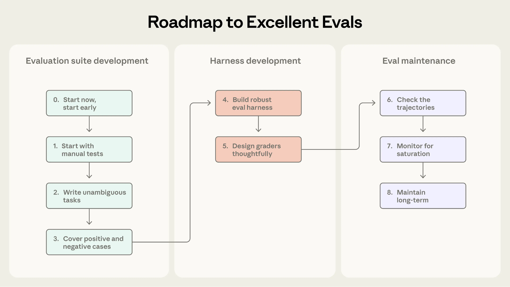

# Claude 模型详解：如何为你的用例选择最合适的模型（中英对照）

> **原文标题：** Claude models explained: choosing the best model for your use case
> **作者：** Anthropic（原文未署名）
> **原文链接：** https://claude.com/blog/claude-models-explained-choosing-the-best-model-for-your-use-case
> **发布日期：** 2026-07-24
> **翻译模型：** GLM-5.3
> 排版：每段英文原文在前，中文翻译紧随其后。术语保留英文原文并附中文释义。

---

Anthropic's guide to choosing the best Claude model for your use case — how Fable, Opus, Sonnet, and Haiku differ in intelligence, speed, and cost, and when to use each.

Anthropic 的 Claude 模型选择指南--介绍 Fable、Opus、Sonnet 与 Haiku 在智能、速度和成本上的差异，以及各自适用的时机。

One of the most frequent questions we hear is "what model should I choose for this workload?" As we have released more model classes and versions, the answer has become more nuanced.

我们最常听到的问题之一就是"这个工作负载该选哪个模型？"随着我们发布的模型类别（model class）和版本越来越多，这个问题的答案也变得更加细致。

This article covers those details including a description of each model class, the top questions to ask when selecting a model, and other best practices.

本文会详细介绍这些内容，包括每个模型类别的说明、选择模型时最值得问的几个问题，以及其他最佳实践。

But to put aside the nuance for a moment, our default recommendation is to start with the most intelligent generally available model and use effort level to dial in performance and cost.

不过先暂时放下这些细节：我们的默认建议是从最智能的正式可用（generally available）模型入手，再通过努力档位（effort level）来调节性能与成本。

Cost-per-task is often lower for more intelligent models, especially at lower effort levels, even if the price-per-token is higher. This is because more capable models often take fewer turns and less thinking time to get most tasks right. Starting with a smaller model can also make it harder to distinguish between model failures and setup failures.

即使单 token 价格更高，更智能的模型往往单任务成本（cost-per-task）更低，尤其是在较低努力档位下。这是因为能力更强的模型通常只需更少的轮次和更少的思考时间就能把大多数任务做对。而从小模型起步，还会让你更难区分模型失败与配置（setup）失败。

Of course, as use cases arise that are more latency or cost-sensitive, you can test lower tier models until you find your ideal fit.

当然，如果出现对延迟或成本更敏感的用例，你可以逐级测试更低档位的模型，直到找到最合适的那一个。

Some organizations may also choose to start with the most cost effective model and move up classes until the quality bar is met. We include both directional approaches in our documentation on model selection.

有些组织也可能选择从性价比最高的模型入手，再逐级向上切换，直到满足质量标准。这两种方向性思路都收录在我们关于模型选择的文档中。

# Claude 模型家族（The Claude model family）

The Claude model family is Anthropic's lineup of AI models — Fable, Opus, Sonnet, and Haiku — each balancing intelligence, speed, and cost differently. Choosing well means matching the model to the job.

Claude 模型家族是 Anthropic 的 AI 模型产品线--包括 Fable、Opus、Sonnet 和 Haiku--每一款都在智能、速度与成本之间做出了不同的权衡。选得好的关键，是让模型与任务相匹配。

## Mythos / Fable

Mythos is Anthropic's most capable model class, with frontier capabilities across domains. This model class is especially capable at coding, long-running agent tasks, and solving problems AI has not reliably handled before.

Mythos 是 Anthropic 能力最强的模型类别，在各领域都具备前沿（frontier）能力。这一类别尤其擅长编码、长时间运行的智能体任务，以及解决 AI 此前无法可靠处理的问题。

The Mythos class ships in two packages of the same underlying model. Claude Mythos is for trusted organizations handling dual-use cybersecurity and biology work while Claude Fable is packaged with additional safeguards that make the model safe for use by the general public. Both require limited data retention so they can be used safely.

Mythos 类别以两种打包形式发布，底层是同一个模型。Claude Mythos 面向受信任的组织，用于处理网络安全与生物领域的两用性（dual-use）工作；而 Claude Fable 则附加了更多防护措施，使模型可以安全地供公众使用。两者都要求有限数据留存（limited data retention），以确保可安全使用。

## Opus

Opus is our powerful model class for reasoning-intensive enterprise tasks. Opus models consistently rank among leading models on key industry benchmarks such as GDPval-AA for knowledge work and Terminal-Bench 2.1 for agentic coding.

Opus 是我们面向推理密集型企业任务的强大模型类别。在 GDPval-AA（知识工作）和 Terminal-Bench 2.1（智能体编码）等关键行业基准上，Opus 模型持续位居领先模型之列。

The choice between Opus and Fable may not seem clear on the surface, as both excel at coding, long-running agents, and knowledge work. In real-world situations, larger models such as Fable tend to have more wisdom, creativity, and writing skills despite having similar benchmark scores to models such as Opus.

Opus 与 Fable 之间的选择表面上可能并不分明，因为两者都擅长编码、长时间运行的智能体任务和知识工作。但在实际情况中，Fable 这类更大的模型往往更具智慧、创造力和写作功底，即便其基准得分与 Opus 等模型相近。

The general rule of thumb is if your evals or internal testing show Opus struggling on some tasks, then Fable is the answer. If Opus already clears the quality bar, then its speed and price profile may make it the better choice.

一般的经验法则是：如果你的评估（evals）或内部测试显示 Opus 在某些任务上吃力，那么答案就是 Fable；如果 Opus 已经达到质量标准，那么它在速度与价格上的优势可能使它成为更好的选择。

## Sonnet

Sonnet is our versatile model class for everyday tasks. Sonnet provides a balance of performance, cost, and speed for the widest set of general purpose use cases, including high-volume sub-agents in multi-agent orchestration setups.

Sonnet 是我们面向日常任务的多面手模型类别。Sonnet 在性能、成本与速度之间取得平衡，覆盖最广泛的一般用途场景，包括多智能体编排（multi-agent orchestration）中的大批量 subagent（子智能体）。

## Haiku

Haiku is our lowest cost and fastest model class. Haiku models are designed for high-frequency workloads where latency and cost matter.

Haiku 是我们成本最低、速度最快的模型类别。Haiku 模型专为延迟和成本敏感的高频工作负载而设计。

# 如何为你的工作负载选择最合适的 Claude 模型（How to choose which Claude model is best for your workload）

Our model classes don't specialize in one type of work. We don't recommend one model class for finance and another for science. Every Claude model is trained to excel in areas like coding, agentic tasks, and knowledge work.

我们的各模型类别并不专攻某一类工作。我们不会推荐用一个类别做金融、另一个做科学。每一款 Claude 模型都在编码、智能体任务和知识工作等方向上训练至出色水准。

The main difference across model classes is in how hard a problem they can reliably carry, and what that capability costs in price and speed. When choosing a model, ask:

各模型类别的主要差异在于它们能可靠承载多难的问题，以及这种能力在价格和速度上的代价。选择模型时，请问自己：

How hard is this task? If it typically takes a lot of time, involves multiple steps, or is previously unsolved then a more capable model class is appropriate.

任务有多难？如果它通常很耗时、涉及多个步骤，或是此前无人解决过，那么更强大的模型类别更合适。

What are the latency needs? If the model is involved in high-frequency customer facing workloads, then Sonnet is often the best choice.

延迟要求如何？如果模型用于高频的面向客户的工作负载，Sonnet 往往是最佳选择。

What are the access constraints? Mythos is only available to organizations under Project Glasswing. Not all organizations make all model classes available to all roles.

访问上有什么限制？Mythos 仅面向 Project Glasswing 项目下的组织开放。并非所有组织都会向所有角色开放全部模型类别。

What are the unit economics? Higher volumes of production may be more appropriate for lower classes of models, particularly if evaluations show those tasks are completed satisfactorily. Models are priced differently per token and will have different price-per-task costs based on their capabilities and effort level.

单位经济性（unit economics）如何？生产环境中更大的用量可能更适合较低类别的模型，尤其是当评估显示这些任务能令人满意地完成时。各模型的单 token 定价不同，且基于能力和努力档位的不同，单任务成本也会有所差异。

Effort level also impacts the balance of quality, speed, and cost. Higher-class models at higher efforts offer the best possible performance, and higher-class models at lower efforts can sometimes be more efficient than smaller models.

努力档位同样会影响质量、速度与成本之间的平衡。更高类别的模型配以更高的努力档位，可提供最佳性能；而更高类别的模型配以较低的努力档位，有时反而比更小的模型更高效。

> Curves are illustrative and not plotted from benchmark data.
> 曲线仅为示意，并非依据基准测试数据绘制。

> Curves are illustrative and not plotted from benchmark data.
> 曲线仅为示意，并非依据基准测试数据绘制。

To learn more read Choosing a Claude model and effort level in Claude Code.

想了解更多，请阅读《Choosing a Claude model and effort level in Claude Code》（在 Claude Code 中选择 Claude 模型与努力档位）。

# 用 advisor 策略组合各模型的长处（Combining models' strengths with the advisor strategy）

The advisor strategy allows faster, lower-cost worker models to call more intelligent models to check their plan and evaluate their work, leading to improved performance.

advisor（顾问）策略允许更快、更便宜的工作模型（worker model）调用更智能的模型来检查其计划、评估其工作，从而提升整体表现。

This method, where the executor model is coached only when needed, improves performance by a substantial amount. For example, on SWE-bench Pro Sonnet 5 with a Fable 5 advisor is within 10% of Fable 5's score at 63% of the price of using Fable 5 for the whole task.

这种只在需要时才让执行模型获得"指导"的方法，能大幅提升表现。例如在 SWE-bench Pro 上，配备 Fable 5 advisor 的 Sonnet 5 得分与 Fable 5 相差不到 10%，而价格仅为全程使用 Fable 5 的 63%。

# 评估与基准测试如何帮助选择模型（How evals and benchmarks help with model choice）

Two common ways to see if model capabilities are sufficient for your needs are to use standard benchmarks and custom evaluations.

判断模型能力是否满足需求，常见方法有两种：使用标准基准测试（benchmarks）和自定义评估（evaluations）。

Benchmarks are a set of pre-determined tasks or scenarios, often for a specific domain, with known solutions. These can be helpful directional guides for evaluating capabilities across model classes and providers. The challenge arises when evaluating powerful models, such as Opus and Fable, which can solve almost all of the questions on the test (often referred to as saturation).

基准测试是一组预先确定的任务或场景，通常针对特定领域并带有已知答案。它们可以作为方向性参考，帮助评估不同模型类别和供应商的能力。但评估 Opus、Fable 这类强大模型时会遇到挑战：它们几乎能解出测试中的所有题目（通常称为"饱和"，saturation）。

In these cases, we recommend organizations use the models on real workloads or test them with their own evaluations to make a decision on which model is the right choice. Typically, evaluations are a curated set of problems drawn from production — including difficult tasks where your current tools fall short, with success criteria your team defines.

在这些情况下，我们建议组织用真实工作负载试用模型，或用自建的评估来测试，再决定哪个模型是正确选择。评估通常是精选自生产环境的一组问题--包括现有工具难以胜任的困难任务--并由你的团队定义成功标准。

This is where the capability and creativity of frontier models start to separate from the pack and from one another. We've written extensively on the best practices for developing custom agent evaluations.

正是在这里，前沿模型的能力与创造力开始与其他模型拉开差距，并且彼此之间也分出高下。关于构建自定义智能体评估的最佳实践，我们已撰写过大量内容。

# 做出聪明选择（Making the smart choice）

There is no one-size-fits-all approach to AI model selection, which is why we make multiple model classes available. Ultimately, the best way to select a model is to understand the basics of each model class and understand your use case in-depth. That means building, maintaining, and deploying strong evaluations.

AI 模型选择没有放之四海而皆准的方案，这也是我们提供多个模型类别的原因。归根结底，选择模型的最佳方式是理解每个模型类别的基本特性，并深入理解你的用例。这意味着要构建、维护并部署强有力的评估。
